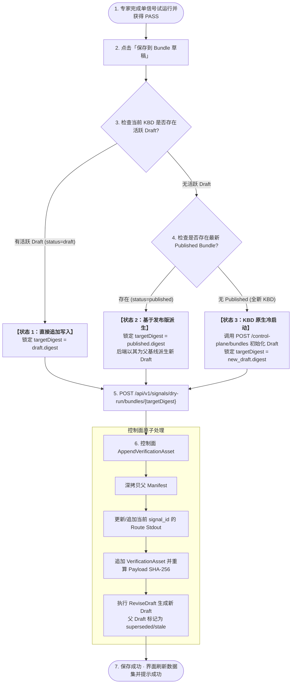

# 单信号试运行保存三级状态机与资产沉淀详细设计

> **文档状态**：架构与交互详细设计（2026-09-01）  
> **核心原则**：第一性原理拆解 + 对抗性审查  
> **适用范围**：Signal 试运行（Dry-run）、验证资产（Verification Assets）沉淀、Bundle Draft 自动派生与状态机治理  

---

## 1. 背景与核心问题定义

在 HCI 排障知识库（KBD）的演进与调试过程中，排障专家对 Signal 的调试是一个**渐进式、单信号逐个攻坚**的过程：
1. 专家在前端打开某个 Signal 的试运行弹窗，提供样例数据并运行；
2. 试运行得出 `PASS` 结论后，专家期望**一键将该信号的输出与验证证据沉淀到工作区**；
3. 用户的心智模型是纯粹且聚焦的：**“只管调通当前信号并保存，不要强迫我手动切换到 Bundle 工厂创建草稿，也不要破坏我之前调试好的其他信号”**。

在底层架构中，Bundle 是由 Manifest 编译的不可变内容寻址快照（Content-Addressed Snapshot），且具有 `draft`、`validated`、`approved`、`published`、`stale`、`retired` 等状态。前端交互与后端控制面必须在底层无缝屏蔽状态复杂度，提供**一键智能暂存（Auto-provisioning & Upsert）**。

---

## 2. 第一性原理推导（First Principles Derivation）

### 2.1 实体与状态的本质事实

* **事实 1（工作区的唯一载体是 Draft）**：
  线上生产环境的 `published` 快照是冻结且只读的，任何修改和测试资产追加都必须落在可编辑的沙箱中，即 `Draft`。
* **事实 2（渐进式调试的本质是单信号 Upsert）**：
  专家调试单信号 `sig_A` 并保存时，系统的物理动作是：
  $$\text{NewManifest} = \text{ParentManifest} \oplus \{ \text{Route}(sig\_A) \leftarrow \text{NewStdout} \} \cup \{ \text{VerificationAsset}(sig\_A) \}$$
  即：**匹配到 `signal_id` 则替换 Route Stdout，未匹配则追加 Route，父快照中其余所有 Signal、Mock 输出与历史资产 100% 保持不变**。
* **事实 3（工作区寻址的三级自然状态机）**：
  当用户触发“保存到草稿”时，系统寻址目标 Draft 的优先级必须遵循最自然的递进逻辑：
  1. **已有活跃 Draft？** $\rightarrow$ 直接作为写入目标，将修改追加到当前 Draft 演进链；
  2. **无 Draft 但有 Published 版本？** $\rightarrow$ 自动以最新发布的 Published Bundle 为父基线，派生（Revise）出新 Draft 再写入；
  3. **无 Draft 且无 Published 版本（冷启动）？** $\rightarrow$ 自动基于当前 KBD ID 触发初始 Compile 创建初始 Draft 再写入。

---

## 3. 三级状态机流转与执行架构



---

## 4. 关键算法与代码实现契约

### 4.1 前端状态寻址策略（`SignalDryRunDialog.vue`）

前端 `saveToBundle` 负责在用户点击时按优先级精准推导目标 Digest：

```ts
// 1. 查询当前 support_id 下的所有 Bundles
const listed = await fetch(`/api/hci-sim/v1/control-plane/bundles?support_id=${encodeURIComponent(props.supportId)}`)
const listBody = await listed.json()
const targetRevision = typeof props.kbdRevision === 'number' ? props.kbdRevision : null
const targetPackage = props.packageSnapshotDigest || null

// 2. 状态 1 检查：查找同 Revision 下的活跃 Draft
let drafts = listBody.bundles.filter((item) => {
  if (item.status !== 'draft') return false
  if (targetPackage && item.package_snapshot_digest !== targetPackage) return false
  if (!targetPackage && targetRevision !== null && item.kbd_revision !== targetRevision) return false
  return true
})
let targetDigest = drafts[0]?.digest || null

// 3. 状态 2 检查：无 Draft 时查找同 Revision 下的 Published Bundle
if (!targetDigest) {
  const publishedBundle = listBody.bundles.find((item) => {
    if (item.status !== 'published') return false
    if (targetPackage && item.package_snapshot_digest !== targetPackage) return false
    if (!targetPackage && targetRevision !== null && item.kbd_revision !== targetRevision) return false
    return true
  })

  if (publishedBundle?.digest) {
    targetDigest = String(publishedBundle.digest)
  } else {
    // 4. 状态 3：冷启动创建全新 Draft
    const created = await fetch('/api/hci-sim/v1/control-plane/bundles', {
      method: 'POST',
      headers: { 'Content-Type': 'application/json' },
      body: JSON.stringify({
        support_id: props.supportId,
        kbd_revision: targetRevision || 1,
      }),
    })
    const createdBundle = (await created.json())?.bundle
    targetDigest = String(createdBundle.digest)
  }
}

// 5. 统一向 targetDigest 提交资产追加
await fetch(`/api/v1/signals/dry-run/bundles/${encodeURIComponent(targetDigest)}`, {
  method: 'POST',
  headers: { 'Content-Type': 'application/json' },
  body: JSON.stringify({
    dry_run: lastDryRunRequest.value,
    preview_token: previewResult.value?.preview_token,
    preview_result: previewResult.value,
  }),
})
```

### 4.2 后端单信号 Upsert 算法与不可变演进（`hci_sim/cmd/hci-sim/controlplane_api.go`）

在控制面处理 `POST /bundles/{digest}/verification-assets` 时：

1. **父 Manifest 继承**：读取 `parent.Manifest`（包含全部已有 Routes 与历史资产）；
2. **单信号 Stdout 更新（Upsert）**：
   ```go
   func updateRouteStdout(manifest *fixture.Manifest, signalID string, routeID string, stdout string) (string, error) {
       for i := range manifest.Routes {
           if (routeID != "" && manifest.Routes[i].ID == routeID) || (signalID != "" && manifest.Routes[i].SignalID == signalID) {
               manifest.Routes[i].Result.Stdout = stdout
               return manifest.Routes[i].ID, nil
           }
       }
       // 未匹配则追加新 Route
       newID := fmt.Sprintf("route-%s", signalID)
       manifest.Routes = append(manifest.Routes, fixture.Route{
           ID: newID, SignalID: signalID, Result: fixture.ExecutionResult{Stdout: stdout, ExitCode: 0},
       })
       return newID, nil
   }
   ```
3. **不可变编译生成新 Draft**：调用 `ReviseDraft`，将父 Draft 状态标记为 `stale`，新 Draft 状态设为 `draft`；
4. **幂等激活防死锁**：若编译时遇到指纹相同的 `stale` 或 `retired` 对象，控制面自动就地重新激活为 `draft`，防止不可写死锁。

---

## 5. 对抗性审查（Adversarial Review & Edge Cases）

| 潜在风险 / 边界条件 | 攻击场景推演 | 系统级防御与加固措施 |
| :--- | :--- | :--- |
| **1. 全新信号保存（Draft 中暂无该 Signal）** | 用户在草稿中调试刚刚新建的 Signal，若前端严格校验 `route_sources` 是否存在该 `signal_id`，会导致误判为“无 Draft”并重新派生。 | **边界修复**：识别活跃 Draft 时仅按 `support_id` 与 `kbd_revision` 过滤，取消对 `route_sources` 的预先包含断言；后端采用 Upsert 自动追加新 Route。 |
| **2. 并发多次快速点击保存** | 工程师快速连点“保存”按钮，或多标签并发调试，可能导致多次异步请求覆盖父基线。 | **双重防护**：<br>1. 前端按钮绑定 `saveLoading` 遮罩，请求完成前禁用二次触发；<br>2. 接口支持 `Idempotency-Key` 与签名 `preview_token` 校验。 |
| **3. 历史 Stale 对象导致的死锁** | 反复保存产生多条历史草稿，同指纹对象落库为 `stale`，后续再次 Compile 命中只读对象报错。 | **控制面就地激活**：`controlplane.go` 与 `bundle_registry.go` 在 Compile 匹配到 `stale/retired` 时，直接执行 `UPDATE status = 'draft'` 重新激活。 |
| **4. 生产环境静默发布破坏** | 担心调试过程中的 Draft 保存直接污染线上环境。 | **强门禁隔离**：`ReviseDraft` 生成的对象严格锁定为 `draft` 状态，必须经过 `Validate -> Expert Approve -> Security Approve -> Publish` 门禁链方可激活。 |

---

## 6. 验证保障与测试矩阵

1. **冷启动测试**：无任何 Draft 与 Published 时，成功创建初始 Draft 并写入（`SignalDryRunDialog.spec.ts`）；
2. **草稿复用测试**：存在已有 Draft 时，直接复用该 Draft 并追加资产，不创建新 Draft（`SignalDryRunDialog.spec.ts`）；
3. **全新信号追加测试**：向不包含当前 Signal 的已有 Draft 保存时，正确命中该 Draft 并写入（`SignalDryRunDialog.spec.ts`）；
4. **发布态自动派生测试**：无 Draft 但有 Published 时，以 Published 为基线调用派生写入（`SignalDryRunDialog.spec.ts`）；
5. **控制面 QKV / QFK Route 更新测试**：单信号保存后 Route Stdout 准确定向更新且其他 Route 保持不变（`controlplane_api_test.go`）。
