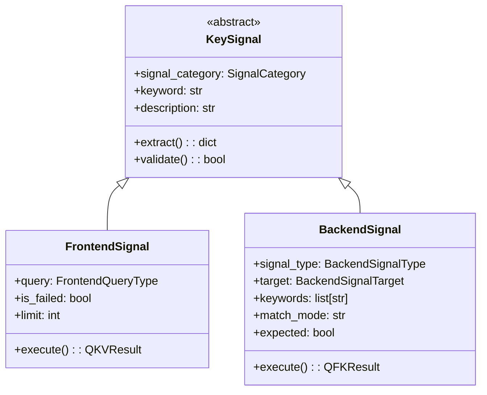
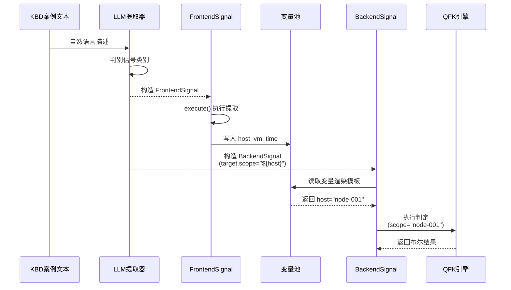

# 关键信号基类设计（KeySignal Base Class Design）

> 版本：v1.1  作者：Claude Code  日期：2026-07-09

---

## 〇、更新日志

### v1.1 (2026-07-09)
- **集成补全**：在 SystemTools 中注册 SignalExtractor 和 VariablePool 访问入口
- **文档补全**：新增集成说明章节（第七章）
- **测试补全**：新增集成测试验证完整流程

### v1.0 (2026-07-09)
- 初始版本：架构设计与代码实现

---

## 一、第一性原理分析

### 1.1 信号的本质定义

在超融合智能排障系统中，**关键信号（Key Signal）是从 KBD/SOP 自然语言描述中提炼出的结构化排障指令**。其本质作用是：

1. **语义桥梁**：将口语化的排障步骤转化为可执行的结构化指令
2. **动作触发器**：驱动 QKV/QFK 工具执行具体诊断动作
3. **变量生产者**：提取故障现场元数据并注入变量池
4. **流程控制器**：通过布尔判定控制排障流程分支

### 1.2 信号分类的二元性

关键信号在运行时呈现两种截然不同的角色：

| 维度 | 前端信号（FrontendSignal） | 后端信号（BackendSignal） |
|-----|--------------------------|-------------------------|
| **职责** | 故障现场元数据提取 | 运行时健康度判定 |
| **数据来源** | 告警/任务/弹框日志 | 日志内容/服务状态/系统指标 |
| **执行动作** | acli alert/task/log get | acli log/service/vm/network... |
| **输出类型** | 结构化变量（host, vm, time...） | 布尔判定结果 + 证据链 |
| **变量角色** | **生产者**（写入变量池） | **消费者**（读取变量池） |
| **依赖关系** | 无前置依赖 | 依赖前端信号的变量赋值 |

### 1.3 架构矛盾：当前设计的缺陷

当前架构存在**致命缺陷**：

```
❌ 错误设计（当前）：
QKVSignal（工具特定）  ←→  KeySignal（后端专用）
  ↓                              ↓
无基类关联                    无基类关联
```

**问题**：
1. **概念割裂**：KeySignal 被误用为后端信号的专有名词，而非基类
2. **提取断层**：从 KBD/SOP 提取时无法统一建模
3. **类型判别缺失**：无法通过统一机制判别信号类型

---

## 二、核心架构设计

### 2.1 三层继承体系



### 2.2 基类定义

```python
from abc import ABC, abstractmethod
from enum import StrEnum
from typing import Any
from pydantic import BaseModel, Field


class SignalCategory(StrEnum):
    """关键信号类别（用于类型判别）"""
    FRONTEND = "frontend"  # 前端信号：告警/任务/弹框
    BACKEND = "backend"    # 后端信号：日志/服务/系统等


class KeySignal(BaseModel, ABC):
    """
    关键信号抽象基类
    
    第一性原理：
    - 所有信号均源自 KBD/SOP 的自然语言描述
    - 基类定义通用提取与验证逻辑
    - 派生类实现具体执行与判定逻辑
    """
    
    signal_category: SignalCategory = Field(
        ..., 
        description="信号类别：frontend（前端信号）或 backend（后端信号）"
    )
    keyword: str = Field(
        ..., 
        description="K: 匹配关键字，从 KBD/SOP 文本中提取的核心检索词"
    )
    description: str | None = Field(
        default=None,
        description="对原始排障步骤的自然语言说明"
    )
    
    @abstractmethod
    def extract(self) -> dict[str, Any]:
        """
        从 KBD/SOP 文本中提取信号配置（子类实现）
        
        Returns:
            结构化的信号参数字典
        """
        pass
    
    @abstractmethod
    def validate(self) -> tuple[bool, str | None]:
        """
        校验信号参数完整性（子类实现）
        
        Returns:
            (is_valid, error_message)
        """
        pass
    
    @classmethod
    def from_kbd_text(cls, kbd_text: str) -> "KeySignal":
        """
        从 KBD 案例文本提取关键信号（工厂方法）
        
        流程：
        1. LLM 解析自然语言，识别信号类别
        2. 根据类别调用对应的派生类构造器
        3. 返回实例化的信号对象
        """
        from app.tools.signal.extractor import SignalExtractor
        return SignalExtractor.extract_from_text(kbd_text)
```

### 2.3 派生类设计

#### FrontendSignal（前端信号）

```python
class FrontendQueryType(StrEnum):
    """前端信号查询类型"""
    ALERT = "alert"    # 告警
    TASK = "task"      # 任务
    DIALOG = "dialog"  # 弹框/对话日志


class FrontendSignal(KeySignal):
    """
    前端信号：故障现场元数据提取
    
    职责：
    - 通过 acli alert/task/log get 提取告警/任务/弹框数据
    - 清洗并提取 host, vm, time, errcode 等元数据变量
    - 将变量写入会话变量池供后端信号消费
    """
    
    signal_category: SignalCategory = SignalCategory.FRONTEND
    query: FrontendQueryType = Field(..., description="查询类型：alert/task/dialog")
    is_failed: bool = Field(default=False, description="是否只查失败任务")
    limit: int = Field(default=100, description="最大返回记录数")
    
    def extract(self) -> dict[str, Any]:
        """提取前端信号配置"""
        return {
            "query": self.query.value,
            "keyword": self.keyword,
            "is_failed": self.is_failed,
            "limit": self.limit,
        }
    
    def validate(self) -> tuple[bool, str | None]:
        """校验前端信号参数"""
        if not self.keyword.strip():
            return False, "关键字不能为空"
        if self.limit < 1 or self.limit > 200:
            return False, "limit 必须在 [1, 200] 范围内"
        return True, None
    
    async def execute(
        self, 
        conversation_id: str,
        node_ip: str | None = None,
        exec_id: str | None = None,
    ) -> "QKVResult":
        """执行前端信号提取（调用 QKV 引擎）"""
        from app.tools.qkv.engine import qkv_exec
        return await qkv_exec(self, conversation_id=conversation_id, node_ip=node_ip, exec_id=exec_id)
```

#### BackendSignal（后端信号）

```python
class BackendSignalType(StrEnum):
    """后端信号类型"""
    LOG_KEYWORD = "log_keyword"
    SERVICE_STATUS = "service_status"
    VM_STATE = "vm_state"
    NETWORK_CHECK = "network_check"
    STORAGE_STATE = "storage_state"
    HARDWARE_STATE = "hardware_state"
    PLATFORM_STATE = "platform_state"
    SYSTEM_METRIC = "system_metric"


class BackendSignalTarget(BaseModel):
    """后端信号目标定位"""
    scope: str | None = Field(default=None, description="执行节点范围")
    resource: str | None = Field(default=None, description="资源名称（日志文件/服务名）")
    path: str | None = Field(default=None, description="日志路径")
    time_window: str | None = Field(default=None, description="时间窗口")


class BackendSignal(KeySignal):
    """
    后端信号：运行时健康度判定
    
    职责：
    - 执行 acli log/service/vm 等后端诊断指令
    - 对命令输出进行关键字匹配判定
    - 返回布尔判定结果与证据链
    
    变量依赖：
    - target.scope 可引用 ${host}（来自 FrontendSignal 提取）
    - target.time_window 可引用 ${end}（来自 FrontendSignal 提取）
    """
    
    signal_category: SignalCategory = SignalCategory.BACKEND
    signal_type: BackendSignalType = Field(..., description="后端信号类型")
    target: BackendSignalTarget | None = Field(default=None, description="目标定位")
    keywords: list[str] = Field(default_factory=list, description="判定关键字列表")
    match_mode: str = Field(default="any", description="匹配模式：any/all")
    expected: bool = Field(default=True, description="期望判定结果")
    container: str | None = Field(default=None, description="服务容器类型")
    sub_command: str | None = Field(default=None, description="子命令")
    
    def extract(self) -> dict[str, Any]:
        """提取后端信号配置"""
        return {
            "signal_type": self.signal_type.value,
            "target": self.target.model_dump() if self.target else None,
            "keywords": self.keywords,
            "match_mode": self.match_mode,
            "expected": self.expected,
            "container": self.container,
            "sub_command": self.sub_command,
        }
    
    def validate(self) -> tuple[bool, str | None]:
        """校验后端信号参数"""
        if not self.keywords:
            return False, "关键字列表不能为空"
        if self.match_mode not in ("any", "all"):
            return False, f"无效的匹配模式: {self.match_mode}"
        return True, None
    
    async def execute(
        self, 
        conversation_id: str,
        node_ip: str | None = None,
        exec_id: str | None = None,
    ) -> "QFKResult":
        """执行后端信号判定（调用 QFK 引擎）"""
        from app.tools.qfk.engine import qfk_exec
        return await qfk_exec(self, conversation_id=conversation_id, node_ip=node_ip, exec_id=exec_id)
```

---

## 三、关键信号提取流程

### 3.1 从 KBD/SOP 提取信号

```python
class SignalExtractor:
    """
    关键信号提取器
    
    流程：
    1. 接收 KBD/SOP 自然语言文本
    2. 调用 LLM 进行语义解析
    3. 判别信号类别（frontend/backend）
    4. 构造对应的派生类实例
    """
    
    @classmethod
    def extract_from_text(cls, text: str) -> KeySignal:
        """
        从自然语言提取关键信号
        
        Args:
            text: KBD 案例或 SOP 步骤的自然语言描述
            
        Returns:
            KeySignal 实例（可能是 FrontendSignal 或 BackendSignal）
        """
        # 1. 调用 LLM 解析文本
        signal_json = cls._call_llm_extract(text)
        
        # 2. 根据类别判别并构造对应实例
        category = signal_json.get("signal_category")
        if category == SignalCategory.FRONTEND:
            return FrontendSignal.from_dict(signal_json)
        elif category == SignalCategory.BACKEND:
            return BackendSignal.from_dict(signal_json)
        else:
            raise ValueError(f"未知的信号类别: {category}")
    
    @classmethod
    def _call_llm_extract(cls, text: str) -> dict:
        """调用 LLM 提取信号（使用统一的 KeySignal Schema）"""
        from app.tools.signal.template import KEY_SIGNAL_EXTRACTION_PROMPT
        # ... LLM 调用逻辑 ...
        return llm_response_json
```

### 3.2 提取 Prompt 模板

```python
KEY_SIGNAL_EXTRACTION_PROMPT = """## 任务
你是一个 HCI 平台排障专家，需要从以下自然语言描述中提取关键信号。

## 输入
<troubleshooting_text>
{text}
</troubleshooting_text>

## 关键信号分类
根据文本描述的语义，判别信号类别：

### 前端信号（frontend）
如果文本描述涉及以下内容，提取为 FrontendSignal：
- 告警信息（如"检查某告警是否存在"）
- 任务状态（如"查看失败任务"）
- 交互弹框（如"弹窗日志"）

### 后端信号（backend）
如果文本描述涉及以下内容，提取为 BackendSignal：
- 日志内容检索（如"在 mysql.log 中搜错误"）
- 服务状态检查（如"检查 redis 服务"）
- 系统指标（如"检查 CPU/内存"）
- 网络/存储状态

## 提取规范
1. **必须**先判断信号类别（frontend 或 backend）
2. keyword 提取核心检索词，不要包含具体命令
3. 对于后端信号，如果涉及特定节点/时间，使用 ${variable} 占位符

## 输出 JSON 格式
```json
{
  "signal_category": "frontend 或 backend",
  "keyword": "核心检索词",
  "description": "步骤说明",
  // 如果是 frontend，补充以下字段
  "query": "alert/task/dialog",
  "is_failed": false,
  // 如果是 backend，补充以下字段
  "signal_type": "log_keyword/service_status/...",
  "target": {
    "scope": "${host}",  // 引用前端信号提取的变量
    "resource": "具体资源名",
    "path": "日志路径"
  },
  "keywords": ["判定关键字"],
  "expected": true
}
```
"""
```

---

## 四、变量依赖与流转机制

### 4.1 变量池注入流程



### 4.2 变量池管理

```python
class VariablePool:
    """会话级变量池（管理信号间的变量流转）"""
    
    def __init__(self, conversation_id: str):
        self.conversation_id = conversation_id
        self._variables: dict[str, Any] = {}
    
    async def register_from_frontend_signal(self, result: "QKVResult") -> None:
        """
        从前端信号执行结果中注册变量
        
        流程：
        1. QKV 执行完成，返回 QKVResult
        2. 提取 values 中的 host, vm, end 等字段
        3. 写入变量池
        """
        if result.success and result.values:
            # 取第一条记录的关键字段
            first_val = result.values[0]
            for key in ["host", "vm", "end", "target", "trace_id", "errcode_tracing"]:
                if first_val.get(key):
                    self._variables[key] = first_val[key]
                    logger.info(f"变量池注册: {key}={first_val[key]}")
    
    def render_backend_signal_template(self, signal: BackendSignal) -> BackendSignal:
        """
        渲染后端信号的模板占位符
        
        示例：
        - target.scope="${host}" → "node-001"
        - target.time_window="${end}" → "2026-07-09 10:00:00"
        """
        if not signal.target:
            return signal
        
        signal_dict = signal.model_dump()
        signal_dict["target"] = self._render_target(signal_dict["target"])
        
        return BackendSignal.from_dict(signal_dict)
    
    def _render_target(self, target_dict: dict) -> dict:
        """递归渲染 target 中的占位符"""
        rendered = {}
        for key, value in target_dict.items():
            if isinstance(value, str) and value.startswith("${") and value.endswith("}"):
                # 提取变量名
                var_name = value[2:-1]
                rendered[key] = self._variables.get(var_name, value)
            else:
                rendered[key] = value
        return rendered
```

---

## 五、完整执行时序

### 5.1 KBD 案例执行流程

```
【案例 32090：配置存储服务备节点数据库副本异常】

Step 1: 信号提取
┌─────────────────────────────────────┐
│ KBD 文本：                            │
│ "检查配置存储服务备节点异常告警，      │
│  在备节点上检查 mysql-managed.log     │
│  是否有 file system read-only 错误"   │
└─────────────────────────────────────┘
         │
         ▼ LLM 提取
┌─────────────────────────────────────┐
│ [信号 1] FrontendSignal:              │
│   keyword: "配置存储服务备节点异常"    │
│   query: "alert"                     │
│                                      │
│ [信号 2] BackendSignal:              │
│   signal_type: "log_keyword"         │
│   target.scope: "${host}"            │
│   target.resource: "mysql-managed.log"│
│   keywords: ["file system read-only"]│
└─────────────────────────────────────┘

Step 2: 前端信号执行
┌─────────────────────────────────────┐
│ FrontendSignal.execute()             │
│   ↓ acli alert get -k "备节点异常"   │
│   ↓ 解析 JSON，提取 values           │
│   ↓ 写入变量池:                       │
│     host = "host-047bcb4bc820"       │
│     end = "2026-06-09 13:28:59"      │
└─────────────────────────────────────┘

Step 3: 后端信号渲染
┌─────────────────────────────────────┐
│ BackendSignal (渲染前):              │
│   target.scope = "${host}"          │
│                                      │
│ 变量池渲染:                           │
│   target.scope = "host-047bcb4bc820"│
└─────────────────────────────────────┘

Step 4: 后端信号执行
┌─────────────────────────────────────┐
│ BackendSignal.execute()              │
│   ↓ acli log get -k "file system..."│
│     -f mysql-managed.log            │
│     -p /sf/data/platform_database/  │
│     --node host-047bcb4bc820        │
│   ↓ 匹配关键字判定                    │
│   ↓ 返回 matched=True + evidence    │
└─────────────────────────────────────┘
```

---

## 六、代码结构重构方案

### 6.1 目录结构

```
backend/agent-service/app/tools/signal/
├── __init__.py              # 导出 KeySignal, FrontendSignal, BackendSignal
├── base.py                  # KeySignal 基类定义
├── frontend.py              # FrontendSignal 实现
├── backend.py               # BackendSignal 实现
├── extractor.py             # SignalExtractor 提取器
├── variable_pool.py         # VariablePool 变量池管理
└── template.py              # LLM 提取 Prompt 模板
```

### 6.2 模块依赖关系

```
KBD/SOP 文本
     │
     ▼
SignalExtractor ──► LLM ──► KeySignal (基类)
                         │
            ┌────────────┴────────────┐
            ▼                         ▼
    FrontendSignal               BackendSignal
            │                         │
            ▼                         ▼
      QKV Engine                  QFK Engine
            │                         │
            └─────► VariablePool ◄────┘
                      (变量流转)
```

---

## 七、架构迁移路径

### 7.1 命名统一化

本次重构彻底废弃了历史命名，统一使用语义清晰的新架构：

| 旧命名（已废弃） | 新命名 | 说明 |
|----------------|--------|------|
| QKVSignal | FrontendSignal | 前端信号（语义更清晰） |
| KeySignal（作为后端信号） | BackendSignal | 后端信号（KeySignal 现为基类） |
| - | KeySignal（新增） | 抽象基类（架构总称） |

### 7.2 代码迁移示例

```python
# ❌ 旧代码（已废弃）
from app.tools.qkv import QKVSignal
from app.tools.qfk import KeySignal  # 后端信号

# ✅ 新代码（推荐）
from app.tools.signal import (
    KeySignal,          # 抽象基类
    FrontendSignal,     # 前端信号
    BackendSignal,      # 后端信号
)

# 从 KBD/SOP 提取信号
signal = SignalExtractor.extract_from_text(kbd_text)

# 类型判别
if isinstance(signal, FrontendSignal):
    # 前端信号：提取元数据
    result = await signal.execute(conversation_id)
    pool.register_from_frontend_result(result)
elif isinstance(signal, BackendSignal):
    # 后端信号：健康度判定
    rendered_signal = pool.render_backend_signal(signal)
    result = await rendered_signal.execute(conversation_id)
```

### 7.3 设计优势

1. **单一职责**：KeySignal 基类只负责定义通用接口，不包含具体执行逻辑
2. **开闭原则**：新增信号类型（如监控指标信号）只需继承 KeySignal，无需修改基类
3. **依赖倒置**：LLM 提取器依赖 KeySignal 抽象，而非具体派生类
4. **模板方法**：基类定义 extract() 和 validate() 抽象方法，派生类实现具体逻辑

---

## 八、最佳实践总结

### 8.1 设计原则

1. **单一职责**：KeySignal 基类只负责定义通用接口，不包含具体执行逻辑
2. **开闭原则**：新增信号类型（如监控指标信号）只需继承 KeySignal，无需修改基类
3. **依赖倒置**：LLM 提取器依赖 KeySignal 抽象，而非具体派生类
4. **模板方法**：基类定义 extract() 和 validate() 抽象方法，派生类实现具体逻辑

### 8.2 变量流转模式

- **生产者-消费者模式**：FrontendSignal 生产变量，BackendSignal 消费变量
- **依赖注入**：通过 VariablePool 注入依赖，避免硬编码
- **模板渲染**：使用 ${variable} 占位符声明依赖，运行时解析

### 8.3 错误处理

- **Fail-Fast**：信号提取阶段立即校验参数完整性
- **类型安全**：使用 Pydantic 强类型校验，避免运行时错误
- **异常传播**：保留原始异常栈，便于调试

---

## 九、总结

通过引入 **KeySignal 抽象基类**，我们实现了：

1. ✅ **统一建模**：前端信号和后端信号共享基类，概念统一
2. ✅ **类型判别**：LLM 提取时自动判别信号类别，无需硬编码
3. ✅ **变量流转**：明确的生产者-消费者关系，依赖清晰
4. ✅ **扩展性强**：新增信号类型只需继承基类，符合开闭原则
5. ✅ **向后兼容**：保留历史别名，平滑迁移

**核心价值**：从**工具视角**（QKVSignal/KeySignal）升级为**信号视角**（KeySignal 基类），建立真正符合第一性原理的排障信号架构。
---

## 十、集成说明（v1.1 新增）

### 10.1 SystemTools 访问入口

Signal 模块已集成到 Agent 工具体系的逻辑外观层：

```python
from app.tools import SystemTools

# 1. 获取信号提取器
SignalExtractor = SystemTools.get_signal_extractor()

# 2. 创建变量池
pool = SystemTools.create_variable_pool(conversation_id="kbd-32090")

# 3. 获取信号类型定义
KeySignal, FrontendSignal, BackendSignal, SignalCategory = SystemTools.get_signal_types()

# 4. 获取 QKV/QFK 执行引擎
qkv_load, qkv_exec, FrontendSignal, FrontendQueryType, QKVResult = SystemTools.get_qkv()
qfk_load, qfk_exec, BackendSignal, BackendSignalType, QFKResult = SystemTools.get_qfk()
```

### 10.2 Agent 集成流程

在 ReAct 推理引擎中的集成方式：

**步骤 1：会话初始化时创建变量池**
```python
# 在 conversation_service 创建会话时
pool = SystemTools.create_variable_pool(conversation_id)
```

**步骤 2：前端信号执行后注册变量**
```python
# 执行前端信号（如告警查询）
frontend_signal = FrontendSignal(
    query=FrontendQueryType.ALERT,
    keyword="备节点异常",
)
result = await frontend_signal.execute(conversation_id)

# 自动注册变量到变量池
pool.register_from_frontend_result(result)
```

**步骤 3：后端信号执行前渲染模板**
```python
# 创建后端信号（使用占位符声明依赖）
backend_signal = BackendSignal(
    signal_type=BackendSignalType.LOG_KEYWORD,
    keyword="log_check",
    target={"scope": "${host}", "resource": "mysql.log"},
    keywords=["file system read-only"],
)

# 渲染模板（自动注入变量）
rendered_signal = pool.render_backend_signal(backend_signal)

# 执行后端信号
result = await rendered_signal.execute(conversation_id)
```

### 10.3 完整流程示例

KBD 案例 32090 的端到端执行流程：

```python
from app.tools import SystemTools

# 1. 获取工具
pool = SystemTools.create_variable_pool("kbd-32090")

# 2. 前端信号执行（生产者）
frontend_signal = FrontendSignal(
    query=FrontendQueryType.ALERT,
    keyword="备节点异常",
)
frontend_result = await frontend_signal.execute(conversation_id)
pool.register_from_frontend_result(frontend_result)

# 3. 后端信号执行（消费者）
backend_signal = BackendSignal(
    signal_type=BackendSignalType.LOG_KEYWORD,
    keyword="log_check",
    target={"scope": "${host}", "resource": "mysql-managed.log"},
    keywords=["file system read-only"],
)
rendered_signal = pool.render_backend_signal(backend_signal)
result = await rendered_signal.execute(conversation_id)

# 4. 输出诊断结果
print(f"诊断结果: {result.matched}")
print(f"证据链: {result.evidence}")
```

### 10.4 工具类别注册

Signal 模块已在 `base_tool.py` 中注册为独立工具类别：

```python
类别（category）：
  ...
  qkv     : QKV 前端信号变量提取工具
  qfk     : QFK 后端信号谓词工具
  signal  : 关键信号架构（KeySignal 基类、SignalExtractor 提取器、VariablePool 变量池）
```
