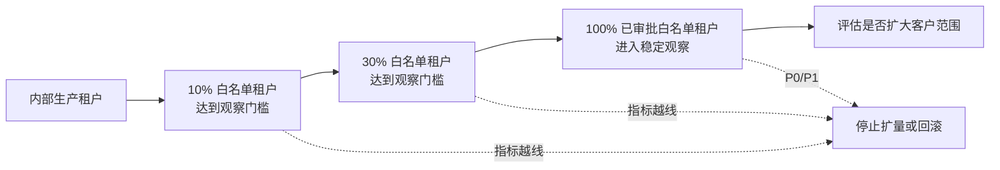

# HCI 智能排障平台初版上线推进方案

> 适用版本基线：平台 `v2.23.0`，Diagnosis Service `v0.4.0`。
> 目标：从内部测试、邀请制公测逐步推进到可正式发布的受控初版。
> 本文中的指标分为“现有硬门槛”和“建议上线阈值”；建议阈值须在启动会上确认后冻结。
> 本方案暂不设目标上线日期或固定阶段时长；待资源、依赖和样本基线明确后，再另行形成排期。

## Executive Summary（执行摘要）

- **采用阶段门禁推进，不预设固定上线日期，也不一次性全量开放。** 每个阶段只有在证据、样本量和稳定性达到门槛后，才进入下一阶段。
- **初版只承诺受控范围。** 在线诊断仅支持 Windows 桌面版 `terminal_bridge.exe`、经过审核的只读诊断和人工确认操作；离线诊断只对“虚拟机启动失败”和“磁盘/RAID 明确硬件告警”两个场景作正式效果承诺。
- **集群版 Bridge 不进入客户产品范围。** 它只用于开发、测试和验收，生产保持 Windows 桌面 Bridge 拓扑。
- **正式上线由证据决定，而不是由日期决定。** 企业身份、租户隔离、黄金案例、安全测试、Windows Bridge 兼容性、容量、告警、备份和回滚演练任一关键门禁未通过，均不得进入下一阶段。
- **初版正式上线仍采用邀请制租户白名单。** “正式上线”表示版本、支持范围、SLA 和运营流程已稳定，不等于向所有客户匿名开放。

## 1. 首版产品范围

### 1.1 首版对外承诺

| 能力     | 初版承诺                                             | 不在初版承诺内                         |
| ------ | ------------------------------------------------ | ------------------------------- |
| 工单与对话  | 创建、恢复、关闭工单；多轮诊断；历史记录                             | 匿名自助注册、跨租户协作                    |
| 在线诊断   | Windows 桌面 Bridge；SSH 密码/密钥认证；只读采集；命令结果回传；人工风险确认 | 集群版 Bridge；无人值守写操作；无限场景覆盖       |
| 离线诊断   | 单次采集、签名校验、HCIEB2 加密包、分片上传、证据评估、工程师审核报告           | 自动补采、多节点、复杂 Profile 编排、无需审核自动发布 |
| 正式效果场景 | 虚拟机启动失败；磁盘/RAID 明确硬件告警                           | 未完成黄金案例验收的其他场景                  |
| 知识与诊断  | 已审核 KBD/SOP/Tool/Skill 修订；结果可追溯                  | 未审核内容直接进入生产诊断                   |
| 恢复操作   | 提供建议；写操作逐次人工确认                                   | 自动执行高危操作、替代变更审批                 |

### 1.2 首版安全默认值

- 生产 `terminalBridge.enabled=false`，不部署集群版 Bridge；
- Windows 桌面 Bridge 是在线诊断唯一客户形态；
- 风险等级 1 的只读操作可按安全模式自动执行；
- 风险等级 2 的写操作必须逐次人工确认；
- 风险等级 3 的高危操作默认拦截；
- 离线诊断 `automaticSupplementEnabled=false`；
- 离线报告必须经过工程师审核发布，草稿不是正式客户结论；
- 仅允许租户白名单、场景白名单和受支持版本矩阵内的请求进入首版链路。

## 2. 当前基线与上线缺口

### 2.1 已具备的基础

- 已具备工单、对话、Agent、KBD/SOP、工具执行、在线 Terminal Bridge 和全链路追踪基础；
- 在线链路已有 KBD 27123 单场景、单轮 Golden E2E 证据；
- 离线链路已具备会话、计划、签名制品、HCIEB2 加密、上传、安全处理、证据评估和报告审核代码；
- 已具备 K3s、Helm、ArgoCD 双仓发布、声明式数据库迁移和发布回滚流程；
- 已具备 Prometheus、Loki、Tempo、Grafana 和结构化审计基础。

### 2.2 正式上线前仍需补齐

| 缺口 | 对上线的影响 | 完成标志 |
|---|---|---|
| Windows 桌面 Bridge 真实兼容矩阵 | 在线诊断可能在客户 Windows、浏览器或网络环境失败 | 支持矩阵全部通过，形成签名安装包、版本策略和回滚包 |
| 在线真实场景覆盖 | 单个 KBD Golden E2E 不能代表整体效果 | 首发场景完成真实/仿真校准、故障变体和连续稳定性验证 |
| 离线黄金证据集 | 无法证明两个场景的诊断效果 | 每场景不少于 30 个专家确认案例并完成盲测 |
| 企业 OIDC 与对象级授权 | 不能安全开放给外部客户 | 真实 IdP、JWKS 轮换、租户越权和工单授权演练通过 |
| KMS/签名密钥与对象存储 | 离线证据和密钥不具备生产级保护与恢复能力 | 生产供应商接入、轮换、备份、故障和恢复演练通过 |
| 容量与恶意包测试 | 大包、并发和攻击输入可能导致服务不稳定 | 接近 512 MiB、压缩炸弹、路径穿越、损坏包、并发上传全部验证 |
| SLO、告警和保留策略 | 上线后无法及时发现或追溯问题 | SLO、告警路由、值班、Loki/Tempo/证据保留与容量预警就绪 |
| 灰度与紧急开关 | 故障时只能整体回滚，影响面过大 | 支持按环境、租户、模式和场景停用，且完成演练 |

> 当前事实边界详见[离线诊断模式里程碑](../solution/agent/离线诊断模式里程碑_V2.1.md)、[KBD 27123 P0 端到端验证](../verify/events/2026-07-30-KBD27123-hci-sim-P0端到端验证.md)和[Terminal Bridge K3s 说明](terminal-bridge-k3s.md)。

## 3. 总体上线阶段

### 3.1 阶段推进顺序

| 阶段 | 用户范围 | 核心目标 | 进入下一阶段的依据 |
|---|---|---|---|
| Gate 0 | 项目组 | 生产依赖、安全、黄金集、灰度与回滚准备 | 零号门禁完成并会签 |
| Alpha | 10～20 名内部员工 | 验证主流程、易用性和明显缺陷 | 核心任务和技术成功率达到 Alpha 阈值 |
| Field Trial | 10～15 名售后/专家 | 用真实案例验证诊断质量和操作边界 | 专家确认诊断质量、安全边界和支持流程可控 |
| Closed Beta | 3～5 家客户、每家 2～5 名用户 | 验证客户网络、权限、流程和支持体系 | 关键指标在完整观察周期内稳定达标 |
| Expanded Beta | 8～15 家客户、总计不超过 100 名用户 | 验证稳定性、并发、租户隔离和运营能力 | 容量、故障恢复和运营门禁全部通过 |
| RC | 仅存量试点用户 | 功能冻结、全量回归、演练和上线评审 | 发布证据齐全，Go/No-Go 评审通过 |
| GA v1 | 经审批的生产租户 | 按白名单逐批灰度 | 每批达到观察门槛后再继续扩量 |

推进节奏由门禁结果决定，不与自然周绑定。每阶段应覆盖完整的业务运行、值班交接和复盘闭环；样本不足或存在未关闭的 P0/P1 问题时，保持当前阶段继续验证。

## 4. Gate 0：进入内测前的生产零号门禁

Gate 0 的目标不是“功能更多”，而是保证任何内测行为都可控、可追溯、可停止。

### 4.1 必须完成

#### 产品与内容

- 冻结首版功能清单、支持场景、支持 HCI 版本和已知限制；
- 冻结两个离线正式场景的 Collection Profile、KBD Revision 和 Tool Revision；
- 完成所有首发采集命令的只读性与参数边界审计；
- 明确“Confirmed/Probable/Suspected/Insufficient/Conflicted”对客户的含义；
- 在线与离线普通用户手册完成评审。

#### 身份与安全

- 接入企业 OIDC，验证登录、过期、注销、JWKS 轮换和时钟偏差；
- 验证租户 A 不能读取租户 B 的工单、会话、证据包、报告和终端记录；
- 生产密钥通过 Secret/KMS 注入，仓库、镜像、日志和浏览器构建产物中不存在密钥；
- 上传路径、文件类型、大小、哈希、解密、解压和隔离 Worker 安全测试通过；
- 完成威胁模型和 P0 安全事件响应流程评审。

#### 发布与运维

- dev → staging → prod 的 GitOps 晋级路径可执行，生产禁止 `latest` 镜像标签；
- 完成数据库备份和恢复演练，确认声明式 Schema 变更可前向兼容；
- 完成应用回滚、停止新建离线任务、暂停 Worker、停用在线执行四种演练；
- 完成核心接口、Worker、队列、上传、Bridge、AI Provider 和数据库告警；
- 冻结日志、Trace、证据包、报告和终端记录的保留/删除策略；
- 建立值班表、升级联系人和客户通知模板。

### 4.2 Gate 0 退出条件

- P0/P1 缺陷为 0；
- 高危命令绕过、跨租户访问、凭据泄漏和证据篡改成功次数均为 0；
- staging 完整部署、回滚和恢复演练通过；
- 两个首发场景各已收集不少于 30 个专家确认黄金案例；如 Gate 0 启动时尚未齐备，应明确负责人，并在进入 Field Trial 前完成冻结；
- 产品、技术、QA、SRE、安全和诊断专家共同签署进入 Alpha。

## 5. Alpha：员工内测

### 5.1 范围

- 用户：产品、研发、测试、SRE 和少量非项目组员工，共 10～20 人；
- 环境：staging，使用脱敏真实数据或仿真环境；
- Bridge：Windows 桌面版；集群版仅作为测试工具，不计入客户体验；
- 操作：风险等级 1 可自动，风险等级 2 必须确认，风险等级 3 拦截；
- 离线诊断：仅两个首发场景，工程师审核报告。

### 5.2 必测任务

1. 新用户登录并创建工单；
2. Windows Bridge 下载、启动、检测、密码/密钥连接；
3. 在线故障分类、只读命令、工具卡片、拒绝/超时和断线重连；
4. 离线任务创建、工具下载、指纹校验、采集、上传、刷新恢复和报告查看；
5. 未关闭工单恢复、终端历史、关闭工单；
6. 权限不足、错误凭据、命令不存在、上传中断和证据不足；
7. 浏览器刷新、网络抖动、服务滚动重启和 Provider 短时不可用。

### 5.3 建议退出阈值

| 指标 | Alpha 退出阈值 |
|---|---:|
| 核心任务完成率 | ≥ 85% |
| Windows Bridge 首次连接成功率 | ≥ 90% |
| 已连接后的只读命令技术成功率 | ≥ 95% |
| 离线工具生成—上传闭环成功率 | ≥ 90% |
| 严重错误诊断导致的危险建议 | 0 |
| P0/P1 未关闭缺陷 | 0 |
| P2 缺陷 | 有负责人和修复版本，不阻断核心任务 |

Alpha 阶段重在发现问题，不对外公布成功率或产品 SLA。

## 6. Field Trial：售后与诊断专家内测

### 6.1 目标

由具备 HCI 经验的售后和诊断专家验证“诊断是否可信”，而不只是验证页面能否操作。

### 6.2 测试设计

- 每个首发场景使用不少于 30 个专家确认黄金案例；
- 在线与离线使用相同 KBD Revision 做逐信号对比；
- 覆盖 positive、negative、near-miss、权限不足、超时、输出过大和证据缺失；
- 每个核心在线场景固定版本连续执行至少 20 次，保留首次失败；
- Windows 10/11、Edge/Chrome、密码/密钥、直连/跳板网络分别覆盖；
- 专家盲审诊断等级、根因、支持证据和恢复建议，不展示预期答案。

### 6.3 硬退出条件

- 在线/离线逐信号语义一致率 ≥ 99%；
- 两个正式场景的严重误诊和危险恢复建议均为 0；
- “已确认/高概率”结论必须有可追溯现场证据，证据不足时必须降级而非猜测；
- 核心 KBD 完成 20 次重复验证，无串线、无凭据泄漏、无非预期真实访问；
- Windows 桌面 Bridge 支持矩阵全部通过；
- 诊断专家签署首发 KBD/场景白名单。

## 7. Closed Beta：小规模封闭公测

### 7.1 客户选择

选择 3～5 家合作客户，每家 2～5 名用户。客户应满足：

- 有明确技术联系人和管理审批人；
- 接受试用协议、数据处理说明和已知限制；
- 能提供首发场景，且愿意在发现风险时立即停止；
- 在线试点客户具备受控 SSH 账号和 Windows Bridge 运行条件；
- 离线试点客户具备 Linux x86_64 执行节点和受控文件流转渠道。

不选择正处于重大生产事故、无回退窗口或无法提供联系人值守的客户作为首批样本。

### 7.2 开放策略

- 按租户白名单逐家开通，不开放自行注册；
- 按单客户批次逐家开通；每批达到稳定观察和复盘门槛后再开下一家；
- 每家客户限制并发工单、诊断次数和离线上传容量；
- 在线默认“安全模式”，写操作仍需人工确认；
- 离线报告发布必须由工程师审核；
- 建立专属支持通道；P0 事件立即进入应急流程，普通问题按试点支持约定响应。

### 7.3 建议退出阈值

| 指标 | Closed Beta 退出阈值 |
|---|---:|
| 核心流程成功完成率 | ≥ 90% |
| Windows Bridge 连接成功率 | ≥ 95% |
| 在线只读命令技术成功率 | ≥ 97% |
| 离线证据包安全处理成功率 | ≥ 97%（合法包口径） |
| 已发布报告中严重误诊 | 0 |
| 跨租户/凭据/高危执行安全事件 | 0 |
| 客户满意度 | ≥ 4.0/5 |
| P0/P1 未关闭问题 | 0 |

### 7.4 阶段运营评审

按固定运营节奏，由产品、QA、专家、SRE 和支持共同审查：

- 新增用户、活跃工单、在线/离线成功率；
- Bridge 失败分布、上传失败分布和 AI Provider 错误；
- 诊断等级分布、专家驳回率、证据不足率和危险建议；
- P0～P3 缺陷、平均响应时间和恢复时间；
- 客户反馈、操作困难点和手册缺口；
- 是否新增、暂停或退出试点客户。

## 8. Expanded Beta：扩大公测

### 8.1 扩大条件

只有 Closed Beta 在多个完整观察周期内持续满足退出阈值，且样本量足以支持判断，才可扩大到 8～15 家客户、总计不超过 100 名用户。

### 8.2 扩大公测重点

- 验证多租户并发、工单恢复、报告审核队列和值班交接；
- 执行 1/10/50/100 容量阶梯，分别报告 SSH 会话、Agent Run、浏览器和上传任务，不混用结论；
- 进行 Worker、Redis、PostgreSQL、对象存储、AI Provider 和网络故障演练；
- 验证日志、Trace、证据和报告保留/删除策略；
- 验证配额、限流、过载拒绝和恢复后资源回落；
- 验证一键停用某租户、某模式、某场景和某 KBD Revision。

### 8.3 建议退出阈值

| 指标 | Expanded Beta / RC 准入阈值 |
|---|---:|
| 核心 API 月度可用性（公测窗口） | ≥ 99.5% |
| HTTP 5xx | < 0.5%，且无持续上升 |
| Windows Bridge 连接成功率 | ≥ 98% |
| 在线只读命令技术成功率 | ≥ 98% |
| 合法离线包处理成功率 | ≥ 98% |
| 跨租户串线、凭据泄漏、非预期写操作 | 0 |
| 核心场景连续 20 次稳定性 | 全部完成，首次失败均有结论 |
| 100 用户/任务容量声明 | 仅在独立容量报告通过后允许声明 |
| P0/P1 未关闭问题 | 0 |
| 客户满意度 | ≥ 4.2/5 |

如果样本量不足，应写“样本不足，继续观察”，不得因为比例好看而提前进入 RC。

## 9. RC：候选版本冻结与上线评审

### 9.1 冻结规则

- RC 阶段不再加入新功能、场景、KBD、Tool 或依赖升级；
- 只接受 P0/P1 修复以及明确批准的 P2 修复；
- 每个修复必须重新运行受影响的在线、离线、安全和回滚测试；
- 固定代码 SHA、镜像标签、Chart、环境 values、数据库 Schema、KBD Revision 和模型配置；
- 生成发布证据清单，任何运行结果都能追溯到固定版本。

### 9.2 RC 必须通过的检查

- 全量 CI、契约、前端构建、Helm lint/render、数据库迁移测试；
- 两个首发场景黄金案例盲测；
- Windows Bridge 支持矩阵、签名、下载、升级和旧版拒绝策略；
- 接近 512 MiB 合法包、恶意包和并发上传；
- 登录、租户越权、工单越权、令牌过期和密钥轮换；
- staging 生产等价部署、完整稳定观察、回滚和数据库恢复；
- 值班、客户通知、状态页、支持手册和升级联系人演练；
- 法务/安全确认数据处理说明和试用协议可转为正式版本。

### 9.3 Go/No-Go 评审

| 角色 | 必须签署的内容 |
|---|---|
| 产品负责人 | 首版范围、客户名单、已知限制和商业承诺 |
| 技术负责人 | 代码、架构、迁移和技术债边界 |
| QA 负责人 | 回归、黄金案例、兼容性和容量证据 |
| 诊断专家 | 首发 KBD、结论质量和恢复建议 |
| SRE/运维 | 部署、监控、值班、备份和回滚 |
| 安全负责人 | 身份、隔离、密钥、上传和事件响应 |
| 客户支持负责人 | 客户通知、支持 SLA、FAQ 和升级流程 |

任一必签角色给出 No-Go，版本不得进入生产灰度。

## 10. GA v1：初版正式上线

### 10.1 生产灰度顺序

每一步扩量都需要产品、SRE、QA 三方确认；安全事件还必须由安全负责人确认。观察窗口内不发布无关功能。

### 10.2 初版发布声明必须写清

- 支持的 HCI 产品版本；
- 正式支持的两个诊断场景；
- 在线诊断要求 Windows 桌面 Bridge 和 SSH 网络条件；
- 离线诊断要求 Linux x86_64，单包上限 512 MiB；
- 诊断结论的等级含义和工程师审核边界；
- 数据采集范围、加密、保留和删除方式；
- 已知限制、支持时间和故障升级渠道；
- 写操作仍需客户审批，平台不替代变更管理。

### 10.3 上线后稳定观察期

- 初期提高运营评审频率，指标稳定后逐步转为常态评审；
- 稳定期内不默认扩展新正式场景；
- 新 KBD 先进入影子验证或专家审核，不直接扩大产品承诺；
- 每个 P0/P1 事件均须及时完成初步复盘，并在继续扩量前关闭阻断项；
- 当样本量、关键指标、值班和支持流程均达到稳定期退出门槛后，再决定进入常态运营、继续限制范围或回退 Beta。

## 11. 指标体系与统计口径

### 11.1 北极星指标

**有效诊断闭环率**：进入受支持场景的工单中，最终获得“有可追溯证据、经规则允许且被用户/工程师接受”的诊断或明确的证据不足结论的比例。

“有回复”不等于“有效闭环”；无证据猜测、工具未真实执行、报告未审核均不计入成功。

### 11.2 核心指标

| 维度 | 指标 | 口径 |
|---|---|---|
| 产品 | 核心任务完成率 | 完成创建工单到获得诊断/证据不足结论的用户占比 |
| 在线 | Bridge 连接成功率 | 有效连接尝试中收到稳定 `ssh_connected` 的比例 |
| 在线 | 命令技术成功率 | 已发送只读命令中获得可解析 `exec_result` 的比例，不把业务未命中算技术失败 |
| 离线 | 采集闭环成功率 | 工具生成后成功产生并上传合法 `.hci-eb` 的任务比例 |
| 离线 | 合法包处理成功率 | 通过客户端格式约束的合法包中成功完成安全处理的比例 |
| 质量 | 严重误诊率 | 专家判定会导致错误高风险处置的正式结论占比 |
| 质量 | 证据不足正确降级率 | 必需证据不足时正确返回 Insufficient/UNKNOWN 的比例 |
| 安全 | 越权/泄漏/高危绕过 | 事件数，目标必须为 0 |
| 稳定性 | API 可用性、5xx、P95 | 按环境和服务分别统计，不用总体平均掩盖单服务问题 |
| 运营 | 工程师审核时长、支持响应时长 | 从进入审核/告警到首次有效处理的时长 |
| 体验 | 客户满意度 | 完成诊断后的 1～5 分反馈，不以未完成用户为分母 |

所有指标必须同时保留分子、分母、环境、租户、模式、场景和版本。样本量过小时只展示原始数量，不发布百分比结论。

## 12. 缺陷分级与阶段停止规则

| 等级 | 示例 | 响应要求 | 阶段动作 |
|---|---|---|---|
| P0 | 跨租户数据、凭据泄漏、未授权高危命令、证据篡改被接受、数据不可恢复 | 立即响应 | 全部停止，关闭入口，进入安全事件流程 |
| P1 | 核心流程持续不可用、严重误诊、合法证据普遍无法处理 | 立即升级处理 | 停止扩量，必要时回滚 |
| P2 | 有替代路径的功能缺陷、单一兼容环境失败 | 尽快确认并纳入当前阶段修复 | 限制受影响范围，设定修复版本 |
| P3 | 文案、布局、低影响体验问题 | 进入迭代 | 不单独阻断，集中修复 |

阶段期间出现任一 P0，当前阶段立即失败；出现 P1 后必须停止新增用户，修复并重新完成一个完整稳定观察周期。

## 13. 灰度开关和降级设计

正式公测前必须具备以下控制面；如果当前代码尚无对应租户级开关，应作为 Gate 0 开发项：

- 全局平台只读模式；
- 在线诊断总开关；
- 离线诊断总开关；
- 按租户启停；
- 按场景/HCI 版本启停；
- 按 KBD Revision/Tool Revision 撤销；
- 在线自动执行开关；
- 离线新任务、制品生成、上传和 Worker 分别暂停；
- 报告生成与客户发布分别暂停；
- AI Provider 降级为人工支持或静态提示。

推荐降级顺序：

1. 关闭新用户和新租户；
2. 关闭风险操作，只保留只读诊断；
3. 暂停新离线任务和新上传，保留已有记录查询；
4. 暂停 AI 自动结论，转工程师审核；
5. 全局只读；
6. GitOps 回滚到上一稳定版本。

## 14. 回滚和数据保护

### 14.1 应用回滚

应用版本按现有[发布指南](发布指南.md)使用环境仓库 `git revert` 回退，ArgoCD 同步上一稳定镜像；紧急情况下使用 Helm 回滚，事后尽快恢复 GitOps 一致性并在发布记录中留痕。

### 14.2 数据库回滚边界

- 首版发布范围内只允许向后兼容的 Schema 变更；
- 字段删除、类型破坏性变更采用“先增、双写/兼容、后删”的多版本流程；
- 应用回滚不依赖删除新表或新列；
- 每次生产迁移前完成快照，并验证实际恢复时间；
- 无法证明可恢复的数据库变更不得随 RC 发布。

### 14.3 在线诊断紧急处置

- 立即关闭新 SSH 连接和自动执行；
- 保留工单、对话和审计查询为只读；
- 停止分发问题 Bridge 版本，恢复上一签名版本；
- 撤销问题 KBD/Tool Revision；
- 如涉及凭据泄漏，通知客户轮换 SSH 凭据并进入安全事件流程。

### 14.4 离线诊断紧急处置

- 停止新建会话、生成制品或接收上传；
- 暂停 Worker，隔离待处理包，不删除客户原始证据；
- 撤销问题采集制品和签名密钥；
- 保持已发布报告和审计记录可查询；
- 恢复后通过幂等任务继续处理，不重复生成正式结论。

## 15. 组织分工

| 工作 | 产品 | 技术 | QA | 专家 | SRE | 安全 | 支持 |
|---|---|---|---|---|---|---|---|
| 首版范围与客户名单 | A/R | C | C | C | C | C | C |
| 功能与架构交付 | C | A/R | C | C | C | C | I |
| 测试计划与独立验收 | C | C | A/R | C | C | C | I |
| 黄金案例与诊断质量 | C | C | C | A/R | I | C | C |
| 部署、监控、备份、回滚 | I | C | C | I | A/R | C | I |
| 威胁模型与安全事件 | C | C | C | I | C | A/R | I |
| 客户培训与问题升级 | A | I | I | C | C | C | R |

`A` 为最终负责，`R` 为执行负责，`C` 为会签，`I` 为知会。
TODO：AI要加入到组织分工中

## 16. 上线检查清单

### 16.1 进入 Closed Beta 前

- [ ] Gate 0、Alpha、Field Trial 全部签署通过；
- [ ] Windows Bridge 支持矩阵与签名安装包冻结；
- [ ] 两个场景黄金案例和在线/离线一致性通过；
- [ ] 企业身份、租户隔离、密钥和上传安全通过；
- [ ] 客户协议、用户手册、数据说明和支持联系人就绪；
- [ ] 租户/模式/场景开关和 P0 停止流程演练通过。

### 16.2 进入 RC 前

- [ ] Closed Beta 在多个完整观察周期内持续达到阈值，且样本量足够；
- [ ] Expanded Beta 容量、故障和恢复演练通过；
- [ ] P0/P1 为 0；
- [ ] 所有 P2 有负责人、影响范围、临时方案和目标版本；
- [ ] 生产配置、镜像、Chart、Schema、KBD 和模型配置冻结；
- [ ] 备份恢复、GitOps 回滚和值班演练通过。

### 16.3 正式上线前

- [ ] Go/No-Go 全角色签字；
- [ ] 发布说明、支持范围和已知限制已发给客户；
- [ ] 生产只使用不可变镜像标签；
- [ ] 生产 `terminalBridge.enabled=false`；
- [ ] 生产 Diagnosis Service 使用真实 OIDC、密钥和存储配置；
- [ ] 监控、告警、状态页和客户通知渠道工作正常；
- [ ] 10% → 30% → 100% 白名单租户名单和观察人已确定；
- [ ] 上一稳定版本、回滚命令和数据恢复联系人已确认。

## 17. 仍需在启动会上确认的问题

1. 企业 OIDC、KMS 和对象存储的具体供应商、当前接入状态、依赖和负责人是什么？
2. 首版支持哪些 HCI 版本、Windows 版本和浏览器版本？
3. 两个首发场景各 30 个黄金案例由谁提供、谁标注，并在哪个阶段完成冻结？
4. 客户数据、终端记录、证据包、Trace 和报告各保留多久？
5. 公测客户的支持时段和分级响应机制是否有人力保障？
6. 初版正式上线是单一私有化客户、区域租户白名单，还是统一 SaaS 入口？
7. 建议指标是否需要按客户 SLA、基础设施容量和模型成本调整？

这些问题不影响启动 Gate 0，但必须在进入 Closed Beta 前全部形成书面决策。

## 18. 假设与限制

- 本方案依据 2026-08-12 仓库代码和文档基线制定，不代表生产环境已完成配置；
- 本方案不预设固定日历排期；实际节奏取决于身份、KMS、对象存储、黄金案例和客户试点资源的准备情况；
- 表内百分比是建议上线阈值，需在 Gate 0 启动会上根据样本量、客户 SLA 和容量基线批准；
- 100 名用户不等同于 100 个并发 Agent、100 个浏览器或 100 条 SSH 会话，容量声明必须分别验证；
- 初版只对明确列入白名单的场景、版本、租户和 KBD Revision 作承诺；
- 平台输出是辅助诊断建议，不能替代客户变更审批、备份和回退流程。

## 19. 配套文档

- [在线诊断普通用户使用手册](../user-guide/terminal_bridge在线诊断普通用户使用手册.md)
- [离线诊断普通用户使用手册](../user-guide/离线诊断普通用户使用手册.md)
- [发布指南](发布指南.md)
- [生产环境部署指南](部署指南.md)
- [Terminal Bridge K3s 测试部署说明](terminal-bridge-k3s.md)
- [离线诊断模式里程碑](../solution/agent/离线诊断模式里程碑_V2.1.md)
- [产品级验证与规模化运营验证方案](../verify/events/2026-08-05-hci-sim阶段E产品级验证与规模化运营验证方案.md)
