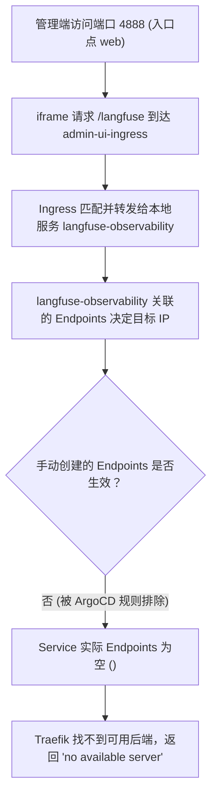

# 2026-07-09 可观测性内嵌控制台内网隔离失效故障分析与修复复盘

## 1. 故障现象

实施「Admin UI 内网隔离方案」（管理端切换至独立端口 4888/3888，对应 Traefik `web` 入口点）后，管理员访问 `https://acli.sangfor.com.cn:4888/admin/observability` 时，内嵌的 **Langfuse** 控制台显示 `"no available server"` 报错，无法正常加载。

---

## 2. 根因链分析

该故障的完整根因链条如下：

### 2.1 修复尝试的历史缺陷

在排查解决过程中，曾连续提交三次修复尝试（PR #499、#500、#501），但由于设计上的硬伤导致全部失效：

1.  **PR #499（服务跨命名空间语法违规）**：
    在 `hci-staging` 命名空间的 Ingress `backend.service.name` 中直接填写跨命名空间 FQDN `langfuse-server.hci-observability.svc.cluster.local`。这违反了 Kubernetes Ingress 标准规范（服务名只能是符合 DNS-1035 的标识符，且必须与 Ingress 处于同一命名空间），被 Ingress Controller 报错并忽略。
2.  **PR #500（ExternalName 局限性）**：
    创建本地 `ExternalName` 类型 Service 代理跨命名空间 FQDN。然而，Traefik Ingress controller 默认不支持 `ExternalName` 服务作为 Ingress 的后端，因为 ExternalName 不产生 Kubernetes `Endpoints`，Traefik 无法为其构建后端 upstream 服务列表，导致 503 报错或降级退回。
3.  **PR #501（ArgoCD 排除 Endpoints 策略 & IP 硬编码）**：
    为了给 headless service 创建 Endpoints，手动声明了 `Endpoints` 资源，并硬编码了 ClusterIP（`10.43.204.157`）。这遇到了两个致命问题：
    *   **ArgoCD 同步排除**：GitOps 环境中，ArgoCD 配置了 `ExcludedResourceWarning`，全局排除了 `Endpoints` 资源的同步与应用：
        > `Resource /Endpoints langfuse-observability is excluded in the settings`
        
        这导致手动 Endpoints 资源在部署时被丢弃，Service 依然没有后端（即 `(<none>)`），表现为 `"no available server"`。
    *   **ClusterIP 硬编码反模式**：ClusterIP 是 Kubernetes 动态分配的，在不同环境（Staging vs. Prod）必然不同，且服务一旦重建 ClusterIP 即会漂移，硬编码 ClusterIP 极大损害了 Chart 的可移植性与健壮性。
    *   **缺失中间件**：`admin-ui-ingress` 在转发 `/langfuse` 时未经过 `hci-observability` 命名空间下的 `stripPrefix` 与 `headers` 中间件，即使网络打通也会因未剥除 `/langfuse` 前缀而 404，或因 `X-Frame-Options` 限制导致浏览器白屏拦截。

---

## 3. 正确的设计方案（第一性原理）

Kubernetes Ingress 规范虽然限制了 Ingress 不能跨命名空间绑定 Service，但 **Traefik Ingress controller 默认是扫描全命名空间下的 Ingress 资源并进行规则合并的**。

因此，实现跨命名空间路由的标准且唯一的正确方法是：
**直接在服务所在的命名空间（`hci-observability`）中定义 Ingress 规则，并将其声明绑定到 Admin UI 对应的入口点上（`web` entrypoint）**。

这样能够带来如下优势：
1.  **架构纯净**：无需在应用命名空间（`hci-staging`）下创建任何伪造的代理 Service 与 Endpoints。
2.  **安全合规**：能完美且直接地复用 `hci-observability` 命名空间下已有的 `stripPrefix` 和 `headers` 中间件（Middlewares）。
3.  **零硬编码**：路由直接通过 Kubernetes 内部服务名进行服务发现，不依赖易变的 IP。

---

## 4. 修复实施内容

### 4.1 回滚应用侧 chart 修改 (`hci-platform`)
1.  物理删除 `deploy/helm/hci-platform/templates/admin-ui/observability-services.yaml`。
2.  编辑 `deploy/helm/hci-platform/templates/admin-ui/ingress.yaml`，移除所有关于 `/grafana`、`/langfuse` 及相关静态资源和 API 的路由转发规则，使 Ingress 仅包含 admin-ui 本身、API 网关（`/api`）和 WebSocket（`/ws`）。

### 4.2 修改可观测性侧 Ingress 配置 (`hci-platform-obs`)
1.  **Grafana Ingress (`deploy/helm/hci-platform-obs/templates/ingress.yaml`)**：
    修改 annotations，当启用 TLS 时，将 `traefik.ingress.kubernetes.io/router.entrypoints` 变更为 `websecure,web`，使 Grafana Ingress能同时在公共端口（4443）和隔离管理端口（4888/3888）上生效。
2.  **Langfuse Ingress (`deploy/helm/hci-platform-obs/templates/ingress-langfuse.yaml`)**：
    同上，修改 annotations 将入口点变更为 `websecure,web`。

---

## 5. 验证与复盘启示

*   **避坑启示**：涉及跨命名空间服务调用或暴露时，优先考虑利用 Ingress controller 扫描全命名空间并进行规则合并的能力，而非在应用命名空间伪造 Service 代理；
*   **GitOps 约束**：ArgoCD 等 GitOps 工具为了防止脑裂和状态冲突，通常会禁用对 `Endpoints` / `EndpointSlice` 资源的直接操作。在编写 Helm templates 时应避免手动管理 Endpoints 资源；
*   **严禁 IP 硬编码**：绝对不能在 Helm Chart 或 K8s 资源 definition 中硬编码 ClusterIP 或 Pod IP，所有服务依赖必须通过 K8s 原生 DNS 服务发现。
