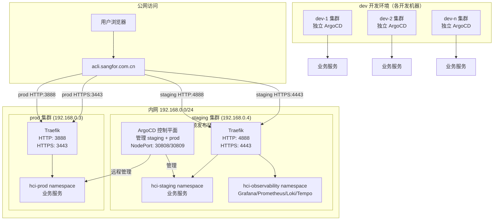
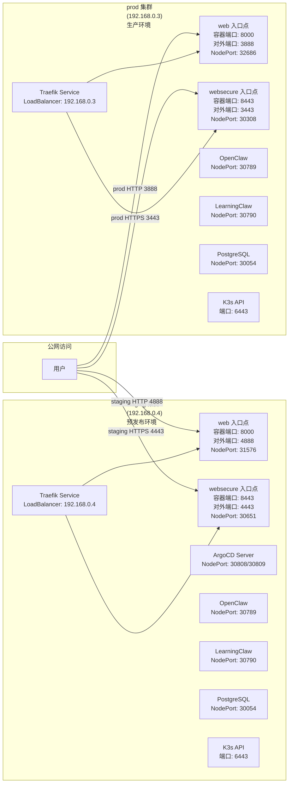
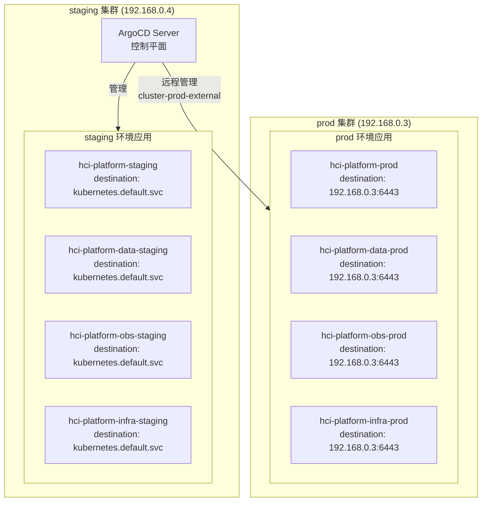
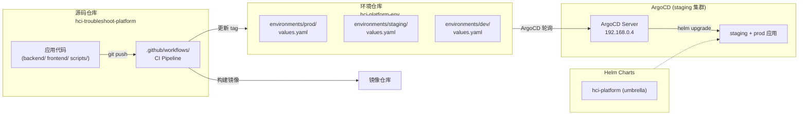
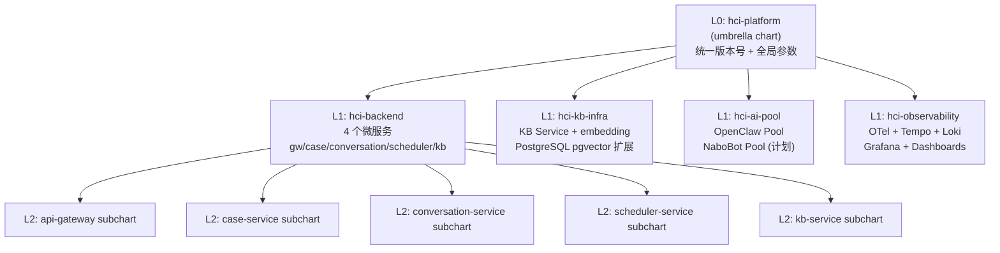

# HCI 智能排障平台 — 部署架构设计

> **本文档定位（WHY）**：架构决策依据——为什么这样设计部署架构。
>
> **不在此文档**：
> - 操作步骤（HOW）→ [部署指南.md](部署指南.md)
> - 发布流程 → [发布指南.md](发布指南.md)
>
> **关联文档**：[`../solution/架构设计.md`](../solution/架构设计.md)

---

## 文档信息
- **版本**: 1.24
- **更新日期**: 2026-05-10
- **状态**: 现行全量
- **技术栈**: K3s + Helm 4层 Chart + GitOps（ArgoCD）
- **关联文档**: [`../solution/架构设计.md`](../solution/架构设计.md)

---

## 变更历史

| 版本 | 日期 | 变更内容 |
|------|------|----------|
| **1.31** | **2026-05-20** | **Docker CACHEBUST 修复补强 (PR #307)**：PR #306 的 `ARG CACHEBUST` 定义不会真正破坏 Docker 缓存，补强为在 `COPY shared` 前添加 `RUN echo "CACHEBUST=${CACHEBUST}" > /tmp/cachebust`，使用 RUN 命令引用 ARG 才能真正破坏缓存。详见 §12.8。 |
| **1.30** | **2026-05-20** | **Docker CACHEBUST 参数修复 shared 目录缓存问题 (PR #306)**：所有后端服务 Dockerfile 新增 `CACHEBUST` ARG，CI 构建时传入 `GITHUB_SHA`，强制每次构建都重新 COPY shared 目录，解决 PR #304 迁移 shared/utils → shared/observability 后 Docker 缓存导致镜像仍使用旧导入路径的问题。详见 §12.8。 |
| **1.29** | **2026-05-20** | **PYDANTIC_AI_ENABLED 环境变量注入 (PR #305)**：conversation-service deployment 新增 PYDANTIC_AI_ENABLED 环境变量，由 values.yaml 中 `conversationService.pydanticAiEnabled` 控制。启用后 BrainRouter 优先使用 PydanticAIBrainAdapter，否则降级到 HTPBrainAdapter。详见 §12.7。 |
| **1.28** | **2026-05-11** | **ops-agent 启动脚本修复 (PR #275)**：用 Python urllib 代替 curl 检查健康状态，修复 python:3.12-slim 镜像无 curl 导致容器崩溃的问题。 |
| **1.27** | **2026-05-11** | **ops-agent 单容器方案 (PR #274)**：回滚 sidecar 方案，改为单容器同时运行 ops-server 和 ops-web。启动脚本先启动 ops-server（后台），再启动 Streamlit（前台）。访问方式 `http://<node-ip>:30791`。 |
| **1.26** | **2026-05-11** | **ops-web NodePort Service (PR #271)**：新增独立的 NodePort Service 暴露 ops-web (Streamlit) 8501 端口，访问方式 `http://<node-ip>:30791`。 |
| **1.25** | **2026-05-11** | **ops-agent HOME 环境变量修复 (PR #270)**：容器默认 `HOME=/` 导致 Streamlit 在 `/.streamlit` 创建目录被拒绝，添加 `HOME=/app` 环境变量解决问题。 |
| **1.21** | **2026-05-08** | **ops-agent SOP catalog configmap 修复 + BrainAdapter ACP REST 升级 (PR #249)**：`configmap.yaml` 新增 `sop_catalogs.hci` 字段（修复 CLI `--sop hci` 参数报错）；`sop_catalog_path` 保留（HTTP server 使用）。conversation-service `OpsAgentBrainAdapter` 同步升级为 ACP REST 客户端，支持完整双向交互。 |
| **1.20** | **2026-05-07** | **ops-agent imagePullPolicy 模板语法修复**：修复 Helm template `{{- if }}` 删除前导空格导致 YAML parse error（line 69: could not find expected ':'），改用 Sprig `ternary` 函数。tag=latest 时使用 Always，否则 IfNotPresent。 |
| **1.19** | **2026-05-07** | **ops-agent SOP 数据 HostPath 挂载方案**：ops-agent 镜像与 SOP 数据解耦，采用 HostPath 动态挂载宿主机目录，支持手动更新 SOP 数据。详见 [方案选型](../solution/agent/ops-agent-internals/SOP数据挂载方案选型.md) |
| **1.24** | **2026-05-10** | **ops-agent 滚动更新策略支持 (PR #265)**：Helm template 支持 `opsAgent.strategy` 配置，dev 环境配置 maxSurge=0, maxUnavailable=1（先删后建），解决单节点 Request 配额冲突导致滚动更新 Pending。详见 §12.6。 |
| **1.23** | **2026-05-09** | **LimitRange max memory 提升 8Gi (PR #256)**：ops-agent SOP检索峰值超4Gi触发OOMKilled，LimitRange max memory: 4Gi → 8Gi，ops-agent memory limit 同步提升至 8Gi。详见 §3.2。 |
| **1.22** | **2026-05-09** | **db-migrate 失败 Hook 自动清理补强**：`db-migrate-job` 的 ArgoCD hook-delete-policy 新增 `HookFailed`，与 `BeforeHookCreation` 组合，避免失败迁移 Job 长期残留导致运维误报；成功 Job 仍由 `ttlSecondsAfterFinished` 清理。详见 §9.2.2。 |
| **1.18** | **2026-05-07** | **ops-agent 跨仓库自动联动部署（已实现）**：ops-agent CI 构建后自动回写 tag 到 hci-platform-env；手动 `/ops-agent-update` skill 兜底。详见 [事件文档](events/2026-05-07-ops-agent跨仓库自动联动部署方案.md) |
| **1.17** | **2026-05-07** | **ops-agent 注册到助手配置**：Helm ConfigMap 默认助手注册表新增 ops-agent（直连模式，base_url=http://ops-agent-service:8006），详见 [事件文档](../solution/events/2026-05-07-助手选择器Bug修复.md) |
| 1.16 | 2026-04-26 | **Grafana Ingress TLS 入口切换（PR #229）**：Grafana ingress 模板同步支持 TLS 入口点自动切换。解决启用 TLS 后 HTTPS 请求无法匹配 Grafana Ingress，被主站 `/` 回退规则捕获显示 customer-ui 的问题（详见 [PIT-036](pitfalls/grafana.md)）。 |
| 1.1 | 2026-04-07 | Helm ConfigMap 新增 `20260407001_schema_repair.sql` 迁移条目，详见 [部署事件](events/2026-04-07-schema-漂移修复部署.md) |
| 1.2 | 2026-04-07 | 新增数据库迁移同步自动化机制，详见 [部署事件](events/2026-04-07-数据库迁移同步自动化部署.md) |
| 1.3 | 2026-04-07 | 新增迁移链修复迁移 `20260407003_fix_migration_chain.sql`，详见 [方案文档](../solution/events/2026-04-07-迁移链修复方案.md) |
| 1.4 | 2026-04-08 | Alembic K8s Job 改为 busybox noop（彻底废弃），`hci-platform-data` values.yaml 锁定 `enabled: false`；新增 `20260408001_sop_tables_fix_version.sql` 迁移并同步 ConfigMap，详见 [部署事件](events/2026-04-08-dbmate迁移机制全面修复部署.md) |
| 1.5 | 2026-04-09 | **db-migrate Job 重构**：改用 Atlas 声明式 `schema apply`；新增 `initContainer`（确保目标库及 atlas_dev 的 extensions）；将函数/触发器拆至 `desired_extras.sql` 由 psql 幂等执行；多阶段 Dockerfile（`arigaio/atlas` + `postgres:15-alpine`）。详见 [部署事件](events/2026-04-09-db-migrate-job重构.md) |
| 1.6 | 2026-04-16 | **db-migrate hook 死锁修复**：解决 ArgoCD PreSync Hook Job 因命名冲突与 finalizer 双重死锁导致迁移永远无法执行的问题。修改 Job 名后缀为镜像 tag 前 20 字符；delete-policy 增加 `HookSucceeded` 自动清理成功 Job。详见 §9。 |
| 1.7 | 2026-04-17 | **App of Apps 分层架构（PR #159）**：`§0.2` GitOps 图更新为双 ArgoCD 分层模型；dev 侧 `argocd-ops` sources 新增 `argo-apps/local/`；staging 侧新增独立 `argo-apps/cloud/argocd-ops.yaml`；防止 cloud/ Application 被 dev ArgoCD 误管（详见 [D-001](pitfalls/k8s.md)）。 |
| 1.8 | 2026-04-17 | **regexReplaceAll bug 修复（PR #162）**：§9.2.1 Helm 表达式中 `regexReplaceAll` 函数在 pipeline 模式下有 bug，直接返回 replacement 字符串而非替换后的输入。改用 `replace` 函数链：`lower → replace "." "-" → replace "_" "-" → trunc 15 → trimSuffix "-"`。详见 §9.3。 |
| 1.9 | 2026-04-17 | **ai_client.py ConfigMap 同步（PR #165）**：`files/ai_client.py` 同步至 backend 版本，添加 `provider_api_key` 参数支持。修复 conversation-service 启动失败 (`TypeError: unexpected keyword argument 'provider_api_key'`)。 |
| 1.10 | 2026-04-17 | **彻底移除 aiClientPatch 双重维护机制**：删除 `files/ai_client.py`、`ai-client-patch.yaml` 和 `values.yaml` 中的 `aiClientPatch` 配置块。镜像 v2.4.0+ 已包含完整修复，不再需要 ConfigMap 覆盖。消除双重维护同步遗漏风险。 |
| 1.11 | 2026-04-17 | **db-password-check Secret 依赖修复（PR #166）**：§10 B-3 PreSync Hook 原设计假设 `hci-platform-secrets.database-url`（不存在），改用单一权威来源 `hci-secrets.POSTGRES_PASSWORD`，在 Job 中动态构建 `DATABASE_URL`。符合业界最佳实践（与 PostgreSQL Operator 设计一致）。详见 §10。 |
| 1.12 | 2026-04-17 | **ArgoCD repo-server Probe 优化（PR #168 → #169）**：§11 repo-server CrashLoopBackOff 根因修复。分离 liveness/readiness probe：liveness 使用 `/healthz`（进程存活检查），readiness 使用 `/healthz?full=true`（功能可用检查，timeout 60秒）。**PR #169 修复**：StrategicMergePatch 改为 PreSync Hook Job（ArgoCD directory 模式不支持 StrategicMergePatch）。详见 §11。 |
| 1.13 | 2026-04-17 | **AI 助手选择器智能显示配置（PR #171）**：Helm ConfigMap 新增 `ASSISTANT_SHOW_SELECTOR` 配置项（默认 `auto`），values.yaml 新增 `assistantShowSelector` 字段。支持三种模式：`auto`（智能判断，多于1个可用助手时显示）、`true`（强制显示）、`false`（强制隐藏）。详见 [AI助手设计.md §10](../solution/agent/AI助手设计.md)。 |
| 1.14 | 2026-04-26 | **Ingress TLS 自动入口切换（PR #227）**：主站 ingress 模板根据 `ingress.tls` 配置自动选择 Traefik 入口点。启用 TLS 时使用 `websecure`（HTTPS，端口 4443），否则使用 `web`（HTTP，端口 4888）。解决公网 HTTP 页面访问 localhost 被 PNA 阻止的问题（详见 [D-007](pitfalls/k8s.md)）。 |
| 1.15 | 2026-04-26 | **conversation-service 探针分级优化**：liveness/readiness/startup 探针改用分级健康检查端点（`/health/live`、`/health/ready`、`/health/startup`）。避免 `/health` 端点调用 4 个 AI 助手健康检查导致探针超时（timeout 3s）。 |
| 1.16 | 2026-04-26 | **Grafana Ingress TLS 入口切换（PR #229）**：Grafana ingress 模板同步支持 TLS 入口点自动切换。解决启用 TLS 后 HTTPS 请求无法匹配 Grafana Ingress，被主站 `/` 回退规则捕获显示 customer-ui 的问题（详见 [PIT-036](pitfalls/grafana.md)）。 |
| 1.17 | 2026-04-26 | **彻底删除 hci-platform-data Alembic 熔断器**：移除 `templates/hooks/db-migrate.yaml` 和 values.yaml 中的 `dbMigrate` 配置块。根因：熔断器设计导致与 hci-platform 的 `dbMigrate.enabled` 配置冲突，ArgoCD 多源配置会将同一 values.yaml 应用到两个 chart，触发熔断器 Job 失败并残留 finalizer 导致 sync failed。 |
| 1.18 | 2026-04-27 | **prod 集群 Traefik HTTPS 端口调整**：将 websecure 端口从 3843 调整为 3443，通过 HelmChartConfig 配置。更新 §0 完整端口映射表，补充 NodePort 服务端口信息（ArgoCD、OpenClaw、LearningClaw、PostgreSQL）。 |
| 1.19 | 2026-04-27 | **Prometheus reload Hook 去 kubectl 化**：`post-upgrade-prometheus-reload` 从 `kubectl exec` 进入 Pod 改为直接请求 Prometheus Service 的 `/-/reload`。删除额外 RBAC 依赖，避免 docker.io 拉取 `bitnami/kubectl` 失败导致 ArgoCD PostSync 长时间挂起。 |

---

## 0. 部署全貌（Mermaid）

### 环境说明

| 环境代号 | 中文名称 | 用途 | 部署位置 |
|---------|---------|------|---------|
| **dev** | 开发环境 | 开发人员日常开发、调试，每个开发人员可独立部署 | 各开发机器（独立 ArgoCD） |
| **staging** | 预发布环境 | 发布前冒烟测试、回归验证，与生产配置一致 | 192.168.0.4（集群控制平面） |
| **prod** | 生产环境 | 对外提供正式服务，承载真实业务流量 | 192.168.0.3 |

### 0.1 多环境多集群整体架构



### 0.2 集群 IP 及端口映射



### 0.3 端口映射详表

| 环境 | 集群 IP | 服务 | 类型 | 容器端口 | 对外端口 | NodePort | 协议 | 用途 |
|------|---------|------|------|---------|---------|----------|------|------|
| **staging** | 192.168.0.4 | Traefik web | LoadBalancer | 8000 | **4888** | 31576 | HTTP | 平台入口 |
| **staging** | 192.168.0.4 | Traefik websecure | LoadBalancer | 8443 | **4443** | 30651 | HTTPS | 平台入口（TLS） |
| **staging** | 192.168.0.4 | ArgoCD Server | NodePort | 80 | - | **30808** | HTTP | GitOps 控制台 |
| **staging** | 192.168.0.4 | ArgoCD Server | NodePort | 443 | - | **30809** | HTTPS | GitOps 控制台（TLS） |
| **staging** | 192.168.0.4 | OpenClaw | NodePort | 18789 | - | **30789** | HTTP | AI 助手网关 |
| **staging** | 192.168.0.4 | LearningClaw | NodePort | 18789 | - | **30790** | HTTP | 知识学习网关 |
| **staging** | 192.168.0.4 | PostgreSQL | NodePort | 5432 | - | **30054** | TCP | 数据库外部访问 |
| **staging** | 192.168.0.4 | K3s API | - | 6443 | 6443 | - | HTTPS | K8s API |
| **staging** | 192.168.0.4 | SSH | - | 22 | 22 | - | SSH | 系统管理 |
| **prod** | 192.168.0.3 | Traefik web | LoadBalancer | 8000 | **3888** | 32686 | HTTP | 平台入口 |
| **prod** | 192.168.0.3 | Traefik websecure | LoadBalancer | 8443 | **3443** | 30308 | HTTPS | 平台入口（TLS） |
| **prod** | 192.168.0.3 | OpenClaw | NodePort | 18789 | - | **30789** | HTTP | AI 助手网关 |
| **prod** | 192.168.0.3 | LearningClaw | NodePort | 18789 | - | **30790** | HTTP | 知识学习网关 |
| **prod** | 192.168.0.3 | PostgreSQL | NodePort | 5432 | - | **30054** | TCP | 数据库外部访问 |
| **prod** | 192.168.0.3 | K3s API | - | 6443 | 6443 | - | HTTPS | K8s API |
| **prod** | 192.168.0.3 | SSH | - | 22 | 22 | - | SSH | 系统管理 |

> **⚠️ HTTP 端口返回 404 说明**
>
> 启用 TLS 后，Ingress 只监听 `websecure` 入口点（HTTPS），不监听 `web` 入口点（HTTP）。
> 因此直接访问 HTTP 端口（如 `http://acli.sangfor.com.cn:4888`）会返回 `404 page not found`。
>
> 这是预期行为，请使用 HTTPS 端口访问：
> - staging: `https://acli.sangfor.com.cn:4443`
> - prod: `https://acli.sangfor.com.cn:3443`

### 0.4 访问 URL 汇总

| 环境 | 平台入口 | ArgoCD | Grafana |
|------|----------|--------|---------|
| **staging** | `https://acli.sangfor.com.cn:4443` | `http://192.168.0.4:30808` | `https://acli.sangfor.com.cn:4443/grafana` |
| **prod** | `https://acli.sangfor.com.cn:3443` | (由 staging ArgoCD 远程管理) | `https://acli.sangfor.com.cn:3443/grafana` |

### 0.5 ArgoCD 多集群管理架构



### 0.6 GitOps 双仓模型



### 0.7 Helm Chart 四层结构



---

## 1. 基础设施规格

### 1.1 K3s 集群节点

| 节点 | 规格 | 角色 | 说明 |
|------|------|------|------|
| node-01 | 32 vCPU / 64 GB RAM / 500 GB SSD | control-plane + worker | 单节点集群（生产当前配置） |

### 1.2 持久化存储

| PVC | 大小 | StorageClass | 挂载路径 | 说明 |
|-----|------|-------------|---------|------|
| `postgresql-data` | 50 Gi | local-path | `/var/lib/postgresql/data` | 数据库主存储 |
| `redis-data` | 5 Gi | local-path | `/data` | Redis AOF 持久化 |
| `loki-data` | 20 Gi | local-path | `/loki` | 日志存储 |
| `tempo-data` | 10 Gi | local-path | `/tempo` | Trace 存储 |
| `grafana-data` | 2 Gi | local-path | `/var/lib/grafana` | Dashboard 配置 |
| `kbd-cache` | 10 Gi | local-path | `/app/data-pipeline/kbd/cache` | KBD 流水线中间产物 |

### 1.3 网络规划

| 服务 | ClusterIP Port | NodePort | 用途 |
|------|---------------|----------|------|
| api-gateway | 8000 | 30000 | 外部访问入口 |
| grafana | 3000 | 30030 | 监控看板 |
| argocd-server | 8080 | 30088 | GitOps 控制台 |
| postgresql | 5432 | — | 仅集群内访问 |
| redis | 6379 | — | 仅集群内访问 |

---

## 2. AI Pod 资源配额

| 助手类型 | CPU Request | CPU Limit | Memory Request | Memory Limit | 热备数 | 最大数 |
|---------|------------|----------|---------------|-------------|--------|--------|
| openclaw | 500m | 2000m | 512 Mi | 2 Gi | 2 | 10 |
| nabobot（计划） | 500m | 1000m | 256 Mi | 1 Gi | 1 | 5 |

---

## 3. Security Context（安全基线）

所有工作负载遵循以下基线（PIT-025 规范）：

```yaml
securityContext:
  runAsNonRoot: true
  runAsUser: 1000     # Python/Node.js 应用
  allowPrivilegeEscalation: false
  readOnlyRootFilesystem: true
  capabilities:
    drop: ["ALL"]

# Nginx 类工作负载（如有）额外挂载：
volumes:
  - name: nginx-cache
    emptyDir: {}
  - name: nginx-run
    emptyDir: {}
volumeMounts:
  - name: nginx-cache
    mountPath: /var/cache/nginx
  - name: nginx-run
    mountPath: /var/run
```

---

## 4. 健康检查规范

```yaml
# 所有 FastAPI 服务统一模板
livenessProbe:
  httpGet:
    path: /health
    port: 808x
  initialDelaySeconds: 10
  periodSeconds: 15
  failureThreshold: 3

readinessProbe:
  httpGet:
    path: /ready
    port: 808x
  initialDelaySeconds: 5
  periodSeconds: 10
  failureThreshold: 2

# AI Pod 特殊健康检查（AI Assistant Protocol v1）
livenessProbe:
  httpPost:        # 空 payload，400 返回 = healthy，连接拒绝 = unhealthy
    path: /v1/chat/completions
    port: 18789
  initialDelaySeconds: 30
  periodSeconds: 30
```

---

## 5. 发布流程

```
1. 开发完成 → 创建 feature/* 分支 → 推送 → 创建 PR
2. CI 检查通过（lint + test + docs-governance）
3. PR 合并 main 分支
4. CI 自动构建 Docker 镜像 → 推送到 Registry
5. CI 自动更新环境仓库 environments/prod/values.yaml 中的 image.tag
6. ArgoCD 检测到环境仓库变更 (Webhook 或 3分钟轮询)
7. ArgoCD 执行 helm upgrade → K3s 滚动更新
8. 验证: 健康检查 + Grafana 告警静默期监控
```

详细 SOP 见 [`发布指南.md`](发布指南.md)。

---

## 6. 本地开发部署

```bash
# Docker Compose 本地开发环境
cd hci-troubleshoot-platform
docker compose up -d

# 服务启动顺序
# 1. PostgreSQL→Redis (数据层)
# 2. KB Service (依赖 PG)
# 3. Case/Conversation/Scheduler Service
# 4. API Gateway
```

详见 [`部署指南.md`](部署指南.md)。

---

## 7. 数据库迁移方案（Atlas）

自 v6.3 起，数据库迁移工具由 dbmate + Helm ConfigMap 替换为 **Atlas 声明式管理**。

| 方面 | 旧方案 | 新方案 |
|------|--------|--------|
| 迁移文件 | `database/migrations/*.sql`（手动管理） | `database/atlas-migrations/`（Atlas 管理） |
| 部署载体 | Helm ConfigMap 静态嵌入（需手动同步） | Docker 镜像 `db-migrate`（CI 自动构建） |
| Job 镜像 | `ghcr.io/amacneil/dbmate` | `ghcr.io/sangfor-hci/hci-platform/db-migrate:<tag>` |
| 版本跟踪表 | `schema_migrations` | `atlas_schema_revisions` |
| PR 前验证 | 无 | `atlas migrate lint` + 全量执行 + 幂等性验证 |

### 首次切换已有环境

已有 dev/staging/prod 环境使用 `--baseline` 跳过全量建表迁移：

```yaml
# hci-platform-env/environments/dev/values.yaml
dbMigrate:
  image:
    repository: "ghcr.io/tomturing/hci-troubleshoot-platform/db-migrate"
    tag: "<YYYYMMDD-HHMM-sha7>"  # 由 CI env-repo-sync 自动更新
```

详见 [Atlas 改造上线操作](events/2026-04-08-atlas改造上线操作.md)。

---

## 8. Prometheus Reload Hook 设计（2026-04-27）

### 8.1 背景

`hci-platform` 在业务配置升级后，需要触发 Prometheus 重新加载规则与抓取配置，否则会出现“Chart 已更新但 Prometheus 仍使用旧配置”的窗口期。

### 8.2 旧设计的问题

旧版 `post-upgrade-prometheus-reload` Hook 采用以下路径：

1. 拉取 `bitnami/kubectl:latest`
2. 用 Hook ServiceAccount + Role + RoleBinding 获取 `pods/exec` 权限
3. `kubectl exec` 进入 Prometheus Pod
4. 在 Pod 内执行 `http://localhost:9090/-/reload`

这个设计的问题不是功能错误，而是依赖面过大：

- 依赖 docker.io 可达性
- 依赖额外 RBAC
- 依赖目标 Pod 查询与 exec 成功

当节点无法稳定拉取 `bitnami/kubectl:latest` 时，Hook Job 会卡在 `ImagePullBackOff`，ArgoCD 同步也会一直停留在等待 PostSync Hook 完成。

### 8.3 新设计

现改为最短路径：直接在集群内向 Prometheus Service 发 HTTP POST。

```text
Hook Job -> curl http://prometheus.<observability-namespace>.svc.cluster.local:9090/-/reload
```

对应设计取舍：

- 保留 Hook：升级后仍自动触发 reload
- 删除 `kubectl exec`：不再需要查询 Pod 或进入容器
- 删除 Hook 专用 RBAC：HTTP 调用不需要 Kubernetes API 权限
- 镜像改为 `curlimages/curl:8.6.0`：仓库内已有稳定使用案例，依赖面更小
- delete-policy 增加 `hook-failed`：失败后自动清理，避免残留 Job 阻塞后续同步观察

### 8.4 设计结论

该 Hook 的本质需求只是“向 Prometheus 发一个 reload 请求”，不是“执行一段 kubectl 运维脚本”。

因此直接请求 Service 比 `kubectl exec` 更符合第一性原理，也更适合 ArgoCD Hook 这种需要高确定性、低外部依赖的控制面路径。

---

*文档版本: 1.19 | 更新日期: 2026-04-27 | Prometheus reload Hook 去 kubectl 化（§8）*

---

## §9 db-migrate Hook 死锁修复（2026-04-16）

### 9.1 问题根因（四层叠加）

**层1：Job 命名依赖 `.Release.Revision`（ArgoCD 中永远为 1）**

ArgoCD 通过 `helm template` 渲染模板，非 `helm install`，所以 `.Release.Revision` 恒等于 `1`。
原始命名 `db-migrate-{{ .Release.Revision }}` 导致所有 sync 创建的 Job 名永远是 `db-migrate-1`。

**层2：BeforeHookCreation + finalizer 死锁**

旧 Job 失败后，ArgoCD 在其上设置 `deletionTimestamp`，但 `argocd.argoproj.io/hook-finalizer`
阻止实际删除，直至 ArgoCD Controller 处理完成。若 Controller 内部状态异常（如本次的 4h12m
超时，`BackoffLimitExceeded`），finalizer 会长期卡住，`BeforeHookCreation` 无法删除旧 Job，
新 Job 也就永远无法创建。

**层3：`dbMigrate.enabled: false` 禁用 hook（临时应急遗留）**

commit `1bdc53b` 为绕过死锁将 env repo 中 `enabled` 改为 `false`，修复期间忘记恢复，
导致后续所有 sync 完全跳过迁移 Job。

**层4：ghcr-pull-secret token 过期导致 ImagePullBackOff**

ServiceAccount 绑定的 Secret 中的 PAT 已过期（DENIED），新 Job 虽可创建但无法拉取镜像。

### 9.2 修复方案

#### 9.2.1 Job 命名策略

| | 修改前 | 修改后 |
|---|---|---|
| 命名规则 | `db-migrate-{{ .Release.Revision }}` | `db-migrate-{{ .Values.dbMigrate.image.tag \| trunc 20 \| lower \| sanitize }}` |
| 问题 | ArgoCD 中 Revision 恒为 1，永久冲突 | tag 随镜像 CI 构建自动变化，天然区分 |

具体 Helm 表达式：
```yaml
name: db-migrate-{{ .Values.dbMigrate.image.tag | default "latest" | lower | replace "." "-" | replace "_" "-" | trunc 15 | trimSuffix "-" }}-{{ .Chart.Version | lower | replace "." "" }}
```

> **⚠️ 历史问题（已修复）**：早期版本使用 `regexReplaceAll` 函数，但 Sprig 该函数在 pipeline 模式下存在 bug：
> ```yaml
> # 错误用法（有 bug）
> "latest" | regexReplaceAll "[^a-z0-9A-Z-]" ""  → "" (空字符串，而非 "latest")
> ```
> 现已改用可靠的 `replace` 函数链（详见 §9.3）。

> **注意**：当 tag 为固定值（如 `latest`）时，Job 名不变，此时依赖 `BeforeHookCreation` 清理旧 Job。
> 推荐在 CI env-repo-sync 中始终使用含日期 + SHA 的唯一 tag（如 `20260416-0457-857b0eb`）确保每次命名唯一。

#### 9.2.2 delete-policy 策略

| | 修改前 | 修改后 |
|---|---|---|
| delete-policy | `BeforeHookCreation` | `BeforeHookCreation,HookFailed`（仍不使用 `HookSucceeded`） |
| 效果 | 失败 Job 可能长期残留，造成历史告警噪音 | 新 sync 前清旧 Job；失败 Job 自动清理；成功 Job 由 TTL（3600s）清理 |

> **⚠️ 历史问题（已修复）**：早期版本使用 `BeforeHookCreation,HookSucceeded`，导致 ArgoCD 在 Job 成功后立即删除，但 sync operation 可能还在等待状态更新，造成 sync 卡住。当前策略为 `BeforeHookCreation,HookFailed`：仅对失败 Hook 立即清理，成功 Hook 交给 TTL 清理，兼顾稳定性与整洁性。

#### 9.2.3 env repo 恢复

将 `hci-platform-env/environments/dev/values.yaml` 中 `dbMigrate.enabled` 恢复为 `true`，
并轮换 `ghcrToken` 为新 PAT（更新 ghcr-pull-secret）。

### 9.3 验证结果

| 验证项 | 结果 |
|--------|------|
| `db-migrate-*` pod 状态 | `Completed` |
| `pending_resolution` 列是否存在 | 已存在于 `conversation` 表 |
| ArgoCD sync phase | `Succeeded` |
| conversation-service 错误日志 | 无 `UndefinedColumnError` |

### 9.4 regexReplaceAll Bug 修复（2026-04-17，PR #162）

**问题现象**：ArgoCD sync 时 db-migrate Job 名渲染为 `db-migrate--`（空字符串后缀），违反 Kubernetes RFC 1123 命名规范。

**根因**：Sprig `regexReplaceAll` 函数在 pipeline 模式下存在 bug：

```yaml
# Bug 验证（本地 Helm 测试）
"latest" | regexReplaceAll "[^a-z0-9A-Z-]" ""  → "" (空，期望 "latest")
"0.1.0"  | regexReplaceAll "[^a-z0-9]" ""      → "" (空，期望 "010")

# 原因：regexReplaceAll 在 pipeline 中直接返回 replacement 参数，而非替换后的输入
```

**修复方案**：改用可靠的 `replace` 函数链：

```yaml
# 修复前（有 bug）
{{- $tag := .Values.dbMigrate.image.tag | default "latest" | regexReplaceAll "[^a-z0-9A-Z-]" "" | lower | trunc 15 | trimSuffix "-" }}
{{- $chartVer := .Chart.Version | regexReplaceAll "[^a-z0-9]" "" | lower }}

# 修复后（正确）
{{- $tag := .Values.dbMigrate.image.tag | default "latest" | lower | replace "." "-" | replace "_" "-" | trunc 15 | trimSuffix "-" }}
{{- $chartVer := .Chart.Version | lower | replace "." "" }}
```

**渲染结果对比**：

| | 修复前 | 修复后 |
|---|---|---|
| Job 名 | `db-migrate--` ❌ | `db-migrate-latest-010` ✓ |
| 符合 RFC 1123 | 否（以 `-` 结尾） | 是 |

**影响范围**：仅修改 `deploy/helm/hci-platform/templates/hooks/db-migrate-job.yaml`，不影响其他模板。

---

## §10 db-password-check Secret 依赖修复（2026-04-17，PR #166）

### 10.1 问题根因

**原始设计缺陷（commit 2172354，2026-03-29）**：

B-3 特性（DB 密码漂移预检 Job）从第一天就存在设计错误：

```yaml
# 原设计（错误）
env:
  - name: DATABASE_URL
    valueFrom:
      secretKeyRef:
        name: hci-platform-secrets  # ❌ 此 Secret 从未创建
        key: database-url            # ❌ 此 key 从未定义
```

**问题本质**：设计假设了一个不存在的 Secret 结构，与实际实现割裂。

### 10.2 第一性原理分析

| 层级 | 分析 |
|-----|-----|
| **原始需求** | 防止运维人员修改 PostgreSQL 密码后，K8s Secret 未同步，导致服务启动失败 |
| **问题本质** | 配置漂移（Configuration Drift）— 两个权威来源不一致 |
| **设计缺陷** | 假设 `hci-platform-secrets.database-url` 存储完整连接字符串（从未创建） |
| **实际实现** | `hci-secrets.POSTGRES_PASSWORD` 只存储密码原子字段 |

### 10.3 业界最佳实践对比

| 项目 | Secret 结构 | 连接字符串处理 |
|-----|------------|--------------|
| **PostgreSQL Operator (CrunchyData)** | `user`, `password`, `host`, `port`, `database` 分离 | 应用层动态拼接 |
| **Redis Operator** | `password` 单独存储 | 应用层拼接 |
| **MySQL Operator** | `user`, `password`, `host` 分离 | 应用层拼接 |

**业界共识**：不存储完整连接字符串，只存储原子字段，运行时动态拼接。

### 10.4 修复方案

**核心原则**：单一权威来源 + 动态构建连接

```yaml
# 修复后（符合业界范式）
env:
  # 从单一权威来源读取密码
  - name: POSTGRES_PASSWORD
    valueFrom:
      secretKeyRef:
        name: hci-secrets        # ✓ 正确的 Secret（由 hci-platform chart 创建）
        key: POSTGRES_PASSWORD   # ✓ 正确的 key
  # 动态构建 DATABASE_URL
  - name: DATABASE_URL
    value: "postgres://{{ .Values.config.postgresUser }}:$(POSTGRES_PASSWORD)@postgres:5432/{{ .Values.config.postgresDb }}?sslmode=disable"
```

**方案依据**：

| 依据 | 说明 |
|-----|-----|
| **单一权威来源** | 密码只存在一处，无冗余存储 |
| **业界范式一致** | 与 PostgreSQL Operator 设计一致 |
| **最小改动范围** | 只修改一个模板文件 |
| **向后兼容** | 不改变现有 Secret 结构 |
| **依赖显式声明** | 通过 `.Values.config.*` 传递参数 |

### 10.5 跨 Chart 依赖声明

```
依赖关系：
  hci-platform-data/templates/hooks/db-password-check.yaml
    → hci-secrets Secret（由 hci-platform/templates/secret.yaml 创建）
    → .Values.config.postgresUser/postgresDb（由 hci-platform-data/values.yaml 定义）
```

### 10.6 验证结果

| 验证项 | 预期结果 |
|--------|---------|
| hci-platform-data-dev Sync | `Succeeded` |
| db-password-check Job | `Completed`（密码验证通过） |
| Secret 读取 | `hci-secrets.POSTGRES_PASSWORD` 正确获取 |

---

## §11 ArgoCD repo-server Probe 优化（2026-04-17，PR #168）

### 11.1 问题根因

**问题现象**：
- ArgoCD repo-server Pod 处于 CrashLoopBackOff 状态
- `hci-platform-data-dev` Application sync operation 状态为 Error
- 错误信息：`dial tcp 10.43.205.25:8081: connect: connection refused`

**根因链条（五层叠加）**：

| 层级 | 问题 |
|-----|------|
| L1 | `/healthz?full=true` 调用 gRPC HealthCheck，请求会被排队 |
| L2 | gRPC 队列阻塞时，healthcheck 请求等待超过 HTTP timeout（10秒） |
| L3 | 连续 3 次 timeout → liveness probe 失败 → Pod 被 kill |
| L4 | Pod 重启后再次阻塞 → CrashLoopBackOff 循环 |
| L5 | ArgoCD Application 无法连接 repo-server → sync Error |

**源码分析**（`argocd_repo_server.go`）：

```go
// /healthz?full=true 的实现
if val, ok := r.URL.Query()["full"]; ok && val[0] == "true" {
    // 创建 gRPC 连接（超时 60 秒）
    conn, err := apiclient.NewConnection("localhost:8081", 60, ...)
    
    // 调用 gRPC HealthCheck（会被排队等待）
    client := grpc_health_v1.NewHealthClient(conn)
    res, err := client.Check(r.Context(), &grpc_health_v1.HealthCheckRequest{})
}
```

**核心矛盾**：gRPC 连接超时 60秒，但 HTTP request context 只有 10秒。

### 11.2 第一性原理分析

| 原则 | 分析 |
|-----|-----|
| **原始需求** | liveness probe 检查进程存活，readiness probe 检查功能可用 |
| **问题本质** | 混淆了 liveness 和 readiness 的职责边界 |
| **正确做法** | liveness 应只检查进程存活，不检查 gRPC 功能 |

### 11.3 Kubernetes Probe 设计原则

| Probe 类型 | 目的 | 失败后果 | 适用场景 |
|-----------|------|---------|---------|
| **livenessProbe** | 检查进程是否存活 | Pod 重启 | 进程崩溃、死锁 |
| **readinessProbe** | 检查服务是否可用 | 流量停止路由 | 服务初始化、暂时不可用 |

**关键区别**：
- `/healthz?full=true` 失败 → readiness 失败 → Pod 不接受请求（不重启）
- `/healthz` 失败 → 进程死掉 → Pod 重启

### 11.4 修复方案

**核心原则**：分离 liveness 和 readiness probe 的职责

```yaml
# argocd-repo-server-probe-patch.yaml
livenessProbe:
  httpGet:
    path: /healthz           # 不使用 full=true
    port: 8084
  timeoutSeconds: 5          # 进程检查，5秒足够

readinessProbe:
  httpGet:
    path: /healthz?full=true # 完整功能检查
    port: 8084
  timeoutSeconds: 60         # 与 gRPC 连接超时匹配

env:
  - name: ARGOCD_REPO_SERVER_PARALLELISM_LIMIT
    value: "4"                # 限制并发 gRPC 调用
```

**方案依据**：

| 依据 | 说明 |
|-----|-----|
| **职责分离** | liveness 检进程，readiness 检功能 |
| **消除阻塞** | liveness 不调用 gRPC，永不阻塞 |
| **自动恢复** | gRPC 阻塞时 readiness 失败，完成后自动恢复 |
| **业界共识** | 参考 ArgoCD Issue #6106 |

### 11.5 GitOps 管理

将 patch 文件放入 `deploy/gitops/argocd-ops/` 目录，由 `argocd-ops` Application 自动同步管理。

```
ArgoCD 同步流程：
  1. PR 合入 main 分支
  2. ArgoCD argocd-ops Application 检测变更
  3. 自动 apply StrategicMergePatch
  4. repo-server Deployment 更新
  5. Pod 滚动更新，应用新 probe 配置
```

### 11.6 验证结果

| 验证项 | 预期结果 |
|--------|---------|
| argocd-repo-server Pod | Running（不再 CrashLoopBackOff） |
| hci-platform-data-dev Sync | Succeeded |
| 所有 Application 状态 | Synced + Healthy |

---

*文档版本: 1.23 | 更新日期: 2026-05-08 | ops-agent SOP catalog configmap 修复 + BrainAdapter ACP REST 升级（PR #249）*

## 12. ops-agent 服务部署（Phase 1 大脑可选集成）

### 12.1 服务概述

ops-agent 以独立 Deployment 运行，通过 ClusterIP Service 暴露给 conversation-service 调用。
BrainRouter 根据 `assistant_type == "ops-agent"` 将请求路由到 ops-agent（端口 8006），
其余请求走原有 htp 大脑路径，向后兼容。

### 12.2 新增 Helm 模板

| 文件 | 说明 |
|------|------|
| `templates/ops-agent-service/configmap.yaml` | 环境配置：model=glm-5，provider=dashscope |
| `templates/ops-agent-service/deployment.yaml` | Deployment：端口 8006，OPENAI_COMPATIBLE_API_KEY 来自 hci-secrets.SCP_API_KEY |
| `templates/ops-agent-service/service.yaml` | ClusterIP Service，端口 8006 |

### 12.3 新增 values 配置

```yaml
opsAgent:
  port: 8006
  baseUrl: "http://ops-agent-service:8006"
  enabled: false  # 默认关闭，OPS_AGENT_ENABLED=true 时启用
  model: "glm-5"
  provider: "dashscope"
```

### 12.4 激活方式

在 `hci-platform-env/environments/dev/values.yaml` 中覆盖：

```yaml
opsAgent:
  enabled: true
```

同时确保 `hci-secrets` 中已配置 `SCP_API_KEY`（dashscope API Key）。

### 12.5 conversation-service 侧 Helm 变更（PR #238）

`templates/conversation-service/deployment.yaml` 新增两个环境变量，传递给 conversation-service：

| 环境变量 | 来源 | 说明 |
|---------|------|------|
| `OPS_AGENT_BASE_URL` | `.Values.opsAgent.baseUrl`（默认 `http://ops-agent-service:8006`） | BrainRouter 调用 ops-agent 的 HTTP 地址 |
| `OPS_AGENT_ENABLED` | `.Values.opsAgent.enabled`（默认 `false`） | 控制是否创建 OpsAgentBrainAdapter 并注入 BrainRouter |

**nil 安全**：通过 `(.Values.opsAgent | default dict).xxx` 方式访问，保证 `helm upgrade --reuse-values`
在旧 release 无 `opsAgent` key 时不会报 nil pointer 错误。

## ops-agent 镜像配置
ops-agent 镜像来自独立 registry（ghcr.io/p3n9w31），不使用 global.imageRegistry 前缀。

## ops-agent imagePullPolicy
ops-agent 使用 ，确保 latest tag 每次都拉取最新镜像。

## ops-agent 超时与降级配置（2026-05-09）

conversation-service Deployment 新增两个环境变量：

| 环境变量 | 来源 | 说明 |
|---------|------|------|
| `OPS_AGENT_READ_TIMEOUT_SEC` | `.Values.opsAgent.readTimeoutSec`（默认 `"300.0"`） | ops-agent 专用读超时，与全局 `AI_CLIENT_READ_TIMEOUT_SEC=120s` 解耦；多步 ReAct 推理需要 >120s |
| `OPS_AGENT_FALLBACK_ASSISTANT_TYPE` | `.Values.opsAgent.fallbackAssistantType`（默认 `"glm-5"`） | ops-agent 不可达时的降级助手类型；必须为注册表中 `enabled=true` 的助手，禁止设为 `openclaw`（已 disabled） |

### 12.6 滚动更新策略（单节点环境适配）

**问题背景**：ops-agent Request 4Gi（峰值需要），单节点环境滚动更新时新旧 Pod 同时存在导致 "Insufficient memory" 调度失败。

**解决方案**：支持 `opsAgent.strategy` Helm 配置，各环境策略差异：

| 环境 | maxSurge | maxUnavailable | 说明 |
|------|----------|---------------|------|
| **dev** | 0 | 1 | 先删后建，避免配额冲突（单节点） |
| **staging** | 25% | 25% | 默认值（多节点可用） |
| **prod** | 25% | 25% | 默认值（多节点可用） |

**配置示例**（dev 环境 `environments/dev/values.yaml`）：

```yaml
opsAgent:
  strategy:
    type: RollingUpdate
    rollingUpdate:
      maxSurge: 0
      maxUnavailable: 1
```

**代价**：dev 环境更新期间 ops-agent 服务短暂中断（~30-60秒），可接受。

## ops-agent per-session trajectory 持久化（2026-05-13）

**问题背景**：ops-agent REST server 在进程重启后 LLM 上下文（消息历史）丢失，导致
ops-agent 大脑失忆，无法继续已开始的排障会话。

**根因**：
- trajectory 目录原挂载为 `emptyDir`，pod 重启即清空
- `brain_adapter.py` 写入 `/data/ops-agent-trajectories`，但 Deployment 未挂载该路径
- `ACPServer` 无 per-session trajectory 目录参数，无法按会话隔离恢复

**修复方案（HostPath 持久化）**：

| 组件 | 改动 | 说明 |
|------|------|------|
| `deployment.yaml` | 新增 `trajectory-data` 卷（HostPath） | 挂载到 `/data/ops-agent-trajectories`，pod 重启仍在同一节点时可恢复 |
| `deployment.yaml` | 新增 `OPS_AGENT_TRAJECTORY_DIR` env var | 值 `/data/ops-agent-trajectories`，与 `OpsAgentBrainAdapter._trajectory_base_dir` 默认值一致 |
| `values.yaml` | 新增 `.Values.opsAgent.trajectoryDataHostPath` | 各环境独立配置宿主机路径，默认 `/data/ops-agent-trajectories` |

**目录结构**（宿主机）：
```
{trajectoryDataHostPath}/
  {conversation_id}/        ← per-session 子目录（由 brain_adapter 传入）
    original_trajectory__*.json   ← ops-agent 每轮写入的 LLM 消息历史
```

**dev 环境配置**（`hci-platform-env/environments/dev/values.yaml`）：
```yaml
opsAgent:
  trajectoryDataHostPath: /mnt/d/aihci/ops-agent-trajectories
```

> 目录不存在时由 K8s `DirectoryOrCreate` 自动创建。
> 注意：HostPath 方案仅保证重调度到**同一节点**时有效；跨节点调度需改用 PVC。

---

## LLM 配置统一（2026-05-20）

**背景**：kb-service 使用独立的 `ZAI_*` 环境变量管理大模型配置，与 conversation-service 使用的 `OPENCLAW_*` 体系割裂，导致多处维护 API Key。

**变更方案**：

| 文件 | 改动 | 说明 |
|------|------|------|
| `templates/secret.yaml` | 删除 `ZAI_API_KEY` 条目 | 与 `OPENCLAW_API_KEY` 值相同，合并为一 |
| `templates/configmap.yaml` | 新增 `GLM_MODEL` 字段 | 值与 `OPENCLAW_DEFAULT_MODEL` 相同，供 pydantic-ai C 大脑和 glm_client 读取 |
| `templates/kb-service/deployment.yaml` | 删除 `ZAI_BASE_URL`/`ZAI_LLM_MODEL` 独立 env | kb-service 通过 `envFrom: hci-common-config` 统一继承 `OPENCLAW_BASE_URL`/`OPENCLAW_DEFAULT_MODEL` |

**统一后环境变量映射**：

| 用途 | 环境变量 | 来源 |
|------|---------|------|
| LLM 基础 URL（所有服务） | `OPENCLAW_BASE_URL` | `hci-common-config` ConfigMap |
| LLM API Key（所有服务） | `OPENCLAW_API_KEY` | `hci-secrets` Secret |
| 默认模型名称 | `OPENCLAW_DEFAULT_MODEL` / `GLM_MODEL` | `hci-common-config` ConfigMap |

> kb-service `classify.py` 已同步改为读取 `OPENCLAW_*` 变量，embedding 仍使用 `ZAI_BASE_URL`/`ZAI_API_KEY`（embedding endpoint 独立）。

---

### 12.7 PYDANTIC_AI_ENABLED 环境变量注入（2026-05-20）

**背景**：选择 pydantic-ai 助手时报错「大脑 [htp] 不可达: 未找到助手类型 'glm-4-flash' 的客户端」。

**根因**：conversation-service 中 `PYDANTIC_AI_ENABLED` 默认为 `false`，BrainRouter 的 `_pydantic_ai` adapter 未初始化，降级时使用硬编码的 `glm-4-flash`（不在 registry 中）。

**修复方案**：

| 文件 | 改动 | 说明 |
|------|------|------|
| `templates/conversation-service/deployment.yaml` | 新增 `PYDANTIC_AI_ENABLED` env var | 从 `conversationService.pydanticAiEnabled` 读取（默认 `false`） |
| 环境仓库 `values.yaml` | 新增 `conversationService.pydanticAiEnabled: "true"` | dev 环境启用 pydantic-ai C 大脑 |

**配置示例**（dev 环境）：

```yaml
conversationService:
  pydanticAiEnabled: "true"  # 启用 pydantic-ai C 大脑
```

**启用后行为**：
- BrainRouter 优先使用 `PydanticAIBrainAdapter`（C 大脑）
- 禁用时降级到 `HTPBrainAdapter`（原有 S0-S6 逻辑）

---

### 12.8 Docker CACHEBUST 参数修复 shared 目录缓存问题（2026-05-20，PR #306 → PR #307）

**背景**：PR #304 将 `shared/utils` 迁移到 `shared/observability`，但 Docker 构建缓存导致镜像中的代码仍使用旧的导入路径 `from shared.utils.logger import get_logger`，Pod 启动失败：
```
ModuleNotFoundError: No module named 'shared.utils.logger'
```

**根因分析**：
- Docker 构建时 `COPY shared /app/shared` 步骤被缓存
- `shared` 目录内容变化但 Docker layer hash 未更新
- **关键问题**：单纯的 `ARG CACHEBUST` 定义不会破坏缓存，Docker layer 缓存基于文件内容 hash

**修复方案（PR #307）**：

| 文件 | 改动 | 说明 |
|------|------|------|
| `backend/*/Dockerfile`（5 个服务）| 在 `COPY shared` 前新增 `RUN echo "CACHEBUST=${CACHEBUST}" > /tmp/cachebust` | 使用 RUN 命令引用 ARG 真正破坏缓存 |
| `.github/workflows/ci.yml` | 保留 `build-args: CACHEBUST=${{ github.sha }}` | 每次构建传入不同的 SHA 值 |

**Dockerfile 示例（PR #307 修复后）**：
```dockerfile
# 缓存破坏参数（每次构建时传入不同的值以强制重新 COPY shared）
ARG CACHEBUST=1

# 安装依赖
COPY conversation-service/requirements.txt .
RUN uv pip install --system --no-cache -r requirements.txt

# ⚠️ 关键：使用 RUN 命令引用 CACHEBUST ARG 才能真正破坏缓存
RUN echo "CACHEBUST=${CACHEBUST}" > /tmp/cachebust

COPY shared /app/shared
COPY conversation-service /app
```

**CI 构建配置**：
```yaml
- name: 构建并推送镜像
  uses: docker/build-push-action@v5
  with:
    build-args: |
      CACHEBUST=${{ github.sha }}
```

**效果**：每次构建传入不同的 `GITHUB_SHA`，RUN 命令的参数变化导致 layer hash 重新计算，后续的 `COPY shared` 不再使用缓存。
