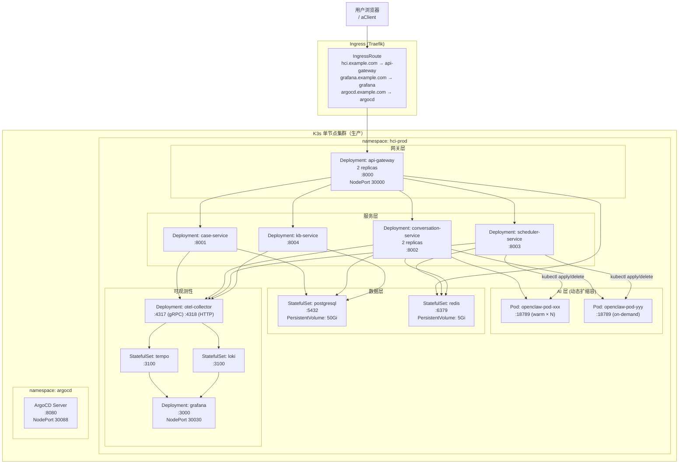
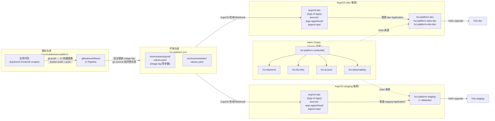
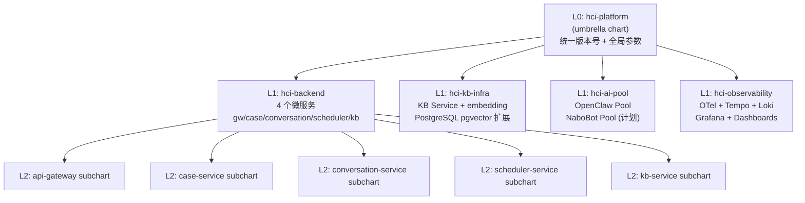

# HCI 智能排障平台 — 部署架构设计

> **本文档定位（WHY）**：架构决策依据——为什么这样设计部署架构。
>
> **不在此文档**：
> - 操作步骤（HOW）→ [部署指南.md](部署指南.md)
> - 发布流程 → [发布指南.md](发布指南.md)
>
> **关联文档**：[`../solution/架构设计.md`](../solution/架构设计.md)

---

## 文档信息
- **版本**: 1.0
- **更新日期**: 2026-04-06
- **状态**: 现行全量
- **技术栈**: K3s + Helm 4层 Chart + GitOps（ArgoCD）
- **关联文档**: [`../solution/架构设计.md`](../solution/架构设计.md)

---

## 变更历史

| 版本 | 日期 | 变更内容 |
|------|------|----------|
| 1.0 | 2026-04-06 | 初版，从架构设计.md §4 拆出；补充 Mermaid 部署图 + GitOps 流程图 |
| 1.1 | 2026-04-07 | Helm ConfigMap 新增 `20260407001_schema_repair.sql` 迁移条目，详见 [部署事件](events/2026-04-07-schema-漂移修复部署.md) |
| 1.2 | 2026-04-07 | 新增数据库迁移同步自动化机制，详见 [部署事件](events/2026-04-07-数据库迁移同步自动化部署.md) |
| 1.3 | 2026-04-07 | 新增迁移链修复迁移 `20260407003_fix_migration_chain.sql`，详见 [方案文档](../solution/events/2026-04-07-迁移链修复方案.md) |
| 1.4 | 2026-04-08 | Alembic K8s Job 改为 busybox noop（彻底废弃），`hci-platform-data` values.yaml 锁定 `enabled: false`；新增 `20260408001_sop_tables_fix_version.sql` 迁移并同步 ConfigMap，详见 [部署事件](events/2026-04-08-dbmate迁移机制全面修复部署.md) |
| 1.5 | 2026-04-09 | **db-migrate Job 重构**：改用 Atlas 声明式 `schema apply`；新增 `initContainer`（确保目标库及 atlas_dev 的 extensions）；将函数/触发器拆至 `desired_extras.sql` 由 psql 幂等执行；多阶段 Dockerfile（`arigaio/atlas` + `postgres:15-alpine`）。详见 [部署事件](events/2026-04-09-db-migrate-job重构.md) |
| 1.6 | 2026-04-16 | **db-migrate hook 死锁修复**：解决 ArgoCD PreSync Hook Job 因命名冲突与 finalizer 双重死锁导致迁移永远无法执行的问题。修改 Job 名后缀为镜像 tag 前 20 字符；delete-policy 增加 `HookSucceeded` 自动清理成功 Job。详见 §9。 |
| 1.7 | 2026-04-17 | **App of Apps 分层架构（PR #159）**：`§0.2` GitOps 图更新为双 ArgoCD 分层模型；dev 侧 `argocd-ops` sources 新增 `argo-apps/local/`；staging 侧新增独立 `argo-apps/cloud/argocd-ops.yaml`；防止 cloud/ Application 被 dev ArgoCD 误管（详见 [D-001](pitfalls/k8s.md)）。 |
| 1.8 | 2026-04-17 | **regexReplaceAll bug 修复（PR #162）**：§9.2.1 Helm 表达式中 `regexReplaceAll` 函数在 pipeline 模式下有 bug，直接返回 replacement 字符串而非替换后的输入。改用 `replace` 函数链：`lower → replace "." "-" → replace "_" "-" → trunc 15 → trimSuffix "-"`。详见 §9.3。 |
| 1.9 | 2026-04-17 | **ai_client.py ConfigMap 同步（PR #165）**：`files/ai_client.py` 同步至 backend 版本，添加 `provider_api_key` 参数支持。修复 conversation-service 启动失败 (`TypeError: unexpected keyword argument 'provider_api_key'`)。 |
| 1.10 | 2026-04-17 | **彻底移除 aiClientPatch 双重维护机制**：删除 `files/ai_client.py`、`ai-client-patch.yaml` 和 `values.yaml` 中的 `aiClientPatch` 配置块。镜像 v2.4.0+ 已包含完整修复，不再需要 ConfigMap 覆盖。消除双重维护同步遗漏风险。 |
| 1.11 | 2026-04-17 | **db-password-check Secret 依赖修复（PR #166）**：§10 B-3 PreSync Hook 原设计假设 `hci-platform-secrets.database-url`（不存在），改用单一权威来源 `hci-secrets.POSTGRES_PASSWORD`，在 Job 中动态构建 `DATABASE_URL`。符合业界最佳实践（与 PostgreSQL Operator 设计一致）。详见 §10。 |
| 1.12 | 2026-04-17 | **ArgoCD repo-server Probe 优化（PR #168）**：§11 repo-server CrashLoopBackOff 根因修复。分离 liveness/readiness probe：liveness 使用 `/healthz`（进程存活检查），readiness 使用 `/healthz?full=true`（功能可用检查，timeout 60秒）。新增 `argocd-repo-server-probe-patch.yaml` 由 GitOps 管理。详见 §11。 |

---

## 0. 部署全貌（Mermaid）

### 0.1 K3s 集群资源拓扑



### 0.2 GitOps 双仓模型 + ArgoCD 自动同步



> **App of Apps 分层要点（D-001）**：`argo-apps/local/` 只由 dev 侧 ArgoCD 管理，`argo-apps/cloud/` 只由 staging 侧 ArgoCD 管理。两个集群各自 bootstrap 一次 `argocd-ops.yaml`，之后由 ArgoCD 自动 reconcile。跨环境 apply 会因缺少凭据导致 sync 永久失败——参见 [pitfalls/k8s.md D-001](pitfalls/k8s.md)。

### 0.3 Helm Chart 四层结构



---

## 1. 基础设施规格

### 1.1 K3s 集群节点

| 节点 | 规格 | 角色 | 说明 |
|------|------|------|------|
| node-01 | 32 vCPU / 64 GB RAM / 500 GB SSD | control-plane + worker | 单节点集群（生产当前配置） |

### 1.2 持久化存储

| PVC | 大小 | StorageClass | 挂载路径 | 说明 |
|-----|------|-------------|---------|------|
| `postgresql-data` | 50 Gi | local-path | `/var/lib/postgresql/data` | 数据库主存储 |
| `redis-data` | 5 Gi | local-path | `/data` | Redis AOF 持久化 |
| `loki-data` | 20 Gi | local-path | `/loki` | 日志存储 |
| `tempo-data` | 10 Gi | local-path | `/tempo` | Trace 存储 |
| `grafana-data` | 2 Gi | local-path | `/var/lib/grafana` | Dashboard 配置 |
| `kbd-cache` | 10 Gi | local-path | `/app/scripts/kbd/cache` | KBD 流水线中间产物 |

### 1.3 网络规划

| 服务 | ClusterIP Port | NodePort | 用途 |
|------|---------------|----------|------|
| api-gateway | 8000 | 30000 | 外部访问入口 |
| grafana | 3000 | 30030 | 监控看板 |
| argocd-server | 8080 | 30088 | GitOps 控制台 |
| postgresql | 5432 | — | 仅集群内访问 |
| redis | 6379 | — | 仅集群内访问 |

---

## 2. AI Pod 资源配额

| 助手类型 | CPU Request | CPU Limit | Memory Request | Memory Limit | 热备数 | 最大数 |
|---------|------------|----------|---------------|-------------|--------|--------|
| openclaw | 500m | 2000m | 512 Mi | 2 Gi | 2 | 10 |
| nabobot（计划） | 500m | 1000m | 256 Mi | 1 Gi | 1 | 5 |

---

## 3. Security Context（安全基线）

所有工作负载遵循以下基线（PIT-025 规范）：

```yaml
securityContext:
  runAsNonRoot: true
  runAsUser: 1000     # Python/Node.js 应用
  allowPrivilegeEscalation: false
  readOnlyRootFilesystem: true
  capabilities:
    drop: ["ALL"]

# Nginx 类工作负载（如有）额外挂载：
volumes:
  - name: nginx-cache
    emptyDir: {}
  - name: nginx-run
    emptyDir: {}
volumeMounts:
  - name: nginx-cache
    mountPath: /var/cache/nginx
  - name: nginx-run
    mountPath: /var/run
```

---

## 4. 健康检查规范

```yaml
# 所有 FastAPI 服务统一模板
livenessProbe:
  httpGet:
    path: /health
    port: 808x
  initialDelaySeconds: 10
  periodSeconds: 15
  failureThreshold: 3

readinessProbe:
  httpGet:
    path: /ready
    port: 808x
  initialDelaySeconds: 5
  periodSeconds: 10
  failureThreshold: 2

# AI Pod 特殊健康检查（AI Assistant Protocol v1）
livenessProbe:
  httpPost:        # 空 payload，400 返回 = healthy，连接拒绝 = unhealthy
    path: /v1/chat/completions
    port: 18789
  initialDelaySeconds: 30
  periodSeconds: 30
```

---

## 5. 发布流程

```
1. 开发完成 → 创建 feature/* 分支 → 推送 → 创建 PR
2. CI 检查通过（lint + test + docs-governance）
3. PR 合并 main 分支
4. CI 自动构建 Docker 镜像 → 推送到 Registry
5. CI 自动更新环境仓库 environments/prod/values.yaml 中的 image.tag
6. ArgoCD 检测到环境仓库变更 (Webhook 或 3分钟轮询)
7. ArgoCD 执行 helm upgrade → K3s 滚动更新
8. 验证: 健康检查 + Grafana 告警静默期监控
```

详细 SOP 见 [`发布指南.md`](发布指南.md)。

---

## 6. 本地开发部署

```bash
# Docker Compose 本地开发环境
cd hci-troubleshoot-platform
docker compose up -d

# 服务启动顺序
# 1. PostgreSQL→Redis (数据层)
# 2. KB Service (依赖 PG)
# 3. Case/Conversation/Scheduler Service
# 4. API Gateway
```

详见 [`部署指南.md`](部署指南.md)。

---

## 7. 数据库迁移方案（Atlas）

自 v6.3 起，数据库迁移工具由 dbmate + Helm ConfigMap 替换为 **Atlas 声明式管理**。

| 方面 | 旧方案 | 新方案 |
|------|--------|--------|
| 迁移文件 | `database/migrations/*.sql`（手动管理） | `database/atlas-migrations/`（Atlas 管理） |
| 部署载体 | Helm ConfigMap 静态嵌入（需手动同步） | Docker 镜像 `db-migrate`（CI 自动构建） |
| Job 镜像 | `ghcr.io/amacneil/dbmate` | `ghcr.io/sangfor-hci/hci-platform/db-migrate:<tag>` |
| 版本跟踪表 | `schema_migrations` | `atlas_schema_revisions` |
| PR 前验证 | 无 | `atlas migrate lint` + 全量执行 + 幂等性验证 |

### 首次切换已有环境

已有 dev/staging/prod 环境使用 `--baseline` 跳过全量建表迁移：

```yaml
# hci-platform-env/environments/dev/values.yaml
dbMigrate:
  image:
    repository: "ghcr.io/tomturing/hci-troubleshoot-platform/db-migrate"
    tag: "<YYYYMMDD-HHMM-sha7>"  # 由 CI env-repo-sync 自动更新
```

详见 [Atlas 改造上线操作](events/2026-04-08-atlas改造上线操作.md)。

---

*文档版本: 1.8 | 更新日期: 2026-04-17 | regexReplaceAll bug 修复（§9.4）*

---

## §9 db-migrate Hook 死锁修复（2026-04-16）

### 9.1 问题根因（四层叠加）

**层1：Job 命名依赖 `.Release.Revision`（ArgoCD 中永远为 1）**

ArgoCD 通过 `helm template` 渲染模板，非 `helm install`，所以 `.Release.Revision` 恒等于 `1`。
原始命名 `db-migrate-{{ .Release.Revision }}` 导致所有 sync 创建的 Job 名永远是 `db-migrate-1`。

**层2：BeforeHookCreation + finalizer 死锁**

旧 Job 失败后，ArgoCD 在其上设置 `deletionTimestamp`，但 `argocd.argoproj.io/hook-finalizer`
阻止实际删除，直至 ArgoCD Controller 处理完成。若 Controller 内部状态异常（如本次的 4h12m
超时，`BackoffLimitExceeded`），finalizer 会长期卡住，`BeforeHookCreation` 无法删除旧 Job，
新 Job 也就永远无法创建。

**层3：`dbMigrate.enabled: false` 禁用 hook（临时应急遗留）**

commit `1bdc53b` 为绕过死锁将 env repo 中 `enabled` 改为 `false`，修复期间忘记恢复，
导致后续所有 sync 完全跳过迁移 Job。

**层4：ghcr-pull-secret token 过期导致 ImagePullBackOff**

ServiceAccount 绑定的 Secret 中的 PAT 已过期（DENIED），新 Job 虽可创建但无法拉取镜像。

### 9.2 修复方案

#### 9.2.1 Job 命名策略

| | 修改前 | 修改后 |
|---|---|---|
| 命名规则 | `db-migrate-{{ .Release.Revision }}` | `db-migrate-{{ .Values.dbMigrate.image.tag \| trunc 20 \| lower \| sanitize }}` |
| 问题 | ArgoCD 中 Revision 恒为 1，永久冲突 | tag 随镜像 CI 构建自动变化，天然区分 |

具体 Helm 表达式：
```yaml
name: db-migrate-{{ .Values.dbMigrate.image.tag | default "latest" | lower | replace "." "-" | replace "_" "-" | trunc 15 | trimSuffix "-" }}-{{ .Chart.Version | lower | replace "." "" }}
```

> **⚠️ 历史问题（已修复）**：早期版本使用 `regexReplaceAll` 函数，但 Sprig 该函数在 pipeline 模式下存在 bug：
> ```yaml
> # 错误用法（有 bug）
> "latest" | regexReplaceAll "[^a-z0-9A-Z-]" ""  → "" (空字符串，而非 "latest")
> ```
> 现已改用可靠的 `replace` 函数链（详见 §9.3）。

> **注意**：当 tag 为固定值（如 `latest`）时，Job 名不变，此时依赖 `BeforeHookCreation` 清理旧 Job。
> 推荐在 CI env-repo-sync 中始终使用含日期 + SHA 的唯一 tag（如 `20260416-0457-857b0eb`）确保每次命名唯一。

#### 9.2.2 delete-policy 策略

| | 修改前 | 修改后 |
|---|---|---|
| delete-policy | `BeforeHookCreation` | `BeforeHookCreation`（不使用 `HookSucceeded`） |
| 效果 | 成功 Job 残留；失败 Job finalizer 死锁时 BeforeHookCreation 失效 | 新 sync 时自动删除旧 Job；成功 Job 由 TTL（3600s）清理 |

> **⚠️ 历史问题（已修复）**：早期版本使用 `BeforeHookCreation,HookSucceeded`，导致 ArgoCD 在 Job 成功后立即删除，但 sync operation 可能还在等待状态更新，造成 sync 卡住。现已改为只使用 `BeforeHookCreation`，让 Job 保留足够时间供 ArgoCD 状态更新。

#### 9.2.3 env repo 恢复

将 `hci-platform-env/environments/dev/values.yaml` 中 `dbMigrate.enabled` 恢复为 `true`，
并轮换 `ghcrToken` 为新 PAT（更新 ghcr-pull-secret）。

### 9.3 验证结果

| 验证项 | 结果 |
|--------|------|
| `db-migrate-*` pod 状态 | `Completed` |
| `pending_resolution` 列是否存在 | 已存在于 `conversation` 表 |
| ArgoCD sync phase | `Succeeded` |
| conversation-service 错误日志 | 无 `UndefinedColumnError` |

### 9.4 regexReplaceAll Bug 修复（2026-04-17，PR #162）

**问题现象**：ArgoCD sync 时 db-migrate Job 名渲染为 `db-migrate--`（空字符串后缀），违反 Kubernetes RFC 1123 命名规范。

**根因**：Sprig `regexReplaceAll` 函数在 pipeline 模式下存在 bug：

```yaml
# Bug 验证（本地 Helm 测试）
"latest" | regexReplaceAll "[^a-z0-9A-Z-]" ""  → "" (空，期望 "latest")
"0.1.0"  | regexReplaceAll "[^a-z0-9]" ""      → "" (空，期望 "010")

# 原因：regexReplaceAll 在 pipeline 中直接返回 replacement 参数，而非替换后的输入
```

**修复方案**：改用可靠的 `replace` 函数链：

```yaml
# 修复前（有 bug）
{{- $tag := .Values.dbMigrate.image.tag | default "latest" | regexReplaceAll "[^a-z0-9A-Z-]" "" | lower | trunc 15 | trimSuffix "-" }}
{{- $chartVer := .Chart.Version | regexReplaceAll "[^a-z0-9]" "" | lower }}

# 修复后（正确）
{{- $tag := .Values.dbMigrate.image.tag | default "latest" | lower | replace "." "-" | replace "_" "-" | trunc 15 | trimSuffix "-" }}
{{- $chartVer := .Chart.Version | lower | replace "." "" }}
```

**渲染结果对比**：

| | 修复前 | 修复后 |
|---|---|---|
| Job 名 | `db-migrate--` ❌ | `db-migrate-latest-010` ✓ |
| 符合 RFC 1123 | 否（以 `-` 结尾） | 是 |

**影响范围**：仅修改 `deploy/helm/hci-platform/templates/hooks/db-migrate-job.yaml`，不影响其他模板。

---

## §10 db-password-check Secret 依赖修复（2026-04-17，PR #166）

### 10.1 问题根因

**原始设计缺陷（commit 2172354，2026-03-29）**：

B-3 特性（DB 密码漂移预检 Job）从第一天就存在设计错误：

```yaml
# 原设计（错误）
env:
  - name: DATABASE_URL
    valueFrom:
      secretKeyRef:
        name: hci-platform-secrets  # ❌ 此 Secret 从未创建
        key: database-url            # ❌ 此 key 从未定义
```

**问题本质**：设计假设了一个不存在的 Secret 结构，与实际实现割裂。

### 10.2 第一性原理分析

| 层级 | 分析 |
|-----|-----|
| **原始需求** | 防止运维人员修改 PostgreSQL 密码后，K8s Secret 未同步，导致服务启动失败 |
| **问题本质** | 配置漂移（Configuration Drift）— 两个权威来源不一致 |
| **设计缺陷** | 假设 `hci-platform-secrets.database-url` 存储完整连接字符串（从未创建） |
| **实际实现** | `hci-secrets.POSTGRES_PASSWORD` 只存储密码原子字段 |

### 10.3 业界最佳实践对比

| 项目 | Secret 结构 | 连接字符串处理 |
|-----|------------|--------------|
| **PostgreSQL Operator (CrunchyData)** | `user`, `password`, `host`, `port`, `database` 分离 | 应用层动态拼接 |
| **Redis Operator** | `password` 单独存储 | 应用层拼接 |
| **MySQL Operator** | `user`, `password`, `host` 分离 | 应用层拼接 |

**业界共识**：不存储完整连接字符串，只存储原子字段，运行时动态拼接。

### 10.4 修复方案

**核心原则**：单一权威来源 + 动态构建连接

```yaml
# 修复后（符合业界范式）
env:
  # 从单一权威来源读取密码
  - name: POSTGRES_PASSWORD
    valueFrom:
      secretKeyRef:
        name: hci-secrets        # ✓ 正确的 Secret（由 hci-platform chart 创建）
        key: POSTGRES_PASSWORD   # ✓ 正确的 key
  # 动态构建 DATABASE_URL
  - name: DATABASE_URL
    value: "postgres://{{ .Values.config.postgresUser }}:$(POSTGRES_PASSWORD)@postgres:5432/{{ .Values.config.postgresDb }}?sslmode=disable"
```

**方案依据**：

| 依据 | 说明 |
|-----|-----|
| **单一权威来源** | 密码只存在一处，无冗余存储 |
| **业界范式一致** | 与 PostgreSQL Operator 设计一致 |
| **最小改动范围** | 只修改一个模板文件 |
| **向后兼容** | 不改变现有 Secret 结构 |
| **依赖显式声明** | 通过 `.Values.config.*` 传递参数 |

### 10.5 跨 Chart 依赖声明

```
依赖关系：
  hci-platform-data/templates/hooks/db-password-check.yaml
    → hci-secrets Secret（由 hci-platform/templates/secret.yaml 创建）
    → .Values.config.postgresUser/postgresDb（由 hci-platform-data/values.yaml 定义）
```

### 10.6 验证结果

| 验证项 | 预期结果 |
|--------|---------|
| hci-platform-data-dev Sync | `Succeeded` |
| db-password-check Job | `Completed`（密码验证通过） |
| Secret 读取 | `hci-secrets.POSTGRES_PASSWORD` 正确获取 |

---

## §11 ArgoCD repo-server Probe 优化（2026-04-17，PR #168）

### 11.1 问题根因

**问题现象**：
- ArgoCD repo-server Pod 处于 CrashLoopBackOff 状态
- `hci-platform-data-dev` Application sync operation 状态为 Error
- 错误信息：`dial tcp 10.43.205.25:8081: connect: connection refused`

**根因链条（五层叠加）**：

| 层级 | 问题 |
|-----|------|
| L1 | `/healthz?full=true` 调用 gRPC HealthCheck，请求会被排队 |
| L2 | gRPC 队列阻塞时，healthcheck 请求等待超过 HTTP timeout（10秒） |
| L3 | 连续 3 次 timeout → liveness probe 失败 → Pod 被 kill |
| L4 | Pod 重启后再次阻塞 → CrashLoopBackOff 循环 |
| L5 | ArgoCD Application 无法连接 repo-server → sync Error |

**源码分析**（`argocd_repo_server.go`）：

```go
// /healthz?full=true 的实现
if val, ok := r.URL.Query()["full"]; ok && val[0] == "true" {
    // 创建 gRPC 连接（超时 60 秒）
    conn, err := apiclient.NewConnection("localhost:8081", 60, ...)
    
    // 调用 gRPC HealthCheck（会被排队等待）
    client := grpc_health_v1.NewHealthClient(conn)
    res, err := client.Check(r.Context(), &grpc_health_v1.HealthCheckRequest{})
}
```

**核心矛盾**：gRPC 连接超时 60秒，但 HTTP request context 只有 10秒。

### 11.2 第一性原理分析

| 原则 | 分析 |
|-----|-----|
| **原始需求** | liveness probe 检查进程存活，readiness probe 检查功能可用 |
| **问题本质** | 混淆了 liveness 和 readiness 的职责边界 |
| **正确做法** | liveness 应只检查进程存活，不检查 gRPC 功能 |

### 11.3 Kubernetes Probe 设计原则

| Probe 类型 | 目的 | 失败后果 | 适用场景 |
|-----------|------|---------|---------|
| **livenessProbe** | 检查进程是否存活 | Pod 重启 | 进程崩溃、死锁 |
| **readinessProbe** | 检查服务是否可用 | 流量停止路由 | 服务初始化、暂时不可用 |

**关键区别**：
- `/healthz?full=true` 失败 → readiness 失败 → Pod 不接受请求（不重启）
- `/healthz` 失败 → 进程死掉 → Pod 重启

### 11.4 修复方案

**核心原则**：分离 liveness 和 readiness probe 的职责

```yaml
# argocd-repo-server-probe-patch.yaml
livenessProbe:
  httpGet:
    path: /healthz           # 不使用 full=true
    port: 8084
  timeoutSeconds: 5          # 进程检查，5秒足够

readinessProbe:
  httpGet:
    path: /healthz?full=true # 完整功能检查
    port: 8084
  timeoutSeconds: 60         # 与 gRPC 连接超时匹配

env:
  - name: ARGOCD_REPO_SERVER_PARALLELISM_LIMIT
    value: "4"                # 限制并发 gRPC 调用
```

**方案依据**：

| 依据 | 说明 |
|-----|-----|
| **职责分离** | liveness 检进程，readiness 检功能 |
| **消除阻塞** | liveness 不调用 gRPC，永不阻塞 |
| **自动恢复** | gRPC 阻塞时 readiness 失败，完成后自动恢复 |
| **业界共识** | 参考 ArgoCD Issue #6106 |

### 11.5 GitOps 管理

将 patch 文件放入 `deploy/gitops/argocd-ops/` 目录，由 `argocd-ops` Application 自动同步管理。

```
ArgoCD 同步流程：
  1. PR 合入 main 分支
  2. ArgoCD argocd-ops Application 检测变更
  3. 自动 apply StrategicMergePatch
  4. repo-server Deployment 更新
  5. Pod 滚动更新，应用新 probe 配置
```

### 11.6 验证结果

| 验证项 | 预期结果 |
|--------|---------|
| argocd-repo-server Pod | Running（不再 CrashLoopBackOff） |
| hci-platform-data-dev Sync | Succeeded |
| 所有 Application 状态 | Synced + Healthy |

---

*文档版本: 1.12 | 更新日期: 2026-04-17 | ArgoCD repo-server Probe 优化（§11）*
