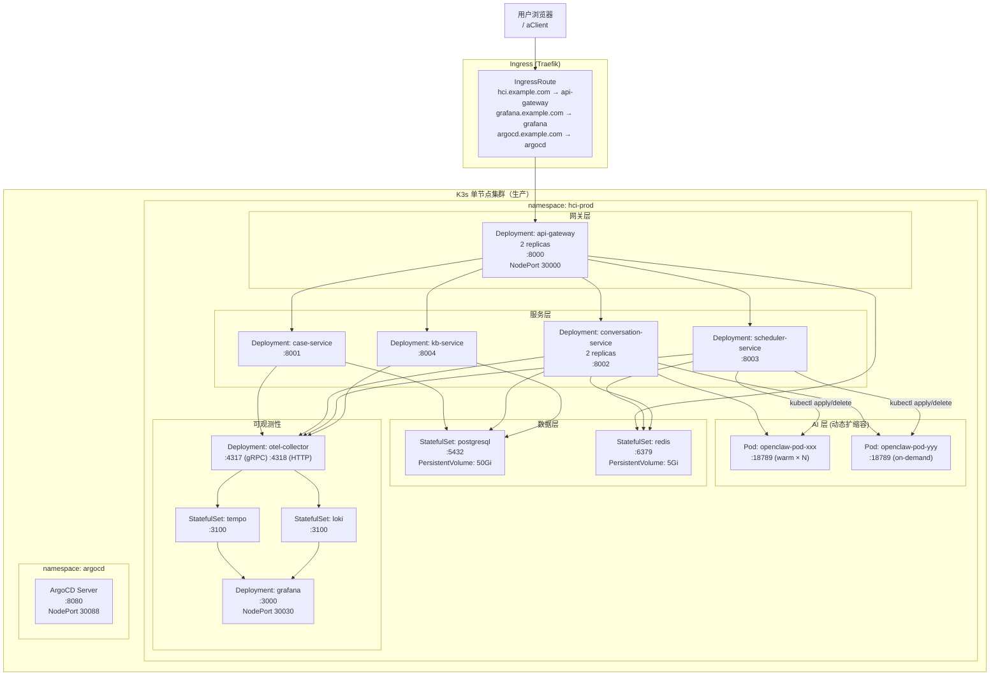
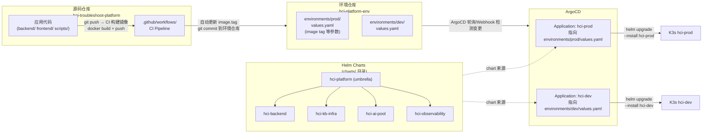
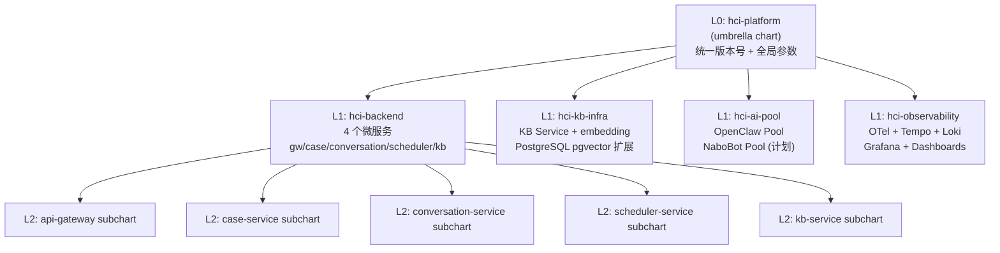

# HCI 智能排障平台 — 部署架构设计

> **本文档定位（WHY）**：架构决策依据——为什么这样设计部署架构。
>
> **不在此文档**：
> - 操作步骤（HOW）→ [部署指南.md](部署指南.md)
> - 发布流程 → [发布指南.md](发布指南.md)
>
> **关联文档**：[`../solution/架构设计.md`](../solution/架构设计.md)

---

## 文档信息
- **版本**: 1.0
- **更新日期**: 2026-04-06
- **状态**: 现行全量
- **技术栈**: K3s + Helm 4层 Chart + GitOps（ArgoCD）
- **关联文档**: [`../solution/架构设计.md`](../solution/架构设计.md)

---

## 变更历史

| 版本 | 日期 | 变更内容 |
|------|------|----------|
| 1.0 | 2026-04-06 | 初版，从架构设计.md §4 拆出；补充 Mermaid 部署图 + GitOps 流程图 |
| 1.1 | 2026-04-07 | Helm ConfigMap 新增 `20260407001_schema_repair.sql` 迁移条目，详见 [部署事件](events/2026-04-07-schema-漂移修复部署.md) |
| 1.2 | 2026-04-07 | 新增数据库迁移同步自动化机制，详见 [部署事件](events/2026-04-07-数据库迁移同步自动化部署.md) |
| 1.3 | 2026-04-07 | 新增迁移链修复迁移 `20260407003_fix_migration_chain.sql`，详见 [方案文档](../solution/events/2026-04-07-迁移链修复方案.md) |
| 1.4 | 2026-04-08 | Alembic K8s Job 改为 busybox noop（彻底废弃），`hci-platform-data` values.yaml 锁定 `enabled: false`；新增 `20260408001_sop_tables_fix_version.sql` 迁移并同步 ConfigMap，详见 [部署事件](events/2026-04-08-dbmate迁移机制全面修复部署.md) |
| 1.5 | 2026-04-09 | **db-migrate Job 重构**：改用 Atlas 声明式 `schema apply`；新增 `initContainer`（确保目标库及 atlas_dev 的 extensions）；将函数/触发器拆至 `desired_extras.sql` 由 psql 幂等执行；多阶段 Dockerfile（`arigaio/atlas` + `postgres:15-alpine`）。详见 [部署事件](events/2026-04-09-db-migrate-job重构.md) |

---

## 0. 部署全貌（Mermaid）

### 0.1 K3s 集群资源拓扑



### 0.2 GitOps 双仓模型 + ArgoCD 自动同步



### 0.3 Helm Chart 四层结构



---

## 1. 基础设施规格

### 1.1 K3s 集群节点

| 节点 | 规格 | 角色 | 说明 |
|------|------|------|------|
| node-01 | 32 vCPU / 64 GB RAM / 500 GB SSD | control-plane + worker | 单节点集群（生产当前配置） |

### 1.2 持久化存储

| PVC | 大小 | StorageClass | 挂载路径 | 说明 |
|-----|------|-------------|---------|------|
| `postgresql-data` | 50 Gi | local-path | `/var/lib/postgresql/data` | 数据库主存储 |
| `redis-data` | 5 Gi | local-path | `/data` | Redis AOF 持久化 |
| `loki-data` | 20 Gi | local-path | `/loki` | 日志存储 |
| `tempo-data` | 10 Gi | local-path | `/tempo` | Trace 存储 |
| `grafana-data` | 2 Gi | local-path | `/var/lib/grafana` | Dashboard 配置 |
| `kbd-cache` | 10 Gi | local-path | `/app/scripts/kbd/cache` | KBD 流水线中间产物 |

### 1.3 网络规划

| 服务 | ClusterIP Port | NodePort | 用途 |
|------|---------------|----------|------|
| api-gateway | 8000 | 30000 | 外部访问入口 |
| grafana | 3000 | 30030 | 监控看板 |
| argocd-server | 8080 | 30088 | GitOps 控制台 |
| postgresql | 5432 | — | 仅集群内访问 |
| redis | 6379 | — | 仅集群内访问 |

---

## 2. AI Pod 资源配额

| 助手类型 | CPU Request | CPU Limit | Memory Request | Memory Limit | 热备数 | 最大数 |
|---------|------------|----------|---------------|-------------|--------|--------|
| openclaw | 500m | 2000m | 512 Mi | 2 Gi | 2 | 10 |
| nabobot（计划） | 500m | 1000m | 256 Mi | 1 Gi | 1 | 5 |

---

## 3. Security Context（安全基线）

所有工作负载遵循以下基线（PIT-025 规范）：

```yaml
securityContext:
  runAsNonRoot: true
  runAsUser: 1000     # Python/Node.js 应用
  allowPrivilegeEscalation: false
  readOnlyRootFilesystem: true
  capabilities:
    drop: ["ALL"]

# Nginx 类工作负载（如有）额外挂载：
volumes:
  - name: nginx-cache
    emptyDir: {}
  - name: nginx-run
    emptyDir: {}
volumeMounts:
  - name: nginx-cache
    mountPath: /var/cache/nginx
  - name: nginx-run
    mountPath: /var/run
```

---

## 4. 健康检查规范

```yaml
# 所有 FastAPI 服务统一模板
livenessProbe:
  httpGet:
    path: /health
    port: 808x
  initialDelaySeconds: 10
  periodSeconds: 15
  failureThreshold: 3

readinessProbe:
  httpGet:
    path: /ready
    port: 808x
  initialDelaySeconds: 5
  periodSeconds: 10
  failureThreshold: 2

# AI Pod 特殊健康检查（AI Assistant Protocol v1）
livenessProbe:
  httpPost:        # 空 payload，400 返回 = healthy，连接拒绝 = unhealthy
    path: /v1/chat/completions
    port: 18789
  initialDelaySeconds: 30
  periodSeconds: 30
```

---

## 5. 发布流程

```
1. 开发完成 → 创建 feature/* 分支 → 推送 → 创建 PR
2. CI 检查通过（lint + test + docs-governance）
3. PR 合并 main 分支
4. CI 自动构建 Docker 镜像 → 推送到 Registry
5. CI 自动更新环境仓库 environments/prod/values.yaml 中的 image.tag
6. ArgoCD 检测到环境仓库变更 (Webhook 或 3分钟轮询)
7. ArgoCD 执行 helm upgrade → K3s 滚动更新
8. 验证: 健康检查 + Grafana 告警静默期监控
```

详细 SOP 见 [`发布指南.md`](发布指南.md)。

---

## 6. 本地开发部署

```bash
# Docker Compose 本地开发环境
cd hci-troubleshoot-platform
docker compose up -d

# 服务启动顺序
# 1. PostgreSQL→Redis (数据层)
# 2. KB Service (依赖 PG)
# 3. Case/Conversation/Scheduler Service
# 4. API Gateway
```

详见 [`部署指南.md`](部署指南.md)。

---

## 7. 数据库迁移方案（Atlas）

自 v6.3 起，数据库迁移工具由 dbmate + Helm ConfigMap 替换为 **Atlas 声明式管理**。

| 方面 | 旧方案 | 新方案 |
|------|--------|--------|
| 迁移文件 | `database/migrations/*.sql`（手动管理） | `database/atlas-migrations/`（Atlas 管理） |
| 部署载体 | Helm ConfigMap 静态嵌入（需手动同步） | Docker 镜像 `db-migrate`（CI 自动构建） |
| Job 镜像 | `ghcr.io/amacneil/dbmate` | `ghcr.io/sangfor-hci/hci-platform/db-migrate:<tag>` |
| 版本跟踪表 | `schema_migrations` | `atlas_schema_revisions` |
| PR 前验证 | 无 | `atlas migrate lint` + 全量执行 + 幂等性验证 |

### 首次切换已有环境

已有 dev/staging/prod 环境使用 `--baseline` 跳过全量建表迁移：

```yaml
# hci-platform-env/environments/dev/values.yaml
dbMigrate:
  image: "ghcr.io/sangfor-hci/hci-platform/db-migrate:<sha-tag>"
  atlasBaseline: "20260408000000"   # 首次切换时设置，切换完成后可移除
```

详见 [Atlas 改造上线操作](events/2026-04-08-atlas改造上线操作.md)。

---

*文档版本: 1.5 | 更新日期: 2026-04-08 | 新增 Atlas 迁移方案（§7）*
