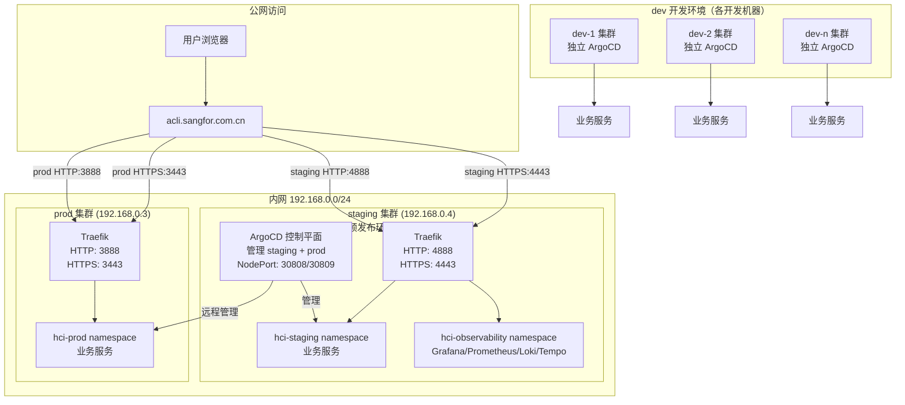
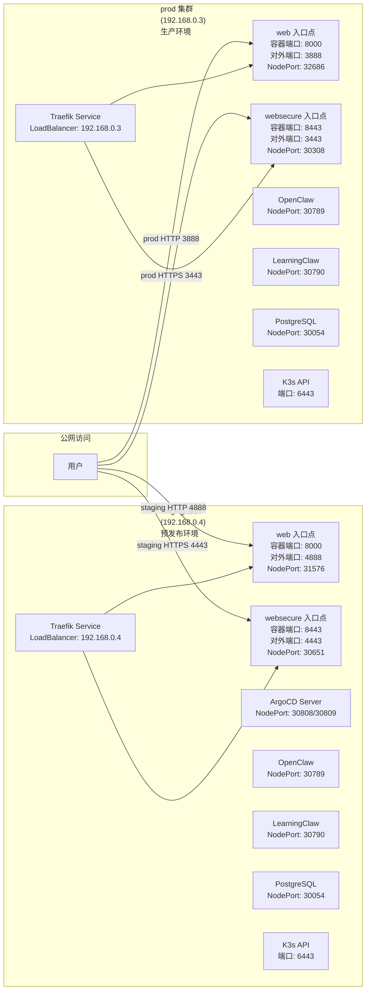
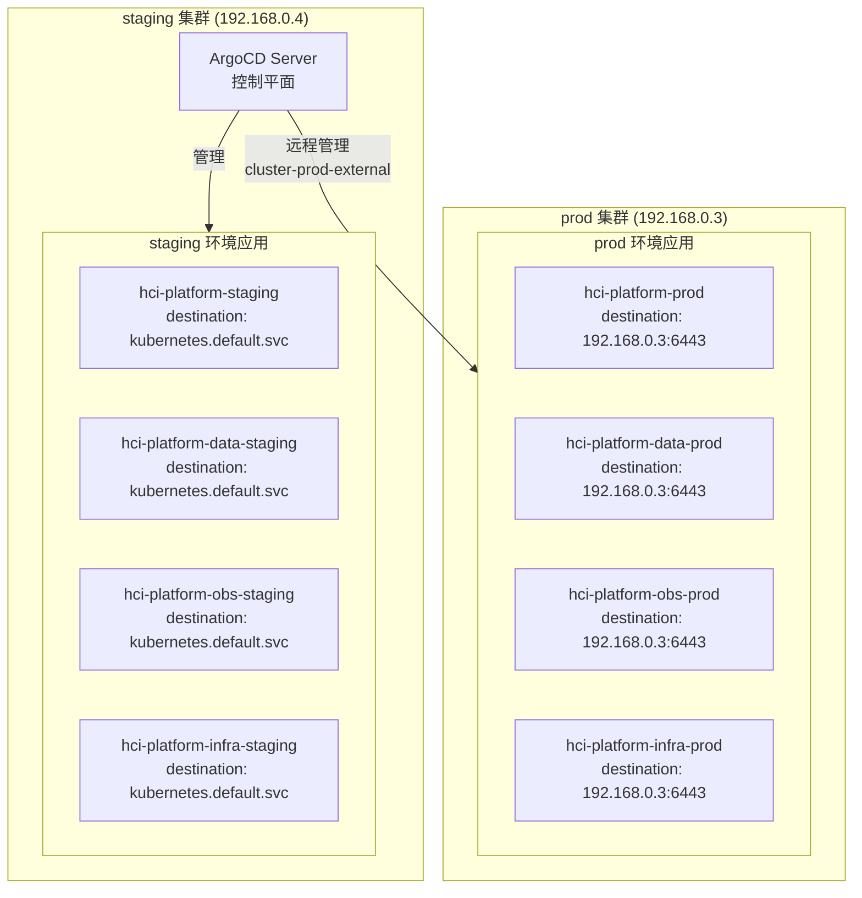
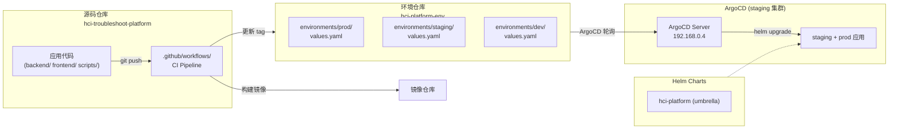
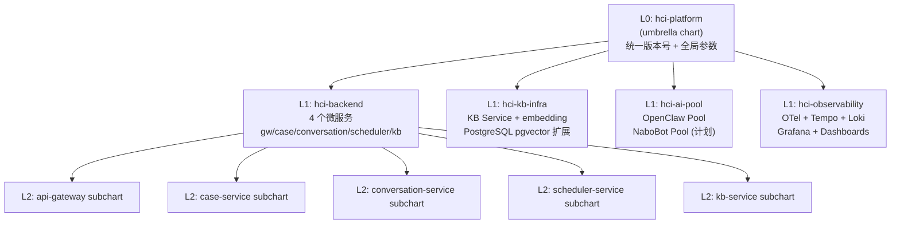

# HCI 智能排障平台 — 部署架构设计

> **本文档定位（WHY）**：架构决策依据——为什么这样设计部署架构。
>
> **不在此文档**：
> - 操作步骤（HOW）→ [部署指南.md](部署指南.md)
> - 发布流程 → [发布指南.md](发布指南.md)
>
> **关联文档**：[`../solution/架构设计.md`](../solution/架构设计.md)

---

## 文档信息
- **版本**: 1.63
- **更新日期**: 2026-08-10
- **状态**: 现行全量
- **技术栈**: K3s + Helm 4层 Chart + GitOps（ArgoCD）
- **关联文档**: [`../solution/架构设计.md`](../solution/架构设计.md)

---

## 变更历史

| **1.63** | **2026-08-10** | **hci_sim 独立数据库阶段二 PR-A**：新增独立 database/角色/迁移 Hook；默认关闭，环境必须显式启用并提供 migrator/runtime 密码。迁移只挂载 `database/hci-sim-migrations`，不读取主库 `desired_schema.sql`；存量表复制和旧表清理仍需观察窗口与独立 contract。 | [hci_sim 独立数据库隔离方案](../solution/events/2026-08-10-hci_sim独立数据库隔离方案.md) |

| 版本 | 日期 | 变更内容 |
|------|------|----------|
| **1.61** | **2026-08-06** | **KBD 数据管道 LLM 并发治理配置**：kb-service Helm values 新增 `kbService.llmGlobalConcurrency`，通过公共 ConfigMap 注入 `LLM_GLOBAL_CONCURRENCY`，统一限制 VISION、CLASSIFY、EXTRACT_SIGNALS 的进程级 LLM 并发；默认值为 3，Provider 全局配额仍需结合环境级限流和运行指标调整。 | 
| **1.63** | **2026-08-10** | **K3s 受管 terminal_bridge NetworkPolicy selector 修复**：DNS、hci-sim 和 Tempo 出站目标统一渲染为 `podSelector.matchLabels`，并由 Helm 单元测试断言，避免缺少 `matchLabels` 时被解释为允许目标命名空间中的全部 Pod。 | [terminal_bridge K3s 部署与验证](../deploy/terminal-bridge-k3s.md) |
| **1.62** | **2026-08-10** | **K3s 受管 terminal_bridge 阶段一**：dev 可由外部环境仓库启用单副本 cluster Bridge；同源 `/terminal-bridge` 由 Traefik 转发，Helm 渲染期拒绝 wildcard Origin/多副本，并用 NetworkPolicy 限制 Traefik 入站与 DNS、hci-sim SSH、Tempo 出站。Bridge 不自动挂载 ServiceAccount token；当前实际启用仍以 `hci-platform-env/environments/dev/values.yaml` 合并为准。 | [K3s 受管 terminal_bridge 启用方案](../solution/events/2026-08-10-K3s受管terminal_bridge启用方案.md) |
| **1.60** | **2026-08-06** | **kb-service DNS 与三级探针不变量**：集群内短服务名依赖显式 `ClusterFirst`；liveness 只检查进程，readiness 以 2 秒上限验证数据库，startup 仅确认应用初始化。Helm 对 dev/staging/prod 同模板渲染，禁止环境硬编码，并通过显式 desired field 收敛历史 `dnsPolicy: None` 漂移。详见 [D-022](pitfalls/k8s.md)。 |
| **1.59** | **2026-07-30** | **KBD Pipeline 与运行时契约发布边界（PR #644）**：部署同步 Signal Schema、qfk_log 工具能力、Prompt 与声明式数据库变更；KBD 生产审计为只读门禁，发布仍以 Admin 专家确认后的稳定 Proposal 为准。 | [qfk_log统一日志采集解析与判定设计](../solution/agent/02-架构设计/qfk_log统一日志采集解析与判定设计.md) |
| **1.58** | **2026-07-29** | **Alloy 采集健康门禁**：独立 `hci-platform-obs` Chart 与主 Chart 的兼容观测模板同步固化 `100m/128Mi → 1CPU/512Mi` 资源基线、`/-/ready` 三类探针、Prometheus 自动发现和日志流水线告警；Pod Ready 不再作为 Loki 链路完成依据 |
| **1.57** | **2026-07-27** | **运行时代码完整性防护**：在集群级 `hci-platform-infra` Chart 新增 `ValidatingAdmissionPolicy` / Binding。业务命名空间内的 Deployment、StatefulSet、DaemonSet 不能通过任何 `volumeMount` 覆盖 `/app/app/`、`/app/shared/` 或 `*.py`；API Server 在写入前以 `Fail + Deny` 拒绝，防止临时 ConfigMap `subPath` 覆盖不可变镜像。详见 [D-015](pitfalls/k8s.md) |
| **1.56** | **2026-07-25** | **KBD 检索来源与阈值配置加固**：移除 kb-service 的本地 BGE HostPath/env/volume 配置，新增 `kbService.minSimilarity` 并通过 ConfigMap 注入 `KBD_MIN_SIMILARITY`；数据库声明式 schema 增加 embedding provenance 字段和审计状态约束。部署后先重建中文 FTS，再在 provider 健康时使用 `python -m app.cli.rebuild_kbd_search_index --with-embeddings` 回填历史向量 |
| **1.55** | **2026-07-25** | **ConfigMap 模板补充 LLM_EMBEDDING_MODEL 注入（PR #616）**：`deploy/helm/hci-platform/templates/configmap.yaml` 中新增 `LLM_EMBEDDING_MODEL` 条目，值继承 `Values.kbService.llmEmbeddingModel`，使 kb-service Pod 可从环境变量直接获取 KBD Embedding 模型名称 |
| **1.54** | **2026-07-16** | **单副本+RWO PVC 的 Deployment 统一改用 Recreate 更新策略（PR #567）**：`hci-platform-obs` Chart 中 `langfuse-clickhouse`/`langfuse-minio`/`loki`/`tempo`（单副本 + ReadWriteOnce PVC）及无状态单副本 `langfuse-server` 的更新策略由默认 `RollingUpdate` 改为 `Recreate`。`RollingUpdate` 滚动升级时新旧 Pod 并存会争用同一 RWO 数据目录（langfuse-clickhouse 曾 exit code 76 → CrashLoopBackOff → 应用 Degraded），`Recreate` 保证同一时刻仅一个实例独占 PVC。未改动 `langfuse-worker`(无卷)/`prometheus`(emptyDir)/`grafana`(仅 configMap) |
| **1.53** | **2026-07-16** | **修复 ClickHouse 内存不足导致 Langfuse WebUI 无法查询新 trace**：ClickHouse jemalloc 缓存导致 RSS 持续增长（resident 达 2.18GiB），2Gi Pod limit 下 WebUI trace 列表查询触发 `MEMORY_LIMIT_EXCEEDED`（current RSS 1.81GiB > maximum 1.80GiB），用户在 Langfuse WebUI 上只能看到最后一次成功查询的缓存数据（7月14日 20:03 CST），之后写入的 trace 虽已落盘但无法查询。将 `hci-platform-obs` Chart 中 `langfuse.clickhouse.resources.limits.memory` 从 `2Gi` 提升至 `4Gi`，保证查询内存余量 |
| **1.52** | **2026-07-15** | **修复 Langfuse v3 无头初始化变量名（PR #549）**：v3 实际读取 `LANGFUSE_INIT_PROJECT_PUBLIC_KEY` / `LANGFUSE_INIT_PROJECT_SECRET_KEY`（非 PR #548 误用的 `PROJECT_PK`/`PROJECT_SK`），且 org 级无 API Key（`ORG_PK`/`ORG_SK` 不被读取）。修正后 server 首次启动（DB 为空）才会真正创建带指定 key 的 project API Key，agent-service SDK 才能鉴权写入 trace。环境仓库启用见对应 PR |\n| **1.51** | **2026-07-14** | **Langfuse 无头初始化自动建项目（PR #548）**：在 `hci-platform-obs` Chart 中新增 `langfuse.init` 配置块（默认关闭，opt-in），并在 `langfuse-server` 注入 `LANGFUSE_INIT_*` 环境变量。首次启动（DB 为空）时自动创建 org/project/用户与 API Key，避免手动在 Web UI 配置；project 的 public/secret key 复用 `langfuse.publicKey`/`langfuse.secretKey`（即 agent-service SDK 注入的同一对 key），SDK 上线即可写入 trace。环境仓库启用见 PR #33 |
| **1.50** | **2026-07-09** | **Langfuse 镜像版本锁定（PR #503）**：将 `hci-platform-obs` Chart 中 langfuse server/worker 镜像从浮动 tag `:3` 升级并锁定为 `v3.202.1` OSS 版本。避免浮动 tag 漂移带来的不可控升级风险，确保 dev 环境启用 langfuse 链路追踪时版本可追溯。配套在 `hci-platform-env` dev values 中启用 langfuse 配置 |
| **1.49** | **2026-07-02** | **修复 agent-service Langfuse Helm 条件判断（PR #491）**：`deploy/helm/hci-platform/templates/agent-service/deployment.yaml` 中 Langfuse env 块的条件判断从 `{{- if .Values.langfuse }}` 改为 `{{- if and .Values.langfuse .Values.langfuse.enabled }}`。原条件仅检查 map 是否存在，未检查 `enabled` 标志，导致 dev 环境 `langfuse.enabled=false` 时仍渲染 `LANGFUSE_SECRET_KEY` 的 `secretKeyRef`，而 `hci-secrets` 中无此 key，触发 agent-service Pod `CreateContainerConfigError`。配套在 `hci-platform-env` dev values 显式声明 `langfuse.enabled: false` 防止 base chart 重构再次踩坑 |
| **1.48** | **2026-07-02** | **回滚 PR #490 对 admin-ui/customer-ui 移除 nginx-conf-d 挂载的错误操作（PR #492）**：回滚 PR #490 误删的 `nginx-conf-d` emptyDir 挂载，解决 Nginx 在以 `runAsUser=1000` 运行时因 `/etc/nginx/conf.d/` 目录不可写导致 envsubst 静默跳过并加载官方默认配置引发白屏/404的故障。在 §3 补充对运行时双轨配置机制（Nginx templates 运行时 `envsubst` + Helm `emptyDir` + `fsGroup` 挂载）的说明；详见 [D-010 避坑指南](pitfalls/k8s.md) |
| **1.47** | **2026-07-02** | **修复 admin-ui-ingress 缺失 /api 和 /ws 路由（PR #487）**：在 `admin-ui-ingress` 模板中补齐 `/api` 和 `/ws` 路径转发至 api-gateway，解决 4888 端口下 admin-ui API 请求被错误转发至静态 Nginx 容器导致的 502/DNS 报错问题。详见 [Admin UI 内网隔离方案](admin-ui-internal-isolation.md) |
| **1.46** | **2026-07-01** | **Admin UI 内网隔离方案（PR #485）**：admin-ui 与 customer-ui 分离为独立入口。① 新增 `admin-ui-ingress` 模板使用 `web` entrypoint（staging: 端口 4888，prod: 端口 3888）；② 从主 Ingress 移除 `/admin` 路径；③ Traefik `web` entrypoint 启用 TLS；④ values.yaml 新增 `adminUI.ingress` 配置节；⑤ 新增脚本 `scripts/ops/traefik-enable-web-tls.sh`。配合云厂商 LB 端口隔离 + IP 白名单，实现 admin-ui 仅对管理员可访问。详见 [Admin UI 内网隔离方案](admin-ui-internal-isolation.md) |
| **1.45** | **2026-06-15** | **修复 ClickHouse 容器 schema 漂移引起 ArgoCD OutOfSync**：物理删除 `langfuse-clickhouse` 容器中无效的 `healthcheck:` 配置块（该配置不属于 Kubernetes 容器规范），解决 ArgoCD 持续判定与 K8s live state 不一致导致的 OutOfSync 问题 |
| **1.44** | **2026-06-13** | **修复 Langfuse 字段错误与 Ingress subpath 路由**：① 修正 MinIO `entrypoint` 为 `command` 字段，修正 ClickHouse `environment` 为 `env`；② 调高 server/worker 内存限额至 2Gi，并配置 `NODE_OPTIONS` 增加 JS 堆内存防止 OOM；③ 新增 `langfuse-stripprefix` 路由重写中间件及专用 Ingress，实现 subpath 下 static/api 的正确重定向与转发；④ 新增 `langfuse-headers` 中间件清除 `X-Frame-Options` 与 `Content-Security-Policy` 安全响应头，解决内嵌式 iframe 拒绝连接的 clickjacking 拦截问题；⑤ 在 Ingress 中补齐 `/api/trpc` 路由规则，解决 Langfuse 前后端 tRPC 通信接口被平台主 API Gateway 误拦截劫持导致的 'Unable to transform response from server' 报错；⑥ 在 Ingress 中补齐 `/icon.svg` 静态规则以解决 Langfuse UI 登录页面 Logo 缺失显示破图的问题；⑦ 在 Ingress 中补齐 `/wordart-black.svg`、`/wordart-white.svg` 及 `/favicon.ico` 静态规则以解决 Langfuse 后台主界面 Logo 与标签页图标破图显示的问题 |
| **1.43** | **2026-06-12** | **集成 Langfuse 可观测性部署**：① 在 `hci-platform-obs` Chart 中定义自托管 Langfuse 组件配置与 YAML 模板；② 编写 Ingress 及 Ingress TLS 路由，支持 subpath `/langfuse`；③ 添加 PostgreSQL 自动创库 `initContainer` |
| **1.42** | **2026-06-09** | **Docker 根上下文构建加固 + 可靠性基线读取修复**：在 CI 后端镜像构建 context 改为仓库根目录后，新增根级 `.dockerignore` 排除 `.git`、虚拟环境、node_modules、缓存和生成报告，降低 BuildKit 上下文体积与无关文件泄漏风险；Agent 可靠性回归在 PR 场景改为从 base SHA 读取 `evaluation/report.json` 作为基线，避免当前分支自比 |
| **1.41** | **2026-06-09** | **pgvector 依赖缺失 + CI context 路径修复**：agent/case/conversation-service 的 Dockerfile 未安装 `shared/models/kb.py` 依赖的 `pgvector==0.2.4`，导致今天凌晨新镜像 `20260609-0519` 构建后三个服务启动失败，hci-platform-dev ArgoCD Degraded。修复：三个服务 `pyproject.toml` 添加 `pgvector==0.2.4` 依赖；所有后端服务 Dockerfile COPY 路径从 `agent-service/` 改为 `backend/agent-service/`（与 repo 目录结构对齐）；CI `ci.yml` matrix context 从 `backend` 改为 `.`（repo 根），避免 context 和 COPY 路径不匹配。详见 §12.11 |
| **1.40** | **2026-06-09** | **LLM 配置结构重构为单一配置源（PR #419）**：新增顶级 `llm` 配置节（baseUrl/model/apiCompletionsPath/readTimeoutSec），作为 LLM Provider 唯一配置源。新增 `hci.assistantRegistry` 模板函数动态生成助手注册表 JSON。删除 `config.llmBaseUrl`/`llmDefaultModel`/`assistantRegistryJson` 重复配置。切换模型时只需修改 `llm.baseUrl` 和 `llm.model` 两行。详见 §12.6.1 |
| **1.39** | **2026-06-05** | **Grafana 匿名访问角色提升（PR #402）**：在 `hci-platform/templates/observability/grafana.yaml`、`hci-platform-obs/templates/grafana.yaml` 和 `docker-compose-obs.yml` 中将 `GF_AUTH_ANONYMOUS_ORG_ROLE` 从 `Viewer` 提升为 `Admin`，并新增 `GF_AUTH_ANONYMOUS_ORG_NAME=Main Org.`，解决 dashboards:read 权限限制导致的免密登录异常报错 |
| **1.38** | **2026-05-31** | **助手类型命名统一（PR #369）**：Helm configmap.yaml 中 AssistantRegistry display_name 改为 HTP/OPS/PAI Agent（移除 GLM-5 后缀），与 scheduler-service config.py 同步 |
| **1.37** | **2026-05-29** | **Helm ConfigMap llmApiKey 模板渲染修复（PR #357）**：`configmap.yaml` 中默认 AssistantRegistry JSON 的 `provider_api_key` 值原为字面字符串 `{{ .Values.secrets.llmApiKey }}`，未被 Helm 正确渲染导致 DashScope 401/400 鉴权错误。改用 `printf` 语法正确渲染模板变量 |
| **1.36** | **2026-05-29** | **agent-service DATABASE_URL 配置补齐 (PR #349)**：agent-service deployment.yaml 缺少 DATABASE_URL 环境变量，导致服务使用 config.py 硬编码默认值（`hci:hci123`）数据库认证失败。补齐 Helm 模板配置，从 `hci-secrets` 和 `hci-common-config` 动态构建 DATABASE_URL（与其他服务一致）。 |
| **1.35** | **2026-05-21** | **回滚无效的 CACHEBUST/no-cache/provenance:false 配置 (PR #319)**：真实根因为手动 kubectl 创建的 ConfigMap 挂载旧代码覆盖镜像文件，与 Docker 缓存无关。回滚 PR306/308/316/317 引入的错误配置；CI 改用 `setup-buildx-action@v3` + `type=gha` 分层缓存替代 `no-cache:true`；恢复 provenance/sbom 默认值（供应链安全）。详见 §12.10。 |
| **1.34** | **2026-05-21** | **ConfigMap 可选字段条件渲染修复 (PR #315)**：`configmap.yaml` 对 `WARM_POOL_SIZE/MAX_POOL_SIZE/POD_IDLE_TIMEOUT` 添加条件判断，值未设置时不渲染空字段，修复 ArgoCD OutOfSync 问题。 |
| **1.33** | **2026-05-21** | **配置迁移至 dashscope 网关 (PR #314)**：移除本地 OpenClaw/ProductionClaw/LearningClaw Pod 池配置，统一使用 dashscope 网关调用 GLM-5。环境变量重命名 `OPENCLAW_*` → `LLM_*`，删除废弃 Helm 模板（openclaw-service.yaml、learningclaw.yaml 等），更新 ConfigMap 和 Secret 配置。 |
| **1.32** | **2026-05-20** | **agent-service + eval-service 服务拆分 (PR #309)**：从 conversation-service 拆分 AI 推理引擎为独立 agent-service 微服务；新建独立 eval-service 微服务承载质量评分和统计功能。详见 §12.9。 |
| **1.30** | **2026-05-20** | **Docker CACHEBUST 参数修复 shared 目录缓存问题 (PR #306)**：所有后端服务 Dockerfile 新增 `CACHEBUST` ARG，CI 构建时传入 `GITHUB_SHA`，强制每次构建都重新 COPY shared 目录，解决 PR #304 迁移 shared/utils → shared/observability 后 Docker 缓存导致镜像仍使用旧导入路径的问题。详见 §12.8。 |
| **1.29** | **2026-05-20** | **PYDANTIC_AI_ENABLED 环境变量注入 (PR #305)**：conversation-service deployment 新增 PYDANTIC_AI_ENABLED 环境变量，由 values.yaml 中 `conversationService.pydanticAiEnabled` 控制。启用后 BrainRouter 优先使用 PydanticAIBrainAdapter，否则降级到 HTPBrainAdapter。详见 §12.7。 |
| **1.28** | **2026-05-11** | **ops-agent 启动脚本修复 (PR #275)**：用 Python urllib 代替 curl 检查健康状态，修复 python:3.12-slim 镜像无 curl 导致容器崩溃的问题。 |
| **1.27** | **2026-05-11** | **ops-agent 单容器方案 (PR #274)**：回滚 sidecar 方案，改为单容器同时运行 ops-server 和 ops-web。启动脚本先启动 ops-server（后台），再启动 Streamlit（前台）。访问方式 `http://<node-ip>:30791`。 |
| **1.26** | **2026-05-11** | **ops-web NodePort Service (PR #271)**：新增独立的 NodePort Service 暴露 ops-web (Streamlit) 8501 端口，访问方式 `http://<node-ip>:30791`。 |
| **1.26** | **2026-06-09** | **db-seed 自动加载 Hook（PR #427）**：新增 `db-seed-configmap.yaml` + `db-seed-job.yaml`（ArgoCD PostSync Hook，hook-weight: 0，在 db-migrate 之后执行），自动加载 `database/seeds/*.sql` 到 PostgreSQL，解决 admin-ui 工具/Prompt/技能管理页面新部署为空的问题。三个种子文件统一幂等策略：tool 用 DO UPDATE（代码强约束）、prompt/skill 用 DO NOTHING（保护用户改动）。docker-compose 路径同步修复：`init_schema.sql` → `desired_schema.sql`。详见 §9.4。 |
| **1.25** | **2026-05-11** | **ops-agent HOME 环境变量修复 (PR #270)**：容器默认 `HOME=/` 导致 Streamlit 在 `/.streamlit` 创建目录被拒绝，添加 `HOME=/app` 环境变量解决问题。 |
| **1.21** | **2026-05-08** | **ops-agent SOP catalog configmap 修复 + BrainAdapter ACP REST 升级 (PR #249)**：`configmap.yaml` 新增 `sop_catalogs.hci` 字段（修复 CLI `--sop hci` 参数报错）；`sop_catalog_path` 保留（HTTP server 使用）。conversation-service `OpsAgentBrainAdapter` 同步升级为 ACP REST 客户端，支持完整双向交互。 |
| **1.20** | **2026-05-07** | **ops-agent imagePullPolicy 模板语法修复**：修复 Helm template `{{- if }}` 删除前导空格导致 YAML parse error（line 69: could not find expected ':'），改用 Sprig `ternary` 函数。tag=latest 时使用 Always，否则 IfNotPresent。 |
| **1.19** | **2026-05-07** | **ops-agent SOP 数据 HostPath 挂载方案**：ops-agent 镜像与 SOP 数据解耦，采用 HostPath 动态挂载宿主机目录，支持手动更新 SOP 数据。详见 [方案选型](../solution/agent/ops-agent-internals/SOP数据挂载方案选型.md) |
| **1.24** | **2026-05-10** | **ops-agent 滚动更新策略支持 (PR #265)**：Helm template 支持 `opsAgent.strategy` 配置，dev 环境配置 maxSurge=0, maxUnavailable=1（先删后建），解决单节点 Request 配额冲突导致滚动更新 Pending。详见 §12.6。 |
| **1.23** | **2026-05-09** | **LimitRange max memory 提升 8Gi (PR #256)**：ops-agent SOP检索峰值超4Gi触发OOMKilled，LimitRange max memory: 4Gi → 8Gi，ops-agent memory limit 同步提升至 8Gi。详见 §3.2。 |
| **1.22** | **2026-05-09** | **db-migrate 失败 Hook 自动清理补强**：`db-migrate-job` 的 ArgoCD hook-delete-policy 新增 `HookFailed`，与 `BeforeHookCreation` 组合，避免失败迁移 Job 长期残留导致运维误报；成功 Job 仍由 `ttlSecondsAfterFinished` 清理。详见 §9.2.2。 |
| **1.18** | **2026-05-07** | **ops-agent 跨仓库自动联动部署（已实现）**：ops-agent CI 构建后自动回写 tag 到 hci-platform-env；手动 `/ops-agent-update` skill 兜底。详见 [事件文档](events/2026-05-07-ops-agent跨仓库自动联动部署方案.md) |
| **1.17** | **2026-05-07** | **ops-agent 注册到助手配置**：Helm ConfigMap 默认助手注册表新增 ops-agent（直连模式，base_url=http://ops-agent-service:8006），详见 [事件文档](../solution/events/2026-05-07-助手选择器Bug修复.md) |
| 1.16 | 2026-04-26 | **Grafana Ingress TLS 入口切换（PR #229）**：Grafana ingress 模板同步支持 TLS 入口点自动切换。解决启用 TLS 后 HTTPS 请求无法匹配 Grafana Ingress，被主站 `/` 回退规则捕获显示 customer-ui 的问题（详见 [PIT-036](pitfalls/grafana.md)）。 |
| 1.1 | 2026-04-07 | Helm ConfigMap 新增 `20260407001_schema_repair.sql` 迁移条目，详见 [部署事件](events/2026-04-07-schema-漂移修复部署.md) |
| 1.2 | 2026-04-07 | 新增数据库迁移同步自动化机制，详见 [部署事件](events/2026-04-07-数据库迁移同步自动化部署.md) |
| 1.3 | 2026-04-07 | 新增迁移链修复迁移 `20260407003_fix_migration_chain.sql`，详见 [方案文档](../solution/events/2026-04-07-迁移链修复方案.md) |
| 1.4 | 2026-04-08 | Alembic K8s Job 改为 busybox noop（彻底废弃），`hci-platform-data` values.yaml 锁定 `enabled: false`；新增 `20260408001_sop_tables_fix_version.sql` 迁移并同步 ConfigMap，详见 [部署事件](events/2026-04-08-dbmate迁移机制全面修复部署.md) |
| 1.5 | 2026-04-09 | **db-migrate Job 重构**：改用 Atlas 声明式 `schema apply`；新增 `initContainer`（确保目标库及 atlas_dev 的 extensions）；将函数/触发器拆至 `desired_extras.sql` 由 psql 幂等执行；多阶段 Dockerfile（`arigaio/atlas` + `postgres:15-alpine`）。详见 [部署事件](events/2026-04-09-db-migrate-job重构.md) |
| 1.6 | 2026-04-16 | **db-migrate hook 死锁修复**：解决 ArgoCD PreSync Hook Job 因命名冲突与 finalizer 双重死锁导致迁移永远无法执行的问题。修改 Job 名后缀为镜像 tag 前 20 字符；delete-policy 增加 `HookSucceeded` 自动清理成功 Job。详见 §9。 |
| 1.7 | 2026-04-17 | **App of Apps 分层架构（PR #159）**：`§0.2` GitOps 图更新为双 ArgoCD 分层模型；dev 侧 `argocd-ops` sources 新增 `argo-apps/local/`；staging 侧新增独立 `argo-apps/cloud/argocd-ops.yaml`；防止 cloud/ Application 被 dev ArgoCD 误管（详见 [D-001](pitfalls/k8s.md)）。 |
| 1.8 | 2026-04-17 | **regexReplaceAll bug 修复（PR #162）**：§9.2.1 Helm 表达式中 `regexReplaceAll` 函数在 pipeline 模式下有 bug，直接返回 replacement 字符串而非替换后的输入。改用 `replace` 函数链：`lower → replace "." "-" → replace "_" "-" → trunc 15 → trimSuffix "-"`。详见 §9.3。 |
| 1.9 | 2026-04-17 | **ai_client.py ConfigMap 同步（PR #165）**：`files/ai_client.py` 同步至 backend 版本，添加 `provider_api_key` 参数支持。修复 conversation-service 启动失败 (`TypeError: unexpected keyword argument 'provider_api_key'`)。 |
| 1.10 | 2026-04-17 | **彻底移除 aiClientPatch 双重维护机制**：删除 `files/ai_client.py`、`ai-client-patch.yaml` 和 `values.yaml` 中的 `aiClientPatch` 配置块。镜像 v2.4.0+ 已包含完整修复，不再需要 ConfigMap 覆盖。消除双重维护同步遗漏风险。 |
| 1.11 | 2026-04-17 | **db-password-check Secret 依赖修复（PR #166）**：§10 B-3 PreSync Hook 原设计假设 `hci-platform-secrets.database-url`（不存在），改用单一权威来源 `hci-secrets.POSTGRES_PASSWORD`，在 Job 中动态构建 `DATABASE_URL`。符合业界最佳实践（与 PostgreSQL Operator 设计一致）。详见 §10。 |
| 1.12 | 2026-04-17 | **ArgoCD repo-server Probe 优化（PR #168 → #169）**：§11 repo-server CrashLoopBackOff 根因修复。分离 liveness/readiness probe：liveness 使用 `/healthz`（进程存活检查），readiness 使用 `/healthz?full=true`（功能可用检查，timeout 60秒）。**PR #169 修复**：StrategicMergePatch 改为 PreSync Hook Job（ArgoCD directory 模式不支持 StrategicMergePatch）。详见 §11。 |
| 1.13 | 2026-04-17 | **AI 助手选择器智能显示配置（PR #171）**：Helm ConfigMap 新增 `ASSISTANT_SHOW_SELECTOR` 配置项（默认 `auto`），values.yaml 新增 `assistantShowSelector` 字段。支持三种模式：`auto`（智能判断，多于1个可用助手时显示）、`true`（强制显示）、`false`（强制隐藏）。详见 [AI助手设计.md §10](../solution/agent/AI助手设计.md)。 |
| 1.14 | 2026-04-26 | **Ingress TLS 自动入口切换（PR #227）**：主站 ingress 模板根据 `ingress.tls` 配置自动选择 Traefik 入口点。启用 TLS 时使用 `websecure`（HTTPS，端口 4443），否则使用 `web`（HTTP，端口 4888）。解决公网 HTTP 页面访问 localhost 被 PNA 阻止的问题（详见 [D-007](pitfalls/k8s.md)）。 |
| 1.15 | 2026-04-26 | **conversation-service 探针分级优化**：liveness/readiness/startup 探针改用分级健康检查端点（`/health/live`、`/health/ready`、`/health/startup`）。避免 `/health` 端点调用 4 个 AI 助手健康检查导致探针超时（timeout 3s）。 |
| 1.16 | 2026-04-26 | **Grafana Ingress TLS 入口切换（PR #229）**：Grafana ingress 模板同步支持 TLS 入口点自动切换。解决启用 TLS 后 HTTPS 请求无法匹配 Grafana Ingress，被主站 `/` 回退规则捕获显示 customer-ui 的问题（详见 [PIT-036](pitfalls/grafana.md)）。 |
| 1.17 | 2026-04-26 | **彻底删除 hci-platform-data Alembic 熔断器**：移除 `templates/hooks/db-migrate.yaml` 和 values.yaml 中的 `dbMigrate` 配置块。根因：熔断器设计导致与 hci-platform 的 `dbMigrate.enabled` 配置冲突，ArgoCD 多源配置会将同一 values.yaml 应用到两个 chart，触发熔断器 Job 失败并残留 finalizer 导致 sync failed。 |
| 1.18 | 2026-04-27 | **prod 集群 Traefik HTTPS 端口调整**：将 websecure 端口从 3843 调整为 3443，通过 HelmChartConfig 配置。更新 §0 完整端口映射表，补充 NodePort 服务端口信息（ArgoCD、OpenClaw、LearningClaw、PostgreSQL）。 |
| 1.19 | 2026-04-27 | **Prometheus reload Hook 去 kubectl 化**：`post-upgrade-prometheus-reload` 从 `kubectl exec` 进入 Pod 改为直接请求 Prometheus Service 的 `/-/reload`。删除额外 RBAC 依赖，避免 docker.io 拉取 `bitnami/kubectl` 失败导致 ArgoCD PostSync 长时间挂起。 |

---

## 0. 部署全貌（Mermaid）

### 环境说明

| 环境代号 | 中文名称 | 用途 | 部署位置 |
|---------|---------|------|---------|
| **dev** | 开发环境 | 开发人员日常开发、调试，每个开发人员可独立部署 | 各开发机器（独立 ArgoCD） |
| **staging** | 预发布环境 | 发布前冒烟测试、回归验证，与生产配置一致 | 192.168.0.4（集群控制平面） |
| **prod** | 生产环境 | 对外提供正式服务，承载真实业务流量 | 192.168.0.3 |

### 0.1 多环境多集群整体架构


```mermaid
graph TB
    subgraph INTERNET["公网访问"]
        USER["用户浏览器"]
        DOMAIN["acli.sangfor.com.cn"]
    end

    subgraph NETWORK["内网 192.168.0.0/24"]
        subgraph STAGING["staging 集群 (192.168.0.4)<br/>预发布环境"]
            ARGOCD["ArgoCD 控制平面\n管理 staging + prod\nNodePort: 30808/30809"]
            TRAEFIK_STG["Traefik\nHTTP: 4888\nHTTPS: 4443"]
            NS_STG["hci-staging namespace\n业务服务"]
            NS_OBS["hci-observability namespace\nGrafana/Prometheus/Loki/Tempo"]
        end

        subgraph PROD["prod 集群 (192.168.0.3)<br/>生产环境"]
            TRAEFIK_PROD["Traefik\nHTTP: 3888\nHTTPS: 3443"]
            NS_PROD["hci-prod namespace\n业务服务"]
        end
    end

    subgraph DEV_ENVS["dev 开发环境（各开发机器）"]
        DEV1["dev-1 集群\n独立 ArgoCD"]
        DEV2["dev-2 集群\n独立 ArgoCD"]
        DEVN["dev-n 集群\n独立 ArgoCD"]
    end

    USER --> DOMAIN
    DOMAIN -->|"staging HTTPS:4443"| TRAEFIK_STG
    DOMAIN -->|"staging HTTP:4888"| TRAEFIK_STG
    DOMAIN -->|"prod HTTPS:3443"| TRAEFIK_PROD
    DOMAIN -->|"prod HTTP:3888"| TRAEFIK_PROD

    TRAEFIK_STG --> NS_STG
    TRAEFIK_STG --> NS_OBS
    TRAEFIK_PROD --> NS_PROD

    ARGOCD -->|"管理"| NS_STG
    ARGOCD -->|"远程管理"| NS_PROD

    DEV1 --> DEV1_SVC["业务服务"]
    DEV2 --> DEV2_SVC["业务服务"]
    DEVN --> DEVN_SVC["业务服务"]
```

### 0.2 集群 IP 及端口映射


```mermaid
graph LR
    subgraph INTERNET["公网访问"]
        PUB_USER["用户"]
    end

    subgraph STAGING_CLUSTER["staging 集群<br/>(192.168.0.4)<br/>预发布环境"]
        STG_TRAEFIK["Traefik Service<br/>LoadBalancer: 192.168.0.4"]
        STG_WEB["web 入口点<br/>容器端口: 8000<br/>对外端口: 4888<br/>NodePort: 31576"]
        STG_SECURE["websecure 入口点<br/>容器端口: 8443<br/>对外端口: 4443<br/>NodePort: 30651"]
        STG_ARGOCD["ArgoCD Server<br/>NodePort: 30808/30809"]
        STG_OPENCLAW["OpenClaw<br/>NodePort: 30789"]
        STG_LEARNINGCLAW["LearningClaw<br/>NodePort: 30790"]
        STG_POSTGRES["PostgreSQL<br/>NodePort: 30054"]
        STG_K3S["K3s API<br/>端口: 6443"]
    end

    subgraph PROD_CLUSTER["prod 集群<br/>(192.168.0.3)<br/>生产环境"]
        PROD_TRAEFIK["Traefik Service<br/>LoadBalancer: 192.168.0.3"]
        PROD_WEB["web 入口点<br/>容器端口: 8000<br/>对外端口: 3888<br/>NodePort: 32686"]
        PROD_SECURE["websecure 入口点<br/>容器端口: 8443<br/>对外端口: 3443<br/>NodePort: 30308"]
        PROD_OPENCLAW["OpenClaw<br/>NodePort: 30789"]
        PROD_LEARNINGCLAW["LearningClaw<br/>NodePort: 30790"]
        PROD_POSTGRES["PostgreSQL<br/>NodePort: 30054"]
        PROD_K3S["K3s API<br/>端口: 6443"]
    end

    PUB_USER -->|"staging HTTPS 4443"| STG_SECURE
    PUB_USER -->|"staging HTTP 4888"| STG_WEB
    PUB_USER -->|"prod HTTPS 3443"| PROD_SECURE
    PUB_USER -->|"prod HTTP 3888"| PROD_WEB

    STG_TRAEFIK --> STG_WEB
    STG_TRAEFIK --> STG_SECURE
    PROD_TRAEFIK --> PROD_WEB
    PROD_TRAEFIK --> PROD_SECURE
```

### 0.3 端口映射详表

| 环境 | 集群 IP | 服务 | 类型 | 容器端口 | 对外端口 | NodePort | 协议 | 用途 |
|------|---------|------|------|---------|---------|----------|------|------|
| **staging** | 192.168.0.4 | Traefik web | LoadBalancer | 8000 | **4888** | 31576 | HTTP | 平台入口 |
| **staging** | 192.168.0.4 | Traefik websecure | LoadBalancer | 8443 | **4443** | 30651 | HTTPS | 平台入口（TLS） |
| **staging** | 192.168.0.4 | ArgoCD Server | NodePort | 80 | - | **30808** | HTTP | GitOps 控制台 |
| **staging** | 192.168.0.4 | ArgoCD Server | NodePort | 443 | - | **30809** | HTTPS | GitOps 控制台（TLS） |
| **staging** | 192.168.0.4 | OpenClaw | NodePort | 18789 | - | **30789** | HTTP | AI 助手网关 |
| **staging** | 192.168.0.4 | LearningClaw | NodePort | 18789 | - | **30790** | HTTP | 知识学习网关 |
| **staging** | 192.168.0.4 | PostgreSQL | NodePort | 5432 | - | **30054** | TCP | 数据库外部访问 |
| **staging** | 192.168.0.4 | K3s API | - | 6443 | 6443 | - | HTTPS | K8s API |
| **staging** | 192.168.0.4 | SSH | - | 22 | 22 | - | SSH | 系统管理 |
| **prod** | 192.168.0.3 | Traefik web | LoadBalancer | 8000 | **3888** | 32686 | HTTP | 平台入口 |
| **prod** | 192.168.0.3 | Traefik websecure | LoadBalancer | 8443 | **3443** | 30308 | HTTPS | 平台入口（TLS） |
| **prod** | 192.168.0.3 | OpenClaw | NodePort | 18789 | - | **30789** | HTTP | AI 助手网关 |
| **prod** | 192.168.0.3 | LearningClaw | NodePort | 18789 | - | **30790** | HTTP | 知识学习网关 |
| **prod** | 192.168.0.3 | PostgreSQL | NodePort | 5432 | - | **30054** | TCP | 数据库外部访问 |
| **prod** | 192.168.0.3 | K3s API | - | 6443 | 6443 | - | HTTPS | K8s API |
| **prod** | 192.168.0.3 | SSH | - | 22 | 22 | - | SSH | 系统管理 |

> **⚠️ HTTP 端口返回 404 说明**
>
> 启用 TLS 后，Ingress 只监听 `websecure` 入口点（HTTPS），不监听 `web` 入口点（HTTP）。
> 因此直接访问 HTTP 端口（如 `http://acli.sangfor.com.cn:4888`）会返回 `404 page not found`。
>
> 这是预期行为，请使用 HTTPS 端口访问：
> - staging: `https://acli.sangfor.com.cn:4443`
> - prod: `https://acli.sangfor.com.cn:3443`

### 0.4 访问 URL 汇总

| 环境 | 平台入口 | ArgoCD | Grafana |
|------|----------|--------|---------|
| **staging** | `https://acli.sangfor.com.cn:4443` | `http://192.168.0.4:30808` | `https://acli.sangfor.com.cn:4443/grafana` |
| **prod** | `https://acli.sangfor.com.cn:3443` | (由 staging ArgoCD 远程管理) | `https://acli.sangfor.com.cn:3443/grafana` |

### 0.5 ArgoCD 多集群管理架构


```mermaid
flowchart TB
    subgraph STAGING["staging 集群 (192.168.0.4)"]
        ARGOCD["ArgoCD Server<br/>控制平面"]

        subgraph STG_APPS["staging 环境应用"]
            STG_PLATFORM["hci-platform-staging<br/>destination: kubernetes.default.svc"]
            STG_DATA["hci-platform-data-staging<br/>destination: kubernetes.default.svc"]
            STG_OBS["hci-platform-obs-staging<br/>destination: kubernetes.default.svc"]
            STG_INFRA["hci-platform-infra-staging<br/>destination: kubernetes.default.svc"]
        end
    end

    subgraph PROD["prod 集群 (192.168.0.3)"]
        subgraph PROD_APPS["prod 环境应用"]
            PROD_PLATFORM["hci-platform-prod<br/>destination: 192.168.0.3:6443"]
            PROD_DATA["hci-platform-data-prod<br/>destination: 192.168.0.3:6443"]
            PROD_OBS["hci-platform-obs-prod<br/>destination: 192.168.0.3:6443"]
            PROD_INFRA["hci-platform-infra-prod<br/>destination: 192.168.0.3:6443"]
        end
    end

    ARGOCD -->|"管理"| STG_APPS
    ARGOCD -->|"远程管理<br/>cluster-prod-external"| PROD_APPS
```

### 0.6 GitOps 双仓模型


```mermaid
flowchart LR
    subgraph SRC["源码仓库\nhci-troubleshoot-platform"]
        CODE["应用代码\n(backend/ frontend/ scripts/)"]
        GHA[".github/workflows/\nCI Pipeline"]
    end

    subgraph ENV["环境仓库\nhci-platform-env"]
        PROD["environments/prod/\nvalues.yaml"]
        STAGING["environments/staging/\nvalues.yaml"]
        DEV["environments/dev/\nvalues.yaml"]
    end

    subgraph HELM["Helm Charts"]
        L0["hci-platform (umbrella)"]
    end

    subgraph STAGING_CTRL["ArgoCD (staging 集群)"]
        ARGOCD["ArgoCD Server\n192.168.0.4"]
        APPS["staging + prod 应用"]
    end

    CODE -->|"git push"| GHA
    GHA -->|"构建镜像"| REGISTRY["镜像仓库"]
    GHA -->|"更新 tag"| ENV
    ENV -->|"ArgoCD 轮询"| ARGOCD
    ARGOCD -->|"helm upgrade"| APPS
    HELM -.-> APPS
```

### 0.7 Helm Chart 四层结构


```mermaid
graph TB
    L0["L0: hci-platform\n(umbrella chart)\n统一版本号 + 全局参数"]

    L1A["L1: hci-backend\n4 个微服务\ngw/case/conversation/scheduler/kb"]
    L1B["L1: hci-kb-infra\nKB Service + embedding\nPostgreSQL pgvector 扩展"]
    L1C["L1: hci-ai-pool\nOpenClaw Pool\nNaboBot Pool (计划)"]
    L1D["L1: hci-observability\nOTel + Tempo + Loki\nGrafana + Dashboards"]

    L2A["L2: api-gateway subchart"]
    L2B["L2: case-service subchart"]
    L2C["L2: conversation-service subchart"]
    L2D["L2: scheduler-service subchart"]
    L2E["L2: kb-service subchart"]

    L0 --> L1A & L1B & L1C & L1D
    L1A --> L2A & L2B & L2C & L2D & L2E
```

---

## 1. 基础设施规格

### 1.1 K3s 集群节点

| 节点 | 规格 | 角色 | 说明 |
|------|------|------|------|
| node-01 | 32 vCPU / 64 GB RAM / 500 GB SSD | control-plane + worker | 单节点集群（生产当前配置） |

### 1.2 持久化存储

| PVC | 大小 | StorageClass | 挂载路径 | 说明 |
|-----|------|-------------|---------|------|
| `postgresql-data` | 50 Gi | local-path | `/var/lib/postgresql/data` | 数据库主存储 |
| `redis-data` | 5 Gi | local-path | `/data` | Redis AOF 持久化 |
| `loki-data` | 20 Gi | local-path | `/loki` | 日志存储 |
| `tempo-data` | 10 Gi | local-path | `/tempo` | Trace 存储 |
| `grafana-data` | 2 Gi | local-path | `/var/lib/grafana` | Dashboard 配置 |
| `kbd-cache` | 10 Gi | local-path | `/app/data-pipeline/kbd/cache` | KBD 流水线中间产物 |

### 1.3 网络规划

| 服务 | ClusterIP Port | NodePort | 用途 |
|------|---------------|----------|------|
| api-gateway | 8000 | 30000 | 外部访问入口 |
| grafana | 3000 | 30030 | 监控看板 |
| argocd-server | 8080 | 30088 | GitOps 控制台 |
| postgresql | 5432 | — | 仅集群内访问 |
| redis | 6379 | — | 仅集群内访问 |

---

## 2. AI Pod 资源配额

| 助手类型 | CPU Request | CPU Limit | Memory Request | Memory Limit | 热备数 | 最大数 |
|---------|------------|----------|---------------|-------------|--------|--------|
| openclaw | 500m | 2000m | 512 Mi | 2 Gi | 2 | 10 |
| nabobot（计划） | 500m | 1000m | 256 Mi | 1 Gi | 1 | 5 |

---

## 3. Security Context（安全基线）

所有工作负载遵循以下基线（PIT-025 规范）：

```yaml
securityContext:
  runAsNonRoot: true
  runAsUser: 1000     # Python/Node.js 应用
  allowPrivilegeEscalation: false
  readOnlyRootFilesystem: true
  capabilities:
    drop: ["ALL"]

# Nginx 类工作负载（前端静态资源服务，如 admin-ui 和 customer-ui）运行时双轨配置机制：
#
# 1. 运行时参数化（双轨机制第一层）：
#    为了支持运行时动态替换 DNS Resolver 等变量，Dockerfile 将 nginx 配置文件 COPY 到
#    /etc/nginx/templates/default.conf.template，容器启动时由内置的 20-envsubst-on-templates.sh
#    执行 envsubst 自动生成最终的 /etc/nginx/conf.d/default.conf。
#
# 2. 权限挂载保证（双轨机制第二层）：
#    由于 J-3 安全基线强制开启以 runAsUser=1000 非 root 用户运行，而 Nginx 容器内置的
#    /etc/nginx/conf.d 目录默认属于 root:root 755。在没有额外挂载时，uid=1000 进程对该目录
#    没有写入权限，导致 envsubst 会直接静默跳过渲染，进而让前端加载官方默认配置触发白屏。
#
# 3. 协同交互原理（PIT-025 规范）：
#    - 挂载 nginx-conf-d 为 emptyDir 到 /etc/nginx/conf.d。
#    - 结合 Pod 级别 securityContext.fsGroup=1000 声明。
#    - K8s 底层会将挂载后的空目录权限设为 drwxrwsrwx (所有者 root, 组 1000，且带有 setgid 位)。
#    - 此时属于 gid=1000 的 nginx 进程可以成功写入此挂载目录，20-envsubst-on-templates.sh 正常生成配置。
#
# ⚠️ 注意：/var/cache/nginx 和 /var/run 也必须挂载 emptyDir 保证 uid=1000 正常写入 pid 与 cache。
volumes:
  - name: nginx-cache
    emptyDir: {}
  - name: nginx-run
    emptyDir: {}
  - name: nginx-conf-d
    emptyDir: {}
volumeMounts:
  - name: nginx-cache
    mountPath: /var/cache/nginx
  - name: nginx-run
    mountPath: /var/run
  - name: nginx-conf-d
    mountPath: /etc/nginx/conf.d
```


---

## 4. 健康检查规范

```yaml
# liveness 只检查进程，依赖故障不能触发重启风暴
livenessProbe:
  httpGet:
    path: /health/live
    port: 808x
  initialDelaySeconds: 10
  periodSeconds: 15
  failureThreshold: 3

# readiness 检查接流量所需的关键依赖，并在应用内设置短超时
readinessProbe:
  httpGet:
    path: /health/ready
    port: 808x
  initialDelaySeconds: 5
  periodSeconds: 10
  failureThreshold: 2

startupProbe:
  httpGet:
    path: /health/startup
    port: 808x

# AI Pod 特殊健康检查（AI Assistant Protocol v1）
livenessProbe:
  httpPost:        # 空 payload，400 返回 = healthy，连接拒绝 = unhealthy
    path: /v1/chat/completions
    port: 18789
  initialDelaySeconds: 30
  periodSeconds: 30
```

`kb-service` 通过 `DATABASE_URL` 中的短名 `postgres` 访问集群数据库，因此 PodSpec 必须显式使用 `dnsPolicy: ClusterFirst`，由 kubelet 按当前 namespace 注入 `<namespace>.svc.cluster.local`、`svc.cluster.local`、`cluster.local`。一般内部服务不得切换为 `None`；确需混合公网 DNS 时，必须同时保留 kube-dns、动态 namespace searches 与 ndots，且分别验证短名、FQDN 和公网域名。只从 Helm 删除历史 DNS 字段不能保证三方合并清理 live 漂移，关键 policy 必须在 desired manifest 中显式声明。

`kb-service /health/ready` 执行有 2 秒上限的 `SELECT 1`：DNS 或数据库不可用时返回 503，从 Service 流量池摘除；`/health/live` 不访问数据库，避免依赖故障导致 restart storm；FastAPI 只有 lifespan 初始化完成后才接收 `/health/startup` 请求。

---

## 5. 发布流程

```
1. 开发完成 → 创建 feature/* 分支 → 推送 → 创建 PR
2. CI 检查通过（lint + test + docs-governance）
3. PR 合并 main 分支
4. CI 自动构建 Docker 镜像 → 推送到 Registry
5. CI 自动更新环境仓库 environments/prod/values.yaml 中的 image.tag
6. ArgoCD 检测到环境仓库变更 (Webhook 或 3分钟轮询)
7. ArgoCD 执行 helm upgrade → K3s 滚动更新
8. 验证: 健康检查 + Grafana 告警静默期监控
```

详细 SOP 见 [`发布指南.md`](发布指南.md)。

---

## 6. 本地开发部署

```bash
# Docker Compose 本地开发环境
cd hci-troubleshoot-platform
docker compose up -d

# 服务启动顺序
# 1. PostgreSQL→Redis (数据层)
# 2. KB Service (依赖 PG)
# 3. Case/Conversation/Scheduler Service
# 4. API Gateway
```

详见 [`部署指南.md`](部署指南.md)。

---

## 7. 数据库迁移方案（Atlas）

自 v6.3 起，数据库迁移工具由 dbmate + Helm ConfigMap 替换为 **Atlas 声明式管理**。

| 方面 | 旧方案 | 新方案 |
|------|--------|--------|
| 迁移文件 | `database/migrations/*.sql`（手动管理） | `database/atlas-migrations/`（Atlas 管理） |
| 部署载体 | Helm ConfigMap 静态嵌入（需手动同步） | Docker 镜像 `db-migrate`（CI 自动构建） |
| Job 镜像 | `ghcr.io/amacneil/dbmate` | `ghcr.io/sangfor-hci/hci-platform/db-migrate:<tag>` |
| 版本跟踪表 | `schema_migrations` | `atlas_schema_revisions` |
| PR 前验证 | 无 | `atlas migrate lint` + 全量执行 + 幂等性验证 |

### 首次切换已有环境

已有 dev/staging/prod 环境使用 `--baseline` 跳过全量建表迁移：

```yaml
# hci-platform-env/environments/dev/values.yaml
dbMigrate:
  image:
    repository: "ghcr.io/tomturing/hci-troubleshoot-platform/db-migrate"
    tag: "<YYYYMMDD-HHMM-sha7>"  # 由 CI env-repo-sync 自动更新
```

详见 [Atlas 改造上线操作](events/2026-04-08-atlas改造上线操作.md)。

---

## 8. Prometheus Reload Hook 设计（2026-04-27）

### 8.1 背景

`hci-platform` 在业务配置升级后，需要触发 Prometheus 重新加载规则与抓取配置，否则会出现“Chart 已更新但 Prometheus 仍使用旧配置”的窗口期。

### 8.2 旧设计的问题

旧版 `post-upgrade-prometheus-reload` Hook 采用以下路径：

1. 拉取 `bitnami/kubectl:latest`
2. 用 Hook ServiceAccount + Role + RoleBinding 获取 `pods/exec` 权限
3. `kubectl exec` 进入 Prometheus Pod
4. 在 Pod 内执行 `http://localhost:9090/-/reload`

这个设计的问题不是功能错误，而是依赖面过大：

- 依赖 docker.io 可达性
- 依赖额外 RBAC
- 依赖目标 Pod 查询与 exec 成功

当节点无法稳定拉取 `bitnami/kubectl:latest` 时，Hook Job 会卡在 `ImagePullBackOff`，ArgoCD 同步也会一直停留在等待 PostSync Hook 完成。

### 8.3 新设计

现改为最短路径：直接在集群内向 Prometheus Service 发 HTTP POST。

```text
Hook Job -> curl http://prometheus.<observability-namespace>.svc.cluster.local:9090/-/reload
```

对应设计取舍：

- 保留 Hook：升级后仍自动触发 reload
- 删除 `kubectl exec`：不再需要查询 Pod 或进入容器
- 删除 Hook 专用 RBAC：HTTP 调用不需要 Kubernetes API 权限
- 镜像改为 `curlimages/curl:8.6.0`：仓库内已有稳定使用案例，依赖面更小
- delete-policy 增加 `hook-failed`：失败后自动清理，避免残留 Job 阻塞后续同步观察

### 8.4 设计结论

该 Hook 的本质需求只是“向 Prometheus 发一个 reload 请求”，不是“执行一段 kubectl 运维脚本”。

因此直接请求 Service 比 `kubectl exec` 更符合第一性原理，也更适合 ArgoCD Hook 这种需要高确定性、低外部依赖的控制面路径。

---

*文档版本: 1.19 | 更新日期: 2026-04-27 | Prometheus reload Hook 去 kubectl 化（§8）*

---

## §9 db-migrate Hook 死锁修复（2026-04-16）

### 9.1 问题根因（四层叠加）

**层1：Job 命名依赖 `.Release.Revision`（ArgoCD 中永远为 1）**

ArgoCD 通过 `helm template` 渲染模板，非 `helm install`，所以 `.Release.Revision` 恒等于 `1`。
原始命名 `db-migrate-{{ .Release.Revision }}` 导致所有 sync 创建的 Job 名永远是 `db-migrate-1`。

**层2：BeforeHookCreation + finalizer 死锁**

旧 Job 失败后，ArgoCD 在其上设置 `deletionTimestamp`，但 `argocd.argoproj.io/hook-finalizer`
阻止实际删除，直至 ArgoCD Controller 处理完成。若 Controller 内部状态异常（如本次的 4h12m
超时，`BackoffLimitExceeded`），finalizer 会长期卡住，`BeforeHookCreation` 无法删除旧 Job，
新 Job 也就永远无法创建。

**层3：`dbMigrate.enabled: false` 禁用 hook（临时应急遗留）**

commit `1bdc53b` 为绕过死锁将 env repo 中 `enabled` 改为 `false`，修复期间忘记恢复，
导致后续所有 sync 完全跳过迁移 Job。

**层4：ghcr-pull-secret token 过期导致 ImagePullBackOff**

ServiceAccount 绑定的 Secret 中的 PAT 已过期（DENIED），新 Job 虽可创建但无法拉取镜像。

### 9.2 修复方案

#### 9.2.1 Job 命名策略

| | 修改前 | 修改后 |
|---|---|---|
| 命名规则 | `db-migrate-{{ .Release.Revision }}` | `db-migrate-{{ .Values.dbMigrate.image.tag \| trunc 20 \| lower \| sanitize }}` |
| 问题 | ArgoCD 中 Revision 恒为 1，永久冲突 | tag 随镜像 CI 构建自动变化，天然区分 |

具体 Helm 表达式：
```yaml
name: db-migrate-{{ .Values.dbMigrate.image.tag | default "latest" | lower | replace "." "-" | replace "_" "-" | trunc 15 | trimSuffix "-" }}-{{ .Chart.Version | lower | replace "." "" }}
```

> **⚠️ 历史问题（已修复）**：早期版本使用 `regexReplaceAll` 函数，但 Sprig 该函数在 pipeline 模式下存在 bug：
> ```yaml
> # 错误用法（有 bug）
> "latest" | regexReplaceAll "[^a-z0-9A-Z-]" ""  → "" (空字符串，而非 "latest")
> ```
> 现已改用可靠的 `replace` 函数链（详见 §9.3）。

> **注意**：当 tag 为固定值（如 `latest`）时，Job 名不变，此时依赖 `BeforeHookCreation` 清理旧 Job。
> 推荐在 CI env-repo-sync 中始终使用含日期 + SHA 的唯一 tag（如 `20260416-0457-857b0eb`）确保每次命名唯一。

#### 9.2.2 delete-policy 策略

| | 修改前 | 修改后 |
|---|---|---|
| delete-policy | `BeforeHookCreation` | `BeforeHookCreation,HookFailed`（仍不使用 `HookSucceeded`） |
| 效果 | 失败 Job 可能长期残留，造成历史告警噪音 | 新 sync 前清旧 Job；失败 Job 自动清理；成功 Job 由 TTL（3600s）清理 |

> **⚠️ 历史问题（已修复）**：早期版本使用 `BeforeHookCreation,HookSucceeded`，导致 ArgoCD 在 Job 成功后立即删除，但 sync operation 可能还在等待状态更新，造成 sync 卡住。当前策略为 `BeforeHookCreation,HookFailed`：仅对失败 Hook 立即清理，成功 Hook 交给 TTL 清理，兼顾稳定性与整洁性。

#### 9.2.3 env repo 恢复

将 `hci-platform-env/environments/dev/values.yaml` 中 `dbMigrate.enabled` 恢复为 `true`，
并轮换 `ghcrToken` 为新 PAT（更新 ghcr-pull-secret）。

### 9.3 验证结果

| 验证项 | 结果 |
|--------|------|
| `db-migrate-*` pod 状态 | `Completed` |
| `pending_resolution` 列是否存在 | 已存在于 `conversation` 表 |
| ArgoCD sync phase | `Succeeded` |
| conversation-service 错误日志 | 无 `UndefinedColumnError` |

### 9.4 regexReplaceAll Bug 修复（2026-04-17，PR #162）

**问题现象**：ArgoCD sync 时 db-migrate Job 名渲染为 `db-migrate--`（空字符串后缀），违反 Kubernetes RFC 1123 命名规范。

**根因**：Sprig `regexReplaceAll` 函数在 pipeline 模式下存在 bug：

```yaml
# Bug 验证（本地 Helm 测试）
"latest" | regexReplaceAll "[^a-z0-9A-Z-]" ""  → "" (空，期望 "latest")
"0.1.0"  | regexReplaceAll "[^a-z0-9]" ""      → "" (空，期望 "010")

# 原因：regexReplaceAll 在 pipeline 中直接返回 replacement 参数，而非替换后的输入
```

**修复方案**：改用可靠的 `replace` 函数链：

```yaml
# 修复前（有 bug）
{{- $tag := .Values.dbMigrate.image.tag | default "latest" | regexReplaceAll "[^a-z0-9A-Z-]" "" | lower | trunc 15 | trimSuffix "-" }}
{{- $chartVer := .Chart.Version | regexReplaceAll "[^a-z0-9]" "" | lower }}

# 修复后（正确）
{{- $tag := .Values.dbMigrate.image.tag | default "latest" | lower | replace "." "-" | replace "_" "-" | trunc 15 | trimSuffix "-" }}
{{- $chartVer := .Chart.Version | lower | replace "." "" }}
```

**渲染结果对比**：

| | 修复前 | 修复后 |
|---|---|---|
| Job 名 | `db-migrate--` ❌ | `db-migrate-latest-010` ✓ |
| 符合 RFC 1123 | 否（以 `-` 结尾） | 是 |

**影响范围**：仅修改 `deploy/helm/hci-platform/templates/hooks/db-migrate-job.yaml`，不影响其他模板。

### 9.5 db-seed 自动加载 Hook（2026-06-09，PR #427）

**问题背景**：

admin-ui 的「工具管理」「Prompt 管理」「技能管理」三个页面在新部署环境下数据全为空。根因：`database/seeds/*.sql` 从未被任何自动化流程加载，每次新环境部署都需要运维手动 `kubectl cp + psql -f` 执行三次。

**设计方案**：

| 项目 | 说明 |
|------|------|
| Hook 类型 | ArgoCD `PostSync` + Helm `post-install,post-upgrade` |
| hook-weight | `0`（在 `db-migrate` 的 `-5` 之后执行，确保表结构就绪） |
| 镜像 | `postgres:15-alpine`（无需额外构建，直接用 psql） |
| 种子来源 | `deploy/helm/hci-platform/seeds/` 软链 → `database/seeds/`（单一真实源） |
| ConfigMap | 通过 `.Files.Glob "seeds/*.sql"` 自动打包三个 SQL 文件 |

**幂等策略**（避免重复执行破坏数据）：

| 文件 | ON CONFLICT 策略 | 理由 |
|------|------------------|------|
| `01_tool_definitions.sql` | `DO UPDATE` | 工具是代码强约束，每次升级强制对齐 risk_level 等元数据 |
| `02_system_prompts.sql` | `DO NOTHING` | 保护用户在 admin-ui 中编辑的 Prompt 模板 |
| `03_skill_definitions.sql` | `DO NOTHING` | 保护用户在 admin-ui 中编辑的技能内容 |

**Schema 配合变更**：
- `system_prompt` 表新增 `UNIQUE(name)` 约束，支持种子用 `ON CONFLICT (name)` 做幂等

**docker-compose 路径同步修复**：
- `deploy/docker/docker-compose.yml` 中 postgres volumes 路径从 `./database/init_schema.sql`（不存在）修正为 `../../database/desired_schema.sql`（正确）

**验证结果**：

| 验证项 | 结果 |
|--------|------|
| 幂等重复执行 | `INSERT 0 0`（DO NOTHING 跳过），数据不重复 |
| admin-ui 数据 | 工具 13 条、Prompt 9 条、技能 1 条 |
| `helm lint` | 通过 |
| `helm package` | 软链跟随打包种子文件 |

---

## §10 db-password-check Secret 依赖修复（2026-04-17，PR #166）

### 10.1 问题根因

**原始设计缺陷（commit 2172354，2026-03-29）**：

B-3 特性（DB 密码漂移预检 Job）从第一天就存在设计错误：

```yaml
# 原设计（错误）
env:
  - name: DATABASE_URL
    valueFrom:
      secretKeyRef:
        name: hci-platform-secrets  # ❌ 此 Secret 从未创建
        key: database-url            # ❌ 此 key 从未定义
```

**问题本质**：设计假设了一个不存在的 Secret 结构，与实际实现割裂。

### 10.2 第一性原理分析

| 层级 | 分析 |
|-----|-----|
| **原始需求** | 防止运维人员修改 PostgreSQL 密码后，K8s Secret 未同步，导致服务启动失败 |
| **问题本质** | 配置漂移（Configuration Drift）— 两个权威来源不一致 |
| **设计缺陷** | 假设 `hci-platform-secrets.database-url` 存储完整连接字符串（从未创建） |
| **实际实现** | `hci-secrets.POSTGRES_PASSWORD` 只存储密码原子字段 |

### 10.3 业界最佳实践对比

| 项目 | Secret 结构 | 连接字符串处理 |
|-----|------------|--------------|
| **PostgreSQL Operator (CrunchyData)** | `user`, `password`, `host`, `port`, `database` 分离 | 应用层动态拼接 |
| **Redis Operator** | `password` 单独存储 | 应用层拼接 |
| **MySQL Operator** | `user`, `password`, `host` 分离 | 应用层拼接 |

**业界共识**：不存储完整连接字符串，只存储原子字段，运行时动态拼接。

### 10.4 修复方案

**核心原则**：单一权威来源 + 动态构建连接

```yaml
# 修复后（符合业界范式）
env:
  # 从单一权威来源读取密码
  - name: POSTGRES_PASSWORD
    valueFrom:
      secretKeyRef:
        name: hci-secrets        # ✓ 正确的 Secret（由 hci-platform chart 创建）
        key: POSTGRES_PASSWORD   # ✓ 正确的 key
  # 动态构建 DATABASE_URL
  - name: DATABASE_URL
    value: "postgres://{{ .Values.config.postgresUser }}:$(POSTGRES_PASSWORD)@postgres:5432/{{ .Values.config.postgresDb }}?sslmode=disable"
```

**方案依据**：

| 依据 | 说明 |
|-----|-----|
| **单一权威来源** | 密码只存在一处，无冗余存储 |
| **业界范式一致** | 与 PostgreSQL Operator 设计一致 |
| **最小改动范围** | 只修改一个模板文件 |
| **向后兼容** | 不改变现有 Secret 结构 |
| **依赖显式声明** | 通过 `.Values.config.*` 传递参数 |

### 10.5 跨 Chart 依赖声明

```
依赖关系：
  hci-platform-data/templates/hooks/db-password-check.yaml
    → hci-secrets Secret（由 hci-platform/templates/secret.yaml 创建）
    → .Values.config.postgresUser/postgresDb（由 hci-platform-data/values.yaml 定义）
```

### 10.6 验证结果

| 验证项 | 预期结果 |
|--------|---------|
| hci-platform-data-dev Sync | `Succeeded` |
| db-password-check Job | `Completed`（密码验证通过） |
| Secret 读取 | `hci-secrets.POSTGRES_PASSWORD` 正确获取 |

---

## §11 ArgoCD repo-server Probe 优化（2026-04-17，PR #168）

### 11.1 问题根因

**问题现象**：
- ArgoCD repo-server Pod 处于 CrashLoopBackOff 状态
- `hci-platform-data-dev` Application sync operation 状态为 Error
- 错误信息：`dial tcp 10.43.205.25:8081: connect: connection refused`

**根因链条（五层叠加）**：

| 层级 | 问题 |
|-----|------|
| L1 | `/healthz?full=true` 调用 gRPC HealthCheck，请求会被排队 |
| L2 | gRPC 队列阻塞时，healthcheck 请求等待超过 HTTP timeout（10秒） |
| L3 | 连续 3 次 timeout → liveness probe 失败 → Pod 被 kill |
| L4 | Pod 重启后再次阻塞 → CrashLoopBackOff 循环 |
| L5 | ArgoCD Application 无法连接 repo-server → sync Error |

**源码分析**（`argocd_repo_server.go`）：

```go
// /healthz?full=true 的实现
if val, ok := r.URL.Query()["full"]; ok && val[0] == "true" {
    // 创建 gRPC 连接（超时 60 秒）
    conn, err := apiclient.NewConnection("localhost:8081", 60, ...)
    
    // 调用 gRPC HealthCheck（会被排队等待）
    client := grpc_health_v1.NewHealthClient(conn)
    res, err := client.Check(r.Context(), &grpc_health_v1.HealthCheckRequest{})
}
```

**核心矛盾**：gRPC 连接超时 60秒，但 HTTP request context 只有 10秒。

### 11.2 第一性原理分析

| 原则 | 分析 |
|-----|-----|
| **原始需求** | liveness probe 检查进程存活，readiness probe 检查功能可用 |
| **问题本质** | 混淆了 liveness 和 readiness 的职责边界 |
| **正确做法** | liveness 应只检查进程存活，不检查 gRPC 功能 |

### 11.3 Kubernetes Probe 设计原则

| Probe 类型 | 目的 | 失败后果 | 适用场景 |
|-----------|------|---------|---------|
| **livenessProbe** | 检查进程是否存活 | Pod 重启 | 进程崩溃、死锁 |
| **readinessProbe** | 检查服务是否可用 | 流量停止路由 | 服务初始化、暂时不可用 |

**关键区别**：
- `/healthz?full=true` 失败 → readiness 失败 → Pod 不接受请求（不重启）
- `/healthz` 失败 → 进程死掉 → Pod 重启

### 11.4 修复方案

**核心原则**：分离 liveness 和 readiness probe 的职责

```yaml
# argocd-repo-server-probe-patch.yaml
livenessProbe:
  httpGet:
    path: /healthz           # 不使用 full=true
    port: 8084
  timeoutSeconds: 5          # 进程检查，5秒足够

readinessProbe:
  httpGet:
    path: /healthz?full=true # 完整功能检查
    port: 8084
  timeoutSeconds: 60         # 与 gRPC 连接超时匹配

env:
  - name: ARGOCD_REPO_SERVER_PARALLELISM_LIMIT
    value: "4"                # 限制并发 gRPC 调用
```

**方案依据**：

| 依据 | 说明 |
|-----|-----|
| **职责分离** | liveness 检进程，readiness 检功能 |
| **消除阻塞** | liveness 不调用 gRPC，永不阻塞 |
| **自动恢复** | gRPC 阻塞时 readiness 失败，完成后自动恢复 |
| **业界共识** | 参考 ArgoCD Issue #6106 |

### 11.5 GitOps 管理

将 patch 文件放入 `deploy/gitops/argocd-ops/` 目录，由 `argocd-ops` Application 自动同步管理。

```
ArgoCD 同步流程：
  1. PR 合入 main 分支
  2. ArgoCD argocd-ops Application 检测变更
  3. 自动 apply StrategicMergePatch
  4. repo-server Deployment 更新
  5. Pod 滚动更新，应用新 probe 配置
```

### 11.6 验证结果

| 验证项 | 预期结果 |
|--------|---------|
| argocd-repo-server Pod | Running（不再 CrashLoopBackOff） |
| hci-platform-data-dev Sync | Succeeded |
| 所有 Application 状态 | Synced + Healthy |

---

*文档版本: 1.23 | 更新日期: 2026-05-08 | ops-agent SOP catalog configmap 修复 + BrainAdapter ACP REST 升级（PR #249）*

## 12. ops-agent 服务部署（Phase 1 大脑可选集成）

### 12.1 服务概述

ops-agent 以独立 Deployment 运行，通过 ClusterIP Service 暴露给 conversation-service 调用。
BrainRouter 根据 `assistant_type == "ops-agent"` 将请求路由到 ops-agent（端口 8006），
其余请求走原有 htp 大脑路径，向后兼容。

### 12.2 新增 Helm 模板

| 文件 | 说明 |
|------|------|
| `templates/ops-agent-service/configmap.yaml` | 环境配置：model=glm-5，provider=dashscope |
| `templates/ops-agent-service/deployment.yaml` | Deployment：端口 8006，OPENAI_COMPATIBLE_API_KEY 来自 hci-secrets.SCP_API_KEY |
| `templates/ops-agent-service/service.yaml` | ClusterIP Service，端口 8006 |

### 12.3 新增 values 配置

```yaml
opsAgent:
  port: 8006
  baseUrl: "http://ops-agent-service:8006"
  enabled: false  # 默认关闭，OPS_AGENT_ENABLED=true 时启用
  model: "glm-5"
  provider: "dashscope"
```

### 12.4 激活方式

在 `hci-platform-env/environments/dev/values.yaml` 中覆盖：

```yaml
opsAgent:
  enabled: true
```

同时确保 `hci-secrets` 中已配置 `SCP_API_KEY`（dashscope API Key）。

### 12.5 conversation-service 侧 Helm 变更（PR #238）

`templates/conversation-service/deployment.yaml` 新增两个环境变量，传递给 conversation-service：

| 环境变量 | 来源 | 说明 |
|---------|------|------|
| `OPS_AGENT_BASE_URL` | `.Values.opsAgent.baseUrl`（默认 `http://ops-agent-service:8006`） | BrainRouter 调用 ops-agent 的 HTTP 地址 |
| `OPS_AGENT_ENABLED` | `.Values.opsAgent.enabled`（默认 `false`） | 控制是否创建 OpsAgentBrainAdapter 并注入 BrainRouter |

**nil 安全**：通过 `(.Values.opsAgent | default dict).xxx` 方式访问，保证 `helm upgrade --reuse-values`
在旧 release 无 `opsAgent` key 时不会报 nil pointer 错误。

## ops-agent 镜像配置
ops-agent 镜像来自独立 registry（ghcr.io/p3n9w31），不使用 global.imageRegistry 前缀。

## ops-agent imagePullPolicy
ops-agent 使用 ，确保 latest tag 每次都拉取最新镜像。

## ops-agent 超时与降级配置（2026-05-09）

conversation-service Deployment 新增两个环境变量：

| 环境变量 | 来源 | 说明 |
|---------|------|------|
| `OPS_AGENT_READ_TIMEOUT_SEC` | `.Values.opsAgent.readTimeoutSec`（默认 `"300.0"`） | ops-agent 专用读超时，与全局 `AI_CLIENT_READ_TIMEOUT_SEC=120s` 解耦；多步 ReAct 推理需要 >120s |
| `OPS_AGENT_FALLBACK_ASSISTANT_TYPE` | `.Values.opsAgent.fallbackAssistantType`（默认 `"htp-agent"`） | ops-agent 不可达时的降级助手类型；必须为注册表中 `enabled=true` 的助手 key（非模型名），禁止设为 `openclaw`（已 disabled）或模型名（如 `glm-5`） |

### 12.6 滚动更新策略（单节点环境适配）

**问题背景**：ops-agent Request 4Gi（峰值需要），单节点环境滚动更新时新旧 Pod 同时存在导致 "Insufficient memory" 调度失败。

**解决方案**：支持 `opsAgent.strategy` Helm 配置，各环境策略差异：

| 环境 | maxSurge | maxUnavailable | 说明 |
|------|----------|---------------|------|
| **dev** | 0 | 1 | 先删后建，避免配额冲突（单节点） |
| **staging** | 25% | 25% | 默认值（多节点可用） |
| **prod** | 25% | 25% | 默认值（多节点可用） |

**配置示例**（dev 环境 `environments/dev/values.yaml`）：

```yaml
opsAgent:
  strategy:
    type: RollingUpdate
    rollingUpdate:
      maxSurge: 0
      maxUnavailable: 1
```

**代价**：dev 环境更新期间 ops-agent 服务短暂中断（~30-60秒），可接受。

## ops-agent per-session trajectory 持久化（2026-05-13）

**问题背景**：ops-agent REST server 在进程重启后 LLM 上下文（消息历史）丢失，导致
ops-agent 大脑失忆，无法继续已开始的排障会话。

**根因**：
- trajectory 目录原挂载为 `emptyDir`，pod 重启即清空
- `brain_adapter.py` 写入 `/data/ops-agent-trajectories`，但 Deployment 未挂载该路径
- `ACPServer` 无 per-session trajectory 目录参数，无法按会话隔离恢复

**修复方案（HostPath 持久化）**：

| 组件 | 改动 | 说明 |
|------|------|------|
| `deployment.yaml` | 新增 `trajectory-data` 卷（HostPath） | 挂载到 `/data/ops-agent-trajectories`，pod 重启仍在同一节点时可恢复 |
| `deployment.yaml` | 新增 `OPS_AGENT_TRAJECTORY_DIR` env var | 值 `/data/ops-agent-trajectories`，与 `OpsAgentBrainAdapter._trajectory_base_dir` 默认值一致 |
| `values.yaml` | 新增 `.Values.opsAgent.trajectoryDataHostPath` | 各环境独立配置宿主机路径，默认 `/data/ops-agent-trajectories` |

**目录结构**（宿主机）：
```
{trajectoryDataHostPath}/
  {conversation_id}/        ← per-session 子目录（由 brain_adapter 传入）
    original_trajectory__*.json   ← ops-agent 每轮写入的 LLM 消息历史
```

**dev 环境配置**（`hci-platform-env/environments/dev/values.yaml`）：
```yaml
opsAgent:
  trajectoryDataHostPath: /mnt/d/aihci/ops-agent-trajectories
```

> 目录不存在时由 K8s `DirectoryOrCreate` 自动创建。
> 注意：HostPath 方案仅保证重调度到**同一节点**时有效；跨节点调度需改用 PVC。

---

## LLM 配置统一（2026-05-20）

**背景**：kb-service 使用独立的 `ZAI_*` 环境变量管理大模型配置，与 conversation-service 使用的 `OPENCLAW_*` 体系割裂，导致多处维护 API Key。

**变更方案**：

| 文件 | 改动 | 说明 |
|------|------|------|
| `templates/secret.yaml` | 删除 `ZAI_API_KEY` 条目 | 与 `OPENCLAW_API_KEY` 值相同，合并为一 |
| `templates/configmap.yaml` | 新增 `GLM_MODEL` 字段 | 值与 `OPENCLAW_DEFAULT_MODEL` 相同，供 pydantic-ai C 大脑和 glm_client 读取 |
| `templates/kb-service/deployment.yaml` | 删除 `ZAI_BASE_URL`/`ZAI_LLM_MODEL` 独立 env | kb-service 通过 `envFrom: hci-common-config` 统一继承 `OPENCLAW_BASE_URL`/`OPENCLAW_DEFAULT_MODEL` |

**统一后环境变量映射**：

| 用途 | 环境变量 | 来源 |
|------|---------|------|
| LLM 基础 URL（所有服务） | `OPENCLAW_BASE_URL` | `hci-common-config` ConfigMap |
| LLM API Key（所有服务） | `OPENCLAW_API_KEY` | `hci-secrets` Secret |
| 默认模型名称 | `OPENCLAW_DEFAULT_MODEL` / `GLM_MODEL` | `hci-common-config` ConfigMap |

> kb-service `classify.py` 已同步改为读取 `OPENCLAW_*` 变量，embedding 仍使用 `ZAI_BASE_URL`/`ZAI_API_KEY`（embedding endpoint 独立）。

---

## LLM 配置结构重构为单一配置源（2026-06-09，PR #419）

**背景**：htp-agent 的 LLM 配置（base_url / model / api_key）在 `assistantRegistryJson` JSON 字符串中硬编码，与 `config.llmBaseUrl` + `secrets.llmApiKey` 重复。切换模型时需改多处，容易遗漏。

**变更方案**：新增顶级 `llm` 配置节作为 LLM Provider 唯一配置源，Helm 模板自动生成 `assistantRegistryJson`。

| 文件 | 改动 | 说明 |
|------|------|------|
| `values.yaml` | 新增 `llm` 配置节 | 包含 `baseUrl`、`model`、`apiCompletionsPath`、`readTimeoutSec` |
| `templates/_helpers.tpl` | 新增 `hci.assistantRegistry` 模板函数 | 从 `llm.*` 动态生成助手注册表 JSON |
| `templates/configmap.yaml` | 所有 LLM env 改从 `llm.*` 读取 | `LLM_BASE_URL`、`LLM_DEFAULT_MODEL`、`GLM_MODEL`、`ASSISTANT_REGISTRY_JSON` |
| 环境仓库 `values.yaml` | 删除 `config.assistantRegistryJson`、`kbService.llmBaseUrl` | 死代码清理 |

**新配置结构**：

```yaml
llm:
  baseUrl: "https://coding.dashscope.aliyuncs.com/v1"
  model: "glm-5"
  apiCompletionsPath: "/chat/completions"
  readTimeoutSec: 120.0
```

**切换模型**：只需修改 `llm.baseUrl` 和 `llm.model` 两行，无需手动维护 JSON 字符串。

---

### 12.7 PYDANTIC_AI_ENABLED 环境变量注入（2026-05-20）

**背景**：选择 pydantic-ai 助手时报错「大脑 [htp] 不可达: 未找到助手类型 'glm-4-flash' 的客户端」。

**根因**：conversation-service 中 `PYDANTIC_AI_ENABLED` 默认为 `false`，BrainRouter 的 `_pydantic_ai` adapter 未初始化，降级时使用硬编码的 `glm-4-flash`（不在 registry 中）。

**修复方案**：

| 文件 | 改动 | 说明 |
|------|------|------|
| `templates/conversation-service/deployment.yaml` | 新增 `PYDANTIC_AI_ENABLED` env var | 从 `conversationService.pydanticAiEnabled` 读取（默认 `false`） |
| 环境仓库 `values.yaml` | 新增 `conversationService.pydanticAiEnabled: "true"` | dev 环境启用 pydantic-ai C 大脑 |

**配置示例**（dev 环境）：

```yaml
conversationService:
  pydanticAiEnabled: "true"  # 启用 pydantic-ai C 大脑
```

**启用后行为**：
- BrainRouter 优先使用 `PydanticAIBrainAdapter`（C 大脑）
- 禁用时降级到 `HTPBrainAdapter`（原有 S0-S6 逻辑）

---

### 12.8 Docker CACHEBUST 参数修复 shared 目录缓存问题（2026-05-20，PR #306 → PR #307）

**背景**：PR #304 将 `shared/utils` 迁移到 `shared/observability`，但 Docker 构建缓存导致镜像中的代码仍使用旧的导入路径 `from shared.utils.logger import get_logger`，Pod 启动失败：
```
ModuleNotFoundError: No module named 'shared.utils.logger'
```

**根因分析**：
- Docker 构建时 `COPY shared /app/shared` 步骤被缓存
- `shared` 目录内容变化但 Docker layer hash 未更新
- **关键问题**：单纯的 `ARG CACHEBUST` 定义不会破坏缓存，Docker layer 缓存基于文件内容 hash

**修复方案（PR #307）**：

| 文件 | 改动 | 说明 |
|------|------|------|
| `backend/*/Dockerfile`（5 个服务）| 在 `COPY shared` 前新增 `RUN echo "CACHEBUST=${CACHEBUST}" > /tmp/cachebust` | 使用 RUN 命令引用 ARG 真正破坏缓存 |
| `.github/workflows/ci.yml` | 保留 `build-args: CACHEBUST=${{ github.sha }}` | 每次构建传入不同的 SHA 值 |

**Dockerfile 示例（PR #307 修复后）**：
```dockerfile
# 缓存破坏参数（每次构建时传入不同的值以强制重新 COPY shared）
ARG CACHEBUST=1

# 安装依赖
COPY conversation-service/requirements.txt .
RUN uv pip install --system --no-cache -r requirements.txt

# ⚠️ 关键：使用 RUN 命令引用 CACHEBUST ARG 才能真正破坏缓存
RUN echo "CACHEBUST=${CACHEBUST}" > /tmp/cachebust

COPY shared /app/shared
COPY conversation-service /app
```

**CI 构建配置**：
```yaml
- name: 构建并推送镜像
  uses: docker/build-push-action@v5
  with:
    build-args: |
      CACHEBUST=${{ github.sha }}
```

**效果**：每次构建传入不同的 `GITHUB_SHA`，RUN 命令的参数变化导致 layer hash 重新计算，后续的 `COPY shared` 不再使用缓存。

> ⚠️ **2026-05-21 更新（PR #319）**：上述诊断有误。经复盘确认，CrashLoopBackOff 的真实根因是 **手动 `kubectl` 创建的 ConfigMap**（`cv-service-patch`、`kb-service-route-patch`）通过 volumeMount 将含旧导入路径的代码挂载覆盖了镜像内文件，与 Docker 构建缓存无关。镜像内容经 tmp pod 验证完全正确。CACHEBUST/no-cache 等配置已在 PR #319 全部回滚，ConfigMap 已手动删除。

---

### 12.10 CI 镜像构建最佳实践（2026-05-21，PR #319）

**正确的缓存策略**：

| 配置 | 错误做法（PR306/308/316/317）| 正确做法（PR #319） | 原因 |
|------|------|------|------|
| 缓存开关 | `no-cache: true` | `cache-from/cache-to: type=gha` | Docker 层缓存内容寻址，文件变化自动失效，`no-cache` 只会浪费时间 |
| 强制失效 | `ARG CACHEBUST + RUN echo` | 不需要 | `COPY` 指令文件内容变化时 layer hash 自动重算，无需手动破坏 |
| 供应链安全 | `provenance: false; sbom: false` | 保持默认（true）| provenance 走 OCI Referrers API，与构建缓存无关；关掉损害 SLSA/SBOM 审计能力 |
| Buildx | 缺失 | `docker/setup-buildx-action@v3` | `type=gha` 缓存需要 BuildKit，必须先初始化 Buildx |

**正确的 CI 配置示例**：
```yaml
- name: 配置 Docker Buildx
  uses: docker/setup-buildx-action@v3

- name: 构建并推送镜像
  uses: docker/build-push-action@v5
  with:
    context: ${{ matrix.context }}
    file: ${{ matrix.dockerfile }}
    push: true
    cache-from: type=gha,scope=${{ matrix.service }}
    cache-to: type=gha,mode=max,scope=${{ matrix.service }}
    tags: |
      ghcr.io/${{ github.repository }}/${{ matrix.service }}:${{ needs.prepare.outputs.image_tag }}
      ghcr.io/${{ github.repository }}/${{ matrix.service }}:latest
```

---

## Langfuse 无头初始化（Headless Initialization）

### 背景与问题
自托管 Langfuse server 首次启动（PostgreSQL 中 `langfuse` 库为空）时，内部没有任何 org / project / API Key。而 agent-service 的 SDK 已通过 `LANGFUSE_PUBLIC_KEY` / `LANGFUSE_SECRET_KEY` 注入固定 key 并持续写入 trace；若 server 端无对应 project，SDK 鉴权失败、trace 丢失，必须人工登录 Web UI 手动建项目并复制 key，违背自动化部署原则。

### 方案
利用 Langfuse 官方「无头初始化」能力：server 启动时读取 `LANGFUSE_INIT_*` 环境变量，在 DB 为空时一次性创建 org / project / 初始用户及其 API Key，后续重启为幂等 no-op（不会覆盖已有数据）。

配置位置：`hci-platform-obs` Chart。
- `values.yaml`：新增 `langfuse.init` 默认块（`enabled: false`，opt-in，prod 默认不自动创建）。
- `templates/langfuse.yaml`：当 `langfuse.init.enabled=true` 时，在 `langfuse-server` 容器注入：
  - `LANGFUSE_INIT_ORG_ID` / `LANGFUSE_INIT_ORG_NAME`
  - `LANGFUSE_INIT_PROJECT_ID` / `LANGFUSE_INIT_PROJECT_NAME`
  - `LANGFUSE_INIT_PROJECT_PUBLIC_KEY` / `LANGFUSE_INIT_PROJECT_SECRET_KEY`（**注意 v3 变量名是 PUBLIC_KEY/SECRET_KEY，不是 PK/SK**）
  - `LANGFUSE_INIT_USER_EMAIL` / `LANGFUSE_INIT_USER_NAME` / `LANGFUSE_INIT_USER_PASSWORD`

仅 `langfuse-server` 注入，worker 不需要（初始化逻辑只在 server 首次启动时执行）。

### 关键约定：project key 复用
`LANGFUSE_INIT_PROJECT_PUBLIC_KEY` / `LANGFUSE_INIT_PROJECT_SECRET_KEY` **直接取 `.Values.langfuse.publicKey` / `.Values.langfuse.secretKey`**，即 agent-service SDK 注入的同一对 key。二者在模板层绑定、永不不一致，因此 server 一旦建好 project，agent-service SDK 立即可以写入，无需任何手动对齐。（v3 的变量名是 `PUBLIC_KEY`/`SECRET_KEY`，旧版误用 `PROJECT_PK`/`PROJECT_SK` 会被静默忽略，导致只建 org/project 却不建 API Key。）

### 启用方式（环境仓库）
在 `hci-platform-env` 的 `environments/<env>/values.yaml` 的 `langfuse` 下设置：
```yaml
langfuse:
  enabled: true
  publicKey: "pk-lf-..."        # 与 agent-service SDK 注入的 key 一致
  secretKey: "sk-lf-..."
  host: "http://langfuse-server.hci-observability:3000"
  init:
    enabled: true
    orgId: "hci-org-dev"
    orgName: "HCI Dev"
    orgPk: "pk-lf-..."          # org 级 key（SDK 不使用，仅管理面）
    orgSk: "sk-lf-..."
    projectId: "hci-dev"
    projectName: "hci-dev"
    userEmail: "admin@hci.local"
    userName: "admin"
    userPassword: "dev_langfuse_admin_2026"
```
dev / staging 已启用（PR #33）；prod 保持 `init.enabled=false`，不自动创建。

### 验证
- `helm template`（dev）渲染出 11 个 `LANGFUSE_INIT_*` 变量，且 `PROJECT_PK`/`PROJECT_SK` 与 `langfuse.publicKey`/`secretKey` 完全一致。
- 基础值（init 关闭）渲染 0 个变量，prod 不受影响。

## Terminal Bridge WSL/K3s 部署与回滚边界（2026-07-28）

Terminal Bridge 以同一套 Go 源码提供 Windows 客户端和 WSL/K3s Pod 两种运行模式；K3s 模式通过独立 Service/Ingress 暴露同源 WebSocket，Windows 模式继续使用 `ws://localhost:9999`。dev 端到端联调期间暂停父子 ArgoCD Application 的 selfHeal，合并并完成环境仓同步后才恢复，避免 GitOps 覆盖本地验收运行态。

## hci-sim K3s 部署边界（2026-08-05）

`hci-sim` 与真实 HCI 双轨使用独立的 `deploy/helm/hci-sim` Chart、ClusterIP Service 和不可变 Fixture Manifest。唯一的 Runtime 源码目录是 `hci_sim/`；Chart、镜像和服务名继续采用 `hci-sim`。阶段 A/B 采用 Go 自定义 SSH Server，不启动 OpenSSH、不调用 `/bin/sh -c`；通过 Manifest v2 的精确 RouteKey、`htp2` Scenario Lease、bounded worker queue 和 fail-closed 错误 envelope 保证模拟环境只能执行已发布的 KBD Fixture。

hci-sim 默认仅允许 Terminal Bridge 访问 SSH/2222，Agent Service 不能直连；非必要 Kubernetes API 和内网出站由 NetworkPolicy 阻断。Pod 使用 non-root、read-only root filesystem、drop ALL capabilities、RuntimeDefault seccomp、ResourceQuota 和 LimitRange。Helm 显式注入 Lease issuer/audience 和 Runtime 输出上限；当前 Lease Tracker 是进程内原子实现，`replicaCount` 必须保持 `1`，多副本必须先完成共享 Store。stdout/stderr、exit-status、Trace Context 和 Bundle digest 通过 Bridge 进入 Artifact、Evaluation、Tempo、Loki 与 Prometheus 查询链路。

`terminal-bridge-allow-required` 的每个出站 `podSelector` 必须包含 `matchLabels`：DNS 使用 `k8s-app: kube-dns`，hci-sim 使用 `app.kubernetes.io/name: hci-sim`，Tempo 使用 `app.kubernetes.io/name: tempo`。直接把标签键放在 `podSelector` 下会渲染为无选择条件或被 Kubernetes 忽略，扩大网络边界；渲染和 Helm unit test 是发布门禁。

KBD 27123 `positive-realistic` Bundle 已随 Chart 固化，但本次 PR 未部署 dev namespace；历史单场景端到端验收不能替代当前镜像验证。Windows desktop Bridge compatibility、real/sim differential、20 次稳定性和 100+ 容量梯度仍按验证报告中的后续门禁执行，不因 Chart render 或 hci-sim Pod Ready 而提前宣称并发能力。

## Alloy 控制面与日志数据面双健康模型（2026-07-29）

Alloy 的进程存活、HTTP 控制面可达和 Loki 数据面可写是三个不同事实。部署架构使用以下组合门禁：

1. 容器资源留出 Go runtime、CRI 文件扫描和批写余量；
2. startup/readiness/liveness 统一探测 `/-/ready`，使 CPU 饥饿或控制面卡死可以反映到 Pod 状态；
3. Prometheus 抓取 `hci-observability` 中的 Alloy `/metrics`，检查 target `up`；
4. 规则检测 Loki drop、batch retry，以及 source 读取增长但 write 发送为零；
5. 发布验收必须主动生成唯一日志，并从 Loki 查询命中。

dev 的实际资源权威源是独立 `deploy/helm/hci-platform-obs` Chart；主业务 Chart 中保留的兼容观测模板同步相同基线，防止 `observabilityLayer.manage=true` 的本地调试形态重新引入假健康。
