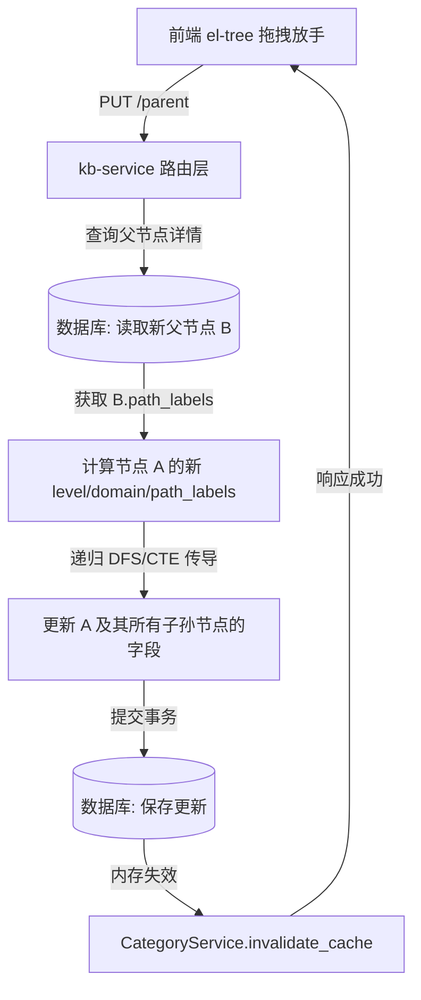

# 分类基线树状管理与可视化编辑器设计方案

本项目旨在优化 `/admin/category` 分类基线管理页面。我们将融合 **SOP 决策树的高端视觉风格（高亮边框、层级 Badge、微交互动效）**，实现：
1. **右侧动态分类树展示**：
   - **默认状态**：展示完整的全局分类基线树。
   - **选中状态**：在右侧详情表单下方的空白区域展示与当前选中节点关联的分支子树。
2. **可视化树形编辑器**：支持在树上直接进行新增、修改、禁用/启用、删除，以及**拖拽改变分类关系（Drag & Drop）**，拖拽时后端自动递归更新子树的路径与层级。

---

## 🎨 视觉与交互设计 (UX/UI Design)

### 1. 右侧面板动态双态布局
右侧面板 (`.right-panel`) 将根据左侧列表的选中状态，进行无缝的双态切换：

* **默认未选中态 (Default State - 全局基线树)**：
  - 取代原有的 “请从左侧选择一个分类查看详情” 静态文字，展示一整棵全局分类基线树。
  - 树上方设计一个流线型卡片头：`当前视图：全局分类基线树 (包含 5 大一级技术域，共 {totalCategories} 个节点)`。
  - 支持一键 **“全部展开”**、**“全部折叠”**，以及 **“导出全局 YAML”** 的快捷操作。

* **选中分类态 (Selected State - 分支子树 + 表单详情)**：
  - **上部**：保留原有的 4列×3行 的 **分类详情表格** 及 **已发布 SOP / KBD 条目列表**（卡片布局）。
  - **下部**：在表单下方无缝渲染一个独立卡片容器 `.subtree-section`，标题为 `「{selectedCategory.name}」相关的分类分支树`。
  - **内容**：展示以当前节点为核心的关联子树（若为 L2，展示该 L2 下的所有 L3 与 L4 叶节点；若为叶节点，展示其所属 of L1->L2->L3->L4 完整上下文链条）。

### 2. 树节点设计 (Inspired by SOP TreeNode v3.0)
每个树节点在渲染时，均摒弃浏览器原生样式，采用与 SOP 决策树等价的精致排版：
* **层级 Badge (`L1` ~ `L4`)**：
  - `L1` (皇家蓝)：`color: hsl(220, 90%, 56%); background: hsl(220, 90%, 95%);`
  - `L2` (莫兰迪绿/青)：`color: hsl(170, 80%, 40%); background: hsl(170, 80%, 95%);`
  - `L3` (琥珀橙)：`color: hsl(38, 92%, 40%); background: hsl(38, 92%, 95%);`
  - `L4` (翡翠绿 - 叶子节点)：`color: hsl(142, 70%, 45%); background: hsl(142, 70%, 95%);`
* **节点信息**：`业务编码 (Code)` 用等宽代码块高亮，后跟 `分类名称 (Name)`；已禁用节点半透明化，并挂载灰色 `已禁用` 标签。
* **统计气泡**：右侧展示 `[SOP: 3] [KBD: 5]` 的小气泡，方便管理员直观评估每个分类的数据热度。
* **Hover 微交互悬浮按钮**：
  - 鼠标悬浮在树节点上时，右侧平滑淡入一组微型操作按钮（Add 子节点、Edit 编辑属性、Toggle 启用/禁用、Delete 物理/软删除）。
  - 所有按钮均有气泡提示 (`el-tooltip`) 且支持键盘焦点。

### 3. 可视化拖拽规则 (Drag & Drop Rules)
* 一级技术域节点 (`L1`) 为分类基线的物理支柱，**禁止拖拽**，也不允许其他节点拖拽至 L1 之上作为根。
* `L2`、`L3`、`L4` 节点支持在相同域下，或跨越不同域进行自由拖拽重组。
* **拖拽视觉指示器**：在拖拽过程中，Element Plus 会在目标节点上方/下方/内部渲染高亮虚线，管理员可精准决定是作为 “同级平铺” 还是 “作为子节点插入”。

---

## 🛠️ 技术架构与前后端契约 (Technical Architecture)

### 1. 拖拽重组的后端递归更新模型
当管理员将节点 `A`（及其子树）拖拽到新父节点 `B` 下时，前端向后端发送拖拽请求：
```
PUT /api/kb/categories/{A.code}/parent
Body: { "parent_id": B.id }
```
**后端处理逻辑 (SQLAlchemy ORM + Postgres)**：
1. 更新 `A` 的 `parent_id = B.id`。
2. 自动推断并更新 `A.level = B.level + 1`，并将 `A.domain` 同步为 `B.domain`。
3. 重新计算并更新 `A` 的 `path_labels` 为 `B.path_labels + [A.name]`。
4. **核心递归传导**：使用递归查询（或 Python DFS 树遍历），对其下所有子节点（L3/L4）进行深度优先更新：
   - `child.level = parent.level + 1`
   - `child.domain = parent.domain`
   - `child.path_labels = parent.path_labels + [child.name]`
5. **重构 code**：为保持业务编码的幂等唯一性，自动按照新所属域的命名序列或规范重塑中间层节点编码。
6. **刷新缓存**：调用 `category_service.invalidate_cache()` 强制失效内存缓存，使所有微服务（如 S0 意图识别层）立即同步最新分类拓扑。



---

## 💾 变更文件清单 (Proposed Changes)

### 1. 后端微服务层 (backend/kb-service)

#### [MODIFY] [categories.py](file:///mnt/d/aihci/hci-troubleshoot-platform/backend/kb-service/app/routes/categories.py)
* **新增 `POST /api/kb/categories`**：创建单条分类记录（包含自动推断 `level` 与校验业务 `code` 的冲突性）。
* **新增 `DELETE /api/kb/categories/{code}`**：删除分类（当含有子分类或已发布 SOP/KBD 时，给出警告和拦截阻断，或支持软删除）。
* **新增 `PUT /api/kb/categories/{code}/parent`**：接收父节点变更请求，触发层级和路径的深度更新。

#### [MODIFY] [category_repo.py](file:///mnt/d/aihci/hci-troubleshoot-platform/backend/kb-service/app/repositories/category_repo.py)
* 在 Repository 中实现 `create`、`delete` 核心方法。
* 实现 `update_parent_recursive(code, new_parent_id)`：通过递归 CTE（Common Table Expression）或高性能 DFS 批量级联更新被拖拽子树所有节点的 `level`、`domain`、`parent_id`、`path_labels`。

#### [MODIFY] [category_service.py](file:///mnt/d/aihci/hci-troubleshoot-platform/backend/kb-service/app/services/category_service.py)
* 封装对应的 Service 层业务逻辑，保障数据更新后内存缓存（198条记录）得到强力刷新与强一致性。

---

### 2. 前端管理台层 (frontend/admin)

#### [MODIFY] [CategoryManageView.vue](file:///mnt/d/aihci/hci-troubleshoot-platform/frontend/admin/src/views/CategoryManageView.vue)
* **DOM 结构重构**：
  - 重写右侧 `.right-panel` 布局。当 `!selectedCategory` 时，渲染一个全宽的 `.global-tree-container` 卡片，里面挂载全局基线树。
  - 当 `selectedCategory` 存在时，在信息表格下方，增加一个带有精美卡片边框的 `.subtree-container`，里面挂载当前节点的专属子树。
* **`<el-tree>` 核心绑定**：
  - 引入 `draggable`，配置 `:allow-drop="handleAllowDrop"`，`:allow-drag="handleAllowDrag"` 实施 L1 锁定与跨层级拖拽验证。
  - 挂载 `@node-drop="handleNodeDrop"`，拖拽释放后立即调用后端 API，并触发局部骨架屏加载，确保树拓扑更新实时。
  - 使用 `<template #default="{ node, data }">` 自定义树节点，将 level badge (`L1-L4`)、已发布 SOP/KBD 数量角标、以及 Hover 时平滑滑入的快捷操作按钮渲染得极具质感。
* **新增 CRUD 弹出 Dialogs**：
  - 新增分类 Dialog：智能根据当前节点推断子分类的 `domain`、`level` 及默认 `code` 编码前缀。
  - 编辑分类 Dialog：支持修改 `name` (分类名称) 以及 `keywords` (触发关键字)。
  - 删除确认 Dialog：二次确认删除，支持物理删除与软禁用的一键分流。

---

## 🧪 验证与测试方案 (Verification Plan)

### 1. 后端自动化单元测试 (Automated Pytest)
我们在 `backend/kb-service/tests/` 中编写针对树级联更新的测试：
* **测试用例 1 (拖拽级联更新验证)**：
  - 预先在 DB 中创建 `L1: 存储`, `L2: FC存储`, `L3: FC多路径`，其完整路径为 `["存储", "FC存储", "FC多路径"]`。
  - 模拟拖拽：将 `L2: FC存储` 的父节点变更为另一所属域 `L1: 虚拟机`。
  - 断言验证：`L2: FC存储` 和 `L3: FC多路径` 的 `domain` 自动变更为 `虚拟机`，层级正确计算，且 `FC多路径` 的 `path_labels` 级联变更为 `["虚拟机", "FC存储", "FC多路径"]`。
* **测试用例 2 (防环校验)**：
  - 尝试将父节点 `A` 拖拽到其子节点 `B` 下（产生回路循环）。
  - 断言：接口必须予以拦截并返回 `400 Bad Request`，保障树的无环性 (DAG)。

### 2. 前端集成与手动验证 (Manual UI Verification Checklist)
* **动态双态切换测试**：
  - 打开页面，右侧展示整棵全局分类基线树，核对总节点数是否与下方 stats-bar 一致。
  - 点击左侧 “存储 - 存储-001 - 虚拟机存储创建失败”，右侧详情表单填充，且表单下方成功出现包含该叶子节点完整上下游支链的分支树。
* **树上可视化操作测试**：
  - 悬浮在任意节点上，操作按钮出现。点击“新增子分类”，填入数据后保存，核对树上是否立即追加并高亮该新节点。
  - 点击“禁用”，核对节点是否变为半透明并挂上禁用标签，左侧列表及 stats-bar 相应数据是否实时递减。
* **树上直接拖拽重组测试**：
  - 将一个 L3 节点拖拽至另一个 L2 节点中，验证树结构是否当场更新；刷新页面，验证重组后的树形层次是否完好地从数据库中持久化恢复。
