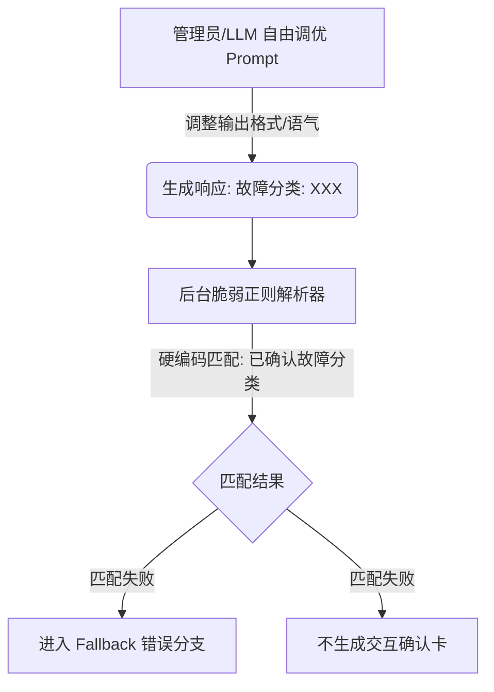

# S0 意图识别与 Prompt 解耦设计方案

## 1. 核心设计缺陷分析（第一性原理视角）

从第一性原理（First Principles）来看，当前系统的核心问题在于**“人机交互内容”与“机器控制信令”的紧密耦合**。



### 缺陷①：破坏了“协议解耦”原则（Tight Coupling）
* **现状**：后台通过脆弱的硬编码正则表达式（如 `已确认故障分类[：:]`）来提取业务 ID。这要求 LLM 生成的内容必须完美契合该字面量。
* **本质**：将“用户可见的自然语言回复”（Copy/Presentation）与“系统内部的状态流转信令”（Control Signal/Metadata）混为一谈。当管理员或调优人员在后台微调 Prompt 的语气、示例或表述时，会无意中改变 LLM 的输出词汇（例如将“已确认故障分类”简化为“故障分类”），导致系统控制信令中断。

### 缺陷②：违反了“鲁棒性法则”（Postel's Law / Robustness Principle）
* **鲁棒性法则**：*“发送时要保守，接收时要开放（Be conservative in what you send, be liberal in what you accept）”*。
* **现状**：后台解析器在接收大模型响应时表现得极其**保守和脆弱**——一旦少了一个“已确认”前缀，或者在行尾多了一些如“95，高置信度”的修饰词，便完全拒绝解析，直接判定为“解析失败”并抛出明显的逻辑冲突。

---

## 2. 业界最佳实践与范式比较

针对“大模型输出流式文本 + 提取结构化元数据”的场景，业界有以下三种主流的设计范式：

| 方案名称 | 实现方式 | 优点 | 缺点 | 适用场景 |
| :--- | :--- | :--- | :--- | :--- |
| **A. JSON 结构化块**<br>(Markdown JSON Block) | 提示词中约束 LLM 在输出最后附带一个包含结果的 ```json ... ``` 块。 | 1. 极易用正则或 JSON 解析器提取。<br>2. 格式与人读文本分离。<br>3. 支持复杂结构。 | 1. 需要大模型多消耗一部分 Token。<br>2. 大模型流式输出时，JSON 解析可能需要等待流结束。 | 适合具有一定推理能力，且系统需要提取丰富属性（如置信度评分、多个候选等）的场景。 |
| **B. 宽松正则 + 动态字典校验**<br>(Hybrid Parser) | 不限制前后缀文本，仅通过松散正则匹配出形如 `[中文/英文]-[数字]` 的场景编码，然后再在**内存中与当前系统激活的分类字典**进行交集验证。 | 1. 极其轻量。<br>2. 即使 Prompt 中的引导词被改得面目全非，只要分类编码不变，就永远不会失效。 | 1. 如果文本中偶然出现类似格式的无关字符，可能造成误判（需要过滤）。 | 适合有明确分类主键（Code），且希望最大限度保持 LLM 回复自然性的场景。 |
| **C. 双阶段调用/模型解析**<br>(Two-Pass / LLM-based Parser) | 第一阶段流式回复用户；第二阶段使用小参数模型或非流式 API（开启 JSON Mode）解析第一阶段的回复。 | 1. 彻底免除正则。<br>2. 对 Prompt 调优 100% 免疫。 | 1. 产生双倍 LLM 调用成本。<br>2. 增加响应延迟（增加了第二次调用时间）。 | 核心链路、高价值场景，或解析规则极其复杂的决策流。 |

---

## 3. 具体解决方案设计

根据 HTP 平台的特点，我们推荐采用 **方案 B（宽松正则 + 动态字典校验）** 或 **方案 A（Markdown JSON 结构化块）**。

### 方案 A：Markdown JSON 结构化块（规范化升级）

**设计思路**：
在提示词模板的最后，强制要求 LLM 必须且仅能以 JSON 代码块形式输出分类决策元数据。后台通过提取 ```json ... ``` 内容进行安全的反序列化。

#### 1. Prompt 模板升级示例
```markdown
【输出格式要求】
1. 首先用自然语言解释你的判断依据。
2. 在输出的绝对末尾，必须输出以下格式 of JSON 代码块（请勿输出任何其他字符）：
```json
{
  "decision_type": "confirm", // confirm (单一高置信度确认) 或 candidates (中置信度候选)
  "confirmed_code": "硬件-024", // 若为 confirm，填写最匹配的分类编码；否则为 null
  "candidates": ["虚拟机-003", "虚拟机-004"] // 若为 candidates，填写 1~4 个候选分类编码；否则为空列表
}
```
```

#### 2. 后台解析器重构 (`_parse_intent_result`)
```python
import json
import re

@staticmethod
def _parse_intent_result_json(reply: str) -> IntentResult:
    # 使用正则匹配 Markdown 中的 json 块
    json_block_pattern = re.compile(r"```json\s*(.*?)\s*```", re.DOTALL)
    match = json_block_pattern.search(reply)
    if not match:
        # Fallback 策略：尝试用方案 B 的宽松正则补救，提高容错性
        return TriageAgent._parse_intent_result_fallback(reply)
        
    try:
        data = json.loads(match.group(1).strip())
        decision_type = data.get("decision_type")
        
        if decision_type == "confirm" and data.get("confirmed_code"):
            code = data["confirmed_code"]
            # 这里的 name 可以在内存中根据激活的分类字典反查，不再依赖 LLM 输出
            name = TriageAgent._get_category_name_by_code(code)
            return IntentResult(
                category_id=code,
                category_name=name,
                candidates=[],
                needs_confirmation=True,
            )
        elif decision_type == "candidates" and data.get("candidates"):
            candidates_list = []
            for code in data["candidates"][:4]:
                name = TriageAgent._get_category_name_by_code(code)
                candidates_list.append({"code": code, "name": name})
            return IntentResult(
                category_id=None,
                category_name=None,
                candidates=candidates_list,
                needs_confirmation=True,
            )
    except Exception as e:
        logger.warning(f"Failed to parse json block: {e}")
        
    return IntentResult(category_id=None, category_name=None, candidates=[], needs_confirmation=False)
```

---

### 方案 B：宽松正则 + 动态字典校验（最轻量、高容错升级）

**设计思路**：
完全解耦 Prompt 中的文案。无论用户怎么写“故障分类”、“分类结果是：”还是“我们判定为：”，解析器只匹配文本中的分类编码（如 `硬件-024`）。

#### 后台解析器重构 (`_parse_intent_result`)
```python
@staticmethod
def _parse_intent_result_fuzzy(reply: str, active_categories: dict[str, str]) -> IntentResult:
    """
    active_categories: 传入当前所有处于激活状态的分类字典映射，例如 {"硬件-024": "硬盘寿命到期", ...}
    """
    # 1. 匹配所有符合规范的编码 (前缀-纯数字，例如 硬件-024)
    # 不依赖任何特定的中文引导前缀
    code_pattern = re.compile(r"([一-鿿A-Za-z0-9-]+-\d+)")
    all_matched_codes = code_pattern.findall(reply)
    
    # 2. 过滤出真实合法的分类编码，排除大模型捏造或正文无关的词汇
    valid_codes = [code for code in all_matched_codes if code in active_categories]
    
    # 去重保留顺序
    unique_codes = list(dict.fromkeys(valid_codes))
    
    if not unique_codes:
        return IntentResult(category_id=None, category_name=None, candidates=[], needs_confirmation=False)
        
    # 3. 如果大模型输出里只存在 1 个合法的分类编码，直接判定为确认模式
    if len(unique_codes) == 1:
        code = unique_codes[0]
        return IntentResult(
            category_id=code,
            category_name=active_categories[code],
            candidates=[],
            needs_confirmation=True,
        )
        
    # 4. 如果大模型输出里存在多个合法的分类编码（常见于中置信度候选列表），判定为候选模式
    candidates_list = [
        {"code": code, "name": active_categories[code]}
        for code in unique_codes[:4]
    ]
    return IntentResult(
        category_id=None,
        category_name=None,
        candidates=candidates_list,
        needs_confirmation=True,
    )
```

**为什么方案 B 是最适合该平台的第一性原理体现？**
1. **零学习成本**：Prompt 调优人员不需要理解任何 JSON 规范或硬编码的标记，他们可以像与普通 LLM 聊天一样调优提示词。
2. **极高容错**：即使回复中说 `"我们建议参考 硬件-024（硬盘寿命到期）处理"` 或 `"故障分类：硬件-024 硬盘寿命到期 95"`，解析器只看 `硬件-024`，并去分类库校验，直接识别成功。
3. **保证一致性**：通过对比内存中的 `active_categories`（由 `_categories_cache` 提供），彻底杜绝了大模型捏造或幻觉出不存在的分类编码导致系统报错的问题。
