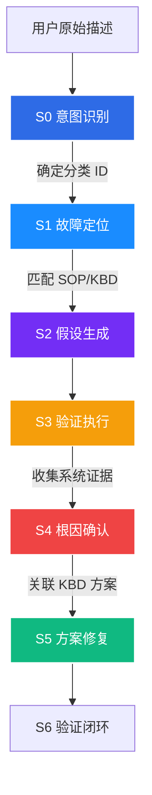
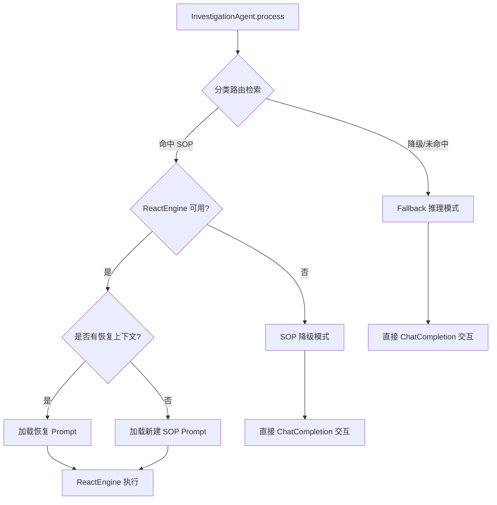

# HCI 智能排障平台 — S0-S5 Prompt 设计与加载机制深度解析

本篇文档从**第一性原理**出发，对 HCI 智能排障平台中 **S0 到 S5 阶段 System Prompt 的作用机理**、以及 `TriageAgent`、`InvestigationAgent` 和 `remediation_agent.py` 的**加载与动态渲染机制**进行深度剖析。

---

## 一、 第一性原理：S0-S5 Prompt 在排障全生命周期中的作用机理

排障过程是一个**「不确定性收敛」**的过程。从用户报告故障的模糊表象（高熵状态），到最终定位并实施精准修复（低熵状态），平台设计了 **S0 - S5** 的分阶段漏斗模型。在此流程中，System Prompt 作为大模型的“系统引导程序”，起到了**角色隔离、推理约束和交互标准化**的决定性作用：



### 1. S0：意图识别与特征提取阶段 (Triage Phase)
*   **作用机理**：此阶段核心是**信息对齐与分类匹配**。Prompt 将大模型降维为一个“分类决策树映射器”。
*   **约束原则**：
    *   **严禁自主推理**：即使告警或描述非常明显，Prompt 也绝对禁止 LLM 主动开始诊断或推荐 SOP，防止在分类未确定前执行多余步骤。
    *   **交互标准化（4+1 模式）**：Prompt 强制定制了严格的输出语法（如 `已确认故障分类：{code} {name}` 或序号形式的候选列表）。前端通过捕捉这些固定标记，渲染为可视化的卡片或选择按钮，解决多轮问答的对齐效率。

### 2. S1 - S4：诊断调查阶段 (Diagnostic Phase)
*   **作用机理**：此阶段由 `InvestigationAgent` 主导，是**证据链构建**的核心。根据分类进行三轨路由（SOP、KBD 案例、机制推理）：
    *   **SOP 导航轨**：Prompt 将 LLM 从“自由发散式推理”转化为“SOP 规则导航器”。LLM 的每次决策必须通过调用 `get_sop_node` 获取节点，并通过 `sop_advance` 推进，使排障路径绝对可控、合规。
    *   **变量池依赖**：Prompt 将当前会话中已知的环境变量注入，防止大模型反复向用户提问已搜集的信息，实现“多轮对话无感参数累积”。
    *   **幂等性防护（恢复模式）**：当排障由于网络等问题重新开始时，Prompt 注入已完成步骤（`completed_steps`）并声明**幂等性约束**，严禁大模型对已执行过的写操作节点进行二次操作，保护系统环境安全。
    *   **机制推理降级轨**：在无 SOP 与案例匹配时，Prompt 要求 LLM 的所有推断必须打上 `【机制推理】` 标签，声明其属于启发式假设而非官方认证标准，从而防范幻觉误导工程师。

### 3. S5：修复执行阶段 (Remediation Phase)
*   **作用机理**：此阶段是**状态变更与环境恢复**。从只读诊断切换为写操作。
*   **安全防范**：
    *   **双重确认原则**：Prompt 明确警示 LLM 所有写操作均须由工程师确认。ReactEngine 框架在此阶段强行开启 `require_all_confirm=True`。
    *   **即时验证**：Prompt 约束大模型在完成任何步骤（如重启服务）后，必须立即执行验证命令以评估成效，防止故障滚雪球。

---

## 二、 HTP-Agent 大脑 Prompt 加载与动态渲染机制

下面详细梳理 `triage_agent.py`、`investigation_agent.py` 与 `remediation_agent.py` 分别在何时、以何种形式将 Prompt 加载并呈现给大模型。

### 1. TriageAgent (S0 意图识别)

#### (1) 加载与组装时机
当 `AgentRouter` 收到请求，且 `diagnostic_stage == "S0"` 时，路由到 `TriageAgent.process()` 执行流式意图识别。

#### (2) 加载方式与动态拼接
目前 S0 Prompt 以代码中定义的段落常量为基础（保留了降级回退），并在运行时通过 Python 字符串格式化拼接成完整的 `system_prompt`：

*   **基础身份与方法论定义**：
    *   `SEGMENT_IDENTITY`：定义 HCI 排障专家身份及领域知识。
    *   `SEGMENT_METHODOLOGY`：注入标准排障方法论，在此传入 `stage_desc="S0 - 意图识别"`。
    *   `SEGMENT_REASONING_MODE`：申明 S0 推理规范（限制发散、强制列举候选、禁止私自引用 SOP 等）。
*   **环境上下文注入 (`SEGMENT_S0_CONTEXT`)**：
    若外部接口传入了实时 `env_context`，则将以下字段格式化填入：
    *   `{env_info}`：实时 HCI 节点、集群基础信息。
    *   `{alert_logs}`：实时系统告警。
    *   `{task_logs}`：近期的平台任务日志。
*   **叶子节点分类列表注入 (`SEGMENT_S0_CATEGORIES`)**：
    *   通过 `_ensure_categories_loaded()` 从 `KBClient` 获取分类数据，类级缓存 TTL 为 300 秒。
    *   使用 `_format_categories()` 过滤分类：采用正则 `^[一-鿿A-Za-z0-9-]+-\d+$` 对分类 code 校验，**只保留叶子分类**（前缀-纯数字，如 `虚拟机-003`），过滤中间分类（如 `虚拟机-L2-网络`），避免大模型误命中非可执行分支。
    *   注入 `{total_count}` 与 `{categories_text}` 到模板中，规定大模型必须以特定格式（如 `①`、`②` 或 `已确认故障分类：`）输出。
*   **工单上下文**：
    *   `SEGMENT_CONTEXT_TEMPLATE`：注入当前 `{case_id}` 以方便链路审计。

#### (3) 渲染后的 System 消息流
```python
# 组装完整的 System Prompt
system_prompt = self._build_s0_prompt(
    categories=self._categories_cache,
    env_context=env_context,
    case_id=case_id,
)
# 将 system_prompt 挂载在首条消息，与其他历史消息 messages 组合发送给大模型
full_messages = [{"role": "system", "content": system_prompt}, *messages]
```

---

### 2. InvestigationAgent (S1-S4 诊断调查)

`InvestigationAgent` 的加载逻辑最为复杂。它根据故障分类的检索匹配结果，分流为 **SOP 模式**、**SOP 降级模式** 与 **机制推理模式** 三种情况加载不同的 Prompt：



#### (1) SOP 模式 - 新建执行 (New Run)
*   **触发条件**：分类路由匹配到 SOP，且 `sop_resume_context` 为空。
*   **加载时机**：创建全新的 `SopExecution` 状态记录后。
*   **加载方法 (`_build_sop_react_prompt`)**：
    *   **根节点摘要抽取**：通过 `get_sop_node()` 异步获取 SOP 的根节点（`DEFAULT_ROOT_NODE_ID`），提取其标题、类型与详细操作内容。
    *   **分支约束注入**：通过 `_build_root_node_summary()` 将当前可选择分支（Children 节点）抽取出来写在 Prompt 中，提示大模型可使用 `get_sop_node` 获取分支。
    *   **已知变量注入**：若在工单初始阶段或先前步骤中已经收集到了用户环境变量（由 `create_result` 从数据库中读出），则将这些变量值合并拼装为 `【已知变量】` 注入 Prompt 中。
    *   **工具使用规则注入**：明文规定 LLM 可使用 `get_sop_node(node_id)` 与 `sop_advance(target_node_id, reasoning)` 导航工具，以及 acli 诊断工具。

#### (2) SOP 模式 - 恢复执行 (Resume Run)
*   **触发条件**：分类路由匹配到 SOP，且传入了 `sop_resume_context`。这发生在由于会话断线、页面刷新重新载入的场景。
*   **加载时机**：获取当前恢复位置节点 ID 后。
*   **加载方法 (`_build_sop_resume_prompt`)**：
    *   **恢复状态摘要构建 (`_build_sop_resume_summary`)**：构建当前执行进度，包括已完成步骤数量、当前停留节点 ID 以及先前记录的所有已知变量。
    *   **当前节点摘要构建 (`_build_current_node_summary`)**：取代根节点，直接获取恢复位置当前节点的详细诊断步骤、命令指南和子节点分支选项。
    *   **幂等性约束注入**：将已完成节点的列表（`completed_steps`）在 Prompt 中明文呈现，并施加**幂等性限制约束**：*已在完成列表中的节点，绝对不能再执行任何写操作（如重启服务），只读工具（如 top/list）不受限，写操作工具若需重试必须申请授权*。

#### (3) SOP 降级模式 (Legacy SOP Mode)
*   **触发条件**：匹配到 SOP，但微服务间通信异常（如 `ReactEngine` 相关服务不可用）。
*   **加载方法 (`_build_sop_prompt_legacy`)**：
    *   直接读取完整的 SOP 原始 Markdown 内容（当超过 8000 字符时，使用 `_truncate_sop_content()` 进行阶段性截断，附带降级提示）。
    *   作为全局静态上下文随 `system` 角色一次性抛给 LLM。

#### (4) 机制推理模式 (Fallback Mode)
*   **触发条件**：知识库未匹配到该故障分类关联的 SOP 或 KBD 历史案例。
*   **加载方法 (`_build_fallback_prompt`)**：
    *   构建纯虚空机制推理的 `system_prompt`。
    *   注入 `{category_id}` 和当前诊断阶段的映射信息。
    *   在 Prompt 强制追加格式指令：“要求所有推断必须标注 `【机制推理】`，并在句尾提示用户提供更多报错”。

---

### 3. RemediationAgent (S5 方案输出与修复执行)

#### (1) 加载与组装时机
在 `AgentRouter` 收到请求，且 `diagnostic_stage == "S5"` 时，会路由到 `RemediationAgent.process()`。

#### (2) 加载与动态拼接 (`_S5_SYSTEM_PROMPT_TEMPLATE`)
S5 阶段的 Prompt 是由一个模块级静态模板格式化填充产生的：

```python
# 提取 S4 阶段最终确认的根因及推荐修复方案
if not root_cause and matched_kbds:
    root_cause = matched_kbds[0].root_cause
if not solution and matched_kbds:
    solution = matched_kbds[0].solution

system_prompt = _S5_SYSTEM_PROMPT_TEMPLATE.format(
    root_cause=root_cause or "根因待确认",
    solution=solution or "请根据诊断结果制定修复方案",
    case_id=case_id,
)
```

#### (3) 核心约束点
*   **解释优先**：Prompt 强迫大模型在发出具体工具调用前，先向工程师解释该修复步骤的执行原理。
*   **执行后即时验证**：Prompt 约束大模型在每个修改动作完成后，紧接着要发起只读验证指令，防止修复产生次生灾害。
*   **双重确认拦截**：在此 Prompt 环境下，所有工具列表会被 `ReactEngine` 执行。框架中 `require_all_confirm=True` 属性被激活，即使大模型写出命令，前端也会强行转为交互弹窗拦截，必须经人手点击确认才放行到下层节点。

---

## 三、 数据库化管理 Prompt（base_core_v1 等）的现状与断代解析

用户在 **Prompt管理后台** 界面以及数据库种子文件 `database/seeds/02_system_prompts.sql` 中会看到如下预置 Prompt 模板：
*   `base_core_v1` (BASE)
*   `s0_intent_recognition_v1` (S0)
*   `s1_info_gathering_v1` (S1)
*   `s2_hypothesis_generation_v1` (S2)
*   `s3_verification_v1` (S3)
*   `s4_root_cause_v1` (S4)
*   `s5_solution_v1` (S5)

针对这套配置化 Prompt，其在系统中的真实使用与加载情况分析如下：

### 1. 核心事实：数据库中的 Prompt 模板未被 `htp-agent` 正常消费
在目前的系统架构中，**这几个在 Prompt 管理后台展示并存储于数据库 `system_prompt` 表中的模板，完全没有被 `htp-agent`（包括 `TriageAgent`、`InvestigationAgent`、`RemediationAgent`）所使用**。它们处于**“断联/空置”**状态。

### 2. 这套配置化 Prompt 的生命周期流向
1.  **数据落库**：由 `database/seeds/02_system_prompts.sql` 初始化，写入到数据库 `system_prompt` 中。
2.  **API 接口**：`conversation-service` 提供了 `routes/system_prompt.py` 下的 `/api/v1/prompts` 端点，实现对 `system_prompt` 表的 CRUD 操作。
3.  **管理后台渲染**：`api-gateway` 的 `capabilities.py` 路由将请求代理给 `conversation-service`，前端 `PromptManageView.vue` 通过 `/api/v1/prompts` 接口拉取并显示在 UI 界面中，支持编辑与修改。
4.  **Agent 推理消费**：在实际推理阶段，`agent-service` 发起 LLM 聊天或 ReAct 决策时，**没有任何代码逻辑**从 `system_prompt` 表中读取或查询这些模板。所有的 System Prompt 均是直接使用上一章所述的**代码内硬编码常量及方法动态生成**。

### 3. 参数赋值与最终上下文的真实真相

由于 `htp-agent` 实际上是在代码中直接生成 Prompt，因而数据库模板中声明的占位符（如 `{category_list}`、`{tool_list}` 等）在实际执行流中**并未以数据库模板为载体进行赋值**。

以下是两套机制的对照关系与最终完整上下文的组装真实现状：

| 阶段 | 数据库种子模板 (未生效) | 真实使用的 Prompt 代码源 (已生效) | 真实参数赋值逻辑 & 最终完整上下文组成 |
| :--- | :--- | :--- | :--- |
| **S0** | `s0_intent_recognition_v1` | `triage_agent.py` 中的 `SEGMENT_IDENTITY` 等常量拼接 | 通过 `_build_s0_prompt()` 拼接 `IDENTITY` + `METHODOLOGY` + `REASONING_MODE` + 叶子分类列表 + 实时 `env_context` (env_info, alert_logs, task_logs) + case_id |
| **S1-S4** | `s1_info_gathering_v1` 至 `s4_root_cause_v1` | `investigation_agent.py` 中的 `_build_sop_react_prompt` 等方法 | 根据路由决策：<br>1. **SOP React 模式**：拼接 SOP 根节点摘要、获取/推进 SOP 工具说明、已知变量池。<br>2. **SOP Resume 模式**：拼接已完成进度摘要、当前停留节点明细、**幂等性限制声明**。<br>3. **Fallback 模式**：拼接限制输出前缀为 `【机制推理】` 的引导语。 |
| **S5** | `s5_solution_v1` | `remediation_agent.py` 中的 `_S5_SYSTEM_PROMPT_TEMPLATE` | 传入 S4 确认的 `root_cause` 与 KBD 获取的 `solution` 进行 `.format()` 格式化。 |

### 4. 产生此断代现象的架构原因
在早期的 MVP（最小可行性产品）版本中，系统设计了 `system_prompt` 数据库表与管理后台以支持模板热更新。但在后期的排障 Agent 重构阶段（如引入 SOP 多叉决策树导航、变量池自动注入、断线恢复及写操作幂等性硬性约束时），由于业务逻辑极为复杂，Agent 系统选择**直接在代码中通过方法控制 System Prompt 的组装和生成**。这一重构未能与前期的数据库 `system_prompt` 表结构进行重构兼容，导致数据库种子模板被空置。

---

## 四、 Agent 阶段 Prompt 渲染数据大图

各 Agent 接收外部数据，构建 Prompt，并转化为 LLM 统一上下文的数据流如下图所示：

```
[外部接口调用: process]
     |
     +---> (S0) TriageAgent ---------------------> _build_s0_prompt() 
     |                                                  |-- SEGMENT_IDENTITY (静态)
     |                                                  |-- SEGMENT_METHODOLOGY (格式化)
     |                                                  |-- env_context (动态注入)
     |                                                  +-- categories (KB获取/过滤)
     |
     +---> (S1-S4) InvestigationAgent ----------> 三轨路由分流
     |                                                  |-- SOP 轨 (新建): _build_sop_react_prompt()
     |                                                  |                  +-- 根节点摘要 & 已知变量注入
     |                                                  |-- SOP 轨 (恢复): _build_sop_resume_prompt()
     |                                                  |                  +-- 恢复节点、变量 & 幂等约束注入
     |                                                  +-- Fallback 轨:  _build_fallback_prompt()
     |
     +---> (S5) RemediationAgent ----------------> _S5_SYSTEM_PROMPT_TEMPLATE (格式化)
                                                        |-- root_cause (S4确认)
                                                        +-- solution (KBD推荐)
```

通过这一套分工明确的阶段 Prompt 体系，HCI 智能排障平台在保证 AI 自主推理与自动化验证效率的同时，筑牢了超融合业务系统的操作安全底线。
