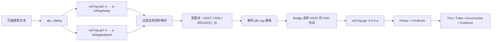
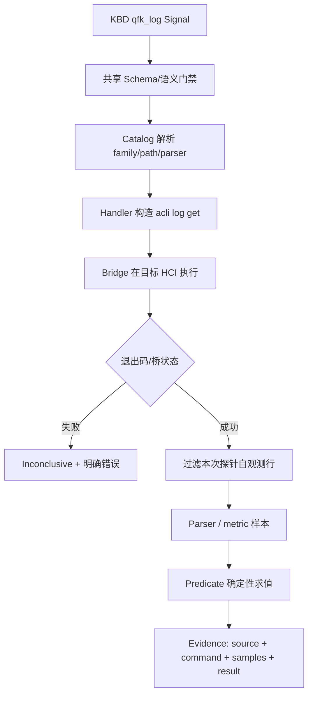

# qfk_log 统一日志采集、解析与判定设计

> 状态：已确认并进入实施
> 版本：v1.1
> 日期：2026-07-30
> 适用范围：126 个 KBD 扩展验证集、KBD 自动生产、专家复核、HTP Agent 消费、工具管理
> 核心决策：**不新增 `qfk_blackbox`；`/sf/log` 下 whitebox、blackbox、vn-blackbox 与其他日志统一由 `qfk_log` 处理。`/sf/data/local` 不是日志族，只保留为携带 `request_id` 的受限辅助关联域。**

## 1. 结论先行

`qfk_log` 不应被设计成“在某个 `.log` 文件中 grep 一个关键字”的薄封装。日志关键信号的完整含义是：

```text
在哪台主机、哪个日志族、哪个绝对时间、哪个文件/调用链中，
以什么安全方式取得有限证据，
用什么 parser 将文本变成可判定样本，
再用什么 predicate 得到确定性的 True / False / Inconclusive。
```

统一后的能力模型为：

```text
qfk_log
  = acquisition(acli log get)
  + source catalog(file → family/path/parser/predicates)
  + parser
  + predicate
  + evidence/safety contract
```

blackbox 与 whitebox 的差异是数据布局和解释方法，不是执行通道。真实 HCI 上二者都能通过 `acli log get` 读取，因此拆成两个工具只会带来重复 Schema、重复 Handler、LLM 选型歧义和专家审核负担。

本方案同时给出四个 fail-closed 边界：

1. BMC SEL、页面操作记录、NBU 与外部存储日志不是本机 `qfk_log`；
2. `/cfs`、`/sf/cfg` 配置不是日志，不能为通过校验而扩大日志目录权限；
3. `now`、`-1h` 不是 aCLI 支持的日志时间，必须由 Agent 按 HCI 时区解析为绝对时间；
4. `qkv_dialog` 不是虚构的 `acli dialog get`，而是“当前主控日志定位 + END/REQUEST_ID 提取”的复合 QKV。

### 1.1 2026-07-30 澄清后的六项确定结论

| 问题 | 确定结论 |
|---|---|
| `/sf/data/local` | 不是常规日志根；常规日志根只有 `/sf/log`。它包含镜像、备份、TSDB、升级包、info_collect 产物等。因为实机 `acli log get` 明确允许该路径，所以只保留 `request_id + path=/sf/data/local` 的辅助关联模式 |
| 文件与路径映射 | 不是散落条件，也不是简单 `dict[str, str]`；代码使用有序、不可变 `tuple[LogSourceDefinition, ...]`。条目包含 file pattern、family、default path、parser、predicates 和 acquisition |
| HOST/END/VM/file | KBD 先由 QKV 生产 HOST/END/REQUEST_ID/VM，变量池递归替换 `{{VAR}}`；HOST 由 bridge 选择对应 SSH 会话；VM 可进入 `sfvt_qemu_{{VM}}.log`；END 同时决定 `-t` 与日志目录：whitebox 使用月内日号 `/sf/log/<D或DD>[/vt]`，blackbox 使用 `YYYYMMDD`；file/Catalog 决定目录子层与 parser。无法得到实际 END 时，whitebox 回退 `/sf/log`。 |
| 解压 | qfk_log 不直接执行解压命令。它决定安全参数；`-t` 保留为日志行的绝对时间过滤，历史归档处理仍由 `acli log get` 完成；显式 gzip path 才使用 `-g`。 |
| qfk_log 与 aCLI | qfk_log 是 HTP 语义层和确定性判定层，`acli log get` 是当前主机的设备采集原语。两者不是重复实现，也不能互相替代 |
| qkv_dialog | 在当前主控分别搜索 `/sf/log/today` 和 `/sf/log/today/vt`，过滤本次探针被 audit 记录的自观测行，兼容 `request_id:`、`request_id=` 和 trace 格式，产出 `END/REQUEST_ID/HOST` |

完整调用链如下：



## 2. 第一性原理

### 2.1 工具边界由“真实可执行能力”决定

工具名称不是业务文案分类。只有当采集协议、权限模型、失败语义或安全策略不同，才值得拆成独立工具。

本次实机确认：

- whitebox 使用 `acli log get`；
- blackbox 使用 `acli log get -p /sf/log/blackbox/...`；
- vn-blackbox 使用 `acli log get -p /sf/log/vn-blackbox/...`；
- `/sf/log/pods` 仍位于 aCLI 允许的 `/sf/log` 根；
- `/sf/data/local` 不是日志族；仅当已有 `request_id` 时，可由 `acli log get -i/-p` 关联其中的诊断产物。

因此日志只有一个 acquisition：`acli_log_get`。目录族和 parser 应进入 Catalog，而不是进入工具名；`/sf/data/local` 则是 acquisition 的受限 search scope，不能进入日志 family。

### 2.2 日志“命中”不等于案例“成立”

日志输出要经过四层才成为 KBD 证据：

1. Source：文件、主机、日期和日志族是否正确；
2. Acquisition：命令是否真实执行、是否拿到完整且有界的现场输出；
3. Interpretation：parser 是否把时间戳、区块、指标值解析正确；
4. Predicate：keyword、阈值、差值或趋势是否满足案例条件。

任何一层不确定，结果都应是 `Inconclusive`，不能把“无输出”“桥未连接”“样本不足”解释为反证。

### 2.3 稳定知识和易变知识分层

| 层 | 典型内容 | 变更方式 |
|---|---|---|
| 共享契约 | 参数名、允许根目录、绝对时间格式、Matcher Schema | 代码评审、契约测试 |
| 日志源 Catalog | 文件模式、默认目录、parser、支持 predicate | 小型代码 Catalog，可版本化回归 |
| KBD Signal | file、host、时间、metric、阈值、期望 | LLM 生成、专家可编辑 |
| 现场变量 | `HOST`、`VM`、`REQUEST_ID`、绝对故障时间 | Agent 在运行时解析 |
| 现场证据 | 命令、退出码、样本、判定详情 | 每次执行生成，不回写稳定知识 |

这样既不允许数据库热编辑直接改变 executable semantics，也不需要建立复杂 Registry 或审批系统。专家仍能在 KBD 工作台修改所有案例知识；真正的执行边界由代码契约统一证明。

## 3. 126 KBD 审计范围与事实

### 3.1 数据口径

权威案例清单：`tests/golden/kbd_cases/manifest.json`。
权威原始案例缓存：`data-pipeline/kbd/cache/<support_id>/raw.json`。
本轮确认：126/126 原始案例缓存存在。

2026-07-30 hci-dev 数据库实时口径：

| 指标 | 数量 |
|---|---:|
| KBD | 126 |
| 已生成 Signal | 405 |
| Rejected Candidate | 62 |
| 最终 `qfk_log` | 59 |
| `qkv_dialog` | 12 |
| 原始正文命中日志语义的 KBD | 85 |

“85 个正文涉及日志”与“59 条最终 `qfk_log`”不能直接比较为召回率：一个 KBD 可有多个日志需求；部分“日志”是页面、BMC 或外部系统记录；部分需求被误路由、被契约拒绝或完全漏抽。因此审计必须同时检查原始案例、accepted signals 和 rejected candidates，不能只优化现有 59 条。

85 个原始正文涉及日志语义的案例为：

```text
27079, 27123, 27173, 27222, 27653, 27736, 28156, 28177, 29713, 30396,
30838, 30884, 32010, 33510, 33882, 34094, 34164, 34198, 34220, 34278,
34798, 35986, 35988, 36130, 36348, 36599, 36600, 36646, 37180, 39441,
39449, 39454, 39460, 39469, 39471, 39475, 39476, 39477, 39481, 39485,
39489, 39492, 39496, 39499, 39506, 39509, 39512, 39516, 39520, 39532,
39535, 39538, 39542, 39547, 39552, 39554, 39559, 39567, 39570, 39574,
39577, 39579, 39581, 39589, 39593, 39597, 39598, 39623, 39627, 39630,
39635, 39651, 39658, 39669, 39672, 39723, 39725, 39739, 39740, 39741,
39745, 39751, 40057, 40061, 40872
```

### 3.2 当前 59 条 qfk_log 的文件分布

| 文件 | 条数 | 说明 |
|---|---:|---|
| `sfvt_vtpdaemon.log` | 9 | 高频，实机当日文件位于 `vt/` 子目录 |
| `messages` | 8 | 跨版本布局可能不同，优先让 aCLI 默认根发现 |
| 缺 file | 3 | 保存/运行契约漂移，必须修复后才能发布 |
| `vm-manager-api.log` | 3 | 普通 whitebox |
| `backup_clean_schedule.log`、`backup.log`、`kernel.log`、`sfvt_backup_clean_schedule.log`、`task.log`、`vm_operation.log` | 各 2 | 普通 whitebox 或组件条件日志 |
| 其余 25 个 basename | 各 1 | 包含 blackbox、组件日志、逻辑名称和外部日志 |

其余文件包括：

```text
LOG_ifconfig.txt, LOG_ethtool_statistic.txt, sfvt_qemu_{{VM}}.log,
sfvt_qemu-backup.log, sfvt_qm.log, sfvt_apache2.log, sfvt_vtpalertd.log,
sfvt_vtpsh.log, host-agentd.log, host-agent.log, cross_cluster_migrate.log,
discard.log, ConfBackup.pm, gecko-rpc.log, sffs.log, operation.log,
system_log, vs_interface.log, backup_task.log, aDeploy_inspect_hci.log,
BMC_Event_Log, msg06, sfvt_backup, Vm
```

其中 `BMC_Event_Log` 已明确不能按普通本机文件处理；`Vm`、`msg06` 等需要专家确认它是实际 basename、模块名还是案例文本中的逻辑标签。

### 3.3 当前 path 的结构性问题

| path | 条数 |
|---|---:|
| 缺失 | 37 |
| `/sf/log/today` | 10 |
| `/sf/log/<日期>` | 4 |
| `/sf/log/` | 1 |
| `/sf/log/7` | 1 |
| `/sf/log/blackbox/today` | 1 |
| `/sf/log/today/` | 1 |
| `/sf/log/today/vt` | 1 |
| `/sf/log/vn-blackbox/today` | 1 |
| `/sf/log/[日期]` | 1 |
| `/sf/log/<日期>/vt/` | 1 |

问题不是“37 条没 path”本身。若 Catalog 能根据 basename 安全推断，省略 path 反而更稳定。真正的问题是：

- `<日期>`、`[日期]` 是人类占位符，不是可执行路径；
- `/sf/log/7` 缺少年份/月语义，且不能证明是当前节点布局；
- 路径尾斜杠不一致导致去重和指纹漂移；
- `sfvt_vtpdaemon.log` 等嵌套文件需要 Catalog 默认到 `vt/`；
- 原白名单错误允许 `/sf/logs`、整个 `/sf/data`、`/sf/datanew`，超过 aCLI 实际边界。

新契约将显式 path 规范化为无尾斜杠形式，只允许 `/sf/log` 和 `/sf/data/local`，并拒绝人工占位符、路径穿越与 shell 元字符。

### 3.4 当前 Matcher 的结构性问题

59 条现有 `qfk_log` 全部是 `keyword`，但原始案例已经存在：

- 正则模式：如 QEMU 错误文本中的动态字段；
- 状态：进程是否存在、服务是否停止；
- 阈值：目录文件数、错误计数是否超过阈值；
- 差值：网卡 dropped/error 计数是否增加；
- 趋势：CPU、内存、IO 或丢包指标是否持续上升；
- 时间关联：是否发生在任务/告警结束时间附近；
- Request ID 关联：从 QKV 任务产出的调用链定位日志。

强制所有日志使用 keyword 会把“原始案例的判断逻辑”降格为“搜到一行文本”，导致信号不可执行或准确度不足。

### 3.5 典型误路由与拒绝候选

| KBD | 原始需求 | 正确处理 |
|---|---|---|
| 30396 | `nic_driver_info.log` | 普通 whitebox；若 basename 可确认，Catalog 回退处理 |
| 33882 | `vt/` 相对目录 | 规范为 file basename + `/sf/log/<absolute-date>/vt` 或 Catalog 默认 |
| 34094 | 从日志产出 `bestnode` | `qfk_log` 变量产出模式，必须有受控行选择器与 text extract |
| 34278 | 从日志产出 `dataid` | 同上，禁止无界整文件回传 |
| 35986 | QEMU 动态日志正则 | `regex`，不再强制 keyword |
| 36154 | `/sf/cfg/if.d/*.ini` | 配置读取能力/capability gap，不是 `qfk_log` |
| 39471 | 页面“系统备份日志” | 页面/UI 记录，不是本机文件 |
| 39581 | `/sf/log/<日期>` | Agent 先把案例/告警时间解析成绝对日期 |
| 39597 | NBU 作业日志 | 外部 NBU 能力，不是本机 `qfk_log` |

### 3.6 新契约对当前 126 条 Proposal 的只读审计结果

使用 `data-pipeline/kbd/log_signal_audit.py` 的领域审计能力和唯一入口 `python -m kbd.run audit-log-signals`，对 hci-dev 中 126 条 `signals_json` 做只读审计。审计器直接复用共享 `acquirer_args` 和日志源 Catalog，不修改 Proposal；统一 CLI 可从数据库、JSON 文件或 stdin 读取。旧 `scripts/verify` 审计脚本已删除，避免双入口和规则漂移。

截至 2026-07-30 的结果为：

| 案例状态 | KBD 数 | 精确含义 |
|---|---:|---|
| `PASS_LOG_CONTRACT` | 34 | 至少有一条活动 `qfk_log`，且当前日志活动信号通过 Schema/Catalog 契约；不代表语义正确或现场复现通过 |
| `BLOCKED_ACTIVE_SIGNAL` | 10 | 活动 Proposal 中存在缺 file、无效路径、BMC 误路由或非法字段，发布前必须修复 |
| `NEEDS_EXPERT_REVIEW` | 12 | 活动日志信号可构建，但仍存在 17 条被生产门禁拒绝的日志候选，需要判断是漏信号还是非本机来源 |
| `NO_ACTIVE_LOG_SIGNAL` | 70 | 当前 Proposal 没有活动 `qfk_log`；不代表原始案例没有日志语义；qkv_dialog 不再被误计为日志阻断 |

34 条当前日志契约通过案例：

```text
27079, 27736, 28156, 28177, 32010, 33510, 34198, 34220, 36130, 36599,
36600, 36646,
39449, 39454, 39460, 39469, 39485, 39492, 39496, 39506, 39520, 39542,
39547, 39554, 39570, 39574, 39577, 39593, 39651, 39672, 39721, 39739,
39745, 40061
```

10 条活动信号阻断案例：

```text
27173, 33882, 34164, 37150, 37180, 39532, 39658, 39723, 40057, 41818
```

结构问题按“信号条数”统计如下；同一个 KBD 可同时命中多类，因此不能相加得到案例数：

| 问题 | 信号条数 | KBD |
|---|---:|---|
| `CAPABILITY_GAP` | 1 | 27173（BMC SEL） |
| `INVALID_TIME_OR_PATH` | 6 | 33882、34164、39532、39658、39723、40057 |
| `MISSING_FILE` | 2 | 37150、37180 |
| `INVALID_LOG_CONTRACT` | 1 | 41818（历史 Proposal 含未注册 resource 字段） |
| `REJECTED_LOG_CANDIDATE` | 17 | 分布于 30396、30884、33882、34094、34278、34366、35986、36154、39471、39481、39559、39581、39597 |

因此这次实现后的准确结论是：**新契约已经能确定性识别当前 Proposal 中的日志缺口，并使 34 条日志案例达到运行时构建契约；它没有把旧 Proposal 静默改造成 126 条业务 Gold。** 下一步应由生产器按新 Prompt 重抽，再由专家针对上述 10 条阻断和 12 条 rejected-candidate 案例优先复核。

## 4. HCI 实机事实基线

### 4.1 日期目录

实机时间：`2026-07-30 +0800`。

```text
/sf/log/today              -> /sf/log/30
/sf/log/blackbox/today     -> /sf/log/blackbox/20260730
/sf/log/vn-blackbox/today  -> /sf/log/vn-blackbox/20260730
```

whitebox 使用“日号目录”，blackbox 使用“完整年月日目录”。业务知识不应在每条 KBD 中重复记忆这一区别；Catalog 使用稳定的 `today` alias，历史日期由 Agent 解析后填写绝对路径/时间。

### 4.2 126 KBD 相关文件实机存在性

当前节点当日确认存在：

```text
/sf/log/today/kernel.log
/sf/log/today/sfvt_apache2.log
/sf/log/today/sfvt_vtpalertd.log
/sf/log/today/vm-manager-api.log
/sf/log/today/vt/sfvt_vtpdaemon.log
/sf/log/blackbox/today/LOG_ifconfig.txt
/sf/log/vn-blackbox/today/LOG_ifconfig.txt
/sf/log/vn-blackbox/today/LOG_ethtool_statistic.txt
```

“当前节点没找到”不等于“所有 HCI 版本都不存在”。其余文件可能属于其他组件、节点角色、版本、容器、历史日期，或仅在相应任务发生后生成。Catalog 条目必须允许记录组件/版本条件，不能把单机观察硬编码成全产品断言。

### 4.3 blackbox 文件族

宿主机 blackbox 当日存在大量固定文件，例如：

```text
LOG_df.txt, LOG_diskstats.txt, LOG_dmesg.txt, LOG_free.txt,
LOG_ifconfig.txt, LOG_iostat.txt, LOG_meminfo.txt, LOG_pidstat_cpu.txt,
LOG_pidstat_io.txt, LOG_ps_kernel.txt, LOG_ps_user.txt, LOG_sar_dev.txt,
LOG_tcpstat.txt, LOG_vmstat.txt, LOG_vs_*.txt ...
```

vn-blackbox 当日存在：

```text
LOG_arp.txt, LOG_ethtool_offload.txt, LOG_ethtool_statistic.txt,
LOG_ifconfig.txt, LOG_mgmt_ping_statistic.txt, LOG_net_fail_slow.txt,
LOG_net_session_statics.txt, LOG_realethtool.txt, LOG_route.txt,
LOG_sar_dev.txt, LOG_vxlan_ping_statistic.txt ...
```

`LOG_ifconfig.txt` 同时存在于两个日志族，因此 basename 不是总能唯一决定 path。规则为：显式 path > 显式 `source_family` > Catalog 默认。专家看到歧义时只需选择日志族，不需要新建工具。

### 4.4 aCLI 真实契约

实机 `acli log get --help` 确认参数：

| 参数 | 含义 | qfk_log 字段 |
|---|---|---|
| `-k/--keyword` | 关键字 | 从 matcher.pattern/metric 或 resource_keyword 下推 |
| `-i/--request-id` | 调用链 ID | `request_id` |
| `-t/--time` | 绝对日期/时间 | `time_window`（兼容字段名，语义已改为绝对时间） |
| `-f/--file` | basename，不能含路径 | `file` |
| `-c/--context` | 上下文行 | `context_lines` |
| `-E/--extend` | 扩展正则 | keyword 多词/regex/state/metric 选择器 |
| `-p/--path` | `/sf/log` 下日志路径；`/sf/data/local` 仅限 request_id 辅助搜索 | `path` 或 Catalog 默认 |
| `-g/--gzip` | 搜索 `.gz` | `include_archives=true` + 前置检查 |

aCLI 明确说明：

- `-t` 格式为 `YYYY-MM-DD HH:MM:SS`、`YYYY-MM-DD HH`，示例也支持日期；
- 不支持跨主机检索，其他主机由平台选择 SSH 会话；
- 未指定时间默认搜索 `/sf/log`，生产诊断应尽量限定时间；
- `-t` 会定位日期并自动解压 whitebox 历史日志；qfk_log 不自行解压；
- `-g` 用于显式 path 下的 `.gz` 搜索，不应与“所有历史日志都必须手动解压”混为一谈；
- path 为目录时的搜索深度属于 aCLI 版本能力，因此 dialog 明确查询 today 与 today/vt 两个目录。

whitebox 的运行时目录不能继续固定为 `today`：`END=2026-08-04 10:11:12` 且文件为
`sfvt_vtpdaemon.log` 时，实际命令目录为 `/sf/log/4/vt`；没有已解析的 END 时才使用
`/sf/log` 兜底。这里的 `4` 是月内日号，既不是 `2026-08-04`，也不是 `20260804`。

对于 keyword matcher，`acli log get -E -k 'A|B'` 只负责把包含任一关键字的候选日志行
缩小后返回；`match.mode=and` 由 Agent matcher 在完整候选输出上确认 A、B 均命中。管理台
必须将它展示为“OR 预筛 + 后端 AND 最终判定”，不得把 `|` 误称为 AND，也不得使用在扩展
正则中没有 AND 语义的 `A&B`。

现有代码曾把 `-1h`、`now` 原样传给 `-t`，也曾使用不存在的 `-l`；这些都属于“看起来合理但不符合真实 aCLI”的契约漂移。

## 5. 统一数据模型

### 5.1 qfk_log acquisition args

```json
{
  "file": "LOG_ethtool_statistic.txt",
  "source_family": "vn_blackbox",
  "path": "/sf/log/vn-blackbox/today",
  "parser": "kv_counter_snapshot",
  "host": "{{HOST}}",
  "time_window": "{{ABSOLUTE_TIME}}",
  "request_id": "{{REQUEST_ID}}",
  "context_lines": 2,
  "include_archives": false,
  "timeout": 30,
  "instruction": "检查目标网卡丢包计数是否增长"
}
```

字段原则：

- 常规 `/sf/log` 检索中 `file` 必填，只能是安全 basename；
- `source_family/path/parser` 可省略，Catalog 自动填充；
- 专家只在歧义、跨版本或案例明确指定时覆盖；
- `time_window` 为兼容历史保留字段名，但语义是绝对时间，不再表示相对窗口；
- `request_id` 和 matcher selector 至少提供一种有界条件；
- 变量产出模式没有 matcher 时，必须提供 `resource_keyword` 或 `request_id`，禁止回传整文件。
- 唯一例外是 `path=/sf/data/local + request_id` 辅助关联模式；该模式可省略 file，禁止声明 source_family，也禁止无 request_id 的 keyword 扫描。

### 5.2 日志源 Catalog

每个条目最少包含：

```json
{
  "source_id": "vn_ethtool_statistics",
  "file_pattern": "LOG_ethtool_(statistic|offload).txt",
  "family": "vn_blackbox",
  "default_path": "/sf/log/vn-blackbox/today",
  "acquisition": "acli_log_get",
  "parser": "kv_counter_snapshot",
  "predicates": ["keyword", "regex", "state", "threshold", "delta", "trend", "exists"],
  "runtime_supported": true,
  "description": "网络容器网卡计数器周期快照"
}
```

Catalog 使用“窄规则优先 + 通用 whitebox 回退”：

1. 已知特殊文件按精确模式匹配；
2. `LOG_*` 默认 blackbox；
3. 普通安全 basename 默认 whitebox；
4. 不以封闭白名单阻断新组件普通日志；
5. 外部来源可建立 `runtime_supported=false` 条目，给出正确 capability，而不是伪装成文件。

首版已覆盖：

- `LOG_ethtool_statistic/offload` → vn-blackbox + counter parser；
- vn 网络专属 `LOG_*` → vn-blackbox；
- `LOG_ifconfig` → blackbox，允许显式选择 vn-blackbox；
- `LOG_ps_user/kernel` → process snapshot；
- 通用 `LOG_*` → host blackbox；
- `sfvt_vtpdaemon.log` → whitebox `today/vt`；
- `sfvt_qemu_<VM>.log` → whitebox `today/vt`；
- `kernel.log`、`messages`、普通 whitebox；
- `BMC_Event_Log` → runtime unsupported，提示使用 `qfk_hardware`。

## 6. Parser 与 Predicate

### 6.1 Parser

| parser | 输入结构 | 用途 |
|---|---|---|
| `plain_text` | 无稳定时间/结构 | 普通文本存在性 |
| `timestamped_lines` | 一行一事件 | whitebox、kernel、服务日志 |
| `timestamped_blocks` | 时间戳 + 多行快照 | 通用 blackbox |
| `ifconfig_snapshot` | 接口区块 + RX/TX counter | `LOG_ifconfig.txt` |
| `kv_counter_snapshot` | entity header + key/value | `LOG_ethtool_statistic.txt` |
| `process_snapshot` | 时间戳 + 表头 + 进程行 | `LOG_ps_user/kernel.txt` |

首版运行时仍可基于 aCLI 筛选后的文本做确定性求值；parser 名进入 Evidence 和能力约束。后续增强 parser 时不改变 KBD Schema。

### 6.2 Predicate

| 类型 | 适用问题 | 必填 |
|---|---|---|
| `keyword` | 一个或多个字面量是否出现 | `pattern`, `mode` |
| `regex` | 动态 ID/字段组合 | `pattern` |
| `state` | running/stopped/up/down | `pattern` |
| `threshold` | 单次/聚合数值是否超阈值 | `value`, `operator`；日志建议 `metric` |
| `delta` | 末值减首值是否超阈值 | `metric`, `value`, `operator`, `minimum_samples` |
| `trend` | 是否持续上升/下降/稳定 | `metric`, `direction`, `minimum_samples` |
| `exists` | 是否至少存在一条记录 | `expected` |

阈值 aggregation 支持：

```text
first_number, last_number, line_count, duration_seconds, max, min, sum
```

blackbox 行以时间戳开头。若直接提取“第一个数字”，会把日期 `26-07-30` 中的 26 当作指标。日志 threshold/delta/trend 必须优先按 `metric` 筛选行，再取行末数值。

### 6.3 差值和趋势示例

```json
{
  "type": "delta",
  "metric": "rx_missed_errors",
  "operator": ">",
  "value": 0,
  "minimum_samples": 2,
  "expected": true
}
```

```json
{
  "type": "trend",
  "metric": "rx_fifo_errors",
  "direction": "increasing",
  "value": 1,
  "minimum_samples": 3,
  "expected": true
}
```

样本不足返回 `Inconclusive`，不得把它当 `False`。

## 7. 时间、路径与变量

### 7.1 时间

允许：

```text
2026-07-30
2026-07-30 00
2026-07-30 00:15:20
2026-07-30T00:15:20
{{ABSOLUTE_TIME}}
```

禁止：

```text
now
-1h
最近一小时
<日期>
[日期]
```

运行序列：


若 KBD 只有“最近一小时”但没有现场锚点，Agent 必须以当前 HCI 时间计算后再调用；KBD 稳定知识中不保存每次都会变化的绝对值。

### 7.2 路径

路径授权边界：

```text
/sf/log
/sf/data/local
```

这两个授权根不是同一种语义：

- `/sf/log` 是唯一常规日志根，可按 file/family/path/time 检索；
- `/sf/data/local` 是数据与诊断产物目录，只允许 `request_id` 辅助关联。它不出现在 `source_family` 枚举中，也不能由专家/LLM 当成普通日志目录扫描。

规范化规则：

- 必须是绝对路径；
- 删除重复斜杠和尾斜杠；
- 禁止 `..`、反斜杠、控制字符和 shell 元字符；
- 只允许 aCLI 声明的 `*` 通配符；
- 允许规范 `{{VAR}}`，拒绝 `<日期>`、`[日期]`；
- 用路径段边界判断根目录，不能用 `startswith('/sf/data')` 放大权限。

### 7.3 主机

`acli log get` 不支持跨主机。`host={{HOST}}` 由 HTP 传输层选择目标 SSH 会话，不能拼成未经验证的 aCLI 全局参数。若目标主机未知，必须先由 QKV 或其他 QFK 生产 `HOST`。

当前具体实现顺序：

1. `_resolve_args` 用 `env_context ∪ variable_pool` 替换 HOST、END、REQUEST_ID、VM；
2. task/alert 返回的是主机名时，执行 `acli --formatter json platform node list` 映射为节点 IP；
3. `qfk_exec(node_ip=...)` 把节点 IP 交给 `BridgeRelayExecutor`；
4. terminal bridge 在目标 SSH 会话中执行本机 `acli log get`；
5. qfk_log 命令本身不出现伪造的 `--host` 参数。

END 与路径规则：

- whitebox：有 END 且 path 来自 Catalog 默认 today 时，省略 `-p today`，传 `-t END`，由 aCLI 定位日期并自动解压历史 whitebox；
- host blackbox：有 END 时将默认路径改为 `/sf/log/blackbox/YYYYMMDD`；
- vn blackbox：有 END 时将默认路径改为 `/sf/log/vn-blackbox/YYYYMMDD`；
- 显式 path 优先于自动推断，专家明确指定后不会被覆盖。

## 8. 执行、证据与安全



### 8.1 自观测假阳性

日志检索命令自身可能被平台记录；若关键字出现在本次 `acli log get` 命令中，后续搜索可能命中“探针自身”。运行时必须从判定输入中删除包含本次完整命令的行，并在 Evidence 记录删除数量。原始物理流仍可保留用于审计，但不能进入 predicate。

### 8.2 输出有界

- keyword/regex/state/metric 尽量下推到 aCLI；
- 变量产出模式必须有 `resource_keyword` 或 `request_id`；
- `context_lines` 限制为 0–50；
- 大输出在 terminal bridge 流式边界过滤；
- 完整物理流只在明确产出变量且缓存完整时使用；缓存缺失/超限 fail closed；
- 不把完整客户日志写入 Prompt、数据库 Signal 或普通应用日志。

### 8.3 历史归档

whitebox 历史查询优先使用 END → `-t`，aCLI 自己完成日期定位和解压。`include_archives=true` 只表示对显式 path 使用 `-g` 搜索 gzip 文件，并须同时满足：

1. 专家/Agent 已确定目标日期；
2. path 已限定到最小目录；
3. 已确认磁盘空间和 IO 风险；
4. `archive_precheck=verified`；
5. 必要时走人工确认，而不是默认自动扫描所有历史。

这不是新增审批流程，而是执行参数本身的安全前置条件。

### 8.4 失败语义

以下情况统一为 `Inconclusive/Error`，不能被 `not` 或 `expected=false` 翻转成“案例成立”：

- SSH 会话不存在；
- terminal bridge 未运行或超时；
- aCLI 参数/路径不支持；
- 文件不存在或当前组件不生成；
- 变量未解析；
- parser 样本不足；
- 完整输出缓存缺失；
- Capability 未实现。

## 9. 不属于 qfk_log 的“日志”

| 来源 | 为什么不是 qfk_log | 正确方向 |
|---|---|---|
| BMC SEL/事件日志 | 独立硬件管理面，不是 `/sf/log` 文件 | `qfk_hardware` + 已验证 aCLI/IPMI 语义 |
| HCI 页面操作/备份记录 | 数据来自平台 API/数据库视图 | QKV/SCP/平台 API Capability |
| NBU 作业日志 | 外部备份系统 | 外部 Connector/Capability |
| 外部存储阵列日志 | 设备管理面 | 存储 Connector/Capability |
| `/cfs`、`/sf/cfg` | 配置，可能含凭据/证书 | 最小权限配置读取 Catalog；未实现前 capability gap |
| 截图中的错误弹框 | 截图本身是生产 Evidence，但弹框文本通常可在当前主控 today/today-vt 日志定位 | 有对应失败任务时 qkv_task；纯弹框使用 qkv_dialog 产出 END/REQUEST_ID，再由 qfk_log 精查 |

生产器遇到这些需求时必须保留 rejected candidate/capability gap 和逐字 Evidence，不能为提高 Signal 数量伪造 `qfk_log` 或自由 Shell。

## 10. acli_exec、QKV、QFK 与工具管理复审结论

### 10.1 acli_exec

| 项目 | 旧问题 | 新规则 |
|---|---|---|
| Catalog 未知命令 | 可能被默认当 risk=1，或直接阻断探索 | 开发/验证默认 risk=2 + confirm；生产可配置 deny |
| `--help` 探索 | 容易被未知命令门禁阻断 | 明确允许只读 help |
| 数据库工具定义 | 容易被误解为“新建记录即可执行” | 仅说明/Schema 投影；执行需 Handler/Validator |
| 风险分类 | 只按少量危险词，未知等于只读 | 显式危险规则优先，Catalog 未知最低提升到 confirm |

历史 `AcliClient.acli_log_get` 曾构造 `acli log get --lines N`，但真实 aCLI 没有 `--lines`。该旧入口现已 fail closed；日志必须使用 `qfk_log(file + matcher)`，不能保留一个绕过 Catalog/Parser/Predicate 的低质量快捷入口。

### 10.2 QKV

| 工具 | 真实来源 | 结论 |
|---|---|---|
| `qkv_alert` | `acli --formatter json alert get` | 支持，产出结构化变量 |
| `qkv_task` | `acli --formatter json task get` | 支持，失败任务使用 `-s failed` |
| `qkv_dialog` | 无独立 dialog API；真实来源是当前主控 today/today-vt 日志 | 支持复合取值，产出 END/REQUEST_ID/HOST；不生成虚假的 `acli dialog get` |

QKV 是变量生产者，必须 `match=null` 且 `produces` 非空。它不负责证明案例成立；它负责把 host、vm、request_id、事件时间等隐形知识显式化。`qkv_dialog` 的默认 produces 为 END、REQUEST_ID、HOST；没有 request_id 的命中可保留 END/line 作为候选，但后续依赖 REQUEST_ID 的 QFK 必须保持 Blocked/Inconclusive，不能猜值。

### 10.3 QFK

QFK 是确定性消费者。所有 namespace 共享：

- `acquire` 与 `match` 分离；
- matcher 和变量产出严格二选一；
- 写操作只属于 solution/context；
- unknown/error 不得翻转成命中；
- Handler Build 通过不等于真实 aCLI 已验证。

`qfk_system cat /sf/cfg/...` 是已知过渡缺口：虽然保存侧可限制路径，它不在当前 aCLI Catalog，不能宣称真实可执行。后续应建设语义化配置读取能力，或明确保持 capability gap；不能扩大 `qfk_log`。

领域知识包含四个服务域：`asv=vt/虚拟平台`、`anet=vn/虚拟网络`、`asan=vs/虚拟存储`、`host=宿主机与容器管理`。它们不是 terminal bridge 的容器名。当前 6.11.1_R1 实机 `acli service --help` 只暴露 `asv/anet/host`，`service asan` 返回未知 namespace；因此代码 Catalog 保留 asan 领域知识，但当前 runtime enum 只允许三项。存储能力仍可通过已验证的 `acli storage asan ...` namespace 使用。KBD 参数使用 `resource_keyword` 表达服务名、`command` 表达动作、`host` 选择目标 SSH 会话。

### 10.4 工具管理

工具管理页同时展示两类信息：

1. 数据库投影：专家可编辑的名称、说明、示例和 Prompt 辅助信息；
2. 只读代码能力：args Schema、支持 Matcher、runtime/verification 状态、日志 Catalog。

关键状态必须显式区分：

```text
参数契约已声明
运行待探测
运行已探测
运行不支持
仅有配置·能力未声明
```

这样专家能立刻判断“是 KBD 写错、工具参数写错、能力未部署，还是目标环境本来不支持”，不需要新增复杂工作流。

## 11. 专家审核体验

KBD 工作台的 `qfk_log` 编辑区应直接展示：

- basename；
- 日志族；
- path（留空时显示 Catalog 自动推断）；
- parser；
- 绝对时间；
- request_id；
- context lines；
- 历史归档和前置检查；
- 完整 MatcherEditor（keyword/regex/state/threshold/delta/trend/exists）。

专家保存前可立即调用 Candidate Validation。发布门禁应给出字段级错误，例如：

```text
path 含 <日期>，请改为 today、绝对日期或 {{LOG_DATE}}
delta matcher 缺 metric
BMC_Event_Log 不能由 qfk_log 获取，请使用 qfk_hardware
qkv_dialog 未配置 END/REQUEST_ID/HOST produces，或纯弹框关键字过于宽泛
include_archives=true 但未完成 archive_precheck
```

保存后生成 expert revision；发布内容以 expert revision 为准。无需双审或独立 Proposal 工作台。

## 12. 兼容迁移

### 12.1 保留字段

- 保留工具名 `qfk_log`；
- 保留 `file/path/time_window`，避免一次性重写 126 KBD；
- `time_window` 语义收紧为绝对时间；
- `LogKeywordHandler` 类名暂时保留以兼容导入，但实现已支持统一 Matcher。

### 12.2 需要专家/重抽修复的数据

- `file` 缺失；
- `<日期>`、`[日期]`、模糊日号；
- BMC/UI/NBU/外部日志误路由；
- keyword 中用 `|` 表达正则但 type 仍为 keyword；
- 需要 metric 的 threshold/delta/trend；
- qkv_dialog 缺失稳定弹框文本或 produces；
- 配置文件被转成 `qfk_system cat` 但真实 Catalog 不支持。

历史 Proposal 不静默改写为“已审核”。自动迁移只能修复无歧义的路径格式、字段名和 Catalog 默认；业务语义变更必须保留为待专家复核。

## 13. 测试与验收

### 13.1 单元契约

- basename 安全字符与路径穿越；
- `/sf/log` 常规日志根边界与 `/sf/data/local + request_id` 辅助域门禁；
- `today`、绝对日目录、`vt/` 嵌套目录；
- `<日期>`、`[日期]`、`-1h`、`now` 拒绝；
- LOG_ifconfig host/vn 歧义；
- BMC runtime unsupported；
- gzip 前置检查；
- request_id、context；
- keyword 数组、regex；
- threshold 不误取时间戳；
- delta/trend 样本和 Inconclusive；
- 探针自观测过滤。

### 13.2 运行时契约

- whitebox basename 自动推断；
- `sfvt_vtpdaemon.log` 自动定位 `today/vt`；
- blackbox 与 vn-blackbox；
- terminal bridge 失败不能进入 Matcher；
- 完整输出缓存缺失 fail closed；
- unknown aCLI 默认 confirm、生产 deny；
- qkv_dialog 双目录查询、自观测过滤和 END/REQUEST_ID/HOST 提取。

### 13.3 126 KBD 验收口径

“全部通过”不能只指 JSON Schema 通过，至少分五层报告：

| 层 | 验收 |
|---|---|
| Source | 126/126 原始来源可追溯；日志 Evidence 引用存在 |
| Contract | Signal Schema 与共享语义门禁通过 |
| Compile | Handler 能构建真实 aCLI 形状；无幽灵参数 |
| Capability | 本机、UI、BMC、外部系统边界分类正确；gap 显式 |
| Runtime proof | 代表性 whitebox/blackbox/vn-blackbox 在真实 HCI 只读验证 |

不具备相应组件、外部系统或故障现场的案例，正确结果是“契约通过、运行证据待现场”，不能伪报 126/126 实机命中。

## 14. 实施映射

| 内容 | 单一真相源/落点 |
|---|---|
| 日志源 Catalog | `backend/shared/schemas/log_source_catalog.py` |
| acquire args | `backend/shared/schemas/acquirer_args.py` |
| Signal JSON Schema | `backend/scripts/gen-schemas.py` 生成 |
| qfk_log 命令 | `backend/agent-service/app/tools/qfk/handlers.py` |
| Matcher | `backend/agent-service/app/tools/qfk/matcher.py` |
| 执行与 Evidence | `backend/agent-service/app/tools/qfk/engine.py` |
| QKV runtime | `backend/agent-service/app/tools/qkv/engine.py` |
| aCLI 未知命令策略 | `backend/agent-service/app/tools/acli/semantic_validator.py`、`classifier.py` |
| KBD 生产 Prompt | `database/seeds/02_system_prompts.sql` |
| 工具说明/示例投影 | `database/seeds/01_tool_definitions.sql`、`03_qkv_qfk_tools.sql` |
| 专家编辑 | `frontend/admin/src/views/KbdReviewView.vue` |
| 工具能力展示 | `frontend/admin/src/views/ToolManageView.vue` |
| KBD 日志只读审计领域实现 | `data-pipeline/kbd/log_signal_audit.py` |
| KBD 生产/审计统一 CLI | `PYTHONPATH=data-pipeline:backend uv run python -m kbd.run audit-log-signals` |

## 15. 后续演进

首版不新增复杂 Registry 表。优先完成：

1. 126 KBD 的日志来源分类与专家修复；
2. 真实 HCI 代表性运行验证；
3. 从 expert revision 与 proposal revision 差异统计 file/path/family/parser/matcher 的高频修正；
4. 用差异数据优化 Prompt、Catalog 和评测集；
5. 当某类 capability gap 出现频率和价值足够高时，再实现新的语义化能力。

只有出现“需要独立部署、独立权限、独立版本协商或独立安全策略”的真实需求时，才升级为 Registry/新工具。blackbox 不满足这一条件，因此长期保持在 `qfk_log` 内。
