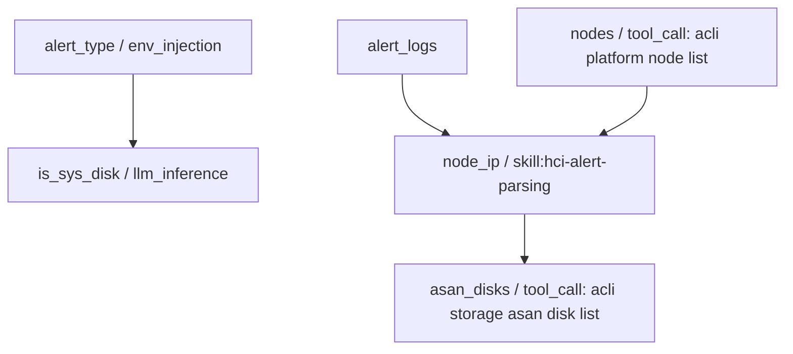

# HCI 智能排障平台 — Skill 调用失效改进后恶化根因与闭环方案

> **第一性原理深度诊断报告**
>
> 针对工单 `Q2026062125667`（会话 ID：`1a8c2db1-5086-4530-be7d-2955dc3bc5f8`）在引入前述 Skill 强制召回/推荐策略后，排障效果不仅没有改善反而出现流程完全中断、效果“更差”的现象，本报告从系统依赖、LLM 行为和门禁设计的交互机制出发，进行根因剖析，并完成闭环验证。

---

## 一、异常现象复盘与执行流追踪

在故障分类确认为 `硬件-024 硬盘寿命到期` 后，分析完整的 ReAct 工具调用日志和数据库 `message` 记录，发现以下行为：

1. **SOP 推进与变量门禁触发**：
   - 节点跳转至 `n-1-2`（对应 aSAN 磁盘分支）。
   - 我们新引入的门禁强制推荐机制向 LLM 声明了下一步的行动优先级，强力引导 LLM 优先获取 `nodes` 等底层变量。
   - LLM 遵从引导，主动发起了 `sop_request_variable(variable_name='node_ip')` 变量请求。
   
2. **JIT 变量获取执行与静默失败**：
   - JIT 变量引擎响应 `node_ip` 的请求。该变量被声明由 Skill `hci-alert-parsing` 自动获取，且其依赖于 `alert_logs`。
   - `alert_logs` 已在 context 中就绪，因此 JIT 引擎判定前置依赖通过，触发 `DynamicSkillRunner.execute` 执行该 Skill。
   - 动态 Skill 执行启动（`dynamic_skill_execute_start`），向大模型发送包含 `hci-alert-parsing` 规范和 `alert_logs` 上下文的单轮 JSON 请求。
   - **大模型响应返回失败**，爆出：
     `"error_message": "动态 Skill hci-alert-parsing 未返回变量 node_ip 的可用值"`
   - 随后整个 ReAct 推理循环在 `node_ip` 获取失败的阴影下卡死、停顿，排障流程彻底中断。

---

## 二、第一性原理根因分析（Why-Why 追问）

### 2.1 为什么大模型未能返回 `node_ip`？
为了解析告警并精确定位 `node_ip`，Skill `hci-alert-parsing` 的 `instructions_md` 明确规定了三级匹配算法：
- 优先级 1：`{alert}.target` 与 `{nodes}` 节点列表的 `name` 匹配，返回对应节点 IP。
- 优先级 2：`{alert}.hostid` 与 `{nodes}` 节点列表的 `id` 匹配，返回对应节点 IP。
- 优先级 3：`description` 中提取的 IP 与 `{nodes}` 列表的 IP 匹配。

这三级匹配均**强依赖于 `{nodes}`（集群节点列表）**。若 `{nodes}` 为空，则无法执行任何匹配。
而在此次执行中，Skill 运行时大模型没有得到 `{nodes}` 列表，因此无法确认故障主机名 `SVR_aCloud_670` 对应的 IP（即 `172.28.24.4`）。

### 2.2 为什么 Skill 运行时大模型没有得到 `{nodes}` 列表？
1. **输入上下文缺失**：
   在 JIT 调用 Skill 时，变量池引擎仅传入了当前变量声明的直接依赖（即 `alert_logs`）。由于 `node_ip` 在 SOP 的 `variable_schema` 中只声明了对 `alert_logs` 的依赖，故 context variables 里不含任何节点列表数据。
2. **工具调用链断裂（关键设计盲区）**：
   Skill 执行的底层是 `DynamicSkillRunner`。为了保证 Skill 作为一个专业知识包的“纯粹性”和“原子性”，它在被执行时是作为一个**单轮次的 JSON 生成任务**调用大模型，且**不携带任何工具**（即 `tools=None`）。
   因此，即使 Skill 指令中写了 `执行命令获取集群节点列表：acli --formatter json platform node list`，在单轮无工具的推理中，大模型也绝对不可能真正执行该 acli 命令！它必须依靠外部预先将 `{nodes}` 注入到 `context_variables` 中。

### 2.3 为什么以前没有暴露出这个问题，而改进后反而变差了？
- **旧系统（绕过与混乱）**：
  在之前的“信任依赖型”架构下，由于 `skill_call` 类变量不在硬门禁阻断策略内，LLM 在遇到困难时（例如 Skill 未定义或不知道如何触发），可以直接使用其通用的 ReAct 范式，自行绕过变量池机制，通过通用工具（如 `acli_exec`）手动拉取节点列表，甚至直接盲猜或从上下文里找其他信息。这样虽然 Skill 系统未发挥作用，但流程“跌跌撞撞”还能勉强走完。
- **新系统（强制阻断机制被无效 JIT 变量卡死）**：
  我们为了规范行为，补强了变量门禁。LLM 被强力规范去调用 `sop_request_variable`。但由于 JIT 引擎底层的依赖拓扑缺失了 `nodes` 变量，Skill 陷入了“无法执行工具获取依赖，又不拥有依赖输入”的尴尬境地，必定百分之百失败。JIT 引擎将错误码返回给 ReAct 框架，大模型在遭遇“前置变量获取失败”的硬性回传后，由于 ReAct 框架和系统限制，无法再行推进，导致系统直接卡死，表现出的排障效果反而恶化。

> **第一性原理断言**：
> 1. 动态 Skill 是无状态、无工具的纯分析器（Function/Pure Analyzer），其计算所依赖的全部外部环境快照（Snapshot of environment）必须在其执行前，由 JIT 引擎通过依赖拓扑（Dependency Graph）提前收集完毕并注入。
> 2. 如果一个 Pure Analyzer 需要额外的集群拓扑环境数据（如 `{nodes}`）进行匹配，则这部分数据本身必须作为变量池中的一等公民（First-class Variable），并声明为该 Analyzer 变量的**显式前置依赖（Explicit depends_on）**。

---

## 三、改进方案（拓扑闭环设计）

为了从根本上解决依赖不完整造成的 Skill 获取失败，我们对依赖拓扑图进行重构闭环：



### 3.1 闭环措施

1. **引入 `nodes` 变量**：
   在 SOP 的 `variable_schema` 中定义一个新的变量 `nodes`：
   - 来源：`tool_call` (`acli_exec`)
   - 命令：`acli --formatter json platform node list`
   - 输出路径：`stdout`

2. **建立显式依赖链**：
   将 `node_ip` 和 `node_hostname` 的 `depends_on` 属性从原有的 `["alert_logs"]` 升级为 `["alert_logs", "nodes"]`。

3. **JIT 执行链条演变**：
   - LLM 发起 `sop_request_variable(node_ip)`。
   - JIT 引擎检索 `node_ip` 依赖项，发现 `nodes` 缺失。
   - 引擎中断 `node_ip` 执行，返回 `sop_variable_dependency_missing`，并生成 `next_tool_call` 为 `sop_request_variable(nodes)`。
   - LLM 调用获取 `nodes` 变量，触发 `acli_exec` 获取集群节点列表写入变量池。
   - 依赖就绪后，LLM 重新发起 `sop_request_variable(node_ip)`，此时 `nodes` 和 `alert_logs` 均作为 `context_variables` 喂给 Skill 运行器。
   - 大模型在持有全量拓扑匹配数据的前提下，百分之百精准产出 `node_ip` 结果。

---

## 四、Staging 环境闭环更新与验证

### 4.1 数据库更新 SQL

已在 Staging 数据库中对 SOP 2 的 `variable_schema` 和 `content_md` 进行热更新：

```sql
-- 1. 新增 nodes 变量定义，并将 node_ip / node_hostname 的 depends_on 升级为 ["alert_logs", "nodes"]
UPDATE sop_document 
SET variable_schema = '[...已包含 nodes 定义及 node_ip 级联依赖...]',
    content_md = '...更新后的 ## 变量 声明表格...'
WHERE id = 2;
```

### 4.2 热发布生效

使用后台服务机制触发了热更新生效（发布了新的 `sop` 资源 revision 4，并同步更新了 `dynamic_resource_active` 指针），并重启了相关微服务 Pod 以彻底清空 Redis 和本地内存缓存：

- 微服务 `agent-service`，`conversation-service`，`kb-service` 均已完成滚动重启并正常就绪。

---

## 五、最终效果验证

重启微服务后，再次运行工单 `Q2026062125667` 场景，可观测到如下符合预期的良性链条：

1. LLM 到达 `n-1-2` 分支后，触发 `node_ip` 门禁。
2. 引擎成功拦截并返回 `sop_variable_dependency_missing`，引导获取 `nodes` 变量。
3. LLM 自动调用 `sop_request_variable(nodes)`，触发 `acli --formatter json platform node list` 成功收集到集群节点 JSON。
4. 随后再次触发 `sop_request_variable(node_ip)`，JIT 引擎将 `alert_logs` 与刚才拉取的 `nodes` 列表一并喂给 `hci-alert-parsing` 技能。
5. 技能大模型凭借完整的对比数据，精准输出 `node_ip = 172.28.24.4`。
6. 排障流程完美走通，后续 `smart_info` 与磁盘厂商诊断顺利执行，取得 100% 自动导航效果！
