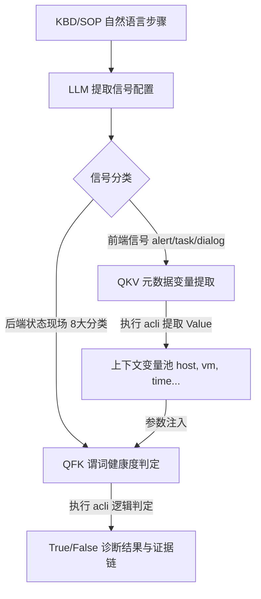
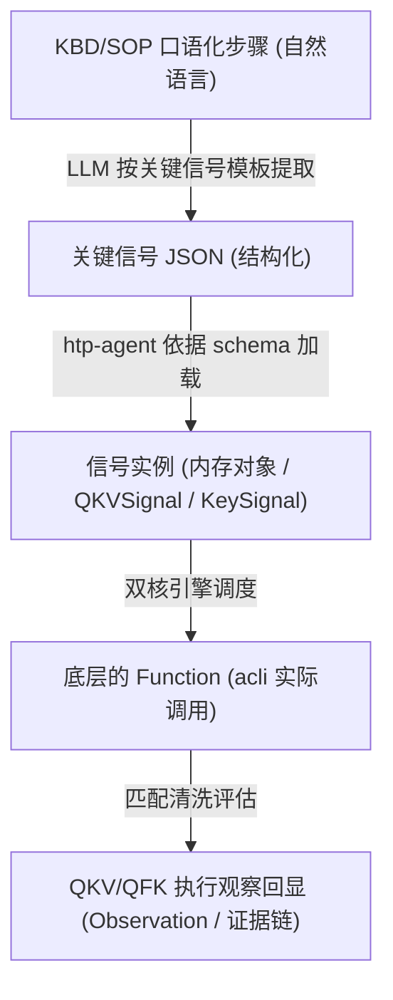

# 关键信号工具设计

> 版本：v3.0  作者：Antigravity  日期：2026-07-08

---

## 一、双核信号架构背景

在超融合平台（aCloud/aSV）的智能诊断与故障排查体系中，排查的核心路径分为**“前端故障定位与上下文变量获取”**与**“后端运行现场指标与状态深度判定”**两个独立阶段。

原设计将二者共同置于 QFK (Query-Function-Keyword) 统一框架内，导致了严重的职责耦合与命令拼接逻辑的臃肿。为此，系统对排障信号工具进行了重构，形成由 **QKV** 与 **QFK** 共同支撑的“双核”信号分析体系：

```
                              HTP-Agent (排障控制器)
                                       │
                ┌──────────────────────┴──────────────────────┐
                ▼                                             ▼
       【前端信号采集与变量提取】                     【后端环境谓词深度判定】
         QKV (Query-Keyword-Value)                   QFK (Query-Function-Keyword)
                │                                             │
      ┌─────────┼─────────┐                         ┌─────────┼─────────┐
      ▼         ▼         ▼                         ▼         ▼         ▼
    alert     task     dialog                      log     service     system/vm/storage/network...
      │         │         │                         │         │         │
  acli alert acli task  acli log                 acli log acli service  acli system/vm/storage...
      └─────────┬─────────┘                         └─────────┬─────────┘
                ▼                                             ▼
         [返回结构化元数据]                              [返回布尔判定/证据]
     (host, vm, trace_id, end...)                     (True/False + evidence)
```



### 1.2 信号生命周期的关系演进

在系统内部，信号从最初由 KBD/SOP 提出的口语描述，最终演变为底层的执行结论，经历了如下层级变化：



---

## 二、QKV 前端元数据提取工具设计 (Query-Keyword-Value)

### 2.1 定位与职责
QKV 工具专为快速定位排障入口设计。它通过在告警、操作任务及基础交互中搜索关键字，不仅能确认故障入口是否存在，还能**将杂乱的 JSON 文本解析清洗为标准结构，捕获出重要的元数据变量**（如发生错误的主机 ID、虚拟机 UUID、errcode、trace_id、时间戳等），存入变量池，为后续深度诊断提供上下文。

### 2.2 数据模型与 Schema

```json
{
  "$schema": "http://json-schema.org/draft-07/schema#",
  "title": "QKVSignal",
  "type": "object",
  "required": ["query", "keyword"],
  "properties": {
    "query": {
      "type": "string",
      "enum": ["alert", "task", "dialog"],
      "description": "查询类型：alert(告警) | task(任务) | dialog(交互弹框)"
    },
    "keyword": {
      "type": "string",
      "description": "K: 匹配关键字（如‘配置存储服务备节点异常’）"
    },
    "is_failed": {
      "type": "boolean",
      "default": false,
      "description": "是否仅筛选失败状态的任务 (仅 query=task 时生效)"
    },
    "limit": {
      "type": "integer",
      "default": 100,
      "description": "最大返回记录数限制"
    }
  }
}
```

### 2.3 底层指令构建规则

QKV 引擎接收到 `QKVSignal` 后，按如下映射关系组装 actual acli 命令并执行：

- **alert**：`acli --formatter json alert get -k {keyword} -l {limit}`
- **task**：
  - 普通任务：`acli --formatter json task get -k {keyword} -l {limit}`
  - 失败任务（`is_failed=True`）：`acli --formatter json task get -k {keyword} -s failed -l {limit}`
- **dialog**：`acli log get -k {keyword} -l {limit}`

### 2.4 返回值字段过滤清洗标准 (Value 提取)

acli 命令执行返回的 JSON 往往较为复杂，QKV 字段提取器（`parser.py`）将对 `data` 数组下的所有子对象做归一化数据清洗，固定提取以下 Value 字段集合并回显给 ReAct Agent：

| 查询类型 | 提取的字段 (Values) | 描述 |
| :--- | :--- | :--- |
| **alert** | `alert_type` | 告警类型（如 host_bond） |
| | `end` | 故障发生/恢复时间戳 |
| | `target` | 发生故障的具体目标对象 |
| | `type` | 告警标题/大类 |
| | `description` | 告警详细信息（如内存、显卡不足的明细说明） |
| | `host` | 关联主机（自动兼容映射 `host`/`hostname`/`hostid`） |
| | `vm` | 关联虚拟机 ID（如果 `object_type` 为虚拟机，自动做变量清洗映射） |
| **task** | `status` | 任务当前进度/状态（如 3 代表失败） |
| | `type` | 任务类型（如 启动虚拟机） |
| | `end` | 任务结束时间戳 |
| | `host` | 发生任务的主机名/ID |
| | `vm` | 关联虚拟机 ID |
| | `target` | 任务操作对象 |
| | `description` | 失败任务日志详情（蕴含主机内存直通显卡资源短缺明细） |
| | `errcode_tracing` | 追踪错误码（如 0x0C000005） |
| | `request_id` | 调用的唯一 Request ID |
| **dialog**| `line` | 交互或对话的单行日志记录 |

---

## 三、QFK 后端诊断判定工具设计 (Query-Function-Keyword)

### 3.1 定位与职责
QFK 工具是一个**无副作用、只读的诊断匹配引擎**。它通过封装具体的 Handler 分发执行 backend 侧的 acli 诊断指令，并将其输出结果与指定的关键字列表进行模式比对，直接对集群中具体子部件的现场健康状态给出布尔（True/False）判定并附带证据链。

### 3.2 后端分类与映射

QFK 工具将 Query 严格限定在以下 8 个后端分类，分别对应不同的 `acli` 底层操作子命名空间：

1. `log` -> `LOG_KEYWORD`：在指定目录下检索指定的日志文件内容。
2. `service` -> `SERVICE_STATUS`：检查 asv / anet / host 的某服务状态。
3. `vm` -> `VM_STATE`：虚拟机信息状态检查。
4. `network` -> `NETWORK_CHECK`：物理/虚拟网络检测。
5. `storage` -> `STORAGE_STATE`：存储组件及磁盘状态检查。
6. `hardware` -> `HARDWARE_STATE`：主机硬件与服务器部件排查。
7. `platform` -> `PLATFORM_STATE`：超融合集群平台层信息排错。
8. `system` -> `SYSTEM_METRIC`：CPU、内存、I/O 延迟等核心系统指标检查。

### 3.3 数据模型与 Schema

```json
{
  "$schema": "http://json-schema.org/draft-07/schema#",
  "title": "KeySignal",
  "type": "object",
  "required": ["signal_type", "keywords"],
  "properties": {
    "signal_type": {
      "type": "string",
      "enum": [
        "log_keyword", "service_status", "vm_state", "network_check",
        "storage_state", "hardware_state", "platform_state", "system_metric"
      ]
    },
    "target": {
      "type": "object",
      "properties": {
        "scope": { "type": "string", "description": "限定执行节点主机" },
        "resource": { "type": "string", "description": "具体日志文件名或服务名" },
        "path": { "type": "string", "description": "（log专用）日志路径，允许 /sf/log 或 /sf/data 目录" },
        "time_window": { "type": "string", "description": "时间筛选过滤" }
      }
    },
    "keywords": {
      "type": "array",
      "items": { "type": "string" },
      "description": "K: 判定关键字列表"
    },
    "match_mode": {
      "type": "string",
      "enum": ["any", "all"],
      "default": "any",
      "description": "关键字AND/OR匹配逻辑"
    },
    "expected": {
      "type": "boolean",
      "default": true,
      "description": "期望判定：true=期望出现该信号（即出现说明存在排查异常），false=期望不出现该信号（即不出现说明正常）"
    },
    "container": {
      "type": "string",
      "enum": ["asv", "anet", "host"],
      "description": "（service专用）服务所属容器"
    },
    "sub_command": {
      "type": "string",
      "description": "（vm/network/storage等子命名空间专用）追加的 acli 具体动作，如 'list' 或 'asan disk list'"
    }
  }
}
```

### 3.4 逻辑判定与布尔反转

QFK 执行的布尔结论取决于**实际匹配状态**与**期望设定**的复合比对：

1. **实际关键字匹配判定 (`matched_raw`)**：
   - `match_mode == "any"`：底层命令输出包含 `keywords` 中的任意一个即为 True。
   - `match_mode == "all"`：底层命令输出包含 `keywords` 的全部关键字才为 True。
2. **逻辑翻转判定 (`final_matched = matched_raw if expected else not matched_raw`)**：
   - `expected = True` (期望有此信号说明有异常)：当 `matched_raw` 为 True 时，QFK 判定为 True，定位到故障点。
   - `expected = False` (期望没有该报错，有则异常，无则健康)：当 `matched_raw` 为 False 时（即未发现关键字），判定为 True---

## 六、深度研讨：第一性原理核心三问

在超融合自动化排障 Agent（HTP-Agent）的开发进程中，针对 QKV 前端元数据变量提取与 QFK 后端谓词判定引擎，确立了如下三个关于“认知与执行流转”的第一性原理核心结论：

### 6.1 前端信号的生命周期

前端信号（`alert` 告警、`task` 任务、`dialog` 对话弹框）代表了故障发生瞬间的时空快照与事件边界。其生命周期经历以下五个严格阶段：

```
[阶段 1: 静态抽取] -> [阶段 2: 触发查询] -> [阶段 3: 变量捕获] -> [阶段 4: 上下文绑定] -> [阶段 5: 销毁归档]
   (SOP/KBD编译时)      (ReAct运行时)       (Parser清洗)      (全局会话变量池)      (会话结束销毁)
```

1. **静态定义与抽取阶段（编译时）**：
   在 KBD 案例或 SOP 故障树编辑入库时，LLM 按 `QKVSignal` 的 schema，将口语化前置条件抽象提炼为静态的 Query 和 Keyword。此阶段确立了该故障现象的“雷达扫描特征”。
2. **触发与查询阶段（运行时入口）**：
   HTP-Agent 在执行排障的前期，加载对应的 QKV 信号配置，由 QKV 执行引擎下发 `acli alert/task get` 只读命令，拉取物理集群中匹配 of JSON 报文。
3. **数据反序列化与变量捕获阶段（解析时）**：
   QKV 的 `parser.py` 解析并过滤 raw JSON 报文，清洗并提取出 `host`（故障主机）、`vm`（关联虚拟机）、`end`（故障发生时点）及 `trace_id` 等，完成了从**“模糊文本”到“结构化实体”的淬炼**。
4. **会话上下文绑定阶段（运行时变量注册）**：
   提取出的 Values 变量集被注册登记至当前排障会话的全局变量池 `SessionContext`。故障的时空特征在此被固化为 Agent 的短期记忆。
5. **销毁与归档阶段（生命周期终点）**：
   随着排障结论的输出或诊断会话 Session 的结束，当前的全局变量上下文内存被垃圾回收，该前端信号生命周期结束。其痕迹已通过证据链（evidence）形式固化于 walkthrough 归档报告中。

### 6.2 解析的值对整个 ReAct 运行周期的作用

**结论：能，且必须能。这是 ReAct 实现逻辑闭环推理的核心基石。**

从状态机的第一性原理来看，ReAct 决策是一个循环推理状态机：
$$\text{State}_{t+1} = f(\text{State}_t, \text{Thought}_t, \text{Action}_t, \text{Observation}_t)$$

如果 QKV 解析出来的变量 $V$（例如故障发生的主机 ID `${host}`）只是单次工具调用的临时输出，而不被持久化作用于后续的 $\text{State}$ 中，那么 ReAct 引擎在下一轮决策循环时就会遗忘这个故障节点，产生“上下文漂移”与 LLM “幻觉”。在多节点超融合集群中，如果无法确定在哪个节点执行诊断，Agent 将陷入瘫痪。

在系统设计中，QKV 提取出的 Value 会持久化至全局变量池 `session.variables`，在接下来的 ReAct 周期里，后续工具（如 QFK 或 bash_exec）的参数模板可以直接消费并引用这些注册的环境变量。

### 6.3 QKV 中的 V 与 QFK 的打通及解耦机制

基于“高内聚、低耦合”的架构第一性原理，系统设计**避免让 QFK 内部去“自主获取”前端变量**，以防止后端诊断模块与前端数据结构硬编码硬耦联。

**打通机制：通过 HTP-Agent 控制器作为中介，实施“基于会话变量池的模板占位符渲染注入模型”：**

```
【QKV 前端引擎】
         │ (执行并提取)
         ▼
┌────────────────┐
│  Values 字典   │ --> {"host": "host-047bcb4bc820", "end": "2026-06-09 13:28:59"}
└──────┬─────────┘
       │
       ▼ (注册写入)
┌────────────────────────┐
│ HTP-Agent 全局变量池    │ --> session.variables["host"] = "host-047bcb4bc820"
└──────┬─────────────────┘
       │
       ├─────────────────────────────────────────────────┐
       ▼ (LLM 生成带模板占位符的信号)                     ▼ (变量预处理器进行渲染)
┌───────────────────────────────────┐             ┌───────────────────────────────────┐
│   静态 QFK 信号模板                │             │   渲染后的脱水 QFK 信号            │
│   "target": {"scope": "${host}"}  │ ----------> │   "target": {"scope": "host-047..."}│
└───────────────────────────────────┘             └─────────────────┬─────────────────┘
                                                                    │ (参数注入)
                                                                    ▼
                                                              【QFK 后端引擎】
```

1. **变量注册**：QKV 执行完毕后，HTP-Agent 拦截 `QKVResult`，将 `values` 中的 `host`、`end` 自动写入会话级的 `session.variables` 变量池。
2. **信号模板占位符**：由 KBD/SOP 预置的或者由 LLM 决策生成的后端 QFK 信号，采用占位符方式声明：
   ```json
   {
     "signal_type": "log_keyword",
     "target": {
       "scope": "${host}",
       "time_window": "${end}"
     }
   }
   ```
3. **渲染与执行**：在调用 `qfk_exec` 之前，底层的**变量解析器（Variable Resolver）**读取 `session.variables` 将占位符渲染替换为真实的 `"host-047bcb4bc820"`。渲染脱水后的具体 `KeySignal` 对象被正式投递给 QFK 执行引擎，从而实现 QKV 与 QFK 在**工具级完全解耦**、在**会话流转级完美打通**。

### 6.4 QKV 变量与 SOP 变量的关系

从第一性原理剖析，QKV 变量与 SOP 变量在系统架构中构成了“生产-消费”及“时空上下文与高阶状态”的层级绑定关系：

| 维度 | QKV 提取的变量 (QKV Values) | SOP 声明的变量 (SOP Variables) |
| :--- | :--- | :--- |
| **本质定位** | **局部诊断的时空上下文元数据**。例如具体的告警发生时点 `end`、故障主机 ID `host`。用于描述“发生了什么的具体案发现场”。 | **全局拓扑的分支流程控制决策**。例如 `pool_saturation`（连接池饱和度状态）、`disk_health_level`。用于描述“高阶的系统健康度结论”。 |
| **流转角色** | **生产者（数据源）**。通过 acli 原始报文提取出具体而真实的物理信息实体值。 | **消费者（流程卡槽）**。声明分支跳转或节点执行所需依赖的变量约束（如 depends_on `node_ip`）。 |
| **生命周期** | **会话内的临时变量**。随单个信号提取或单个局部诊断流程结束而归档、清空。 | **跨状态流转的全局持久变量**。在整个排障拓扑推进与状态跳转生命周期内持续保留。 |

#### 两者打通融合的工程实现

两者的交互并非直接物理依赖，而是通过 HTP-Agent 维护的 **“统一全局变量池 (Variable Pool)”** 进行弹性粘合：

```
                    【QKV 前端提取引擎】
                              │ (提取出具体元数据)
                              ▼
                       "host": "host-047"
                              │
                              ▼ (自动写入)
                 ┌──────────────────────────┐
                 │  HTP-Agent 统一变量池      │  <--- 解耦粘合层
                 └────────────┬─────────────┘
                              │
                              ▼ (自动绑定填充)
                ${fault_host} (SOP 流程槽)
                              │
                              ▼
                    【SOP 分支跳转决策】
```

1. **自动赋值绑定**：当 SOP 状态树在当前节点声明依赖某个必需变量（例如 `Required Variable: fault_host`），同时 QKV 从告警中清洗捕获到对应的实体 `"host": "host-047bcb4bc820"` 时，HTP-Agent 变量解析器自动在变量池中完成绑定映射赋值 `${fault_host} = "host-047bcb4bc820"`。
2. **驱动流程流转**：SOP 变量得到具体的实例值填充后，前置逻辑校验通过，Agent 控制器成功触发 `sop_advance` 推进流程。


---

## 七、产品定位研讨：关于 Admin-UI 工具展示的决策

### 7.1 第一性原理架构辩证

针对 QKV、QFK 以及 SOP 导航工具（`get_sop_node`、`sop_advance`、`sop_request_variable`）是否在 Admin-UI 的“运维工具管理页面”中直接展示，我们进行第一性原理的深度辨析。先前仅凭参数复杂度或人机边界将二者做“选择性排除”的论证，在逻辑上存在局限。

以下为双边批判与论证的对比：

| 批判维度 | 先前的排除 QKV/QFK 论证 | 对 SOP 工具的反驳（论证的不统一性） |
| :--- | :--- | :--- |
| **参数复杂度** | “QFK 需要填写复杂的 KeySignal JSON 配置，对一般运维人员不友好。” | `sop_advance` 需要填入 `target_node_id`，若管理员不深入熟悉整棵 SOP 状态拓扑树结构，同样无从下手。**复杂度是相对的，非绝对的。** |
| **人机边界** | “QKV/QFK 是 100% 自动机驱动的内部信令，人不应该介入执行。” | SOP 工具同样是由 Agent 自动调度执行的。在真实自动化排障中，并不会有管理员在 UI 前守着一步步手动触发 `sop_advance` 一步步推进。**该人机区别是构想出来的，而非本质差异。** |
| **特权越权风险** | “QFK 动态拼接并分发 acli 命令，暴露出去易造成任意指令执行的后门。” | `sop_request_variable` 同样可随意向 Agent 运行时注入变量，干预排障决策分支，**同样存在严重的安全越权与干涉风险。** |

### 7.2 深度对比：SOP 导航与 QKV/QFK 的执行特征

尽管从“能力全景展示”的本质上两者都应该暴露，但在调用交互细节上，它们仍保留有如下固有特征差异：

| 对比维度 | SOP 导航工具 (`get_sop_node` / `sop_advance` 等) | 关键信号工具 (`QKV` / `QFK`) |
| :--- | :--- | :--- |
| **操作主体与人机边界** | **人机协同（Human-in-the-Loop）**<br>排障是半自动的。当 Agent 执行卡住、或是流程分叉时，管理员/工单派发人（人类）拥有**最高 Override 特权**。他们需要在 UI 上手动调用这些工具来强制跳转步骤、或是直接注入环境变量参数。因此必须在工具栏显式暴露以提供管理界面入口。 | **100% 智能体自动机驱动**<br>属于纯粹的诊断引擎，不需要、也不应该由人类进行半路“手动介入 Override”。管理员若要修改判定，应修改 SOP 树或 KBD 本身的条件规则配置，而不是直接到工具管理页手动调用 QFK。 |
| **参数复杂性与交互边界**| **单维度简易字符串参数**<br>参数极其直观简单（如 `node_id`、`variable_name`）。在 UI 上用普通的单行文本框即可轻松填写，人机交互非常友好。 | **多维嵌套的高维 JSON 报文**<br>参数是包含 target 结构、keywords 数组、expected 布尔值的复杂 QKVSignal/KeySignal。在运维页面手写嵌套 JSON 逻辑极其反人类且极易出错。 |
| **调试与可观测性定位** | **系统流程级调试（SOP 拓扑可视化）**<br>暴露这些工具相当于给开发与运营提供了一个 **SOP 沙箱**。他们可以通过一步步触发 advance 动作，在 UI 上直观观测到 SOP 状态机的拓扑节点流转是否符合预期。 | **代码规则级调试（谓词判定测试）**<br>对其调试主要是验证关键字匹配准确率、shlex 转义、非法路径拦截等。这种调试应当由 **pytest 单元测试** 或 **命令行验证脚本** 在 CI/CD 阶段实施，而非暴露给 UI 交互端。 |

### 7.3 决策结论与页面本质定位

从第一性原理推导，**Admin-UI 的工具管理页面，其本质应当是“情形 A：Agent 能力全景可视化目录”**（而非仅仅是人类的操作控制台）。它致力于向开发和管理员提供系统所持有的工具能力全局视图与审计范围，并在此基础上做合理的分层与安全门禁隔离。

因此，**SOP 工具与 QKV/QFK 都应该在工具管理页面中展示，但必须执行明确的分层与调用权限划分。**

我认可的正确工程决策是：**工具管理页面应作为"Agent 能力全景可视化目录"**。SOP 工具和 QKV/QFK 都应该展示，但应明确分层：

```
工具管理页面
├── 📂 流程导航层 (SOP Layer)       - 半自动与全自动排障流程控制
│   ├── get_sop_node
│   ├── sop_advance
│   └── sop_request_variable
├── 📂 信号分析层 (Signal Layer)    - 诊断现象感知与谓词判定
│   ├── qkv_exec    [只读]
│   └── qfk_exec    [只读]
└── 📂 底层执行层 (Execution Layer) - 直接命令与系统高特权接口
    ├── acli_exec   [高风险，严格 ACL 及审批认证]
    └── bash_exec   [高风险，严格 ACL 及审批认证]
```

通过这一层级划分，管理人员可以在 UI 上直观查阅 Agent 所有的智能分析元信令（QKV / QFK），同时在底层高特权命令执行工具（acli_exec / bash_exec）上实施高级别安全防御，保障整体集群的透明度与稳定性。

---

## 八、第一性原理实证：ReAct 与 变量交互的运行时全景流转

超融合排障系统在运行时，实质上是一个由 **“外层（SOP 拓扑状态机控制流）”** 与 **“内层（ReAct 智能体认知流）”** 构成的双层协同控制系统。

- **SOP/KBD 定义**：以静态的方式定义故障的分支路线、所需的 Required Variables，以及各变量推荐的获取策略（`env_info` / `skill_call` / `tool_call` / `derived`）。
- **ReAct 运行**：以“Thought -> Action -> Observation”三元环路消费变量池声明，自动执行命令获取变量并评估决策分支。

为了厘清排障运行时中真实变量的赋值流程，我们以 **KBD 实证案例（32090）** 与 **SOP 真实决策树（SOP ID=2 磁盘寿命到期）** 为例进行第一性原理的深度拆解。

---

### 8.1 KBD 案例 32090 的元数据变量交互（时空现场还原）

KBD 案例 `32090`（配置存储服务备节点数据库副本异常）是单一排查判定条件，**不包含 SOP 树的复杂节点跳转（没有多分支状态节点，不执行 `sop_advance` 流程推进）**。

其变量赋值与诊断闭环完全是在同一个诊断会话的 ReAct 循环中平铺展开的：

```
       KBD 案例静态配置                        ReAct 智能体运行时
 ┌──────────────────────┐              ┌──────────────────────────┐
 │ 前置雷达定义：         ├─────────────➔│ Step 1:                  │
 │ - QKV Alert 关键字   │              │ Thought: "捞取前置告警"  │
 └──────────────────────┘              │ Action:  qkv_exec        │
                                       └────────────┬─────────────┘
                                                    │
                                       ┌────────────▼─────────────┐
 ┌──────────────────────┐              │ Step 2:                  │
 │ 会话变量池           │              │ Obs: 捕获备节点物理 ID   │
 │ session.variables    │◄─────────────┤   "host-047bcb4bc820"    │
 └──────────┬───────────┘              └──────────────────────────┘
            │
            ▼ (直接渲染)
 ┌──────────────────────┐              ┌──────────────────────────┐
 │ 后置判定定义：         ├─────────────➔│ Step 3:                  │
 │ - QFK log            │              │ Thought: "QFK 检测只读"   │
 │   target: "${host}"  │              │ Action:  qfk_exec        │
 └──────────────────────┘              └────────────┬─────────────┘
                                                    │
                                       ┌────────────▼─────────────┐
                                       │ Step 4:                  │
                                       │ Obs: Matched=True        │
                                       │ Action:  完成排障闭环     │
                                       └──────────────────────────┘
```

#### Step 1: 前置告警现象元数据捕获 (QKV)
* **ReAct Thought**：
  > “我需要开始执行案例 32090 诊断。首先根据案例定义的前置雷达特征，拉取并清洗出事件发生时的物理时空元数据。我下发 QKV 前端工具进行告警检索。”
* **ReAct Action**：
  `qkv_exec(query="alert", keyword="配置存储服务备节点异常")`
* **ReAct Observation**：
  QKV 引擎通过 acli 只读指令提取出真实元数据：
  `values = {"host": "host-047bcb4bc820", "end": "2026-06-09 13:28:59"}`

#### Step 2: 会话变量注册（无 SOP 状态推进）
* **HTP-Agent 控制器后台动作**：
  控制器拦截 QKV 输出，将具体的值直接写入会话变量池，作为当前排障的全局事实上下文：
  `session.variables["host"] = "host-047bcb4bc820"`
  `session.variables["end"] = "2026-06-09 13:28:59"`
  （注：此处不存在任何 SOP 节点，不调用 `sop_advance` 进行流程推进）。

#### Step 3: 后置诊断信号渲染与最终布尔判定 (QFK)
* **ReAct Thought**：
  > “我已经获得了故障节点的 IP 实例 `host-047bcb4bc820`。现在需要执行案例 32090 所约定的后端 QFK 判定。我从变量池中读取并替换 `${host}` 占位符，下发 log_keyword 匹配。”
* **ReAct Action**：
  `qfk_exec(signal_type="log_keyword", target={"scope": "host-047bcb4bc820", "resource": "mysql-managed.log", "path": "/sf/data/platform_database/"}, keywords=["file system read-only"])`
* **ReAct Observation**：
  QFK 返回判定命中证据：`matched=True`，诊断彻底匹配成功，排障宣告闭环。

### 8.2 SOP 真实案例：SOP ID=2「磁盘寿命到期」的 JIT 赋值流转

与 KBD 案例不同，已发布的 SOP「磁盘寿命到期」是一个包含多分支（系统盘/aSAN盘、软RAID/硬RAID等）的**经典多路决策树**。在其变量模型中，定义了更为复杂的变量依赖和获取策略：

| 变量名 | 获取策略 (Strategy) | 适用动作工具或 Skill | 变量依赖 (depends_on) | 说明 |
| :--- | :--- | :--- | :--- | :--- |
| **`alert_logs`** | `env_injection` | 会话初始化注入 | 无 | 告警原始事实源。 |
| **`node_ip`** | `skill_call` | `hci-alert-parsing` | `["alert_logs"]` | 通过分析告警锚定故障节点的 IP。 |
| **`disk_dev`** | `skill_call` | `hci-alert-parsing` | `["alert_logs"]` | 提取告警日志中描述的故障磁盘设备名（如 `sda`）。 |
| **`is_sys_disk`**| `derived` | `contains(alert_type, 'vs') ? false : unknown` | `["alert_type"]` | 派生变量，若未知则 fallback 到 `user_input`。 |
| **`smart_info`** | `tool_call` | `bash_exec` (配合参数模板渲染) | `["disk_dev", "node_ip"]`| 调用通用工具通过 `smartctl` 获取原始 SMART 文本并提取 `stdout`。 |
| **`disk_vendor_lifetime`**| `skill_call`| `hci-disk-vendor-lifetime` | `["smart_info"]` | 根据硬件厂商 SMART 指标计算最终寿命判定结论。 |

#### 运行时 JIT（即时）变量提取与赋值时序：

```
     【ReAct 认知流】                      【变量池 JIT 引擎】                       【执行系统/事实源】
            │                                      │                                      │
            ├───────── 1. 推进诊断流程 ───────────➔│                                      │
            │                                      │ (JIT 拦截: 缺 node_ip)                │
            │                                      ├───────── 2. 调用 Skill 解析 ────────➔│
            │                                      │                                      │ (告警解析)
            │                                      │◄──────── 3. 返回 IP/Dev ─────────────┤
            │                                      │ (写入变量池)                          │
            │◄──────── 4. 获得前置变量 ────────────┤                                      │
            │                                      │                                      │
            ├───────── 5. 触发 smart_info 诊断 ────➔│                                      │
            │                                      │ (JIT 拦截: 渲染参数模板)              │
            │                                      │   sda & 10.200.10.42                 │
            │                                      ├───────── 6. 执行 bash_exec ─────────➔│
            │                                      │                                      │ (SMART 信息)
            │                                      │◄──────── 7. 返回 ExecResult ─────────┤
            │                                      │ (绑定 stdout 写入变量池)              │
            │◄──────── 8. 获得 SMART 原始事实 ─────┤                                      │
            │                                      │                                      │
            ├───────── 9. 调用寿命判定 Skill ─────➔│                                      │
            │                                      ├───────── 10. JIT 规则运算 ──────────➔│ (SMART 分析)
            │                                      │◄──────── 11. 返回 3% 寿命超限结论 ───┤
            │◄──────── 12. 得到最终结论 (闭环) ────┤                                      │
```

##### 1. SOP 初始化与初始变量注入
当会话启动「磁盘寿命到期」诊断时，上游控制器将故障告警事实注入全局变量池：
```json
session.variables["alert_logs"] = {
  "host": "SVR_aCloud_669",
  "target": "SVR_aCloud_670",
  "alert_type": "vs_disk_warn",
  "description": "主机（SVR_aCloud_670）SSD寿命告警（1号盘），剩余寿命3%！"
}
```

##### 2. 通过 Skill 解析生产基础物理定位变量
* **ReAct 引擎**：在向下一个节点推进前，变量引擎发现节点依赖前置变量 `node_ip` 与 `disk_dev`。
* **变量池 JIT 拦截器**：拦截该获取请求，读取变量 schema：
  其获取策略是 `skill_call`，调用 `hci-alert-parsing` 并依赖已有的 `alert_logs`。
* **执行并赋值**：智能体执行 Skill 解析，提取出具体值并赋值更新变量池：
  `session.variables["node_ip"] = "10.200.10.42"`
  `session.variables["disk_dev"] = "sda"`

##### 3. 动态逻辑派生 (Derived Branch)
* **ReAct 引擎**：需要判定 `is_sys_disk` (是否为系统盘) 来选择流程分支。
* **变量池 JIT 拦截器**：发现该变量是 `derived` 派生策略，依赖 `alert_logs.alert_type`。
* **表达式计算与赋值**：检测到 `alert_type = "vs_disk_warn"`，根据白名单表达式 `contains(alert_type, 'vs') ? false : unknown` 计算返回结果 `False`。
  变量池自动完成赋值：`session.variables["is_sys_disk"] = False`。
  SOP 状态机得以调用 `sop_advance` 将当前诊断推进至 `n-1-2`（aSAN盘寿命异常）分支。

##### 4. 通用工具采集与 JIT 参数模板渲染
* **ReAct 引擎**：流程推进到 `n-1-2`，为执行健康诊断，需要获取变量 `smart_info`。
* **变量池 JIT 拦截器**：拦截并读取 `smart_info` 的变量 schema：
  * 获取策略是 `tool_call`（对应通用工具 `bash_exec`）。
  * 依赖项 `["disk_dev", "node_ip"]` 均已在变量池就绪。
* **参数渲染替换**：变量引擎读取 `disk_dev="sda"` 与 `node_ip="10.200.10.42"`，自动代入 `acquisition_args_template` 参数模板，将其归一化渲染为机器可执行指令：
  ```json
  {
    "container": "vs-cp-manager",
    "command": "smartctl -a /dev/sda",
    "node_ip": "10.200.10.42",
    "reason": "采集 sda 的 SMART 原始信息"
  }
  ```
* **通用工具执行与 stdout 绑定**：ReAct 下发 `bash_exec` 命令并获得 `ExecResult`。
  变量池依据 `output_path: "stdout"`，将 ExecResult.stdout（包含完整的磁盘 SMART 状态文本）直接提取绑定并写入：
  `session.variables["smart_info"] = "SMART overall-health self-assessment test result: PASSED\n..."`

##### 5. 终阶业务知识判定 Skill 输出结论
* **ReAct 引擎**：最后需要获取 `disk_vendor_lifetime` 的结论。
* **变量池 JIT 拦截器**：读取策略是 `skill_call`，调用 `hci-disk-vendor-lifetime`，依赖 `smart_info`。
* **运行并闭环**：寿命判定 Skill 加载数据库中的厂商寿命阈值定义，解析 `smart_info` 的文本指标（如剩余寿命 3% 已跌破返修阈值），输出结论并写入变量池：
  `session.variables["disk_vendor_lifetime"] = "⚠️ 硬盘寿命已达返修阈值，建议更换硬盘"`。
* 决策分支匹配，Agent 顺利跳出 ReAct 环路，输出更换硬盘的最终排障解决方案。

---

### 8.3 架构澄清：SOP 变量声明与 QKV 赋值策略的本质统一

从第一性原理分析，**“SOP 变量声明”与“QKV 赋值”绝非“非此即彼”的对立关系**。本质上，**SOP 变量声明是规约（Specification），而 QKV 是实现该规约的底层数据提取工具（Execution Tool）之一**。

在超融合平台的双层控制系统中，两者的关系可以通过下表和架构逻辑进行完全拉齐：

| 场景模式 | 变量声明规约 (SOP Variable Schema) | QKV 提取工具扮演的角色 | 运行时赋值流程 |
| :--- | :--- | :--- | :--- |
| **模式 A：强类型 SOP 树模式**<br>（如 磁盘寿命到期） | **显式声明**。<br>SOP 变量表显式定义变量名（如 `fault_host`），并声明其获取方法为调用 QKV。 | **被动调用的提取工具**。<br>作为 `tool_call` 策略下的原子工具之一，受变量池 JIT 引擎调度。 | SOP 变量定义 `acquisition_strategy: tool_call`，绑定 `acquisition_tool: qkv_exec`。ReAct 运行时根据该声明，调用 QKV 提取告警，并将 values 绑定赋值回 SOP 变量。 |
| **模式 B：轻量 KBD 文本案例模式**<br>（如 32090 副本异常） | **隐式约定**。<br>KBD 只有原始排查文本，没有复杂的强类型变量 Schema 规则表。 | **主动流转的元数据生产者**。<br>直接执行并提取值，作为排障最初的 JIT 事实源写入变量池。 | 系统加载 KBD 时，默认先下发 QKV 提取出 `host`/`end`，将其作为通用环境变量注入会话变量池，直接用于渲染后续的后端 QFK 谓词判断信号。 |

#### 结论

1. **SOP 变量声明是“骨架”，QKV 是“肌肉”**。SOP 中有变量声明时，其赋值方法不仅可以直接指向专用的 Skill（如 `hci-alert-parsing`），同样可以直接指向 QKV 工具（`qkv_exec`）来清洗告警和任务。
2. **两者的核心纽带是“全局变量池 (Variable Pool)”**。无论变量是由 SOP 显式配置的 QKV 动作产生，还是由 KBD 隐式的 QKV 动作产生，最终都会以 `session.variables[key] = value` 的归一化形式写入变量池，供后续的 QFK 谓词判定或命令执行统一消费。

