# 智能体变量池 JIT 获取策略的架构深度剖析与演进设计

> **第一性原理分析报告**
>
> 本报告针对 HCI 智能排障平台中 “S0 故障分类卡片” 的现有交互与渲染机制进行解构，并结合业界最佳实践，对 `variable_pool.py` 中 7 种变量获取策略（`acquisition_strategy`）的物理存放位置与架构划分进行深度的第一性原理剖析。

---

## 核心结论速览

1. **当前 S0 选项渲染机制**：当前已彻底升级为**方案 B（结构化元数据渲染引擎）**。选项数据由后端以结构化 JSON 元数据形式通过 SSE 专用事件流（`\x00event:metadata:...`）下发，流式解析并安全持久化至 PostgreSQL 消息表中，前端 `MessageBubble.vue` 以元数据插槽进行高保真渲染。
2. **微观对应关系**：S0 阶段的 4+1 选项交互，**本质上就是 `user_confirm`（提供候选让用户选择）与 `user_input`（当选择“以上都不是”时退化为表单输入）在特定业务场景下的视觉/前端实体呈现**。
3. **策略归属的最佳架构位置**：**强力推荐“控制与执行分离（Separation of Control and Execution）”的微内核架构设计**。
   - **不要**将所有策略的具体实现堆死在 `memory/` 目录中（会导致内存管理与具体的系统命令/I/O 执行重度耦合）。
   - **也不要**纯放在 `tools/` 目录中（因为环境注入和默认值获取属于内存生命周期职责，放工具箱会产生概念污染与循环依赖）。
   - **最佳范式**：在 `memory/variable_pool/` 目录中保留 **“控制内核（Control Plane）”**，负责扫描变量状态、执行 JIT 路由决策与内存读写；而将底层的**具体执行动作**外包给 **`tools/`（执行面/数据面）**、**`agents/extractors/`（认知感知面）** 与 **`api/`（I/O 传输面）**。

---

## 一、S0 选项的当前渲染机制与变量池的内在联系

### 1.1 选项渲染的底层技术实现（方案 B）
在经历方案 B 重构后，S0 阶段 4+1 选项的渲染彻底消灭了以往脆弱、易断裂的**前端文本正则扫描**（即通过正则表达式强行从 AI 的自然语言对话文本中提取带圈数字 `①`、`②` 的方案）。当前的流转链路如下：

```
+------------------+     1. 意图分类候选数据      +----------------------+
|   TriageAgent    | ────────────────────────> | conversation-service |
+------------------+                           +----------------------+
                                                          │
                                                          │ 2. SSE 发射
                                                          ▼ 格式: \x00event:metadata:...
+------------------+     4. 写入 Message.metadata  +----------------------+
|    PostgreSQL    | <──────────────────────── |      customerUI      |
+------------------+    (持久化，支持刷新与历史渲染)    |       (chat.ts)      |
                                                       +----------------------+
                                                          │
                                                          │ 3. UI 绑定
                                                          ▼ 
                                               +----------------------+
                                               |  MessageBubble.vue   |
                                               | (元数据插槽动态渲染按钮) |
                                               +----------------------+
```

- **数据发送端**：`TriageAgent` 内部将意图识别出的 top-4 候选分类封装为 `intent_selection` 结构化事件。
- **传输层**：`conversation-service` 拦截该事件，转化为标准的元数据包，通过 SSE 以 `\x00event:metadata:{"options": [...]}` 的格式单独发射，不混入常规对话文本。
- **前端解析与落库**：前端 `chat.ts` 接收到此事件后，将其注入到当前 AI 消息对象的 `metadata` 字段中。该字段在后台会异步持久化写入 PostgreSQL 数据库的 `message` 表中，确保了即使**刷新页面**，交互状态与置灰逻辑也能被原封不动地高保真重构。
- **前端渲染**：`MessageBubble.vue` 不再做任何正则切割，而是作为 **元数据插槽（Metadata Slot）**：若 `message.metadata.options` 存在，则直接用 Element Plus 动态渲染出按钮；如果是 4+1 模式，则在底部渲染一个“以上都不是（请补充症状描述）”的交互框。

### 1.2 为什么说 S0 卡片是 `user_confirm` 与 `user_input` 的完美实体化？
您的理解极其精准。从智能体系统设计的宏观视角来看，**故障分类（`sop_category` 或 `sop_id`）是排障智能体工作记忆（Working Memory）中最核心、必须被闭环填充的“黄金变量”**。

在 S0（意图分流）阶段，这个黄金变量是缺失的。系统在遇到这个缺失变量时，JIT 引擎根据 `variable_schema` 开始触发获取流程：
1. **自动获取失败（无法静默 `tool_call`）**：由于用户仅给出了宽泛的描述（如“虚拟机异常”），单纯靠 `tool_call`（自动工具采集）或 `llm_inference`（LLM 推理）均无法达到 100% 的高置信度。
2. **触发 `user_confirm` 策略**：系统调用底层的相似度检索工具，获得 4 个候选故障分类，并将这 4 个选项传递给用户。此时**挂起当前 Agent 执行线程，生成中断（Interrupt）**。
3. **视觉渲染**：这个 `user_confirm` 策略下发的 options，在前端就被渲染为 4 个分类按钮。
4. **降级为 `user_input`**：如果用户发现 4 个选项都不对，点击了“以上都不是”，这就降级为了 `user_input` 策略。前端展开一个输入框，等待用户手动填写具体的症状描述，并提交。
5. **工作记忆写回与状态解冻**：无论用户是点击了分类按钮（`user_confirm` 成功），还是输入了新症状（`user_input` 录入），该值都会被写回至工作记忆，Agent 被唤醒，解除阻塞，带着已被填充的值继续向下走。

因此，**S0 的 4+1 分类卡片，在架构上正是 `user_confirm` 这一交互范式在特定业务域的极致视觉呈现**。

---

## 二、业界针对此类场景是如何设计的？（实例说明）

在现代 AI Agent 框架与高可靠工作流引擎中，针对“变量缺失”、“人机交互确认（Human-in-the-Loop, HITL）”以及“工作记忆持久化”等挑战，业界已经沉淀出了非常成熟的设计范式：

### 2.1 LangGraph（State / Memory-First 与 Interrupt 范式）
LangGraph 是目前最成熟的、用于构建复杂状态多轮 Agent 的框架，它的核心设计理念是 **State Graph（状态图）**：

* **设计范式**：
  - **State（状态/工作记忆）**：整个 Graph 共享一个强类型的 `State` 字典，变量都定义在 `State` 中（相当于我们的 `context_variables`）。
  - **Interrupt（中断/挂起机制）**：当某个节点发现必须由用户决策或确认某些值时，它不会原地 `while True` 等待，而是直接触发 `interrupt()` 操作。
  - **Checkpointing（持久化检查点）**：触发中断后，LangGraph 的持久化存储器（Sqlite/Postgres）会自动保存当前 Graph 执行的完整 Memory 快照（包括当前的活跃节点、变量状态），然后**终止当前进程运行，释放系统资源**。
* **具体实例**：
  在 LangGraph 的“人机协作模式（HITL）”中：
  ```python
  # 节点：检查变量是否缺失
  def check_database_migration(state: State):
      if not state.get("user_approved_migration"):
          # 发现需要用户确认的变量缺失，直接抛出中断
          # 前端会接收到这个 interrupt 信息，并渲染出“确认/取消”按钮
          interrupt("请确认是否允许执行数据库迁移？", key="migration_confirm")
      
      # 若已确认，则继续执行
      run_migration()
  ```
  当用户在前端点击“确认”后，系统发送一个 `resume` 信号，带上参数 `{"migration_confirm": True}`。LangGraph 从 Checkpoint 数据库中加载执行树状态，直接将 `True` 填入 `State`，从中断的位置继续执行。

### 2.2 Temporal / Workflows（高可靠持久化状态机）
在工业级分布式事务与长周期 SOP 编排中，Uber 联合开发的 **Temporal** 是网络化、持久化工作流的行业标准：

* **设计范式**：
  - **Signals（信号/外部输入）**：Workflow 运行时可以长期阻塞在某处。当外部用户做出操作时，通过 `Signal` 异步写入变量（对应 `user_input`）。
  - **Activities（活动/无状态工具）**：负责自动跑命令（对应 `tool_call`）。
* **具体实例**：
  ```java
  // 声明工作记忆变量
  private String nodeIp;
  private boolean userConfirmed = false;

  @WorkflowMethod
  public void troubleshootSOP() {
      // 1. 自动调用工具获取 IP
      this.nodeIp = activities.gatherNodeIp(); 
      
      // 2. 阻塞等待外部 Signal（用户确认）
      // 外部系统（如排障前端）在用户点击确认后，发送 signalUserConfirm 信号唤醒
      Workflow.await(() -> this.userConfirmed == true);
      
      // 3. 继续执行后续排障
      activities.restartService(this.nodeIp);
  }
  ```

### 2.3 Semantic Kernel 与 AutoGen（语义函数与交互代理）
* **Semantic Kernel**：引入了 **Semantic Functions（语义函数）**。若某个变量缺失（如 `{{$input}}`），内核会自动生成一个隐式的 Planner 来决定是去调用另一个插件（`tool_call`），还是通过 Chat 接口向用户询问（`user_input`）。
* **AutoGen**：通过 **UserProxyAgent（用户代理智能体）** 来充当人机接口。当主排障智能体需要某个值时，它向 UserProxyAgent 发起提问，UserProxyAgent 在后台会拦截这个提问，在终端或 Web 页面弹出 Prompt 让用户填入，填完后伪装成一轮对话返回给主 Agent。

---

## 三、七个变量获取策略的第一性原理剖析

要确定这 7 种策略的最佳物理和逻辑位置，我们必须首先通过**第一性原理**解构它们的**本质属性**。

根据 CoALA（Cognitive Architectures for Language Agents，2023）架构与 Lilian Weng 的 Agent 记忆分类法，智能体核心由**“认知循环（Cognitive Loop）”**、**“工作记忆（Working Memory）”**和**“外部动作空间（Grounding Actions / Tools）”**三大支柱构成。我们可以将 7 个策略进行严格归类：

```
                             +----------------------------------------+
                             |              Cognitive Loop            |
                             |   TriageAgent / InvestigationAgent     |
                             +-------------------+--------------------+
                                                 │
                                                 ▼ JIT 触发
                                     +───────────────────────+
                                     |  Memory (工作记忆控制面) |
                                     |    VariablePoolEngine |
                                     +───────────┬───────────+
                                                 │
                   ┌─────────────────────────────┼─────────────────────────────┐
                   ▼ (状态与生命周期)              ▼ (感知与隐式推理)              ▼ (动作执行)
        +────────────────────+       +────────────────────+       +────────────────────+
        |   Memory-Native    |       |     Cognition      |       |      Actuators     |
        |  (State Ingestion) |       |    (Extraction)    |       |      (Tools)       |
        +────────────────────+       +────────────────────+       +────────────────────+
        |  - sop_default     |       |  - llm_inference   |       |  - tool_call       |
        |  - env_injection   |       |                    |       |  - user_confirm    |
        |  - agent_pass      |       |                    |       |  - user_input      |
        +────────────────────+       +────────────────────+       +────────────────────+
```

### 3.1 策略分类表

| 策略名称 | 本质属性与运行开销 | 核心归属域 | 说明 |
| :--- | :--- | :--- | :--- |
| **`env_injection`** | 纯内存写入操作，在 Ingestion 阶段将 K8s/系统的上下文注入 `context_variables`。**无 I/O，无推理**。 | **Memory Core (内存生命周期)** | 这是典型的状态初始化动作，不应涉及到任何“工具”。 |
| **`sop_default`** | 纯内存读取与拷贝，直接从 SOP 的 JSONB 静态数据中读取 default 并写入运行时内存。**无 I/O，无推理**。 | **Memory Core (内存生命周期)** | 属于程序性记忆（Procedural Memory）向工作记忆（Working Memory）的静默加载。 |
| **`agent_pass`** | 纯编程方式写入（如 Agent 运转中手工 `update` 变量）。**无 I/O**。 | **Memory Core (内存生命周期)** | 属于内存读写 API。 |
| **`llm_inference`** | 属于大模型在多轮对话中隐式感知提取。需要运行 Parser、Regex 过滤或 JsonSchema 强制约束。**涉及认知开销**。 | **Cognition / Parser (认知感知面)** | 这不是工具，也不是单纯 the 内存读写，而是“从自然语言感知中抓取结构化事实”的认知行为。 |
| **`tool_call`** | 外部环境触达。需要调用 CLI 工具（如 `acli`）、微服务 API，捕获异常并完成格式化。**强 I/O，涉及真实命令执行**。 | **Tools / Actuators (动作/执行面)** | 这是标准的“主动外向性”工具调用动作。 |
| **`user_confirm`** | 复合策略：1. 调用工具检索出一批 Candidates（工具属性）；2. 通过 SSE/网络层发射元数据并挂起执行树（I/O 属性）。 | **Tools + I/O Adapter (动作与传输面)** | 属于 Human-in-the-loop 的动作接口。 |
| **`user_input`** | 阻塞挂起当前 Agent 推理状态，将 `pending_variable_name` 存入数据库，等待外部 Callback 信号。**强 I/O 与传输** | **I/O Adapter (传输面)** | 属于典型的中断和 I/O 挂起动作。 |

---

## 四、最优架构位置推荐：“控制与执行分离”的微内核设计

如果我们将所有的逻辑都硬编码塞进 `memory/` 目录下（如现有的 `variable_pool.py`）：
* **痛点**：`memory/` 会变得越来越重，它被迫导入 `shared/clients/`、`app/tools/` 下的工具执行器、甚至需要处理网络传输、中断机制与 LLM Regex 提取。这造成了严重的 **循环导入（Circular Import）** 隐患，且违反了 **单一职责原则（SRP）**。

### 4.1 物理与目录结构演进设计

为了实现高内聚、低耦合，我们建议采用**微内核架构（Microkernel Architecture）**：

> **核心原则**：
> 1. `memory/` 只负责**状态的保存、状态完整性校验、以及调用策略的决策和调度（Control Plane）**。它不负责具体命令怎么跑、LLM 怎么提取、SSE 怎么发。
> 2. `tools/` 只负责**无状态的执行动作（Data Plane）**。它是一个纯净的执行盒，给它输入，它返回输出。
> 3. `agents/extractors/` 负责**感知提取（Cognition Plane）**。
> 4. `adapters/interaction/` 负责**中断路由与 SSE 传输（I/O Plane）**。

#### 建议的物理目录划分：

```
backend/agent-service/app/
├── memory/                      <-- 【控制面：工作记忆与决策核】
│   └── variable_pool/
│       ├── __init__.py
│       ├── pool.py              # 变量池数据模型（context_variables JSONB 的 CRUD API）
│       └── engine.py            # JIT 调度微内核 (Decision Hub)：
│                                # 根据 acquisition_strategy 进行路由决策：
│                                # - "若为 tool_call，向后方 tools.execute 索要值"
│                                # - "若为 user_input，触发底层 interaction.interrupt"
│                                # - "若为 sop_default，从 memory.pool 静态读取"
│
├── tools/                       <-- 【数据面：无状态执行体】
│   ├── base.py
│   ├── system/                  # 系统级工具 (ACLI, Task 客户端) -> 供 tool_call 调度执行
│   └── interactive/             # 交互类候选生成器 -> 供 user_confirm 调度产生 options
│
├── adapters/                    <-- 【传输与接口层：对外适配器】
│   ├── agents/                  # 认知层
│   │   └── htp/
│   │       ├── triage_agent.py
│   │       └── parsers.py       # 负责 llm_inference 的自然语言变量提取
│   │
│   └── interaction/             # I/O 与 HITL 挂起层
│       └── interrupt.py         # 封装 interrupt() 逻辑，向 SSE/Gateway 发送挂起信号
```

### 4.2 模块协作的时序图（First-Principles Flow）

我们可以清晰地看到这套架构在 JIT 变量请求发生时的协作流程：

```mermaid
sequenceDiagram
    autonumber
    participant Agent as 智能体认知环<br/>(InvestigationAgent)
    participant Engine as 变量池调度内核<br/>(memory.variable_pool.engine)
    participant Pool as 状态层<br/>(memory.variable_pool.pool)
    participant Tool as 无状态工具箱<br/>(tools.system)
    participant IO as 中断挂起适配器<br/>(adapters.interaction)

    Agent->>Engine: sop_request_variable("nic_name")
    Engine->>Pool: 检查 context_variables 缓存
    alt 缓存命中
        Pool-->>Engine: 返回缓存值 "bond0"
        Engine-->>Agent: 返回 {"ok": true, "value": "bond0"}
    else 缓存未命中
        Engine->>Pool: 读取变量 schema 定义
        Pool-->>Engine: 返回 {strategy: "tool_call", tool: "get_nic_list"}
        
        alt 策略为 tool_call
            Engine->>Tool: execute("get_nic_list")
            Tool-->>Engine: 返回 {"value": "eth0"}
            Engine->>Pool: write("nic_name", "eth0")
            Engine-->>Agent: 返回 {"ok": true, "value": "eth0"}
        
        else 策略为 user_confirm / user_input
            Engine->>IO: interrupt(conversation_id, "nic_name")
            Note over IO: 保存状态至 DB，向 SSE 发送中断事件，停止 Agent 线程
            IO-->>Engine: 返回 VariableRequestResult(needs_input=True)
            Engine-->>Agent: 返回 VariableRequestResult(needs_input=True)
            Note over Agent: Agent 认知环暂停，退出当前执行周期
        end
    end
```



---

## 五、架构落地与演进轨迹（2026-05-31 重大决策记录）

经过第一性原理深度论证与工程稳定性评估，我们正式通过并落地了**方案一：逻辑外观层软解耦设计（Logical Facade Decoupling）**。

### 5.1 方案一的落地细节
1. **物理层重组完成**：成功完成了大文件 `variable_pool.py` 的拆解，建立了 `memory/variable_pool/` 包结构，独立出 `pool.py` (State) 和 `engine.py` (Control)。
2. **逻辑外观门面建立**：在 [app/tools/__init__.py](file:///mnt/d/aihci/hci-troubleshoot-platform/backend/agent-service/app/tools/__init__.py) 中，显式抽象并对外暴露出两个逻辑命名空间类，单向桥接底层的物理实现：
   - **`SystemTools`** (系统无状态主动命令，桥接 `tools/acli/`)
   - **`InteractiveTools`** (交互与状态流转工具，桥接 `tools/sop/`)
3. **策略单向解耦**：JIT 变量池获取引擎（`engine.py`）只依赖这两个逻辑命名空间，与底层的 `acli`、`sop` 物理子目录实现物理隔离。

### 5.2 未来演进规范（人类与 AI Agent 协同准则 🎯）
为了使系统平滑地朝着“最终完美物理分拆方案”（将 `tools/acli/` 和 `tools/sop/` 物理拆迁为 `tools/system/` 和 `tools/interactive/`）演进，后续迭代必须强制遵守以下原则：

1. **外观注入原则**：所有新增的无状态工具、API 客户端、终端执行体，**严禁**被智能体或 JIT 引擎直接跨目录 Import。必须优先在 `SystemTools` 或 `InteractiveTools` Facade 中映射为逻辑接口。
2. **渐进物理剥离**：在未来的系统大版本升级中，当测试覆盖率与平台可观测性完全成熟时，可以直接依据这套逻辑 Facade 进行一键式物理 `git mv` 剪切，而不需要改动任何业务认知逻辑（ReAct/JIT 调度），实现彻底的架构大一统。

