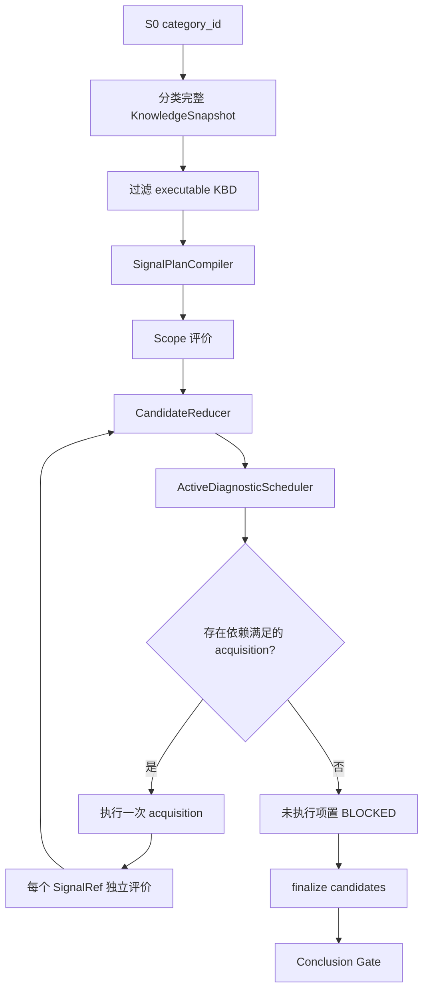
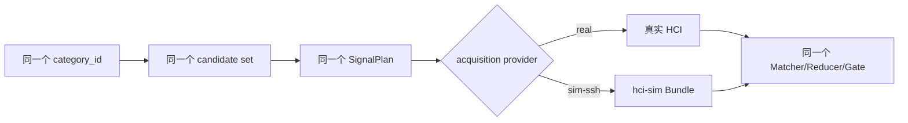

# 案例差异诊断协议（Case Differential Diagnosis, CDD）

## 1. 定义与边界

CDD 的英文全称为 **Case Differential Diagnosis**，中文为**案例差异诊断**。它在 S0 已确认故障分类后，通过确定性关键信号区分同分类 KBD，并且只有证据闭合时才允许进入 S4。

CDD 不是 RAG 相似度排序，也不是 LLM 自由推理。以下为协议不变量：

- 候选范围只来自 S0 `category_id` 对应的完整已发布快照；
- 不使用向量 `top_k`、BM25、FTS 或相似度阈值截断候选；
- 不因候选剩余一篇或两篇而早停；
- 不按采集器出现频次选择下一步；
- 调度只改变 acquisition 执行顺序，不能修改候选身份和证据规则；
- real/sim 使用相同候选、SignalPlan、Reducer 和 Conclusion Gate；
- `ERROR/UNKNOWN/BLOCKED` 不能作为反证。

## 2. 协议输入与输出

### 2.1 输入

| 输入 | 来源 | 约束 |
|---|---|---|
| `category_id` | S0 分类确认 | 候选范围唯一权威输入 |
| KnowledgeSnapshot | kb-service `playbooks` | 包含分类全部 published SOP/KBD |
| executable KBD | 发布契约校验 | 不合格项显式标记，不能被相似度静默删除 |
| environment context | 工单、预采集、TestRun | 只提供 scope、变量和执行路由 |
| execution mode | 会话上下文 | 只选择 acquisition provider |

TestRun 的 `support_id/kbd_revision/bundle_digest` 是仿真场景身份，不属于候选选择输入。

### 2.2 输出

每篇 KBD 最终归约为：

```text
SUPPORTED | REJECTED | INCONCLUSIVE | NOT_EXECUTABLE
```

总体结论为：

```text
DEFINITIVE | PARTIAL | INCONCLUSIVE | NO_MATCH
```

只有 `DEFINITIVE` 可以输出根因、解决方案并推进 S4。

## 3. 完整状态机



## 4. SignalPlan 编译

### 4.1 SignalRef 身份

```text
ref_id = kbd_id / resource_revision / signal_id
```

Verification Contract 决定 Signal 的 `MUST/SHOULD/EXCLUDE/CONTEXT` 角色。处置阶段 Signal 不进入诊断计划；工具契约、变量依赖或发布校验失败的 KBD 标记为 `NOT_EXECUTABLE`。

### 4.2 Acquisition 去重

普通 acquisition 的模板身份由以下字段生成：

```text
tool + execution args（排除 instruction）+ policy_version
```

特殊规则：

- `qfk_log` 的 Matcher 会下推到命令，因此 Matcher 参与身份；
- `qkv_*` 的 producer contract 参与身份；
- 普通 `qfk_system` 的不同 Matcher 可共享一次采集，但每个 SignalRef 仍独立评价。

一次 acquisition 是一次现场观察；SignalRef 是某篇 KBD 对该观察的证据解释。两者不能混为一个对象。

## 5. 执行顺序算法

调度器只考虑满足以下条件的 acquisition：

1. 尚未执行；
2. 至少关联一篇仍为 `CANDIDATE` 的 KBD；
3. `requires` 全部存在于环境变量或会话变量池。

评分公式：

```text
utility = 4 * discrimination
        + 2 * required_coverage
        + 3 * unlock
        + 1 * reuse
        - 0.25 * cost
        - 0.15 * latency
        - 1 * risk
```

字段含义：

| 字段 | 含义 |
|---|---|
| `discrimination` | 同一采集关联的 active SignalRef 数量乘以 Matcher 分组差异 |
| `required_coverage` | 可覆盖的 MUST SignalRef 数量 |
| `unlock` | 本次 produces 可以解锁的后续 acquisition 数量 |
| `reuse` | 一次采集被多条 SignalRef 复用的收益 |
| `cost/latency/risk` | KBD policy 中声明的执行代价 |

同分按 `risk -> cost -> latency -> template_key` 升序，保证输入顺序变化不会改变调度结果。

## 6. Signal 结果和候选归约

### 6.1 原子结果

| 结果 | 定义 |
|---|---|
| `SATISFIED` | 采集成功且 Matcher 条件成立 |
| `CONTRADICTED` | 采集成功且 Matcher 条件明确不成立 |
| `ERROR` | 工具、网络、Bridge、Runtime 或 fixture 执行失败 |
| `BLOCKED` | 变量、权限、安全策略或依赖阻断 |
| `UNKNOWN` | 有观察但无法确定真假 |
| `NOT_APPLICABLE` | scope 明确不适用 |
| `NOT_RUN` | 尚未执行 |

### 6.2 候选规则

```text
任一 MUST=CONTRADICTED 或任一 EXCLUDE=SATISFIED
    -> REJECTED

全部 MUST=SATISFIED
且 SHOULD 满足数 >= minimum_should
且全部 EXCLUDE=CONTRADICTED
    -> SUPPORTED

编译契约失败
    -> NOT_EXECUTABLE

其余终态
    -> INCONCLUSIVE
```

执行错误不等于事实不成立，因此 `ERROR/BLOCKED/UNKNOWN/NOT_RUN` 都不能将 KBD 置为 `REJECTED`。

## 7. Conclusion Gate

| 候选集合 | 结论 | S4 |
|---|---|---|
| 恰好一篇 `SUPPORTED`，其余全部 `REJECTED` | `DEFINITIVE` | 允许 |
| 存在 `SUPPORTED`，同时存在其他支持或未决项 | `PARTIAL` | 禁止 |
| 没有 `SUPPORTED`，仍有未决/不可执行项 | `INCONCLUSIVE` | 禁止 |
| 全部可执行候选均被反证 | `NO_MATCH` | 禁止 |

停止条件不是候选数量，而是“不再存在可执行 acquisition”。停止后必须把剩余 SignalRef 显式置为 `BLOCKED` 并完成归约，不能把未执行候选丢弃。

## 8. 真实与仿真等价



Bundle 必须模拟完整分类诊断可能执行的 observation。目标 KBD 只决定故障现场内容；非目标 KBD 必须通过自己的 Matcher 得到反证。`fixture_not_found` 继续返回 `ERROR`，用于暴露 Bundle 覆盖缺口。

## 9. 可观测性协议

关键事件至少包括：

```text
knowledge_snapshot
kbd_candidate_scope_resolved
kbd_diag_start
kbd_scheduler_decision
tool_call / tool_result
kbd_diag_running
kbd_diag_complete
```

每次请求使用统一 `trace_id`，采集与评价通过 `exec_id/acquisition_id/evaluation_id` 关联。`knowledge_snapshot.candidate_scope.mode` 必须为 `category_complete`；real/sim 只允许 `acquisition_provider` 不同。

## 10. 禁止恢复的历史实现

以下名称和行为属于已废弃实现，不能作为当前协议依据：

- `search_cases_with_steps(top_k=15)` 作为 CDD 准入；
- `_pick_best_step()` 按工具覆盖频率选步；
- `early_stop_threshold=2`；
- `__REGEX__/__CONTAINS__/LLM` 旧三段式自由判断；
- 单候选即 `is_definitive=true`；
- 仿真按 TestRun `support_id/revision` 只保留一篇 KBD。

## 11. 实现与验证入口

- 计划编译：`backend/shared/cdd/plan_compiler.py`
- 主动调度：`backend/shared/cdd/scheduler.py`
- 候选归约：`backend/shared/cdd/candidate_reducer.py`
- 结论门禁：`backend/shared/cdd/conclusion_gate.py`
- 在线执行：`backend/agent-service/app/adapters/agents/htp/kbd_differential.py`
- 候选加载：`backend/agent-service/app/adapters/agents/htp/investigation_agent.py`
- 算法详解：[KBD 主动诊断信号调度与证据闭环算法设计](../../knowledge-base/KBD主动诊断信号设计.md)
- 仿真原则：[仿真诊断等价性与 CDD 全候选修正方案](../events/2026-08-20-仿真诊断等价性与CDD全候选修正方案.md)
