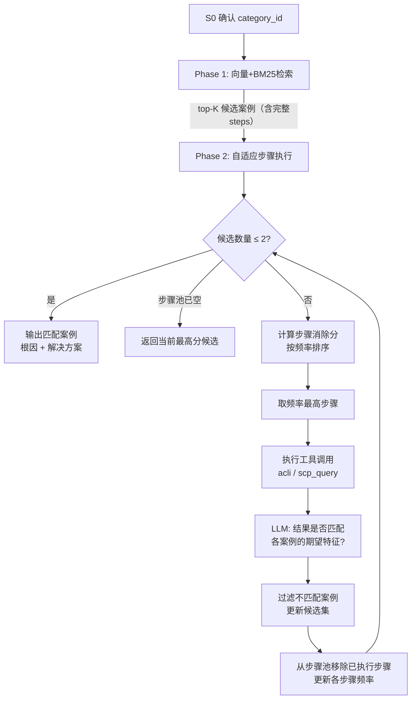

# 案例差异诊断协议（Case Differential Diagnosis, CDD）

**版本**: v1.0  
**日期**: 2026-05-23  
**适用范围**: `InvestigationAgent`（S1-S4 阶段）  
**关联文档**: [agent设计.md](./agent设计.md) · [agent基类设计.md](./agent基类设计.md)

---

## 一、问题本质重定义

### 这不是 RAG，也不是自由 ReAct

通用 Agent 框架的默认假设是"问题未知，解法开放"。但 HCI 故障排障的真实场景是：

> **问题是有限集合**（几十篇有模板规范的案例），**解法是已知的**（案例里的排查步骤），**挑战是在最小步数内，从候选集中找到与当前故障完全匹配的那 1-2 篇案例**。

案例的结构模板：

```
案例文档
├── 问题描述   （初步语义检索用，但模糊，相似度不高）
├── 排查步骤   ← 主要判断因子，步骤匹配度 = 故障符合该案例的概率
│   ├── 步骤1: 执行命令 + 期望结果特征
│   ├── 步骤2: 执行命令 + 期望结果特征
│   └── ...（平均 5 步，步骤间可能重叠）
├── 根因
└── 解决方案
```

关键洞察：
- **问题描述**往往模糊（"虚拟机开不了机"可能对应十几个案例）
- **排查步骤的观测结果**才是区分案例的唯一可靠证据
- 步骤是**可执行的**（acli 命令 / SCP API），结果可以实证验证

因此，这个问题的正确模型是：

> 给定 N 个候选案例，每个案例是一组"命令 + 期望观测结果"的约束条件集合。  
> 找出所有约束均被当前环境满足的 1-2 个案例，要求执行的总命令数最少。

---

## 二、第一性原理推导：为什么是贪心最大消除

### 问题的信息论本质

每次执行一条诊断步骤，等价于对候选案例集做一次"是/否"二分测试：
- **结果匹配期望** → 保留这条步骤所在的案例
- **结果不匹配** → 从候选集中消除这条步骤所在的案例

目标：用最少次测试，把候选集缩减到 1-2 个。

这是信息论中的**自适应决策树**问题（Adaptive Decision Tree），与"20个问题"游戏完全同构。

### 最优策略：信息增益最大化

设候选集大小为 N，步骤 S 出现在其中 m 个案例里：

- 执行 S 后，若结果**不匹配**：消除 m 个案例，剩余 N-m 个
- 执行 S 后，若结果**匹配**：消除 (N-m) 个案例，剩余 m 个
- 期望剩余候选数 = $\frac{m}{N} \cdot m + \frac{N-m}{N} \cdot (N-m) = \frac{m^2 + (N-m)^2}{N}$

该表达式在 $m = N/2$ 时取最小值。  
**结论：出现在约 50% 候选案例中的步骤，信息增益最大。**

### 贪心近似：选频率最高的步骤

精确最优解（完整自适应决策树）需要预计算所有分支，代价 O(2^N)，不可行。

采用**贪心最大消除策略**：

> 每次选择当前候选集中**出现频率最高**的步骤（即涉及最多候选案例的步骤）优先执行。

数学保证：贪心策略与最优解的步骤数之差不超过 $\ln(N)$（近似最优），而计算复杂度仅为 O(N·k)（N=候选数，k=每案例步骤数）。

**直觉验证**：一个在 8/10 候选案例中都出现的步骤，一旦结果不匹配，一次消除 8 个候选——比只出现在 1/10 案例中的独特步骤价值高得多。

### 预期步骤数

以贪心策略，从 N 个候选案例中定位目标案例：

| 初始候选数 N | 理论最小步数 $\lceil\log_2 N\rceil$ | 贪心实际步数（经验上界） |
|:-----------:|:-----------------------------------:|:------------------------:|
| 10 | 4 | 6-8 |
| 15 | 4 | 7-10 |
| 20 | 5 | 8-12 |
| 80 | 7 | 12-20 |

---

## 三、CDD 协议设计

### 整体流程



### Phase 1：候选集初始化

- **输入**：`category_id`（S0 已确认）+ 用户故障描述
- **方法**：KB Client 执行 BM25 + 向量检索（RRF 融合），取 top-K 候选
- **输出**：每个案例必须携带完整的 `steps[]` 字段（不只是 title/score）
- **关键约束**：同时设置**相似度下限阈值**，低于阈值的案例不进入候选集，防止不相关案例浪费步骤

### Phase 2：自适应步骤执行（CDD 核心）

```python
class CaseDifferentialDiagnostic:
    """
    案例差异诊断协议
    替代自由 ReAct 用于 InvestigationAgent 的 S1-S4 阶段
    """

    async def run(
        self,
        candidates: list[Case],      # Phase 1 返回的 top-K 案例
        env_context: dict,           # 当前环境：vm_name, node_ip, cluster_id 等
        session_id: str,
    ) -> AsyncGenerator[AgentEvent, None]:

        active_candidates = list(candidates)

        while len(active_candidates) > 2:
            # 1. 构建步骤频率图，选出消除分最高的步骤
            best_step = self._pick_best_step(active_candidates)
            if best_step is None:
                break   # 步骤池已空

            # 2. 通知前端（透明度）
            yield AgentStageUpdate(
                stage="investigating",
                metadata={
                    "step_description": best_step.description,
                    "candidates_remaining": len(active_candidates),
                }
            )

            # 3. 执行工具调用（acli / scp）
            result = await self._execute_step(best_step, env_context)

            # 4. LLM 判断：结果是否符合各候选案例的期望特征
            match_map = await self._judge_result(best_step, result, active_candidates)

            # 5. 过滤候选集
            active_candidates = [
                c for c in active_candidates
                if best_step.tool_name not in c.step_tool_names   # 不含此步骤的案例保留
                or match_map.get(c.id, False)                      # 含此步骤且匹配的案例保留
            ]

        # 最终输出诊断结果
        yield from await self._generate_diagnosis(active_candidates, env_context)
```

---

## 四、消除分计算的具体实现

> **Q：消除分最高的步骤是通过什么方法找出来的？如何实现？**

### 步骤规范化

案例的每条诊断步骤在存储时包含三个字段：

```python
@dataclass
class CaseStep:
    tool_name: str           # 工具名，如 "acli_vm_config"
    tool_args_template: dict # 参数模板（可含占位符，如 {"vm_id": "{{vm_name}}"}）
    expected_pattern: str    # 期望结果特征描述（自然语言 or 正则模式）
```

规范化键（用于频率统计）= `tool_name`。

**为什么只用 tool_name，不含 args？**

因为不同案例的同类步骤往往针对**相同的环境对象**（同一台 VM、同一个节点），只是在案例编写时用了各自的实例值。执行时，所有案例的该步骤都指向当前会话的 `env_context`（当前故障的 VM 名、节点 IP），结果是同一个——区分靠的是各案例的**期望特征**，而不是输入参数。

### 频率图构建与排序

```python
def _pick_best_step(self, candidates: list[Case]) -> CaseStep | None:
    """
    贪心选择消除分最高的步骤。
    消除分 = 该步骤出现在多少个当前候选案例中。
    """
    # 统计每个 tool_name 在候选案例中的出现频率
    frequency: dict[str, list[tuple[str, CaseStep]]] = defaultdict(list)
    for case in candidates:
        for step in case.steps:
            frequency[step.tool_name].append((case.id, step))

    if not frequency:
        return None

    # 选择频率最高的 tool_name
    # 频率相同时，优先选择 risk_level 更低的（先读后写）
    best_tool_name = max(
        frequency.keys(),
        key=lambda t: (
            len(frequency[t]),                          # 主排序：频率降序
            -TOOL_REGISTRY[t].risk_level,               # 次排序：风险等级升序
        )
    )

    # 取第一条（各案例对应的 expected_pattern 不同，执行时一并传入）
    _, representative_step = frequency[best_tool_name][0]
    representative_step.related_case_steps = frequency[best_tool_name]  # 携带所有案例的期望
    return representative_step
```

### LLM 判断结果匹配

每次工具调用后，通过一次**非流式、结构化输出**的 LLM 调用，判断结果是否符合各候选案例的期望：

```python
async def _judge_result(
    self,
    step: CaseStep,
    result: str,
    candidates: list[Case],
) -> dict[str, bool]:
    """
    返回 {case_id: 是否匹配} 的字典。
    使用 JSON Schema 强制 LLM 输出结构化结果，避免解析歧义。
    """
    # 构造判断 Prompt
    case_expectations = [
        {
            "case_id": c.id,
            "case_name": c.name,
            "expected": c.get_step_expectation(step.tool_name),  # 该案例对此步骤的期望描述
        }
        for c in candidates
        if step.tool_name in c.step_tool_names
    ]

    prompt = JUDGE_PROMPT_TEMPLATE.format(
        tool_name=step.tool_name,
        actual_result=result[:2000],   # 限制长度，防止超出 context
        case_expectations=json.dumps(case_expectations, ensure_ascii=False),
    )

    # 非流式调用，强制 JSON 输出
    response = await ai_client.invoke(
        messages=[{"role": "user", "content": prompt}],
        response_format={"type": "json_object"},
    )
    # 期望 LLM 返回: {"matches": {"case_001": true, "case_002": false, ...}}
    return json.loads(response.content).get("matches", {})
```

**优化：本地规则优先，LLM 兜底**

为减少 LLM 调用次数，先尝试本地模式匹配：

```python
def _try_local_match(self, expected_pattern: str, result: str) -> bool | None:
    """
    尝试用正则/关键词本地判断，避免每次都调用 LLM。
    返回 None 表示本地无法判断，需要 LLM。
    """
    # 案例存储的期望模式可以是带 __REGEX__: 前缀的正则表达式
    if expected_pattern.startswith("__REGEX__:"):
        pattern = expected_pattern[len("__REGEX__:"):]
        return bool(re.search(pattern, result, re.IGNORECASE))

    # 简单关键词包含检查
    if expected_pattern.startswith("__CONTAINS__:"):
        keyword = expected_pattern[len("__CONTAINS__:"):]
        return keyword.lower() in result.lower()

    # 其他情况交给 LLM
    return None
```

实践中，结构化 acli 命令的输出（如 `acli vm.list` 返回的 JSON）往往可以用正则判断，大幅减少 LLM 调用次数。

---

## 五、top-K 参数选择：为什么是 15

> **Q：为什么是 top-15，不是 top-20 或 top-80？出于什么考虑？**

### 三个维度的权衡

**维度 1：召回率（Recall）**

初始语义检索的召回率（真实匹配案例在前 K 个中的概率）：

| K | 估计召回率 | 遗漏真实案例的风险 |
|:--:|:----------:|:-----------------:|
| 5 | ~85% | 高 |
| 10 | ~92% | 中 |
| 15 | ~96% | 低 |
| 20 | ~97.5% | 很低 |
| 80 | ~99.5% | 极低 |

从 K=15 到 K=20 的边际召回率提升只有约 1.5%，但额外引入 5 个候选案例，增加步骤开销。

**维度 2：步骤数（效率）**

以贪心策略的经验步数：

| K | 平均步骤数 | 典型用户等待时间（每步 ~3s） |
|:--:|:---------:|:---------------------------:|
| 10 | 6-8 步 | 18-24s |
| 15 | 7-10 步 | 21-30s |
| 20 | 8-12 步 | 24-36s |
| 80 | 12-20 步 | 36-60s |

**维度 3：类别内案例总数**

S0 阶段已经确定了 `category_id`（如"虚拟机-003"），搜索空间只在**这一个类别**内。HCI 的大多数细分类别案例数量本身不超过 20-30 篇。因此：

- K=15 在实践中等价于"这个类别的大部分案例"
- K=80 在实践中等价于"全部案例 + 跨类别混入"，反而引入噪声

### 结论：K 不是硬编码常量

K=15 是默认值，实际实现中应该是：

```python
# 动态 top-K 策略
effective_k = min(
    K_DEFAULT,           # 默认上限，建议 15
    total_cases_in_category,  # 该类别的案例总数（不超过全量）
)

# 同时设置相似度下限：低于阈值的案例即使在 top-K 内也不纳入
candidates = [c for c in raw_results if c.similarity >= SIMILARITY_THRESHOLD]
# SIMILARITY_THRESHOLD 建议 0.40（BM25+向量 RRF 后的归一化分数）
```

这样：
- 如果某类别只有 8 个案例 → 取全部 8 个，不受 K=15 限制
- 如果检索结果中相似度最高的才 0.35 → 候选集为空 → 触发"机制推理"降级

### 可配置性建议

| 参数 | 默认值 | 可调范围 | 调整场景 |
|------|--------|---------|---------|
| `K_DEFAULT` | 15 | 10-30 | 类别案例数量很多时调大 |
| `SIMILARITY_THRESHOLD` | 0.40 | 0.30-0.60 | 问题描述质量低时调低 |
| `MAX_STEPS` | 12 | 8-20 | 延迟敏感场景调小 |

---

## 六、直连 LLM 的工具调用设计

### 背景：OpenClaw 已移除

`ai_client.chat_completion_stream()` 当前只处理 `delta.content`，不支持 `tools` 参数和 `delta.tool_calls` 解析。必须新增工具调用能力。

### 设计决策：两种模式分离

| 调用场景 | 模式 | 原因 |
|---------|------|------|
| 步骤选择 / 结果判断 / CDD 推理 | **非流式** (`stream=false`) | tool_calls 需要完整对象；流式下需拼接 delta 容易出 bug；用户看不到中间推理 |
| 最终诊断报告生成 | **流式** (`stream=true`) | 用户可见，流式体验更好 |

### 新方法签名

```python
# shared/clients/ai_client.py 新增
async def invoke(
    self,
    messages: list[dict],
    tools: list[dict] | None = None,
    user_id: str = "",
    model: str = "",
    response_format: dict | None = None,  # {"type": "json_object"} 强制 JSON 输出
) -> InvokeResult:
    """
    统一调用方法。
    - tools 非空 → 使用 stream=False，返回 (content, tool_calls)
    - tools 为空 → 使用 stream=True，返回流式 AsyncGenerator
    """

@dataclass
class InvokeResult:
    content: str | None = None                  # 文字终止时非空
    tool_calls: list[ToolCallRequest] = field(default_factory=list)  # 非空时继续循环
    stream: AsyncGenerator[str, None] | None = None  # 流式时使用

@dataclass
class ToolCallRequest:
    id: str          # call_xxxx，工具结果回传时用于关联（OpenAI 协议）
    name: str
    arguments: dict  # JSON parse 后的参数
```

### 工具结果回传格式

```python
# 工具执行后，加入 messages 继续对话
{
    "role": "tool",
    "tool_call_id": "call_xxxx",   # 对应 ToolCallRequest.id
    "content": "<工具执行结果字符串>",
}
```

---

## 七、acli 工具设计

### 现有设计：已正确

`tool_registry.py` 中的 acli 工具已采用**离散化、参数化**设计（`acli_vm_config`、`acli_vm_list`、`acli_platform_node_list` 等），这是正确的方向。

**不允许的设计**：`acli_run(command: str)` 接收任意字符串 → Shell 注入风险，不可接受。

### 需要补充的设计

**1. `tool_call_id` 回传支持**

当前 `ReactEngine._execute_tool_call()` 未在工具结果消息中写入 `tool_call_id`，需要补充：

```python
# 工具执行后，消息历史中加入
full_messages.append({
    "role": "tool",
    "tool_call_id": tool_call.id,   # ← 之前缺失
    "content": str(result),
})
```

**2. CDD 阶段：acli 参数从 env_context 注入**

CDD 中执行某个 acli 步骤时，`vm_id`、`node_ip` 等参数来自会话上下文（`env_context`），而不是 LLM 决定。执行器需要一个**参数解析器**：

```python
def resolve_args(template_args: dict, env_context: dict) -> dict:
    """
    将案例步骤中的占位符（如 "{{vm_name}}"）替换为当前会话的实际值。
    """
    return {
        k: env_context.get(v[2:-2], v) if str(v).startswith("{{") else v
        for k, v in template_args.items()
    }
```

**3. 只读 acli 命令的结果结构化**

常用 acli 命令的输出格式已知，建议在 `acli_client.py` 中预设解析器，将原始文本转为结构化 dict，便于本地规则匹配（减少 LLM 判断调用次数）。

---

## 八、与整体 Agent 架构的集成关系

```
InvestigationAgent.process()
├── Phase 1: kb_client.search_by_category(category_id, query, top_k=15)
│   └── 返回 list[Case]，每个 Case 含完整 steps[]
├── Phase 2: CaseDifferentialDiagnostic.run(candidates, env_context)
│   ├── _pick_best_step()       ← 贪心消除分计算
│   ├── _execute_step()         ← 调用 acli/scp 工具
│   ├── _try_local_match()      ← 本地规则优先
│   └── _judge_result()         ← LLM 结构化判断（兜底）
└── 最终: ai_client.invoke(stream=True) 生成诊断报告
```

### RemediationAgent 的差异

Remediation（S5）阶段仍使用 ReactEngine（工具调用 + 人工确认），**不使用 CDD**：
- S5 的任务是"执行修复"，而不是"匹配案例"
- 修复步骤来自已确认的匹配案例（CDD 阶段已找到），是确定性的
- 每一步写操作都需要用户确认 → ReactEngine 的 `require_all_confirm=True`

### LLM 调用次数预估

以 K=15、实际匹配需要 8 步为例：

| 步骤 | LLM 调用次数 | 模式 |
|------|------------|------|
| S0 意图识别 | 1 次 | 流式 |
| CDD 步骤执行（8 步，假设 50% 本地匹配） | 4 次 | 非流式 |
| 诊断报告生成 | 1 次 | 流式 |
| S5 Remediation（每步确认前推理） | 3-5 次 | 非流式 |
| **合计** | **9-11 次** | |

与自由 ReAct（每步 1 次 LLM，可能 15+ 步）相比，CDD 在确保准确性的同时将 LLM 调用次数控制在可预测范围内。

---

## 九、待确认事项

在开始编码之前，需要确认以下前置条件：

| 编号 | 问题 | 影响 |
|------|------|------|
| C1 | `kb_client` 返回的案例对象是否包含结构化的 `steps[]` 字段？每步是否有"命令"和"期望结果特征"？ | CDD 算法的可行性 |
| C2 | 案例的期望结果特征是纯自然语言，还是已有结构化模式（正则/关键词标注）？ | 本地匹配 vs LLM 判断的比例 |
| C3 | `env_context` 中确认包含哪些字段？（vm_name, node_ip, cluster_id, 用户报告的错误码等） | acli 参数注入 |
| C4 | LLM（GLM-5）是否支持 `response_format: {"type": "json_object"}`？ | 结构化判断的稳定性 |
