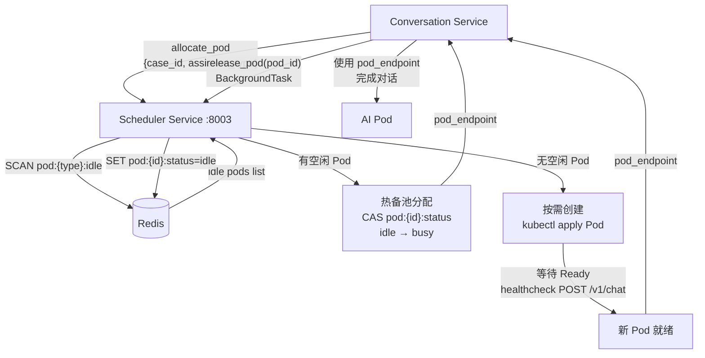
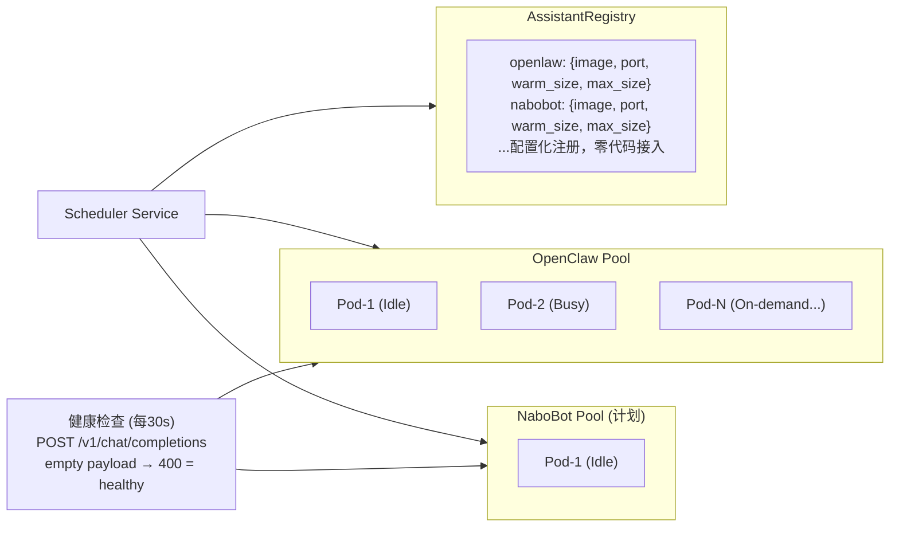
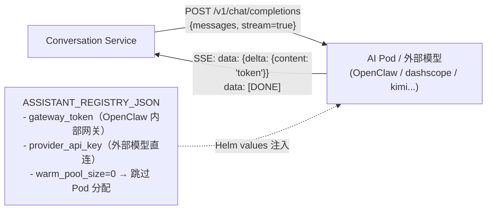

# HCI 智能排障平台 — AI 助手层设计（架构决策 WHY）

> **文档目的**：记录 AI 助手层的架构决策背景和选型理由，回答"为什么这样设计"。
> **最后更新**：2026-05-07
> **关联文档**：[08_HCI平台效果差距分析与重构方案.md](./08_HCI平台效果差距分析与重构方案.md) | [11_完整技术方案.md](./11_完整技术方案.md)

---

> **文档定位**：WHY — 记录 AI 层核心架构的选型讨论与设计决策，供新成员理解设计动机。
> **版本**：6.1 | **更新日期**：2026-05-07
> **关联文档**：[08 核心设计理念](./08_HCI平台效果差距分析与重构方案.md) | [11 实施规范与进度](./11_完整技术方案.md)

---

## 变更历史

| 版本 | 日期 | 变更内容 |
|------|------|----------|
| **6.3** | **2026-05-20** | **Docker CACHEBUST 修复补强（PR #307）**：PR #306 的 `ARG CACHEBUST` 定义不会真正破坏 Docker 缓存，补强为在 `COPY shared` 前添加 `RUN echo CACHEBUST` 命令 |
| **6.2** | **2026-05-20** | **Docker CACHEBUST 参数修复 shared 目录缓存问题（PR #306）**：scheduler-service Dockerfile 新增 `CACHEBUST` ARG，CI 构建时传入 `GITHUB_SHA`，强制每次构建都重新 COPY shared 目录 |
| **6.1** | **2026-05-07** | **助手选择器 Bug 修复 + ops-agent 注册**：修复 scheduler-service 可用性判断 key 不匹配（`idle_count` → `idle`）；ops-agent 注册到助手选择器（直连模式）；改进直连模式判断逻辑（增加 base_url 检查），详见 [事件文档](../events/2026-05-07-助手选择器Bug修复.md) |

---

## 一、背景与场景说明

本文档记录了 AI Assistant Layer 的核心架构设计讨论，包含场景定义、疑问提出和解答，作为后续实现的决策依据。

**场景：**

1. AI Assistant Layer 作为全能 AI 排障助手团队，需要共享所有知识和技能。
2. AI Assistant Layer 在同一天、甚至同一时刻会同时处理多个工单：每个工单的上下文信息需要独立，不能混乱。
3. 现阶段是一个 openclaw 容器，多个 session 响应多个不同的工单。

---

## 二、原始设计讨论（Q&A）

### 问题 1：AI 层跨实例知识共享

**结论：共享层必须在 AI 层之外。**

知识通过**外部存储**共享，AI 实例本身无状态。无论是一个 openclaw 还是 N 个 pod，都从同一个知识源拉取：

```
┌──────────────────────────────────────────────────────┐
│              AI Assistant Layer (无状态)              │
│  openclaw-pod-1  openclaw-pod-2  nabobot-pod-1       │
└──────────┬───────────────┬──────────────┬────────────┘
           │               │              │
           └───────────────┴──────────────┘
                           │
           ┌───────────────▼──────────────┐
           │       共享知识层              │
           │  PostgreSQL + pgvector (RAG) │  ← 7000案例 + SOP
           │  共享 Skill 文件 (PVC/NFS)   │  ← 技能包
           │  AGENTS.md (角色+准则)       │  ← 每次启动注入
           └──────────────────────────────┘
```

---

### 问题 2：7000 案例 → 知识还是技能？

**结论：案例 → 知识（RAG），SOP → 技能（Skill）**

| 内容类型 | 推荐方案 | 理由 |
|---|---|---|
| 7000 个故障案例 | **知识（RAG 检索）** | 案例是事实实例，数量大，不能全量注入，按相似度召回"最像当前故障的案例"，是经典 RAG 场景 |
| 10 篇 SOP 文档 | **技能（Skill 文件）** | SOP 是操作流程，内容结构化，数量少，适合作为 agent 工具加载 |
| 领域常识/命令手册 | **知识（RAG）** | 同案例 |

**概念澄清：**

- `AGENTS.md` 是**角色定义**（每次启动强制注入），不是动态知识
- **知识 ≠ 存在文件里**，知识 = 可被检索的语义内容（文件只是载体，pgvector 才是访问层）
- **技能 ≠ SkillsMP 的远程 skill**，技能 = 给 agent 的行为指令包（SKILL.md），可以是本地文件

---

### 问题 3：共享记忆 + 技能 & Session 隔离——3 种方案

#### 方案 A：RAG 中心化 + Agent 完全无状态

```
┌─────────────────────────────────────────────────────────────────┐
│  每次对话请求时动态组装 context：                                 │
│  messages = [                                                     │
│    system: AGENTS.md (角色+准则，所有 pod 相同)                  │  ← 共享
│    system: 匹配到的 SKILL.md (SOP 技能包)                        │  ← 共享
│    system: RAG 召回的 top-k 案例片段                             │  ← 共享
│    user/assistant: 本 case 的对话历史 (来自 PostgreSQL)          │  ← 隔离
│    user: 当前消息                                                 │
│  ]                                                               │
└─────────────────────────────────────────────────────────────────┘
```

- **优势**：架构最简洁，完美隔离，水平扩展无限制，session-memory 污染问题永远不存在
- **劣势**：没有"跨 case 经验积累"能力——AI 不会从已解决工单中自动学习
- **适合**：当前阶段，知识库由人工维护和更新

#### 方案 B：两层记忆（全局记忆 + Session 记忆严格分离）

```
┌──────────────────┐          ┌──────────────────────┐
│  全局记忆层       │          │  Session 记忆层       │
│  (所有 pod 共享) │          │  (每 case 独立)       │
│  • 已解决案例摘要 │          │  • 本次对话历史        │
│  • 积累的诊断经验 │          │  • 本次收集的环境信息  │
│  • 常见错误模式   │          │  • 本次执行的命令记录  │
│  写入：case 关闭  │          │  写入：对话过程实时     │
│  读取：每次对话  │          │  销毁：case 关闭后     │
└──────────────────┘          └──────────────────────┘
```

- **优势**：AI 会越来越"有经验"，解决过的问题下次更快定位
- **劣势**：全局记忆写入质量难以保证；随时间膨胀需治理；实现复杂度高
- **适合**：有大量重复性故障、希望 AI 自我迭代的中长期场景

#### 方案 C：MCP Server 统一知识和技能访问

```
┌─────────────────────────────────────────────────────┐
│  AI Agent (openclaw)                                │
│  Tools:                                             │
│  • search_knowledge(query) → MCP KB Server         │
│  • get_skill(name)         → MCP Skill Server      │
│  • get_case_history()      → MCP Context Server    │
│  • execute_command()       → MCP Tool Server       │
└─────────────────────────────────────────────────────┘
         │              │              │
         ▼              ▼              ▼
   [KB MCP Server] [Skill MCP]  [Context MCP]
   共享给所有 pod    共享技能包    session 隔离数据
```

- **优势**：agent 可以精准控制"何时查什么"；最符合 agentic 趋势；多类型 AI 都能接同一套 MCP
- **劣势**：openclaw 的 MCP 支持需要验证；需要额外维护 MCP server
- **适合**：长期架构目标，尤其是多种 AI 助手共存时统一接口

#### 三方案横向对比

| 维度 | 方案 A（RAG 无状态）| 方案 B（两层记忆）| 方案 C（MCP）|
|---|---|---|---|
| 实现复杂度 | ⭐ 低 | ⭐⭐⭐ 高 | ⭐⭐⭐⭐ 最高 |
| Session 隔离 | ✅ 完美 | ✅ 完美 | ✅ 完美 |
| 知识共享 | ✅ RAG 召回 | ✅ RAG + 经验积累 | ✅ 按需精准检索 |
| AI 自我进化 | ❌ 靠人工维护 | ✅ 自动积累 | ⚠️ 可实现但要设计 |
| 当前可落地 | ✅ 马上可做 | ⚠️ 需评估 GLM 质量 | ⚠️ 需验证 openclaw MCP |
| token 效率 | ⚠️ 固定注入 top-k | ⚠️ 同上 | ✅ 按需调用 |

---

### 问题 4：单 Pod 多 Session vs 一 Pod 一 Case

#### 两种模式本质差异

```
模式 A：单 Pod 多 Session（当前）
  内存共享、进程共享、session-memory 污染

模式 B：一 Pod 一 Case（架构设计目标）
  ┌────────────┐  ┌────────────┐  ┌────────────┐
  │ openclaw-1 │  │ openclaw-2 │  │ openclaw-3 │
  │ case-001   │  │ case-002   │  │ case-003   │
  │ 完全隔离   │  │ 完全隔离   │  │ 完全隔离   │
  └────────────┘  └────────────┘  └────────────┘
  知识共享靠外部 PVC + pgvector
```

#### 业界最佳实践参考

| 产品/场景 | 模式 | 原因 |
|---|---|---|
| GitHub Copilot Workspace | **一任务一实例** | 任务有生命周期，需要独立沙箱 |
| Devin/SWE-agent | **一任务一容器** | 执行环境完全隔离 |
| Customer Support Bot | **共享模型，独立会话** | 短会话，无执行环境 |
| **HCI 排障（本项目场景）** | **→ 一 Case 一 Pod** | 排障有执行动作，必须隔离 |

#### 本项目选择一 Pod 一 Case 的理由

1. **排障有执行动作**：AI 会建议执行命令，未来可能直连 HCI 环境，必须隔离
2. **Case 生命周期明确**：从 created 到 closed，可以精确控制 Pod 生命周期
3. **隔离是系统性需求**：session-memory、进程内共享状态，任何维度都可能污染，根治方案是物理隔离
4. **知识共享在外部**：采用方案 A/B/C 任一种，多 Pod 共享知识完全可行

---

## 三、综合设计决策

针对**当前阶段**（单 openclaw，7000 案例待建设）：

| 决策点 | 推荐 | 理由 |
|---|---|---|
| 知识共享方案 | **方案 A**（RAG 无状态） | 当前阶段最可落地，知识库建设比 memory 机制更优先 |
| 案例库处理 | **RAG 知识** | 7000 案例做向量化检索，按相似度召回 |
| SOP 文档 | **Skill 文件** | 10 篇，结构化，适合 agent 加载 |
| Pod 模式 | **一 Pod 一 Case**（逐步迁移） | 先禁用 session-memory（已做），再推进 Pod 池调度 |
| 近期行动 | **建 KB Service + 7000 案例摄入** | 这是 AI 质量最大提升点，比架构精雕细琢回报更高 |

**长期目标**：方案 C（MCP）+ 一 Pod 一 Case，这是 agentic 场景的行业方向。

---

## 四、架构演进路线图

```
当前（2026-03）                近期（Q2）                  长期
┌────────────────┐         ┌────────────────┐         ┌────────────────┐
│ 单 openclaw    │         │ 一 Pod 一 Case │         │ MCP Server     │
│ 多 session     │  ──→    │ + KB Service   │  ──→    │ + 多类型助手   │
│ session-memory │         │                │         │                │
│ 已禁用 ✅      │         │                │         │                │
└────────────────┘         └────────────────┘         └────────────────┘

知识层
┌────────────────┐         ┌────────────────┐         ┌────────────────┐
│ 无知识库        │         │ pgvector RAG   │         │ MCP KB Server  │
│ AI 靠基础训练  │  ──→    │ 7000 案例摄入  │  ──→    │ + Fine-tuning  │
│                │         │ 10 SOP → Skill │         │ + 混合检索     │
└────────────────┘         └────────────────┘         └────────────────┘
```

---

## 五、三阶段上下文管理全景

三个阶段对"进入 AI 层之前如何组装上下文"的处理方式**不同**，需分开说明。

### 概览表

| 维度 | Stage 1（外挂 RAG） | Stage 2（Agentic RAG）| Stage 3（混合架构）|
|------|--------------------|-----------------------|--------------------|
| **谁组装 messages[]** | conversation-service | conversation-service（简化）| conversation-service（最简）|
| **System Prompt 内容** | Tier1 身份 + Tier2 SOP + Tier3 KB chunks + Tier4 工单 | AGENTS.md 身份 + 工单上下文 | AGENTS.md 身份 + 工单上下文 |
| **SOP 知识来源** | HTTP 查 KB Service → 注入文本 | OpenClaw 自主工具调用 | Pod 本地 ConfigMap（零延迟）|
| **案例知识来源** | HTTP 查 KB Service → 注入文本 | OpenClaw 自主工具调用 | OpenClaw 自主工具调用 |
| **DB 历史消息** | 最近 20 条，全量传入 | 最近 20 条，全量传入 | 可适当缩短（session.memory 补充）|
| **session.memory** | 禁用（多 Session 共享 Pod，有污染风险）| 禁用（同上，或重新启用视 Pod 架构）| **启用，跨轮持久**（一 Pod 一 Case，天然隔离）|
| **LLM 对照组处理方式** | 与 OpenClaw 完全相同 | **分叉**：仍需外挂 RAG，无自主工具调用 | **分叉加剧**：LLM 无本地 skills，无自主多跳 |

### Stage 1 — conversation-service 是 RAG 编排者

```
每轮 POST /conversations/{id}/message 时：

conversation-service 并发：
    ├── POST /api/kb/sop/match(query)      → SOP节点文本
    └── POST /api/kb/search(query, top_k)  → KB chunks

组装 messages[] = [
  { role:"system", content: "[Tier1 HCI 排障助手角色]
                              [Tier2 SOP 精确命中内容]
                              [Tier3 KB语义检索chunks]
                              [Tier4 工单 ID 上下文]" },
  { role:"user",      content: "历史消息 1" },   ← 来自 DB（最近20条）
  { role:"assistant", content: "历史消息 2" },
  ...
  { role:"user",      content: "本轮用户问题" }, ← 刚 INSERT 的
]

→ POST /v1/chat/completions (stream=true)
  → OpenClaw 或 GLM API（两者路径完全一致）
```

**关键约束**：conversation-service 是"盲目的"——它不理解对话语义，每轮都固定检索一次，不会根据上下文判断"此轮需不需要检索"。

### Stage 2 — conversation-service 降级为消息路由器

```
每轮 POST /conversations/{id}/message 时：

conversation-service 只做：
  ① INSERT user message（独立 session）
  ② SELECT DB history（最近20条）
  ③ 组装简化 messages[]
  ④ 路由到 ProductionClaw Pod

messages[] = [
  { role:"system", content: "[AGENTS.md 排障规范]
                              [工单 ID + 当前 Case 上下文]" },
  { role:"user",      content: "历史消息 1" },   ← DB
  { role:"assistant", content: "历史消息 2" },
  ...
  { role:"user",      content: "本轮用户问题" },
]

→ POST /v1/chat/completions (stream=true)
  → ProductionClaw（Pi agent runtime）
      ↓ 进入 AI 层内部，自主 tool-calling
      自主 POST /api/kb/search(...)
      自主 POST /api/kb/sop/match(...)
```

**LLM 对照组在 Stage 2 分叉**：GLM 直接调用没有工具，只能继续用 Stage 1 的外挂方式，无法参与公平的 Stage 2 对比。

### Stage 3 — session.memory 成为工单级持久工作记忆

一 Pod 一 Case 架构下，session.memory 可以安全启用，并且**跨轮持续积累**：

```
Case 开始（Pod 启动）
    → BOOTSTRAP.md 执行，KB 预加载，初始化 session-memory 档案

第 1 轮对话：
  messages[] = [AGENTS.md] + [DB history 0条] + [本轮用户消息]
     → OpenClaw 推理
     → 自主查 KB（本地 SOP skills + 工具调用案例库）
     → 回复
  对话结束后，OpenClaw 更新 session.memory：
  "当前假设：VM 内存不足 [高置信度]；已排除：网络问题"

第 2 轮对话：
  messages[] = [AGENTS.md] + [DB history 2条] + [本轮用户消息]
     → OpenClaw 看到 DB 历史 + session.memory 里的推理摘要
     → 已有假设框架，无需重复检索基础 SOP
     → 回复

...（session.memory 随每轮对话持续丰富）...

Case 关闭（Pod 销毁）
    → session.memory 随 emptyDir 消失（But 精华已通过 LearningClaw 提炼进 KB）
```

**session.memory 与 DB messages[] 的互补关系**：

| 数据层 | 存储什么 | 谁写 | 谁读 | 生命周期 |
|--------|---------|------|------|---------|
| DB messages[] | 逐字对话记录（verbatim） | conversation-service | conversation-service 每轮 SELECT | 永久，随工单存档 |
| session.memory | AI 的推理笔记（假设、已排除方向、命令结果摘要） | OpenClaw 自主更新 | OpenClaw（context 的一部分）| 随 Pod 生命周期，Case 关闭后消失 |

Stage 3 可以适度**缩短 DB history 传入窗口**（如从 20 条缩至 10 条），因为 session.memory 已经把核心推理进展压缩记录。这有助于节省 token。

---

## 六、已完成的隔离措施

| 措施 | 状态 | 说明 |
|---|---|---|
| 禁用 `session-memory` hook | ✅ 已完成 | `openclaw.json` 中 `hooks.internal.entries.session-memory.enabled = false` |
| 修复旧 session 路径 | ✅ 已完成 | `sessions.json` 中 15 个 `sessionFile` 路径批量修正 |
| Session 上下文存 PostgreSQL | ✅ 架构设计 | 对话历史不依赖 Pod 内文件，Pod 重启不丢失上下文 |

---

## 七、openclaw 自主学习能力的利用

### 分析：直接使用 openclaw 自主学习的约束

| 约束 | 说明 |
|---|---|
| Web MCP 一次能处理的页面有限 | 7000 篇案例需要分批学习，不能一次完成 |
| session-memory 是平铺 Markdown | 适合经验摘要，不适合结构化索引（没有向量检索能力）|
| 学习质量取决于 AI 自身 | AI 提炼的质量不可审计，可能引入噪声或偏见 |

**结论**：openclaw 自主学习**不是 pgvector RAG 的替代品**，而是**互补的知识生产方式**。

### 两全其美方案：AI 驱动知识提炼 + 外部 RAG 存储

核心思想：**让 openclaw 做知识生产者，pgvector 做知识仓库，Production Pod 做知识消费者**——三者分离，互不污染。

```
                    ┌──────────────────────────────────────┐
                    │         离线知识生产（一次性 + 增量）   │
  7000 案例网页  ──→│  Learning Pod (openclaw)              │
  10 篇 SOP      ──→│  • Web MCP：浏览、理解案例            │
  新增案例        ──→│  • 整理成结构化摘要                   │──→  KB Service
                    │  • 通过 KB Ingestion MCP 写入 pgvector│      (pgvector)
                    └──────────────────────────────────────┘

                    ┌──────────────────────────────────────┐
                    │         在线排障（实时，并发）          │
  用户工单 case-001 │  Production Pod-1 (openclaw)          │
  用户工单 case-002 │  Production Pod-2 (openclaw)          │──→  KB Service
  用户工单 case-003 │  Production Pod-3 (openclaw)          │      (只读 RAG)
                    │  • 对话历史来自 PostgreSQL            │
                    │  • 知识来自 KB Search MCP             │
                    └──────────────────────────────────────┘
```

### 完整推荐路线

```
阶段 0（现在，已完成）
  ├─ session-memory 禁用 ✅
  └─ 工单 session 完全隔离 ✅

阶段 1（近期，Q2）
  ├─ KB Service + pgvector 上线
  ├─ Learning Pod：使用 web MCP 学习 7000 案例 → 写入 KB
  ├─ SOP 文档 → Skill 文件，启动时注入
  └─ Production Pod 通过 RAG 使用知识（方案 A 无状态）

阶段 2（中期，Q3）
  ├─ 一 Pod 一 Case 调度架构落地
  ├─ 重新启用 session-memory（此时已天然隔离）
  └─ Learning Pod 增量学习新案例 → 自动入库

阶段 3（长期）
  ├─ MCP Server 统一知识/技能接口
  ├─ Learning Pod → KB MCP → pgvector 全链路自动化
  └─ Production Pod 通过 MCP 精准按需调用知识
```

> **一句话总结**：openclaw 的自主学习能力非常有价值，应该利用——但让它把学到的东西写进我们的 pgvector 知识库（通过 MCP），而不是写进共享的 session-memory 文件。Learning Pod 负责生产知识，Production Pod 负责使用知识，职责分离才是两全其美。

## 八、AI 层实现选型：GLM 直接调用 vs OpenClaw（agent runtime）

> 本节记录两种实现路径的最终选型决策。两者详细对比分析见 [11_完整技术方案.md §附录-AI层选型](../architecture/11_完整技术方案.md)。

### 接入方式对比（简要）

| 模式 | 接入层 | 基础设施 | 适用场景 |
|------|--------|---------|---------|
| **直接调用 GLM API** | `OpenClawAssistant` 类（复用同一接口）| API Key，零 K8s 资源 | 快速启动、成本优先 |
| **通过 OpenClaw**（agent runtime）| 相同接口规范 `/v1/chat/completions` | Pod 部署 + 热备池 | 长期 Agentic 路径 |

> 两者在 `ai_client.py` 中使用完全相同的 `OpenClawAssistant` 类——因为 `/v1/chat/completions` 接口规范相同，可随时切换。

### 选型结论

| 使用场景 | 推荐 |
|---------|------|
| 快速启动、成本优先、确定性排障 | 直接调用智谱 GLM API |
| 阶段一 RAG 注入排障（当前阶段）| 两者等效，OpenClaw 略复杂但可积累 agent 能力 |
| 阶段二 Agentic RAG（KB 自主检索）| **必须选 OpenClaw**，GLM API 无法实现自主工具调用闭环 |
| A/B 评估对照 | 启用两者，通过 `assistant_type` 字段分组采集数据 |
| 长期生产路径 | OpenClaw（能力演进路径更完整）|

> **核心结论**：当前阶段（Stage 1）两者能力接近，OpenClaw 作为 agent runtime 的真正优势要到 Stage 2 才能发挥。建议保留 OpenClaw 作为主路径，接入智谱作为对照组，通过 `assistant_evaluation` 表采集数据做质量对比。

---

## 九、长期架构方向：MCP Server 统一工具接口

> 本节是对第二节方案 C 的远期展望，不涉及当前实施。

```
长期目标状态（Phase 4+）：

AI Agent (ProductionClaw/LearningClaw)
    │
    │ 工具调用（统一 MCP 协议）
    ▼
┌────────────────┐ ┌──────────────────┐ ┌──────────────────┐
│  KB MCP Server  │ │  SCP MCP Server  │ │  Context MCP     │
│  知识检索/入库   │ │  HCI 诊断工具     │ │  Case 上下文管理  │
└────────────────┘ └──────────────────┘ └──────────────────┘
```

**迁移条件（当满足以下条件时可启动 MCP 迁移）**：
1. Phase 3 ReAct 架构稳定运行（工具调用体系成熟）
2. 有第二类 AI 助手接入需求（需要统一接口）
3. 评估 openclaw 的原生 MCP 支持成熟度

在此之前，通过 `SCPAdapter` + `KnowledgeTools` 的 REST 方式满足工具调用需求。

---

*文档定位：WHY（架构决策背景） | 版本：4.0 | 最后更新：2026-03-25*
*实施细节见：[11_完整技术方案.md](../architecture/11_完整技术方案.md)*

---

## 数据流图（v6.4 补充）

### AI 助手 Pod 分配流程



### AI Pod 池管理架构



### AI Assistant Protocol v1 接口规范



> **两种接入模式**（v1.2+）：
> - **Pod 模式**（`warm_pool_size > 0`）：Scheduler 在 K8s 启动 AI Pod，Conversation Service 经 Scheduler 获取 endpoint；`gateway_token` 鉴权。
> - **直连模式**（`warm_pool_size=0 & max_pool_size=0`）：Scheduler 直接返回 `base_url`，Conversation Service 以 `provider_api_key` 直接调用外部 LLM API（OpenAI 兼容）；当前 dashscope 四模型均使用此模式。

*数据流图版本: 1.1 | 更新日期: 2026-04-17*


---

## 十、助手配置与选择器显示（v2.1）

> **设计原则**：单一真实来源 + 后端驱动 + 智能默认。
> 前端助手选择器显示由后端 API 响应决定，无需前端环境变量硬开关。

### 10.1 配置字段说明

| 字段 | 类型 | 必填 | 说明 |
|------|------|------|------|
| `type` | string | 是 | 助手类型标识，全局唯一（如 `openclaw`、`qwen3-max`） |
| `display_name` | string | 是 | 前端显示名称（如 `OpenClaw (GLM-4-Flash)`） |
| `description` | string | 否 | 助手功能描述，前端下拉选项中展示 |
| `capabilities` | string[] | 否 | 能力标签数组，前端以 Tag 形式展示（如 `["troubleshooting", "network"]`） |
| `is_default` | boolean | 否 | 是否为默认助手，前端默认选中 |
| `enabled` | boolean | 否 | 是否启用，默认 `true` |
| `warm_pool_size` | int | Pod 模式必填 | 热备池大小，Pod 模式下 Scheduler 维持的最小空闲 Pod 数 |
| `max_pool_size` | int | Pod 模式必填 | 最大池大小，Pod 模式下允许创建的最大 Pod 数 |
| `base_url` | string | 直连模式必填 | API 地址（如 `https://dashscope.aliyuncs.com/compatible-mode/v1`） |
| `provider_api_key` | string | 直连模式必填 | 外部模型 API Key，用于调用外部 LLM API |
| `gateway_token` | string | Pod 模式必填 | OpenClaw 内部网关鉴权 Token |

### 10.2 选择器显示逻辑

后端通过 `ASSISTANT_SHOW_SELECTOR` 配置控制前端助手选择器的显示：

| 配置值 | 行为 | 适用场景 |
|--------|------|----------|
| `auto` | **智能判断**：可用助手数量 > 1 时显示选择器 | 推荐，生产环境默认 |
| `true` | 强制显示选择器 | 开发/测试环境，需要强制展示 |
| `false` | 强制隐藏选择器 | 单助手生产环境，简化用户界面 |

**智能判断规则**：
- 直连模式（`warm_pool_size=0`）的助手**始终视为可用**
- Pod 模式的助手需要有空闲 Pod 才视为可用
- 只有**真正可用**的助手才计入可用数量

### 10.3 配置文件与配置方式

#### 配置文件位置

| 文件 | 说明 |
|------|------|
| `deploy/helm/hci-platform/values.yaml` | Helm 默认配置 |
| `deploy/helm/hci-platform/templates/configmap.yaml` | ConfigMap 模板，注入环境变量 |
| `values-prod.override.yaml`（环境仓库） | 生产环境覆盖配置 |

#### 配置方式

**方式一：Helm values 文件配置（推荐）**

```yaml
# values-prod.override.yaml
config:
  # 助手选择器显示模式
  assistantShowSelector: "auto"
  
  # 助手注册表（JSON 字符串）
  assistantRegistryJson: |
    {
      "productionclaw": {
        "display_name": "ProductionClaw (GLM)",
        "description": "专业排障助手，基于 GLM-4-Flash",
        "capabilities": ["troubleshooting", "hci-knowledge"],
        "is_default": true,
        "warm_pool_size": 2,
        "max_pool_size": 10,
        "enabled": true,
        "labels": {"claw-role": "production"}
      },
      "qwen3-max": {
        "display_name": "Qwen3-Max",
        "description": "深度推理模型，适合复杂故障诊断",
        "capabilities": ["deep-reasoning", "code-analysis"],
        "is_default": false,
        "base_url": "https://dashscope.aliyuncs.com/compatible-mode/v1",
        "provider_api_key": "${QWEN_API_KEY}",
        "warm_pool_size": 0,
        "max_pool_size": 0,
        "enabled": true
      }
    }

secrets:
  qwenApiKey: "sk-xxx"  # 外部模型 API Key
```

**方式二：环境变量覆盖（临时调试）**

```bash
kubectl set env deployment/scheduler-service -n hci-troubleshoot \
  ASSISTANT_SHOW_SELECTOR=true \
  ASSISTANT_REGISTRY_JSON='{"openclaw":{"display_name":"OpenClaw","capabilities":["troubleshooting"],"warm_pool_size":2,"max_pool_size":10,"enabled":true}}'
```

### 10.4 API 响应结构

前端通过 `GET /api/assistants` 获取助手列表和显示决策：

```json
{
  "assistants": [
    {
      "type": "productionclaw",
      "display_name": "ProductionClaw (GLM)",
      "description": "专业排障助手",
      "capabilities": ["troubleshooting", "hci-knowledge"],
      "available": true,
      "is_default": true,
      "pool_stats": {"idle_count": 2, "total_count": 2}
    },
    {
      "type": "qwen3-max",
      "display_name": "Qwen3-Max",
      "description": "深度推理模型",
      "capabilities": ["deep-reasoning", "code-analysis"],
      "available": true,
      "is_default": false,
      "pool_stats": {}
    }
  ],
  "show_selector": true,
  "default_assistant": "productionclaw",
  "selector_mode": "auto"
}
```

**字段说明**：
- `show_selector`：前端是否显示助手选择器
- `default_assistant`：默认选中的助手类型
- `selector_mode`：当前生效的显示模式（用于前端调试）

### 10.5 配置示例

#### 多助手场景（显示选择器）

```yaml
config:
  assistantShowSelector: "auto"  # 智能模式：多助手自动显示
  
  assistantRegistryJson: |
    {
      "productionclaw": {
        "display_name": "ProductionClaw (GLM)",
        "description": "快速响应排障助手",
        "capabilities": ["troubleshooting", "hci-knowledge"],
        "is_default": true,
        "warm_pool_size": 2,
        "max_pool_size": 10,
        "enabled": true
      },
      "qwen3-max": {
        "display_name": "Qwen3-Max",
        "description": "深度推理，适合复杂诊断",
        "capabilities": ["deep-reasoning", "code-analysis"],
        "is_default": false,
        "base_url": "https://dashscope.aliyuncs.com/compatible-mode/v1",
        "provider_api_key": "${QWEN_API_KEY}",
        "warm_pool_size": 0,
        "max_pool_size": 0,
        "enabled": true
      }
    }
```

**结果**：前端显示助手选择器，用户可选择 ProductionClaw 或 Qwen3-Max。

#### 单助手场景（自动隐藏选择器）

```yaml
config:
  assistantShowSelector: "auto"  # 智能模式：单助手自动隐藏
  
  assistantRegistryJson: |
    {
      "openclaw": {
        "display_name": "OpenClaw (GLM)",
        "description": "通用 AI 排障助手",
        "capabilities": ["troubleshooting"],
        "is_default": true,
        "warm_pool_size": 2,
        "max_pool_size": 10,
        "enabled": true
      }
    }
```

**结果**：前端**不显示**助手选择器，用户直接使用 OpenClaw。

#### 强制隐藏（单助手多助手通用）

```yaml
config:
  assistantShowSelector: "false"  # 强制隐藏
```

**结果**：无论有多少助手，前端都不显示选择器。

---

## 变更历史

| 版本 | 日期 | 说明 |
|------|------|------|
| v1.1 | 2026-04-16 | 注入 HTTPMetricsMiddleware；pod_pool.py acquire/release 后调用 _update_metrics() 上报 hci_pod_pool_idle/active，修复 WarmPoolExhausted 等告警（可观测性修复 #1 #2） |
| v1.2 | 2026-04-16 | 新增外部多模型直连模式（PR #158）：`warm_pool_size=0` + `max_pool_size=0` 时 Scheduler 跳过 K8s Pod 分配，直接将请求路由到 `base_url`（OpenAI 兼容端点）；`provider_api_key` 新构造参数优先于全局 `OPENCLAW_API_KEY` 环境变量；已接入 qwen3.5-plus / qwen3-max / glm-4.7 / kimi-k2.5（均通过 dashscope 统一 endpoint）。 |
| v1.3 | 2026-04-17 | `gateway_token` 与 `provider_api_key` 彻底解耦（PR #158 后续）：`gateway_token` 仅用于 OpenClaw 内部网关鉴权；外部模型通过 `provider_api_key` 字段注入，互不干扰；main.py 从 `ASSISTANT_REGISTRY_JSON` 读取 `provider_api_key` 并传入 `OpenClawAssistant` 构造函数。 |
| v2.1 | 2026-04-17 | 助手选择器智能显示重构：删除前端 `VITE_SHOW_ASSISTANT_SELECTOR` 环境变量硬开关；改为后端 API 响应驱动（`show_selector` 字段）；新增 `ASSISTANT_SHOW_SELECTOR` 配置项支持 `auto/true/false` 三档控制；新增 `capabilities` 能力标签字段；新增 `is_default` 默认助手字段；`/api/assistants` 返回结构化响应 `{assistants, show_selector, default_assistant, selector_mode}`；values.yaml 扩展配置字段说明。 |
| v3.0 | 2026-04-28 | **大脑可选重设计**：引入 Ports & Adapters 架构（BrainPort Protocol + BrainRouter），将 send_message_stream_only 拆分为”会话管理层”和”大脑执行层”。新增 HTPBrainAdapter（封装原有 S0-S6 逻辑）和 OpsAgentBrainAdapter（反腐层，调用 ops-agent HTTP API）；ops-agent 侧增加 session_id 支持（多轮上下文连续）、真流式输出和 hci_context 环境数据注入；跨仓库接口契约存于 docs/contracts/agent-http-api.yaml。详见 [重设计方案事件文档](events/2026-04-28-ops-agent大脑可选集成重设计方案.md)。 |
| v3.1 | 2026-05-19 | **pydantic-ai 助手注册**：新增 pydantic-ai 助手到 DEFAULT_ASSISTANT_REGISTRY（直连模式，base_url 指向 conversation-service:8002），支持 A/B/C 大脑并行测试；warm_pool_size=0/max_pool_size=0 标识直连模式，Scheduler 跳过 Pod 分配。|
| v3.2 | 2026-05-20 | **PYDANTIC_AI_ENABLED 环境变量注入 (PR #305)**：conversation-service deployment 新增 PYDANTIC_AI_ENABLED 环境变量，由 Helm values 中 `conversationService.pydanticAiEnabled` 控制（默认 false）。启用后 BrainRouter 优先使用 PydanticAIBrainAdapter（C 大脑），禁用时降级到 HTPBrainAdapter（原有 S0-S6 逻辑）。修复选择 pydantic-ai 助手时报错「大脑 [htp] 不可达」的问题。|
