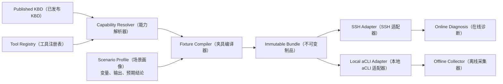

# Diagnosis Sample Lab（诊断样例实验室）设计与使用说明

## 1. 目标

Diagnosis Sample Lab 是五篇 `diagnosis-signal-matrix-v1` 样例 KBD 的长期测试环境。它同时服务于：

- 人工按需启动单个场景，验证 Customer UI、Agent、Terminal Bridge（终端桥）和 SSH 在线诊断；
- 在无网络 Linux x86_64 容器中执行真实 Go 离线采集器，生成 `.hci-eb` 证据包；
- 自动执行静态契约、PostgreSQL 生命周期、在线链路和离线链路回归；
- 保留每次运行绑定的 KBD Revision（KBD 修订）、Tool Revision（工具修订）、Bundle Digest（制品摘要）和执行审计。

实验室不会自动审核或发布 KBD。测试人员仍须在 Admin 控制台人工审核发布，保证测试覆盖真实治理流程。

## 2. 与现有启动门禁的关系

| 能力 | 职责 |
|---|---|
| `diagnosis-dev-keys` | 准备本地离线证据包 RSA-3072 加密密钥 |
| `diagnosis-sample-preflight` | 校验五篇 KBD、Signal、Agent、离线编译器和场景画像的静态契约 |
| `diagnosis-sample-postgres-preflight` | 在回滚事务中校验发布、KBD 同步、Collector/Profile/Mapping 生成和诊断判定 |
| Diagnosis Sample Lab | 提供可长期启停的真实命令执行层和手工测试环境 |

四者职责不同，不应互相替代。实验室是按需能力，不随普通 `make dev-up` 常驻启动。

## 3. 权威数据边界



命令只来自已发布 KBD、Shared Resolution Runtime（共享解析运行时）和 Tool Registry。场景画像文件只保存测试变量、合成输出和预期结论，不保存命令模板。KBD 或 Tool 修订变化后必须重新启动实例，旧制品不会被静默复用。

场景画像位于：

```text
hci_sim/testdata/sample-suites/diagnosis-signal-matrix-v1.json
```

## 4. 场景变体

| Variant（变体） | 行为 |
|---|---|
| `positive` | 命令成功，必要证据和建议证据满足 KBD |
| `negative` | 命令成功，但输出不命中 Matcher（匹配器） |
| `missing-evidence` | 必要信号没有输出，验证证据不足及原因展示 |
| `command-failed` | 命令返回非零退出码 |
| `timeout` | 注入确定性超时，不让测试真实等待 |
| `version-incompatible` | 模拟当前产品版本不支持命令 |

## 5. 人工测试

### 5.1 查看与预检

```bash
make diagnosis-lab-list
make diagnosis-lab-check
make diagnosis-lab-check SCENARIO=SAMPLE-SIG-VM
```

预检要求 KBD 已发布、存在 active 不可变快照、Tool 修订有效、Signal 可编译、样例集标识和场景画像完整。

### 5.2 按需启动

```bash
make diagnosis-lab-up SCENARIO=SAMPLE-SIG-VM

make diagnosis-lab-up \
  SCENARIO=SAMPLE-SIG-VM \
  INSTANCE=vm-negative-01 \
  VARIANT=negative \
  TTL=4h
```

不同 `INSTANCE` 可以并行存在。同一实例不会自动覆盖或停止；需要显式停止或复位。

运行目录：

```text
.hci-sim-run/lab/<instance>/
├── state.json
├── connection.json
├── fixture-manifest.json
├── scenario-card.md
├── audit.jsonl
├── logs/
├── offline-inbox/
└── offline-output/
```

### 5.3 在线诊断

1. 打开 `scenario-card.md`，按其中故障描述创建在线诊断工单。
2. 在 Customer UI 选择“仿真租约”。
3. 导入 `connection.json`。
4. 让 Agent 通过 Terminal Bridge 执行 KBD 命令。
5. 可执行自动 smoke：

```bash
make diagnosis-lab-online-smoke INSTANCE=sample-sig-vm
```

该 smoke 必须经过 Terminal Bridge WebSocket 和 SSH，不允许绕过在线执行链路。

### 5.4 离线诊断

1. 在 Admin 控制台执行“KBD 与 Tool Registry 同步”，发布 Collector、Collection Profile 和 Signal Mapping。
   本地自动化也可以显式执行 `make diagnosis-lab-sync MODE=incremental`；该命令会生成候选批次、检查阻断后再发布，并保留正常同步审计。
2. 在离线诊断页面创建工单、生成 Collection Plan 和 Collector Artifact。
3. 下载 Verification Bundle，并通过可信第二通道取得根公钥指纹。
4. 执行：

```bash
make diagnosis-lab-offline-run \
  INSTANCE=sample-sig-vm \
  BUNDLE=/absolute/path/collector-verification.zip \
  FINGERPRINT=<64位小写SHA-256指纹>
```

离线执行容器固定为 Linux x86_64，并启用：

- `network=none`；
- 非 root 用户；
- 只读根文件系统；
- 只读 Verification Bundle；
- Go 采集器直接执行本地 Go `acli` 适配器，不依赖 Bash、Python或联网安装依赖。

生成的 `.hci-eb` 位于 `offline-output/`，随后按正常客户流程上传。

离线命令从签名 Verification Bundle 的 `execution_items.argv` 生成精确路由，并优先使用签名正文中的 `source_signal_refs`（来源信号引用）绑定 KBD/Signal，因此能验证最终实际下发命令；不会假设它与在线命令字节级相同，也不会根据命令文本猜测业务归属。历史制品没有该字段时才使用受限的兼容性命令匹配，存在歧义会 fail closed（安全失败）。

### 5.5 生命周期

```bash
make diagnosis-lab-status
make diagnosis-lab-connection INSTANCE=sample-sig-vm
make diagnosis-lab-renew INSTANCE=sample-sig-vm TTL=4h
make diagnosis-lab-down INSTANCE=sample-sig-vm
make diagnosis-lab-reset INSTANCE=sample-sig-vm
```

- `down` 停止容器但保留运行目录和审计；
- `renew` 使用同一 KBD/Tool 再编译制品并重建实例，不能热替换租约签名密钥；
- `reset` 把旧运行目录移动到 `archive/`，不会直接删除测试证据。

## 6. 自动回归与 CI

```bash
make diagnosis-sample-preflight
make diagnosis-sample-postgres-preflight
make diagnosis-sample-e2e
```

CI 执行五场景画像对齐检查、hci-sim 全量 Go 测试、Go Vet 和 Linux amd64 构建。需要真实运行中平台、Terminal Bridge 和用户生成 Verification Bundle 的在线/离线 smoke 仍通过实验室命令显式执行，避免 CI 伪造签名制品或绕过人工发布流程。

`make diagnosis-sample-e2e` 的“E2E”范围是启动前静态门禁与事务回滚式数据库生命周期，不会伪装成人工发布后的运行层 E2E。运行层验收必须显式执行 `diagnosis-lab-up`、`diagnosis-lab-online-smoke` 和 `diagnosis-lab-offline-run`；后两项分别要求 Terminal Bridge 正在运行和真实 Verification Bundle 已由平台生成。

## 7. 可观测与审计

每个实例的 `audit.jsonl` 至少记录：

- `lab_run_id`；
- KBD revision/checksum；
- Tool contract revision；
- Bundle digest；
- variant；
- 在线 smoke 退出状态；
- 离线 Verification Bundle SHA-256；
- 证据包输出路径和采集退出状态。

本地 `acli` 执行还会记录 Signal ID、Fixture ID、命令指纹、stdout/stderr 大小和摘要，但不记录 Lease、私钥或原始敏感命令输出。
