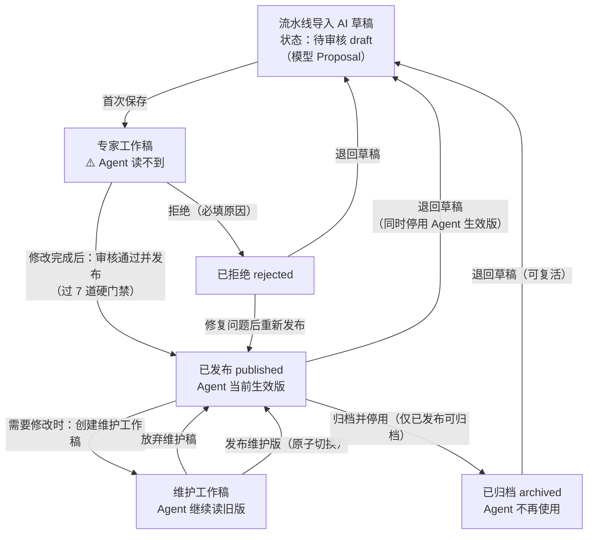
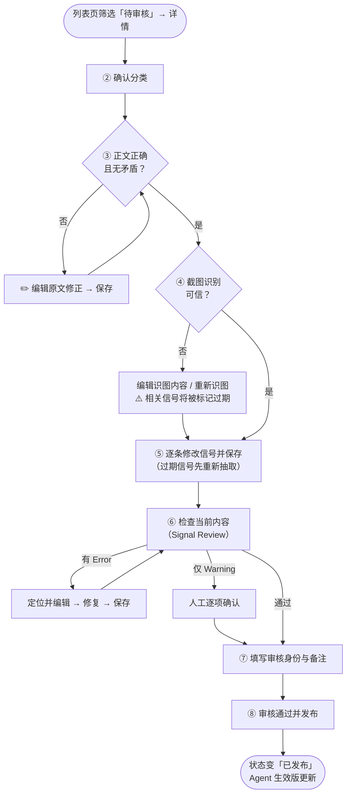
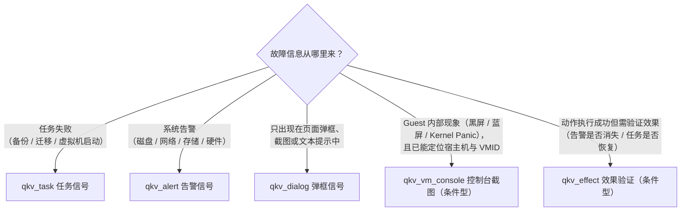
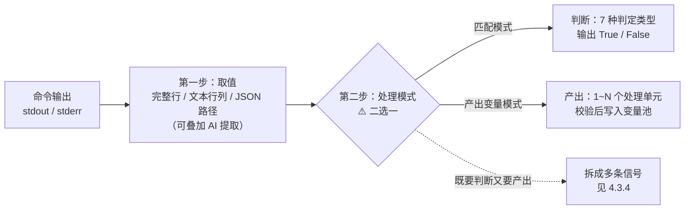
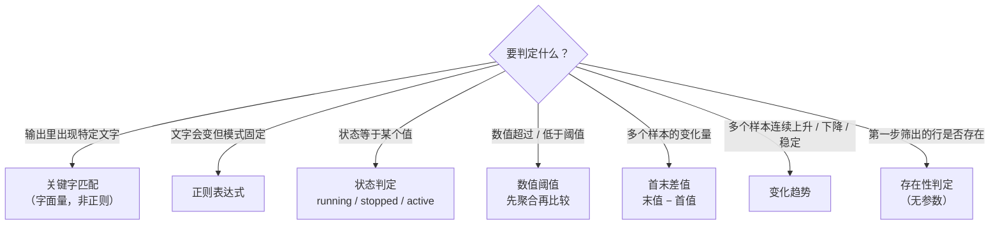

# KBD 审核发布操作指南

> 适用对象：KBD（知识库文档）审核人员、领域专家、平台管理员
> 适用范围：通过流水线导入、状态为「待审核」的 KBD，以及需要修改的已发布 KBD
> 目标：把流水线生成的 AI 草稿（模型提案）修改、审核并发布为供 Agent（智能诊断助手）生产使用的 KBD

**阅读方式：**

- 第一次操作：直接照 [第二章「快速操作」](#二快速操作一篇待审核-kbd-的完整路径) 一步步点；
- 某个区域不知道怎么改：查 [第三章「详情页九个区域」](#三详情页九个区域从上到下) 和 [第四章「信号编辑实操」](#四信号编辑实操)；
- 取值方式和判定类型不知道参数怎么填：查 [4.3 节](#43-结果处理取值与判断参数怎么填) 和附录 B 完整样例；
- 遇到报错或按钮点不动：查 [第六章「常见报错与阻断处理」](#六常见报错与阻断处理)；
- 需要判断标准（关键字怎么写、证据作用怎么选）：查 [附录 A](#附录-a信号字段判断口径)；
- 信号行为异常但没报错（不命中、取到错节点数据）：先对照 [A.7「容易配错的参数速查」](#a7-容易配错的参数速查) 逐项排查。

**全文贯穿样例：**

> **样例场景**：某客户虚拟机备份任务失败，任务详情弹框显示「连接存储失败」。根因是存储池容量使用率达到 94%，写入被拒绝。
> 全文用这个案例演示每一步的实际操作和参数填写，样例的最终完整配置见 **附录 B**。

---

## 一、先理解三件事

### 1.1 审核在审什么

KBD 审核不是校对文章，而是确认 Agent 能用这篇 KBD 完成一次完整排障：


一句话：**正文讲清楚故障，生产者信号找到入口，消费者信号采到证据，处理规则得出结论。**

对照样例：工单里备份任务失败（生产者信号从任务详情提取 `NODE_IP`、`TASK_ID`）→ Agent 登录该节点查存储池容量和备份日志（两条消费者信号）→ 容量 94% > 90% 且日志出现 `connection refused`（处理规则命中）→ 支持「存储池容量满」根因。

### 1.2 三个版本，别搞混

详情页「版本、生效与发布前检查」区域显示三个版本：

| 版本 | 含义 |
|---|---|
| 模型 Proposal | 流水线/AI 生成的草稿，是审核基线 |
| 专家工作稿 | 你每次点「保存」产生的版本。**保存 ≠ 发布，Agent 还读不到** |
| Agent 当前生效 | Agent 生产环境真正读取的版本。只有「发布」类按钮才会切换它 |

记住两条规则：

1. **「保存」永远只存工作稿**，不会让 Agent 用上你的修改；
2. **已发布的 KBD 不能直接改**，必须先点「创建维护工作稿」，改完点「发布维护版」才会生效（见第五章）。



对应关系说明：

- **工作稿可以反复编辑保存**：在「专家工作稿」或「维护工作稿」里，编辑 → 保存可以重复任意次，每次保存都停留在工作稿阶段（状态不变、Agent 读不到），直到你选择图上画出的出口——发布、拒绝或放弃；
- **保存 / 重新抽取 / 重新分类 / 重新识图**只改变内容（形成新的工作稿或 Proposal 基线），**不改变状态**，所以不出现在状态图里；
- 「退回草稿」对三种状态都可用（已发布 / 已拒绝 / 已归档），其中已发布退回时会追加停用修订，Agent 立即不再使用该 KBD；
- 「重新发布」允许从已拒绝或待审核状态发起，门禁与首次发布相同；
- 「归档」只能从已发布发起；归档后想重新启用，先「退回草稿」再走完整审核发布流程。

### 1.3 发布时会卡你的只有 7 道硬门禁

其他提示都是建议。真正会导致「审核通过并发布」失败的检查（详见第七章）：

1. 正文（content_md）非空；
2. 关键信号不为空；
3. 信号通过统一发布审查（无 error 级问题）；
4. 信号满足发布结构契约和专家确认要求；
5. 至少有 1 条消费者（QFK）信号；
6. 最终分类不为空；
7. 没有并发修改（版本锁一致）。

> 生产者信号的计数口径（含条件型生产者 `qkv_vm_console`、`qkv_effect` 的特殊门禁）见第七章「补充事实」。

---

## 二、快速操作：一篇待审核 KBD 的完整路径

按顺序执行，每一步都写清了「在哪里、点什么、做到什么程度」。样例场景在每步的实际做法用「▶ 样例」标出。

整体流程（注意两个回环：检查不通过要回到对应步骤修复后重新检查）：



### 第 1 步：进入待审核列表

1. 打开管理端「KBD知识条目管理」页面；
2. 状态筛选选择 **待审核**，点「搜索」；
3. 可按案例 ID、标题关键字、分类、置信度（低 <0.5 的优先处理）进一步筛选；
4. 优先处理：未分类或分类置信度低、没有消费者信号、信号数量异常、图片识别未完成的 KBD；
5. 在目标行点 **「详情」**。

> 不建议只看列表直接发布，至少检查正文、分类、两类信号和最终命令预览。

▶ 样例：标题搜索「备份失败」，找到「虚拟机备份失败：存储池容量超限」条目，点「详情」。

### 第 2 步：确认分类（基本信息区）

1. 看「AI 建议分类」和「AI 分类理由」；
2. 置信度低于 0.5 会有「需人工重新分类」标签，可点「重新分类」让 AI 重跑；
3. 在 **「确认分类（可修改）」** 下拉框里选定最终分类。

> ⚠️ 分类为空无法发布。最终分类同时是在线诊断和离线诊断共用的问题场景编码，必须人工确认准确，不能靠标题关键词猜测。

▶ 样例：AI 建议分类「虚拟机备份失败」，置信度 0.91，理由与正文一致 → 在「确认分类」下拉框选定「虚拟机备份失败」。

### 第 3 步：核对并修改正文（内容预览区）

1. 通读渲染后的正文：标题、问题描述、根因、解决方案是否一致、无矛盾；根因应是明确的技术原因，不是重复描述现象；正文中的命令、节点、服务、文件名称应真实存在；
2. 需要修改时点 **「✏️ 编辑原文」**，改完点 **「保存」**（出现「内容已保存」即成功）；
3. 自检标准：**如果把所有信号藏起来，这篇文章本身是否仍然是一篇正确、完整的排障案例？** 不是就先改正文。

▶ 样例：AI 草稿把根因写成「备份服务异常」（重复现象），改为「存储池容量使用率超过上限，写入被拒绝」；解决方案补充「清理过期快照或扩容存储池」，保存。

### 第 4 步：核对截图（内容预览区 + 图片列表区）

1. 每张截图卡片展开后核对三块内容：
   - **可见内容**：与原图逐项核对关键报错、对象名、数值；
   - **Observed Facts（观察事实）**：必须能在原图中找到对应内容，可作为信号证据；
   - **语义描述 / Inferences（模型推测）**：带「模型推断·待确认」标签的内容未经确认不能当作事实或运行参数。
2. 识别结果有误：点 **「编辑识图内容」** 人工修正，改完点 **「确认并保存修订」**；
3. 图片模糊或识别不全：点 **「重新识图」**（单张）。

> ⚠️ 重新识图或保存截图修订后，相关信号会被标记为**过期（Stale）**，必须重新抽取或人工复核信号（见第 5 步的红条提示）。

▶ 样例：任务详情弹框截图的可见内容应为「连接存储失败」和节点 IP `10.20.1.15`；截图里存储池容量 94% 记入 Observed Facts。

### 第 5 步：逐条修改关键信号（关键信号区）

这是审核工作量最大的部分，字段口径详见第四章。最短路径：

1. 如果关键信号区顶部出现**红色过期警告**（正文/截图/工具契约已变化），先点 **「重新抽取」**，再逐条复核；
2. 逐条检查「生产者信号（QKV）」和「消费者信号（QFK）」卡片，点 **「编辑」** 修改，每条改完点卡片上的 **「保存」**；
3. 出现黄色暂存提示条（「已暂存 N 条信号的修改」）时，确认全部保存或点「放弃全部暂存修改」；
4. 没有信号或信号质量太差：点 **「重新抽取」** 让 AI 重新生成，再人工复核；
5. 检查每条 QFK 卡片上的「完整命令」预览：点 **「编译当前草稿的 HCI 执行命令」**，确认命令只读、目标主机正确（见第四章 4.4）。

▶ 样例：本例最终配置 1 条生产者信号（qkv_task）+ 3 条消费者信号（容量阈值判定、日志错误检查、存储池 ID 提取），完整参数见附录 B。

### 第 6 步：运行发布前检查（版本、生效与发布前检查区）

1. 点 **「检查当前内容」**（即 Signal Review 信号审查）；
2. 结果为「发布前统一信号审查已通过」→ 进入第 7 步；
3. 结果为「有 N 项需要专家处理」→ 逐条看 issue：
   - **Error（错误）必须修复**，点 issue 旁的 **「定位并编辑」** 跳到对应信号修改；
   - **Warning（警告）需要人工确认**，不能直接忽略；
4. 修改后**先保存**，再重新点「检查当前内容」，直到通过。

> 注意：「检查当前内容」只是预检，发布时后端会**重跑**一次审查。预检通过后又改过内容，要重新检查。

### 第 7 步：填写审核身份和备注（审核备注区）

1. 点「填写/更换」输入你的**审核人 ID（正整数）**。首次发布时系统也会自动弹窗要求填写；不填无法发布；
2. 在审核备注里写清：改了什么正文/分类/信号、命令是否只读、遗留待办（如离线同步）。备注非必填，但强烈建议填写。

▶ 样例备注：

```text
已确认案例分类为虚拟机备份失败；修正根因描述为存储池容量超限；
qkv_task 关键字改为「虚拟机备份失败」并产出 NODE_IP、TASK_ID；
新增容量阈值判定（Use% > 90）与 vtpdaemon.log 错误检查（connection refused）；
命令预览均为只读；Signal Review 已通过。发布后需执行离线诊断 KBD 增量同步。
```

### 第 8 步：发布

1. 点详情页底部 **「审核通过并发布」**；
2. 确认框中核对离线采集影响提示，点 **「确认发布」**；
3. 出现「审核通过，KBD 条目已发布」即成功；
4. 发布后确认：状态变为「已发布」、「Agent 当前生效」版本号已更新、原 AI Proposal 和历史工作稿仍可追溯、已发布内容与工作稿一致；
5. 若用于离线诊断：记录 KBD 增量同步待办。

---

## 三、详情页九个区域（从上到下）

| # | 区域 | 作用 | 关键操作 |
|---|---|---|---|
| 1 | 已发布提示条 | 已发布 KBD 才显示，提示修改走维护工作稿 | — |
| 2 | 基本信息 | 标题、状态、AI 分类、最终分类 | 「确认分类」下拉、「重新分类」 |
| 3 | 版本、生效与发布前检查 | 三个版本对比 + 发布前审查入口 | 「检查当前内容」「创建维护工作稿」 |
| 4 | 来源元数据 | 案例来源、模块、版本、时间、工程师 | 只读，仅核对 |
| 5 | 关键信号（QKV/QFK） | 信号列表与编辑 | 「新增信号」「导入信号」「重新抽取」、每条信号的「编辑/保存/复制 JSON/删除」 |
| 6 | 内容预览 | 正文 Markdown + 截图卡片 | 「✏️ 编辑原文」、单张「重新识图」 |
| 7 | 图片列表 | 每张截图的完整识图结果 | 「编辑识图内容」「重新识图」「确认并保存修订」 |
| 8 | Offline Collection Impact | 离线采集依赖完整性 | 只读，记录缺失项 |
| 9 | 审核备注 | 审核身份 + 备注 | 「填写/更换」身份、备注文本框 |

### 3.1 来源元数据怎么核对

- 来源案例 ID、产品模块、版本应与正文一致；
- 原始更新时间明显早于适用产品版本时，确认内容是否已过期；
- 元数据只用于追溯，不能代替正文或信号证据；
- 元数据异常但正文仍可确认时，在审核备注中说明；无法确认来源真实性时拒绝发布。

### 3.2 Offline Collection Impact 怎么读

离线采集影响回答的是：这篇 KBD 要求的消费者证据，在没有 SSH 在线诊断时能否被离线采集器采集。关联链路为：

```text
KBD 消费者信号 → 信号映射 → 安全采集器 → 采集画像 → 采集计划 → 采集器制品
```

| 页面字段 | 看什么 |
|---|---|
| 采集需求 | 与消费者信号数量和意图核对 |
| 有效映射 | 应尽量覆盖全部采集需求 |
| 影响画像 | 发布后记录需要增量同步的画像 |
| 历史计划/制品 | 旧制品保持可追溯，新工单在同步后重新生成 |
| 缺失映射 | 记录 Signal ID、采集工具、命令/关键字，交给离线诊断管理员补齐 |
| 生命周期联动规则 | 按提示执行增量同步、停用或重新生成 |

| 页面结果 | 影响 | 你要做什么 |
|---|---|---|
| 离线采集依赖完整 | **不阻止发布** | 发布后执行离线诊断 KBD 增量同步 |
| 有缺失映射 | **仍不阻止发布** | 在备注记录缺失项，发布后补齐映射再同步 |
| 信息读取失败 | 不阻止发布 | 备注记录，恢复后重新检查 |

> 「离线就绪」和「KBD 可发布」是两个独立结论，不要把离线映射缺失当成 KBD 发布失败。
>
> `qkv_vm_console` 例外说明：它不走通用只读命令采集器，而是离线资源同步生成的
> 专用 `vm_console_capture` 采集项（受控交互风险级别、固定截图操作、近黑唤醒须
> 客户现场 TTY 确认）。缺失映射表中看到该信号时，同样记录后交给离线诊断管理员，
> 不要试图用普通 command 采集器手工仿制截图命令。
>
> `qkv_effect` 例外说明：效果验证在离线侧**不生成采集需求**（不产出
> command_template），而是编译为专用期望声明项（effect_expectation），离线验包后
> 对证据包内已存在的观测快照做追溯判定（有快照则回放判定，无快照则记
> inconclusive）。缺失映射表中看不到它属正常，不要试图用普通 command 采集器
> 为它补齐「命令」。

---

## 四、信号编辑实操

### 4.1 生产者信号（QKV）：回答「Agent 从工单里能拿到什么」

点「新增信号」可选择五种类型（3 种直接生产者 + 2 种条件型生产者），按故障信息的来源选择：



| 类型 | 什么时候选 |
|---|---|
| `qkv_task` 任务信号 | 故障来自任务失败（备份、迁移、虚拟机启动失败等） |
| `qkv_alert` 告警信号 | 故障来自系统告警（磁盘、网络、存储、硬件告警等） |
| `qkv_dialog` 弹框信号 | 故障信息只出现在页面弹框、截图或文本提示中 |
| `qkv_vm_console` 控制台截图 | Guest OS 内部现象（黑屏、蓝屏、Kernel Panic、启动卡住等）没有对应告警/任务/弹框；**条件型**：必须声明可信 `HOST`/`VM_ID` 来源（外部变量或上游生产者），否则发布门禁阻断 |
| `qkv_effect` 效果验证 | 修复动作/操作执行成功后，验证「预期效果」是否达成（告警清除、任务恢复、弹框消失、画面恢复等）；**条件型**：期望锚点变量必须有可信来源，且**不得作为 KBD 唯一生产者**。配置口径见 4.1.1 |

编辑表单字段与审核要点：

| 字段 | 审核要点 |
|---|---|
| 说明 | 人类可读标题，不是匹配条件 |
| 证据作用 | 必要证据 / 增强证据 / 排除证据 / 上下文证据，选择口径见附录 A.1 |
| 采集类型 | 与故障入口一致（上表）；类型与关键字明显不匹配时页面会出黄条警告 |
| 关键字 | 必须是现场数据中**真实存在、可检索**的文字，见附录 A.2（仅任务/告警/弹框三类；控制台截图、效果验证信号没有关键字字段——效果验证的期望锚点见 4.1.1） |
| 宿主机 / 虚拟机 ID | 仅 `qkv_vm_console`。只允许 `{{HOST}}`/`{{VM_ID}}` 占位符或 Inventory 规范化字面量；页面同时展示「目标变量来源」，出现"未声明来源"红标时发布必被阻断 |
| 目标变量来源 | 仅 `qkv_vm_console` 的审核面板：HOST/VM_ID 必须来自上游生产者产出或验证规则外部变量声明，二者皆无时不得发布 |
| 搜索目录 / 上下文行 | 仅弹框信号；用平台允许的固定目录，上下文行保持最小（0–10） |
| 仅失败任务开关 | 仅任务信号。**对应"任务失败"场景时必须显式开启**：该开关默认关闭，关着会拉回全部任务（含成功的），关键字一旦命中成功任务，产出的主机/对象就是错的，整条证据链在错误目标上执行 |
| 产出变量 | 变量名 + 字段路径；后续排障需要的信息（NODE_IP、VM_ID、TASK_ID 等）必须在这里产出，口径见附录 A.3 |

> 生产者产出变量的「路径」是任务/告警 JSON 里的**简单字段名**（如 `vm`、`host`），不是 JSONPath 表达式——写 `$.data.vm` 取不到值，变量为空会导致下游所有引用断链。

▶ 样例生产者信号（完整配置见附录 B.2）：采集类型选「任务信号 qkv_task」，关键字填任务列表里真实出现的「虚拟机备份失败」，产出变量 `NODE_IP`（节点 IP）和 `TASK_ID`（任务 ID），供后面三条消费者信号引用。

#### 4.1.1 效果验证信号（qkv_effect）：结构化期望表单怎么配与怎么审

效果验证把「执行成功但没达到预期效果」从不可见变成显式信号事实。它的编辑表单是**结构化期望**（观测通道 + 判定规则 + 时序窗口），**不提供命令、脚本、自由文本判定字段**——任何让 LLM 在运行时改写期望的配置都会被 422 拒绝。

| 表单区域 | 参数 | 审核要点 |
|---|---|---|
| 观测通道 | `expectation.observation.tool` | 封闭集合四选一：`qkv_alert` / `qkv_task` / `qkv_dialog` / `qkv_vm_console` 再查询；禁止自由命令；`args` 必须原样通过对应原语的参数校验（如 keyword 单字符串、host 占位符规则） |
| 判定规则 | `expectation.matcher` | 7 类封闭 matcher（keyword / regex / state / threshold / delta / trend / exists）+ `expected` 翻转；「告警应消失」用 `exists` + `expected=false`（负证据），不允许自由文本判定 |
| 时序窗口 | `settle_seconds` / `window_seconds` / `max_recheck` | settle 0–3600（默认按动作类型经验值）、window 60–86400（默认 900）、max_recheck 0–5（默认 2）。超出受限范围发布必被阻断——防止「永远复核下去」或「零等待立即判定」 |
| 用途 | `usage` | `remediation_verify`（修复后复核，默认）/ `symptom_confirm`（S1 症状确认）。`remediation_verify` 时 KBD 必须声明所复核动作的语义依据（solution 的 `success_criteria` 或 `provenance.evidence` 引用原文） |
| 主机 | `host` | 仅 `{{HOST}}` 占位符或规范化节点变量，与 `qkv_vm_console` 同口径 |
| 超时 | `timeout` | 1–60 秒，**仅约束单次观测**（与 `qkv_vm_console` 同为对公共 1–300 的有意偏离）；长周期语义由 settle/window 承载 |
| 产出变量 | 固定 `EFFECT_STATUS` / `EFFECT_CHECKED_AT` / `EFFECT_EVIDENCE` | 只允许这三个 `EFFECT_*` 变量；`EFFECT_STATUS` 为三态词表（achieved / not_achieved / inconclusive），**单独不构成根因结论**，须与其他证据组合 |

发布前必须人工确认的三件事（缺一即 422）：

1. **不是唯一生产者**：`qkv_effect` 是对动作效果的复核，KBD 必须另有至少一条直接生产者或条件型视觉生产者作为诊断观测入口——没有观测入口的 KBD 不存在诊断事实基础；
2. **期望锚点变量的来源可达**：期望里引用的全部目标变量（`HOST`、告警关键词等）必须由同一 KBD 的上游 `produces` 或「验证规则」外部变量声明取得，口径与 `qkv_vm_console` 的 HOST/VM_ID 门禁一致；
3. **`not_achieved` 下游处理已声明**：判定未达预期时必须有明确去向（回退重诊断或人工裁决），不允许「判定未达预期但静默忽略」的发布。

⚠️ **负证据是最大的坑**：「告警消失了」不能由「查询返回空」直接证明。`exists` + `expected=false` 类期望要求观测通道先自证有效——查询成功返回、关键词与观测域匹配、观测时间晚于动作完成时间；任一环节不满足只能出 `inconclusive`（观察不足），禁止向「已达成」坍缩。

> 策略开关提醒：`EFFECT_VERIFICATION_ENABLED` 默认**关闭**。发布成功 ≠ 执行层已开启——审核时留意该信号的 Tool Registry 启用状态与策略开关；开关未开启时运行时返回 `EFFECT_POLICY_DISABLED`（BLOCKED），不产生判定。

### 4.2 消费者信号（QFK）：回答「去哪执行什么只读检查」

点「新增信号」可选八种类型：`qfk_log`（日志）/ `qfk_system`（系统）/ `qfk_service`（服务）/ `qfk_vm`（虚拟机）/ `qfk_network`（网络）/ `qfk_storage`（存储）/ `qfk_hardware`（硬件）/ `qfk_platform`（平台）。

按三层审核：

**第一层：在哪里执行**

| 字段 | 审核要点 |
|---|---|
| 主机 | 明确值或 `{{变量}}`（变量必须由生产者信号产出） |
| 容器 | 与命令实际运行环境一致 |
| 集群执行 | 确实需要查多个节点才开启；禁止无明确目标时默认全节点执行 |
| 服务 / 动作 | 仅服务检查；动作**只允许 status**，禁止把启动、停止、重启作为诊断信号 |

**第二层：执行什么**

| 字段 | 审核要点 |
|---|---|
| 执行命令 | 必须是查询/查看/读取类；禁止 `start`/`stop`/`restart`/`delete`/`set`/`rm` 等修改动作；含管道时先点「安全转换管道」 |
| 输出格式 | 仅系统检查：json/keyvalue/csv/xml，与命令实际输出一致 |
| 时间 / 文件 / 上下文行 | 仅日志检查；时间窗口收窄到故障前后（推荐 `{{END}}` 相对时间），文件只填文件名 |
| Request ID | 仅日志检查，来自当前工单或当前执行上下文 |
| 输入变量 | 由命令中 `{{变量}}` 自动推导（只读展示），每个变量都必须有来源 |
| 超时时间 | 1–300 秒，必须有上限 |

▶ 样例三条消费者信号：容量检查（`qfk_system`，主机 `{{NODE_IP}}`，命令 `df -h /storage`）、日志检查（`qfk_log`，主机 `{{NODE_IP}}`，文件 `vtpdaemon.log`）、存储池 ID 提取（`qfk_system`，JSON 输出）。安全红线完整版见附录 A.4。

**第三层：结果怎么处理**（见 4.3）

### 4.3 结果处理：取值与判断参数怎么填

每条消费者信号在「执行结果处理」中只能选一种模式，处理流程都是两步：



> 命令执行失败或超时时立即停止：不取值、不判断，也不写入变量池。

#### 4.3.1 第一步取值：三种取值方式

##### ① 完整行

结果保留**完整一行**，不截取列。适合「先找到出错的行，整行交给判断」的场景。

| 参数 | 怎么填 |
|---|---|
| 行选择 | 三选一：**全部行** / **按关键字** / **按行号**（见下方通用说明） |
| 列选择 | 无（固定整行）。关键字只负责筛选候选记录 |
| 结果数量 | 必须唯一 / 第一行 / 最后一行 / 全部行 |
| 输出来源 | stdout / stderr |

##### ② 文本行列

行选择负责选行，列选择负责从行里截列。适合表格类输出（`df -h`、`ps`、列表命令）。

| 参数 | 怎么填 |
|---|---|
| 行选择 | 同「完整行」的三种方式 |
| 列选择 | 两选一：**整行** / **一列或多列** |
| 表格解析 | 选一列或多列后出现：**空白分列**（按空白切）或 **单字符分隔**（再填 1 个分隔字符，如 `:`） |
| 识别表头 | 开关。开启后填**表头特征**：每行一个必含列名（如 `Filesystem`、`Use%`），用于定位表头行；可再选表头是否区分大小写 |
| 列卡片 | 每列一行：`key`（自动转大写，如 `USE_PERCENT`）+ 选择方式（**按列号**：从 1 开始的整数 / **按表头列名**：列名 + 可选别名逗号分隔）+ 取值类型（文本 / 整数 / 数字（35%→35）/ 布尔值）。可「+ 添加列」 |
| 主值列 | 从列 key 中选一个。Matcher 判定和标量变量**必须**指定主值列 |
| 结果数量 | 必须唯一 / 第一行 / 最后一行 / 全部行 |
| 输出来源 | stdout / stderr |

> 口诀：关键字/行号负责选行，表头/列号负责选列；行列提取完成后才进入判断或变量写入。所有行号、列号均从 1 开始。

##### ③ JSON 路径

命令输出是 JSON 时使用（如 `acli ... --format json`）。

| 参数 | 怎么填 |
|---|---|
| JSON 路径 | 只支持受控点号和数组下标，如 `data[0].status`；空表示根节点。**不支持** jq、函数、过滤器、通配符 |
| 取值类型 | 文本 / 整数 / 数字 / 布尔值 / 数组 / 对象 / 对象数组 |
| 结果数量 | 必须唯一 / 第一项 / 最后一项 / 全部项 |
| 输出来源 | stdout / stderr |

两个所有取值方式通用的易错点：

- **「结果数量」不选时默认是「必须唯一」**——这是断言不是"取第一个"：命中 0 条或 ≥2 条都会直接报 `QFK_CARDINALITY_MISMATCH`，信号失败。现场输出天然多行（多条错误日志、多张网卡）时，想要"取第一条"必须显式选「第一行」；
- **「输出来源」默认 stdout**：有些命令的错误信息只出现在 stderr，来源选错就永远筛不到行。判断依据：先在命令预览里人工跑一次命令，确认目标内容实际出现在哪个流。命令执行失败（非零退出码）时不会进入取值，stderr 也不会冒充"未命中"。

##### 行选择的三种方式（完整行、文本行列通用）

| 方式 | 参数 | 说明 |
|---|---|---|
| 全部行 | 无 | 不过滤 |
| 按关键字 | 包含关键字（每行一个）、排除关键字（每行一个）、包含关系（全部满足 AND / 任一满足 OR）、排除关系（任一出现即排除 OR / 全部同时出现才排除 AND）、区分大小写开关 | 同一行先满足包含条件，再确认没有触发排除条件；每行一个字面量或 `{{变量}}` 引用，中英文逗号属于关键字内容 |
| 按行号 | 行号基准（数据行【不含表头】/ 非空行 / 物理行【含空行和表头】）、行号列表（如 `1, 3, 8`，从 1 开始）、行号范围（每行一个，如 `5-7`） | 「完整行」模式下不提供按行号 |

行选择关键字的三个隐藏规则（配错都是静默不命中，务必注意）：

1. **支持 `{{变量}}` 引用**：运行前用变量池的值替换，如 `{{VM}}` 会替换成生产者产出的虚拟机 ID（KBD 27123 的 lsof 占用检查就是这个用法）。前提：该变量必须在信号的输入变量里声明且上游真实产出——**未产出的占位符会按字面文本 `{{VM}}` 去筛行**，一行都筛不出来且不报错；
2. **大小写默认敏感**：行选择默认区分大小写，而第二步的关键字判定默认**不**区分大小写——两套标准相反。include 写 `Error` 而现场是 `error` 时，行在第一步就被过滤，根本到不了判定。口径：按现场原文大小写写，或显式关闭区分大小写；
3. **集群执行时是跨节点筛选**：`cluster=true` 时所有节点的输出汇入同一个流，include 会命中所有节点的行。此时结果数量选「必须唯一」或「第一行」只会看到第一个节点的数据；要判断"任一节点异常"应选「全部行」+ 关键字判定，或对数值取「最大值」聚合。

##### AI 提取（可选，完整行/文本行列/JSON 路径均可叠加）

在「AI 提取」输入框填指令（≤1000 字，如「提取其中的第一个 IP 地址」）。规则：

- 平台**先按当前取值配置从完整输出确定候选行**，再让 AI 从候选原文中提取值；
- AI 返回值和引用行必须可**逐字回查**，否则本次信号失败；
- 数值判断（阈值/差值/趋势）场景：AI 需按日志出现顺序返回数值数组，第二步仍只做确定性比较；
- 文本判断/产出场景：AI 仅提供已溯源的取值证据，命中结论仍由确定性规则决定。

#### 4.3.2 第二步判断（匹配模式）：七种判定类型的参数

先按「要判定什么」选类型：



各类型的参数填法：

| 判定类型 | 需要填的参数 | 适用场景 | 样例填法 |
|---|---|---|---|
| 关键字匹配 | **关键字**（多行文本框，每行一个字面量）+ **组合关系**（任一匹配 OR / 全部匹配 AND） | 输出中是否出现特定错误文字 | 关键字两行：`connection refused`、`connect storage failed`；组合关系：任一匹配 |
| 正则表达式 | **正则表达式**（单行） | 内容会变化但有固定模式的错误 | `error\|failed\|timeout`。日志采集会下推到 aCLI -E，必须写 Python re 与扩展正则都兼容的表达式 |
| 状态判定 | **期望状态**（单行，如 `running`、`stopped`、`active`） | 服务/进程/链路状态是否等于某值 | 期望状态：`running` |
| 数值阈值 | **聚合方式** + **运算符** + **阈值** | 数值超限判断（容量、次数、耗时） | 聚合：首个取值；运算符：大于；阈值：90 |
| 首末差值 | **运算符** + **差值阈值** + **最少样本**（≥2） | 周期日志计数器末值减首值的变化量 | 运算符：大于；差值阈值：100；最少样本：2 |
| 变化趋势 | **趋势方向**（连续上升/连续下降/保持稳定）+ **最小步长**（≥0）+ **最少样本**（≥3） | 周期日志数值连续变化 | 方向：连续上升；最小步长：1；最少样本：3 |
| 存在性判定 | 无参数 | 第一步筛选结果是否存在（有行就命中） | 配合行选择按关键字过滤使用 |

聚合方式共 7 种：**首个取值**（first_number）/ **最后数值**（最后一个样本）/ **最大值**（所有样本）/ **最小值** / **求和** / **非空行数**（统计行数）/ **命令耗时秒**（解析 `real`）。

**期望开关（expected）：证据的极性开关**

期望开关不改变"采什么"，只决定**采到的结果算哪一边**——这条信号是正向证据（命中=支持根因）还是反向证据（不命中=支持根因）：

| 配置 | 语义 | 典型步骤原文 |
|---|---|---|
| 期望=命中（开启） | 出现目标内容 = 支持根因 | "查看日志是否存在 connection refused 报错" |
| 期望=不命中（关闭，页面出黄色警告条） | **没出现**目标内容才算符合预期 | "确认备份服务运行正常，无异常日志" |

极性必须和证据作用一起理解，Agent 的结论规则是：

- Must 信号**与期望相反**（CONTRADICTED）→ 整个 KBD 候选被拒绝（根因被推翻）；
- Exclude 信号**符合期望**（SATISFIED）→ 整个 KBD 候选被拒绝（排除条件成立）；
- 候选被支持的条件：所有 Must 符合期望 + 所有 Exclude 与期望相反 + Should 达到最低门槛。

审核口径：

1. 对照步骤原文逐条核极性："排查是否有报错/异常" → 期望命中；"确认正常/无报错" → 期望不命中。**设反比漏配更危险**：把"确认正常"配成期望命中，会让健康现场反而支持根因；
2. 信号 JSON / 导入场景中 keyword 还有 `mode=not`（所有关键字均不出现才为真），它**忽略 expected**——遇到 not 模式不要再纠结期望开关；
3. 命令失败、取不到值时结果是 UNKNOWN，不受期望开关影响——不能被解释成支持或排除任何一边。

#### 4.3.3 产出变量模式的参数

选择「产出变量」后，每个「处理单元」= 第一步取值 + 一个变量：

| 参数 | 怎么填 |
|---|---|
| 变量名 | 必填，全大写，如 `KVM_PID`、`STORAGE_POOL_ID` |
| 变量类型 | 字符串 / 整数 / 数字 / 布尔值 / 数组 / 对象 / 对象数组，必须与取值结果一致 |
| 变量值 | 使用第一步取值结果（主值列或 JSON 路径取出的值） |

点「添加变量」会创建一个新的「取值 → 产出」处理单元。审核要求：变量名稳定易懂、类型与实际结果一致、单值/多值的结果数量配对、多个变量不要错误共享同一取值结果、后续没人用的变量删掉。

> ⚠️ **产出信号是证据链的中间节点，不是判定终点。** 产出模式的信号只要"命令成功且变量提取入池"就算符合期望——它不对提取出的值做任何判断。如果一篇 KBD 的消费者信号**全部**是产出模式，等于"采集了数据但不对数据表态"：健康主机和故障主机上变量都能正常提取，两者得到相同的诊断结论，且没有任何证据能推翻错误根因。证据链的最后一跳必须是匹配模式的信号（见 4.6 检查清单）。

#### 4.3.4 既要判断又要提取 → 拆成多条信号

同一条消费者信号不能同时配置匹配模式和产出变量模式。需要多种处理结果时拆成多条信号，且拆分后的信号必须保持一致的主机、容器、命令、时间范围和超时：

```text
消费者信号 A：qfk_hardware 查询磁盘状态 → 匹配模式：是否包含 Predictive Failure
消费者信号 B：qfk_hardware 相同查询参数 → 产出变量：DISK_SERIAL
```

▶ 样例就是这样拆的：容量判定（信号 C1，匹配模式）和存储池 ID 提取（信号 C3，产出变量）是两条独立信号，完整参数见附录 B。

### 4.4 命令预览与工具能力

- 每条 QFK 卡片可点 **「编译当前草稿的 HCI 执行命令」** 生成完整命令预览，包含 SSH 目标主机和执行前替换变量；
- 预览只是编译，不执行命令；未就绪的变量保留 `{{变量名}}` 形式；
- **预览失败时不能凭正文示例命令猜测发布**，先修复工具参数或信号配置后点「重新编译」；
- 信号卡片头部出现红色 **「能力未声明，请更换采集类型」** 标签时，说明该采集工具未在工具注册表声明或启用，先更换采集类型或联系工具管理员；
- 复制的命令只能在已授权的 HCI 终端中人工核查，不要直接在生产执行。
- `qkv_vm_console` **没有命令预览**：它是代码固定操作（screendump/受控唤醒），卡片只展示目标参数与变量来源；出现「能力未声明」标签时同样先联系工具管理员，不要尝试手工构造 Monitor 命令。
- `qkv_effect` **没有命令预览**：与 vm_console 同理，它只编译不可变 Verification Intent（验证意图），绝不产出命令字符串；卡片只展示期望锚点的结构化视图（通道 / matcher / 窗口）。出现「能力未声明」标签时联系工具管理员。

### 4.5 导入与复制信号 JSON

「新增信号」旁的 **「导入信号」** 支持粘贴 JSON 或上传 `.json` 文件，用于跨 KBD 复用成熟信号模式（如「集群 ping + 丢包阈值判定」）。接受三种形态：单条信号对象（含 `acquire`）、信号数组、完整信号文档（含 `signals` 数组，顶层的验证契约字段会被丢弃）。

导入须知：

- **仅追加**：不覆盖、不删除现有信号；重复粘贴同一份 JSON 会重复追加；
- **ID 冲突自动重新生成**，数量在解析结果区提示；
- **导入即待复核**：导入的信号统一标记待复核（needs_review），必须经「检查当前内容」确认后才能发布；
- 证据作用缺失/非法会归一为必要证据，不支持的字段自动剥离，均在解析结果区摘要展示；
- **变更原因必填**，写入修订审核元数据用于审计；
- 命令、参数等领域契约不在导入时本地校验，保存时由后端校验；校验失败弹窗会保留 JSON 文本供修改后重试。

每条信号卡片上的 **「复制 JSON」** 把该信号内容复制到剪贴板（不含审核态元数据），可粘贴到其他 KBD 的导入弹窗。复制是只读操作；修改已发布 KBD 仍须先创建维护工作稿。

### 4.6 发布前检查完整证据链

逐条信号改完后，从头到尾走一遍链路：

```text
任务/告警/弹框 → 生产者信号产出变量 → 消费者信号引用变量 → 正确主机/容器执行只读检查 → 匹配或提取 → 支持/排除根因
```

重点检查：

- [ ] 消费者引用的每个 `{{变量}}` 都有生产者或前序消费者产出，名字完全一致；
- [ ] Must（必要证据）真的决定结论，没有把次要信息设成 Must 导致 Agent 卡死；
- [ ] Exclude（排除证据）能够正确排除当前案例；同一条证据没有被互相矛盾的规则解释；
- [ ] 没有「只有采集命令、没有匹配或变量产出」的信号，也没有「只有匹配规则、没有采集方式」的信号；
- [ ] **证据链最后一跳是匹配模式的信号**：产出变量信号只能当中间节点，全部消费者都是产出模式的 KBD 能发布但无法区分健康/故障现场（见 4.3.3 警示）；
- [ ] 每条 Exclude（排除证据）都是**匹配模式**：排除靠"命中某个现象"生效，排除信号配成产出模式会变成"能提取到变量就排除本案例"，几乎必然是误配；
- [ ] 同一采集意图拆出的多条信号参数一致；
- [ ] 集群执行（cluster）的信号已按跨节点语义配置取值：结果数量与聚合方式考虑了多节点输出（见 4.3.1 行选择隐藏规则第 3 条）；
- [ ] 主机一律用变量（集群级对象除外）：写死 IP 的 KBD 换工单即失效；变量解析不成节点 IP 时系统会宁可中止也不跨主机误查；
- [ ] 所有命令只读、超时上限合理；
- [ ] 若使用 `qkv_effect`：不是唯一生产者（另有直接/视觉生产者）；观测通道在封闭集合内、matcher 在 7 类封闭集合内、时序窗口在受限范围；期望锚点变量来源可达；`not_achieved` 下游处理已声明；
- [ ] 负证据期望（`exists` + `expected=false`）的观测通道能自证有效，不存在「查询失败也当作效果达成」的配置（见 4.1.1 负证据警示）。

▶ 样例核对：C1/C2/C3 都引用 `{{NODE_IP}}`，而 `NODE_IP` 由生产者信号产出 ✅；C1、C2 都是 Must 且共同支持根因，C3 为 Context 只供报告引用 ✅。

---

## 五、修改已发布的 KBD（维护工作稿流程）

已发布 KBD 直接保存会被拒绝（409「已发布 KBD 不能直接覆盖编辑」）。正确流程：

1. 详情页「版本、生效与发布前检查」区点 **「创建维护工作稿」**；
2. 正常编辑正文、截图、信号并保存——**保存只改工作稿，Agent 继续使用旧生效版**（页面会显示黄色提示）；
3. 点 **「检查当前内容」** 完成信号审查；
4. 点底部 **「发布维护版」** → 确认发布，系统原子切换到新版本；
5. 不想改了：点 **「放弃维护稿」**，历史保留，Agent 生效版不变。

版本冲突处理：任何保存/发布如果报 409「该 KBD 已被其他编辑更新」，说明页面打开后内容已被其他人修改，必须刷新页面重新审核，**不能覆盖提交**。

---

## 六、常见报错与阻断处理

| 报错 / 现象 | 原因 | 怎么办 |
|---|---|---|
| 409「该 KBD 已被其他编辑更新，请刷新后重新审核」 | 页面打开后有人改过这篇 KBD（版本锁冲突） | 刷新页面重新审核，不要覆盖提交 |
| 400「缺少 content_md，无法生成 embedding」 | 正文为空 | 在内容预览区编辑并保存正文 |
| 422「缺少关键信号（signals_json 为空）」 | 还没抽取信号 | 点「重新抽取」生成信号后逐条复核 |
| 422「关键信号未通过 Shared Resolution Runtime 发布审查」（SIGNAL_REVIEW_BLOCKED） | 信号存在 error 级问题 | 点「检查当前内容」，按 issue 的「定位并编辑」逐条修复后保存，重新发布 |
| 422「缺少消费者(backend)信号」 | 一条 QFK 消费者信号都没有 | 至少新增一条 QFK 信号（有采集、有处理规则） |
| 422「控制台截图信号需要可信的 HOST 与 VM_ID 来源」 | `qkv_vm_console` 作为条件型生产者，HOST/VM_ID 既无上游生产者产出，也未在验证规则 variables 声明 | 补充产出 HOST/VM_ID 的上游生产者信号，或在「验证规则」外部变量中声明 HOST、VM_ID（取值途径：平台上下文、受控对象查询或用户表单） |
| 422「效果验证信号需要可信的期望来源」（EXPECTATION_SOURCE_MISSING） | `qkv_effect` 期望锚点引用的变量（HOST、告警关键词等）既无上游生产者产出，也未在验证规则外部声明 | 补充产出该变量的上游生产者信号，或在「验证规则」外部变量中声明 |
| 422「qkv_effect 不得作为 KBD 的唯一生产者」（EFFECT_SOLE_PRODUCER_FORBIDDEN） | 效果验证信号是条件型生产者，KBD 没有直接生产者或条件型视觉生产者作为诊断观测入口 | 至少再配置一条 `qkv_task`/`qkv_alert`/`qkv_dialog`/`qkv_vm_console` 生产者信号 |
| 422「效果验证信号契约不合法」（EXPECTATION_CONTRACT_INVALID） | 观测通道/matcher 不在封闭集合，或 settle/window/max_recheck 超出受限范围，或出现自由文本判定字段 | 按 4.1.1 口径修正：封闭通道 + 7 类 matcher + 受限窗口，删除自由文本字段 |
| 422「输入变量没有上游产出或外部声明: HOST, VM_ID」 | 信号 requires 引用了 HOST/VM_ID，但依赖图里找不到来源 | 同上：让变量有上游产出或外部声明；VM（旧名）与 VM_ID 不自动互通，注意命名一致 |
| 保存信号失败：host/vm_id/timeout 不合法（qkv_vm_console） | host 不是占位符或规范节点标识；vm_id 是模糊 VM 名；timeout 超出 1–60；或填了 command/path/key 等禁止字段 | 控制台截图是代码固定操作：只保留 host/vm_id/capture_mode/timeout/instruction，其余字段一律删除 |
| 保存信号失败：效果验证参数不合法（qkv_effect） | 观测通道不在封闭集合；matcher 不在 7 类封闭集合；settle/window/max_recheck 超出受限范围；timeout 超出 1–60；或填了 command/shell/自由文本判定等禁止字段 | 按 4.1.1 表单口径修正：只保留 expectation（observation/matcher/窗口）、usage/host/timeout/instruction |
| 效果验证运行时 BLOCKED：EFFECT_POLICY_DISABLED | 执行层策略开关 `EFFECT_VERIFICATION_ENABLED` 未开启 | 发布侧不阻断；联系平台管理员确认执行层开关状态（§12 平台确认项闭环前默认关闭） |
| 422「缺少分类（category_id 与 ai_category_id 均为空）」 | 分类未确认 | 在「确认分类」下拉框选定分类 |
| 409「已发布 KBD 不能直接覆盖编辑」 | 直接改已发布 KBD | 先「创建维护工作稿」（见第五章） |
| 发布时弹窗要求填写审核身份 | 未填审核人 ID | 输入正整数 ID |
| 红色警告「当前 Signal/Contract 已过期，禁止自动执行」 | 正文、截图或工具契约变更后信号未更新 | 「重新抽取」或逐条人工复核信号 |
| 命令预览「无法编译完整命令」 | 信号参数不满足工具契约 | 修复参数后「重新编译」；不要用正文示例命令代替 |
| 保存信号失败并自动定位到某条信号 | 该信号配置不合法（匹配/产出未二选一、变量名非全大写、含未转换的 Shell 管道、主值列未选等） | 按提示文案修正该信号后重新保存 |
| 判定总是 False 但输出里明明有目标内容 | 期望开关设反、行选择关键字把目标行过滤掉了、结果数量与实际不符（如配了「必须唯一」但命中多行）、目标内容在 stderr 但输出来源配了 stdout、行选择大小写把目标行过滤掉了 | 对照 4.3 节逐项复核取值与判断参数 |
| `QFK_CARDINALITY_MISMATCH`「期望唯一结果，实际 N 条」 | 结果数量配了「必须唯一」（或不选，默认就是它）但现场命中多行 | 确认是否真要断言唯一；否则显式改「第一行」或「全部行」（见 4.3.1 通用易错点） |
| `QFK_TARGET_HOST_UNRESOLVED`「无法把目标 HOST 解析为节点 IP」 | 主机变量/固定值解析不到节点，系统宁可中止也不跨主机误查 | 确认生产者产出的主机变量在当前工单有值且可解析；避免写死主机名 |
| 信号执行了但"什么都没筛到"，无报错 | 取值里的 `{{变量}}` 上游没产出，被当成字面文本筛行；或集群执行只看了第一个节点的数据 | 检查该变量是否在输入变量里声明且上游真实产出；集群场景对照 4.3.1 隐藏规则第 3 条 |
| 拒绝时提示「请填写拒绝原因」 | 拒绝原因必填 | 填写原因后「确认拒绝」 |
| 发布成功但检索效果差 | embedding 生成失败时系统会清空旧向量并照常发布（不阻断） | 记录待办，后续单独补做向量生成 |

**批量任务失败**：进入「批量任务」卡片点该批次「详情」→ 逐条看失败 KBD 的错误码和完整错误 → 点「查看」/「编辑」修复具体问题 → 再点「重试未成功记录」。业务校验失败要先修内容，不要反复盲目重试；原批次结果不可变，重试会生成新批次编号。

---

## 七、发布硬门禁（后端真实检查项）

「审核通过并发布」时后端按顺序执行，任何一条失败都会中止：

| # | 检查 | 失败返回 |
|---|---|---|
| 1 | 正文 content_md 非空 | 400 |
| 2 | 关键信号文档非空 | 422 |
| 3 | 信号通过统一发布审查（error 级问题为零） | 422 SIGNAL_REVIEW_BLOCKED |
| 4 | 信号满足发布结构契约与专家确认要求 | 422（结构化问题清单） |
| 5 | 至少 1 条 QFK 消费者信号 | 422 |
| 6 | 最终分类非空 | 422 |
| 7 | 提交时版本锁与当前一致（无并发修改） | 409 KBD_EDIT_CONFLICT |

补充事实：

- 「检查当前内容」只有 **error / warning** 两级，只有 error 阻断发布；warning 需人工确认；
- 「检查当前内容」是预检，发布时后端会**重跑**一次审查，预检通过后改过内容要重新检查；
- embedding 生成失败**不阻断**发布：系统清空不可信旧向量后继续，全文检索索引正常生成；「状态已发布」不等于「向量已生成成功」；
- 审核人 ID 后端强制必填，备注可选；拒绝原因强制必填；
- 批量通过同样逐条执行全部门禁，且每条必须携带提交时的版本快照，防止排队期间静默发布已被修改的内容；
- 离线采集影响不在硬门禁内；
- 「至少 1 条生产者」的判定区分三类：`qkv_alert`/`qkv_task`/`qkv_dialog` 是直接生产者；`qkv_vm_console` 是**条件型生产者**，只有 HOST、VM_ID 均可由同一 KBD 的上游产出或验证规则外部声明取得时才算数。以 `qkv_vm_console` 为唯一生产者的 KBD 必须描述的是 Guest 内部现象，且不得为凑门禁凭空添加告警/任务/弹框信号。`qkv_effect` 是**条件型生产者**：期望锚点变量须来源可达（口径同 vm_console），且**不得作为 KBD 唯一生产者**——KBD 必须有直接生产者或条件型视觉生产者作为诊断观测入口，效果验证只是对动作效果的复核，不能替代观测入口本身。

---

## 八、批量操作

列表页勾选多篇 KBD 后出现批量工具栏：

| 操作 | 说明 |
|---|---|
| 批量识图 | 图片识别未完成或质量差时批量重跑 |
| 批量重新分类 | 低置信度条目批量重跑 AI 分类 |
| 批量抽取信号 | 信号缺失或整体过期时批量重抽 |
| 批量通过 | **逐条执行单篇的全部发布门禁**，不是跳过审核的一键发布；允许部分成功，失败条目不影响成功条目；仅限待审核状态 |
| 批量拒绝 | 必须填写统一拒绝原因 |

批量任务进入页面顶部「批量任务」卡片，可按任务类型筛选，显示进度、成功/失败/中断计数。处理失败条目的正确姿势见第六章末尾。

---

## 九、发布前最终检查清单

### 内容与分类

- [ ] 标题、问题描述、根因、解决方案正确且互相一致；
- [ ] 最终分类已人工确认；
- [ ] 截图识别结果与原图核对过，推测类内容未当作事实；
- [ ] 正文与信号之间无矛盾；
- [ ] 已核对来源元数据。

### 信号

- [ ] 至少 1 条生产者信号和 1 条消费者信号；
- [ ] 若使用 `qkv_vm_console`：「目标变量来源」面板中 HOST/VM_ID 均为绿色（上游产出或外部声明）；KBD 确为 Guest 内部现象；
- [ ] 若使用 `qkv_effect`：不是唯一生产者（另有直接/视觉生产者）；期望锚点变量来源可达（绿色）；`not_achieved` 下游处理已声明；通道/matcher/窗口在封闭范围（4.1.1）；已留意执行层策略开关状态（默认关闭，发布成功 ≠ 已启用）；
- [ ] 生产者产出变量覆盖消费者引用的所有 `{{变量}}`，名称一致；
- [ ] 消费者信号的主机、容器、集群执行范围明确；
- [ ] 所有命令只读，超时上限合理；
- [ ] 命令预览编译成功且与审核意图一致，工具能力已声明；
- [ ] 匹配/产出模式二选一；多处理结果已拆分为多条信号且参数一致；
- [ ] 取值方式、行/列选择、结果数量、判定类型参数与真实输出匹配（对照 4.3）；
- [ ] 无过期（Stale）信号、无未保存的暂存修改；
- [ ] 通过「导入信号」导入的信号已完成复核（待复核状态已消除）。

### 发布

- [ ] 「检查当前内容」无 error；
- [ ] 审核身份已填写，备注说明重要修改和遗留事项；
- [ ] 已核对「模型 Proposal / 专家工作稿 / Agent 当前生效」三个版本关系；
- [ ] 已确认离线采集影响是否存在缺失映射，缺失项记录为发布后同步待办（不阻断发布）。

全部通过后，点 **「审核通过并发布」**。

---

## 附录 A：信号字段判断口径

### A.1 证据作用怎么选

| 证据作用 | 含义 | 选择口径 |
|---|---|---|
| Must（必要证据） | 缺失则无法确认案例或无法继续关键诊断 | 只给真正决定结论的证据；**不要全设 Must**，否则 Agent 缺次要信息就无法诊断 |
| Should（增强证据） | 增强可信度，缺失仍可判断 | 辅助佐证类证据 |
| Exclude（排除证据） | 出现即否定当前案例或排除某候选根因 | 用于鉴别相似故障；**必须用匹配模式**（见下方说明） |
| Context（上下文证据） | 只提供变量或背景，不参与结论 | 纯取数用途 |

证据作用与期望开关的配合（结论规则见 4.3.2）：

- Must 信号"符合期望"才支持候选；Must 与期望相反 → 候选被拒绝；
- **Exclude 信号必须配匹配模式、且通常期望=命中**：Agent 的规则是"Exclude 符合期望（SATISFIED）即排除候选"。如果把 Exclude 误配成产出变量模式，语义变成"只要能提取到变量就排除本案例"，几乎必然误排除；
- Should 达到 `minimum_should` 门槛才计入支持；门槛配得比 Should 数量还多会被校验拒绝。

### A.2 关键字怎么写

关键字必须是**现场数据中真实存在且可检索**的文字：

```text
✅ 推荐：虚拟机备份失败 / 磁盘离线 / 连接存储失败
❌ 不推荐：检查一下备份任务为什么失败 / 可能是磁盘存在问题 / 需要进一步分析
```

后者是说明或推测，检索不到。

### A.3 产出变量怎么写

- 变量名准确表达含义（NODE_IP、VM_ID、TASK_ID、DEVICE_ID、ALERT_TYPE、REQUEST_ID）；
- 同一含义只用一个变量名，不要多处不同叫法；
- 变量类型正确，值必须能从证据中稳定取得；
- 后续消费者信号引用的变量必须存在；后续没有使用的变量删除；
- 生产者的「路径」是任务/告警 JSON 的**简单字段名**（`vm`、`host`、`end`），不是 JSONPath——不支持 `$.data.vm`、通配符或函数；字段在真实任务/告警数据中必须存在，取值失败的变量不会写入变量池。
- `qkv_vm_console` 的产出变量固定为视觉观察 Schema 字段：`VM_CONSOLE_STATE`（display_state）、`VM_CONSOLE_SUMMARY`（summary）、`VM_CONSOLE_CONFIDENCE`（confidence）、`VM_CONSOLE_ARTIFACT_ID`（artifact_id）；display_state 属受限词表（booting/login_prompt/desktop/black_screen/kernel_panic/bsod/installer_error/application_error/no_signal/unknown），视觉变量只作证据之一，不能单独证明根因。
- `qkv_effect` 的产出变量固定为效果验证 Schema 字段：`EFFECT_STATUS`（verdict）、`EFFECT_CHECKED_AT`（checked_at）、`EFFECT_EVIDENCE`（evidence_ref）；`EFFECT_STATUS` 属受限词表（achieved / not_achieved / inconclusive，观察不足禁止向任何一侧坍缩），不得创建 `EFFECT_RESULT`/`EFFECT_OK` 等同义变体；`EFFECT_STATUS` 单独不构成根因结论，须与其他证据按案例契约组合。

### A.4 消费者信号安全红线

- 命令只读：查询、查看、读取；
- 禁止 `start` / `stop` / `restart` / `delete` / `set` / `rm` 等修改动作；
- 禁止把解决方案里的修复命令当诊断命令；
- 执行目标必须明确，超时必须有上限；
- 服务检查动作只允许 status。

### A.5 截图证据字段口径

| 字段 | 含义 | 审核口径 |
|---|---|---|
| 可见内容（FULL_TEXT） | 模型从截图读取的原始文字 | 与原图逐项核对关键报错、对象名、时间和数值 |
| Observed Facts（观察事实） | 可以直接从截图看到的事实 | 可作为信号证据，但必须能在图片中找到 |
| Inferences（模型推测） | 模型根据截图作出的解释 | 未经专家确认不能独立作为事实型信号或运行参数 |
| 质量状态 | 图片是否清晰、识别是否完整 | 失败、截断或需复核时重新识图或人工修正 |
| 识图追溯详情 | 图片摘要、模型和 Prompt 版本 | 确认识图结果来自哪张图片和哪个模型版本 |

### A.6 检查区域与硬门禁对应关系

| 页面区域 | 是否发布硬门禁 |
|---|---|
| 基本信息与确认分类 | 是：分类缺失阻止发布 |
| 版本、生效与发布前检查 | 是：审查 error、版本冲突阻止发布 |
| 来源元数据 | 否：来源异常需人工确认并备注 |
| 正文与截图证据 | 正文为空阻止发布；截图无「必须有」门禁，但错误证据必须修正 |
| 生产者/消费者信号 | 是：信号非空、通过审查、至少 1 条 QFK |
| 工具能力与命令预览 | 能力/运行时契约被阻断时阻止发布 |
| 离线采集影响 | 否：属于离线诊断后续同步门禁 |
| 审核身份与备注 | 审核身份必填；备注用于审计交接 |

### A.7 容易配错的参数速查

按后果严重程度排列。A 组不报错、静默出错结果，审核时必须逐条核对；B 组信号直接失败（会被误当成"现场没问题"）；C 组是常见语义误解。

**A 组：静默出错结果**

| 参数 | 错误配法 | 后果 | 正确配法 |
|---|---|---|---|
| 行选择大小写 | include 写 `Error`，现场输出 `error` | 行在第一步就被过滤，判定永远不命中（行选择默认区分大小写，与关键字判定相反） | 按现场原文大小写写，或关闭区分大小写开关 |
| 任务信号 is_failed | 失败任务场景没开这个开关（默认关） | 拉回全部任务含成功的，关键字命中成功任务 → 产出错误的主机/对象，整条链在错误目标上执行 | 凡对应"任务失败"场景，显式开启 |
| 输出来源 source | 目标内容在 stderr，配了默认的 stdout | 永远筛不到行 | 命令预览人工跑一次，确认内容在哪个流 |
| 集群执行 + 结果数量 | cluster 开启但结果数量配「必须唯一/第一行」 | 只看到第一个节点的数据，其他节点的异常被忽略 | 选「全部行」+ 关键字判定，或数值取「最大值」聚合 |
| 取值/命令里的 `{{变量}}` | 变量未在输入变量声明或上游未产出 | 占位符按字面文本筛行/拼接，静默不命中且不报错 | 变量必须声明在 requires 且有上游产出 |

**B 组：信号直接失败**

| 参数 | 错误配法 | 后果 | 正确配法 |
|---|---|---|---|
| 结果数量 cardinality | 不选（默认「必须唯一」）而现场命中多行 | `QFK_CARDINALITY_MISMATCH` 信号失败 | 要"取第一条"显式选「第一行」；真断言唯一才用「必须唯一」 |
| 时间窗口 time_window | 写 `now`、`-1h` 等相对表达，或窗口没覆盖故障时刻 | 前者不合法；后者查不到日志被误判"无错误" | 只填绝对时间或 `{{ABSOLUTE_TIME}}`/`{{END}}` 锚点，窗口覆盖故障前后 |
| 超时 timeout | 长命令（如 ping -c 大量包）超过 300 秒上限 | 超时 = ERROR（不是"未命中"），证据缺失 | 命令自带边界（-c/-w），超时设在上限内 |
| qkv_vm_console 超时 timeout | 沿用公共 1–300 习惯写 120/300 | 参数校验直接失败（该工具 1–60：快速失败型采集，截图/上传/识图各有独立内部超时） | 控制台截图信号超时写在 1–60 |
| qkv_effect 超时 timeout | 沿用公共 1–300 习惯写 120/300 | 参数校验直接失败（该工具 1–60，仅约束单次观测；长周期语义由 settle/window 承载） | 超时写在 1–60，长等待交给 settle_seconds/window_seconds |
| qkv_effect 时序窗口 | settle 写 86400、max_recheck 写 10 等超出受限范围 | 发布门禁 422（EXPECTATION_CONTRACT_INVALID）：settle 0–3600、window 60–86400、max_recheck 0–5 | 窗口写在受限范围；想「复核更久」调 window，不是 max_recheck |

**C 组：语义误解**

| 参数 | 误解 | 实际行为 |
|---|---|---|
| 生产者路径 path | 以为是 JSONPath | 只支持简单字段名（`vm`、`host`），不支持 `$.data.vm`/通配符 |
| keyword 的 `mode=not` | 以为要和期望开关一起配 | not（均不出现才为真）忽略 expected，两者别叠加 |
| 期望开关 | 以为影响采集过程 | 只翻转结果解释（极性），采集什么由取值配置决定；取值失败时结果 UNKNOWN，不受期望影响 |
| 主机 host | 以为写死 IP 更可靠 | 换工单即失效；变量解析不成节点 IP 时系统宁可中止也不跨主机误查 |
| qkv_vm_console 的 vm_id | 以为可以填 VM 名称 | 只接受 `{{VM_ID}}` 或精确数值 VMID；模糊名称会被拒绝；存量变量名 `VM` 与 `VM_ID` 不自动互通 |
| minimum_should | 以为越高越严格越好 | 超过 Should 信号数量会被校验拒绝；Should 全不可用时门槛要能降级 |
| 负证据 expected=false | 以为「查询返回空」=「效果已达成」 | 必须观测通道先自证有效（查询成功、关键词与观测域匹配、观测时间晚于动作完成时间），任一不满足只能出 inconclusive——「查了且确无」与「查失败/没查到」是两回事 |
| qkv_effect 的 usage | 以为 symptom_confirm 与 remediation_verify 判定语义相同 | 三态语义随 usage 解释（症状确认模式：未达成=症状确认成立）；remediation_verify 还必须能关联动作实例（ACTION_REF_MISSING） |
| qkv_effect 产出变量 | 以为可以像普通生产者随意命名产出 | 只允许 EFFECT_STATUS / EFFECT_CHECKED_AT / EFFECT_EVIDENCE 三个变量；自造 EFFECT_RESULT/EFFECT_OK 等同义变体违反命名口径 |

---

## 附录 B：完整样例——「虚拟机备份失败：存储池容量超限」

以下是样例 KBD 发布时的最终配置。配置思路：

```text
工单：备份任务失败，弹框「连接存储失败」
  ↓ 生产者信号 P1（qkv_task）
产出 NODE_IP=10.20.1.15、TASK_ID=T20260810-021
  ↓ 三条消费者信号引用 {{NODE_IP}}
C1 df -h 查容量（阈值判定）   C2 查备份日志（存在性判定）   C3 查存储池（产出变量）
  ↓
94% > 90% 且日志命中 connection refused → 支持根因；STORAGE_POOL_ID 写入变量池供报告引用
```

### B.1 正文（content_md）要点

- 标题：虚拟机备份失败：存储池容量超限
- 问题描述：虚拟机备份任务失败，任务详情提示「连接存储失败」
- 根因：存储池容量使用率超过上限（本例 94%），写入被拒绝
- 解决方案：清理过期快照或扩容存储池后重试备份任务
- 最终分类：虚拟机备份失败

### B.2 生产者信号 P1

| 字段 | 填写值 |
|---|---|
| 说明 | 备份任务失败入口 |
| 证据作用 | 必要证据（Must） |
| 采集类型 | 任务信号 `qkv_task` |
| 关键字 | `虚拟机备份失败`（任务列表中真实出现的文字） |
| 产出变量 | `NODE_IP`（任务详情中的节点 IP）、`TASK_ID`（任务 ID） |

### B.3 消费者信号 C1：容量阈值判定（匹配模式 = 文本行列取值 + 数值阈值）

**采集配置**

| 字段 | 填写值 |
|---|---|
| 说明 | 检查存储挂载点容量使用率 |
| 证据作用 | 必要证据（Must） |
| 采集类型 | 系统检查 `qfk_system` |
| 主机 / 容器 | `{{NODE_IP}}` / `asv-con` |
| 集群执行 | 关 |
| 执行命令 | `df -h /storage`（只读） |
| 超时 | 30 秒 |

命令真实输出：

```text
Filesystem      Size  Used Avail Use% Mounted on
/dev/sdb1       3.5T  3.3T  210G  94% /storage
```

**第一步：取值**

| 参数 | 填写值 | 为什么 |
|---|---|---|
| 取值方式 | 文本行列 | 输出是表格，需要截出 Use% 列 |
| 行选择 | 按关键字；包含关键字 `/storage`；包含关系：任一满足 | 只保留 /storage 挂载点这一行 |
| 列选择 | 一列或多列 | 要取 Use% 列 |
| 表格解析 | 空白分列 | df 输出按空白对齐 |
| 识别表头 | 开；表头特征 `Use%` | 用表头定位列，比写死列号更稳 |
| 列卡片 | key=`USE_PERCENT`，按表头列名 `Use%`，取值类型「数字（35%→35）」 | `94%` 会被转成数字 94 |
| 主值列 | `USE_PERCENT` | 阈值判定必须有主值列 |
| 结果数量 | 必须唯一 | 一台节点该挂载点只有一行 |
| 输出来源 | stdout | |

**第二步：判断**

| 参数 | 填写值 |
|---|---|
| 判定类型 | 数值阈值 |
| 聚合方式 | 首个取值 |
| 运算符 | 大于 (>) |
| 阈值 | 90 |
| 期望 | 满足（True） |

判定结果：94 > 90 → 命中，支持根因。

### B.4 消费者信号 C2：备份日志错误检查（匹配模式 = 完整行取值 + 存在性判定）

**采集配置**

| 字段 | 填写值 |
|---|---|
| 说明 | 检查备份日志中的存储连接错误 |
| 证据作用 | 必要证据（Must） |
| 采集类型 | 日志检查 `qfk_log` |
| 主机 | `{{NODE_IP}}` |
| 文件 / 时间 | `vtpdaemon.log` / 故障前后 30 分钟（`{{END}}` 相对时间） |
| Request ID | `{{REQUEST_ID}}` |
| 超时 | 60 秒 |

**第一步：取值**

| 参数 | 填写值 | 为什么 |
|---|---|---|
| 取值方式 | 完整行 | 只需确认错误行存在，不截列 |
| 行选择 | 按关键字；包含关键字两行：`connection refused`、`connect storage failed`；包含关系：任一满足（OR）；排除关键字：`heartbeat`；区分大小写：开 | 两种报错文案任一即可；排除心跳噪音行 |
| 结果数量 | 全部行 | 现场可能出现多条错误记录 |
| 输出来源 | stdout | |

**第二步：判断**

| 参数 | 填写值 |
|---|---|
| 判定类型 | 存在性判定（第一步筛出任何一行即命中） |
| 期望 | 满足（True） |

> 对比：如果第一步行选择用「全部行」，第二步就要改用「关键字匹配」把 `connection refused` 填进判定关键字——两种组合等价，但「先筛行 + 存在性判定」更直观。

### B.5 消费者信号 C3：存储池 ID 提取（产出变量模式 = JSON 路径取值）

**采集配置**

| 字段 | 填写值 |
|---|---|
| 说明 | 提取存储池 ID 供诊断报告引用 |
| 证据作用 | 上下文证据（Context） |
| 采集类型 | 系统检查 `qfk_system` |
| 主机 / 容器 | `{{NODE_IP}}` / `asv-con` |
| 执行命令 / 输出格式 | `acli storage pool get --format json` / json |
| 超时 | 30 秒 |

命令真实输出（节选）：

```json
{ "data": [ { "pool_id": "pool-8f2e", "use_percent": 94 } ] }
```

**第一步：取值**

| 参数 | 填写值 |
|---|---|
| 取值方式 | JSON 路径 |
| JSON 路径 | `data[0].pool_id`（只用点号和数组下标，不写 jq/通配符） |
| 取值类型 | 文本 |
| 结果数量 | 必须唯一 |
| 输出来源 | stdout |

**第二步：产出**

| 参数 | 填写值 |
|---|---|
| 变量名 | `STORAGE_POOL_ID`（全大写） |
| 变量类型 | 字符串 |

> C3 之所以单独成一条信号：C1 已经用了匹配模式，同一条信号不能再配产出变量。两条信号主机、容器、超时保持一致。

### B.6 样例的证据链自查

- [x] C1/C2/C3 引用的 `{{NODE_IP}}` 由 P1 产出，名字一致；
- [x] Must 只有 P1、C1、C2 三条，C3 为 Context，不会因次要信息缺失卡住诊断；
- [x] 三条命令均为只读，超时有上限；
- [x] C1 取值结果数量「必须唯一」与现场（单一挂载点行）相符；
- [x] 期望开关极性与各步骤原文一致（本样例三条都是"出现异常现象=支持根因"的正向证据，故均为期望命中；阴性验证步骤应配期望不命中，见 4.3.2）；
- [x] 命令预览编译通过，SSH 目标为 `{{NODE_IP}}` 运行时解析。

### B.7 样例的完整信号 JSON

以下是该 KBD 审核完成后 `signals_json` 中四条信号的完整 JSON（v2 信号文档）。结构要点：

- 顶层：`schema_version` + `signals` 数组；
- 每条信号：`id`（稳定标识）、`role`（证据作用）、`acquire.tool/args`（采集工具与参数）、`match`（匹配模式的处理规则，生产者为 `null`）、`orchestrate`（`produces` 产出变量 / `requires` 引用变量）、`provenance`（来源：frontend=QKV、backend=QFK）、`review`（专家确认要求）；
- 产出变量模式下变量挂在 `orchestrate.produces`，每个变量自带独立 `extract` 取值配置；匹配模式下取值配置嵌在 `match.extract`；
- `orchestrate.requires` 由命令与取值配置中的 `{{变量}}` 占位符自动推导。

```json
{
  "schema_version": 2,
  "signals": [
    {
      "id": "p1-backup-task-entry",
      "role": "must",
      "acquire": {
        "tool": "qkv_task",
        "args": {
          "instruction": "备份任务失败入口：从失败的备份任务中获取节点与任务信息",
          "keyword": "虚拟机备份失败",
          "is_failed": true
        }
      },
      "match": null,
      "orchestrate": {
        "phase": "diagnostic",
        "produces": [
          { "name": "NODE_IP", "path": "node_ip" },
          { "name": "TASK_ID", "path": "task_id" }
        ],
        "requires": []
      },
      "provenance": { "category": "frontend", "needs_review": false },
      "review": { "require_human_confirm": true }
    },
    {
      "id": "c1-storage-capacity-threshold",
      "role": "must",
      "acquire": {
        "tool": "qfk_system",
        "args": {
          "instruction": "检查存储挂载点容量使用率",
          "host": "{{NODE_IP}}",
          "container": "asv-con",
          "command": "df -h /storage",
          "command_args": [],
          "timeout": 30
        }
      },
      "match": {
        "type": "threshold",
        "aggregation": "first_number",
        "operator": ">",
        "value": 90,
        "expected": true,
        "extract": {
          "type": "text",
          "rows": {
            "mode": "keywords",
            "include": ["/storage"],
            "exclude": [],
            "include_mode": "any",
            "exclude_mode": "any",
            "case_sensitive": true
          },
          "parser": "whitespace_table",
          "header": { "mode": "contains", "required": ["Use%"], "case_sensitive": false },
          "columns": [
            {
              "key": "USE_PERCENT",
              "selector": { "by": "header", "name": "Use%", "aliases": [] },
              "value_mode": "number"
            }
          ],
          "value_key": "USE_PERCENT",
          "cardinality": "exactly_one",
          "source": "stdout",
          "value_mode": "number"
        }
      },
      "orchestrate": { "phase": "diagnostic", "produces": [], "requires": ["NODE_IP"] },
      "provenance": { "category": "backend", "needs_review": false },
      "review": { "require_human_confirm": true }
    },
    {
      "id": "c2-backup-log-connection-error",
      "role": "must",
      "acquire": {
        "tool": "qfk_log",
        "args": {
          "instruction": "检查备份守护进程日志中的存储连接错误",
          "host": "{{NODE_IP}}",
          "file": "vtpdaemon.log",
          "time_window": "{{END}}",
          "request_id": "{{REQUEST_ID}}",
          "context_lines": 2,
          "timeout": 60
        }
      },
      "match": {
        "type": "exists",
        "expected": true,
        "extract": {
          "type": "text",
          "rows": {
            "mode": "keywords",
            "include": ["connection refused", "connect storage failed"],
            "exclude": ["heartbeat"],
            "include_mode": "any",
            "exclude_mode": "any",
            "case_sensitive": true
          },
          "cardinality": "all",
          "source": "stdout",
          "value_mode": "string"
        }
      },
      "orchestrate": {
        "phase": "diagnostic",
        "produces": [],
        "requires": ["NODE_IP", "REQUEST_ID"]
      },
      "provenance": { "category": "backend", "needs_review": false },
      "review": { "require_human_confirm": true }
    },
    {
      "id": "c3-storage-pool-id",
      "role": "context",
      "acquire": {
        "tool": "qfk_system",
        "args": {
          "instruction": "提取存储池 ID 供诊断报告引用",
          "host": "{{NODE_IP}}",
          "container": "asv-con",
          "command": "acli storage pool get --format json",
          "command_args": [],
          "formatter": "json",
          "timeout": 30
        }
      },
      "match": null,
      "orchestrate": {
        "phase": "diagnostic",
        "produces": [
          {
            "name": "STORAGE_POOL_ID",
            "type": "string",
            "extract": {
              "type": "json",
              "path": "data[0].pool_id",
              "cardinality": "exactly_one",
              "source": "stdout",
              "value_mode": "string"
            }
          }
        ],
        "requires": ["NODE_IP"]
      },
      "provenance": { "category": "backend", "needs_review": false },
      "review": { "require_human_confirm": true }
    }
  ]
}
```

阅读这段 JSON 的注意事项：

1. **生产者没有 `match`**：P1 的 `match` 为 `null`，它的职责是产出变量（`orchestrate.produces`，`path` 是变量在任务证据数据中的取值路径）。
2. **匹配模式的取值嵌在 `match.extract`**：C1 的「文本行列」取值（行选择按关键字 → 空白分列表头解析 → `USE_PERCENT` 主值列）与「数值阈值」判断（`aggregation`/`operator`/`value`）都在 `match` 对象内，与 4.3 节表单字段一一对应。
3. **产出变量模式 `match` 为 `null`**：C3 的取值配置挂在 `orchestrate.produces[0].extract`（JSON 路径 `data[0].pool_id`），变量写入变量池。
4. **`requires` 自动推导**：由 `{{变量}}` 占位符收集排序而来。C2 的 `REQUEST_ID` 不是生产者产出的——它由当前工单执行上下文提供（日志检查专用），这是平台允许的例外；其余变量必须有生产者或前序消费者产出。
5. **`time_window` 存相对时间占位符**：`{{END}}` 在信号进入执行前由运行时解析为绝对时间（`YYYY-MM-DD[ HH[:MM:SS]]`）。
6. **导入复用**：这段 JSON 可直接粘贴到「导入信号」弹窗（完整信号文档形态，顶层的 `verification_contract` 等字段如有会被丢弃）；导入后四条信号标记待复核（`provenance.needs_review: true`），需逐条确认并运行「检查当前内容」后才能发布。本例中的 `needs_review: false` 表示专家已逐条确认后的最终状态。
7. **信号 ID 冲突会自动重新生成**：把这段 JSON 导入多篇 KBD 时不必手动改 `id`。
