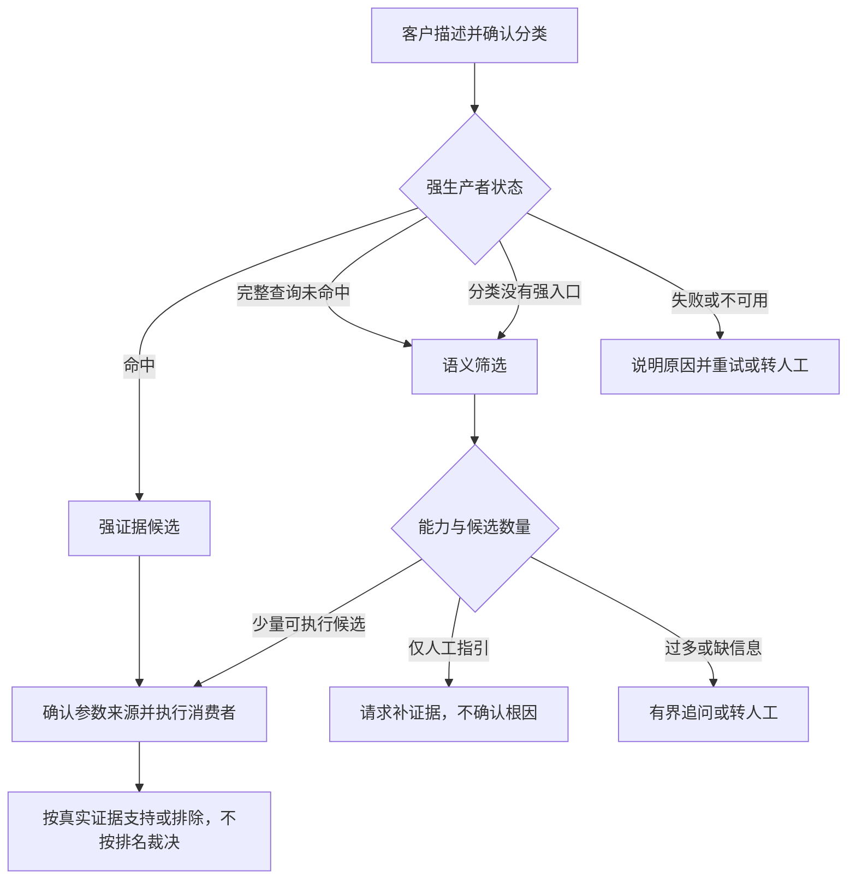

# KBD 语义入口兜底诊断设计与需求

> 核对日期：2026-09-06。依据当前本地代码，包含尚未提交的修改。
>
> 状态：本文对应的主要功能已接入前后端及回归；自动验证范围与仍须在部署环境验收的项目见第 9 章。代码有实现、自动测试通过和现场验收通过是三件事，不互相替代。
>
> 范围：知识生产、审核发布、在线诊断、离线诊断、仿真、版本追溯与观测。本需求不新增或改造虚拟机控制台截图、Guest Agent（客户机代理）或串口通道。

## 1. 先理解用途和边界

**先根据客户描述找到值得检查的 KBD，再用真实证据验证；描述相似，不代表根因相同。**

例如客户说“创建虚拟机时提示镜像格式不支持”。这可以成为查找相关 KBD 的入口，但不能单凭相似度认定镜像损坏，更不能猜一个 VM_ID（虚拟机标识）去执行命令。

| 对象 | 浅显解释 | 不负责什么 |
|---|---|---|
| `semantic_entry_profile`（语义入口画像） | 一张“遇到哪些描述值得继续查”的说明卡 | 不执行命令、不证明根因 |
| `qkv_case_context`（工单上下文信号） | 声明使用客户提交的故障描述作为入口 | 不采集、不产出变量、不配置派生变量或断言 |
| QFK（消费者信号） | 用已有受控工具验证日志、系统、服务等现场证据 | 不接受画像临时编造的命令 |
| CDD（候选差异诊断） | 用证据支持或排除候选，形成允许的结论 | 不把语义排名第一当成唯一根因 |

本文的“强生产者”指 `qkv_task`（任务）、`qkv_alert`（告警）、`qkv_dialog`（弹框）。既有视觉和效果验证信号仍遵循各自来源及安全门禁，不能加一个语义画像就绕过。

### 1.1 三档能力

| 声明值 | 能把排查做到哪一步 | 发布和运行要求 |
|---|---|---|
| `executable`（可执行诊断） | 平台有现有消费者可以继续验证 | 需要消费者及其完整执行契约；缺参数不执行；语义命中只是检查资格 |
| `guidance_only`（仅人工指引） | 能告诉客户该补充什么，但不能自动确认 | 必须填写补证据指引；不要求虚构消费者或必要证据；不进入自动 CDD，不生成离线采集资源 |
| `capability_gap`（能力缺口） | 当前没有可信的验证或指引路径 | 不参加语义自动候选；不能仅靠画像绕过生产者发布门禁 |

仅人工指引始终返回“无法确认”，不是低置信度的已确认结论。虚拟机内部证据暂不可得时，应使用这一档或记录能力缺口，不虚构平台消费者。

### 1.2 本次实现的范围

| 环节 | 实现 |
|---|---|
| 知识生产 | 从可靠问题原句保守生成待审核画像，附原文关联和文字正反例 |
| 审核 | 结构化表单、范围、补充问题、原文关联、正反例、分类内路由试运行 |
| 发布 | 画像与上下文信号成对校验；按能力检查消费者；原文引用过期和测试不一致会阻断 |
| 在线 | 强生产者优先、纯语义分类入口、多轮客户补充、最多三篇执行候选、重复追问停止 |
| 离线 | 计划冻结描述和 KBD 规则；上传后先查强证据，再从同一份快照选择候选 |
| 客户呈现 | 展示选择理由、未采用原因、补证据问题；无采集画像时也可查看人工指引 |
| 版本与性能 | 使用已有不可变发布修订；画像向量按模型和内容摘要缓存，不新建第二套知识事实源 |
| 观测与回归 | 可读路由观测、过滤理由、分数、降级、修订与耗时；原样例、V2 样例分别回归 |

## 2. 画像怎么填写

### 2.1 四个核心字段

| 字段 | 容易理解的叫法 | 怎么填 |
|---|---|---|
| `canonical_symptoms` | 标准症状：客户通常怎么说 | 完整的现象短句，不写根因或修复方案 |
| `positive_anchors` | 正向锚点：至少看到哪项关键信息 | 稳定报错、错误码或特征短句；至少命中其中一项才进入候选 |
| `exclusion_anchors` | 排除锚点：出现什么就不适用 | 有事实依据的不适用现象；可以留空，不为了凑数编造反例 |
| `diagnosis_capability` | 诊断能力：平台能查到哪一步 | 按实际工具能力选择上一章的三档之一 |

“锚点”就是筛选用的关键信息，不是另一种工具。正向锚点是**任选其一**，不是所有条件同时满足。

例如：

- 标准症状：创建虚拟机时提示镜像格式不支持。
- 正向锚点：`镜像格式不支持`、`unsupported image format`。
- 排除锚点：只有原文能证明不适用才填。
- 能力：有消费者验证就选可执行；否则提供人工指引或记录能力缺口。

### 2.2 可选字段

| 字段 | 作用 | 注意 |
|---|---|---|
| `manual_evidence_request` | 请客户补充什么证据，字符串数组 | 仅人工指引时必填；不是自动命令 |
| `clarifying_questions` | 多篇都像时优先问什么，最多 10 条 | 一次展示一组，不把建议答案视为客户确认 |
| `scope` | 旧版适用范围文字，字符串或字符串数组 | 仅参与检索文本，不做版本门禁 |
| `applicability` | 真正的适用范围硬条件 | 支持产品、版本、组件、对象类型、操作；缺少对应客户信息也不能执行 |
| `source_refs` | 便于人理解的原文位置，例如 `kbd:problem_description` | 不能引用根因或修复方案作为问题侧依据 |
| `source_evidence` | 字段对应的原文片段、章节和章节摘要 | 发布时逐字回查并检测章节改动；优先由流水线或试运行自动关联 |
| `routing_examples` | 随画像保存的文字正反例 | 保存／发布时重新检查筛选结果；不代替消费者仿真 |

`applicability` 的字段是 `product`（产品）、`product_version`（版本）、`component`（组件）、`object_type`（对象类型）、`operation`（操作）。每个字段是允许值数组；字段之间同时满足，同一数组内任选其一。留空表示不限。

版本复用平台现有版本匹配规则，例如 `6.*`、`>=6.12.0,<7.0.0`。不支持的表达式不猜测。其他范围值按大小写不敏感的明确值比较，不做同义词推断。

### 2.3 避免这些写法

| 容易填错的内容 | 为什么不合适 | 正确处理 |
|---|---|---|
| 锚点只有“虚拟机”“失败” | 过于宽泛，很多 KBD 都会像 | 优先填写特征报错 |
| 症状写“删除残留文件即可恢复” | 把答案泄漏成入口 | 症状写观察事实，处置放回正文 |
| 从描述推断 HOST、VM_ID | 可能跨对象误执行 | 使用平台上下文、客户确认或受控查询产生的可信变量 |
| 没有消费者却选择可执行 | 只能召回，无法验证 | 改为人工指引或能力缺口 |
| 把 `qkv_case_context` 当普通采集项 | 它没有命令、匹配和产出变量 | 只保留上下文入口声明 |
| 把试运行成功当作仿真通过 | 试运行只选择候选 | 还要检查消费者和真实证据裁决 |

明确的“没有出现某报错”和“以前发生过某问题”有规则保护，但不是完整自然语言理解。复杂否定、多对象、相反陈述仍须用近似反例验证，必要时让客户明确说明当前问题。

## 3. JSON 示例与管理端操作

### 3.1 可执行画像

下例是画像对象，放在 `signals_json.semantic_entry_profile`。只有真实存在可验证的消费者时才能声明可执行。

```json
{
  "schema_version": 1,
  "diagnosis_capability": "executable",
  "canonical_symptoms": ["创建虚拟机时提示镜像格式不支持"],
  "positive_anchors": ["镜像格式不支持", "unsupported image format"],
  "exclusion_anchors": [],
  "manual_evidence_request": [],
  "clarifying_questions": ["请提供创建失败时的完整错误文字，并确认使用的镜像格式。"],
  "source_refs": ["kbd:problem_description"],
  "routing_examples": [
    {"description": "创建虚拟机时镜像格式不支持", "expected_match": true},
    {"description": "没有出现镜像格式不支持，只是启动比较慢", "expected_match": false}
  ]
}
```

需要版本门禁时可增加：`"applicability": {"product": ["HCI"], "product_version": [">=6.12.0,<7.0.0"]}`。不要把示例版本当成该问题真实的适用范围。

### 3.2 仅人工指引画像

```json
{
  "schema_version": 1,
  "diagnosis_capability": "guidance_only",
  "canonical_symptoms": ["虚拟机内的操作系统启动后反复显示蓝屏错误"],
  "positive_anchors": ["蓝屏", "blue screen"],
  "exclusion_anchors": [],
  "manual_evidence_request": [
    "请提供经授权的完整错误文字或截图，并说明蓝屏发生前最后一次操作。"
  ]
}
```

该画像配合上下文信号可以作为人工指引发布，不需要编造 QFK 消费者；不会生成离线采集器。

### 3.3 上下文信号和完整文档示例

单条上下文信号：

```json
{
  "id": "case_context",
  "role": "context",
  "acquire": {"tool": "qkv_case_context", "args": {}},
  "match": null,
  "orchestrate": {"phase": "diagnostic", "requires": [], "produces": []}
}
```

完整 Signals（信号集合）示例，以文件系统写满为例：

```json
{
  "schema_version": 2,
  "semantic_entry_profile": {
    "schema_version": 1,
    "diagnosis_capability": "executable",
    "canonical_symptoms": ["文件系统使用率达到 100%，写入提示 No space left on device"],
    "positive_anchors": ["No space left on device"],
    "exclusion_anchors": []
  },
  "signals": [
    {
      "id": "case_context",
      "role": "context",
      "acquire": {"tool": "qkv_case_context", "args": {}},
      "match": null,
      "orchestrate": {"phase": "diagnostic", "requires": [], "produces": []}
    },
    {
      "id": "system_check",
      "role": "must",
      "acquire": {"tool": "qfk_system", "args": {"command": "df -h"}},
      "match": {
        "type": "keyword",
        "pattern": "100%",
        "expected": true,
        "extract": {"type": "text", "rows": {"mode": "all"}}
      }
    }
  ],
  "verification_contract": {
    "evidence_policy": {
      "must": ["system_check"],
      "should": [],
      "exclude": [],
      "context": ["case_context"],
      "minimum_should": 0
    }
  }
}
```

此例验证结构，不是可直接投产的业务模板。实际还要确认执行节点、文件系统范围、工具编译支持和排除证据。任意一行“100%”不能证明客户故障就是由该文件系统引起。

### 3.4 审核人怎么做

1. 进入 KBD 可编辑详情，确认并保存问题分类，再在关键信号区打开“语义入口画像”。未分类不能进行同分类路由测试；AI 推荐分类不等于已经确认。
2. 填结构化字段；保存会在缺少时补上上下文信号。
3. 打开“适用范围”，只填有依据的限制。不要将未确认版本写成默认值。
4. 打开“路由试运行”，输入真实正例和近似反例。页面展示候选、未采用原因、命中信息、分数、修订及降级说明。
5. 打开“原文关联与正反例”，可采用最近试运行得到的原文关联，并保存测试输入。关联只做逐字查找；没有关联到的改写内容仍须人工复核。
6. 检查消费者与变量来源，运行发布前检查，再审核发布。
7. 可执行 KBD 发布后，在离线“KBD 同步与版本”增量检测并审批发布采集资源；再跑在线／离线仿真。

试运行的是**当前草稿与同分类已发布候选**，不是已上线版本的成功证明。保存失败不会丢失表单内容；保存工作稿不会直接覆盖运行时发布快照。

也可在 `qkv_case_context`（工单上下文）信号卡片点击“路由试运行”，直接打开画像表单并展开测试区；不会自动执行请求或保存。画像未补齐时先填写必需字段，再输入故障描述。测试明确假设任务、告警、弹框均已确认未命中，不会实际采集它们。

普通 QKV/QFK 的“试运行”仍验证粘贴记录或命令输出的提取、派生变量和判断规则。上下文信号不走这个接口：旧页面或直接调用会收到 `422 / SEMANTIC_ROUTE_PREVIEW_REQUIRED`（请改用语义路由试运行），即使人为添加产出变量也不会执行。两类试运行都不等于在线／离线仿真通过；完整网络链路的验收范围见第 8 节。

## 4. 客户输入如何成为候选

### 4.1 输入与分段

- 在线只取用户消息，跳过“继续”等控制输入以及所有模型、工具消息。
- 合并首条主诉和后续客户补充。总长最多 16000 字符；超长时保留前后两段。
- 独立报错字段最多 1000 字符。描述中的错误码、引号文字可辅助提取，但不把被否定的原句重新变成肯定事实。
- 现象、报错、对象动作分别向量化；长片段和画像按最多 500 字符切片，尾部也参与。
- 文字门禁检查原始描述及显式报错，不用已丢失否定关系的自动对象词作为肯定证据。
- 已知产品、版本、组件等只用于候选范围过滤；不写入命令变量池。

这不是给聊天 LLM（大语言模型）一段提示词，让它决定根因。入口采用明确规则加 Embedding（文本向量）排序。

### 4.2 筛选与排序

1. 确认分类及强生产者状态。
2. 从该分类当前有效的**不可变发布快照**取画像，跳过停用和能力缺口。
3. 检查产品、版本、组件等范围；信息缺少或不适用就不执行。
4. 正向锚点至少命中一项；排除条件命中则剔除。
5. 在线对剩余候选计算片段向量相似度。权重为现象 0.55、报错 0.30、对象动作 0.15，缺失片段时重新归一化。
6. 排序分为文字分数 × 0.45 ＋ 向量分数 × 0.55。它不是根因概率。
7. 有可执行候选时优先验证消费者；没有时才展示人工指引。

向量异常时**整批**退回文字分数，不能混用部分向量分和部分文字分。离线上传后使用同一规则的确定性文字模式，不依赖外部向量服务；结果明确标记未使用向量。

文字筛选是必要条件：没有明确锚点，即使向量觉得相似也不会进入执行候选。这是安全边界，不是“向量能理解所有同义词”的承诺。

### 4.3 多候选与追问

- 返回展示数量 `top_k` 默认 5，最大 10。
- 通过范围与文字门禁后，先按文字分数选最多 10 篇进行向量重排，避免对大分类逐篇调用外部模型；歧义判断仍使用截断前的实际候选总数。
- **实际可执行候选总数**最多 3。不能通过传 `top_k=1` 隐藏其余候选并强行选第一篇。
- 超过 3 篇时先请求区分信息：优先采用审核人填写的问题，否则提示缺失范围或不同现象。
- 不使用未经校准的领先差值把第一名变成唯一答案；少量候选交由真实消费者证据区分。
- 在线同一个问题最多询问两次，仍无法区分则停止重复追问并转人工。
- 消费者反证、执行失败、证据不足、多篇仍被支持，都不能仅靠语义排名强行确认唯一根因。

## 5. 在线与离线的运行流程

### 5.1 强生产者优先

| 状态 | 含义 | 是否可以兜底 |
|---|---|---|
| `matched` | 强生产者已命中 | 不可以，继续强证据路径 |
| `no_match` | 预期强生产者实际执行完整、无错误且未命中 | 可以进入语义候选验证 |
| `source_unavailable` | 查询失败、缺记录、权限不足或结果不确定 | 不可以，不能伪装成未命中 |
| `not_applicable` | 分类里没有强生产者定义 | 服务端复查权威分类清单后，允许纯语义入口 |



在线继续使用既有 Agent、QFK、terminal_bridge（终端桥接）、命令确认、超时和审计。仿真只切换采集结果提供方，不用仿真案例标签预先指定答案。

### 5.2 离线采集前

客户在独立离线页面选择采集场景，填写现场版本、执行节点、时间窗、故障描述、完整报错，可补充组件和操作。虚拟机尚未创建时，对象标识可以按场景契约留空，不要求编造 VM_ID。

计划冻结：

- 当前 KBD 规则和语义画像，以及它们的修订和摘要；
- 故障描述、显式报错及允许的范围信息；
- 现场产品版本、采集画像、采集器修订及执行项。

语义筛选上下文中的版本与产品由服务端按计划／会话校正，不能使用与制品版本不一致的另一份值。描述中的显式密码、令牌会脱敏。正常采集变量仍按既有受控来源处理，不能把描述中的字符串当作执行目标。

客户填写的执行节点、已存在的虚拟机 ID 和故障结束时间，分别作为 `HOST`、`VM_ID`、`END` 冻结进计划。同一字段涉及多个对象时，不能自动选择其中一个；虚拟机尚未创建成功时，也不会凭名称生成 ID。其他已经核实的值（例如从报错原文复制的 `REQUEST_ID`）可在“已确认的诊断变量”中逐项填写。空值、重复变量以及覆盖节点／对象／时间字段的输入会被拒绝。未提供的必需变量仍使相应消费者保持未知，不能因为语义相似就跳过依赖检查。

计划不会仅采集语义第一名，从而丢掉区分证据。缺少必要执行目标仍由原有签发门禁阻断。含纯语义 KBD 的场景缺少故障描述时返回 `SEMANTIC_CONTEXT_REQUIRED`，须补全后再生成。

### 5.3 上传后的诊断

1. 读取该计划冻结的规则，不回读当前修改后的 KBD。
2. 先检查强证据。缺少预期强生产者证据或评估不确定时，禁止兜底。
3. 可兜底时，用冻结描述选择少量候选，再交由共享匹配与证据裁决。
4. 报告保存语义路由解释；客户能看到选择原因、未采用原因、补证据问题和是否降级。
5. 生成的报告仍遵循现有工程师审核发布流程，不自动把草稿作为正式客户结论。

### 5.4 没有采集能力时

离线页面提供“没有可自动采集的场景？查看人工补证据指引”：

1. 填写当前故障现象。
2. 加载已发布的人工指引分类，选择所属分类。
3. 查看可能方向和需要补充的证据。

此功能读取发布快照，不创建采集计划或采集器。采集前没有现场强证据结果，因此只使用服务端复查的“没有强生产者”状态；如果分类有强入口，要求回到正常采集流程，不能让客户手工声明“都没命中”。

## 6. 流水线、来源、发布与回滚

### 6.1 自动生成什么

原始 KB → 既有分类／识图／信号抽取 → 检查是否缺少强入口 → 从问题描述中找可靠异常原句 → 画像草稿 → 契约和来源检查 → 专家修改／试运行 → 发布。

当前画像补全是保守规则生成，不另加一次 LLM 调用：

- 仅取问题描述中的明确异常句，不从根因、解决方案生成症状。
- 锚点来自这些问题句中的错误码、引号原文，或原句本身。
- 有现有消费者才建议可执行，否则生成明确的人工补证据指引。
- 没有可靠异常句就不补画像，不保证所有 KB 都能自动投产。
- 附逐字来源引用、正例和否定反例；这些基础反例不替代专家编写业务近似反例。
- 生成成功仍是待审核状态，不自动发布，不编造执行变量或命令。

既有信号抽取 LLM 提示词及其完整流程仍见 [KBD 审核发布操作指南](KBD审核发布操作指南.md)。不要把本规则生成器描述成新增的模型提示词。

### 6.2 原文、测试资产与发布

`source_evidence` 每条包含：

- `field_path`：画像字段及数组位置，例如 `positive_anchors.0`；
- `source_ref`：问题描述、告警信息或诊断步骤的字段名；
- `quote`：可逐字回查的原文；
- `source_sha256`：对应整个章节的内容摘要。

发布时重新校验引用和当前章节；章节或画像值改变导致引用不一致，会要求重新核对。旧数据没有引用不会被冒称为已证明来源；人工改写内容仍需要专家审查。

`routing_examples` 保存描述及“应该／不应该进入候选”的期望。每次结构校验重新运行文字门禁，不靠上一次的“通过”标志；修改画像后反例失效会阻断。范围、变量、消费者和最终根因另由试运行、发布契约及仿真验证。

### 6.3 版本与派生索引

复用现有 KBD 不可变发布修订、活动指针、停用标记和回滚机制，不建立第二套人工维护的画像表。

- 在线分类清单和语义检索使用发布内容；工作稿不直接进入生产。
- Agent 携带已加载的 KBD 修订。检索发现版本变化返回冲突，要求重新加载，避免混用。
- 停用记录不作为新候选；回滚后按恢复的快照内容检索。
- 离线已经签发的计划继续使用冻结规则；新计划才采用新版本。
- 向量是派生缓存，键包含模型地址／名称和画像内容摘要，最多 512 项；进程重启可重建。正文与画像更新后不会误用不同摘要的缓存。
- 本轮选择按需缓存，未新增专用持久化向量索引表。大规模容量及延迟基准仍须用真实数据测量，不能以缓存存在推断性能已达标。

## 7. 接口、观测与排错

### 7.1 实际接口

| 调用方 | 路径 | 用途 |
|---|---|---|
| 内部 Agent | `POST /api/kb/kbd/semantic-entry/resolve` | 权威发布快照的候选选择 |
| 管理端 | `POST /api/v1/kbd/{id}/semantic-preview` | 经网关转发的草稿路由试运行，不保存、不执行 |
| 离线客户 | `GET /api/diagnosis-scenarios/semantic-advice` | 可查看人工指引的分类 |
| 离线客户 | `POST /api/diagnosis-scenarios/semantic-advice` | 获取只读指引，不能指定强生产者未命中 |

内部检索请求示例：

```json
{
  "category_id": "<平台已有分类ID>",
  "case_context": {
    "description": "创建虚拟机时提示镜像格式不支持",
    "error_text": "镜像格式不支持",
    "product": "HCI",
    "product_version": "6.12.0",
    "object_type": "虚拟机",
    "operation": "创建"
  },
  "strong_producer_status": "no_match",
  "expected_revisions": {},
  "top_k": 5
}
```

示例中的 `no_match` 必须有实际查询结果支撑，不能为测试方便在生产调用中伪造。Agent 会填写已加载的实际修订，外部客户接口不提供这一状态开关。

响应包含：`decision`（下一步类型）、`reason_text`（中文理由）、`candidates`（候选）、`filtered_candidates`（未采用候选及原因）、`score_parts`（分数构成）、`next_action`（补充问题）、`degraded`（是否未使用向量）、`resource_revision`（KBD 修订）、`profile_digest`（画像摘要）、路由版本和耗时。候选内的修订和摘要用于追溯，不是成功率。

### 7.2 可观测性

共享路由产生 `semantic_fallback_route` 观测，记录可读的脱敏输入片段、强入口状态、候选、过滤原因、分数、修订、降级和耗时。在线命令和最后结论继续由既有 Agent／CDD 链路观测；离线报告保留路由解释。

指标复用：

- `hci_kbd_workflow_items_total{workflow="semantic_fallback"}`：按阶段、结果及降级情况计数；
- `hci_kbd_workflow_duration_seconds{workflow="semantic_fallback"}`：耗时分布。

在线选用的精确发布修订写入现有资源使用审计。Langfuse 需要在部署环境正确配置和启用；本地测试中提示未配置不代表线上观测已验收。阈值告警、真实召回率和规模容量须根据生产样本量设定，不把候选分数当作质量指标。

### 7.3 常见现象

| 现象 | 先检查什么 |
|---|---|
| 找不到画像候选 | 分类、发布快照、锚点、排除条件和范围；工作稿不会直接被生产读取 |
| “强生产者不可用” | 是否执行完整、权限和采集是否成功；不能改成未命中绕过 |
| 只有指引没有采集器 | 检查能力是不是仅人工指引，这是预期行为 |
| 候选很多却不执行 | 是否超过 3 篇；补充特征报错或改进画像，不强行选第一名 |
| 版本冲突 | 重新加载分类快照；不要混用新画像和旧候选 |
| 原文引用过期 | 核对正文和画像后重新试运行并采用正确引用 |
| 试运行提示 `SEMANTIC_PREVIEW_CATEGORY_REQUIRED` | 先确认并保存 KBD 分类，再试运行；不能用单篇未分类草稿的匹配分数冒充同分类竞争结果 |
| 正反例不通过 | 检查变更是否误召回或漏召回；不要只改期望值来消除报错 |
| 离线提示缺少故障描述 | 在表单补充描述后生成计划；不要拿近期变更说明充当主诉 |
| 向量降级 | 查看模型配置和调用失败记录；整批文字筛选仍不会绕过消费者 |

## 8. 样例与仿真验收要求

原 `SAMPLE-SIG-*` 五篇与语义 `SAMPLE-V2-*` 五篇分别验收，前者通过不能替代后者。

V2 样例不使用任务、告警、弹框来冒充语义入口；上下文信号不是采集器，也不需要 Tool Registry 的可执行条目。移除旧生产者时，证据规则必须同步移除它们的引用。本次已修正种子 SQL 中这类悬空引用，V2 草稿种子版本为 5；不自动覆盖已经发布或人工维护的数据。

| 用例 | 必须得到的结果 |
|---|---|
| 强入口命中 | 不执行语义兜底 |
| 强入口失败或证据不完整 | 不伪装未命中 |
| 分类只有语义入口 | 可以选择消费者候选 |
| 描述末尾或独立字段才有报错 | 能参与筛选 |
| 否定句、已解决历史、近似错误 | 不把否定／历史当当前事实 |
| 版本不符或范围信息缺少 | 不进入自动执行 |
| 超过三篇或消费者无法区分 | 追问／人工处理，不强选唯一答案 |
| 仅人工指引 | 可发布并展示，不产生采集器或自动根因 |
| 参数缺失、消费者失败或反证 | 不误执行、不当作支持 |
| 画像改动、停用、回滚 | 新请求遵循有效修订；旧证据使用旧计划规则 |

推荐每篇准备真实正例及至少两条业务近似反例。自动生成的否定句只是基础测试；不证明现场根因判断正确。

## 9. 本次验证记录与上线检查

### 9.1 已执行的自动验证

```bash
make diagnosis-sample-preflight
make diagnosis-sample-postgres-preflight
make semantic-e2e-prepare RUN_ID=<独立批次>
make semantic-online-matrix RUN_ID=<独立批次> DATABASE_NAME=hci_semantic_e2e_<独立后缀>
make signal-v2-e2e-prepare RUN_ID=<全量信号独立批次>
make signal-v2-online-matrix RUN_ID=<全量信号独立批次> DATABASE_NAME=hci_semantic_e2e_<独立后缀>
make signal-v2-offline-matrix RUN_ID=<全量信号独立批次> DATABASE_NAME=hci_semantic_e2e_<独立后缀>
pnpm --dir frontend/admin run build
pnpm --dir frontend/customer run build
pnpm --dir frontend/admin test src/components/editors/__tests__/SemanticProfileEditor.spec.ts
```

- 样例预检：共享语义契约、原样例和 V2 数据契约、在线编排、离线编译、制品服务回归通过。
- PostgreSQL：原五篇、V2 五篇及人工指引变体真实批量发布；V2 在线匹配／证据裁决；原五篇与 V2 五篇离线全量同步、资源生成和证据诊断通过。测试使用事务回滚，不把测试副本留在业务库。
- 后端针对性回归：已有分类清单、信号保存与抽取、原在线编排、场景与鉴权代理检查通过。
- 前端：管理端编辑器交互测试及管理端／客户侧构建通过。构建仍提示已有的大包体积警告，不影响本次编译结果。

静态和 PostgreSQL 测试中的部分工具／模型调用使用替身，因此不能单独冒充运行态验收。第 9.1 节后半部分另行记录真实浏览器、terminal_bridge（终端桥接）、hci-sim（HCI 仿真器）、Go 采集器、加密上传和后台诊断链路的运行证据。

#### 2026-09-04 管理端只读预览验证（历史基线）

- 重建并启动本地 `admin-ui`；Agent 源码挂载热更新后，实际 HTTP 校验返回 `422 / SEMANTIC_ROUTE_PREVIEW_REQUIRED`，并带 `trace_id`。本轮不迁移数据库，不覆盖或发布现有样例。
- 真实 Chrome 打开 `SAMPLE-V2-VM`，从信号卡片进入“路由试运行”，测试区可见；修正未分类草稿也能返回可执行候选的问题后，页面正确显示分类前置错误并保留输入。
- 浏览器只读脚本 `scripts/verify/semantic-entry-browser-smoke.cjs` 已通过。仅放行 GET 和已核实无副作用的 `review-signals`、`semantic-preview` POST；其余写请求在发出前阻断。它验证页面、同源代理、网关和 KBD 预览接口，不验证诊断结论。
- 当日样例预检 57 项测试及 `contract-smoke`（契约冒烟）通过；分类前置与语义路由 6 项测试通过。2026-09-05 扩充覆盖后，当前 `make diagnosis-sample-preflight` 为 62 项测试加契约冒烟，全部通过。
- 当日只完成管理端只读预览，因此当时没有把结果登记为完整端到端通过。该阻断已在下一节通过独立测试分类、独立 KBD 副本和正式发布链路完成验证；原 `SAMPLE-V2-*` 样例仍保留给人工审核，没有直接改状态或伪造发布快照。

只读浏览器复验（路径按本机安装填写）：

```bash
PLAYWRIGHT_MODULE=/absolute/path/to/playwright \
HCI_E2E_BROWSER_PATH=/absolute/path/to/chrome \
HCI_E2E_ADMIN_URL=http://localhost:3002 \
HCI_E2E_SUPPORT_ID=SAMPLE-V2-VM \
HCI_E2E_DESCRIPTION='虚拟机启动失败' \
HCI_E2E_EXPECTED_ERROR_CODE=SEMANTIC_PREVIEW_CATEGORY_REQUIRED \
node scripts/verify/semantic-entry-browser-smoke.cjs
```

样例完成分类后应去掉预期错误码变量，以验证正常的只读路由响应；该脚本始终不会替你保存分类或发布样例。

#### 2026-09-05 独立副本与真实采集验收

经用户授权创建了五篇独立测试副本及各自的测试分类，调用正式审核发布接口；未直接伪造发布状态或修订。原有十篇 `SAMPLE-SIG-*`／`SAMPLE-V2-*` 数据前后哈希一致。

离线同步在独立克隆数据库中执行，避免全量检测连带更新主环境既有采集资源。使用平台签名的 Go 采集器，在禁止网络的仿真容器中采集并加密打包，再由 Chrome 客户页面同源上传，后台真实 worker 完成检查与诊断。

| 语义样例 | 独立副本案例 ID | 通过验收的离线工单 | 消费者断言 |
|---|---|---|---|
| CORE | 99178853535200 | Q2026090430025 | 2 项命中 |
| HW-PLT | 99178853535201 | Q2026090468508 | 2 项命中，1 项排除条件正确未命中 |
| LOG | 99178853535202 | Q2026090455662 | 明确提供 Request ID 后 4 项命中 |
| NET-STO | 99178853535203 | Q2026090444246 | 2 项命中 |
| VM | 99178853535204 | Q2026090472166 | 2 项命中 |

共 13 项消费者断言通过。五篇均经语义入口选择后再验证消费者，不把“语义选中”当作根因证据。LOG 未填写 Request ID 的前一轮仍保留为未知，证明没有绕过变量门禁。采集后自动清理明文，失败与重测工单均保留供追溯。

本轮真实运行发现并修正了预检没有覆盖的问题：

- Go 场景文件解析器需要接受 `semantic_entry_scenarios` 验收元数据；它不能增加采集路由或影响答案。
- 嵌套 JSON 的结尾 `}}` 不是未替换变量；未绑定的 `{{变量}}` 仍应拒绝。
- 推荐命令中的正则 `drop|error` 必须带引号；不放宽对真实 Shell 管道的拒绝。
- CORE 的 `df` 回显为文本表格，不能同时声明 JSON 输出；增加以实际 fixture（仿真回显）检查 JSON 入库契约的回归。
- Tool Registry（工具注册表）为 `qfk_system` 增加 `formatter`（输出格式）后，全量样例必须同步覆盖该参数；CORE 已改用 CSV（逗号分隔值）回显和 `delimited_table`（分隔表格）解析，防止契约字段只登记、不被真实样例检查。
- 明确填写的对象需要进入冻结变量上下文，不能仅供制品命令使用而让诊断依赖一直缺失。

完整在线 Agent（智能诊断助手）矩阵也已在新的隔离数据库中通过。浏览器只选择隔离测试分类，不把 TestRun（测试运行）的目标案例编号传给 Agent 缩窄候选；最终判定以 Agent 实际回报的 `supported_support_ids`（已获证据支持的案例编号）为准。

| 语义样例 | 独立副本案例 ID | 在线工单 | 实际命令数 | 结果 |
|---|---:|---|---:|---|
| CORE | 992146208494856002 | Q2026090545599 | 2 | 精确支持目标案例，通过 |
| HW-PLT | 990570598995330165 | Q2026090506187 | 2 | 精确支持目标案例，通过 |
| LOG | 993230493628876945 | Q2026090595018 | 3 | 走“以上都不是 → 补充症状 → 重新召回”后精确支持，通过 |
| NET-STO | 993625646563824128 | Q2026090502734 | 2 | 精确支持目标案例，通过 |
| VM | 991762358396379735 | Q2026090570616 | 1 | 精确支持目标案例，通过 |

在线链路为 `Chrome（浏览器） → Admin UI（管理端） → API Gateway（接口网关） → Case/Conversation/Agent（工单／对话／智能诊断服务） → terminal_bridge（终端桥接） → sim-ssh（仿真 SSH） → hci-sim → Result Oracle（结果判定器）`。五篇均收到 `diagnostic_outcome`（诊断结果）、无传输错误、命令退出码正常并唯一支持目标案例。CORE 的风险命令还实际走过一次“允许执行”审批。

隔离栈不连接外部 LLM（大语言模型）。其中的最小 OpenAI（模型接口）兼容桩只允许 CORE 样例的 `Use%` 百分比原文提取合同，其他请求返回 422；分类兜底、候选选择、命令执行、证据裁决和最终案例编号仍由项目代码完成，桩不能根据 TestRun 目标选择 KBD。

首次 VM 验收暴露出无拓扑约束时 `topology` 被编码为 `null` 的跨服务契约错误；现已统一输出空数组 `[]` 并增加 Go 回归。另修正了 QFK 领域工具的 `formatter`（输出格式）命令位置，使在线命令与共享编译器、离线 Manifest（清单）保持一致。

#### 2026-09-06 原 Signal v2 全量样例影响回归

语义入口功能完成后，另以 `SAMPLE-SIG-*` 原五篇为源创建 `full4-20260906` 隔离副本，专门确认任务、告警、弹框及各类 QFK（后端采集信号）没有被语义入口改动破坏。该批次使用独立分类、正式审核发布接口、完整在线浏览器链路和完整离线同步／采集／上传／诊断链路；没有把 TestRun 目标案例注入 Agent 候选。

| 原全量样例 | 独立副本案例 ID | 在线工单 | 离线工单 | 本轮诊断信号 | 结果 |
|---|---:|---|---|---:|---|
| CORE | 991038449361206534 | Q2026090653936 | Q2026090678240 | 3 | 在线／离线均唯一支持目标案例 |
| HW-PLT | 991668750056199216 | Q2026090607637 | Q2026090632267 | 4 | 在线／离线均唯一支持目标案例 |
| LOG | 991393652769783478 | Q2026090669688 | Q2026090675983 | 5 | 在线／离线均唯一支持目标案例 |
| NET-STO | 990987022313593535 | Q2026090623592 | Q2026090610580 | 3 | 在线／离线均唯一支持目标案例 |
| VM | 992332389815876774 | Q2026090689643 | Q2026090683026 | 4 | 在线／离线均唯一支持；截图和视觉观察各执行 1 次 |

这里的“本轮诊断信号”只统计会产生诊断结果的 `diagnostic`（诊断）阶段信号：`qkv_case_context`（工单上下文）只参与候选入口，不伪装成采集结果；`qkv_effect`（效果复核）属于 `remediation`（修复后验证）阶段，KBD 中继续保留，但不会在判定根因时提前执行。VM 的 `qkv_vm_console`（虚拟机控制台截图）必须同时出现固定截图操作和视觉观察，不能由任务或 VM 状态命令替代通过。

可追溯结果：

- 在线矩阵：`.hci-sim-run/semantic-e2e/full4-20260906/online-matrix-final-20260906.json`；
- 离线矩阵：`.hci-sim-run/semantic-e2e/full4-20260906/offline-matrix-final-20260906.json`；
- 两份结果均为 `PASS 5/5`。目录被 Git 忽略，只用于本机验收和审计，不提交短期租约、证据包或连接凭据。

本轮还修复了三个只有真实全链路才能暴露的问题：QKV 的逻辑 `HOST` 曾被提前改写成 SSH 连接地址，导致 VM Inventory（虚拟机归属清单）拒绝截图；VM Console 仍使用旧版内部 HTTP 客户端构造参数；离线验收曾把修复后效果复核误算为诊断阶段信号。现在逻辑宿主机标识保留在变量池，只有 QFK 实际执行边界才解析传输端点，三个阶段的口径保持一致。

本机独立离线验收页面为 `http://localhost:3003/offline-diagnosis?case_id=上述工单号`。结果与加密证据位于被 Git 忽略的 `.hci-sim-run/semantic-e2e/<批次>/` 和 `.hci-sim-run/lab/`；连接文件含短期租约，不应提交到仓库。

可复用脚本：

- `scripts/hci-sim/semantic-e2e-prepare.py --run-id <批次> --publish`：显式创建并正式发布独立副本，保留原样例。
- `scripts/hci-sim/semantic-e2e-stack.py --run-id <批次> --database-name hci_semantic_e2e_<后缀>`：克隆本机数据库并启动独立验收服务；不属于生产部署入口，同一时间只运行一套。
- `scripts/hci-sim/semantic-e2e-offline.py`：分阶段生成、采集、上传、查询及 `verify`（断言真实诊断结果）；重测使用 `--attempt` 保留旧证据，已确认变量使用 `--known-variable REQUEST_ID=<值>`。
- `scripts/hci-sim/semantic-online-e2e.py`：逐篇重建隔离 Runtime（运行时），并调用真实浏览器完成五篇在线 Agent 矩阵；对应入口为 `make semantic-online-matrix`。
- `scripts/hci-sim/signal-v2-offline-matrix.py`：只接受 `suite_kind=full` 的原 Signal v2 五篇，逐篇完成离线四阶段并输出不可变批次摘要；对应入口为 `make signal-v2-offline-matrix`。
- `scripts/verify/semantic-offline-upload-browser.cjs`：真实浏览器下载、上传并检查同源地址；已上传时重跑只检查下载，不重复提交证据。
- `scripts/verify/semantic-online-agent-browser.cjs`：真实浏览器完成环境构建、创建工单、分类确认、命令审批和 Result Oracle 上报；断言实际支持案例而非测试目标注入。

常用命令：

```bash
# 只执行一次：创建并正式发布五篇独立验收副本；原样例保持不变
make semantic-e2e-prepare RUN_ID=local-YYYYMMDD

# 五篇完整在线 Agent 矩阵；数据库名必须使用隔离前缀
make semantic-online-matrix \
  RUN_ID=local-YYYYMMDD \
  DATABASE_NAME=hci_semantic_e2e_YYYYMMDD

# 回归原 SAMPLE-SIG-* 全量信号；与语义入口样例使用不同 RUN_ID
make signal-v2-e2e-prepare RUN_ID=full-YYYYMMDD
make signal-v2-online-matrix \
  RUN_ID=full-YYYYMMDD \
  DATABASE_NAME=hci_semantic_e2e_full_YYYYMMDD \
  ATTEMPT=regression-YYYYMMDD
make signal-v2-offline-matrix \
  RUN_ID=full-YYYYMMDD \
  DATABASE_NAME=hci_semantic_e2e_full_YYYYMMDD \
  ATTEMPT=regression-YYYYMMDD

# 离线分阶段验收；LOG 等场景可通过 SEMANTIC_OFFLINE_ARGS 重复传入已确认变量
make semantic-offline-prepare RUN_ID=local-YYYYMMDD SUPPORT_ID=<独立案例ID> INSTANCE=<实例名> \
  SEMANTIC_OFFLINE_ARGS='--known-variable REQUEST_ID=<已确认值>'
make semantic-offline-collect RUN_ID=local-YYYYMMDD SUPPORT_ID=<独立案例ID> INSTANCE=<实例名>
make semantic-offline-upload  RUN_ID=local-YYYYMMDD SUPPORT_ID=<独立案例ID> INSTANCE=<实例名>
make semantic-offline-result  RUN_ID=local-YYYYMMDD SUPPORT_ID=<独立案例ID> INSTANCE=<实例名>
make semantic-offline-verify  RUN_ID=local-YYYYMMDD SUPPORT_ID=<独立案例ID> INSTANCE=<实例名>
```

### 9.2 部署后必须实际确认

- [ ] 目标部署的新镜像包含本次代码，前端缓存已更新；本次仅在本机测试服务及独立验收栈验证，没有替代 staging／生产部署验收。
- [ ] 在目标部署选择五篇 V2 样例逐篇完成在线诊断，核对实际命令和最终证据；本机隔离矩阵已完成 5/5，不能替代 staging（预发布环境）／生产镜像验收。
- [ ] 在目标部署从离线页面下载并运行 Go 采集器，上传证据包，核对报告与冻结修订；本机独立副本已完成采集上传与消费者断言。
- [ ] 修改、停用、回滚发布版本，验证新请求与旧证据包各自的版本边界。
- [ ] 在已配置的 Langfuse 中核对可读输入、候选解释、命令及最终结论关联。
- [ ] 使用真实正反例统计召回、误支持和耗时，给出样本量；规模告警阈值在获得基线后确定。

这些是尚未完成的目标部署验收，不应在没有运行证据时勾选。没有新建生产画像库、未改动 terminal_bridge 执行通道，也未替用户自动审核发布业务 KBD；明确授权发布的仅是独立验收副本。

## 附录：代码入口

- 共享契约与路由：`backend/shared/schemas/semantic_entry.py`、`semantic_routing.py`。
- 在线分类与检索：`backend/kb-service/app/routes/playbooks.py`、`kbd_search.py`。
- 在线编排：`backend/agent-service/app/adapters/agents/htp/investigation_agent.py`。
- 生产与审核：`backend/kb-service/app/routes/extract_signals.py`、`admin.py`。
- 离线计划与分析：`backend/diagnosis-service/app/services/collection_plan_service.py`、`offline_analysis_service.py`。
- 人工指引：`backend/diagnosis-service/app/services/collection_profile_service.py`。
- 管理端：`frontend/admin/src/components/editors/SemanticProfileEditor.vue`、`views/KbdReviewView.vue`。
- 客户侧：`frontend/customer/src/components/OfflineDiagnosisPanel.vue`。
- 样例：`database/seeds/04_kbd_diagnosis_samples.sql`。
