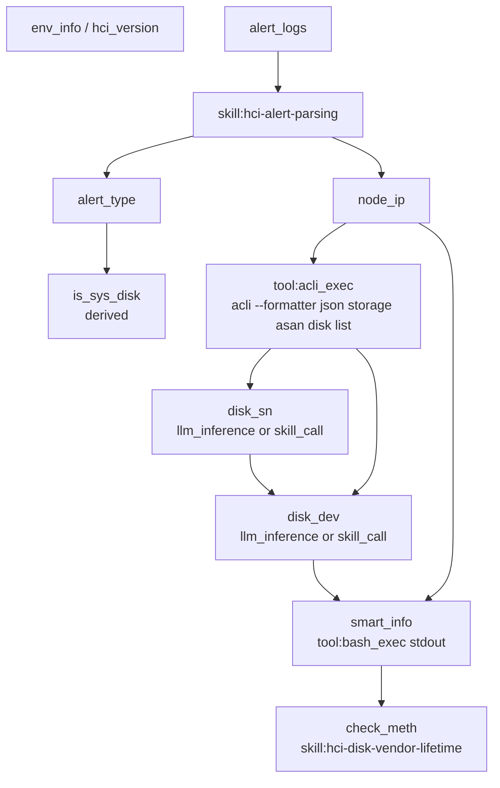

# SOP 变量设计分析与数据流诊断

> 案例：工单 Q2026061363967（磁盘 SSD 寿命告警排障）
> SOP 文档：`sop_document.id = 2`（磁盘寿命到期）
> 更新时间：2026-06-13
> 分析方法：第一性原理 + PR1/PR2 后代码现实 + 业界动态资源运行时范式

---

## 0. 结论摘要

PR1 已完成平台内置/硬编码治理：业务 Skill 不再走 Python 内置注册表，`skill_call` 已接入数据库 `skill_definition`；`env_injection` 已收敛为确定性 `env_info` 字段直取；`depends_on`、`output_path`、`fallback_strategy` 已可解析、合并并参与变量池运行时决策。

PR2 已完成五大动态资源统一运行时：KBD、SOP、Tool、Skill、Prompt 都具备运行时 revision、active 指针和使用审计。SOP 执行实例创建时绑定 `sop_revision`，动态 Skill/Tool 执行时也写入资源审计。

PR3 的核心不再是修补旧的 `env_injection` 猜测逻辑，而是在新运行时之上补齐 SOP 变量的通用能力：

- `tool_call` 支持 `acquisition_args_template`，从 `context_variables` 渲染工具参数。
- `tool_call` 支持从通用命令执行结果中绑定 `stdout`，用于 `smart_info` 等真实命令输出变量。
- 新增 `derived` 派生变量策略，以白名单表达式处理确定性规则，例如 `contains(alert_type, 'vs') ? false : unknown`。
- SOP 变量声明、三路合并和管理接口都必须保留 `depends_on`、`output_path`、`fallback_strategy`、`acquisition_args_template`、`expression`。

本 PR 不新增 Python 内置业务 Skill，不新增 `acli_system_smartctl` 这类普通命令专用工具，也不提交 `revert_*.sql` 临时回滚脚本。代码尚未合并主线，错误变更应直接从当前分支移除。

---

## 1. 第一性原理

SOP 变量系统要解决的本质问题是：在排障流程中，把自然语言 SOP 里的占位符转化为可追溯、可验证、可复用的运行时事实。

因此变量来源必须按事实可信度和执行边界分类：

| 来源 | 本质 | 适用场景 | 运行方式 |
|---|---|---|---|
| `env_injection` / `env:<key>` | 确定性环境字段直取 | `hci_version`、`cluster_name` 等无歧义字段 | SOP 执行实例创建时注入 |
| `skill_call` | 数据化 Skill 推理/解析 | 告警锚定、任务解析、厂商寿命规则 | JIT 调用数据库 active Skill |
| `tool_call` | 真实工具采集 | aCLI 查询、Bash 只读命令、SMART 输出 | JIT 调用工具 registry 中的 active Tool |
| `derived` | 确定性规则派生 | 已有变量可直接推出新变量 | JIT 执行白名单表达式 |
| `llm_inference` | LLM 被动抽取 | 从已展示证据中归纳字段 | 通过 `sop_advance.variables_extracted` 写入 |
| `user_input` / `user_confirm` | 人工输入或确认 | 系统无法确定或需人工承担确认责任 | 中断 SOP，等待交互卡片 |
| `agent_pass` | 编程方式传入 | 上游 Agent 或调用方已知 | 初始化或调用链传递 |

关键原则：

- `env_injection` 不能在多条告警或任务中做语义选择。它只能做字段直取。
- `llm_inference` 不是主动获取能力，不能用来凭空生成 SMART 信息、磁盘 SN 或命令输出。
- 普通系统命令不应各自扩张成专用 schema。工具抽象应保持在通用执行器层，由 SOP 数据声明具体命令、容器、节点和输出绑定。
- 业务规则不能写进 agent-service 微内核。可变知识应进入数据库 Skill、Tool、Prompt 或 SOP 变量声明。

---

## 2. PR1/PR2 后当前代码状态

### 2.1 已完成能力

| 能力 | 当前状态 | 关键位置 |
|---|---|---|
| 动态 Skill | `sop_request_variable` 通过 `DynamicSkillRunner` 读取 active `skill_definition`，管理页新增/修改 Skill 后下一次调用生效 | `backend/agent-service/app/skills/dynamic_runner.py` |
| Skill 名称兼容 | 支持 `disk_vendor_lifetime`、`disk-vendor-lifetime`、`hci-disk-vendor-lifetime` 候选 | `build_skill_name_candidates()` |
| 环境注入收敛 | `_resolve_env_variable` 只从 `env_info` 或显式 `env:<key>` 取值，不再从 `alert_logs/task_logs` 猜 `node_ip/disk_sn/request_id` | `backend/conversation-service/app/routes/sop_execution.py` |
| 事实源注入 | `alert_logs/task_logs/env_info` 仅在变量显式声明或被 `depends_on` 引用时注入变量池 | `sop_create_execution()` |
| 依赖拦截 | JIT 获取变量前检查 `depends_on`，缺依赖时返回 `next_tool_call` | `backend/agent-service/app/memory/variable_pool/engine.py` |
| 输出绑定 | Skill/Tool 支持 `output_path` 提取 | `engine.py` / `dynamic_runner.py` |
| 动态资源审计 | SOP 创建绑定 `sop_revision`，Tool/Skill 使用写审计 | PR2 动态资源运行时 |

### 2.2 PR3 前剩余缺口

| 缺口 | 影响 | PR3 处理 |
|---|---|---|
| `tool_call` 参数模板未渲染 | `smart_info` 无法把 `{disk_dev}`、`{node_ip}` 转成真实工具参数 | 实现 `acquisition_args_template` |
| 通用命令结果未默认绑定 `stdout` | `bash_exec` 返回 `ExecResult` 时变量池不能稳定取到 SMART 文本 | 支持对象属性路径和默认 `stdout` |
| `derived` 未实现 | `is_sys_disk` 只能退回 LLM 或人工，确定性规则无法数据化 | 实现白名单表达式 |
| 管理接口不允许新字段 | 页面或 API 保存变量 schema 时会挡掉运行时契约字段 | 扩展字段白名单 |
| 文档仍基于旧平台分析 | 后续容易回到 `env_injection` 猜测或专用工具膨胀 | 重写本文 |

---

## 3. 争议点澄清

### 3.1 `node_ip` 为什么可以是 `skill:alert-parsing`

`node_ip` 在磁盘寿命告警中不是简单字段映射，而是告警锚定问题。

历史告警示例：

```json
{
  "host": "SVR_aCloud_669",
  "target": "SVR_aCloud_670",
  "type": "磁盘状态异常",
  "alert_type": "vs_disk_warn",
  "description": "主机（SVR_aCloud_670）SSD寿命告警（1号盘），告警盘槽位（1），剩余寿命3%！"
}
```

`host` 可能是发起告警的监控节点，`target` 才可能是故障对象。多告警场景下，还需要先识别哪条告警与当前 SOP 匹配。因此正确抽象是：

```json
{
  "name": "node_ip",
  "acquisition_strategy": "skill_call",
  "acquisition_tool": "hci-alert-parsing",
  "output_path": "values.node_ip",
  "depends_on": ["alert_logs"]
}
```

这不是平台功能问题的规避，而是职责划分正确化：conversation-service 只注入原始事实源，告警解析由动态 Skill 承担。Skill 是数据化资源，管理页新增或修改后热生效，不需要发版。

### 3.2 `smartctl` 不应变成专用工具 schema

`smartctl -a /dev/{disk_dev}` 是普通系统级只读命令。现场要求指定容器边界：

```bash
acli --container vs-cp-manager system smartctl -a /dev/{disk_dev}
```

从平台抽象看，不应为每个普通命令新增 `acli_system_smartctl`。否则后续 `lsblk`、`df`、`cat /proc/...`、`grep log` 都会膨胀成 schema，违背 `bash_exec` / `acli_exec` 的通用执行器设计。

正确方案是用通用工具和 SOP 数据声明：

```json
{
  "name": "smart_info",
  "acquisition_strategy": "tool_call",
  "acquisition_tool": "bash_exec",
  "acquisition_args_template": {
    "container": "vs-cp-manager",
    "command": "smartctl -a /dev/{disk_dev}",
    "node_ip": "{node_ip}",
    "reason": "采集 {disk_dev} 的 SMART 原始信息"
  },
  "output_path": "stdout",
  "depends_on": ["disk_dev", "node_ip"]
}
```

`bash_exec` 已通过工具定义声明允许容器列表，包含 `vs-cp-manager`；运行时由语义校验器确认 `container` 必填且命令不能混入 `docker exec/kubectl exec/nsenter/acli` 前缀。

### 3.3 `is_sys_disk` 不应回到 Python 内置 Skill

旧方案中曾尝试把 `is_sys_disk` 写成 Python 内置判定逻辑，这是平台微内核污染：一个 SOP 的业务规则被写死到 agent-service。

如果规则来自 SOP 本身，例如“`alert_type` 包含 `vs` 时不是系统盘”，应声明为 `derived`：

```json
{
  "name": "is_sys_disk",
  "type": "boolean",
  "acquisition_strategy": "derived",
  "expression": "contains(alert_type, 'vs') ? false : unknown",
  "depends_on": ["alert_type"]
}
```

若规则无法确定，则 `derived` fail-loud，并由 SOP 声明的 `fallback_strategy` 决定是否转人工输入。不得静默让 LLM 猜。

---

## 4. 磁盘寿命 SOP 目标变量拓扑

### 4.1 变量依赖图



### 4.2 推荐 `variable_schema`

```json
[
  {
    "name": "hci_version",
    "type": "string",
    "acquisition_strategy": "env_injection",
    "acquisition_tool": "env:hci_version",
    "depends_on": []
  },
  {
    "name": "alert_logs",
    "type": "json",
    "acquisition_strategy": "env_injection",
    "acquisition_tool": "env:alert_logs",
    "depends_on": []
  },
  {
    "name": "alert_type",
    "type": "string",
    "acquisition_strategy": "skill_call",
    "acquisition_tool": "hci-alert-parsing",
    "output_path": "values.alert_type",
    "depends_on": ["alert_logs"]
  },
  {
    "name": "node_ip",
    "type": "string",
    "acquisition_strategy": "skill_call",
    "acquisition_tool": "hci-alert-parsing",
    "output_path": "values.node_ip",
    "depends_on": ["alert_logs"]
  },
  {
    "name": "asan_disks",
    "type": "json",
    "acquisition_strategy": "tool_call",
    "acquisition_tool": "acli_exec",
    "acquisition_args_template": {
      "command": "acli --formatter json storage asan disk list",
      "node_ip": "{node_ip}",
      "reason": "查询 aSAN 磁盘列表，定位告警盘 SN 与设备路径"
    },
    "output_path": "stdout",
    "depends_on": ["node_ip"]
  },
  {
    "name": "disk_sn",
    "type": "string",
    "acquisition_strategy": "llm_inference",
    "depends_on": ["asan_disks", "alert_logs"]
  },
  {
    "name": "disk_dev",
    "type": "string",
    "acquisition_strategy": "llm_inference",
    "depends_on": ["disk_sn", "asan_disks"]
  },
  {
    "name": "smart_info",
    "type": "string",
    "acquisition_strategy": "tool_call",
    "acquisition_tool": "bash_exec",
    "acquisition_args_template": {
      "container": "vs-cp-manager",
      "command": "smartctl -a /dev/{disk_dev}",
      "node_ip": "{node_ip}",
      "reason": "采集 {disk_dev} 的 SMART 原始信息"
    },
    "output_path": "stdout",
    "depends_on": ["disk_dev", "node_ip"]
  },
  {
    "name": "is_sys_disk",
    "type": "boolean",
    "acquisition_strategy": "derived",
    "expression": "contains(alert_type, 'vs') ? false : unknown",
    "depends_on": ["alert_type"],
    "fallback_strategy": "user_input"
  },
  {
    "name": "check_meth",
    "type": "string",
    "acquisition_strategy": "skill_call",
    "acquisition_tool": "hci-disk-vendor-lifetime",
    "output_path": "value",
    "depends_on": ["smart_info"]
  }
]
```

说明：

- `disk_sn` / `disk_dev` 当前仍可保留 `llm_inference`，但它们必须依赖真实工具输出。后续可升级为专门动态 Skill，例如 `hci-disk-alert-disk-mapping`。
- `asan_disks` 使用通用 `acli_exec`，不再依赖历史测试注册表里的 `acli_storage_disk_list` 专用名。
- `smart_info` 使用通用 `bash_exec`，不新增 `smartctl` 专用工具。

---

## 5. PR3 实现方案

### 5.1 `acquisition_args_template`

变量池在执行 `tool_call` 前递归渲染参数模板：

```json
{
  "command": "smartctl -a /dev/{disk_dev}",
  "node_ip": "{node_ip}"
}
```

若变量池已有：

```json
{
  "disk_dev": {"value": "sda"},
  "node_ip": {"value": "SVR_aCloud_670"}
}
```

则渲染结果为：

```json
{
  "command": "smartctl -a /dev/sda",
  "node_ip": "SVR_aCloud_670"
}
```

设计约束：

- 支持 dict/list/string 递归渲染。
- 支持 `{var}` 和 `{object.field}`。
- 引用变量缺失时 fail-loud，不静默传空字符串。
- 完整字符串为 `{var}` 时保留原始值类型；混合字符串时转为字符串插值。

### 5.2 `derived`

`derived` 只支持白名单表达式，不使用 Python `eval`：

| 能力 | 示例 |
|---|---|
| 布尔常量 | `true` / `false` |
| 空值 | `unknown` / `null` / `none` |
| 字符串 | `'vs'` |
| 数字 | `10` / `3.14` |
| 变量引用 | `alert_type` |
| 函数 | `contains(alert_type, 'vs')` |
| 三元表达式 | `contains(alert_type, 'vs') ? false : unknown` |

当前函数白名单：

- `contains(value, needle)`
- `equals(left, right)`
- `starts_with(value, prefix)`
- `ends_with(value, suffix)`
- `not(value)`

表达式返回 `unknown/null/none` 时视为无法确定。若未声明 `fallback_strategy=user_input`，变量池返回错误；若声明了兜底，则中断并请求用户输入。

### 5.3 输出绑定

`output_path` 支持 dict/list/object 属性路径。通用命令执行器返回 `ExecResult` 时：

- `output_path=stdout` 可显式读取 `stdout`。
- 未配置 `output_path` 且结果对象存在 `stdout` 时，默认绑定 `stdout`。

这样 `smart_info` 可以直接绑定真实 SMART 文本，而不是把整个执行结果对象交给后续 Skill。

### 5.4 管理接口字段保留

`PATCH /api/admin/sop/{id}/variable-schema` 允许以下运行时契约字段：

- `depends_on`
- `output_path`
- `fallback_strategy`
- `acquisition_args`
- `acquisition_args_template`
- `expression`

这些字段属于 SOP 变量运行时契约，不是展示字段。管理页或脚本更新变量声明时不得丢弃。

---

## 6. 验收标准

### 6.1 已解决问题

| 问题 | 验收 |
|---|---|
| SOP 管理页面修改变量声明后 Agent 仍按旧声明执行 | Markdown 明确声明的新值可覆盖旧 schema；管理接口可保存新运行时字段 |
| `node_ip` 由 `env_injection` 错锚定 | 新执行不再从告警列表猜测 `node_ip`，应由 `skill_call hci-alert-parsing` 基于 `alert_logs` 获取 |
| `smart_info` 用 `llm_inference` 不可信 | 可声明为 `tool_call bash_exec`，参数模板渲染后执行真实 `smartctl`，输出绑定 `stdout` |
| `is_sys_disk` 业务逻辑污染 Python 内置 Skill | 可声明为 `derived`，由 SOP 数据表达规则 |
| 自动来源失败静默转人工 | 默认 fail-loud，仅显式 `fallback_strategy` 才转人工 |

### 6.2 PR3 测试覆盖

| 测试 | 目标 |
|---|---|
| `test_sop_request_variable_tool_call_renders_args_template_and_extracts_stdout` | 验证 `smart_info` 工具参数模板渲染和 `stdout` 绑定 |
| `test_sop_request_variable_derived_expression` | 验证 `derived` 可从 `alert_type` 推导 `is_sys_disk=false` |
| `test_sop_request_variable_derived_unknown_fails_loud` | 验证派生结果未知时不静默猜测 |
| `test_tool_args_template_and_derived_expression_parsing` | 验证 Markdown 变量表解析新字段 |
| `test_merge_preserves_explicit_args_template_and_expression` | 验证三路合并保留新运行时字段 |
| `test_update_variable_schema_allows_runtime_contract_fields` | 验证管理接口允许保存新字段 |

---

## 7. 后续优化

PR3 先完成变量运行时的最小通用闭环。仍建议后续继续：

- 实现完整 `VariableProvider` 插件协议，把 `env/tool/skill/derived/user` provider 统一注册、发现、校验。
- 做 SOP 变量 DAG 发布期校验，检测循环依赖、缺失依赖和无效 `output_path`。
- 增加自动拓扑调度，依赖缺失时由系统自动获取前置变量，而不是只返回 `next_tool_call` 让 ReAct 下一轮执行。
- 为 `disk_sn/disk_dev` 建立动态 Skill，将“告警槽位 + aSAN 磁盘列表 → SN/dev”的映射规则数据化。
- 为 SOP 管理页增加运行时契约字段的结构化编辑器，避免用户手写 JSON 时格式错误。

---

## 8. PR 拆分状态

| PR | 目标 | 状态 |
|---|---|---|
| PR1 | 平台内置/硬编码治理 | 已合并 |
| PR2 | 五大动态资源统一运行时 | 已合并 |
| PR3 | SOP 变量方案重审与优化 | 本文档与本 PR 实现 |
