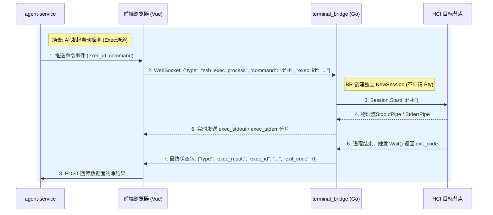

# SSH 终端代理 (terminal_bridge) 架构分析与演进方案

> **文件说明**：本文档以第一性原理重新审视了本地 SSH 终端代理 (`terminal_bridge`) 的架构设计，评估了其优缺点；针对分布式智能体环境下的“事务型调用”，识别了整条链路的核心能力缺失并给出具体改进方案；最后梳理了**方案 B（双通道设计：Pty 交互通道 + Exec 事务通道）**的落地任务清单。

---

## 一、当前 `terminal_bridge` 设计优缺点分析

当前 `terminal_bridge` 采用的架构设计是：
* **宿主端 (Windows/Linux PC)**：运行 Go 编写的 `terminal_bridge.exe` 本地程序，监听本地 `localhost:9999` WebSocket 服务。
* **用户端 (浏览器前端)**：建立本地 WebSocket 握手，并与后端通过 HTTP SSE 维持会话，作为控制面的“信使”。
* **网络路由模式**：云端后端 $\rightarrow$ SSE $\rightarrow$ 前端浏览器 $\rightarrow$ 本地 WebSocket $\rightarrow$ 本地 SSH $\rightarrow$ HCI 目标节点。


### 1. 核心优点
* **零信任内网穿透 (Zero-Trust Hole Punching)**：HCI 节点部署在客户私网中，云端没有直接路由。通过用户浏览器和本地 `terminal_bridge` 做代理，无需客户在防火墙开孔或配置 VPN 隧道，直接复用用户 PC 的 SSH 可达性。
* **极佳的交互协同体验**：`terminal_bridge` 使用单一 SSH PTY 会话模式 (`session.Shell()`)。用户手动操作的"SSH 终端面板"与 AI 助手自动执行命令共用相同的上下文（共享 `cd` 路径、环境变量、会话状态），用户能实时在屏幕上看见 AI 自动输入和命令回显。
* **安全沙箱防线**：所有命令通过用户桌面环境的 `terminal_bridge` 执行，权限天然与当前登录的 SSH 账号绑定，符合最小特权原则。
* **PNA 兼容**：内置 CORS 预检，完美绕过 Chrome 私有网络访问 (Private Network Access) 的限制。
* **exec_id + Marker 方向正确**：不是靠固定 `sleep` 或识别 Shell 提示符来判断命令结束，而是通过唯一 Marker 与 `$?` 拼接获取退出码。这比"看到 shell prompt 就认为结束"的方式稳健得多，同时保留了退出码语义。
* **已有事务生命周期雏形**：日志中已出现"注册 exec 监听器 → 移除 exec 监听器 → exec 完成"的完整生命周期记录，说明架构上已意识到一次工具调用应有独立的生命周期边界，这是向事务型调用演进的正确起点。
* **调试可观测性已增强**：日志记录了 marker 匹配过程、输出长度、回显裁剪逻辑、退出码解析，这对排查 PTY 类问题（如首行丢失、Marker 截断）提供了关键线索。

### 2. 致命缺点与隐患

从分布式系统和事务型 API 调用的第一性原理来看，当前设计存在以下缺陷：

```
【带内信令与字符干扰示意】
SSH PTY 输出流:
----------------------------------------------------------------------
major minor  #blocks  name\r\n           <-- 1. 实际输出 (stdout)
\r\n
   8        0  234431064 sda\r\n
__EXEC_DONE_78a23aa934204285:0\r\n       <-- 2. 退出码 Marker (带内信令)
Sangfor:aSV/host-047 (HOST-05) /sf #    <-- 3. 终端 Prompt (ANSI 污染)
----------------------------------------------------------------------
* 痛点：实际输出、控制标志、终端提示符三者在同一文本流中，极易发生解析分裂与误吞首尾行。
```

```
                    【 混合流污染问题 】
                       
                  +-------------------------+
                  |  用户手动输入 (stdin)     |
                  +------------+------------+
                               |
                               v (交错注入)
  +------------+      +--------+--------+      +---------------+
  | AI 自动命令 | ===> | 共享 SSH 会话   | ===> | 混合输出流     |
  +------------+      | (单个 PTY 管道)  |      | (stdout/stderr|
                      +-----------------+      |  混杂 ANSI 码) |
                                               +-------+-------+
                                                       |
                                                       v
                                               +---------------+
                                               | 状态解析失败   |
                                               +---------------+
```

* **PTY 屏幕刮擦 (Screen Scraping) 脆弱性**：
  * **ANSI 转义字符污染**：因使用了交互式 PTY，输出中混杂了大量的 VT100 终端颜色、光标移动及回删等控制字符。解析时极易出错。
  * **命令回显 (Echo) 干扰**：PTY 会自动回显输入的字符。必须编写复杂的正则表达式（如剥离 `__EXEC_DONE_...` 回显）来提取纯净的输出，极易在回显含有换行或被截断时，误吞或误判首行输出（如之前 bug 所示）。
  * **终端折行 (Wrap) 破坏**：PTY 具备固定列宽（如 160 列）。当命令返回长行文本（如 JSON 字符串或长日志）时，PTY 会在流中强行注入 `\r\n`。这直接破坏了结构的完整性，导致 JSON 解析在边界折行时崩溃。
  * **前端 JSON 二次转义**：前端若将 `ExecResult` 对象字符串化后直接渲染，用户看到的是 `\r\n`、Python repr 格式的字段名而非命令纯文本输出。工具卡片必须独立渲染 `stdout` 纯文本区域，退出码、耗时等元数据单独展示。
* **会话非隔离与并发交错**：
  * 如果 AI 执行耗时长的命令（例如备份、长轮询），用户在终端里按下了回车或输入了其他字符，用户的 `stdin` 和 AI 的 `stdin` 将在同一管道内交织，造成命令注入风险或输出格式污染。
* **带内信令 (In-band Signaling) 的碰撞与注入风险**：
  * 通过向输出流中打印特殊字符串 `__EXEC_DONE_{execId16}:{exit_code}` 作为完成判定。若命令读取的文件或日志里刚好含有此特征码（如历史命令残留于日志中），将引发判定过早结束，截断真实输出。
  * **注入攻击面**：若 AI 工具参数未严格转义，攻击者可构造包含 `; printf '\n__EXEC_DONE_FAKEID:0\n'` 的参数，伪造执行成功信号，欺骗 AI 进行错误推理。
* **无命令超时与挂起处理机制**：
  * 当前没有针对"执行中"命令的超时中断逻辑。若命令进入交互等待（如 `vim`、`less`、`passwd`）或目标节点网络中断，Bridge 将无限期阻塞在 PTY 输出读取上，前端持续"正在等待输出..."，无任何超时错误反馈。
  * 缺少 `SIGKILL` / `SIGTERM` 注入机制，无法在执行卡死时从云端强制中止命令。
* **进程级高内存积压**：
  * 当前使用 `strings.Builder` 将整个命令的输出完全缓存在 Go 进程的内存中。若执行 `tar` 列出百万文件或打印巨量日志，将导致 `terminal_bridge` 内存暴涨甚至 OOM。

---

## 二、工具事务型调用链路的依赖能力分析

事务型工具调用 (Transactional Tool Execution) 是指将 AI 的一次 Function Call 作为原子操作，具有**明确输入、可靠输出、状态边界、执行时长、审计留痕、错误隔离**的特征。

### 1. 链路依赖能力分解

实现事务型调用，整条链路必须具备以下六项核心能力：

| 依赖能力 | 物理本质描述 | 当前架构实现方式 | 满足度评估 | 核心改进点 |
| :--- | :--- | :--- | :--- | :--- |
| **1. 链路幂等与事务 ID 绑定** | 确保重试时不会重复执行，能精准匹配每次执行的输入输出。 | `exec_id` 全链路传递，前端采用 `waitForExecResult` 独占监听。 | **满足** | 架构设计已闭环，利用 Redis Queue 削峰去重。 |
| **2. 强类型状态通道与错误分离** | 区分进程标准输出 (stdout)、错误输出 (stderr) 与网络传输层异常。 | 共享 SSH 单一 `stdout`/`stderr` 管道，在 Python 层做 `ExitCodeMeaning` 的正则分类。 | **不满足** | 交互式 Shell 无法物理隔离 `stdout` 和 `stderr`，导致错误信息混入正文。 |
| **3. 执行环境隔离** | 每次调用具备独立的工作目录、临时变量和进程上下文。 | 共享同一个 Shell 会话，前序 `cd` 会污染后续命令。 | **不满足** | 应根据工具类型支持 Session 独立通道（非交互式 Exec）。 |
| **4. 非带内干扰判定** | 判定命令结束与退出码不依赖输出内容中的特殊字符串。 | 依赖向 `stdin` 写入 `printf '\n__EXEC_DONE...\n'` 做判定。 | **不满足 (低可靠性)** | 对于要求高可靠的 API 级工具，改用 SSH Exec 通道，自然依靠 SSH 协议的 ExitStatus 判定。 |
| **5. 大文件离线审计** | 巨量输出需能落库，并在不撑爆内存的前提下归档。 | 简单进行 4000/1000 字符硬截断。 | **不满足** | 见第三节设计。 |
| **6. 超时与挂起中断** | 命令执行超时或节点失联时，能主动中止并返回超时错误，不允许无限阻塞。 | 无超时机制，Bridge 无限期阻塞在 PTY 读取上，前端无限等待。 | **不满足** | Go 端引入 `context.WithTimeout`，超时后向 PTY 写入 `\x03`（Ctrl+C）并向前端推送超时错误帧。 |

### 2. 核心缺失与具体改进方案

#### 1) 链路幂等与事务 ID 绑定
* **现状**：实现了基于 `exec_id` 的一次性结果匹配，前端通过 `waitForExecResult` 挂起监听。
* **链路缺失**：若前端向云端回传结果（`/api/conversations/{id}/exec-result`）时发生网络抖动、浏览器闪退或 HTTP 502，云端 `agent-service` 会因 Redis `BLPOP` 超时而判定为“-1 timeout”。然而此时命令其实已在内网执行完毕，引发状态机不一致。
* **改进方案（任务清单）**：
  * **[后端]** 建立执行中事务表（Pending Transaction Log），将状态由 `proposed` $\rightarrow$ `executing` $\rightarrow$ `committed`/`failed` 持久化，而非仅存放在 Redis 易失缓存中。
  * **[前端]** 前端构建本地持久化执行重试队列（LocalStorage-based retry queue），如果回传 API 失败，必须指数退避重试直至成功，不可单次丢弃。
  * **[Bridge]** 在 Go 端设计轻量级历史缓存（最近 50 次执行），当后端因超时重试拉取同一 `exec_id` 时，直接返回缓存结果。

#### 2) 强类型状态通道与错误分离
* **现状**：通过重定向 `2>&1` 将 stderr 强行混入 stdout，再由后端在 python 代码中通过正则寻找是否有 "command not found" 等特征，极易漏判。
* **链路缺失**：无法区分标准输出与异常输出。例如当 `acli --formatter json` 成功返回 JSON，但在 stderr 中输出了无关的“内核告警/升级提示”时，这些杂质混入 stdout 导致 JSON 解析失败，导致只读工具报错。
* **改进方案（任务清单）**：
  * **[Go Bridge]** 底层放弃使用 PTY 会话，改用 SSH 协议的原生管道进行执行。标准输出流 `Session.StdoutPipe()` 与标准错误流 `Session.StderrPipe()` 物理分离。
  * **[协议层]** 传输的 `exec_result` 消息体结构重构为：
    ```json
    { "type": "exec_result", "exec_id": "...", "stdout": "...", "stderr": "...", "exit_code": 0 }
    ```
  * **[Python 端]** 彻底下线 `2>&1` 强制重定向，由 `executor.py` 直接承接物理分离的 `stdout` 与 `stderr` 并结构化填充至 `ExecResult`。

#### 3) 执行环境隔离
* **现状**：全局共享一个 PTY shell 实例。
* **链路缺失**：前序工具调用了 `cd /tmp`，将导致所有后续工具执行时的工作目录变为 `/tmp`，导致相对路径找不到文件；临时环境变量会残留。
* **改进方案（任务清单）**：
  * **[Go Bridge]** 采用“瞬时独立 Session”策略。对于诊断类工具，每次执行均通过 `Client.NewSession()` 创建独立的 SSH Session，运行完毕即销毁。工作目录、进程上下文完全隔离，互不污染。
  * **[配置化]** 仅对需要多步强交互的工具（如进入交互式配置配置界面）保留 PTY stickiness，其余普通探测工具强制走独立 Session 隔离。

#### 4) 非带内干扰判定（带外结束判定）
* **现状**：依赖终端向 stdout 打印特殊字符串来检测结束。
* **链路缺失**：容易受到文件内容、命令回显（Echo）、进程挂起（Hung）的干扰。若返回的流很大，Marker 会在读取缓冲区边界被截断，导致匹配失败。
* **改进方案（任务清单）**：
  * **[Go Bridge]** 利用 Go SSH 库提供的 `Session.Wait()` 机制。它直接监听 SSH 协议层底层的物理 `exit-status` 信道消息，不需要往屏幕输出任何标志。
  * **[带外传输]** 进程正常退出或被 Signal 终止时，Go 进程通过 `Wait()` 阻塞获取状态，随后将结果以独立的 WebSocket JSON 帧形式主动推送给前端。

#### 5) 大文件离线审计与归纳
* **现状**：后端执行器在内存中对结果进行硬截断（4000/1000字符），极易遗漏关键的尾部错误堆栈。
* **链路缺失**：如果命令产生 5MB 的大日志，直接通过 WebSocket 传给浏览器，前端由于单线程阻塞可能导致页面卡死；直接塞给大模型会超过上下文窗口限制。
* **改进方案（任务清单）**：
  * **[Go Bridge]** 边缘端（Go Bridge）在接收 SSH 流时，实时统计字节数。当检测到输出超过 `200KB` 时，自动拦截不再发送原始文本给浏览器，而是将其流式写入本地临时文件。
  * **[中转传输]** 向云端返回 `output_type: "file_ref"` 以及本地访问 URL。
  * **[云端分析]** `agent-service` 接收到文件引用后，不直接反投给 LLM，而是派生出一个“分片/过滤分析工具”（如 `grep_log`），在云端分析完毕后只把提取的关键匹配行喂给大模型。

---

## 三、针对巨量返回内容 (Massive Output) 的架构设计

当命令返回大输出（例如超过 10MB 的日志、故障 Dump 或庞大的 JSON 配置）时，现有的“前端 $\rightarrow$ Redis $\rightarrow$ SSE”缓冲链条会在内存和性能上面临崩溃风险。对此，我们基于第一性原理，设计如下演进方案。

### 0. 目标协议格式：结构化 `exec_result`

重构后，工具调用结果不再是混合字符串，而是具备清晰语义边界的结构化协议帧。

**正常输出（`inline` 模式，输出 < 200KB）**：

```json
{
  "type": "exec_result",
  "exec_id": "78a23aa9-3420-4285-b39b-d238ba571ba6",
  "node": "10.0.0.11",
  "exit_code": 0,
  "exit_code_meaning": "success",
  "duration_ms": 312,
  "stdout": "major minor  #blocks  name\n\n   8        0  234431064 sda\n",
  "stderr": "",
  "truncated_for_model": false,
  "output_type": "inline"
}
```

**大输出（`file_reference` 模式，输出 ≥ 200KB）**：

```json
{
  "type": "exec_result",
  "exec_id": "78a23aa9-3420-4285-b39b-d238ba571ba6",
  "exit_code": 0,
  "output_type": "file_reference",
  "stdout_artifact_id": "art_abc123",
  "stderr_artifact_id": "art_def456",
  "stdout_bytes": 26188,
  "stderr_bytes": 0,
  "truncated_for_model": true,
  "head": "major minor  #blocks  name\n\n   8        0...",
  "tail": "   8        4          1 sda4\n",
  "summary": "检测到 32 个块设备分区，命令执行成功。"
}
```

> **关键约束**：协议上严格分离 `stdout`、`stderr`、`metadata`、`artifact`，**禁止前端从混合字符串里猜测各字段归属**。前端工具卡片必须独立渲染 `stdout` 纯文本区域，退出码、耗时等元数据单独以标签形式展示，禁止字符串化整个对象后直接展示。

### 1. 第一性原理设计原则
* **控制面与数据面物理分离**：巨量输出数据（数据面）严禁流经 SSE、前端浏览器 JS 堆内存及云端 Redis 消息队列。浏览器端仅用于接收状态通知（控制面），如下载链接、数据摘要等。
* **流式转储 (Streaming Offloading)**：在本地 Bridge 边缘直接将 SSH 流写盘或流式分片上传至分布式存储，本地内存不进行整包缓存。
* **计算下推与边缘过滤**：尽可能在目标节点上通过原生命令（如 `grep`、`tail`、`jq` 等）进行预过滤，避免传输无用日志。
* **chunk + offset 分片流式传输**：每个 chunk 帧携带 `exec_id`、`seq`（序列号）、`stream`（stdout/stderr）、`offset`（字节偏移量）、`data`（数据片段）、`final`（是否最后一帧）。Bridge 边读边发，后端边存边广播，前端按 offset 顺序重组，天然支持断点续传与并发乱序修正。
* **LLM 上下文默认限流**：大输出默认只向 LLM 提供摘要（summary）、头部（head）、尾部（tail）和错误行（stderr 片段）。仅当用户明确要求分析完整输出时，再通过检索/分片工具按需读取 artifact 全文，防止长上下文迷失与 Token 浪费。
* **大输出可搜索、可下载、可复制**：运维场景下用户需精确定位特定行，前端工具卡片需提供过滤搜索框、下载原始文件按钮、一键全选复制等操作入口，不应在聊天气泡里读数万字符。
* **超大输出引导更优命令（非强制改写）**：当检测到输出超过阈值时，Agent 应提示或建议改用 `head`/`tail`/`grep`/`jq`/`awk`/分页采样。**重要约束：原始命令仍须执行和审计，不得在用户不知情的情况下改写已授权的命令文本。**

### 2. 演进方案：三阶段渐进式重构设计

#### 方案 A（局部修补）：命令级自动下推管道（短期最快）
不需要修改 Go 端代码，仅由云端 `executor.py` 在拼接时进行命令智能重写，将大输出强定向到本地临时文件。
* **执行流程**：
  1. 云端判断该工具为“易产生大输出”类型（或在失败重试时）。
  2. 智能重写命令为：
     ```bash
     my_heavy_command > /tmp/exec_${exec_id}.log 2>&1; status=$?; echo "FILE_SAVED:/tmp/exec_${exec_id}.log"; exit $status
     ```
  3. `terminal_bridge` 仅拦截返回简短的带有控制标志的文本：`FILE_SAVED:/tmp/exec_${exec_id}.log`。
  4. 当 AI 或工程师确实需要查看日志时，采用专用文件传输工具（如通过 SCP/SFTP 协议，或通过按需调用 `tail -n 100` 分页拉取工具）分段获取内容。

#### 方案 B（中期重构）：双通道设计 (Pty 通道 + Exec 通道)
*将终端代理中转层拆分为“用户终端交互通道”与“AI 事务命令执行通道”，具体任务清单详见第四节。*

#### 方案 C（彻底重构）：基于分片流式上传的大输出转储 (Enterprise Level)
针对不可避免的、必须在云端处理的大输出（如完整系统包收集、诊断数据分析），建立数据旁路存储方案：

```
+----------+          +---------------+          +----------------+
| HCI 节点  | =======> |  Local Bridge | =======> |  云端对象存储   |
| (SSH 流)  |  (SSH)   |  (流式接收)   |  (HTTP)  |  (MinIO/S3等)  |
+----------+          +---------------+          +--------+-------+
                                                          |
                                                          | 存入文件引用
                                                          v
+------------------+                    +-----------------+
|  agent-service   | <================= |  Database /     |
|  (获取 File URL)  |   (读取引用地址)   |  Audit Record   |
+------------------+                    +-----------------+
```

##### 1) 边缘流式转储
在 Go 本地代理 `terminal_bridge/main.go` 中，接收 SSH stdout 管道数据流时弃用 `strings.Builder`，改为限制大小的流式写盘。
```go
// 伪代码：本地流式转储到临时文件
func streamOutputToStorage(execID string, r io.Reader) (string, error) {
    // 流式写入本地临时目录，生成下载链接
    tmpFile, err := os.CreateTemp("", "exec_result_" + execID + "_*.log")
    if err != nil {
        return "", err
    }
    defer tmpFile.Close()
    
    // 限制最大缓存 10MB 避免撑爆磁盘，流式复制
    limitReader := io.LimitReader(r, 10 * 1024 * 1024)
    _, err = io.Copy(tmpFile, limitReader)
    return tmpFile.Name(), err
}
```

##### 2) 控制面状态通知机制
命令执行完成后，`terminal_bridge` 返回给前端的 WebSocket 帧仅携带文件指针引用信息：
```json
{
  "type": "exec_result",
  "exec_id": "78a23aa9-3420-4285-b39b-d238ba571ba6",
  "exit_code": 0,
  "output_type": "file_reference",
  "output_path": "http://localhost:9999/outputs/78a23aa9-3420-4285-b39b-d238ba571ba6.log",
  "file_size": 2596600
}
```

##### 3) AI 的读取策略 (Smart Ingestion)
对于大于 `200KB` 的日志文件，云端 `agent-service` 在将结果提供给大模型前进行“智能吞吐”：
* **结构化提取**：先使用日志分析工具提取出所有的 `FATAL`/`ERROR`/`WARNING` 行，以及尾部最后 100 行。
* **信息浓缩**：仅把浓缩后的诊断线索以及文件下载 URL 提供给大模型，防止大模型发生长上下文迷失，同时极大地节省 Token。

---

## 四、方案 B（双通道设计：Pty 交互通道 + Exec 事务通道）任务清单

为实现中期重构方案，我们需要将 `terminal_bridge` 内部重构为 **双通道架构**：
1. **Pty 通道**（交互通道）：为用户在前端使用的 SSH Terminal 提供支持，保持输入输出回显与实时显示。
2. **Exec 通道**（事务通道）：专供 AI 执行只读探测与故障诊断命令，具备物理隔离、零回显、强状态边界的特性。



### 任务清单 (Task List)

```markdown
- [ ] 阶段 1：Go 端 `terminal_bridge` 底层重构
  - [ ] 1.1 新建出入站消息类型 `ssh_exec_process` 声明
    - 在 `InMessage` 结构体中添加 `type: "ssh_exec_process"` 支持。
  - [ ] 1.2 在 `SSHSession` 下实现 `execProcess(command, execID)` 协程逻辑
    - 针对事务调用，使用 `s.client.NewSession()` 建立隔离的 SSH 通信管道。
    - 禁用 Pty 申请 (`RequestPty`) 以消灭 ANSI 颜色转义及 PTY 行回绕。
    - 绑定独立的 `session.StdoutPipe()` 与 `session.StderrPipe()`。
    - 使用 `session.Start(command)` 启动异步命令。
  - [ ] 1.3 实现标准流的独立流式推送机制
    - 循环读取 `stdout` 管道，将分片以 `{"type": "exec_stdout", "exec_id": "...", "data": "..."}` 实时推送给浏览器。
    - 循环读取 `stderr` 管道，将分片以 `{"type": "exec_stderr", "exec_id": "...", "data": "..."}` 实时推送。
  - [ ] 1.4 实现带外退出码获取与 Session 回收
    - 使用阻塞的 `session.Wait()` 监听 SSH 信道退出状态。
    - 发生退出后，主动推送 `{"type": "exec_result", "exec_id": "...", "exit_code": exitCode}` 消息给前端。
    - defer 块内强制调用 `session.Close()` 回收临时信道。

- [ ] 阶段 2：前端浏览器 (Vue / TS) 中转逻辑适配
  - [ ] 2.1 升级前端 `terminal.ts` 中消息构造函数
    - 新写 `buildAgentExecProcessMessage(caseId, execId, rawCommand)` 替换原有含 marker 的拼接逻辑，直接发送原始指令。
  - [ ] 2.2 扩展 `chat.ts` 状态机以支持 `exec_stdout` 与 `exec_stderr` 接收缓冲
    - 初始化独立的 `execBuffers = Map<execId, {stdout: string, stderr: string}>` 缓冲区。
    - 收到 `exec_stdout`/`exec_stderr` 时追加到相应缓冲区的对应子段中。
  - [ ] 2.3 自动调配路由规则与前端不转义渲染
    - 在 `chat.ts` 的 `agent_exec_command` 事件分发处：当 `riskLevel === 1` 时，调用 `buildAgentExecProcessMessage` 并通过 WebSocket 发送。
    - 监听 `exec_result` 消息，一旦收到则从中提取纯净无污染的 `stdout` 和 `stderr`，连同 `exit_code` 通过 `postExecResult` 统一回传给云端。
    - 优化 `MessageBubble.vue` 工具结果渲染逻辑，杜绝 JSON 二次转义或直接字符串化对象展示，将 `stdout`/`stderr` 在纯文本区格式化输出，元数据以独立标签展示。
  - [ ] 2.4 大输出前端交互优化
    - 新增过滤搜索、下载原始流文件、一键全选复制组件。

- [ ] 阶段 3：云端后端服务 API 契约与 AI 数据对齐
  - [ ] 3.1 扩展 `/api/conversations/{conversation_id}/exec-result` HTTP 接口的输入校验
    - 在 FastAPI Pydantic schema 中支持 `stdout` 与 `stderr` 的可选拆分接收。
  - [ ] 3.2 优化 `executor.py` 内部结果提取逻辑
    - 移除本地通过正则做 echo 的 heuristic 裁剪。
    - 移除 `2>&1` 写入，直接读取 `stdout` 与 `stderr` 数据结构。
  - [ ] 3.3 调整 `ReactEngine` 对 `ToolResultEnvelope` 消息的生成机制
    - 传递分离的 `stdout` 和 `stderr` 给大模型，并在 prompt 中优化诊断命令失败的原因提示。
  - [ ] 3.4 大输出 chunk + offset 分片接收与 artifact 归档接口
    - 扩展 `/exec-result` 接口支持接收 `output_type: "file_reference"` 格式。
    - 建立 artifact 存储归档机制，记录 `stdout_artifact_id`、`stderr_artifact_id`、`stdout_bytes`、`summary`。
    - 向 LLM 仅传递 `head`/`tail`/`summary`，完整内容通过检索工具按需读取。

- [ ] 阶段 4：Go 端超时与可观测性增强
  - [ ] 4.1 引入命令执行超时机制
    - 使用 `context.WithTimeout` 为每个 `execProcess` 绑定可配置超时（默认 60s，可由云端 `tool_schema` 中的 `timeout_seconds` 覆写）。
    - 超时触发时，向 PTY/Exec Session 写入 `\x03`（Ctrl+C）中止进程，随后推送 `{"type": "exec_result", "exit_code": -9, "error": "timeout"}` 给前端。
  - [ ] 4.2 支持云端主动中止命令
    - 前端新增 `{"type": "ssh_exec_cancel", "exec_id": "..."}` 消息类型。
    - Bridge 收到后向对应 Session 发送 SIGTERM，并推送 cancelled 状态帧。
  - [ ] 4.3 完善 Bridge 可观测性日志
    - 每次 `execProcess` 记录：exec_id、command hash、start_time、duration_ms、exit_code、stdout_bytes、stderr_bytes、truncated。
    - 超时、取消、OOM 等异常事件单独记录，便于后续问题排查。
```
