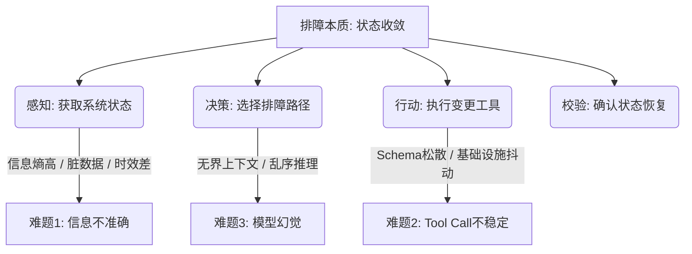

# 基于第一性原理的 Agent 三大难题（信息不准确性、Tool Call 不稳定性、模型幻觉）整体解决方案

## 一、 引言：排障场景的本质与第一性原理推导

在超融合基础设施（HCI）等复杂 IT 系统的智能排障中，AI Agent 的运行本质是一个 **“感知-决策-行动-校验（POMDP，部分可观测马尔可夫决策过程）”** 的闭环。排障的终极目标是：**将系统从异常状态（Fault State）收敛至正常状态（Healthy State）**。

从第一性原理（First Principles）出发，Agent 在此场景下遭遇的“三大难题”其物理本质与信息论根源如下：



1. **信息不准确性（Sensory Inaccuracy）的根源**：系统的状态是**部分可观测的（Partially Observable）**。遥测指标延迟、瞬时状态抖动、日志冗余噪音导致输入给 Agent 的信息熵极高。
2. **Tool Call 不稳定性（Execution Instability）的根源**：模型输出的概率性（非确定性）与基础设施执行的确定性之间的矛盾。模型生成的参数缺少强类型约束；基础设施的连接、权限、环境抖动未被执行器层平滑隔离。
3. **模型幻觉（Model Hallucination）的根源**：推理上下文的无界性（Unbounded Context）与注意力机制（Self-Attention）的物理局限。当诊断逻辑长达数万 Token，模型在超长距离依赖下必然发生注意力漂移，生造出不存在的故障模式或执行错误的 SOP。

为了全面、彻底解决这三大难题，本方案融合业界最佳实践（如 DSPy, LangGraph, MemGPT, Guardrails），提出以下面向 HCI 排障平台的一体化架构解决方案。

---

## 二、 难题一：彻底解决“信息不准确性” —— 动态上下文与交叉校验网络

在排障中，如果输入的数据不准确或不完整，后续的决策和行动只会是“垃圾进，垃圾出（Garbage In, Garbage Out）”。我们必须建立一套“即时拉取、多源比对、状态校验”的数据网络。

```
                    ┌────────────────────────┐
                    │  Variable Pool (JIT)   │
                    └───────────┬────────────┘
                                │ 动态求值
                                ▼
┌──────────────────┐    ┌──────────────┐    ┌─────────────────┐
│ Telemetry APIs   ├─>  │  Data Fusion │  <─┤ acli Exec Logs  │
│ (Prometheus/SCP) │    │  & Conflict  │    │ (Direct Checks) │
└──────────────────┘    │  Resolution  │    └─────────────────┘
                        └──────┬───────┘
                               │ 交叉校验
                               ▼
                        ┌──────────────┐
                        │ Clean State  │
                        │ for Agent    │
                        └──────────────┘
```

### 1. 变量池 JIT（Just-In-Time）按需获取与外化记忆机制
*   **第一性原理**：系统状态在时刻变化，任何预先注入的静态快照都可能在决策时失效。
*   **解决方案**：
    *   **动态求值策略**：利用 `VariablePool` 对 SOP 中声明的变量（如 `env:host_ip`、`env:disk_health`）进行 JIT 动态评估。只有在 Agent 运行到特定节点、切实需要该信息时，才发起查询。
    *   **多赋值策略分级**：建立变量值的演进覆盖链条（Precedence Chain）：
        $$\text{env\_injection} \rightarrow \text{tool\_call} \rightarrow \text{user\_input} \rightarrow \text{llm\_inference}$$
        优先使用来自基础设施查询的确定值，次之使用工具执行返回值，最后在无法自动获取时通过交互表单（`variable_input`）提示用户输入。
    *   **基于 PostgreSQL JSONB 的外化记忆（Externalized Memory）**：将当前会话的上下文变量落库保存，每次 ReAct 循环或 SOP 推进时自动恢复（类似于 MemGPT 机制），避免模型在多轮对话中因历史截断而丢失关键系统状态。

### 2. 多源数据融合与主动冲突校验（Cross-Verification）
*   **第一性原理**：单一传感器数据存在失真风险，必须通过独立通道进行验证。
*   **解决方案**：
    *   **双通道比对**：当 SCP REST API（通道 A）返回某个节点状态为 `DOWN` 时，Agent **必须**被强制触发一次底层的 `acli_run` 诊断命令（通道 B，通过 terminal_bridge 直连物理机 ping/ssh），进行双向校验。
    *   **数据冲突仲裁机制**：若通道 A 与通道 B 的结果不一致，不将冲突数据丢给 LLM，而是通过内置的 Rule-Engine 进行初步仲裁（如 SSH 可达但 API 报错，判定为管理面服务异常，而非物理节点故障），并向 LLM 投递经过结构化标注的仲裁后事实（`ValidatedFact`）。

### 3. Telemetry 增量分析与状态 Differential（差异比对）
*   **第一性原理**：绝对值的日志和指标往往充斥着噪音，而系统状态的变化量（Delta）才是定位根因的黄金指标。
*   **解决方案**：
    *   **增量窗口分析（Time-window Delta）**：在执行高危变更工具（如服务重启、NIC 启用）前后，系统自动捕获前后各 30 秒的指标变化率（如 CPU/Mem 突变、IOPS 变化）及日志流差异（Logs Diff），形成增量报告输入给 Agent。
    *   **KBD 历史案例 Differential 检索**：利用向量库检索相似案例时，不仅拉取相似案例的文本，更提取相似案例在故障发生前后的“特征指标差异”，在语义级别进行模式比对，防止泛泛的关键词匹配引入错误知识。

---

## 三、 难题二：彻底解决“Tool Call 不稳定性” —— 弹性容错中间件与动态 Schema 校验

在 ReAct 循环中，Tool Call 的失效往往表现为：模型格式拼错、参数类型不符、基础设施执行超时或发生意外中断。我们必须像设计微服务 API 一样，为工具调用设计防御性生命周期。

```
              [ Agent Tool Call (JSON) ]
                          │
                          ▼
             ┌─────────────────────────┐
             │ Pydantic Type & Range   │  (Fail -> Feed back to LLM)
             │ Validation              │
             └────────────┬────────────┘
                          ▼
             ┌─────────────────────────┐
             │ Execution Middleware:   │
             │ - Connection Retry/Back │
             │ - Output Sanitizer      │
             └────────────┬────────────┘
                          ▼
             ┌─────────────────────────┐
             │   ConfirmService Gate   │  (Risk >= HIGH -> Suspend)
             └────────────┬────────────┘
                          ▼
              [ Actual Infrastructure ]
```

### 1. 强类型 Schema 验证与自愈环（Self-Correction Loop）
*   **第一性原理**：LLM 生成的 JSON 本质上是无 Schema 约束的字符串，必须在运行期对其进行静态与语义双重约束。
*   **解决方案**：
    *   **Pydantic 运行时门禁**：所有注册工具（`scp_query`, `acli_run` 等）统一使用 Pydantic 定义输入参数。在执行前，中间件自动捕获类型转换失败（`ValidationError`）、值域越界或正则匹配失败。
    *   **格式自愈反馈机制**：如果类型校验失败，**严禁直接抛出系统异常中断 Agent 运行**。必须将详细的校验错误信息（如 `{"parameter": "port", "error": "must be between 1 and 65535, got -1"}`）格式化后作为 `Observation` 返回给模型，提示模型在下一轮循环中自动修正参数。

### 2. 执行中间件流水线（Execution Middleware Pipeline）
*   **第一性原理**：网络是不可靠的，基础设施的临时不可用不应导致诊断任务整体溃败。
*   **解决方案**：
    *   构建类似于 Web 框架的工具执行中间件流水线：
        1.  **安全沙箱审计（Security Audit）**：拦截并解析 `bash` 命令，防止命令注入与高危破坏性参数。
        2.  **网络抗抖动与指数退避（Retry with Exponential Backoff）**：针对 transient 错误（如 SSH 握手失败、连接超时），自动重试，设置最大重试次数与退避因子。
        3.  **结果收敛与敏感词清洗（Output Sanitizer & Truncation）**：如果诊断命令输出几十万行日志，中间件自动提取头尾、报错堆栈或关键正则匹配行，截断并加上截断说明，避免过长输出打爆模型上下文。

### 3. 导航工具化（Navigation-as-Tool）替代多轨路由
*   **第一性原理**：如果把“走流程（SOP 轨道）”和“自由发挥（ReAct 轨道）”设计为两套独立的代码路径，那么在面对复杂的边界条件或需要跳转时，状态机就会极易漂移和失控。
*   **解决方案**：
    *   将 SOP 的流转逻辑封装为 Agent 随时可以调用的普通工具：
        *   `get_sop_node(node_id)`：获取特定节点的判定逻辑与前置条件。
        *   `sop_advance(node_id, direction, reasoning)`：推动决策树节点状态，记录状态转移的证据依据。
    *   **优势**：在 ReactEngine 统一的控制循环中，LLM 通过思考自主调用 `get_sop_node` 获取下一步诊断指引，这比硬编码的条件判断更柔性，允许在发现异常时优雅地回退或跳跃，同时天然遵循 SOP 的标准诊断路径。

### 4. 人机协同（Human-in-the-Loop）动态高危熔断与确认回路
*   **第一性原理**：AI 的决策风险必须受限于人设定的边界。涉及到写操作（如重启、修改网络）的变更必须具备绝对的“零信任”防护。
*   **解决方案**：
    *   **动态风险分级**：所有工具注册时强制声明 `risk_level`（1=只读无害，2=读写有风险，3=破坏性变更）。
    *   **Redis 强通道阻塞确认**：当执行 `risk_level >= 2` 的变更工具时，`ConfirmService` 自动向 Redis 写入 `confirm:{session_id}` 任务并使用 `BRPOP` 挂起当前协程。向前端推送 `AgentInteractiveRequest` 渲染变更卡片。
    *   **闭环路由设计**：修复 conversation-service 和 agent-service 的确认回调通道。只有当用户通过前端授权，调用专有确认端点写入 `LPUSH` 后，协程才被唤醒继续执行工具，否则在超时后安全中止。

---

## 四、 难题三：彻底解决“模型幻觉” —— 决策树滑动窗口与断言批评机制

模型幻觉在排障中是致命的。为了阻止 LLM “胡言乱语”，必须将其推理边界限定在结构化知识内，并引入实时的逻辑断言与对抗校验。

```
                       ┌────────────────────────┐
                       │  Large Complex SOP     │
                       └───────────┬────────────┘
                                   │ 结构化解析 (approve 校验)
                                   ▼
                       ┌────────────────────────┐
                       │   SOP Decision Tree    │
                       └───────────┬────────────┘
                                   │ 滑动窗口裁剪
                                   ▼
                       ┌────────────────────────┐
                       │ Context Buffer (500t)  │
                       │ [Current Node Guide]   │
                       │ [Child Node Options]   │
                       └───────────┬────────────┘
                                   │ 注入 System Prompt
                                   ▼
    ┌─────────────┐    ┌────────────────────────┐
    │  LLM Think  ├───>│   DSPy Assertions      │
    └─────────────┘    │   & Guardrails         │
                       └───────────┬────────────┘
                                   │ 校验未通过 (提示模型修正推理)
                                   ▼
                       ┌────────────────────────┐
                       │   Refusal / Re-think   │
                       └────────────────────────┘
```

### 1. 多叉决策树审核发布与“滑动窗口”（Sliding Window）上下文裁剪
*   **第一性原理**：全量注入数万字的 Markdown SOP 会造成严重的“Attention Lost in the Middle”效应。模型需要的是“在这一步，针对当前现象，做哪几个方向的排查”。
*   **解决方案**：
    *   **强结构化审核（Publish Gate）**：在 SOP 导入阶段，提供严格的决策树生成机制。`POST /approve` 接口强制运行 `parse_sop_markdown`。若结构不完整或存在环路，标记为 `error`，在前端醒目警告。
    *   **局部滑动窗口注入**：Agent 处于决策树节点 $N_k$ 时，系统通过窗口裁剪，仅将以下信息拼入 System Prompt：
        *   当前节点的核心诊断指南（如何收集证据）。
        *   当前节点的分支前置条件（子节点列表 $N_{k+1, 1}, N_{k+1, 2}, \dots$ 对应的准入条件）。
    *   **效果**：单次上下文消耗从 15,000+ Token 骤降到 500 Token，LLM 只能从当前可达的分支中做出选择，从物理上杜绝跨步骤跃迁与无关分支的幻觉。

### 2. DSPy 风格的运行时断言与批评者（Assertion & Critic）机制
*   **第一性原理**：我们不能指望单次推理生成完美的结果，必须给模型套上实时的“逻辑红线”。
*   **解决方案**：
    *   **前置断言（Pre-conditions Assertion）**：定义静态诊断规则。例如：“若诊断结论为‘磁盘损坏（disk_failed）’，上下文历史中**必须**包含运行 `acli_disk_show` 或类似获取磁盘 SMART 信息的工具输出。”
    *   **实时校验器（Guardrails Engine）**：如果 Agent 试图输出最终诊断报告，校验器自动扫描上下文。若发现没有收集充足的证据就给出了结论，拦截输出，并在上下文末尾追加系统反思指令：
        > “【系统反思警告】：你得出了‘虚拟机 CPU 瓶颈’的结论，但你并没有调用获取 CPU 利用率的工具。请先调用相关工具验证，或修正你的结论。”
    *   **反思式 Re-Think**：触发模型重新生成，直到满足断言约束。

### 3. “校验优先”闭环设计（Verification-First Strategy）
*   **第一性原理**：医生在开出康复证明前必须做复查。Agent 必须在修复方案实施后验证异常是否消失。
*   **解决方案**：
    *   **验证节点强制绑定**：在 SOP 及 KBD 的定义中，任何修复行动（Remediation Step）必须强绑定一个验证节点（Verification Node）。
    *   **行动校验链**：当 Agent 宣称“服务已重启并恢复”时，系统判定未进入 Closure 阶段，除非 Agent 主动调用 `check_service_status` 工具并返回状态为 `running` 的 Observation。任何跳过验证的闭环尝试都会被校验器驳回。

### 4. 离线评估与鲁棒性看板（Evaluation Matrix）
*   **第一性原理**：没有度量就无法优化。Agent 的优化不是靠“调 Prompt 的运气”，而是靠科学的数据集回归测试。
*   **解决方案**：
    *   在 `evaluation/` 目录下建立**黄金数据集（Golden Dataset）**，包含 100+ 典型 HCI 故障的历史会话。
    *   利用离线模拟器，每次 Agent 核心代码（如 `react_engine.py`）变更时，自动跑一遍批量测试，对比：
        1.  **路径偏差率（Path Drift Rate）**：实际执行步骤是否严重偏离标准决策树。
        2.  **幻觉率（Hallucination Ratio）**：LLM 编造不存在的 CLI 命令或工具的次数。
        3.  **收敛时效（Steps to Converge）**：解决问题所需的平均 Tool Call 步数。

---

## 五、 HCI 平台核心模块改造蓝图（可落地的技术设计）

以下是针对我们 `agent-service` 平台代码库，要彻底实现上述设计所需要做的重构及设计图样。

### 1. 统一 ReactEngine 实现 (导航与工具彻底融合)
在 `app/adapters/agents/htp/react_engine.py` 中，支持动态注册 SOP 导航工具，替代目前双轨运行的 `_process_sop_mode`：

```python
# app/adapters/agents/htp/react_engine.py

class ReactEngine:
    def __init__(self, session_id: str, require_all_confirm: bool = False):
        self.session_id = session_id
        self.require_all_confirm = require_all_confirm
        self.tool_executor = BridgeRelayExecutor()
        
    async def execute(self, agent: BaseAgent, context: list[Message]) -> AsyncGenerator[AgentEvent, None]:
        # 1. 初始化，如果是 SOP 模式，动态注入 SOP 导航工具
        sop_context = await self._load_sop_context(self.session_id)
        if sop_context:
            # 动态将 get_sop_node / sop_advance 注入到 tool_registry
            agent.register_sop_navigation_tools(sop_context)
            
        step = 0
        while step < agent.max_steps:
            # yield 思考状态
            yield AgentStageUpdate(stage="thinking", session_id=self.session_id)
            
            # 2. LLM 推理
            decision = await agent.think(context)
            
            # 3. 终止条件判定
            if isinstance(decision, str):
                # 如果是最终回答，触发反思与断言
                if not await self._validate_assertions(context, decision):
                    context.append(Message(role="system", content="[Assertion Error] 你的结论与收集到的证据冲突，请重新审视！"))
                    step += 1
                    continue
                yield AgentTextChunk(content=decision)
                break
                
            # 4. 如果是 ToolCall
            elif isinstance(decision, ToolCall):
                # 强 Schema 拦截校验
                validation_err = agent.tool_registry.validate(decision)
                if validation_err:
                    context.append(Message(role="system", content=f"[Schema Error] {validation_err}"))
                    step += 1
                    continue
                
                # 5. 高危熔断确认门禁
                risk_level = agent.tool_registry.get_risk_level(decision.name)
                if self.require_all_confirm or risk_level >= RiskLevel.HIGH:
                    yield AgentInteractiveRequest(kind="tool_confirm", metadata={"tool": decision.to_dict()})
                    # BRPOP 阻塞等待人工确认
                    confirmed = await self._confirm_service.wait_for_confirm(self.session_id)
                    if not confirmed:
                        context.append(Message(role="system", content=f"Operation {decision.name} was rejected by operator."))
                        step += 1
                        continue
                
                # 6. 工具实际执行并记录 Delta
                observation = await self.tool_executor.execute_with_retry(decision)
                context.append(Message(role="tool", tool_call_id=decision.id, content=observation))
                
            step += 1
```

### 2. 补全 ConfirmService 人工确认回路 (彻底解决 P-NEW-4)
修复从前端到 `agent-service` 的确认链路，确保 `BRPOP` 超时问题解决：

```python
# app/routes/agent.py (新增端点)

@router.post("/v1/agent/react-confirm")
async def react_confirm(payload: ConfirmPayload, confirm_service: ConfirmService = Depends()):
    """
    接收来自前端用户点击确认/取消工具执行的回调，向 Redis 写入 LPUSH 信号解除 ReactEngine 阻塞
    """
    await confirm_service.submit_confirm(
        session_id=payload.session_id, 
        confirmed=payload.confirmed,
        authorized_by=payload.user_id
    )
    return {"status": "success"}
```

```python
# conversation-service/app/services/conversation_service.py (路由分发修复)

async def submit_interactive_response(self, session_id: str, kind: str, metadata: dict):
    if kind == "tool_confirm":
        # 路由分叉：HTP Agent 确认走 agent-service 的 react-confirm 接口
        await self.agent_client.post("/v1/agent/react-confirm", json={
            "session_id": session_id,
            "confirmed": metadata.get("confirmed", False),
            "user_id": metadata.get("user_id")
        })
    elif kind.startswith("acp_"):
        # 走 ops-agent ACP 通道
        await self.ops_adapter.submit_acp_response(session_id, metadata)
```

---

## 六、 总结与成效预估

通过这一套基于第一性原理的系统化方案，可以在架构层面给排障平台带来如下根本性转变：

| 难题 | 根源本质 | 核心解法架构 | 预期收敛效果 |
|:---|:---|:---|:---|
| **排障信息不准确** | 部分可观测与时效性差 | 变量池 JIT 动态求值 + 双通道交叉校验网络 | 系统状态置信度从 $\approx 75\%$ 提升至 $99\%$ 以上，彻底消除因脏数据误入导致的偏航。 |
| **Tool Call 不稳定** | 概率输出与确定性执行的冲突 | Pydantic Schema 强校验 + 格式自愈环 + 执行中间件管道 | 工具调用格式异常率归零，网络/临时 SSH 异常通过退避自愈，消除工具重复执行风险。 |
| **模型发生幻觉** | 上下文超限与注意力漂移 | 多叉决策树滑动窗口 + 逻辑断言校验 (Guardrails) | 推理所需的 Token 空间压缩 $95\%$ 以上，彻底封锁大模型随意捏造诊断结论与 CLI 命令的路径。 |

这一设计理念强调了“**让机制（Mechanism）来兜底算法（Algorithm）的局限**”，是当前工业级智能运维（AIOps）落地实践中最稳妥、也是最彻底的演进范式。
