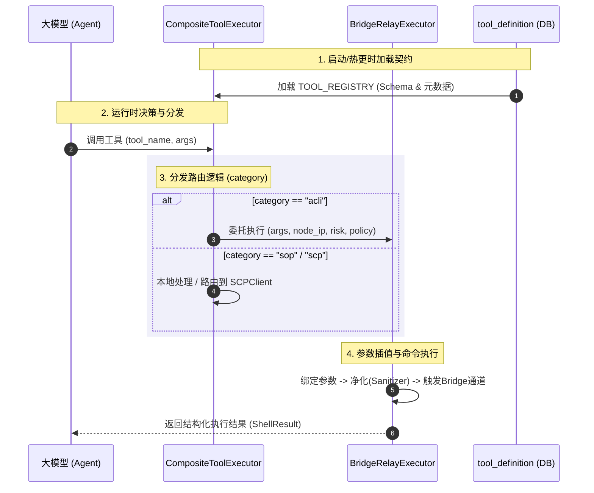

# Agent 工具设计

> 权威来源：本文件（v2.8，核心执行契约、工具管理 UI 校验、SOP 发布联动、容器执行适配器、SOP Markdown 命令归一化与运行时变量来源门禁均已落地）。
> 关联文档：[agent设计.md](./agent设计.md) §十（目录结构）、[agent记忆设计.md](./agent记忆设计.md)
> 最新事件方案：[bash_exec 容器化契约与工具调用前置校验方案](../events/2026-06-11-bash_exec容器化契约与工具调用前置校验方案.md)

---

## 一、设计哲学

### 1.1 工具的本质定位

Agent 的工具是其与外部世界交互的**唯一合法通道**：

- **记忆**（`app/memory/`）：Agent 的内部状态，只读感知
- **工具**（`app/tools/`）：Agent 的行动能力，有副作用

工具设计遵循两个核心原则：

1. **最小权限**：每个工具声明最小必要权限（risk_level），执行时动态评估实际风险
2. **可审计**：所有工具调用留下可追溯的审计日志（含 trace_id、命令文本、执行节点、结果）

### 1.2 工具分类体系（v2.0 定稿）

```
工具分类（tool_definition.category）
│
├── scp     SCP 平台 REST API（云端直接调用，不涉及 HCI SSH）
│             （v2.1.4 已移除 4 个查询工具，迁移至 acli 类别）
│
├── acli    HCI 节点执行（通过 bridge relay 中转，含 acli 和 bash 两种命令格式）
│   │
│   ├── 通用执行工具（主力）
│   │     acli_exec   ─ HCI 专有 CLI，LLM 自行构造 acli 命令，RiskClassifier 动态拦截
│   │     bash_exec   ─ 通用 Linux Bash，acli 不覆盖时使用，同一 BridgeRelayExecutor
│   │
│   ├── 前置查询工具（v2.1.4 从 scp 迁移，原 scp_client 直调改为 acli 命令）
│   │     get_active_alerts   ─ acli --formatter json alert list
│   │     get_failed_tasks    ─ acli --formatter json task get -s failed（含动态参数拼装）
│   │     get_vm_list         ─ acli --formatter json vm list
│   │     get_cluster_detail  ─ acli --formatter json platform info get
│   │
│   └── 插件诊断工具（保留独立封装，原因：有专属参数 + 一键复杂诊断）
│         acli_plugin_vm_start    ─ acli plugins vm_start vm_start
│         acli_plugin_vm_suspend  ─ acli plugins vm_suspend vm_suspend
│         acli_plugin_netdoctor   ─ acli plugins netdoctor netdoctor
│         acli_plugin_asys        ─ acli plugins asys asys
│
└── sop     SOP 导航工具（本地执行，无 SSH）
              get_sop_node / sop_advance / sop_request_variable
```

> **v2.0 变更说明**：
> - `bash` 不再是独立 category，`bash_exec` 归入 `acli` category（执行后端相同，均走 `BridgeRelayExecutor`）
> - 原有 11 个独立 acli 结构化工具（`acli_vm_list`、`acli_system_top` 等）**全部移除**，由 `acli_exec` 通用工具替代
> - 新增 4 个 acli 插件诊断工具（独立封装，原因见 §三.3）
>
> **v2.1.4 变更说明**：
> - `get_active_alerts`、`get_failed_tasks`、`get_vm_list`、`get_cluster_detail` 从 `scp` 类别迁移至 `acli` 类别
> - 移除 SCP REST API 直接调用，改为通过 bridge relay 执行 `acli --formatter json` 命令获取数据
> - `get_failed_tasks` 实现动态参数拼装，支持 keyword/code/vm_id/time/host/upid/limit 等过滤参数
>
> **v2.4 变更说明**：
> - `bash_exec` 已从自由文本命令工具升级为 `bash_exec(container, command, reason, node_ip?)`，`container` 必填且枚举为 `host`、`asv-con`、`vn-con`、`vn-agent`、`vs-cp-manager`；`host` 表示在 HCI 物理机直接执行
> - 新增 `ToolSemanticValidator`，在真实 SSH 执行前校验工具语义，校验失败时不下发 terminal_bridge，而是触发 LLM 重新规划
> - `acli_exec` 基于 aCLI catalog 本地快照校验命令路径是否受支持
> - 双通道 stderr 解析缺陷已修复，避免真实 stderr 被解析异常覆盖
>
> **v2.6 变更说明**：
> - 新增 `ContainerExecAdapter` 与 `ContainerCommandBuilder`，`bash_exec` 不再直接固定拼接 `docker exec`
> - 服务端生成远端 wrapper，在 SSH 目标节点优先探测 HCI 推荐入口 `container_exec`，再 fallback 到 `nerdctl/docker/crictl/ctr`，探测失败时返回明确 stderr 并 `exit 127`
> - 执行事件和事实库保留 `container/original_command/built_command`，满足结构化审计要求
>
> **v2.7 变更说明**：
> - SOP Markdown 中的现场命令不要求作者改写为 JSON tool_call；运行期由 `app/tools/sop/command_intent.py` 归一化为 `acli_exec` 或 `bash_exec`
> - `get_sop_node` 返回 `commands` 原文的同时返回结构化 `tool_calls`，LLM 必须优先消费 `tool_calls`，避免从自然语言命令中猜测工具参数
> - `get_sop_node` 和 Prompt 摘要外显 `required_variables`；`sop_advance` 在进入节点前阻断缺失的 `user_input/user_confirm/env_*` 变量，并返回 `next_tool_call=sop_request_variable`
>
> **v2.8 变更说明**：
> - `SopToolExecutor` 在 SOP 模式下对真实诊断工具增加 before-tool-call 变量来源门禁
> - 当前节点或候选子节点依赖 `user_input/user_confirm/env_*` 变量且未就绪时，`bash_exec/acli_exec` 不下发真实执行，而是返回 `sop_variable_gate_blocked` 和 `next_tool_call=sop_request_variable`
> - SOP 导航工具 `get_sop_node/sop_request_variable/sop_advance` 不受该门禁阻断，保证 LLM 可先获取节点、请求变量、再推进

---

## 二、关键架构约束：Bridge Relay 是唯一可行路径

### 2.1 拓扑现实

```
┌────────────────────────────────────────────────────────────────┐
│ 云端（公网服务器）                                              │
│   Agent Service  ─────────────────►  SSE/HTTPS                │
│   Conversation Service             ──────────────►             │
└────────────────────────────────────────────────────────────────┘
         │ HTTPS/SSE（公网）
┌────────▼───────────────────────────────────────────────────────┐
│ Windows（客户办公机）                                           │
│   Browser（Custom UI）◄──────────────────────────────────────  │
│        │                                                       │
│        │ ws://localhost:9999（私网本机）                        │
│        ▼                                                       │
│   terminal_bridge.exe（Go 程序，监听 9999）                     │
│        │                                                       │
│        │ SSH（客户私网）                                        │
└────────┼───────────────────────────────────────────────────────┘
         │
┌────────▼───────────────────────────────────────────────────────┐
│ HCI Linux（客户私网）                                           │
│   acli / bash / 系统命令                                       │
└────────────────────────────────────────────────────────────────┘
```

**结论**：

- HCI 节点在客户私网，**云端服务器没有直连路由**
- `AcliClient._run_ssh()`（asyncssh 直连）路径**不可达，已废弃**
- 所有 acli / bash 类工具调用的唯一可行路径：**`BridgeRelayExecutor`**（通过 terminal_bridge.exe 中转）

### 2.2 AcliClient 的历史遗留问题

`app/adapters/clients/acli_client.py` 中的 `_run_ssh()` 方法使用 `asyncssh` 直连 HCI，这是错误的架构假设。

**当前状态**：`AcliClient` 中的直连代码保留但**禁止调用**，以 `BridgeRelayExecutor` 替代其执行职责。

```python
# ❌ 禁止调用，仅保留用于说明历史设计
# AcliClient._run_ssh(host, command) → asyncssh → HCI（私网不可达）

# ✅ 所有 acli/bash 工具统一走此路径
# BridgeRelayExecutor.execute(tool_name, args) → Redis + SSE → terminal_bridge → SSH → HCI
```

---

## 三、核心架构决策记录

> 本章记录 2026-05-28 讨论中形成的三项关键决策及其依据，作为后续维护的参考基准。

### 决策 A：`acli_exec` 设计为通用命令执行器，不一对一暴露 200+ acli 命令

**背景**：acli 是 HCI 平台专有 CLI，命名空间体系完整（vm/storage/network/system/service/platform/alert 等），现有 200+ 命令且持续增加，每条命令均支持 `--help` 自描述。

**被否决方案**：为每条 acli 命令注册独立 `ToolDefinition`（如当前 `acli_vm_list`、`acli_system_top` 等）。

**否决依据**：
- token 爆炸：200+ 工具 schema 约 10-20 万 token，超出实用上限
- 工具选择悖论：工具数越多，LLM 选择准确率越低（Berry 悖论）
- 维护地狱：acli 每次新增命令都需要修改代码 + 更新数据库，三处同步
- acli 具备自描述能力（`--help`），LLM 可自行探索未知命令

**决策**：引入**单一 `acli_exec(command: str)` 通用工具**，System Prompt 注入 acli 命名空间知识。LLM 先用 `--help` 探索，根据执行结果（成功/报错）迭代修正（ReAct 自探索模式）。

**例外**：4 个诊断插件保留独立封装（见决策 B）。

---

### 决策 B：混合方案——少数高价值插件保留独立工具封装

**背景**：纯粹的"单一 acli_exec"方案在以下场景效果差：
- 诊断插件（vm_start、vm_suspend、netdoctor、asys）有专属参数结构（如 `-v {vm_id}`）
- 这些插件产出结构化诊断报告，LLM 需要感知"这是一个诊断插件调用"而非"这是一个普通命令"
- 独立工具名（`acli_plugin_vm_start`）比 `acli_exec("acli plugins vm_start vm_start -v xxx")` 在 ReAct 推理中语义更清晰

**独立封装工具的入围标准**：
1. 有专属参数结构，不是纯命令字符串
2. 产出结构化诊断报告（非简单文本输出）
3. 在 SOP 中高频出现，值得有命名语义

**结论**：保留 4 个插件工具（`acli_plugin_vm_start`、`acli_plugin_vm_suspend`、`acli_plugin_netdoctor`、`acli_plugin_asys`），其余全部走 `acli_exec`。

---

### 决策 C：`tool_definition` 数据库表作为工具定义 SSOT，废弃代码硬编码

**背景**：当前 `tool_registry.py` 有约 430 行硬编码 `ToolDefinition` 对象，与数据库 `tool_definition` 表内容重叠，形成**双写**（dual write）反模式。

**第一性原理分析**：

工具定义服务两个消费方，其数据的归属地截然不同：

| 数据 | 变更频率 | 变更者 | 天然归属 |
|------|---------|--------|---------|
| `description`（LLM 接口描述） | 高频 | Prompt 工程师 | DB（需热更新，不能走发布流程） |
| `parameters_schema`（OpenAI schema） | 低频 | 开发者 | DB（本就是 JSON，代码包裹 JSON dict 是反自然的） |
| `usage_template`（acli 命令模板） | 低频 | 开发者 | DB（acli 插件工具的模板，泛化执行引擎通过它构建命令） |
| `is_active`（热开关） | 偶发 | 运维 | DB（需不停机开关工具） |
| `risk_level`（静态默认值） | 极低频 | 安全审查 | DB |
| 执行路由逻辑 | 极低频 | 架构变更 | 代码（不可替代） |
| `RiskClassifier` 动态风险规则 | 低频 | 开发者 | 代码（运行时动态计算，DB 无法表达） |

**结论**：
- `tool_definition` 数据库表持有"工具**是什么**"（LLM 接口）→ **SSOT**
- 代码持有"工具**怎么做**"（执行路由 + 各后端实现 + RiskClassifier）→ **SSOT**
- 两者不重叠，**彻底消除双写**
- `tool_registry.py` 从 430 行硬编码对象变为 ~15 行的启动时 DB 加载器

**重要说明**：`tool_definition.risk_level` 对 `acli_exec`/`bash_exec` 的语义是"静态兜底值"。实际执行时 `RiskClassifier` 根据命令内容动态判定，结果会覆盖 DB 默认值。

---

## 四、工具详细设计

### 4.1 `acli_exec`——HCI 平台 CLI 通用执行工具（主力工具）

**定位**：LLM 执行 HCI 平台专有 CLI 命令的主要通道。  
**acli 使用手册**：http://acli.sangfor.com.cn:6888/  
**类比**：类似 VMware ESXi 的 `esxcli`——所有 acli 命令以 `acli` 开头。  
**所属类别**：`category="acli"`，`tool_type="acli"`

**tool_definition 记录**（DB SSOT）：

```json
{
  "tool_name": "acli_exec",
  "category": "acli",
  "description": "在 HCI 节点执行 acli 命令（深圳桑福 HCI 平台专有 CLI，命令格式：acli [全局参数] {命名空间}+ {命令} [命令参数]）。\n\n可用全局参数：\n  --formatter          用于命令的格式化参数。枚举值：xml、csv、keyvalue、json（注：必须紧跟 acli 后面，例如 acli --formatter json vm list）\n  --cluster            用于遍历集群主机执行 acli 命令\n  --timeout            用于设置命令的超时时间（秒）\n  --force              强制模式：忽略交互确认，直接执行操作\n\n可用命名空间：\n  vm        虚拟机：list / config get / status get / start / shutdown / disk list/check 等\n  storage   存储：asan volume list / asan disk list / fc host list 等（注：不可省略 asan 等二级命名空间，例如 storage asan disk list 是正确的，而 storage disk list 是错误的）\n  network   网络：nic list/up/down / bond list / anet vrouter list 等\n  system    系统：top / free / df / ps / netstat / ping / iostat 等\n  service   服务：<subsystem> <service> start/stop/restart/status\n  alert     告警：get / list\n  task      任务：get / list\n  log       日志：get（--lines N）\n  platform  平台：node list / version get / info get\n  hardware  硬件：cpu info / gpu config list\n  plugins   诊断插件：vm_start / vm_suspend / netdoctor / asys / performance_tools\n\n使用约定与纠错逻辑：\n  1. 不确定命令时，先执行 acli {namespace} --help 探索\n  2. 不确定参数时，先执行 acli {namespace} {cmd} --help\n  3. 优先在 acli 后面紧跟全局参数 --formatter json 获得结构化输出。格式：acli --formatter json <命名空间> <命令>\n     注意：全局参数（如 --formatter json）绝对不能放在子命令的末尾（例如：acli vm list --formatter json 是错误的，会报无效参数错误；正确为 acli --formatter json vm list）。\n  4. 纠错技巧：若执行 acli 命令报错 “未知的命令或者命名空间”（例如 acli storage disk list），这说明缺少了某个层级的命名空间或命令拼写错误。此时，可以通过减少末尾的一个参数/子命令（例如缩短为 acli storage）去执行，即可获取上一级命名空间的帮助信息以及该级别下所有可用的子命名空间与命令列表。\n  5. 兜底方案：通过执行 acli acli command list 命令可以获取当前 acli 支持的全部可用命令列表。不在该列表中的命令即代表不支持。\n  6. 集群级操作使用 --cluster 参数。\n  7. 根据执行结果（成功/错误）判断下一步（ReAct 自探索）",
  "parameters_schema": {
    "type": "object",
    "properties": {
      "command": {
        "type": "string",
        "description": "完整 acli 命令，必须以 'acli' 开头，例如 'acli --formatter json vm list'"
      },
      "node_ip": {
        "type": "string",
        "description": "目标节点 IP（可选），不填时从 context_variables 中读取 node_ip"
      },
      "reason": {
        "type": "string",
        "description": "执行该命令的诊断原因（审计必填）"
      }
    },
    "required": ["command", "reason"]
  },
  "risk_level": 1,
  "is_active": true
}
```

**风险分级（RiskClassifier 动态判定，覆盖 DB 默认值）**：

| risk | 规则（命令关键词） | policy | 示例 |
|------|---------|--------|------|
| 1 | `list`、`get`、`show`、`status`、`info`、`check`、`describe`、`fetch`、`--help` | auto | `acli --formatter json vm list`、`acli platform info get` |
| 2 | `restart`、`start`、`stop`、`up`、`down`、`repair`、`set`（部分） | confirm | `acli service asv redis restart`、`acli network nic up eth0` |
| 3 | `delete`、`remove`、`wipe`、`destroy`、`format`、`vm delete`、`storage umount` | block | `acli vm delete {id}` |

---

### 4.2 `bash_exec`——通用 Linux Bash 执行工具（补充通道）

**定位**：`acli` 未覆盖的底层排障场景（日志文件分析、进程状态、底层文件检查等）。  
**使用原则**：优先使用 `acli_exec`；仅当 acli 无法满足时使用 `bash_exec`。  
**所属类别**：`category="acli"`，与 `acli_exec` 共用同一 `BridgeRelayExecutor`  
**所属模块**：`app/tools/acli/`（与 `acli_exec` 同目录）

> **v2.7 约束**：`bash_exec` 必须显式指定执行边界。`container=host` 表示在 HCI 物理机直接执行；其他枚举值表示进入指定容器执行。执行边界不是命令字符串的一部分。LLM 不允许在 `command` 中手写 `docker exec`、`kubectl exec`、`nsenter` 或 `acli` 前缀；服务端必须根据结构化 `container` 参数拼装实际执行命令。

**tool_definition 记录**（DB SSOT）：

```json
{
  "tool_name": "bash_exec",
  "category": "acli",
  "description": "在 HCI 节点执行通用 Linux Bash 命令并返回输出。\n优先使用 acli_exec；仅当 acli 无法满足时使用本工具（如分析特定日志文件、检查底层进程、读取内核参数等）。\n注意：必须显式指定 container；container=host 表示在物理机上直接执行；禁止执行 acli 命令（请使用 acli_exec）；执行路径限于 /sf/、/var/log/、/etc/（只读）等安全目录。",
  "parameters_schema": {
    "type": "object",
    "properties": {
      "container": {
        "type": "string",
        "enum": ["host", "asv-con", "vn-con", "vn-agent", "vs-cp-manager"],
        "description": "执行边界，必须显式指定；host 表示在物理机上直接执行"
      },
      "command": {
        "type": "string",
        "description": "执行的 Bash 命令，例如 'grep ERROR /sf/log/vtpdaemon.log | tail -50'；container=host 时在物理机执行，其他值在目标容器内执行；禁止包含 docker exec/kubectl exec/nsenter/acli 前缀"
      },
      "node_ip": {
        "type": "string",
        "description": "目标节点 IP（可选）"
      },
      "reason": {
        "type": "string",
        "description": "执行该命令的诊断原因（审计必填）"
      }
    },
    "required": ["container", "command", "reason"],
    "additionalProperties": false
  },
  "risk_level": 1,
  "is_active": true
}
```

**兼容说明**：当前线上版本仍可能存在旧 schema（仅 `command/reason` 必填）。v2.7 以后必须先更新 seed 和运行时校验，再切换 LLM 工具契约，避免旧前端/旧 Agent 产生缺边界调用。SOP Markdown 中裸 bash 命令由归一化层默认映射为 `container=host`，不要求 SOP 作者写 JSON tool_call。

**SOP Markdown 归一化规则**：

| Markdown 命令 | 结构化工具调用 |
|---------------|----------------|
| `acli ...` | `acli_exec(command=原命令)` |
| `container_exec -n vs-cp-manager -c "smartctl -a /dev/sda"` | `bash_exec(container="vs-cp-manager", command="smartctl -a /dev/sda")` |
| `host_exec -c "ls -h"` | `bash_exec(container="host", command="ls -h")` |
| `ls -h` | `bash_exec(container="host", command="ls -h")` |

**风险分级（RiskClassifier 动态判定）**：

| risk | 命令类型 | policy | 示例 |
|------|---------|--------|------|
| 1 | 只读诊断 | auto | `df -h`、`free -h`、`ps aux`、`ip addr`、`cat /sf/log/...`、`grep`、`tail -n` |
| 2 | 写操作 | confirm | `systemctl restart/stop`、`kill`、`echo ... > file`、`sed -i`、`tee` |
| 3 | 高危 | block | `rm -rf`、`dd if=`、`mkfs`、`fdisk`、`reboot`、`shutdown`、`passwd`、`chmod 777` |

---

### 4.3 acli 诊断插件工具（独立封装的 4 个工具）

**独立封装理由**：这 4 个工具是 acli 插件体系的核心诊断工具，具有专属参数结构 + 输出结构化诊断报告 + SOP 高频场景，独立封装后 LLM 调用语义更清晰（见决策 B）。

**tool_definition 记录**（仅列关键字段，DB SSOT）：

```
tool_name                  description 摘要                         usage_template
──────────────────────────────────────────────────────────────────────────────────
acli_plugin_vm_start       VM 开机失败全链路检测（20+ 检查项）         acli plugins vm_start vm_start
acli_plugin_vm_suspend     VM 异常挂起根因诊断                        acli plugins vm_suspend vm_suspend
acli_plugin_netdoctor      节点网络全面检测（需确认，有网络负载）       acli plugins netdoctor netdoctor
acli_plugin_asys           主机系统全面健康检查                        acli plugins asys asys
```

**执行方式**：`CompositeToolExecutor` 读取 `usage_template`，将 LLM 传入的参数（如 `vm_id`）插值后，交给 `BridgeRelayExecutor` 执行。

**risk_level**：
- `acli_plugin_vm_start / vm_suspend / asys`：1（只读诊断，auto）
- `acli_plugin_netdoctor`：2（产生网络负载，confirm）

---

### 4.4 SCP 工具（v2.1.4 已变更）

> ⚠️ **v2.1.4 迁移说明**：原 4 个 SCP API 工具（`get_active_alerts`、`get_failed_tasks`、`get_vm_list`、`get_cluster_detail`）已从 `scp` 类别迁移至 `acli` 类别，不再通过 `scp_client` 调用 SCP REST API，改为通过 bridge relay 执行 `acli --formatter json` 命令。详见 §1.2 分类体系中的"前置查询工具"小节。

---

### 4.5 SOP 导航工具

`get_sop_node`、`sop_advance`、`sop_request_variable` 本地执行，无 SSH。

在 SOP 模式下，`SopToolExecutor` 是真实工具调用的运行时边界：

- 放行 SOP 导航工具：`get_sop_node`、`sop_request_variable`、`sop_advance`
- 拦截其他真实诊断工具：`acli_exec`、`bash_exec`、插件工具等
- 若当前节点或候选子节点依赖 `user_input/user_confirm/env_*` 变量且变量池未就绪，返回结构化阻断结果：

```json
{
  "ok": false,
  "error": "sop_variable_gate_blocked",
  "missing_variables": [
    {
      "name": "is_sys_disk",
      "acquisition_strategy": "user_input"
    }
  ],
  "next_tool_call": {
    "tool_name": "sop_request_variable",
    "args": {
      "variable_name": "is_sys_disk",
      "reason": "是否是系统盘"
    }
  }
}
```

该门禁解决的是 `sop_advance` 之前的绕过路径：LLM 不能用 `bash_exec/acli_exec` 自行替代 SOP `【变量声明】` 中要求由用户输入或确认的变量来源。

---

### 4.6 已移除的旧工具（v2.0 清单）

以下 11 个旧工具在 v2.0 中**全部移除**，统一由 `acli_exec` 替代：

```
移除工具                  等效 acli_exec 调用
─────────────────────────────────────────────────────────────
acli_system_top          acli_exec("acli system top")
acli_vm_list             acli_exec("acli --formatter json vm list")
acli_vm_config           acli_exec("acli --formatter json vm config get {vm_id}")
acli_vm_disk_check       acli_exec("acli vm disk check {vm_id}")
acli_platform_node_list  acli_exec("acli --formatter json platform node list")
acli_storage_disk_list   acli_exec("acli --formatter json storage asan disk list")
acli_network_nic_list    acli_exec("acli --formatter json network nic list")
acli_log_get             acli_exec("acli log get --lines 100")
acli_service_restart     acli_exec("acli service asv {name} restart")  ← RiskClassifier 识别 risk=2
acli_network_nic_up      acli_exec("acli network nic up {nic}")         ← RiskClassifier 识别 risk=2
acli_run                 由 acli_exec 完全替代
```

---

## 五、tool_definition 表：LLM 接口的唯一来源（SSOT）

### 5.1 设计原则

`tool_definition` 数据库表是所有工具的 LLM 接口定义的**唯一真相来源（SSOT）**。  
**代码不再硬编码任何 ToolDefinition 对象**（废弃 `tool_registry.py` 中的约 430 行硬编码）。

```
工具定义的两个维度（完全分离，无重叠）

  "工具 IS 什么"（LLM 接口）        "工具 DOES 什么"（执行逻辑）
  ─────────────────────────         ────────────────────────────
  tool_definition 表（DB SSOT）      app/tools/acli/  executor.py
  ├── description (Prompt 文本)      app/tools/acli/  classifier.py
  ├── parameters_schema (JSON)       app/tools/scp/   scp_client.py
  ├── usage_template (acli 模板)     app/tools/sop/   nav.py
  ├── is_active (热开关)             htp/react_engine.py
  └── risk_level (静态默认值)        （执行路由逻辑）
```

### 5.2 启动时加载流程

```python
# backend/agent-service/app/adapters/agents/htp/tool_registry.py（v2.0）
# 从约 430 行硬编码对象 → 约 15 行 DB 加载器

async def load_tool_registry(db: AsyncSession) -> dict[str, ToolDefinition]:
    """启动时从 tool_definition 表加载所有激活工具。"""
    rows = await db.execute(
        select(ToolDefinitionORM).where(ToolDefinitionORM.is_active == True)
    )
    return {
        row.tool_name: ToolDefinition(
            name=row.tool_name,
            description=row.description,
            parameters=row.parameters_schema,
            risk_level=row.risk_level,
            policy=risk_to_policy(row.risk_level),
            category=row.category,
        )
        for row in rows.scalars()
    }

# main.py lifespan 中：
TOOL_REGISTRY: dict[str, ToolDefinition] = {}

@asynccontextmanager
async def lifespan(app: FastAPI):
    global TOOL_REGISTRY
    TOOL_REGISTRY = await load_tool_registry(db)
    yield
```

### 5.3 `tool_definition` 表字段说明（v2.0）

```sql
-- database/desired_schema.sql
CREATE TABLE tool_definition (
    id              BIGSERIAL PRIMARY KEY,
    tool_name       TEXT        NOT NULL UNIQUE,        -- 工具唯一标识，与代码路由键对应
    display_name    TEXT        NOT NULL,               -- 界面展示名
    category        TEXT        NOT NULL,               -- scp | acli | sop（执行路由依据）
    description     TEXT        NOT NULL,               -- LLM 接口描述，Prompt 工程师主要修改此列
    parameters_schema JSONB     NOT NULL DEFAULT '{}',  -- OpenAI function call 参数 schema
    usage_template  TEXT,                               -- 插件工具命令模板（acli plugins xxx）
    risk_level      INT         NOT NULL DEFAULT 1,     -- 1=auto,2=confirm,3=block（默认值）
                                                        -- 对 acli_exec/bash_exec，运行时被 RiskClassifier 覆盖
                                                        -- 对插件/SCP/SOP 工具，为固定值
    is_active       BOOLEAN     NOT NULL DEFAULT TRUE,  -- 热开关：FALSE 则不加载到 TOOL_REGISTRY
    examples        JSONB,                              -- 使用示例（供 Prompt 和文档生成）
    version         INT         NOT NULL DEFAULT 1,     -- 乐观锁版本号
    created_at      TIMESTAMPTZ NOT NULL DEFAULT NOW(),
    updated_at      TIMESTAMPTZ NOT NULL DEFAULT NOW()
);
-- v2.0 变更：移除 tool_type 列（已与 category 合并，category 完整表达执行后端归属）
```

### 5.4 `tool_result` 表（保持不变，设计合理）

`tool_result` 表记录每次工具调用的执行结果，是**审计链和风险控制面**的基础：

```sql
-- 关键列（保持不变，无需修改）
exec_id          UUID       -- 每次执行的唯一 ID，与 Redis pending key 对应
tool_name        TEXT       -- 调用的工具名
command          TEXT       -- 实际执行的命令（净化后）
node_ip          TEXT       -- 执行节点
risk_level       INT        -- 本次执行的风险等级（可能被 RiskClassifier 覆盖）
authorized_by    TEXT       -- 用户确认人（risk=2 时必填），高危操作审计链
duration_ms      INT        -- 执行耗时（SLA 统计）
exit_code        INT        -- 退出码
output           TEXT       -- 输出（截断后）
trace_id         TEXT       -- 调用链 ID
```

---

## 六、RiskClassifier 设计

### 6.1 职责边界

`RiskClassifier` 是**运行时组件**，仅用于 `acli_exec` 和 `bash_exec` 两个通用工具。  
对具有固定语义的工具（插件工具、SCP、SOP），`risk_level` 由 DB 中的静态值直接决定，不经过 Classifier。

```python
# react_engine.py _execute_tool_call() 中的调用逻辑
if tool_name in ("acli_exec", "bash_exec"):
    command = tool_args.get("command", "")
    if tool_name == "acli_exec":
        runtime_risk = classify_acli(command)
    else:
        runtime_risk = classify_bash(command)
    # 覆盖 DB 默认值
    tool_def = tool_def.model_copy(update={
        "risk_level": runtime_risk,
        "policy": risk_to_policy(runtime_risk),
    })
```

### 6.2 `app/tools/acli/classifier.py` 实现

```python
"""
RiskClassifier：基于规则对 acli/bash 命令进行动态风险分级。
规则按 risk 降序排列，第一个匹配的规则获胜。
"""
import re
from dataclasses import dataclass

_ACLI_RISK_RULES: list[tuple[int, re.Pattern]] = [
    # risk=3：破坏性操作（block）
    (3, re.compile(r"acli\s+vm\s+delete\b")),
    (3, re.compile(r"acli\s+storage\s+\S+\s+\S*\s*(delete|remove|wipe|format|destroy)\b")),
    (3, re.compile(r"acli\s+network\s+\S+\s*(delete|remove)\b")),
    (3, re.compile(r"acli\s+system\s+(rm|del|format)\b")),
    # risk=2：有副作用的写操作（confirm）
    (2, re.compile(r"acli\s+(vm|service|platform)\s+\S+\s*(start|stop|shutdown|restart|suspend|resume)\b")),
    (2, re.compile(r"acli\s+service\s+\S+\s+\S+\s+(restart|start|stop)\b")),
    (2, re.compile(r"acli\s+network\s+nic\s+(up|down|set)\b")),
    (2, re.compile(r"acli\s+vm\s+(migrate|clone|snapshot)\b")),
    # risk=1：只读操作（auto）—— 默认
]

_BASH_RISK_RULES: list[tuple[int, re.Pattern]] = [
    # risk=3：破坏性操作（block）
    (3, re.compile(r"\b(rm\s+(-[rf]+\s+|--[a-z]+\s+)*\/|rm\s+-rf)\b")),
    (3, re.compile(r"\b(mkfs|fdisk|parted|dd\s+if=|format)\b")),
    (3, re.compile(r"\b(reboot|shutdown|halt|poweroff)\b")),
    (3, re.compile(r"\b(passwd|useradd|userdel|usermod|visudo|sudoers)\b")),
    # risk=2：写操作（confirm）
    (2, re.compile(r"\bsystemctl\s+(start|stop|restart|reload|disable|enable)\b")),
    (2, re.compile(r"\b(kill|killall|pkill)\b")),
    (2, re.compile(r"\bchmod\s+[0-7]*7[0-7]{2}\b")),  # chmod 777 类
    (2, re.compile(r"(>>|>\s*/[a-z]|\btee\b|\bsed\s+-i\b|echo\s+.*>\s*[^>])")),
    # risk=1：默认
]

def classify_acli(command: str) -> int:
    """
    对 acli 命令进行风险分级。
    Returns: 1 (auto) | 2 (confirm) | 3 (block)
    """
    for risk, pattern in _ACLI_RISK_RULES:
        if pattern.search(command):
            return risk
    return 1  # 未命中任何规则，默认只读

def classify_bash(command: str) -> int:
    """
    对 bash 命令进行风险分级。
    Returns: 1 (auto) | 2 (confirm) | 3 (block)
    """
    for risk, pattern in _BASH_RISK_RULES:
        if pattern.search(command):
            return risk
    return 1  # 未命中任何规则，默认只读

def risk_to_policy(risk: int) -> str:
    return {1: "auto", 2: "confirm", 3: "block"}.get(risk, "block")
```

---

## 七、执行前语义校验（v2.4）

### 7.1 职责边界

`ToolCallValidator` 负责 JSON Schema 形状校验；`ToolSemanticValidator` 负责工具领域语义校验。两者都必须发生在真实执行前。

| 校验器 | 输入 | 职责 | 失败后行为 |
|--------|------|------|------------|
| `ToolCallValidator` | `tool_name,args,parameters_schema` | 必填、类型、enum、pattern、oneOf | 不执行，返回参数错误 |
| `ToolSemanticValidator` | `tool_name,args,tool_def,context` | 容器边界、aCLI catalog、全局参数位置、工具专属约束 | 不执行，注入 ReAct 规划反馈 |
| `RiskClassifier` | 归一化后的命令 | auto/confirm/block | block 拒绝，confirm 走授权 |

### 7.2 `bash_exec` 语义规则

- `container` 必填，合法值为 `asv-con`、`vn-con`、`vn-agent`、`vs-cp-manager`
- `command` 不允许包含容器进入命令：`docker exec`、`kubectl exec`、`nsenter`
- `command` 不允许以 `acli` 开头，aCLI 命令必须使用 `acli_exec`
- 服务端记录 `original_command` 与 `built_command`，审计时同时落库
- 无法确认容器运行时或无法安全拼装时 fail-closed

### 7.2.1 容器执行命令构造

`ContainerCommandBuilder.build(container, command, node_context) -> BuiltCommand` 是 `bash_exec` 的唯一拼装入口。当前实现通过 `ContainerExecAdapter` 生成远端 shell wrapper：

1. 设置 `HCI_CONTAINER/HCI_CTR_NS/HCI_USER_COMMAND` 并 export。
2. 在远端 SSH 节点只读探测 `docker`、`crictl`、`ctr`。
3. 探测到 docker 时执行 `docker exec "$HCI_CONTAINER" sh -lc "$HCI_USER_COMMAND"`。
4. 探测到 crictl 时先按容器名查 `crictl ps --name`，再执行 `crictl exec`。
5. 探测到 ctr 时在 `k8s.io` namespace 查 task，再执行 `ctr tasks exec`。
6. 三者均不可用或目标容器不可访问时，stderr 输出 `[container_exec] unsupported container runtime or inaccessible container: <container>` 并 `exit 127`。

该设计保持 Bridge Relay-only 约束：Agent 服务不直接连客户节点，运行时探测发生在 terminal_bridge 已连接的远端 SSH 节点上。

### 7.3 `acli_exec` catalog 规则

aCLI 命令列表以官方文档为来源，运行时使用本地快照：

- 官方入口：`http://acli.sangfor.com.cn:6888/commandList`
- 首页 `acli --help` 已声明 `--container` 仅对 `system` 下命令生效，枚举值与 `bash_exec.container` 一致
- 本地快照建议路径：`backend/agent-service/app/tools/acli/catalog/acli_command_catalog.json`
- 同步脚本建议路径：`scripts/tools/sync_acli_catalog.py`

校验策略：

- 去除全局参数后，命令路径必须命中 catalog
- `acli ... --help` 和 `acli acli command list` 作为探索命令允许
- 未命中 catalog 时不下发 terminal_bridge，而是要求 LLM 重新规划

### 7.4 ReAct 自修正反馈

校验失败不代表远端执行失败，而是工具规划失败。ReactEngine 应把失败原因追加为系统反馈，继续下一轮推理：

```text
【工具调用未通过执行前校验】
工具：bash_exec
错误：缺少必填 container。
要求：bash_exec 必须指定 asv-con/vn-con/vn-agent/vs-cp-manager 之一。
请重新思考并生成合法 tool_call；不要向用户报告为真实命令执行失败。
```

---

## 八、Bridge Relay 执行机制

### 8.1 完整数据流

```
ReactEngine
  │
  │ tool_call: bash_exec(container="asv-con", command="df -h /", reason="检查磁盘")
  ▼
ToolCallValidator + ToolSemanticValidator
  │
  ├─ 校验失败：不下发执行，注入 ReAct 规划反馈
  │
  ▼
BridgeRelayExecutor.execute("bash_exec", {container, command, reason, node_ip?})
  │
  ├─① exec_id = uuid()
  ├─② Redis SETEX exec:{exec_id} 60 "pending"
  ├─③ POST /internal/conversations/{conv_id}/agent-exec
  │       {exec_id, tool_name, container, command, built_command, reason, risk_level, node_ip}
  │
  │                  Conversation Service
  │                    │ 接收 agent-exec 请求
  │                    │ risk 分类校验
  │                    │ 推送 SSE 事件
  │                    ▼
  │                  event: agent_exec_command
  │                  data: {execId, command, reason, riskLevel, nodeIp}
  │
  │                  Frontend (chat.ts)
  │                    │ 接收 agent_exec_command 事件
  │                    ├─ [risk=1] 直接执行
  │                    ├─ [risk=2] 显示确认卡片，用户确认后执行
  │                    └─ [risk=3] 显示拒绝通知，终止
  │
  │                  terminal_bridge.exe
  │                    │ 接收 ssh_exec_process 消息
  │                    │ 使用独立 SSH Session 禁用 PTY 执行
  │                    │ 物理分流 stdout/stderr
  │                    │ 发回 exec_stdout / exec_stderr / exec_result 消息
  │
  │                  Frontend
  │                    │ 接收 exec_result
  │                    │ 汇总 stdout + stderr + exit_code
  │                    ▼
  │                  POST /api/conversations/{id}/exec-result
  │                       {exec_id, stdout, stderr, exit_code}
  │
  │                  Conversation Service
  │                    │ Redis LPUSH exec_result:{exec_id} {stdout, stderr, exit_code}
  │
  ④ await asyncio.wait_for(redis.blpop(f"exec_result:{exec_id}"), timeout=30)
  │
  ▼
返回 ExecResult 给 ReactEngine 作为 tool_call 结果
  │
  ▼
LLM 继续 ReAct 推理
```

### 8.2 Terminal Bridge 协议扩展

当前推荐使用双通道隔离执行协议：

**入站消息（Frontend → Bridge）**：
```json
{
  "type": "ssh_exec_process",
  "case_id": "case-123",
  "exec_id": "550e8400-e29b-41d4-a716-446655440000",
  "command": "df -h /"
}
```

Bridge 接收后：创建独立 SSH Session，禁用 PTY，分别读取 `stdoutPipe` 与 `stderrPipe`，再将三类事件回传前端。

**出站消息（Bridge → Frontend，简化示意）**：
```json
{
  "type": "exec_result",
  "case_id": "case-123",
  "exec_id": "550e8400-e29b-41d4-a716-446655440000",
  "stdout": "Filesystem      Size  Used Avail Use% Mounted on\n/dev/sda1        50G   15G   35G  30% /",
  "stderr": "",
  "exit_code": 0
}
```

旧的 marker 单通道协议仅作为向下兼容路径保留。双通道路径不得依赖旧变量 `output` 判断失败语义。

### 8.3 Marker 协议（向下兼容）

已有基础设施（`terminal.ts`）：
- `buildBridgeMarker(caseId, name, index)` → `__HCI_DONE_{caseId}_{name}_{idx}_{ts}__`
- `buildBridgeCommandPayload(command, marker)` → `{cmd}; status=$?; printf '\n{marker}:%s\n' "$status"\n`
- `parseBridgeCommandResult(buffer, marker)` → `{output, exitCode} | null`

`bash_exec`/`acli_exec` 使用 exec_id 作为 marker，格式：`__EXEC_DONE_{execId16}__`（取 exec_id 前16位）。

### 8.4 超时与降级策略

| 场景 | 超时 | 处理 |
|------|------|------|
| terminal_bridge 未运行 | 前端检测 2s | SSE 推送 exec_error，agent 收到错误结果 |
| SSH 连接未建立 | 前端 N/A | 前端弹出提示，用户建立连接后重试 |
| 命令执行超时（默认 30s） | Redis blpop timeout=30 | BridgeRelayExecutor 返回 timeout 错误 |
| 用户未确认（risk=2） | 60s | Redis SETEX 过期，agent 收到 "用户超时未响应" |

---

## 九、安全模型（3 层防御）

### 层1：命令语法净化（Sanitizer）

在 `BridgeRelayExecutor` 发出请求前执行：

```
禁止：命令替换  $(...)  `...`
禁止：命令链    &&  ||  ;   （pipe | 允许，用于输出过滤）
禁止：路径穿越  ../  /etc/shadow  /root/.ssh/
bash_exec 额外禁止：命令以 acli 开头（应使用 acli_exec）
acli_exec 额外要求：命令必须以 acli 开头
```

### 层2：风险分类（RiskClassifier）

见 §六。仅对 `acli_exec` 和 `bash_exec` 执行动态分类，覆盖 DB 中的默认值。

### 层3：策略门（Policy Gate）

| risk_level | policy | 行为 |
|------------|--------|------|
| 1 | auto | 前端直接执行，无需用户交互 |
| 2 | confirm | 前端展示命令内容卡片，用户确认后执行 |
| 3 | block | 前端/服务端均拒绝，返回错误，不到达 bridge |

risk=2 的确认复用 `VariableRequestResult(kind="exec_confirm")` 机制，与现有确认流程一致。

---

## 十、代码模块归属（v2.0）

### 10.1 目录结构

```
app/tools/
├── base_tool.py                  # ToolDefinition Pydantic model（从 DB 反序列化）
├── acli/
│   ├── __init__.py               # 导出 acli_exec, bash_exec, ExecResult
│   ├── classifier.py             # RiskClassifier（acli + bash 双模式动态分级）
│   └── executor.py               # BridgeRelayExecutor（唯一 acli/bash 执行后端）
├── scp/
│   ├── __init__.py
│   └── scp_tools.py              # get_active_alerts / get_failed_tasks / get_vm_list / get_cluster_detail
└── sop/
    ├── __init__.py
    └── nav.py                    # get_sop_node / sop_advance / sop_request_variable

app/adapters/agents/htp/
├── tool_registry.py              # v2.0: 从 DB 加载 TOOL_REGISTRY（约 15 行）
└── react_engine.py               # 适配 RiskClassifier 动态覆盖逻辑

app/adapters/clients/
└── acli_client.py                # 废弃（_run_ssh 打 DeprecationWarning），仅保留历史注释
```

> **v2.0 变更**：`app/tools/shell/` → `app/tools/acli/`；`app/tools/base.py` → `app/tools/base_tool.py`

### 10.2 核心类设计

```python
# app/tools/acli/executor.py

@dataclass
class ExecResult:
    stdout: str           # 标准输出（截断 ≤ 4000 chars）
    stderr: str           # 错误输出（截断 ≤ 1000 chars）
    exit_code: int        # 退出码
    command: str          # 实际执行的命令（净化后）
    node: str             # 执行节点 IP
    duration_ms: int      # 执行耗时
    truncated: bool       # stdout 是否被截断
    risk_level: int       # 本次执行的风险等级（RiskClassifier 判定值）


class BridgeRelayExecutor:
    """
    Bridge 中转执行器：所有 acli/bash 工具的唯一执行后端。

    执行流程：
      1. 命令净化（Sanitizer）
      2. 风险分类（RiskClassifier，对 acli_exec/bash_exec）
      3. risk=3 → 直接拒绝，返回错误
      4. risk=2 → 写 Redis pending，推送 SSE confirm 卡片，等待用户确认
      5. risk=1 → 写 Redis pending，推送 SSE exec 事件
      6. 通过 Redis blpop 等待前端回传结果（超时 30s）
      7. 写入 tool_result 表（审计）
    """

    def __init__(
        self,
        redis: Redis,
        conversation_service_url: str,
        internal_token: str,
    ) -> None: ...

    async def execute(
        self,
        tool_name: str,   # "bash_exec" | "acli_exec" | 插件工具名
        args: dict,
        *,
        conversation_id: str,
        node_ip: str | None = None,
    ) -> ExecResult: ...
```

### 10.3 `tool_registry.py` 变更对比

```python
# ────────── Before（v1.x，约 430 行） ──────────
TOOL_REGISTRY = {
    "bash_exec": ToolDefinition(
        name="bash_exec",
        description="在 HCI 节点执行通用 Linux Bash 命令...",
        parameters={"type": "object", "properties": {...}},
        risk_level=1,
        policy="auto",
        category="bash",  # ← 旧分类
    ),
    # ... 400 行更多硬编码 ...
}

# ────────── After（v2.0，约 15 行） ──────────
async def load_tool_registry(db: AsyncSession) -> dict[str, ToolDefinition]:
    """启动时从 tool_definition 表加载所有激活工具。"""
    rows = await db.execute(
        select(ToolDefinitionORM).where(ToolDefinitionORM.is_active == True)
    )
    return {
        row.tool_name: ToolDefinition.from_orm(row)
        for row in rows.scalars()
    }
```

### 10.4 `react_engine.py` 变更

`_execute_tool_call()` 新增 RiskClassifier 动态覆盖逻辑：

```python
async def _execute_tool_call(self, tool_name: str, tool_args: dict) -> str:
    tool_def = TOOL_REGISTRY.get(tool_name)
    if not tool_def:
        return f"[error] 工具 {tool_name} 不存在"

    # 对动态工具，运行时覆盖风险等级（DB 中为默认值）
    if tool_name in ("acli_exec", "bash_exec"):
        command = tool_args.get("command", "")
        runtime_risk = (
            classify_acli(command) if tool_name == "acli_exec"
            else classify_bash(command)
        )
        tool_def = tool_def.model_copy(update={
            "risk_level": runtime_risk,
            "policy": risk_to_policy(runtime_risk),
        })

    if tool_def.policy == "block":
        return f"[blocked] 命令 '{tool_args.get('command', '')}' 属于高危操作，已拒绝执行"

    result = await self.tool_executor.execute(tool_name, tool_args, tool_def=tool_def)
    return result
```

---

## 十一、全链路待开发任务（v2.0）

> **历史任务说明**：本节保留 v2.0 建设期任务用于追溯。PR #443 已将旧的 `ssh_exec_command` 单通道 marker 执行升级为 `ssh_exec_process` 双通道隔离执行；后续新增工作以 T-EXEC 系列任务和 §七/§八的 v2.4 约束为准。

| # | 组件 | 任务 | 优先级 |
|---|------|------|--------|
| T1 | `terminal_bridge/main.go` | 新增 `ssh_exec_command` 消息类型（自动执行+marker捕获） | P0 |
| T2 | `terminal_bridge/main.go` | 新增 `exec_result` 出站消息类型 | P0 |
| T3 | `frontend/src/api/terminal.ts` | 新增 `buildExecCommandMessage(execId, command)` | P0 |
| T4 | `frontend/src/stores/chat.ts` | 监听 SSE `agent_exec_command`，路由到 bridge，POST 结果回传 | P0 |
| T5 | `conversation-service` | 新增 `POST /internal/conversations/{id}/agent-exec`（agent→conv 内部接口） | P0 |
| T6 | `conversation-service` | 新增 `POST /conversations/{id}/exec-result`（前端→conv 结果回传） | P0 |
| T7 | `conversation-service` SSE | 将 `agent-exec` 请求转为 SSE `agent_exec_command` 事件推送前端 | P0 |
| **T8** | **`database/desired_schema.sql`** | **移除 `tool_type` 列；更新 `risk_level` 字段注释（区分静态/动态语义）** | **P0** |
| **T9** | **`database/migrations/`** | **生成对应 Atlas 迁移文件（移除 tool_type 列）** | **P0** |
| **T10** | **`tool_definition` 表数据** | **INSERT 所有工具定义到 DB（从旧 tool_registry.py 迁移）** | **P0** |
| T11 | `app/tools/acli/classifier.py` | `RiskClassifier`（acli + bash 双模式，见 §六）| P1 |
| T12 | `app/tools/acli/executor.py` | `BridgeRelayExecutor`（Redis pending + HTTP转发 + blpop等待 + tool_result 写入） | P1 |
| T13 | `app/tools/acli/__init__.py` | 导出 `acli_exec`、`bash_exec` 工具函数 | P1 |
| **T14** | **`htp/tool_registry.py`** | **重写为 DB 加载器（废弃硬编码 ToolDefinition，约 430 行 → 约 15 行）** | **P1** |
| **T15** | **`htp/react_engine.py`** | **新增 RiskClassifier 动态覆盖逻辑（见 §九.4）** | **P1** |
| T16 | `main.py` `CompositeToolExecutor` | 路由 `category="acli"` 到 `BridgeRelayExecutor` | P1 |
| T17 | `acli_client.py` | 标注 `_run_ssh` 为废弃（已完成，保留） | P2 |
| T18 | `frontend` `InteractiveRequestCard` | 支持 `exec_confirm` 类型（展示命令内容+确认/取消按钮） | P2 |
| **T19** | **`app/tools/shell/` → `app/tools/acli/`** | **目录重命名，更新所有 import 路径** | **P1** |
| **T20** | **`app/tools/base.py` → `app/tools/base_tool.py`** | **文件重命名** | **P2** |

> **加粗行**（T8~T10、T14~T15、T19~T20）为 v2.0 新增或调整的任务。

---

## 十二、变更历史

| 日期 | 版本 | 摘要 |
|------|------|------|
| 2026-05-28 | v1.0 | 初版。确立 bridge-relay-only 架构，废弃 AcliClient 直连路径；新增 bash_exec/acli_exec 工具设计；定义 BridgeRelayExecutor 执行机制 and terminal_bridge 协议扩展 |
| 2026-05-29 | v2.0 | 重大架构调整。三大决策：D1 目录结构变更（shell→acli）、D2 DB 作为 SSOT（废弃代码硬编码，tool_registry.py 变为 DB 加载器）、D3 混合暴露方案（acli_exec 通用 + 4 个插件工具独立封装，删除旧 11 个结构化 acli 工具）。新增 §三~§六（决策记录、插件工具详设、tool_definition SSOT 设计、RiskClassifier 实现）；更新 §九 代码模块归属（shell→acli）；重写 §十 开发任务（含 T8~T10、T14~T15 新增 DB 迁移和 registry 重构任务）|
| 2026-06-01 | v2.0.1 | 紧急修复。ORM 模型同步迁移 20260528000000：移除 `tool_type` 列，修复 agent-service CrashLoopBackOff（`UndefinedColumnError: column tool_definition.tool_type does not exist`）|
| 2026-06-05 | v2.1 | 补充深度分析。阐明声明式定义与底层代码配合机制，剖析"参数 Schema"修改的影响以及"使用命令模板（usage_template）"完全未被消费的实现漏洞。 |
| 2026-06-10 | v2.2 | **FactStore 事实持久化表（PR #430）**：`desired_schema.sql` 新增 `fact` 表（T4-3），存储诊断推理过程中采集的客观事实数据；配合 `evidence_builder.py` 增加历史事实检查，解决 env_context 为空时的判定逻辑 |
| 2026-06-11 | v2.3 | **SSH终端代理双通道隔离执行（PR #443）**：① `terminal_bridge/main.go` 新增 `ssh_exec_process` 命令分支，使用独立 SSH Session（禁用 PTY）执行命令，通过 `stdoutPipe`/`stderrPipe` 物理分流并实时推送 `exec_stdout`/`exec_stderr` 帧；② `frontend/customer/src/api/terminal.ts` 支持 `buildAgentExecProcessMessage` 消息发送；③ `frontend/customer/src/stores/chat.ts` 设立流式缓冲区 `execBuffers`，在 `postExecResult` 时传入物理隔离的标准流；④ `frontend/customer/src/components/MessageBubble.vue` 物理隔离渲染 stdout 与 stderr 纯文本区域；⑤ `backend/agent-service/app/tools/acli/executor.py` 重构输出解析提取器，优先读取双通道物理隔离输出且向下兼容单通道合并输出逻辑 |
| 2026-06-12 | v2.6 | **容器执行适配器（PR-D）**：新增 `container_exec.py`，实现 `BuiltCommand`、`ContainerCommandBuilder` 与 `ContainerExecAdapter`；`bash_exec` 由固定 `docker exec` 改为远端 wrapper 探测 docker/crictl/ctr；conversation-service `agent_exec_command` 透传 `tool_name/container/original_command/built_command`；FactStore 保留结构化审计字段 |
| 2026-06-12 | v2.5 | **工具管理 UI 校验闭环（PR-B）**：管理端工具编辑弹窗新增“校验工具定义”按钮，保存前自动调用 `/api/v1/tools/validate`，统一展示 error/warning 列表；`error` 阻断保存，`warning` 可保存但必须在页面可见。SOP 发布联动仍按 T-EXEC-11 推进。 |
| 2026-06-12 | v2.9 | **新增告警解析与任务解析技能（PR #453）**：`database/seeds/03_skill_definitions.sql` 新增 `hci-alert-parsing` 和 `hci-task-parsing` 两个 Markdown Prompt-based Skill，用于解析 HCI 平台告警事件和任务日志。特性：① 触发语义精确化（描述含具体故障场景如"虚机开关机失败"、"迁移失败"）；② `allowed_tools: bash` 声明执行权限；③ metadata tags 扩展（增加 `node-ip`、`error-code`、`request-id` 等场景标签）；④ node_ip 匹配规则改为优先级表格；⑤ Gotchas 条目从 2 条扩展至 5/7 条，覆盖时间戳毫秒级处理、request_id 前导逗号清理等高频陷阱。详见 [告警与任务解析技能优化报告.md](../events/2026-06-12-告警与任务解析技能优化报告.md) |
| 2026-06-11 | v2.4 | **工具执行契约与前置校验增强**：`bash_exec` 改为必须指定容器；新增执行前 `ToolSemanticValidator`；`acli_exec` 基于 aCLI catalog 本地快照做命令路径校验；修复双通道 `stderr` 在 `exit_code != 0` 时被 `output` 未定义异常覆盖的问题。工具管理 UI 与 SOP 发布联动仍按 T-EXEC-10/T-EXEC-11 推进。详见 [方案事件文档](../events/2026-06-11-bash_exec容器化契约与工具调用前置校验方案.md) |

---

## 十三、工具声明 (DB) 与底层执行代码配合机制及漏洞剖析

### 13.1 声明式与命令式的配合关系

在超融合基础设施排障平台的设计中，工具子系统由两层架构组成，用以在“LLM 的开放式自然语言理解”与“底层的命令式安全执行”之间建立桥梁：

1. **声明层（Database - `tool_definition` 表）**：
   - 担任系统的“契约（Contract）”。向大语言模型暴露可调用的 Function Schema，定义工具的功能描述、输入参数的强类型约束以及基础风险等级。
   - 数据会在服务启动（或通过热更触发）时，被反序列化并载入内存全局变量 `TOOL_REGISTRY` 中。
2. **执行层（Backend Code - `CompositeToolExecutor` 与 `BridgeRelayExecutor`）**：
   - 负责承接大模型输出的 Function Call 并将参数转化为底层物理执行指令，同时实施强安全沙箱机制（`CommandSanitizer` 与 `RiskClassifier`）。

**全链路交互配合流程：**


### 13.2 修改“参数 Schema (JSON)”的影响与漏洞

管理员在“工具管理页面”中可以自由地编辑每个工具的“参数 Schema (JSON)”数据。但这在目前的底层实现中隐藏着一个**严重的契约断裂漏洞**：

* **底层硬编码提取依赖**：
  在底层执行器中，针对某些关键参数采用了隐式的硬编码提取方式。例如在 `CompositeToolExecutor.execute()` 中强行读取了 `args.get("sop_document_id")`，在 `BridgeRelayExecutor` 中强行读取了 `args.get("node_ip")` 以及 `args.get("command")`。
* **修改后的级联崩溃风险**：
  如果管理员在 UI 界面上将 `node_ip` 字段名称修改为 `target_host_ip`，LLM 确实会接收到修改后的 Schema，并在 Function Call 中输出类似 `{"target_host_ip": "10.0.0.1"}` 的参数。然而，底层代码仍然试图从 `args.get("node_ip")` 取值，最终得到 `None`。这会导致：
  1. 命令分发机制无法获取目标 IP，触发“缺少 node_ip”错误；
  2. 若缺乏严格的断言校验，甚至可能默认将指令发往未知的主机或全部广播，从而引发严重的主机安全灾难。

因此，修改“参数 Schema”并不是纯粹的声明式变更，它与底层解析代码强绑定。**如果修改了 Schema 键名，必须同步更新底层执行代码的读取键，否则会导致系统级不可用。**

### 13.3 修改“使用命令模板 (usage_template)”的完全失效漏洞

在系统的 `tool_definition` 表中，插件式诊断工具（例如 `acli_plugin_vm_start`）具有声明好的 `usage_template`（如 `acli plugins vm_start vm_start`）。然而在目前的 v2.0 实现中，**该字段完全沦为摆设，根本没有被底层消费：**

1. **反序列化字段丢失**：
   在 `app/tools/base_tool.py` 的 Pydantic 模型 `ToolDefinition` 中，**根本没有声明 `usage_template` 字段**。
2. **加载映射忽略**：
   在 `app/adapters/agents/htp/tool_registry.py` 的加载函数中，由于 Pydantic 模型缺乏对应的字段，该数据从 ORM 对象读取时即被丢弃，未载入内存注册表。
3. **插件执行空命令灾难**：
   在 `BridgeRelayExecutor.execute` 的实现中，获取命令的逻辑直接硬编码为：
   ```python
   command = args.get("command", "")
   ```
   因为插件工具（如 `acli_plugin_vm_start`）面向 LLM 的 Schema 只定义了 `node_ip` 参数，而**没有定义且不需要 LLM 传入 `command` 字段**。导致的结果是，大模型调用这些插件工具时，`args.get("command")` 返回空字符串 `""`。最终，Bridge 发送到远端 HCI 节点执行的实际命令为 `""`。
4. **漏洞结论与重设计方案**：
   当前环境下，即使在工具管理页面修改了“使用命令模板”，底层的插件工具也会永远执行空命令，这使得所有的插件诊断工具当前全部处于瘫痪状态。必须进行机制层面的重新设计和修复。
   
   针对该问题，完整的重构与安全插值引擎设计方案已在 [acli插件工具命令模板机制重新设计方案.md](file:///aihci/hci-troubleshoot-platform/docs/solution/agent/acli%E6%8F%92%E4%BB%B6%E5%B7%A5%E5%85%B7%E5%91%BD%E4%BD%A4%E6%A8%A1%E6%9D%BF%E6%9C%BA%E5%88%B6%E9%87%8D%E6%96%B0%E8%AE%BE%E8%AE%A1%E6%96%B9%E6%A1%88.md) 中详细阐明，包括数据模型扩容、安全插值引擎（基于 `shlex.quote` 转义）及 Fail-Fast 校验机制的具体实现逻辑。
