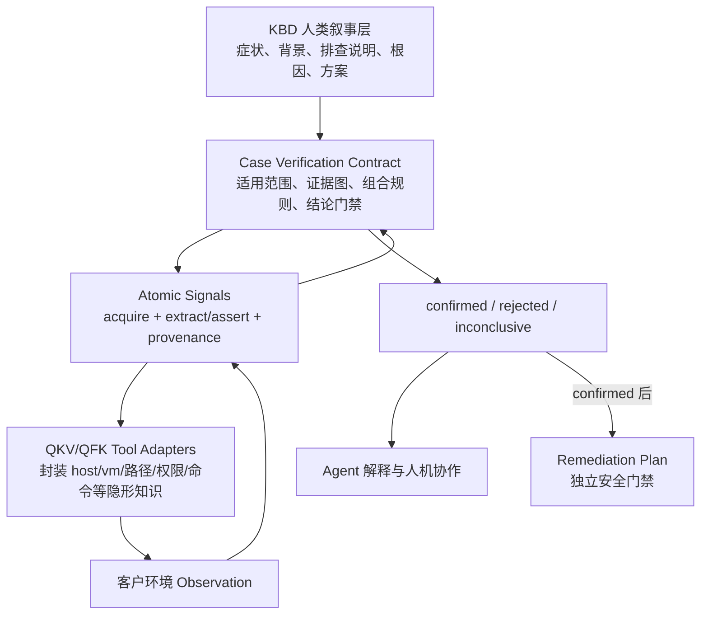
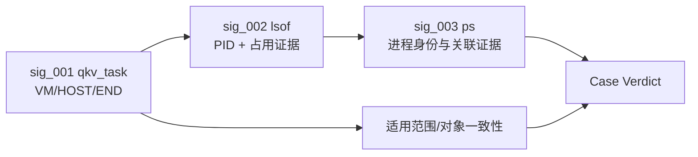
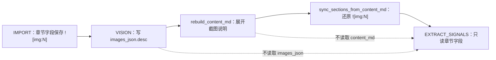
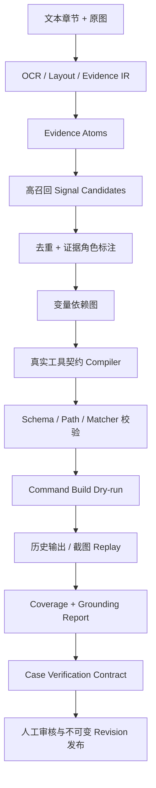

# KBD 截图证据、关键信号与可执行诊断契约方案

## 文档定位与阅读指南

本文是 HTP 将 7000+ 篇 Support 案例转化为 Agent 可验证知识的权威方案事件文档，统一回答三个层次的问题：

1. 当前 KBD 截图和关键信号链路究竟有什么代码与数据问题；
2. “关键信号”是不是正确的架构方向，为什么正确、为什么又不充分；
3. HTP 应如何从文档驱动演进为可追溯、可编译、可回放、可裁决的自动诊断系统。

推荐阅读路径：

- 只做架构决策：阅读“执行摘要”“第一性原理模型”“方案比较与最终决策”；
- 参与数据与模型建设：继续阅读“目标架构”“完整案例示例”“Vision 与信号抽取方案”；
- 参与实现：继续阅读“当前代码与数据审计”“分阶段实施”“验收标准”；
- 需要复核原始事实：查看附录中的代码证据、案例审计和术语表。

本文采用渐进披露：先给结论和心智模型，再给方案和示例，最后给代码证据与实施细节。代码审计材料不会被删除，但不再阻挡读者首先理解架构决策。

---

## 一、执行摘要

### 1.1 一句话结论

> “关键信号”在战略方向上正确，是 HTP 将人类隐形经验工具化的必要原子观察层；但扁平信号列表不是完整案例验证契约。HTP 应保留 KBD 人类叙事和 QKV/QFK，在关键信号之上增加轻量、渐进式的 KBD 可执行验证契约，以适用范围、最小证据图、must/should/exclude、五态失败语义、Compiler、Replay 和 Coverage Gate 完成案例确认闭环。

### 1.2 六个核心结论

1. **实施前截图没有进入关键信号抽取，现已接入。** 基线版本的 `extract_signals_for_kbd()` 不读取截图；当前版本只把 `images_json` 中的 `observed_facts/text_lines/fields` 输入 Signal LLM，并在结构上隔离 inference 文本。
2. **信号问题不是单一 Prompt 问题。** 实施前缺少 Evidence、Compiler、Coverage 和 Replay，导致漏抽、错抽、字段幻觉、保存通过但运行失败同时存在；当前已补齐 Schema、QFK Handler Build、DAG、Coverage 和 outcome-level Decision Replay 等工程门禁，但真实执行器 `ToolSemanticValidator`、raw observation Evidence Replay 与 terminal 合同验证仍未形成完整发布门，业务准确性仍依赖专家 Gold 和审批。
3. **Vision 不稳定也不只是模型问题。** 基线上下文断路、150KB 有损压缩、类型词表缺少弹框、OCR/分类/解释耦合、弱成功判据、Token 截断和无 Golden Eval 共同造成不稳定；当前已完成上下文、保真、Evidence IR、质量状态和推断隔离，独立 OCR/Layout 与盲测仍是下一阶段。
4. **QKV/QFK 的方向正确。** 它们把 host、VM、日志路径、容器、命令、权限和输出解析等操作性隐形知识封装为受控工具，是自动诊断不可替代的基础设施。
5. **单条信号不能等价于案例结论。** 信号只能形成一项观察或证据；案例是否成立还取决于适用范围、必要证据、增强证据、排除证据、证据充分性和失败语义。
6. **更优解不是全量 DAG。** 7000+ KBD 无需全部重写成 SOP 程序；每篇 KBD 只编译验证它所必需的最小证据逻辑，复杂度与案例本身成比例。

### 1.3 推荐目标形态

```text
KBD 人类叙事
  +
KBD Case Verification Contract
  ├── scope / applicability
  ├── variables
  ├── atomic signals
  ├── minimal evidence dependencies
  ├── must / should / exclude
  ├── failure semantics
  └── confirmed / rejected / inconclusive policy

Atomic Signal
  ├── acquire
  ├── extract 或 assert
  ├── produces / requires
  ├── provenance
  └── replay fixture

QKV/QFK Tool Adapter
  └── 封装跨案例复用的操作性隐形知识
```

### 1.4 非目标

本方案不做以下事情：

- 不把 KBD 原文删除或降级为纯机器配置；
- 不让 LLM 直接生成 JSON 后跳过确定性校验进入运行时；
- 不把 7000+ KBD 全部手工重写成完整 DAG；
- 不把工具超时、权限不足或解析失败解释为“案例不成立”；
- 不用 LLM 自报 confidence 代替真实可执行性和统计校准；
- 不在诊断未确认时自动进入破坏性处置；
- 不在没有 Golden Corpus 和回滚能力时直接批量覆盖已发布信号。

### 1.5 2026-07-29 当前实施与验收状态

本节是现行状态摘要；第九章保留 2026-07-28 的实施前审计基线，用于解释问题来源，不能再当作当前数据规模。

| 层级 | 当前事实 | 可否宣称通过 |
|------|----------|--------------|
| 真实来源 | 原 39 条扩展为 126 条；126/126 `raw.json` 可解析和转换；222 张真实图片；52 条合法零图；来源与图片集合 SHA256 全匹配 | 可以宣称 126/126 来源完整性通过 |
| Vision Evidence | 74 条有图案例共 222/222 张图片形成成功 Evidence；52 条合法零图；203 条 inference 为 `unverified`、15 条 `not_present`、4 条 `needs_review` | 可以宣称可观察事实 Evidence 完成，不能等同推断或业务 Gold |
| Signal/Contract | 122/122 使用 v1.3 Prompt、`glm-5` 和同一工具契约；395 条文档信号、386 条诊断信号通过 Schema、QFK Handler Build、变量 DAG 和 Coverage 可计算性门禁 | 可以宣称 Proposal 工程门禁 122/122 通过；不含 ToolSemanticValidator 全量门，仍不等同专家 Gold |
| 工程 Contract fixture | 27123、37150、37180、41818 共 4 条 | 4/126；Schema、Handler Build 与 Decision Replay 已有，完整 Evidence/Execution Replay 未完成，且均待正式专家复核；不是 Expert Gold |
| 业务专家 Gold | 0/126 approved；122 条自动 Proposal 为 `pending_gold`；4 条工程 fixture 的历史 manifest 值为 `gold/pending_expert`，但没有专家 attestation | 当前不能宣称任何一条已成为 Expert Gold，也不能宣称 126/126 业务通过 |

数据集权威目录已由容易误导的 `tests/golden/kbd_39/` 升级为 `tests/golden/kbd_cases/`，manifest 用两个 cohort 区分“原 39 条 Hard Case”和“2026-07-29 新增 87 条”。严格门禁分别验证来源、Gold 标注和专家审批，任何一层缺失都必须 fail closed。

本轮真实运行还揭示了一个关键质量事实：旧数据库 Prompt 与仓库种子漂移，旧版要求模型从截图“得出结论”，使 KBD27079 出现“OCR 正确但因果倒置”。修复后：

- 现存 `kbd_vision_v1` 已通过 Prompt 管理 API 更新到 v1.1，并产生可审计的动态资源 revision；
- Prompt 明确禁止根据上下文为截图建立根因或因果链；
- Evidence `quality.status/needs_review` 只描述可观察事实抽取质量；
- DESCRIPTION 单独使用 `inference_status/inference_needs_review/inference_issues`；
- 单模型语义描述默认 `unverified`，因果/根因断言标记 `unsupported_causal_claim`；
- Signal 只能消费 `observed_facts/text_lines/fields`，任何 inference 都不得独立生成运行参数。

最终 Vision 数据库工程审计确认 222/222 图片均有 `quality.status=success`。这里的 success 只说明可观察事实抽取成功；KBD33510 seq 0 的服务器后面板物理照片仍以 `needs_review=true` 保留人工复核，不进入自动重试。Agent 安全文档已对 126 条重建，`images_json` 不变，未审核 inference 文本在 `content_md` 中由 207 处降为 0，仅保留 211 条隔离提示；数据库实际为 125 条 draft 和 1 条历史 published（KBD27123），本轮没有自动发布新增案例。

Signal 批量 Compiler 还揭示了“结构 Schema 合法但真实 Handler 不可编译”的剩余漂移：真实日志 basename 被扩展名白名单误禁、分号复合命令保存后才被拒、solution 被纳入 must/诊断变量生产者、只读人工确认被误升级为 solution。共享 args 语义门禁、QFK Handler、Contract 归一和 Prompt 已同步修复；`qfk_log.file` 以受限 path 与安全 basename 为边界，允许 `messages`、`.ini`、`BMC_Event_Log` 和规范变量占位符，禁止目录分隔符和命令控制字符。`kbd_extract_signals_v2` 当前为 v1.3、动态资源 revision 8。所有被拒候选连同原始 JSON 和原因持久化，0 条信号只进入 `needs_review`，不能冒充完成。

最终运行继续暴露两个边界案例并完成通用修复：KBD30880 将 `/sf/cfg/gpu_info.ini` 误路由为日志，现仅对 `/sf/cfg/<安全 basename>` 的明确只读意图归一为 `qfk_system cat`，不放宽日志 path 白名单，且下游 matcher 复用上游安全采集，不会把文件内容当路径；KBD39471 暴露局部 `signal.role` 覆盖根 Verification Contract 的 Compiler 优先级错误，现已以根 Contract 为证据角色唯一权威源。Compiler 同时从 acquisition identity 排除不参与执行的 `instruction`，避免仅文案不同就重复采集。修复后 122/122 自动 Proposal 通过 Schema、QFK Handler command-shape Build、变量 DAG 和 Coverage 可计算性审计；共 395 条文档信号、386 条可编译诊断信号、369 次去重 acquisition、9 条不调度 solution、62 条完整 rejected candidates。这里的 Handler Build 不包含真实执行器 `ToolSemanticValidator`/aCLI Catalog；后续审计已确认 KBD30880 的 `acli system cat /sf/cfg/gpu_info.ini` 仍会被该语义门拒绝。

---

## 二、背景：为什么正确 KBD 给到 Agent 仍无法完成验证

HTP 的长期目标，是利用现有 7000+ 篇 Support 案例，让 Agent 在客户侧故障发生后自动完成：

```text
识别故障族
→ 检索候选 KBD
→ 获取客户现场证据
→ 判断候选是否成立
→ 确认根因
→ 生成并安全执行处置计划
→ 验证闭环
```

实践已经证明：即使省略检索，直接把正确 KBD 交给 Agent，Agent 仍可能无法判断现场是否满足该案例，也无法完整执行其中的验证步骤。

这不说明 KBD 完全不可用。KBD 是人写给人的案例，人类读者会用经验补齐作者省略的信息。能力较弱或缺少同类经验的人也可能无法使用同一篇 KBD，这恰好说明 KBD 中存在没有显式化的知识，而不是自然语言本身自动具备可执行性。

典型省略包括：

- “故障主机”到底从告警、任务还是对象关系中获得；
- `host` 是名称、ID 还是 terminal bridge 需要的 IP；
- “检查日志”具体是哪一个文件、哪个目录、哪个时间窗口；
- “检查进程”应运行什么命令、在哪台主机和容器运行；
- 输出中的哪一列是 PID、哪一段是路径；
- 多行输出如何选择，空输出意味着什么；
- 哪些证据只是常见症状，哪些能区分具体根因；
- 哪个反证可以排除案例；
- 检查失败时应该重试、换工具、询问用户还是升级人工。

因此，问题不能简化为“让模型更好地理解文档”。真正目标是：

> 把案例中决定可执行性和可验证性的隐形知识显式化，并为每一个自动结论建立可追溯证据链。

---

## 三、第一性原理模型

### 3.1 隐形知识不是一种，而是三种

#### 操作性隐形知识：怎么获取

它回答：

- 去哪里查；
- 调哪个接口或工具；
- 如何定位 HOST、VM、TASK、ALERT；
- 登录哪个节点、进入哪个容器；
- 使用什么命令和参数；
- 如何限制大输出；
- 如何把原始输出解析为结构化变量。

这部分最适合放在 QKV/QFK Tool Adapter 中，跨 KBD 复用。

#### 语义性隐形知识：结果意味着什么

它回答：

- 哪些字段或文本构成故障证据；
- 阈值、状态、时间和单位是什么；
- 输出为空是否正常；
- 一条日志是根因证据还是背景噪声；
- 多行结果应取 first、exactly_one 还是 all；
- 某项观察支持什么结论、反对什么结论。

这部分应由类型化 extract/assert、matcher、cardinality、单位与 provenance 表达。

#### 认识论隐形知识：多少证据才足以确认

它回答：

- 哪些证据必须成立；
- 哪些只是增强证据；
- 哪些是排除条件；
- 缺一条必要证据时能否下结论；
- 工具错误与证据矛盾如何区分；
- 证据覆盖到什么程度才算充分；
- 当前应输出 confirmed、rejected 还是 inconclusive。

这部分不能由单条信号承担，必须由案例级 Verification Contract 表达。

### 3.2 从观察到案例结论

整个诊断链可以用三个公式说明：

```text
Observation = Acquire + Extract + Provenance

Evidence = Observation + Assert

Case Verdict = Scope
             + Evidence Roles
             + Combination Policy
             + Failure Semantics
```

含义是：

- 工具执行成功不等于已经形成证据；
- 单项证据成立不等于案例成立；
- 多项证据命中数量多，也不一定能抵消强排除证据；
- 没有观察到证据，与成功观察到证据不成立，是两种不同状态。

### 3.3 检索与验证是两个不同问题

检索回答：

> 哪些 KBD 值得验证？

验证回答：

> 客户现场是否满足某一篇 KBD 的适用条件和证据要求？

即使检索结果 100% 正确，验证层仍然必须工作。反过来，验证契约再完善，也不能替代高召回的候选检索。

因此 HTP 的目标链路应是：

```text
检索负责缩小候选
→ Verification Contract 负责确认或排除
→ Agent 负责解释、调度和处理未知
```

---

## 四、“关键信号”设计是否正确

### 4.1 正确的部分

| 设计 | 判断 | 原因 |
|------|------|------|
| 把隐形取证经验工具化 | 正确 | 解决 Agent 不知道如何可靠获取现场事实的问题 |
| QKV 查询告警、任务和弹框 | 正确 | 能从前端 Anchor 产生 HOST、VM、时间等变量 |
| QFK 执行日志、系统、服务和硬件检查 | 正确 | 将后台检查限制在安全、可审计的工具边界内 |
| `produces/requires` | 正确 | 把变量依赖从 LLM 临时推理变成显式契约 |
| 信号绑定 extract 或 matcher | 正确 | 让工具结果形成确定性变量或判断 |
| 人工审核 signals_json | 正确 | 7000+ 存量文档不可能完全依赖自动抽取直接发布 |
| KBD 原文继续保留 | 正确 | 人类解释、背景、根因和方案不应被机器配置替代 |

这些设计符合检测规则、SRE probe、Policy-as-Code、自动化测试 assertion 和诊断检查的共同范式：把观察机制和判定条件显式化、版本化、可回放。

### 4.2 不充分的部分

| 当前假设 | 问题 |
|----------|------|
| 扁平信号列表可以代表完整案例 | 无法表达适用范围、必要/增强/排除证据和证据充分性 |
| 信号执行后只需 PASS/FAIL | 无法区分证据矛盾、信息未知、工具错误和不适用 |
| LLM 可以决定执行顺序 | producer/consumer 已经构成数据依赖，顺序不能靠临场猜测 |
| 信号存在 matcher 就算可执行 | matcher 字段可能不完整，工具参数可能无法构建 |
| 置信度高就可以自动发布 | LLM confidence 不代表 Schema、Compiler、Replay 或事实支撑通过 |
| 公共症状命中可以确认具体 KBD | 公共症状只能定位故障族，需要高特异 discriminator 选择根因 |

### 4.3 最终定位

关键信号应被重新定义为：

> 一条有来源、有工具契约、有输入输出类型、有明确提取或判定、有失败语义、能够 replay 的原子观察契约。

它不再被定义为：

> 从文档中抽出来的一句重要文字，或可以直接代表整篇 KBD 是否匹配的布尔项。

---

## 五、方案比较与最终决策

### 5.1 五种方案比较

| 方案 | 优点 | 根本问题 | 结论 |
|------|------|----------|------|
| KBD 原文直接交给 Agent | 成本最低，保留人类文档 | 隐形知识、执行、变量和判断都不确定 | 不可作为自动化主方案 |
| KBD + 扁平关键信号 | 明显提高可执行性，工程成本可控 | 缺案例级证据组合、反证、失败语义和充分性 | 正确基础，但不完整 |
| 7000+ KBD 全量转换为完整 DAG/SOP | 控制流最显式 | 建模和维护成本过高，破坏人类可读性，容易僵化 | 不建议全量采用 |
| 仅依赖更强模型和 Prompt | 改造少，候选生成可能提高 | 无法消除权限、契约、安全、失败语义和可回放问题 | 只能辅助 |
| KBD + 原子信号 + 轻量验证契约 | 保留原文，工具可复用，验证确定，复杂度按需增长 | 需要 Evidence、Compiler、Replay 基础设施 | 推荐 |

### 5.2 为什么不是全量 DAG

此前“90% KBD 简单，复杂能力放 SOP”的判断仍然有效，但需要一个限定：

> KBD 保持简单，不等于 KBD 不需要案例级证据语义。

推荐采用最小证据图：

- 没有依赖的信号并行；
- 有 `requires/produces` 的信号按拓扑排序；
- must/should/exclude 用声明式组合；
- 只有真实分支才增加 condition；
- 解释性文字和解决方案不编译成控制流；
- 高复用、多分支的故障族再聚合为 SOP。

这使复杂度与案例本身成比例，而不是用最复杂模型处理所有案例。

### 5.3 正式决策

> 保留“关键信号”概念并收窄其职责：Signal 是原子观察，QKV/QFK 是复用工具，Case Verification Contract 是案例裁决层，KBD 原文是解释和知识叙事层，SOP 是跨 KBD 的复杂多分支流程层。

---

## 六、目标架构

### 6.1 总体分层



### 6.2 各层职责

| 层 | 负责 | 不负责 |
|----|------|--------|
| KBD 原文 | 背景、症状、解释、根因、方案、人类可读性 | 直接保证机器可执行 |
| Evidence IR | 忠实保存文本和图片可见事实及来源 | 决定案例成立 |
| QKV/QFK | 环境访问、对象定位、命令构建、安全边界、原始解析 | 决定整篇 KBD 成立 |
| Atomic Signal | 一次观察、变量提取或证据断言 | 聚合多项证据形成最终结论 |
| Verification Contract | scope、证据角色、依赖、失败语义和案例裁决 | 生成自然语言解释或执行破坏性方案 |
| Agent | 候选选择、动态调度、解释、未知处理、人机协作 | 猜路径、猜参数、绕过门禁、自行把错误当反证 |
| Compiler/Verifier | Schema、类型、依赖、命令、Replay、Coverage 和 Verdict | 代替 Agent 与用户沟通 |
| Remediation | 已确认根因后的处置计划与安全确认 | 在证据不足时提前执行 |

### 6.3 Agent 适合与不适合承担的工作

Agent 适合：

- 理解用户描述和上下文；
- 选择和排序候选 KBD；
- 在安全边界内选择下一项高价值检查；
- 解释结构化证据；
- 在 `inconclusive` 时追问用户或升级人工；
- 将 Bad Case 反馈给知识工程流程；
- 生成面向用户的诊断说明。

Agent 不应单独承担：

- 猜日志路径、容器、节点和命令参数；
- 猜工具输出字段或变量类型；
- 猜 matcher 和阈值；
- 把超时、权限不足、解析失败解释为无故障；
- 在证据不足时确认案例；
- 在未确认根因时执行破坏性操作。

最可靠的边界是：

> LLM 做语义 Proposal、动态调度和解释；确定性系统做 Contract、Compile、Execute、Replay 和 Verdict。

---

## 七、核心数据契约

### 7.1 Evidence IR

图片不能继续被压成一段自由文本 DESCRIPTION。建议结构：

```json
{
  "seq": 0,
  "section": "alert_info",
  "context_before": "编辑显卡核心时出现失败提示",
  "context_after": "",
  "regions": [
    {
      "region_id": "img_0:r_0",
      "surface": "config",
      "evidence_type": "dialog",
      "bbox": [1060, 630, 1530, 835],
      "text_lines": [
        {
          "text": "编辑显卡核心失败",
          "confidence": 0.99,
          "bbox": [1080, 650, 1430, 690]
        },
        {
          "text": "设置显卡切分方式失败",
          "confidence": 0.98,
          "bbox": [1080, 700, 1500, 750]
        }
      ],
      "fields": {
        "title": "编辑显卡核心失败",
        "message": "设置显卡切分方式失败",
        "error_codes": []
      },
      "observed_facts": [
        "页面显示编辑显卡核心失败"
      ],
      "inferences": []
    }
  ],
  "quality": {
    "ocr_coverage": 0.96,
    "type_confidence": 0.98,
    "status": "success",
    "needs_review": false
  },
  "provenance": {
    "image_sha256": "...",
    "ocr_model": "...",
    "vision_model": "kimi-k2.5",
    "prompt_revision": "...",
    "transform": "original+tile"
  }
}
```

必须区分：

- `observed_facts`：有 OCR、UI 字段或 bbox 支撑的事实；
- `inferences`：模型推测，默认不得进入运行时信号；
- `surface`：图片所在页面；
- `evidence_type`：真正承载故障语义的区域类型。

### 7.2 Atomic Signal

```json
{
  "id": "sig_task_failure",
  "role": "anchor",
  "source_refs": [
    "img:0/region:r0/field:message"
  ],
  "acquire": {
    "tool": "qkv_task",
    "args": {
      "keyword": "启动虚拟机",
      "is_failed": true,
      "limit": 1
    }
  },
  "orchestrate": {
    "requires": [],
    "produces": [
      {"name": "HOST", "path": "host", "type": "host_ref"},
      {"name": "VM", "path": "vm", "type": "vm_ref"}
    ]
  },
  "assert": {
    "type": "contains",
    "field": "message",
    "value": "镜像忙"
  },
  "failure_policy": {
    "timeout": "error",
    "permission_denied": "error",
    "empty_successful_result": "contradicted"
  },
  "provenance": {
    "source_refs": ["img:0/region:r0/field:message"],
    "method": "evidence_compiler_v1"
  }
}
```

信号必须明确选择主要目的：

- `extract`：从成功输出产生后续变量；
- `assert`：对成功输出形成一项证据；
- 必要时允许同一原始 acquisition 通过不同派生节点完成提取和断言，但不能在单一字段里混淆语义。

### 7.3 五态 SignalResult

| 状态 | 含义 | 是否可当案例反证 |
|------|------|------------------|
| `SATISFIED` | 成功观测，证据成立 | 否，属于支持证据 |
| `CONTRADICTED` | 成功观测，证据明确不成立 | 可以，按证据角色处理 |
| `UNKNOWN` | 信息不足，无法判断 | 不可以 |
| `ERROR` | 工具、权限、超时、解析或契约错误 | 不可以 |
| `NOT_APPLICABLE` | 当前版本、组件或拓扑不适用 | 可以影响 scope 裁决，但不等同普通反证 |

禁止把 `UNKNOWN/ERROR` 压成 `false`。这是自动诊断可靠性的基本认识论约束。

### 7.4 Case Verification Contract

```json
{
  "schema_version": 1,
  "case_id": "37150",
  "scope": {
    "products": ["HCI"],
    "versions": [],
    "components": ["NUMA"],
    "topology_constraints": []
  },
  "variables": {
    "HOST": {"type": "host_ref"},
    "PID": {"type": "integer"}
  },
  "signals": [
    "sig_task_failure",
    "sig_log_failure",
    "sig_fd_count",
    "sig_maps"
  ],
  "evidence_policy": {
    "must": ["sig_task_failure", "sig_log_failure"],
    "should": ["sig_fd_count", "sig_maps"],
    "exclude": ["sig_incompatible_version"],
    "minimum_should": 1,
    "on_missing_must": "inconclusive"
  },
  "outcomes": {
    "confirmed": "全部 must 成立、exclude 均不成立且 should 达标",
    "rejected": "强排除证据成立，或成功观测的必要证据明确矛盾",
    "inconclusive": "必要信号 unknown/error 或证据覆盖不足"
  }
}
```

实施更新（2026-07-29）：KBD37150 已基于本地真实 `raw.json` 和原图形成工程 Contract fixture，并通过 Signal Schema 与 QFK Handler command-shape Build；后续真实执行门复核发现其 PID 生产者 `acli system pidof numa-server` 被当前 aCLI Catalog 拒绝，因此完整 Execution/Evidence Replay 尚未通过。业务专家终审仍是正式发布前置条件。上例仍用于解释契约形态，工程 fixture 以 `tests/golden/kbd_cases/cases/37150.json` 为准。

### 7.5 信号 provenance

当前只记录 `source_section=alert_info/steps_text` 不够。目标格式应支持：

```json
{
  "source_refs": [
    "img:0/region:r_0/field:message",
    "section:steps_text/paragraph:3/command:1"
  ]
}
```

这样才能回答：

- 为什么生成这条信号；
- keyword、file、command、threshold 来自哪里；
- 是可见事实还是模型推测；
- 图片重识别后哪些信号应 stale；
- 人工修订了哪个字段。

---

## 八、完整案例示例：从 KBD 叙事到案例裁决

以下使用 KBD27123“虚拟机开机失败、镜像忙”展示目标心智模型。示例用于解释架构，不替代生产 revision 的真实配置和现场回归。

### 8.1 人类读 KBD 时自动补齐的知识

KBD 的简化步骤：

1. 查看虚拟机任务详情，确认开机失败和“镜像忙”；
2. 登录故障主机，检查镜像文件是否被其他进程占用；
3. 查询占用进程，确认是否为第三方程序。

人类工程师会自动补齐：

- 从任务结果获取 VM 和 HOST；
- 将 HOST 名称解析成可连接 IP；
- 在 HOST 上执行 `lsof`，并以 VM 标识缩减输出；
- 从命中行提取 PID；
- 使用 `ps -p {{PID}} -o cmd=` 定向查询；
- 判断命令行是否仍关联目标 VM，是否属于第三方程序；
- 若 `lsof` 执行失败，不能直接认为镜像未被占用。

### 8.2 原子观察

```text
sig_001：qkv_task
  acquire：查询失败的“启动虚拟机”任务
  assert：错误信息包含“镜像忙”
  produces：VM、HOST、END

sig_002：qfk_system / lsof
  requires：VM、HOST
  acquire：在目标 HOST 执行 lsof，边缘筛选包含 VM 的行
  extract：从指定列提取 PID，cardinality=first 或案例声明策略
  assert：存在关联目标镜像的占用记录

sig_003：qfk_system / ps
  requires：PID、HOST、VM
  acquire：ps -p {{PID}} -o cmd=
  extract：产出 CMD/PNAME
  assert：命令行与目标 VM 相关并属于目标第三方程序特征
```

### 8.3 最小证据图



这张图只表达验证所必需的数据依赖，不把 KBD 根因解释和解决方案编译为工作流。

### 8.4 案例裁决

一种待专家确认的策略示例：

```text
must：
  - 失败任务确实是目标 VM 的启动任务
  - 任务错误与“镜像忙/正在进行其他操作”一致
  - lsof 成功观察到目标镜像被进程占用

should：
  - PID 对应第三方进程
  - 进程命令行仍明确关联目标 VM/镜像

exclude：
  - 占用者是平台正常进程且状态符合预期
  - 当前版本/场景不适用该检查
```

结果示例：

| 现场情况 | Verdict | 原因 |
|----------|---------|------|
| must 全成立，第三方进程证据成立，无 exclude | confirmed | 证据充分支持该案例 |
| 任务报错相同，但 lsof 成功执行且无占用 | rejected 或转向其他候选 | 必要证据明确矛盾 |
| lsof 因权限失败 | inconclusive | 工具错误不能作为反证 |
| VM/HOST 无法从任务唯一确定 | inconclusive | 数据依赖未满足 |
| 发现占用者是平台预期进程 | rejected/继续差分 | 出现高特异反证 |

### 8.5 为什么案例示例重要

它表明 HTP 真正需要的不是“LLM 能否复述 KBD”，而是：

```text
KBD 说明为什么查
→ Signal 说明如何查和如何形成一项证据
→ Contract 说明这些证据何时足以确认案例
→ Agent 说明给用户听并处理未知情况
```

---

## 九、当前代码与数据审计

### 9.1 实施前审计基线

- 日期：2026-07-28；
- 仓库版本：`46d0dcec2050`；
- 当时数据库：4 条 KBD、15 张图片、10 条信号；
- KBD：27123、41818、37180、37150；
- 方式：代码链路、运行契约、数据库内容、原始图片和 `signals_json` 只读交叉验证；
- 该轮只读审计不修改业务代码、数据库或 KBD 发布状态；现行实现与数据规模见 1.5、12 和 13.5 节。

### 9.2 截图证据未进入关键信号抽取



`extract_signals_for_kbd()` 只读取：

- `title`；
- `problem_description[:2000]`；
- `alert_info[:1000]`；
- `steps_text[:4000]`；
- category、工具目录和变量 Schema。

它不读取：

- `images_json`；
- `kbd_image.image_data`；
- 带截图说明的 `content_md`；
- OCR、区域、图片类型和图片质量；
- 图片序号和字段级来源。

`rebuild_content_md()` 会把图片说明展开进 Markdown；`sync_sections_from_content_md()` 又将说明恢复为 `![img:N]`。现有单测明确断言同步后的 `alert_info == "![img:0]"`。

结论：

> 当前不是文本与截图联合抽取，而是仅章节文本抽取；截图像素、OCR 和图片描述对信号抽取的实际利用率为 0%。

### 9.3 截图到 QKV 的映射

业务映射方向：

| 证据区域 | QKV 候选 |
|----------|----------|
| 告警记录/告警详情 | `qkv_alert` |
| 任务记录/任务详情 | `qkv_task` |
| 弹框/Toast/错误模态框 | `qkv_dialog` |

但应使用“区域到信号”，而不是“一图一信号”：

- 同一任务的列表图和详情图应合并；
- 配置页中的错误 Toast 应是 `surface=config`、`evidence_type=dialog`；
- 任务详情虽然是弹窗形态，但具有任务字段时仍属于 task；
- 无诊断价值的配置说明图不强行生成 QKV。

### 9.4 实施前 4 条 KBD 量化结果

| KBD | 状态 | 图片 | 信号 | 主要问题 |
|-----|------|-----:|-----:|----------|
| 27123 | published | 3 | 3 | 人工修订后结构较完整；Vision 漏掉 lsof 主体；仍需真实输出 replay |
| 41818 | draft | 3 | 2 | 前端类型错；存在非法 `resource`；日志文件缺失 |
| 37180 | draft | 6 | 4 | 日志文件、目录和 threshold 参数不足；部分推断无图片事实支撑 |
| 37150 | draft | 3 | 1 | 任务图漏 `qkv_task`；FD/maps 证据漏抽；唯一日志信号不可执行 |

合计：

- 15 张截图；
- 10 条信号；
- 0 条信号具有图片级 provenance；
- 2 张明显有文字的图片被识别为“无文字”；
- `qkv_dialog` 为 0；
- 截图信息在信号层利用率为 0%。

现有信号工具分布：

| 工具 | 数量 |
|------|-----:|
| `qkv_task` | 2 |
| `qkv_alert` | 1 |
| `qkv_dialog` | 0 |
| `qfk_log` | 3 |
| `qfk_system` | 3 |
| `qfk_hardware` | 1 |

### 9.5 四个案例的具体问题

#### KBD37150

- 第一张图更符合任务失败详情，但没有生成 `qkv_task`；
- 唯一 `qfk_log` 缺 `file=sfvt_numa-server.log`；
- FD 数量没有抽取；
- `/proc/<pid>/maps` 证据没有抽取；
- PID、路径和后续检查没有形成 producer/consumer 关系。

#### KBD41818

- 第一张图是配置页面中的错误 Toast，更符合 `qkv_dialog`；
- `qfk_log.args` 含当前 Schema 不允许的 `resource`；
- 整份 `signals_json` 当前 Schema 校验失败；
- 同时缺少日志文件名，运行时也会失败。

#### KBD37180

- `qkv_task` 基本合理；
- `qfk_log` 缺 `file=volume-worker-server.log`；
- `qfk_system` 只有 `command=ls`，没有目标目录；
- `threshold` 缺 `value/operator`，无法确定求值；
- 部分硬件推断与原图中的实际检查不一致。

#### KBD27123

- `qkv_task` 基本合理；
- 后两条 Producer 链经过人工修订，Schema 通过；
- 仍需按真实输出 replay；
- `img_1` 的主要内容是大量 `lsof` 输出，Vision 只关注末尾版本信息；
- `img_0` 对任务语义存在文字和状态误识别。

### 9.6 保存 Schema 与运行时契约漂移

当前 `qfk_log.file` 在保存 Schema 中是可选属性，但运行时 `LogKeywordHandler` 明确要求必填。因此现存三条 `qfk_log` 都可能在运行时失败：

```text
qfk_log 必须提供日志文件名（通过 file 字段）
```

当前静态结果：

```text
27123 schema=PASS
41818 schema=FAIL：resource 是额外字段
37180 schema=PASS
37150 schema=PASS
```

Schema PASS 不代表命令可构建，更不代表 replay 能成功。

### 9.7 matcher 和 confidence 问题

当前 matcher 校验主要确认 `type` 属于允许集合，没有按类型强制字段。例如 threshold 应至少要求数值目标和 operator。

当前质量分代码存在等价无条件加分：

```python
score += 0.3 if requires else 0.3
```

它不检查：

- 命令能否构建；
- `qfk_log.file` 是否存在；
- `produces.path` 是否是真实输出路径；
- matcher 是否字段完整；
- producer 是否存在；
- producer/consumer 类型是否一致；
- 图片或文本是否支持该字段；
- replay 是否得到期望值。

所以当前高 confidence 只能说明“对象看起来像信号”，不能说明“事实正确、能够执行并正确判定”。

### 9.8 当前信号抽取架构缺口

现状：

```text
完整案例
→ 单次 LLM Prompt
→ 直接生成运行时 signals_json
→ 宽松 Schema
→ 落库
```

缺少：

1. Evidence Atom；
2. 截图输入；
3. 高召回 Candidate；
4. Coverage 分母；
5. 字段级 grounding；
6. 与真实 Handler 同源的 Compiler；
7. matcher 条件 Schema；
8. QKV/QFK 输出路径校验；
9. producer/consumer 依赖图；
10. command build dry-run；
11. 历史输出 replay；
12. rejected candidate 与拒绝原因；
13. 模型、Prompt、输入和工具版本；
14. 上游变化后的 stale/re-extract。

---

## 十、Vision 不稳定的根因与完整方案

### 10.1 当前系统性根因

#### 上下文断路

Vision 从 `content_md` 构建图片上下文，但 `_build_context_map_from_html()` 只匹配 HTML ``。当时 `content_md` 是 Markdown 截图说明，不含 ``，实施前 4 条 KBD 的上下文映射实际为空；单图重识别复用相同路径。

#### 类型词表缺少弹框

当前只允许终端、日志、告警、任务、配置和其他，没有弹框，导致任务详情和 Toast 被迫错分。

#### 文字截图有损压缩

实际阈值是 150KB，超过后宽度压到 1000px并转 JPEG quality=70；函数注释却写“超过 1MB”。密集终端、日志和表格最容易丢失 PID、路径、错误码和小字号字符。

典型图片：

- KBD37180 `img_2`：1615×451、约 1.4MB，密集日志；
- KBD27123 `img_1`：1473×412、约 724KB，密集 `lsof`。

#### Prompt 主动过滤非错误内容

终端/日志识别偏向 error、warning、info，导致 `lsof`、`ps`、`ls`、`sg_raw`、PID、路径和普通命令输出遗漏。OCR 的目标应是忠实照录，显著性筛选应在其后独立执行。

#### 一次调用耦合四个任务

一次 VLM 调用同时负责分类、背景色、OCR 和技术解释，再用自由文本正则解析。分类错误会引导选择性读取，解释中的推测又会污染事实。

#### DESCRIPTION 鼓励幻觉

要求模型说明截图“揭示什么问题或结论”，会生成截图不存在的原因。必须严格区分 observed fact 和 inference。

#### 成功判据过弱

Pipeline 只检查 `images_json.desc` 非空。即使内容只是“无文字、无描述”，包装字符串仍非空并被判 done。

#### Token 和评测漂移

当前默认模型为 `kimi-k2.5`，默认 `VISION_MAX_TOKENS=1536`。密集日志全量照录容易截断；当前缺少 finish_reason 门禁和真实图片 Golden Regression。

### 10.2 Vision 目标流水线

```text
原始图片
→ 方向/尺寸/文字密度分析
→ Layout 与 Region
→ 专用 OCR
→ VLM 语义复核
→ 关键 Token 对账
→ Evidence IR
→ 质量门禁
```

### 10.3 图像预处理

- 永久保存原始 PNG 和 SHA-256；
- 按尺寸、长宽比、文字密度分流；
- 密集日志/终端保持原分辨率切片；
- Tile 重叠 10%–15%；
- 文字截图禁止默认 JPEG 70；
- 全图负责布局，Tile 负责细节；
- 保存 crop、resize、增强和坐标映射。

### 10.4 OCR 与 VLM 协作

- 专用 OCR 输出文本、bbox、字符/行置信度；
- VLM 负责复杂 UI 关系、区域语义和低清复核；
- 错误码、PID、IP、路径和命令用规则提取；
- OCR/VLM 对关键 Token 不一致时进入审核；
- VLM 不得静默覆盖 OCR 原文。

### 10.5 Region 分类

支持：

- task；
- alert；
- dialog；
- terminal；
- log；
- config；
- topology/chart；
- irrelevant。

允许一图多区域和多标签，不再强迫整图单分类。

### 10.6 质量状态和门禁

质量状态：

```text
success
partial
low_quality
failed
needs_review
```

门禁规则：

- 有明显文字纹理但 OCR 为空：自动 Tile 重试；
- OCR 字符量与文字密度不匹配：partial；
- `finish_reason=length`：分块重跑；
- 关键 Token 跨模型不一致：needs_review；
- observed fact 无 bbox/text 支撑：丢弃；
- 推测性 DESCRIPTION：不得进入信号；
- 同一图片多次识别差异过大：不得自动发布。

### 10.7 可观测与版本化

每张图片持久化：

- 原图 SHA-256；
- crop/transform；
- OCR 模型和版本；
- Vision 模型；
- Prompt revision；
- 原始响应；
- 结构化解析结果；
- Token、延迟、finish reason；
- 质量门禁结果；
- 人工修订 diff。

---

## 十一、信号抽取与案例验证的目标流水线



### 11.1 Evidence-first 高召回

分别从以下来源生成 Evidence Atom：

- 标题和问题描述；
- 告警、任务、弹框图片；
- 日志和终端图片；
- 文本排查步骤；
- 命令和命令输出；
- 错误码、路径、PID、状态和阈值。

每条必要证据必须有处理状态：

```text
compiled
deduplicated
non_executable
irrelevant
needs_review
unhandled
```

### 11.2 候选生成按角色拆分

- Frontend Anchor Extractor：只生成 `qkv_alert/task/dialog`；
- Backend Diagnostic Extractor：生成 QFK；
- Variable Planner：连接 producer/consumer；
- Evidence Grounder：绑定文本或图片区域；
- Case Policy Proposer：提出 must/should/exclude，必须经规则和人工审核。

LLM 负责高召回 Proposal，不直接发布。

### 11.3 确定性 Compiler

Compiler 以真实 Handler/Tool Definition 为单一真相源，检查：

1. tool 是否存在并启用；
2. acquire.args 是否满足运行时契约；
3. `qfk_log.file` 等运行时必填字段；
4. produces path 是否对应真实输出；
5. matcher 是否满足按 type 的条件 Schema；
6. command 能否构建；
7. 占位符是否可解析；
8. requires 是否有 producer；
9. 变量类型是否一致；
10. 依赖图是否有环；
11. 信号 ID 是否唯一；
12. 写操作是否隔离到 remediation；
13. Shell 参数和输出过滤是否安全。

保存 Schema、Compiler 和 Runtime Handler 必须共用一个工具注册表，不能维护三份近似定义。

### 11.4 Replay

对截图或历史输出可提供样例的案例，保存为 fixture：

```text
历史/截图输出
→ extractor
→ produces
→ matcher/assert
→ SignalResult
→ Case Verdict
```

Replay 必须验证实际产出值，不只断言“命令构建成功”。

### 11.5 Coverage Gate

Coverage 的分母来自 Gold Evidence，不由 LLM 自己判断是否完整：

```json
{
  "required_evidence": 12,
  "compiled": 9,
  "deduplicated": 1,
  "non_executable": 1,
  "unhandled": 1,
  "coverage": 0.833
}
```

必要证据存在 `unhandled` 时，案例不能自动发布为可确认状态。

### 11.6 发布门禁

- Schema pass：100%；
- Compiler pass：100%；
- Command Build pass：100%；
- Replay pass：100%；
- 未解析变量：0；
- 无 producer 的 requires：0；
- unsupported produces path：0；
- 幽灵字段：0；
- 无证据支撑字段：0；
- 低置信或 inference 字段已人工处理；
- 必要证据覆盖率达标；
- 诊断和处置安全边界通过。

---

## 十二、126 条扩展语料、Golden Corpus 与评测

### 12.1 数据集组成与治理

原 39 条 Hard Case 保留为 `initial-hard-cases` cohort；2026-07-29 新增 87 条组成 `2026-07-29-expansion` cohort，总计 126 条唯一案例，两个 cohort 无交集。权威清单位于：

```text
tests/golden/kbd_cases/manifest.json
```

manifest 不再把“抓到了源数据”与“拥有专家 Gold”混成一个状态。每条记录分别持久化：

- `source_status`、`raw_sha256`、`image_count`、`image_set_sha256`；
- `annotation_status=gold|pending_gold`；
- `review_status=approved|pending_expert|not_reviewed`。

当前状态：

| 项目 | 数量 | 说明 |
|------|-----:|------|
| 真实案例 | 126 | 126/126 `raw.json` 可解析并可转换 |
| 真实图片 | 222 | 图片引用、本地文件和 `images_json` 数量一致 |
| 合法零图案例 | 52 | 源文档本身没有图片，不是 Vision 失败 |
| 工程 Contract fixture | 4 | 27123、37150、37180、41818；均有 Decision Replay，只有 27123 的全部 QFK 路径通过当前真实语义门 |
| `pending_gold` | 122 | 自动 Proposal 不能机械升级为 Gold |
| 专家已批准 | 0 | 4 条工程 Contract fixture 为 `pending_expert`，122 条 Proposal 为 `not_reviewed` |

### 12.2 来源完整性结果与安全边界

新会话抓取结果为 `done=121, skipped=5, failed=0`；5 条 skipped 均是本轮已存在的真实缓存。逐条审计结果：

```json
{
  "case_count": 126,
  "raw_json_valid": 126,
  "conversion_success": 126,
  "total_local_images": 222,
  "zero_image_cases": 52,
  "invalid_json": [],
  "conversion_failed": [],
  "missing_required_fields": {},
  "image_count_mismatches": {}
}
```

抓取器同时修复“成功重抓后遗留 `fetch.failed`”的问题：`_write_raw()` 成功写入会删除旧失败标记，避免 `--failed-only` 永久误判。

会话凭据只进入短生命周期子进程环境，不写 `.env`、仓库、cache 元数据、日志或本文。由于凭据已经由用户贴在对话中，批次完成后应退出或刷新支持站会话使其失效。

### 12.3 三层门禁与当前严格结果

严格门禁已经落地，不能用 skip、合成案例、空标注或机械改 `review_status` 伪造通过：

```bash
KBD_GOLDEN_STRICT=1 uv run pytest -q tests/unit/kbd/test_golden_cases_sources.py
```

门禁按三层分别给出结果：

1. **来源层：** 126/126 必须存在真实 `raw.json`，SHA256、图片数量和图片集合 SHA256 必须匹配，转换与上下文必须完整；当前已通过。
2. **工程 Contract fixture 层：** 当前 4/126 只有经工程核对的区域、Token、Signal、Contract 与 Decision Replay；完整 Evidence/Execution Replay 尚未完成。
3. **业务审批层：** 每条 Expert Gold 必须由业务专家批准；当前 0/126 approved。

因此准确结论是“126/126 来源可用、4 条工程 Contract fixture、122/126 pending_gold、0/126 Expert Gold；只有 27123 的全部 QFK 路径通过当前 ToolSemanticValidator”，而不是“126/126 业务通过”。

### 12.3 每个工程 Contract fixture 的标注

- 图片真实 region、surface、evidence_type 和 bbox；
- 关键可见文字和关键 Token；
- 错误码、命令、文件名、路径、PID、IP；
- 必须生成的 QKV/QFK；
- producer/requires 关系；
- 预期 matcher、extract、cardinality；
- must/should/exclude；
- replay fixture 与期望 SignalResult；
- confirmed/rejected/inconclusive 预期；
- 不应生成的反例信号；
- 只属于 inference、不得自动进入信号的内容。

### 12.4 指标

| 指标 | 发布门槛 |
|------|---------:|
| 告警/任务/弹框区域分类 Macro F1 | ≥ 0.95 |
| 三类关键前端证据 Recall | ≥ 0.98 |
| 错误码/命令/文件名/路径关键 Token 精确召回 | ≥ 0.98 |
| 有文字截图误判“无文字” | < 1% |
| observed fact 幻觉率 | 0 |
| Gold 必需信号 Recall | ≥ 0.95 |
| 信号字段 Precision | ≥ 0.95 |
| Schema/Compile/Command Build/Replay | 100% |
| 未解析变量、幽灵字段、契约漂移 | 0 |
| 126 个指定案例来源/Proposal/Gold 分层回归 | 各层独立报告，已审批 Gold 需 100% |

126 条属于已知回归语料，不能同时冒充独立盲测集。长期仍需额外保留不参与 Prompt、模型和规则调优的盲测集，并按产品模块、截图类型、清晰度、文字密度和工具类型分层抽样。

---

## 十三、分阶段实施方案（WHAT）

### P0：止血

1. 将结构化图片证据接入信号抽取；
2. 修复 Vision context 来源；
3. 增加 dialog 和 region-level 分类；
4. 修复文字截图压缩策略；
5. 统一 `qfk_log.file` 保存与运行契约；
6. matcher 改为条件 Schema；
7. Publish 前调用真实 Handler 完成 command build/dry-run；
8. “无文字包装”不再算 Vision success；
9. 对 126 条真实来源做只读完整性 lint；自动产物保持 Proposal，不覆盖人工 Gold；
10. 为信号增加图片/区域级 source refs。

### P1：Evidence 与 Compiler

1. 建立 Evidence IR；
2. Vision 使用 Schema-constrained JSON；
3. 拆分 OCR、Region、字段提取和推理；
4. Signal 采用 Proposal → Compiler → Verifier；
5. 持久化 rejected candidates 和 coverage report；
6. 建变量依赖图和类型检查；
7. 建立 Replay；
8. 文本、图片、Prompt、模型或工具契约变化时标记 stale；
9. 管理端并排审核图片区域、Evidence 和 Signal 字段。

### P2：Case Verification Contract

1. 增加 scope 和适用条件；
2. 增加 must/should/exclude；
3. 引入五态 SignalResult；
4. 生成最小证据图；
5. 输出 confirmed/rejected/inconclusive 和完整理由；
6. 差分引擎使用高特异 discriminator；
7. 诊断与 remediation 分离；
8. 使用不可变 revision 发布。

### P3：评测与规模化

1. 建立 126 条分层回归语料，并逐步把 `pending_gold` 转为专家 Gold；
2. 引入 OCR + VLM 交叉验证；
3. 建独立盲测集；
4. 模型、Prompt、OCR、预处理或工具变化时全量回归；
5. 使用 shadow/champion-challenger；
6. 指标退化阻断发布；
7. 人工修订 diff 回流 active learning；
8. 分层扩展到 7000+ KBD，并提供批次回滚和失败隔离。

### 13.5 实施落地状态（2026-07-29）

本节记录代码事实，避免把目标态误写成已完成态。权威运行链路已经从“LLM 直出信号”升级为：

```text
KBD 正文 + images_json 上下文
→ Vision Evidence IR
→ Signal Proposal
→ Signal v2 Schema / Contract 规约
→ Runtime Handler Compiler / 变量 DAG
→ QKV/QFK Execute
→ 五态 SignalResult
→ Replay / Coverage
→ confirmed / rejected / inconclusive
```

已完成的关键实现：

1. IMPORT 阶段为每张图持久化 `seq/section/context_before/context_after/desc`，同图重复时确定性采用首次出现位置；Vision 不再依赖 `content_md` 中实际不存在的 HTML ``。
2. Vision 输出 Evidence IR，明确区分 `observed_facts` 与 `inferences`；未知置信度为 `null`。可观察事实使用 success/partial/low_quality/failed/needs_review，DESCRIPTION 另用 not_present/unverified/needs_review 与风险码，避免“OCR 成功”掩盖“语义推断错误”。`弹框截图` 成为一等类型，管理端也能正确显示弹框与配置截图。
3. Signal Prompt 新增 `image_evidence`，只允许 `observed_facts/text_lines/fields` 作为事实；Signal LLM 输入结构完全剔除 DESCRIPTION、`regions[].inferences` 和 legacy `desc`，推断文本不再依赖 Prompt 自律。Signal provenance 支持 `section:*` 与 `img:N/region:*` source refs。
4. Signal v2 Schema 与 QFK Handler 契约同源：`qfk_log.file`、各 command/resource 参数恢复真实必填；日志安全边界是受限 path + 安全 basename，不再臆断扩展名；matcher 使用封闭类型、条件必填、非法 regex、命令控制字符和 qfk_log keyword 限制。保存门禁会执行共享运行语义校验，不再等到 Agent 现场调度才暴露不可编译参数。
5. threshold 支持 `first_number`、`line_count`、`duration_seconds`。其中 `duration_seconds` 只解析 POSIX `time` 的 `real 0m21.615s`，避免路径数字污染；旧 threshold 缺省仍兼容 `first_number`。
6. Case Verification Contract 内嵌在现有 `signals_json`，不新增分裂的数据列。保存形态为 `{schema_version: 2, signals: [...], verification_contract: {...}}`，迁移补齐 Prompt 与 Vision 质量契约。
7. CDD Compiler 检查不存在的 signal ref、重复角色、非法 minimum_should、未声明外部变量和依赖环，并调用真实 QFK Handler 做 command-shape Build。该层并未调用实际执行器必经的 `ToolSemanticValidator`/aCLI Catalog，因此 Handler Build 通过不等于允许发送到 terminal bridge。自定义外部变量必须在 `verification_contract.variables` 声明封闭类型；发布 API 强制完整 Contract 和稳定唯一 signal id，运行时仍有独立语义门，后续方案要求把该门前移到 Compiler/发布验证。
8. Scope 在真实调度和 Replay 前统一执行；产品、版本、组件或拓扑缺失时保持 inconclusive，不会因后续信号满足而被覆盖为 confirmed。QFK 在执行前使用现场 `env_context + variable_pool` 渲染 `{{HOST}}/{{VM}}/{{PID}}/...`；Compiler 的代表值只用于 shape 检查，不能替代现场变量。
9. 当前 Replay fixture 同时包含现场 scope 和 positive/strong-negative/unknown/error 四类预设 SignalEvaluation，拒绝未知 ref、重复 evaluation、缺少 evaluation_id/exec_id 和调度内部态；它验证的是 outcome→verdict 的 Decision Replay，不会从 raw observation 重新执行 parser/matcher，也不经过 Handler→Semantic Validator→bridge envelope。Coverage 报告 must/should/exclude 与 unresolved；solution phase 不进入自动诊断。
10. 截图保真链路已完成 v1：小 PNG 保留原始字节，超过 2 MB 才压缩，PNG 无损优先、JPEG 质量 90、最大维度 2400 px；长宽比至少 2.2 且长边超过 2400 px 的超长文字截图按 1800 px Tile、180 px overlap 切分，最多 8 片并在一次 Vision 请求中提交。Evidence provenance 保存每个 `tile_id` 与源图 `bbox_source`，测试覆盖 600×5000 PNG 的完整覆盖和重叠。该实现解决小字可读性与源坐标追溯，不代表已经具备真实 UI region 检测。
11. `signals_json.generation_metadata` 已持久化 `source_fingerprint/prompt_revision/model_id/tool_contract_revision/generation_fingerprint`。工具契约 revision 对全部生成的 Signal/QKV/QFK Schema 做确定性哈希，不只哈希根 `$ref`。正文关键字段或分类修改、图片/Evidence 重识别会将旧产物标为 stale；Playbook 门禁和运行时 Compiler 都会拒绝 stale 或工具契约 revision 不一致的产物。
12. 管理端审核视图已完成 v1：图片卡片分栏展示文档上下文、Observed Facts、Inferences、质量状态、image hash、Vision 模型、Prompt revision、transform 与 source tile bbox；Signal 卡片展示 must/should/exclude/context、needs_review、source refs、source section 和证据原文；generation fingerprint 与 stale 禁止执行原因可见。
13. 数据集已从原 39 条扩展到 126 条，manifest 分两个 cohort 保存来源状态、`raw_sha256`、图片数量、图片集合 SHA256、标注状态和审批状态；来源门禁与 Gold/审批门禁不再混为一个“通过”标志。
14. 运行环境 Prompt 漂移已修复：数据库现存 `kbd_vision_v1` 通过管理 API 升级到 v1.1 与动态资源 revision 2。Prompt 禁止根据文档上下文为截图建立因果链；确定性后处理对所有单模型语义推断标 `unverified`，对因果/根因断言标 `unsupported_causal_claim`。KBD27079 复测 3/3 成功，原因果倒置消失。
15. 运行鲁棒性补齐三项：成功抓取会清理过期 `fetch.failed`；Pipeline 统一把 `postgresql+asyncpg://`/`postgres://` 归一为 asyncpg DSN；Vision 与 Signal Job 状态轮询遇瞬时传输断连时复用原 `job_id` 有限重试，避免把轮询失败当业务失败或重复烧模型。
16. Signal Candidate 审计补齐三项：LLM 候选未过确定性门禁时保存原候选与拒绝原因；合法信号为空时 Pipeline 进入 `needs_review` 而不是 `done`；管理端手工编辑只替换 `signals`，保留 Verification Contract、generation metadata 和 rejected candidates，并把生成状态标为 `manual_reviewed`。
17. Contract 归一补齐诊断/处置边界：solution 永远归入 context，不得成为 must/should/exclude；solution 产出不能满足诊断变量依赖；`require_human_confirm` 是授权策略而非 solution 的同义词，只读诊断即使需确认仍保留在证据图中。
16. 两份 014 迁移均已在真实 PostgreSQL 事务中执行后回滚验证；修复了 `replace()` 参数中相邻 `E'...'` 未使用 `||` 导致的语法错误，Atlas checksum 已重新生成。
17. `images_json` 保留完整 DESCRIPTION 供管理端审核，但 `content_md`/Agent 视图会剔除 unverified、needs_review 和 legacy 未验证语义描述，只保留 TYPE/BACKGROUND/FULL_TEXT，并显示 `INFERENCE_STATUS/INFERENCE_NOTICE`；反向同步同时兼容历史原始块和新版安全块。

数据迁移：

- `database/data-migrations/014_add_image_evidence_and_vision_quality_contract.sql`；
- `database/atlas-migrations/20260729010000_add_image_evidence_and_vision_quality_contract.sql`；
- `database/atlas-migrations/atlas.sum` 已随迁移更新。

四条本地工程 Contract fixture 的最小诊断契约（均待专家审批；完整 Evidence/Execution Replay 未完成）：

| KBD | 前端 Anchor | 后端必要证据 | Contract 摘要 |
|-----|-------------|--------------|---------------|
| 27123 | `qkv_task` 启动虚拟机失败，产出 VM/HOST | `lsof` 产出 PID；`ps -p {{PID}} -o cmd=` | task + lsof 为 must，第三方占用进程为 should |
| 37150 | `qkv_task` 设置 CPU 限速失败 | `sfvt_numa-server.log: Too many open files`；numa PID；FD `line_count > 100`；FD 指向 `/proc/\d+/maps` | 任务、日志与 FD 异常形成根因验证链 |
| 37180 | `qkv_task` 同步基镜像失败 | `volume-worker-server.log: activity error`；存储 `time ls`；`sg_raw` operation code | STORAGE_PATH/DEVICE 为外部现场变量，缺失时 inconclusive |
| 41818 | `qkv_dialog` 编辑显卡核心失败 | `sfvt_vtpdaemon.log` GPU bind failed；`dmesg` 电源线与 RmInitAdapter | 三项 must 全部成立才 confirmed |

本轮全量验证：

| 验证范围 | 结果 |
|----------|------|
| KB Service tests | 223 passed, 1 warning |
| Agent Service unit tests | 432 passed, 1 skipped（既有非本任务跳过）, 3 warnings |
| KBD Pipeline tests | 211 passed, 1 skipped（非严格模式只跳过专家严格门禁） |
| Admin UI `vue-tsc` 与 production build | passed |
| 本轮 Python 文件 Ruff | passed |
| 126 条严格来源、标注与审批门禁 | 131 passed, 1 failed；来源层全过；122 条 Proposal 尚无 Expert Gold，4 条工程 fixture 待专家终审，按设计 fail closed |

尚未完成、不得在交付中扩大描述的能力：

- 独立 OCR/Layout 模型、OCR 与 VLM 的关键 Token 对账、Schema-constrained Vision 原生 JSON 和真实 UI region 检测；当前 Tile 只提供超长图保真输入与源图 bbox，Evidence IR 的 region 仍主要是整图级诚实占位，自由文本输出后再确定性解析；
- Coverage 与 Replay 运行结果的完整持久化；rejected candidate 原文/原因已经持久化，管理端已能审核 Evidence/Inference/Signal 来源，但尚无真实 region 标注编辑器；
- Prompt 管理后台修改、模型环境切换后的全库自动 stale 事件传播，以及 champion-challenger/active learning；当前生成时会记录 Prompt/模型指纹，正文/分类/Vision 更新与工具契约漂移已能 fail closed；
- 122 条 `pending_gold` 的专家标注、全部 126 条业务审批、独立盲测集和 7000+ 分批扩展。

---

## 十四、决策依据（WHY）

### 为什么保留关键信号

它准确抓住了 Agent 无法执行 KBD 的主要根因：操作性隐形知识没有显式化。QKV/QFK 能将环境访问、对象定位、权限、安全边界、命令构建和输出解析封装为可复用工具。

### 为什么不能只用扁平信号列表

单条信号只能回答一个观察是否成立，不能独立决定案例是否成立。没有 scope、must/should/exclude 和失败语义，系统会把公共症状误当成具体根因，把工具错误误当成反证，或在证据不足时过早确认。

### 为什么不把全部 KBD 转成程序

7000+ 人类文档存在版本差异、隐式上下文和少量分支。全量编译为完整 DAG 会造成巨大的建模和维护成本。推荐方案只编译必要验证逻辑，解释性内容仍留在 KBD。

### 为什么不能只提高模型能力

更强模型可以提高候选生成质量，但无法消除权限、命令、工具契约、变量类型、失败语义和发布安全问题。Compiler、Replay 和 Coverage Gate 是模型能力之外的系统保障。

### 为什么测试必须先于 7000+ 批处理

没有 Golden Corpus、字段级 provenance 和 replay，批量抽取只会快速生成无法量化的技术债。必须先用难例建立可测闭环，再扩展覆盖面。

### 为什么诊断和处置分离

诊断是只读取证和结论确认；处置可能修改客户环境。即使信号确认了案例，写操作仍需独立安全策略、风险分级、用户确认和结果验证。

---

## 十五、风险、边界与未决问题

### 15.1 主要风险

| 风险 | 后果 | 缓解 |
|------|------|------|
| 针对 126 条已知语料过拟合 | 回归好看，泛化差 | 独立盲测集、分层采样、Champion/Challenger |
| 自动抽取错误覆盖人工数据 | 已发布 KBD 回退 | Shadow、不可变 revision、人工审核 |
| 工具契约继续漂移 | 保存通过、运行失败 | 单一注册表、Compiler 使用真实 Handler |
| Vision 推测进入事实 | 生成错误信号 | observed/inference 分离、bbox grounding |
| ERROR 被当 false | 错误排除正确案例 | 五态结果、fail closed |
| Evidence Policy 由 LLM 随意生成 | 过早确认或无法确认 | 专家标注、规则门禁、Replay、审计 |
| 7000+ 批处理成本失控 | 队列、Token、人工审核压力 | 分层批次、优先级、缓存、主动学习 |

### 15.2 未决问题

以下问题中，数据落点和基础裁决已经在本轮确定；其余仍需后续设计评审：

1. **已决：** Verification Contract 扩展现有 `signals_json`，避免双列原子性和版本漂移；
2. must/should/exclude 的人工编辑界面与权限；
3. **部分已决：** scope 已支持产品、版本、组件和拓扑判断，版本范围的统一语法仍需固化；
4. 统计证据权重何时引入，如何避免伪概率；
5. **部分已决：** Compiler/Scheduler 已按 acquisition 去重，跨会话缓存和持久审计模型仍待设计；
6. 历史截图输出如何脱敏后作为 replay fixture；
7. KBD 与 SOP 的证据节点如何共享而不复制；
8. 合同版本变更后历史诊断结果如何保持可解释。

这些剩余问题不改变本方案的核心决策，但会影响数据模型、审核体验和规模化迁移细节。

---

## 十六、影响范围

- data-pipeline：IMPORT/VISION/EXTRACT_SIGNALS 数据契约；
- kb-service：Evidence IR、信号候选、Compiler、Contract、版本和 stale；
- agent-service：QKV/QFK、五态结果、最小证据图和案例裁决；
- shared schema：工具参数、matcher、produces、provenance 单一真相源；
- admin-ui：图片区域、Evidence、Signal、Coverage、Replay、Policy 审核；
- evaluation：126 条分层回归语料、独立盲测集和 CI 门禁；
- KBD 数据：126 条来源先 lint，自动 Proposal 未审核前不覆写专家 Gold；
- SOP：后续复用 KBD Evidence/Signal 构建跨案例决策树；
- Remediation：增加案例确认门禁和独立安全审计。

---

## 十七、验收标准

### 证据层

1. 截图证据通过稳定 source refs 进入 Signal Candidate；
2. 告警、任务、弹框支持 region-level 分类和 QKV 映射；
3. observed fact 全部有文本或 bbox 支撑；
4. inference 未经确认不得进入运行时 Signal。

### 信号层

5. 所有发布信号通过同源 Schema、Compiler、真实执行语义门，以及 Evidence/Execution/Decision 三层 Replay；
6. produces/requires 变量图无缺失、无环、类型一致；
7. matcher 按类型满足条件 Schema；
8. 工具失败不会被解释为案例反证。

### 案例层

9. 每个 KBD 验证输出 confirmed、rejected 或 inconclusive；
10. 结果包含 must/should/exclude、未知、错误和覆盖率原因；
11. 必要证据未处理或运行失败时不得自动 confirmed；
12. 诊断未确认时不得自动执行破坏性处置。

### 评测与运行

13. 126 条指定案例的来源、Vision、Proposal、Gold 与审批结果分层报告；已审批 Gold 的端到端回归必须 100% 通过；
14. 独立盲测集达到指标且不因 Prompt/模型迭代退化；
15. 模型、Prompt、工具、图片或 Contract 变化会触发 stale 和回归；
16. 新旧版本支持 Shadow、不可变 revision 和安全回滚。

---

## 十八、最终决策

> HTP 不应把“关键信号”废弃，也不应把它扩大成包办一切的概念。关键信号负责形成一项可执行、可追溯、可回放的观察；QKV/QFK 负责封装跨案例复用的操作性隐形知识；Case Verification Contract 负责表达适用范围、证据角色、依赖、失败语义和案例裁决；KBD 原文继续服务人类与 Agent 的解释；SOP 负责跨 KBD 的复杂分支；Agent 负责理解、调度、解释和处理未知；确定性系统负责编译、执行、回放和门禁。

这条路径既比“让 Agent 自由读文档”可靠，也比“把 7000 篇 KBD 全部重写成程序”更可实施。

---

## 附录 A：实施前基线代码证据

下表是 2026-07-28、实施前基线 `46d0dcec2050` 的审计证据，用于保留“为什么要改”的可追溯依据，不代表 2026-07-29 当前实现。现行实现状态以 13.5 节和实施任务为准。

| 实施前事实 | 基线代码位置 |
|------------|--------------|
| 信号抽取只读章节字段并截断 | `backend/kb-service/app/routes/extract_signals.py:645` |
| content_md 展开图片说明 | `backend/kb-service/app/models/kbd_entry.py:248` |
| 章节同步恢复 `![img:N]` | `backend/kb-service/app/models/kbd_entry.py:311` |
| 单测断言章节字段保存占位符 | `backend/kb-service/tests/test_kbd_sync.py:7` |
| Vision 类型没有 dialog | `backend/kb-service/app/services/vision_processor.py:69` |
| Vision context 只匹配 HTML img | `backend/kb-service/app/services/vision_processor.py:194` |
| Vision 从 content_md 构建 context | `backend/kb-service/app/services/vision_processor.py:500` |
| 图片超过 150KB 压缩 | `backend/kb-service/app/services/vision_processor.py:65` |
| JPEG 70、宽度最多 1000px | `backend/kb-service/app/services/vision_processor.py:210` |
| Vision 默认 max tokens 1536 | `backend/kb-service/app/services/vision_processor.py:88` |
| qfk_log Schema 中 file 非 required | `backend/shared/schemas/acquirer_args.py:100` |
| qfk_log Runtime 强制 file | `backend/agent-service/app/tools/qfk/handlers.py:160` |
| matcher 只做基础类型门禁 | `backend/kb-service/app/routes/extract_signals.py:485` |
| 信号结构质量无条件加分 | `backend/kb-service/app/routes/extract_signals.py:224` |
| Vision Pipeline 以 desc 非空判 done | `data-pipeline/kbd/pipeline.py:432` |

## 附录 B：术语表

| 术语 | 定义 |
|------|------|
| KBD | 单个已知故障案例的人类叙事与处置知识 |
| QKV | 面向告警、任务、弹框等前端 Anchor 的查询工具 |
| QFK | 面向日志、系统、服务、硬件等后台诊断的工具 |
| Evidence IR | 保存文本/图片可见事实、区域、字段、质量和来源的中间表示 |
| Observation | 工具成功获取并结构化的一次现场观察 |
| Evidence | Observation 经过明确 Assert 后形成的支持或反对事实 |
| Atomic Signal | 一次 acquisition、extract/assert、依赖、失败语义和 provenance 的原子契约 |
| Verification Contract | 单篇 KBD 的适用范围、证据组合、依赖和结论规则 |
| Compiler | 使用真实工具契约将候选信号编译为可执行信号的确定性组件 |
| Replay | 用历史或样例输出验证 extract、matcher、SignalResult 和 Verdict |
| Coverage | 必要证据中已编译、去重、不可执行、未处理等状态的覆盖报告 |
| Golden Corpus | 经专家标注、用于稳定回归和发布门禁的案例集合 |
| Minimal Evidence Graph | 只表达变量依赖和真实条件的最小证据图，不等同完整 SOP |
| SOP | 跨多个 KBD 聚合形成的多分支标准诊断流程 |

## 附录 C：文档变更历史

| 日期 | 版本 | 变更内容 | 关联任务 |
|------|------|----------|----------|
| 2026-07-28 | v1.0 | 完成代码、数据、Vision、Signal 和 39 条评测方案归档 | [实施任务](../../../task/agent/events/2026-07-28-KBD截图证据与可执行诊断契约方案.md) |
| 2026-07-28 | v1.1 | 按“结论先行、第一性原理、方案比较、目标架构、完整示例、审计附录”重构；补齐隐形知识三分法、Observation/Evidence/Verdict、Agent 职责和替代方案比较 | [实施任务](../../../task/agent/events/2026-07-28-KBD截图证据与可执行诊断契约方案.md) |
| 2026-07-29 | v1.2 | 同步 Evidence/Signal/Contract/Compiler/Replay/Coverage 实现、当时误称的“4 条真实 Gold”、全量测试证据与 35 条权限数据阻断；该 Gold/Replay 口径已由 v1.7 经真实执行语义门复核纠正 | [实施任务](../../../task/agent/events/2026-07-28-KBD截图证据与可执行诊断契约方案.md) |
| 2026-07-29 | v1.3 | 同步超长截图 Tile/source bbox、generation metadata/stale 运行门禁、管理端证据审核 v1 与最新全量回归；收窄 OCR/Layout、全库 stale 传播和 39 条专家 Gold 的未完成边界 | [实施任务](../../../task/agent/events/2026-07-28-KBD截图证据与可执行诊断契约方案.md) |
| 2026-07-29 | v1.4 | 原 39 条扩展为 126 条真实语料；同步 126/126 来源、222 张图片、52 条零图审计，Prompt 漂移与因果幻觉修复，事实/推断分层质量，抓取标记、DSN 和轮询恢复；当时将 4 条工程 fixture 简称 Gold，已由 v1.7 纠正 | [实施任务](../../../task/agent/events/2026-07-28-KBD截图证据与可执行诊断契约方案.md) |
| 2026-07-29 | v1.5 | 同步 222/222 Vision Evidence 工程审计、Agent 推断硬隔离、125 draft + 1 historical published、rejected candidates、零信号 needs_review、手工编辑根契约保留、保存时运行语义门禁、安全日志 basename、诊断/处置 Contract 归一和 Signal Prompt v1.3/revision 8；详细结果见 [126 条分层验证报告](../../../verify/events/2026-07-29-KBD126扩展语料实施验证.md) | [实施任务](../../../task/agent/events/2026-07-28-KBD截图证据与可执行诊断契约方案.md) |
| 2026-07-29 | v1.6 | 完成 122/122 最终 Signal Proposal 数据库审计；修复 `/sf/cfg` 只读工具路由、内容变量误当路径、Contract 角色优先级和 acquisition 文案导致重复采集；固化 395 signals、386 compiled diagnostics、369 acquisitions、62 rejected candidates、0 Schema/Compiler/Coverage/source-ref/inference-leak 失败及最终全量回归结果 | [实施任务](../../../task/agent/events/2026-07-28-KBD截图证据与可执行诊断契约方案.md) |
| 2026-07-29 | v1.7 | 经真实执行器语义门复核，纠正“真实 Handler Compiler/四类 Replay”的过宽口径：现有 4 条工程 fixture 只完成 Handler Build 与 Decision Replay；仅 27123 的全部 QFK 路径通过当前 ToolSemanticValidator，完整 Evidence/Execution Replay 尚未完成 | [全生命周期闭环方案](2026-07-29-KBD专家复核与全生命周期闭环方案.md) |
