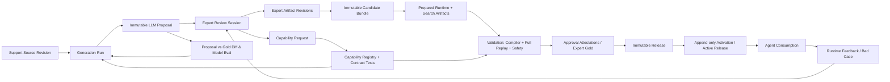
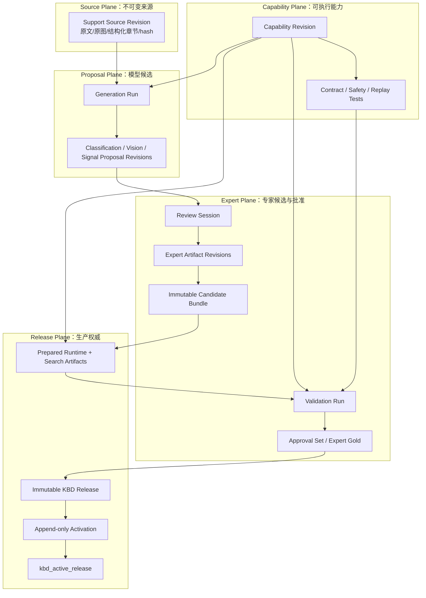
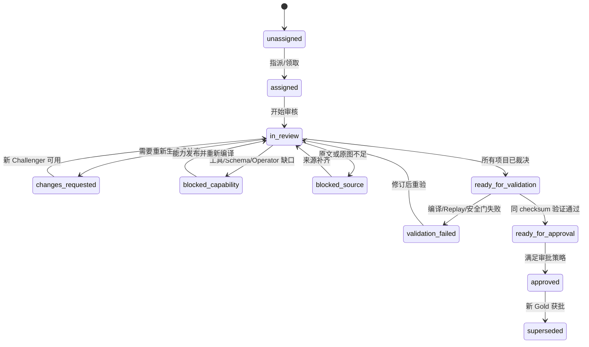
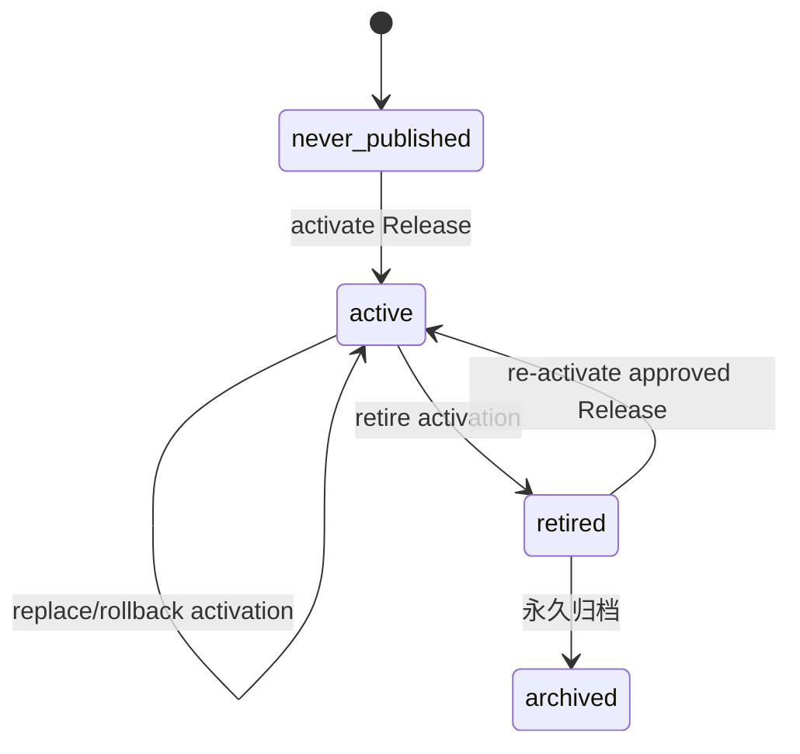

# KBD 专家复核、版本治理与生产消费闭环方案

## 文档定位与确认边界

本文承接 [KBD 截图证据、关键信号与可执行诊断契约方案](2026-07-28-KBD截图证据与可执行诊断契约方案.md)，解决核心 Evidence、Signal、Verification Contract 和 Compiler 形成之后暴露的下一层问题：如何让长期依赖专家的 KBD 生产体系标准、简约、易用、稳定；如何在模型输出不稳定的前提下保存原始 Proposal、专家 Gold 和历史发布版本；如何把生产和审核发现的能力缺口确定性地传递到 Agent 消费端。

本文是**待产品与架构确认的目标方案**，不是当前代码状态。未经确认，不实施数据库、API、Admin UI 或 Agent 运行时改造。与本文同名的任务事件文档只记录拟实施阶段和门禁，不代表任务已经完成。

建议阅读顺序：

- 产品与专家：执行摘要、专家工作台、完整审核流程、待确认决策；
- 模型与知识工程：不可变 Proposal、差异评估、Champion/Challenger；
- 工具与 Agent 工程：Capability Registry、类型化观察/断言、完整 Replay；
- 开发与测试：数据模型、API、迁移、实施阶段、验收标准。

---

## 一、执行摘要

### 1.1 一句话结论

> KBD 不应继续被建模为一行可被 LLM 和人工反复覆盖的 JSON，而应成为一个有不可变来源、多个模型 Proposal、多个专家修订、不可变 Candidate Bundle、独立 Validation/Gold 证明、显式 Active Release 和完整使用审计的受治理可执行知识产品。Agent 只消费 Active Release；LLM 只能提交 Challenger，永远不能覆盖专家 Gold。

### 1.2 对用户四点诉求的直接回答

1. **专家复核会长期存在，应被视为核心生产系统，而不是临时人工兜底。** 审核台需要独立队列、风险分层、逐项裁决、全字段类型化编辑、自动保存、真实身份、并发控制、双人高风险审批、发布与回滚，不能继续复用“KBD 内容管理页”的发布按钮。
2. **应该同时保留 LLM 原始结果和专家修改结果，但不能只做两组可变字段。** 正确模型是 N 个不可变 LLM Proposal + M 个不可变 Expert Revision + 1 个 Active Release Pointer。界面展示“模型原稿、专家当前稿、差异”；运行时只读取 Active Release 所固定的 runtime snapshot，正常新 Release 必须引用已验证、已满足专家审批策略的 exact Bundle；迁移前已生效内容只能走显式、限期且不可扩散的 legacy exception。
3. **生产、审核、消费必须通过能力契约闭环。** 生产端不能生成消费端未声明的语义；缺失能力要形成结构化 Capability Request，经去重、评审、实现、契约测试、注册、重编译、专家确认后进入发布。不能让模型用自由命令绕过能力缺口。
4. **现有 7 个审核缺口应与上述三点一体解决。** 风险队列、Contract 展示、人工确认与 solution 边界、逐项决策、审核进度、Gold 审批、KBD 发布分离，以及当前部署版本可见性都纳入同一工作台和状态机。

### 1.3 六项不可妥协的架构决策

| 决策 | 规则 |
|---|---|
| 权威分离 | Source、Proposal、Expert、Validation/Gold、Release 各层不能共用 last-write-wins 行 |
| 原始结果不可变 | LLM 输出、专家批准快照和历史发布版本只追加，不原地修改 |
| 专家发布权威 | 当前阶段任何自动 Proposal 都不得绕过专家批准成为 Active Release |
| 发布原子性 | 分类、叙事、Evidence、Signal/Contract、Replay 必须由同一个 Bundle 固定版本 |
| 能力先声明后使用 | Schema、Admin 编辑器、Compiler、真实执行器和 Replay 必须消费同一 Capability revision |
| 失败关闭 | 不完整输出、过期来源、未解析冲突、缺失能力、未审批高风险均不得被解释为案例成立 |

### 1.4 目标闭环



### 1.5 当前不应继续做的事情

- 不把“审核通过并发布 KBD”解释为“Proposal 已成为专家 Gold”；
- 不允许重新分类、重新识图、重新抽取直接覆盖专家当前稿；
- 不用 `manual_reviewed` 一个字符串替代原始 Proposal、专家 diff 和审批记录；
- 不用 Schema/Handler 构建通过宣称现场执行可用；
- 不用给定 Signal outcome 的 Decision Replay 宣称完成原始观察到案例裁决的全链路 Replay；
- 不因模型升级或降级自动让已发布专家 KBD stale；
- 不用任意 Shell/ACLI 命令临时弥补尚未注册的消费能力。

---

## 二、背景与需求

### 2.1 为什么专家审核不是过渡方案

KBD 的业务目标不是生成一段“看起来合理”的文本，而是让 Agent 在客户环境执行真实采集并据此确认或排除案例。错误的分类会造成错误召回，错误的 OCR 会制造不存在的事实，错误的 Signal 会采错对象或执行错误命令，错误的 Contract 会把弱证据当成必要条件，错误的 solution 边界可能直接改变客户环境。

在以下条件同时存在时，专家审核是系统可靠性的组成部分：

- Support 原文包含隐形知识、歧义、历史写法和信息缺失；
- LLM 具有随机性、模型漂移、Prompt 漂移和供应商切换；
- QKV/QFK 连接真实客户环境，错误具有放大效应；
- 7000+ 案例跨产品、版本、组件和拓扑，长尾场景无法一次自动覆盖；
- 发布后的 KBD 会被多个 Agent 会话长期复用。

因此平台应优化的不是“如何尽快取消专家”，而是：

> 用最少且最有价值的专家时间，生产可追溯、可回放、可回滚、可持续改进的稳定知识资产。

### 2.2 用户提出的完整需求矩阵

| 需求 | 当前问题 | 目标能力 |
|---|---|---|
| 标准化 | 审核依赖专家自行理解 JSON 和隐含规则 | Schema 驱动表单、统一术语、逐项验收问题和 reason code |
| 简约化 | 风险案例需要手工复制 ID 搜索 | 风险队列、案例标签、一个主操作、“下一条”导航 |
| 易用性 | Source、Evidence、Signal、Contract 分散 | 同一工作台三栏布局与分层标签、source-ref 跳转、差异视图、即时校验 |
| 稳定性 | LLM 重跑覆盖、Job 重启丢失、无冲突检测 | 不可变 revision、持久化 Job、自动保存、乐观锁、幂等操作 |
| 全字段可修改 | Vision、Contract、rejected candidate、Replay 缺编辑 | 所有语义产物均可在专家派生稿中增删改；不可变 provenance 只读 |
| 保留模型与专家两份结果 | Signal/Vision 只有一份工作副本 | Proposal Revision 与 Expert Revision 分离并可结构化 diff |
| 模型持续评估 | 无稳定 prediction-vs-annotation 数据 | 字段级差异、错误原因、冻结 Gold、盲测和 Challenger 指标 |
| 专家持续维护 | 发布后编辑直接切 active revision | 从 Active Release 分支维护稿，重新审批、原子发布、可回滚 |
| 生命周期 | draft/published/rejected/archived 语义过粗 | Review、Annotation、Release、Source freshness 独立状态机 |
| 生产到消费能力演进 | Prompt 可生成运行时不支持的表达 | Capability Request → Registry → Contract Test → Recompile → Review |
| 审核进度 | `pending_gold` 只在测试 manifest | 数据库级队列、分配、草稿、阻塞、审批和完成统计 |
| 安全发布 | 审核与发布耦合 | Gold Approval 与 Runtime Publish 两个显式动作和权限 |

### 2.3 本方案覆盖的“现有七点”

1. 没有五批风险队列和筛选器；
2. 当前部署 bundle 尚未展示新增 Evidence/Rejected Candidate；
3. 根 Verification Contract 没有完整展示和编辑；
4. `require_human_confirm`、phase 和 solution/context 边界没有完整展示；
5. 没有逐 Signal、逐图片、逐 rejected candidate 的专家裁决；
6. 没有可靠的任务分配、进度、恢复、Gold 生成和双人审批；
7. 当前“审核通过”实际发布 KBD，不能代表 Gold 审批，审核备注与真实身份也不可靠。

---

## 三、第一性原理与业界范式

### 3.1 第一性原理

#### 原理一：生成可变，发布必须确定

模型概率输出的重复性不能成为生产正确性的基础。生产稳定性来自：发布内容是一个已批准、带 checksum、依赖固定、可以回滚的不可变快照。

#### 原理二：Prediction 与 Annotation 是不同认识论对象

LLM Proposal 表示“模型认为可能正确”；Expert Annotation 表示“有身份、有责任边界的专家对某个具体版本做出的裁决”。即使两者内容完全相同，也必须保留一次显式的专家接受事件，不能仅因 JSON 相同自动升级为 Gold。

#### 原理三：权威来自指针，不来自最后一次写入

运行时必须通过唯一的 Active Release/control pointer 找到当前生效 Release；Release 再不可变地固定 Bundle、Validation Run、Approval Set、Capability dependencies 与 runtime/search artifacts。最新 Proposal、最新专家草稿或最新模型输出都不是生产权威。

#### 原理四：编辑必须可逆、可解释、可归因

每次专家编辑必须知道基于哪个 Proposal/Gold、改了哪个字段、为什么改、谁改、何时改。否则无法改进模型，也无法解释历史 Agent 为什么使用某条证据。

#### 原理五：生产者只能组合消费者已声明的能力

Signal 不是自由命令。生产端只能引用 Capability Registry 中已激活的 acquisition、transform 和 assertion。无法表达的诊断意图应产生能力缺口，而不是生成幽灵字段或危险命令。

#### 原理六：不完整观察不能参与确定性阈值

输出被截断、扫描不完整、权限不足、解析失败时，阈值比较必须返回 unknown/error，不能在残缺数据上给出 true/false。

#### 原理七：Gold 是可演进资产，不是永恒真理

专家也可能出错，产品版本也会变化。Gold 必须带适用范围、来源 revision、审批人、复审时间和 superseded 关系，并允许二次维护与回滚。

### 3.2 采用的业界范式

| 范式 | 借鉴点 | 在 HTP 中的落地 |
|---|---|---|
| 数据标注平台的 Prediction/Annotation 分离 | 模型预测与人工标注并存 | LLM Proposal 与 Expert Revision 分表/分 revision |
| Git commit/tree/ref | 内容不可变，分支编辑，引用决定当前版本 | Artifact Revision、Bundle Revision、Active Pointer |
| MLflow Tracking / Model Registry | Run 保存参数、输入、产物、指标；Champion/Challenger | Generation Run、冻结 Gold、模型非劣化门禁 |
| OpenLineage | Job/Run/Dataset 血缘 | source/run/artifact/release/usage 的 trace 和哈希 |
| CQRS + Append-only Audit | 写模型保留历史，读模型服务查询 | revision/event 为事实源，`kbd_entry` 逐步降为 projection |
| Policy/Schema as Code | 可执行契约需要静态验证 | Capability Schema、Compiler、Safety Policy、Replay |
| Human-in-the-loop / Four-eyes | 高风险决策需要第二人 | 高风险 Signal、must/exclude/solution 变更双人审批 |
| Shadow / Canary | 新模型、新规则不直接替换生产 | Challenger Proposal、Shadow Compile、分层放量和回滚 |

### 3.3 明确不采用的替代方案

| 方案 | 不采用原因 |
|---|---|
| 在 `kbd_entry` 增加 `llm_*` 与 `expert_*` 两组列 | 只能表达一轮模型和一轮专家，无法处理多次重跑、多人审核、维护和回滚 |
| 每次重跑前备份整行 | 无组件血缘、无逐项 diff、无原子 Bundle 和发布依赖 |
| 只依赖 dynamic resource revision | 它是运行时发布快照，不记录未发布 Proposal、专家逐项决策和模型评估 |
| 让专家直接修改 LLM Proposal | 原始 prediction 丢失，无法准确测量模型差异 |
| 只保存 JSON Patch | 长期回放依赖完整父链，链断或 Schema 迁移时恢复脆弱 |
| 只保存完整快照、不保存 diff/decision | 能回滚但不能解释专家为什么改，模型反馈价值低 |
| 用任意表达式语言一次解决所有 matcher | 攻击面和审核复杂度过大；先采用有限、类型化 operator catalog |
| 缺能力时允许自由 Shell | 绕开最小权限、Compiler、UI、审计和稳定输出契约 |

推荐采用“完整不可变快照 + 结构化 decision/diff”的混合模型：快照保证可靠恢复，diff 和 reason code 服务审核、评估与改进。

---

## 四、当前项目代码与数据审计

### 4.1 生产、审核、消费现状

```text
data-pipeline/kbd
  → kb-service 写 kbd_entry 单行
     ├── ai_category_*       分类 Proposal
     ├── images_json         Vision Proposal/Evidence
     ├── signals_json        Signal + Contract Proposal
     └── category_id/status  人工分类与 KBD 发布状态
  → admin-ui 在同一行编辑/重跑/发布
  → dynamic_resource_revision 生成运行时不可变快照
  → agent-service 读取 active revision 并编译/执行
```

问题不在于完全没有 revision。项目已有 `dynamic_resource_revision`、`dynamic_resource_active` 和 `dynamic_resource_usage_audit`，能够追溯 Agent 使用了哪个已发布 KBD。缺失的是发布之前的生产和专家标注 revision，以及发布 Bundle 与这些 revision 的显式链接。

### 4.2 当前可编辑能力清单

| 产物 | 当前存储 | 当前 UI 能力 | 核心缺口 |
|---|---|---|---|
| 标题/八大章节/content_md | `kbd_entry` 文本列 | 可编辑标题、聚合 Markdown、部分分类 | 源文与专家规范稿混合；发布后编辑会立即切 active |
| 分类 | `ai_category_*` + `category_id` | 可重新分类、人工选 category | 重跑覆盖 AI 结果；无 run、top3、Prompt/model 血缘和 diff |
| 原图 | `kbd_image` | 可触发重识图 | 原图可保留，但对应 source revision 未固定 |
| Vision | `images_json` | 展示 Evidence，支持重跑 | 重跑原位覆盖；无法编辑 type/region/OCR/fact/inference 裁决 |
| Signal | `signals_json.signals` | 只能编辑已有部分字段 | 无增删/复制/排序；matcher UI 仅支持 keyword 或 produces |
| Verification Contract | `signals_json.verification_contract` | 基本不展示 | scope、variables、角色集合和 minimum_should 无编辑器 |
| Rejected Candidate | `signals_json.rejected_candidates` | 新版只读展示 | 无维持拒绝/恢复/工具缺口等专家裁决 |
| Generation metadata | `signals_json.generation_metadata` | 显示部分指纹 | 指纹不代表一次具体输出，重跑同输入仍可相同 |
| Replay | Git `tests/golden` | 无 UI | 只有 4 条工程 Contract fixture，且仅 Decision Replay |
| 审核 | `status/reviewer_id/review_note` | 通过/拒绝/发布 | 与 Gold 混淆；身份、备注、逐项审计、进度不足 |

### 4.3 当前覆盖写与双事实源问题

- 重新分类直接覆盖 `ai_category_id/conf/reason`；
- 批量和单图重识图直接覆盖 `images_json` 并重建 `content_md`；
- 重抽 Signal 直接覆盖整个 `signals_json`；
- 手工 Signal 编辑只把 `generation_metadata.status` 改成 `manual_reviewed`，原始 Proposal 已不可恢复；
- 已发布 KBD 通过 PATCH 编辑会立即创建/激活新的动态资源 revision，绕过重新审核；
- 在线重识图/重抽可能先覆盖已发布业务行，却不一定同步切换 active revision，业务行和 active snapshot 暂时指向不同内容；
- “退回草稿”只改 `kbd_entry.status`，没有撤销 `dynamic_resource_active`，旧版本仍可能继续被 Agent 消费。

### 4.4 当前审核身份与稳定性问题

- Admin UI 的 `currentUser` 固定为 `1`，不是真实登录专家；
- KBD 管理接口使用共享内部 Token，没有 reviewer/approver/publisher RBAC；
- 详情中的 `reviewNote` 输入没有进入批准请求，批准仍发送旧的 `entry.review_note`；
- 无 assignment、claim、lease、autosave、乐观锁和冲突合并；
- Vision Job 状态主要在进程内管理，服务重启可能丢失；
- 当前发布状态同时承担内容审核、专家标注和运行时上线三种语义。

### 4.5 消费端真实能力与门禁断点

用户提出的“统计目录 A 下文件数并确认是否超过阈值”并非完全不支持：Signal v2 已有 `match.type=threshold`，支持 `aggregation=first_number/line_count/duration_seconds` 和 `> >= < <= == !=`；Matcher 也能确定性求值。

但链路仍然不完整：

1. Admin UI 将 QFK 编辑模式硬编码为“关键字判定/产出变量”，不能编辑 threshold；
2. 生成 Prompt 知道 `line_count`，但没有从一个统一 Capability Registry 获得版本化能力；
3. Compiler 只执行 args Schema 和 QFK Handler 命令构建，没有经过真实执行器的 `ToolSemanticValidator`；
4. 实际复测发现多条 Handler 可构建命令会被真实 aCLI catalog 拒绝；
5. `line_count` 可能对被截断 stdout 计数，输出不完整时会产生错误阈值；
6. 普通非零 exit code 与 matcher 的组合仍需统一 fail closed；
7. 当前工程 fixture 的 Decision Replay 直接注入 SATISFIED/CONTRADICTED/UNKNOWN/ERROR outcome，没有从 raw observation 重跑 extract/matcher，也没有走真实执行前校验。

因此，当前 4 条工程 Contract fixture 只能证明 Case Decision State Machine 对四类 outcome 的裁决逻辑，不能证明 4 条案例的真实 acquisition 全部可执行。按真实语义校验器复核，只有 KBD27123 的 QFK 路径全部通过；KBD37150、37180、41818 至少各有一个关键命令在实际执行前会被 catalog 拒绝。

### 4.6 当前 122 条审核队列事实

- 122 条 `pending_gold` 只存在于测试 manifest，数据库没有正式 annotation/review 状态；
- 现有 manifest 仍将 4 条工程 Contract fixture 记为 `annotation_status=gold` 并使用 `gold` 路径键，相关测试名也使用 `GOLD_CASES/test_gold_*`；这是历史工程命名，不是专家 attestation，必须在 P0 结构化重命名为 `engineering_fixture/fixture`；
- 当前管理页按 `draft/published/rejected/archived` 查询，无法按五类专家风险过滤；
- 五类风险是重叠标签，不是五个互斥批次；
- 正式审核必须把 Proposal revision、风险标签、专家决策和 Gold 状态落到数据库事实源。

---

## 五、目标、非目标与系统边界

### 5.1 目标

1. 让 122 条试点和未来 7000+ KBD 在同一标准流程中生产、审核、发布、维护、下架；
2. 所有 LLM 语义产物都可被专家修正，同时原始模型结果不可变保留；
3. Agent 永远只消费唯一 Active Release 所固定的 runtime snapshot；正常新 Release 必须引用已验证并满足审批策略的 exact Bundle，迁移遗留 active 仅允许受治理的限期 exception；
4. 模型/Prompt/工具升级可以生成 Challenger 并量化优劣，但不会扰动 Active Release；
5. 生产和专家发现的消费能力缺口有简单、可跟踪、可测试的工程通路；
6. 每次历史诊断都能解释使用了哪个 KBD、Signal、Capability 和 Matcher revision；
7. 审核操作对专家表现为简洁任务，不要求手工理解完整 JSON。

### 5.2 非目标

- 当前阶段不追求取消专家审批；
- 不允许专家编辑原始 Support 快照或模型 provenance；
- 不把所有 KBD 改写成任意代码或完整 SOP；
- 不开放任意 Shell、Python、正则脚本或通用表达式执行；
- 不因存储所有历史而无限保留含敏感数据的原始请求/响应；
- 不把模型与专家一致率直接等同真实线上准确率；
- 不在本方案确认前修改现网发布指针。

### 5.3 服务职责

| 组件 | 目标职责 |
|---|---|
| `data-pipeline/kbd` | 获取 Source Revision、提交 Generation Run；不直接覆盖专家或发布内容 |
| `kb-service` | revision、review、bundle、capability request、publish policy 的事实源和 API |
| `admin-ui` | 专家任务队列、类型化编辑、diff、裁决、审批、发布与回滚界面 |
| `backend/shared` | Artifact/Signal/Capability Schema、指纹和公共验证 |
| `agent-service` | 对批准 Bundle 做完整 Compiler、Replay 和运行；回传 usage/feedback |
| `dynamic_resource_revision/active/usage` | 继续承担运行时不可变 snapshot、兼容投影和使用审计；不再单独决定业务 Active Release |
| CI/Eval | 冻结 Gold、Challenger 非劣化、安全回归和迁移门禁 |

---

## 六、方案（WHAT）：目标架构与权威边界

### 6.1 四层内容与一个能力平面



### 6.2 各层权威定义

| 层 | 权威内容 | 是否可原地编辑 | Agent 是否直接消费 |
|---|---|---:|---:|
| Source | 某次抓取的 Support 原文、原图、来源元数据 | 否 | 否 |
| Proposal | 某次 LLM run 的结构化预测 | 否 | 否 |
| Expert | 专家基于具体 Proposal/Gold 形成的修订；尚未批准时仍是候选 | 否，只能派生新 revision | 否 |
| Bundle | 一组精确组件 revision 与 Capability dependency 的不可变候选组合 | 否 | 否 |
| Approval/Gold | 专家对 exact Bundle ID/checksum 的 attestation 集合与策略求值 | 只追加、不改历史 | 否 |
| Release | 将已批准、已验证 Bundle 固化为运行时快照的不可变发布记录 | 否 | 由 Active Pointer 选择消费 |
| Activation | activate/replace/rollback/retire/archive 的追加事件和当前指针投影 | 事件只追加；指针原子切换 | 决定是否消费 |
| Capability | 代码支持且通过契约测试的 acquisition/transform/assert | revision 化 | 被 Compiler/Runtime 使用 |

### 6.3 `kbd_entry` 的演进定位

不建议立即删除 `kbd_entry`。迁移期将其定位为管理查询和检索 projection：

- `support_id` 和现有检索索引继续保留；
- **Agent 检索、embedding 和运行时展示字段只允许由 Active Release 投影更新**；
- Proposal/Expert Working Copy 使用独立 Review Workspace read model，绝不回写 Agent 检索 projection；
- Admin 列表可以并列展示 active/proposal/working 三个指针和摘要，但不能把它们合并为一份“当前内容”；
- 不再把其 JSON 列视为不可变历史或专家事实源；
- Agent 逐步改为先解析唯一 `kbd_active_release`，再读取该 Release 固定的 dynamic resource revision；
- 发布操作先创建 revision/event，再刷新 Active projection；保存专家草稿只更新 Review working pointer，不触发 embedding、Agent cache 或检索索引。

这样既保留当前服务兼容性，又避免一次性重写检索和 Agent 链路。

---

## 七、不可变修订与数据模型

### 7.1 为什么不是“两份内容”，而是修订图

业务表面上需要“LLM 一份、专家一份”，但生命周期至少会出现：

```text
模型 A 第一次输出
模型 A 重试输出
模型 B Challenger 输出
专家甲草稿
专家甲修改稿
专家乙高风险复核稿
首次发布
专家维护稿
第二次发布
历史回滚
```

固定两份字段无法表达这些关系。目标数据模型应保存 N 个 Proposal、M 个 Expert Revision，并由唯一 Active Release pointer 决定当前生产权威；Bundle 只负责固定候选组件，不能自行成为 active。

### 7.2 推荐实体

#### `kbd_source_revision`

保存某次来源快照：

- `id`, `kbd_entry_id`, `support_id`；
- `source_updated_at`, `fetched_at`；
- 标题、八大原始/规范化章节；
- image manifest（seq、原图 hash、mime、尺寸、对象引用）；
- `raw_content_hash`, `normalized_content_hash`；
- 抓取器版本、转换器版本、`trace_id`；
- 当前/被替代/撤回语义由 source head pointer 与 lifecycle event 投影得出，不修改历史 Source payload。

原始二进制继续复用 `kbd_image` 或对象存储，revision 固定 hash 和引用，不复制大图。

#### `kbd_generation_run`

每个 LLM stage 每次调用都必须有独立 run：

- `id`, `kbd_entry_id`, `source_revision_id`, `stage`；
- `provider`, `model_id`, 可获得时记录供应商 model revision；
- `pipeline_run_id`, `code_git_sha`, service version/container digest；
- Prompt dynamic resource revision/checksum；
- Capability/Tool Contract revision；
- Schema version、temperature、top_p、seed、max_tokens；
- `attempt_index`, `parent_run_id`；
- `input_hash`, `structured_output_hash`, 可见 raw response 的受控引用；
- token、费用、延迟、状态、错误码、`trace_id`；
- 不保存供应商隐藏思维链，不把凭据写入请求快照。

当前 generation fingerprint 继续保留为“输入配置指纹”，但必须新增 `run_id/output_hash`。相同输入多次生成不同结果时，配置指纹可以相同，run 和 output hash 必须不同。

一次生成的可审计链必须区分 `raw provider response → parsed proposal → deterministic normalized proposal → accepted/rejected candidates`；后处理后的 rejected candidate 不能冒充模型逐字原始输出。多图或供应商重试可在 run 下增加 attempt 记录，保存 `scope_key=image:N`、attempt index、response ID、finish reason、token、延迟和错误。

#### `kbd_artifact_revision`

统一承载组件级不可变快照：

- `artifact_type`: `canonical_narrative/classification/vision_evidence/signal_contract/replay`；
- `origin`: `llm/expert/migration/system`；
- `payload_json`, `schema_version`, `checksum`；
- `source_revision_id`, `generation_run_id`；
- `parent_revision_id`, `base_proposal_revision_id`；
- `created_by`, `created_at`, `trace_id`；
- `origin` 只描述该 Artifact 由模型、专家、迁移还是系统产生；Proposal、Working Draft、Engineering Fixture、Expert Gold 等语义由它参与的 run/review/bundle/approval 关系派生，不在 Artifact 行上再放一个重叠且可误用的全局状态。

Artifact 可被多个 Proposal、Expert 或 Candidate Bundle 复用，某个 Bundle 也可后续被 Gold Approval Set 证明，因此 Artifact 不能拥有全局 `approved/rejected` 状态。审批权威属于某个 exact Bundle/Validation 的独立 attestation 与 Set；“被新 artifact 取代”由 parent/supersedes 关系表达，不修改旧 artifact。

每次修改保存完整 payload，保证任何 revision 可独立恢复。大对象可拆为内容寻址 blob，表中保存 manifest。

#### `kbd_review_session`

承载专家任务而不是 KBD 发布状态：

- `id`, `kbd_entry_id`, `base_bundle_revision_id`, `proposal_bundle_revision_id`；
- `status`, `priority`, `risk_flags`；
- `primary_assignee_id`, `claimed_at`, `lease_expires_at`；
- `review_policy_revision`, `required_approval_count`；实际审核人与审批人来自 decision/approval attestation，不在会话中用单数列覆盖；
- `working_bundle_revision_id`；
- `lock_version`, `due_at`, `completed_at`, `trace_id`。

#### `kbd_review_decision`

以 append-only 事件记录逐项专家裁决；同一对象再次裁决时创建新 decision 并引用/supersede 前一条，Review projection 只显示当前裁决，不 UPDATE 历史 decision：

- artifact、Signal、region、candidate 或 JSON Pointer；
- `decision=accept/edit/delete/reject/restore/block_capability/block_source/manual_only`；
- 标准 reason code、自由备注；
- before/after checksum、结构化 diff；
- actor、时间、`trace_id`。

#### `kbd_bundle_revision`

Bundle 是发布原子单位，保存精确组件引用：

```json
{
  "source_revision_id": "...",
  "narrative_revision_id": "...",
  "classification_revision_id": "...",
  "vision_revision_id": "...",
  "signal_contract_revision_id": "...",
  "replay_revision_id": "...",
  "catalog_revision_id": "catalog-v0:...",
  "catalog_checksum": "sha256:...",
  "capability_dependencies": [
    {
      "capability_id": "qfk_system",
      "version": "...",
      "semantic_digest": "sha256:...",
      "handler_digest": "sha256:...",
      "validator_digest": "sha256:...",
      "operator_bundle_digest": "sha256:...",
      "safety_policy_digest": "sha256:..."
    }
  ]
}
```

示例中的 ID/digest 是结构占位；实际值必须来自 P1 生成并部署的 Catalog v0。Bundle 不能只保存一个能力名字或整数版本，否则无法机械证明 Handler、Validator、Operator 与 Safety Policy 是否仍是被审核的同一语义。

Bundle 自身包含 checksum、父 Bundle、适用范围和固定的 review due policy 输入；它只是不可变候选快照，不内嵌可变审批状态。审批证明位于独立 `kbd_approval_attestation`，满足策略的冻结组合位于 `kbd_gold_approval_set`，两者都绑定 exact Bundle ID/checksum 和通过的 Validation Run。

Compiler/Replay 报告 hash 不放回 Bundle，否则会形成“先验证才有报告、写入报告又改变待验证 checksum”的循环依赖。`kbd_validation_run` 单向引用 `bundle_revision_id + bundle_checksum` 并保存所有报告 hash；Approval 和 Release 再引用该通过的 Validation Run。

#### `kbd_capability_request`

保存生产或审核发现的消费能力缺口：

- 标准化 intent、输入/输出/断言需求；
- 来源案例、Signal/candidate、证据引用；
- 风险和预期适用范围；
- 去重 fingerprint、影响案例数；
- `new/triaged/accepted/implementing/available/rejected`；
- 关联 capability revision、owner、reason、trace。

#### `kbd_approval_attestation`

保存单个、不可变的人类审批证明：

- `bundle_revision_id`, `bundle_checksum`, `validation_run_id`, `validation_result_hash`；
- `review_session_id`, `decision=approved/rejected/changes_requested`；
- reviewer/approver identity、角色与独立性信息；
- 审批策略 revision、结构化 checklist、备注；
- `attested_at`, `trace_id`。

只有当 `validation_run_id` 对同一 Bundle ID/checksum 已通过时才能创建 approved attestation。即使 Expert Bundle 与 Proposal payload checksum 完全相同，也必须有独立 attestation；“内容相同”不等于“专家已经审阅”。

#### `kbd_gold_approval_set`

将多人 attestation 和审批策略求值冻结为一个可发布的 Gold 证明：

- `bundle_revision_id`, `bundle_checksum`, `validation_run_id`, `validation_result_hash`；
- `approval_policy_revision`；
- 按稳定顺序固定的 `attestation_ids` 与 `approval_set_hash`；
- `policy_result=passed/failed`, 失败 reason codes；
- `evaluated_at`, `evaluated_by`, `trace_id`。

Approval Set 只追加、不原地增删审批人。新增一位审批人或策略变化时生成新 Set，旧 Set 仍可解释历史。`policy_result=passed` 的 Set 才形成 Expert Gold；Gold 是 Bundle + Validation + Approval Set 的派生权威，不是对 Artifact 或 Bundle 行原地改状态。

#### `kbd_validation_run`

保存对某个 exact Bundle 的不可变验证结果：

- Schema、stable ID、source-ref、Contract consistency；
- capability-specific adapter/safety validator、DAG、Scope、Coverage、安全；其中 QFK 额外保存 `ToolSemanticValidator` 结果；
- Decision/Evidence/Execution Replay 报告引用；
- Compiler、Capability Bundle、aCLI Catalog、evaluator revision 与目标环境 `capability_digest`；
- 验证期间生成的 exact prepared `dynamic_resource_revision_id/checksum` 和 `search_artifact_revision_id/checksum`；
- `bundle_checksum`, `status`, diagnostics、开始/结束时间、trace。

排队、运行、重试、取消请求和恢复状态属于独立的持久化 `kbd_validation_job`；每个终结 attempt 才固化一条不可变 Validation Run。approved attestation 只能引用 `status=passed` 的终结 Run；终结 Run 的结果、报告 hash 和 artifact 引用不得再更新。任何 Bundle 内容变化都会产生新 checksum，旧 Validation Run 不得复用。后续 Approval Set 和 Release 必须引用该 Validation Run 固定的同一组 runtime/search artifact，不允许发布时替换为另一份“也是 ready”的产物。

#### `kbd_search_build_run`

检索构建是持久化 Job，其 `queued/running/succeeded/failed/cancelled` 位于 Build Run，不写入不可变 Search Artifact。Build Run 固定 Bundle checksum、embedding/index 配置、幂等键、尝试、错误和 trace；只有成功结束才生成 `kbd_search_artifact_revision`。

#### `kbd_search_artifact_revision`

Embedding/检索文档也是按 Bundle 派生的版本化产物，不能在 active 切换后才由 outbox 慢慢补齐：

- `bundle_revision_id`, `bundle_checksum`, narrative/search-document hash；
- embedding model/provider/revision、vector checksum；
- index Schema/analyzer revision、category/scope filters；
- target index/shard、prepared document ID、build run ID；
- `created_at`, `built_at`, `trace_id`。

Validation 阶段先对 exact Bundle 预计算并写入不可见的 Search Artifact，再把其 ID/checksum 写入 Validation Run。不可变 Artifact 没有后续 `readiness` 更新；失败属于 Build Run，成功 Artifact 创建即表示内容已准备，但尚未成为生产权威。Outbox 可以在 Activation 前可靠触发/重试 Search Build Job，但 Job 必须先产生可读、checksum 已验证的不可变 Artifact，Activation 再同步校验并引用它；不得先切 Active Pointer，再靠发布后 Outbox 补建发布关键产物。

#### `kbd_release`

将业务批准版本和现有运行时 dynamic resource revision 连接起来：

- `kbd_entry_id`, `bundle_revision_id`, `validation_run_id`, `gold_approval_set_id`；
- `dynamic_resource_revision_id/checksum`, `search_artifact_revision_id/checksum`, `previous_release_id`；
- `origin=normal/legacy_import`, `attestation_status=expert_attested/legacy_unattested`, `legacy_exception_id`；
- `approval_policy_revision`, `approval_set_hash`；
- `published_by`, `published_at`；
- exact Bundle/Capability checksum 和 trace。

发布事务只接受 `policy_result=passed` 的 Gold Approval Set，且必须与 Validation Run 引用同一 Bundle ID/checksum 和同一组 prepared runtime/search artifacts。Release 不再自由组合多个 `approval_id`，否则发布时可能重新选人或换验证产物，无法复算 Gold 权威。数据库约束必须保证 `Release.bundle = ApprovalSet.bundle = ValidationRun.bundle`。

现有 `dynamic_resource_revision` 继续保存 Agent 实际读取的不可变内容，`kbd_release` 是不可变的“某个 Bundle 已被发布为某个运行时 revision”记录，负责说明为什么、由谁、基于哪个 Gold 和验证报告发布。

数据库 CHECK 必须区分正常发布与迁移例外：`origin=normal` 时 Gold Approval Set 和 Validation Run 均必填且 exact binding 一致；`origin=legacy_import` 时必须 `attestation_status=legacy_unattested` 并关联有效 `kbd_legacy_release_exception`，只能由受控迁移创建。两类 Release 都必须固定可校验的 dynamic runtime revision 与 Search Artifact ID/checksum；legacy 只是豁免历史 Validation/Gold attestation，不豁免运行和检索产物完整性。

#### `kbd_legacy_release_exception`

这是迁移期 grandfather exception，不是 Annotation level：

- `id`, `root_exception_id`, `supersedes_exception_id`, `kbd_entry_id`；
- `reason`, 原 dynamic revision/payload/active pointer checksum；
- `risk_accepted_by`, `risk_accepted_at`, `owner_id`, `approved_by`；
- `review_deadline`, `expiry_policy`, `created_at`, `trace_id`；
- 可证明的历史身份/审批信息与 `actor_unknown/proposal_missing` 缺失标记。

迁移器先创建 root exception，再由 legacy Release 的 `legacy_exception_id` 引用它，避免 Release 与 Exception 形成循环外键。它只用于映射迁移前已 active 的内容，不触发一次新 publish/activate；普通 API 不能创建、复制或引用该例外生成新 Release。延期或风险再接受只能追加带签名的 superseding exception，不能 UPDATE 原记录；当前有效性和到期状态由事件/投影计算。Legacy Release 一旦被替换、retire 或 deactivate，不得再 rollback/reactivate。

`expiry_policy` 必填。默认到期且没有有效 superseding exception 时，系统必须在一个受审计事务中追加 `legacy_exception_expired` lifecycle event 和 retire/deactivate Activation，CAS 删除或替换 `kbd_active_release`，同步删除 `dynamic_resource_active` 兼容投影并写 Search/cache invalidation outbox；这才是“停止新会话使用”，不能只依赖每个读路径临时检查日期。已在到期前固定该 Release 的会话允许完成，但 usage 必须记录 `grandfathered_session=true` 并升级告警。到期事务失败时 fail closed、阻止新会话检索/执行并持续告警，不允许无期限静默存在。

#### `kbd_active_release`（唯一生产指针）

- `kbd_entry_id` 唯一，`release_id`, `activation_id`；
- `lock_version`, `updated_at`, `trace_id`；
- 如未来真正需要多 channel，必须先定义 channel 之间的检索/消费隔离；首期只有一个生产 channel。

唯一生产权威是 `kbd_active_release.release_id`。`dynamic_resource_active` 是与它同事务更新的运行时兼容投影；Search 先解析 `kbd_active_release → kbd_release.search_artifact_revision_id`，再精确读取该不可变 prepared document/index artifact，不能在激活后给外部索引补写另一套“当前版本”；`kbd_entry` 仅是读模型。它们都不能拥有独立的版本选择权威。`manual_only` 也使用这一 Active Release，只在检索/调度时按 Automation eligibility 过滤：人类参考检索可见，自动 CDD 候选不可见，不新建第二套 active pointer。

当前 `ensure_published()` 把“准备 revision”和“切 active”耦合在一个路径。目标 Publisher 必须拆成：

```text
prepare_runtime_revision()
  → 只创建 immutable dynamic_resource_revision，不切 active

activate_release()
  → 校验 Validation + Gold Approval Set + exact runtime/search artifacts
  → 创建 immutable Release
  → 追加 Activation
  → CAS 更新 kbd_active_release
  → 同事务更新 dynamic_resource_active 并写 outbox
```

#### `kbd_activation`

Release 内容不可变，active/rollback/retire/archive 是独立的追加式激活事件：

- `id`, `kbd_entry_id`, `release_id`（停用 tombstone 可为空）；
- `action=activate/rollback/retire/archive`；
- `previous_activation_id`, `actor_id`, `reason`, `created_at`, `trace_id`；
- `kbd_active_release` CAS 的 expected/new revision。

回滚不是把一个已 retired Release 原地改回 active，也不是修改旧 Release；它创建新的 `rollback` activation，引用历史正常、已验证和已 Gold 的 Release，并原子 CAS `kbd_active_release`。Legacy exception 不是可回滚目标。`never_published/active/retired/archived` 是 KBD 生命周期 projection，不是 `kbd_release` 可变状态。

#### `kbd_lifecycle_event` 与 `outbox_event`

生命周期事件以 append-only 方式记录 source、proposal、review、approval、release、rollback、archive、capability gap 和 runtime bad case。`outbox_event` 与业务写同事务提交：Activation 前可可靠触发和重试 Compiler/Replay/Search Build 等持久化 Job，但它们必须先固化终结报告与不可变产物；Activation 后只驱动非权威投影、缓存失效、通知和评估。Release 所需的 validation、runtime revision 和 prepared search artifact 必须在 activation 前完整、可读且 checksum 匹配，不能依赖发布后的异步补偿。

#### `runtime_observation`、关联和评估事实

现有 `tool_result` 不能直接升格为不可变 Observation：它是从 `proposed/executing` 到终态的可变操作日志，ORM 有 `updated_at/onupdate`，且会随 conversation `ON DELETE CASCADE`。同一 acquisition 还可能被 Compiler 跨 Signal/KBD 去重共享，因此不能在 Observation 上放单数 `release_id/signal_id`。

`runtime_observation` 在一次 attempt 终结后追加，不再修改：

- `observation_id`, `source_kind`, 可空 `tool_result_id ON DELETE SET NULL`；
- `exec_id`, `attempt_index`, `parent_attempt_id`, `trace_id`；
- `capability_id/version/digest`, adapter/parser revision；
- typed normalized output、output Schema version、exit code/error type；
- `complete`, `stdout_truncated`, `stderr_truncated`, scanned range/page token；
- raw blob object ref、raw/normalized SHA、脱敏策略 revision；
- runtime product/version/container/host scope、`finalized_at`。

`observation_acquisition_link` 实现多对多关联：`observation_id`, `release_id`, `bundle_revision_id`, `acquisition_id`。`signal_evaluation` 再保存 `observation_id/release_id/bundle_revision_id/signal_id`、assertion/operator revision、outcome、reason code 和 evaluation hash。同一 Observation 可被多个 Signal 用不同 assertion 求值，不复制原始执行。`case_verdict_evaluation` 固定输入 Signal Evaluation ID/hash 集合、Reducer/Policy revision 和最终 verdict。

完整 raw 输出不直接塞入 KBD 或长期数据库：按敏感级别脱敏、加密、访问审计并使用可配置 TTL；结构化 envelope、hash、关联、evaluation 和 Bundle/Capability 引用至少与 Release usage 同周期保留，不被 conversation 删除级联带走。用于长期、经专家批准的 Evidence Replay 数据集的 Observation，必须由专家选择、脱敏并固化为独立 Replay Artifact。

这样每个 Runtime Bad Case 才能从“Agent 用了哪个 Release”继续追到“哪次 acquisition 得到什么完整性状态、由哪版 parser/assertion 形成什么 Signal outcome，再由哪版 Reducer 形成什么案例 verdict”。

#### `runtime_human_attestation`

执行前授权、执行后证据证明和案例结论签署是三个不同对象。`execution_authorization` 绑定 exact tool input hash，在执行前 approve/deny，可复用现有 authorization 语义；执行后的统一、不可变 attestation 至少保存：

- `subject_type=runtime_observation/signal_evaluation/case_verdict_evaluation`、`subject_id`, `subject_hash`；
- `policy_revision`, `attestation_kind=evidence_acceptance/verdict_finalization`；
- `decision=accept/reject/request_reacquire/finalize/request_recompute`；
- `actor_id`, `actor_role`, reason code、comment、`attested_at`, `expires_at`；
- `supersedes_attestation_id`, `revoked_by_attestation_id`, `trace_id`。

当 `verdict_policy=human_finalize_required` 时，finalizer 必须签署 exact `case_verdict_evaluation_id + evaluation_hash`，只能接受或拒绝 Reducer 已计算的结论，不能改写 verdict 标签。输入 Signal Evaluation 集合、Reducer/Policy revision 或 evaluation hash 变化后，旧签署不能复用；attestation 缺失、过期、撤销、角色无权限或 hash 不一致时，Case Verdict 保持 `inconclusive`。若人工提供新事实，先创建独立、签名、有来源的 human Observation，再重新运行 assertion/reducer，并对新生成的 Case Verdict Evaluation 签署；不得直接把 ERROR/UNKNOWN 改成 `confirmed`。

### 7.3 为什么组件 revision 之外还需要 Bundle

如果只给每个组件独立 active 指针，会出现：分类已更新、Signal 仍指旧图片、Contract 仍引用旧 Signal ID 的撕裂状态。Bundle 类似 Git commit 的 tree：一次固定全部组件引用，发布时只能原子切换整个 Bundle。

### 7.4 不可变规则

- 所有 revision 表禁止 UPDATE payload，只允许 INSERT；
- 状态变化通过 event 或受限状态字段记录，内容 checksum 不变；
- 专家“编辑”创建 `origin=expert` 子 revision；
- LLM“重新生成”创建新的 run 和 Proposal revision；
- 相同 payload 可按 checksum 去重，但仍保留独立 accept/decision 事件；
- 删除采用 archived/tombstone，不物理删除仍被历史 Release/Usage 引用的 revision；
- active 切换使用事务、CAS/乐观锁和审计事件。

### 7.5 数据保留建议

| 数据 | 建议保留 |
|---|---|
| 结构化 Proposal/Expert/Bundle/Release | 生命周期内永久保留；归档后按合规策略保留 |
| Prompt/model/config/input/output hash | 永久保留 |
| 可见结构化 LLM 输出 | 永久或长期保留，用于评估 |
| 原始响应大文本 | 默认 180 天，可配置；脱敏、对象存储、权限隔离 |
| 隐藏思维链 | 不采集、不持久化 |
| Support Cookie/API Token | 永不持久化 |
| 原图 | 按现有知识资产保留策略，以 hash 去重 |
| Runtime Usage Audit | 满足排障追溯和合规周期，不能短于 Release 生命周期 |

---

## 八、完整生命周期、状态机与权威规则

### 8.1 不再用一个 `status` 表达所有状态

当前 `draft/published/rejected/archived` 把生产、审核、发布、有效性混在一起，无法回答“来源已更新但当前发布版仍有效”“专家审核被工具能力阻塞”“Gold 已批准但尚未发布”等真实状态。目标态采用正交状态，不做组合枚举。

| 维度 | 建议状态 | 回答的问题 |
|---|---|---|
| Source freshness | `current/source_changed/withdrawn` | 当前专家稿基于的来源是否仍是最新、来源是否撤回 |
| Generation | `queued/running/succeeded/partial/failed/cancelled` | 某次模型生成是否完成，是否存在不完整产物 |
| Review | `unassigned/assigned/in_review/changes_requested/blocked_capability/blocked_source/ready_for_validation/validation_failed/ready_for_approval/approved/superseded` | 专家工作进行到哪里、为什么阻塞 |
| Annotation level | `proposal/engineering_fixture/expert_gold` | 内容是未 attested 的候选（由 artifact origin 区分 LLM/迁移）、工程 fixture，还是由通过的 Gold Approval Set 派生的专家 Gold |
| Lineage quality | `trusted/legacy_partial/proposal_missing/actor_unknown` | 来源、生成或历史人工行为的血缘是否可证明 |
| Release attestation | `expert_attested/legacy_unattested` | 正常 Release 是否有 Gold Approval Set，或只是受控 grandfather exception |
| Automation eligibility | `not_assessed/executable/manual_assisted/manual_only` | 该 KBD 能否进入自动诊断，还是只能作为人工参考 |
| KBD release projection | `never_published/active/retired/archived` | 当前是否有 active Release；这是事件投影，不是 Release 行的可变状态 |
| Runtime compatibility | `compatible/revalidation_required/not_executable` | 固定的 Capability 与目标环境是否仍兼容 |

这些状态必须绑定具体的 Source、Generation Run、Review Session、Bundle 或 Release projection，不能重新压回 `kbd_entry` 的一个全局枚举。同一 KBD 可以同时拥有“旧 Active Release + 新 Proposal + blocked maintenance Review”；平台只分别投影各对象的 head 和状态。

这些状态之间有明确约束，但不互相冒充。例如：

- `expert_gold + never_published` 合法，表示已批准但尚未上线；
- `source_changed + active` 合法，表示新来源待审核，旧批准版暂时继续服务；
- `blocked_capability + active` 合法，表示维护稿受阻，不影响旧 active release；
- “某个 Proposal 直接作为 active 权威”非法；但同一 KBD 在旧 Active Release 继续服务时并行存在新 Proposal/Challenger 是合法且必要的；
- `release_attestation=legacy_unattested + active` 只允许作为迁移期 grandfather exception，必须有风险接受、owner、复审截止日期和 expiry policy；
- `not_executable + active` 必须触发安全降级、告警与下架/回滚决策，不能静默继续执行。

`manual_only` 不是 Review 终态。专家仍可完成来源、分类、Evidence 和人类说明审核，并把 Bundle 批准为 `automation_eligibility=manual_only`。此类 Bundle 的 acquisition/Execution Replay 明确记为 `N/A(manual_only)` 而不是伪造通过；它仍使用同一 Active Release，仅在该 Release 的检索投影中形成“人类参考可见、自动 CDD 不可调度”的 eligibility 视图，不建立第二套索引权威或 active pointer。Agent 只能说明“需人工专家处理/升级”，不能自动给出案例 confirmed。

`manual_assisted` 只允许 Agent 执行已批准的只读 diagnostic acquisition。目标 Contract 将当前单一 `require_human_confirm` 拆成三个正交策略：`execution_policy=auto/confirm_before_execute/prohibited_in_diagnostic`、`evidence_policy=deterministic/human_attestation_required`、`verdict_policy=automatic/human_finalize_required`。当前 `require_human_confirm` 的真实代码语义是“执行前授权”，不是对 Observation 或 Verdict 的事后证明。

对 `manual_assisted`，缺少、过期、身份无权限或 hash 不匹配的 observation/verdict attestation 都使 Case Verdict 保持 inconclusive；`phase=solution` 和写操作不得借 manual-assisted 进入验证图，人工 attestation 也不能把 ERROR/UNKNOWN 直接翻成成立。`executable` 才允许在全部确定性门满足后自动形成案例 verdict；自动 remediation 仍明确不在本方案范围。

Bundle 固定 `review_due_policy`。到期默认进入复审队列并告警，不原地修改 Bundle；只有高风险政策明确配置 `retire_after_grace_period` 或出现安全/兼容性失效时才自动停止新消费，避免实现自行猜测。

### 8.2 Review 状态机



普通案例允许一名具备权限的专家审核并批准；出现以下任一情况时默认要求第二名高级专家批准，并禁止自审自批：

- 新增或修改 `must`、`exclude`；
- 改变 `minimum_should`、Scope、案例 Verdict 规则；
- 新增/关闭 `execution_policy=confirm_before_execute`，或改变 evidence/verdict human-attestation policy；
- 把 solution/remediation 内容移入 verification；
- 引入新的高风险 Capability、目标容器或客户侧敏感数据读取；
- 原始截图不可辨识但仍拟形成事实；
- 第一位专家与 Proposal 在关键字段上存在重大分歧。

### 8.3 KBD Release projection 与 Activation 事件



`shadow` 是 Bundle/Capability 的验证部署阶段，`rollback` 是一次 Activation action，都不是不可变 Release 行的可变状态。Release/Activation 规则：

1. 只有 `policy_result=passed` 的 Gold Approval Set 与其绑定的同 checksum Validation Run 才能创建正常 Release；
2. “批准 Gold”和“发布到 Agent”是两个权限、两个 API、两个审计事件；
3. 发布前 Validation Run 已固定 runtime snapshot 与 prepared search artifact；发布事务创建不可变 Release、追加 Activation、CAS 唯一 `kbd_active_release`、同事务更新 `dynamic_resource_active` 兼容投影并写 outbox；Search 由 active release 解析 exact search artifact ID/checksum 后精确读取已准备文档，不设第二权威指针，也不在激活后修改不可变索引产物；
4. 查询接口只读 active pointer，禁止在 GET/Search 路径中 `ensure_published()` 或产生新 revision；
5. 回滚追加新的 `rollback` Activation 并引用历史已批准 Release，不修改任何历史 payload 或旧 Release 状态。CAS 前必须同时验证：历史 dynamic runtime revision 存在且 checksum 匹配；历史 Search Artifact/document/vector 存在、checksum 匹配并可读；当前查询/索引基础设施兼容其 schema/analyzer；目标环境 deployed Capability digest 满足历史依赖；当前安全策略允许激活。任一失败都不得移动 `kbd_active_release` 或 `dynamic_resource_active`，返回结构化 `rollback_blocked` reason 并进入制品完整性修复或重新构建、Validation 和必要的 Gold 审批；不能偷偷以新产物替换旧 Release 固定 artifact；
6. 下架必须撤销或替换 active pointer，不能只把 `kbd_entry.status` 改成 draft；
7. 归档停止新检索和新执行，但保留历史 revision、审批、usage audit 与解释能力。

### 8.4 全生命周期场景矩阵

| 场景 | 正确处理 | 生产是否变化 |
|---|---|---:|
| LLM 与专家完全一致 | 记录 `accepted_unchanged`；Expert Bundle 可按 checksum 复用 Proposal artifact；单独保留人工 attestation | 仅显式发布后变化 |
| 专家修改 Proposal | 创建 Expert Revision 和逐项 decision，Proposal 保持不可变 | 仅由新 Gold 派生的 Release 显式激活后变化 |
| 同模型同输入再次生成 | 新建独立 run、output hash 和 Challenger Proposal | 否 |
| 换更强/更弱模型 | Shadow 生成 Challenger，与冻结 Gold 分层比较 | 否 |
| Prompt/Schema 优化 | 新 run、新 Proposal；旧 Gold 不因模型变化自动失效 | 否 |
| 专家持续维护 | 从 Active Bundle fork maintenance draft，重新验证、审批、发布 | 新 Release 后变化 |
| Support 原文更新 | 新 Source Revision + 影响分析 + Challenger；旧 active 可按策略暂留 | 默认否 |
| Capability 兼容升级 | 固定新 revision 做全量回归，结果非劣化后生成升级建议 | 默认否 |
| Capability 破坏升级/禁用 | 依赖 KBD 标 `revalidation_required/not_executable`，触发安全下架或重审 | 由策略显式处理 |
| 专家判断仅适合人工 | Expert Draft 标 `manual_only`；完成适用审核和显式发布后，以同一 Active Release 保留人类参考可见并禁止自动 CDD 调度 | 草稿标记时不变；新 `manual_only` Release 激活后，自动调度资格变化 |
| 专家判断需要人工证明 | Expert Draft 标 `manual_assisted`，分别配置执行前授权、Evidence attestation 和 Verdict finalization policy；重新验证、审批并发布 | 草稿标记时不变；新 Release 激活后按固定人工策略运行 |
| 案例过期 | retire/archived，撤 active、保留历史使用记录 | 是 |

### 8.5 来源、模型和工具变化的 stale 语义

“stale”必须说明原因和影响范围，不能再用一个字符串把所有变化都当成运行时失效：

- `source_update_available`：来源有新 revision，触发影响分析；不自动覆盖旧 Gold；
- `proposal_outdated`：存在更新模型/Prompt 的 Proposal；只影响模型候选的新旧，不影响已发布 Gold；
- `revalidation_required`：Capability、Compiler 或安全策略变化可能改变已批准语义；必须重放；
- `runtime_incompatible`：当前目标环境缺少固定 Capability；执行时 fail closed；
- `approval_not_applicable_to_new_bundle`：工作指针已指向新 Bundle；旧 Approval 仍是对旧 Bundle ID/checksum 的有效历史证明，但不得被复用到新 Bundle。新 Bundle 必须重新 Validation 和 Approval，不修改、撤销或“使旧 Approval 失效”。

---

## 九、专家复核工作台：完整但不复杂

### 9.1 产品定位

应新增独立的“Proposal 专家复核工作台”，而不是继续扩展当前内容管理页的“审核通过并发布”。当前内容管理页可保留搜索、查看、历史发布运维功能；正式 Gold 生产进入专用路由和权限域。

对专家而言，平台只需要稳定呈现三份内容：

```text
LLM Proposal（机器原稿，只读）
Expert Working Copy（当前可编辑）
Active Release（现网版本，只读）
```

底层的 run、artifact、bundle、event 和 checksum 复杂度由平台承担，不转嫁给专家。

### 9.2 队列页

队列顶部提供：待领取、我的审核中、能力阻塞、来源不足、待验证、待二审、已 Gold、已发布。五批建议复核顺序保留为可保存的风险视图，但案例只出现一次并可同时挂多个标签：

- `人工确认/高风险`；
- `Rejected Candidates`；
- `图片 Evidence/图片 Signal`；
- `Contract 角色冲突`；
- `Solution/Context 边界`。

补充推荐标签：`零信号`、`低质量图片`、`能力不可执行`、`输出波动高`、`来源不足`、`已发布维护`、`运行时 Bad Case`。

队列每行至少展示：Support ID/标题、产品分类、风险标签、图片/Signal 数量、must/should/exclude 数量、rejected 数量、编译状态、语义门状态、负责人、最后保存时间、审核进度和当前 active revision。支持按风险、分类、工具、能力缺口、状态、负责人和来源批次过滤。

批量操作只允许任务分配、标签、优先级，以及对**同 Schema、同低风险规则、逐项可展开**的 unchanged Proposal 做批量接受；必须保留抽样和撤销能力。`must/exclude/solution` 变更、恢复 rejected candidate、高风险人工确认、Gold Approval 和 Runtime Publish 禁止批量跳过逐条核对。

### 9.3 单案例工作台

推荐采用“左侧来源、中间审核、右侧验证”的三栏布局，并用标签页渐进展开：

| 区域 | 默认内容 | 目的 |
|---|---|---|
| 左栏 | Support 原文、原图、图片上下文、source-ref 高亮 | 确认机器产物确有来源 |
| 中栏 | Proposal 与 Expert Diff；类型化编辑器 | 接受、修改、删除、新增 |
| 右栏 | Contract、编译结果、真实语义门、Coverage、Replay | 看到 Agent 最终会做什么 |

标签页建议：

1. 概览与风险；
2. 来源文档；
3. 分类与适用范围；
4. 图片与 Evidence；
5. Signals；
6. Verification Contract；
7. Rejected Candidates；
8. Compile、Coverage 与 Replay；
9. 历史版本、Diff 与运行反馈。

默认“简单模式”只显示专家要回答的问题与高风险字段；“高级模式”才展示 JSON Pointer、Capability revision、raw observation、完整 provenance 和编译产物。专家不需要手写 JSON。

左栏同时提供“打开来源站当前案例”和“查看本次审核的不可变 Source Snapshot”两个入口，并显示 source hash/更新时间差异。专家审的是固定 Snapshot；实时来源若已变化，只能创建新 Source Revision，不能静默改变当前工作基线。

### 9.4 每个审核对象的标准动作

每个分类、图片 region、observed fact、inference、Signal、Contract 条目和 rejected candidate 都使用同一动作语言：

- 接受不修改；
- 修改后接受；
- 删除；
- 新增；
- 保持拒绝；
- 恢复为候选；
- Prompt 问题；
- Vision 问题；
- Schema 问题；
- Capability/工具问题；
- 原文信息不足；
- 仅适合人工；
- 安全风险。

标准 reason code 用于评估和统计，自由备注只补充无法结构化的信息。每个动作都自动记录 actor、时间、基线 revision、before/after 和 source ref。

### 9.5 图片审核体验

专家必须同时看到：原始截图、tile/region 框、OCR 行、Observed Facts、Inferences、图片上下文以及引用该 region 的 Signal。支持：

- 修正 screenshot/evidence type；
- 修改或新增 OCR 行、字段和 observed fact；
- 调整、拆分、合并 region/bbox；
- 将不可支撑的 fact 降级为 inference；
- 接受、拒绝或重写 inference；
- 标记不可辨识、遮挡、过小、截断或与案例无关；
- 从某个 region 创建/解除 Signal source ref。

图片“识别成功”不能只依赖 description 非空。发布门需要检查关键 Token、事实支撑、region/source-ref 和质量状态；`unverified inference` 不能自动进入事实型 Signal。

### 9.6 Signal 与 Contract 审核体验

P2 Signal 编辑器先由共享 Schema + Catalog v0 驱动；P4 Registry v1 上线后再由完整 Registry metadata 驱动。两阶段都只能选择当前 Catalog/Registry 已声明并与目标环境兼容的能力，支持：

- 新增、删除、复制、排序；
- QKV/QFK/Capability 选择；
- acquisition args；
- produces/requires 及类型；
- matcher 或 typed assertion；
- role 与 phase；
- 兼容字段 `require_human_confirm`（只读展示其“执行前授权”迁移结果），execution/evidence/verdict policy、风险和成本；
- provenance/source refs；
- timeout、completeness 和 failure policy；
- 编译后的实际 acquisition 预览。

根 Verification Contract 是角色唯一权威，界面必须完整展示并编辑：Scope、variables、must/should/exclude/context、minimum_should、missing/error policy 和 solution/context 边界。局部 `signal.role` 如果保留，只能作为投影视图，不能与根 Contract 形成第二权威。

### 9.7 专家主流程

```text
领取任务
→ 阅读概览和风险
→ 对照 Source/原图逐项裁决
→ 处理 rejected candidates
→ 校正 Signals 与根 Contract
→ 一键编译并查看 Agent 实际 acquisition
→ 补齐 Evidence/Execution/Decision Replay
→ 处理或提交 Capability Request
→ 保存草稿
→ 提交验证
→ 提交审批
→ 批准 Gold
→ 由发布权限显式上线
```

页面提供自动保存、键盘快捷键、“保存并下一条”、崩溃恢复、未保存离开提示和清晰的剩余项计数。验证失败必须定位到字段和来源，不只返回一段后端异常。

### 9.8 并发与任务稳定性

- 领取建立 soft lease，超时可续租或释放；
- 保存使用 `If-Match/lock_version`，冲突返回 409 和字段级 diff，不静默 last-write-wins；
- autosave 只保存 Expert Draft，不触发发布；
- 生成任务进入持久化队列，支持幂等键、重试、取消、恢复和运行日志；
- 新 Challenger 到达时不替换专家当前 working base，只提示“有新建议可比较”；
- 批准绑定 exact bundle checksum；批准后任何改动都生成新 draft 并要求重验。

### 9.9 Gold 批准与发布前最终预览

专家和发布者必须看到“最终 Bundle 快照”；对于 executable Bundle，这就是 Agent 将实际消费的内容。预览至少包括：最终分类和 Scope、最终 Evidence、Signals、根 Contract、编译后 acquisition、Capability 依赖、Compiler diagnostics、Coverage、三层 Replay、Automation eligibility、Bundle checksum，以及与当前 active release 的差异。

创建一条 Gold approval attestation 前必须满足：

```text
逐项裁决完成
无 capability/source blocker
无未处理高风险
Source 与 Bundle 关联明确
Schema / DAG / Coverage 通过
每个 executable acquisition 通过 capability-specific adapter/safety validator
QFK acquisition 额外通过 ToolSemanticValidator
适用的 Evidence / Execution / Decision Replay 通过
manual_only 的不可用门禁明确记录 N/A 原因
当前 working bundle checksum = validation bundle checksum
本次 attestation 绑定 exact validation_run_id + validation result hash
当前 actor 满足角色、独立性和重复审批约束
```

发布前再额外要求：

```text
Gold Approval Set 冻结的 attestation 集合满足 review policy（普通单审/高风险双审）
Gold Approval Set、Validation Run 与 Release 引用同一 bundle_revision_id + bundle_checksum + validation_run_id
Release 只引用 Validation Run 已固定的 runtime/search artifact ID + checksum
release snapshot checksum 可确定性复算
目标环境满足固定 Capability dependencies
active pointer 的 expected revision 仍未变化
```

也就是说，单个 attestation 绑定已通过的 Validation Run，多人审批完成后再创建不可变 Gold Approval Set；发布只能引用该 Set 及其 Validation Run 已固定的 runtime/search artifacts，不得在发布时重选审批人或替换产物。

---

## 十、LLM 自动产物的完整可编辑清单

### 10.1 总原则

所有 LLM 生成的**语义内容**都必须能在 Expert Working Copy 中修改；原始 Proposal、Source 和 provenance 不允许原地修改。界面上的“编辑”语义是“派生专家 revision”，不是 UPDATE 模型原稿。

### 10.2 编辑矩阵

| 领域 | 专家可编辑内容 | 机器原稿中只读保留的内容 |
|---|---|---|
| Canonical narrative | 标题、现象、告警、原因、步骤、根因、解决方案、总结、适用范围、版本说明 | 原始 Support 原文、原图、抓取时间、source hash |
| Classification | 人工分类、候选层级、适用产品/组件/版本 | AI top1/top3、confidence、reason、taxonomy revision |
| Image basic | screenshot/evidence type、是否相关、质量结论、上下文 | 原图 hash、原始尺寸、source image seq |
| Region/OCR | bbox、region type、text lines、fields、关键 Token | 模型原始 region/OCR Proposal、预处理和 tile 映射 |
| Evidence | observed facts 增删改、fact/inference 转换、inference 接受/拒绝 | 原始模型 Evidence、model/prompt/run provenance |
| Signal identity | 新增、复制、删除、排序、稳定逻辑 ID 映射 | run-local 原始 ID、origin lineage |
| Acquisition | tool/capability、args、host/container、timeout、completeness | 模型原始选择和原始参数 |
| Transform/Extract | JSON path、文本选择、类型转换、变量产出 | 模型原始 transform |
| Assertion | keyword/regex/state/threshold/json_path/exists 或 typed operator | 模型原始 matcher |
| Orchestration | produces/requires、phase、风险、成本、人工确认 | 模型原始编排 |
| Provenance | 可纠正 source refs、evidence region 与引用关系 | 模型原始 provenance、自动对齐置信度 |
| Contract | Scope、variables、must/should/exclude/context、minimum_should、失败策略 | 模型原始 Contract |
| Rejected candidates | 保持拒绝、恢复、重写、转能力缺口/Prompt/Schema 问题 | 原始候选、确定性规范化前后版本和拒绝理由 |
| Replay | raw/normalized observations、positive/negative/boundary/unknown/error 场景、expected outcomes/verdict | 自动生成的 fixture Proposal 和生成血缘 |
| Review metadata | decision、reason code、备注、复审日期、维护说明 | actor identity、时间戳、审计事件 |

### 10.3 不应开放修改的字段

- Source 原始 payload、原图字节和 hash；
- LLM 原始响应、provider response ID、模型/Prompt/config；
- generation run、trace、token/latency、输入/输出 hash；
- 已批准 Bundle 和已发布 Release payload；
- 历史 decision、approval、usage audit；
- Capability executable handler 与安全策略代码。

若来源确有错误，应创建纠正后的 Source Revision；若历史专家结论有误，应从 Gold 分支维护 revision；若工具实现有误，应发布新 Capability revision。任何情况都不篡改历史事实。

---

## 十一、Proposal—Expert 差异、模型评估与持续改进

### 11.1 为什么保留两类结果有实际价值

不可变 Proposal 与 Expert Revision 不是为了“多存一份 JSON”，而是建立可学习的预测—标注对：平台能区分模型漏抽、错抽、工具路由错、参数错、图片错、证据角色错、Contract 错、能力缺口和原案例不足。这些差异才是 Prompt、Schema、模型和工具改进的训练信号。

### 11.2 稳定实体身份与结构化 Diff

不能使用数组下标或每次重跑的 `sig_001` 作为长期身份。平台为 Signal、图片 region、Contract 条目和 rejected candidate 分配稳定 UUID，并保存：

- `origin_entity_id`：来自哪个 Proposal 实体；
- `supersedes_entity_id`：取代哪个 Expert 实体；
- `logical_intent_fingerprint`：按意图、Capability、source refs 和输出语义对齐；
- `run_local_id`：仅用于还原模型原始输出。

Diff 以语义字段为单位，不以 JSON 文本行比较：分类树距离、region IoU、OCR token、observed fact、Signal tool/args/transform/assert/source ref、Contract role/phase/policy、Replay outcome/verdict 分别计算。

### 11.3 评估指标

| 领域 | 核心指标 | 防误用说明 |
|---|---|---|
| 分类 | Top1、Top3 Recall、Macro-F1、层级距离、校准误差、人工改分类率 | 绑定同一 taxonomy revision |
| Vision 类型/区域 | type Macro-F1、region IoU、低质量召回 | 按截图/照片/弹框等类别分层 |
| OCR | CER/WER、关键 Token Recall | 全文指标与关键诊断 Token 分开 |
| Evidence | observed fact precision/recall、inference leak、source-ref 修正率 | 未验证 inference 不算事实命中 |
| Signal | 专家接受率、Gold recall proxy、专家新增/删除率、工具和参数准确率 | 不能只看 Schema pass rate |
| Contract | must/should/exclude/context F1、Scope/phase 修改率、Verdict 一致率 | 高风险字段单独门禁 |
| Stability | 同配置多次输出 Jaccard、字段波动率、关键 Signal 丢失率 | 反映模型随机性 |
| Executability | Schema、Handler、Semantic Validator、Evidence Replay pass rate | 三层必须分开报告 |
| Expert effort | 审核时长、接受率、编辑距离、阻塞率、二审分歧 | 不用“修改少”单独代表质量高 |
| Runtime | confirmed/rejected/inconclusive、ERROR/UNKNOWN、Bad Case、回滚率 | 线上反馈不是无偏 Gold |

“与专家一致率”只能衡量对当前标注规范的拟合，不能单独证明现场真实正确。需要抽样二审、专家一致性、运行反馈和独立盲测共同验证 Gold 质量。

### 11.4 新模型与既有专家稿的三方比较

后续模型优化不能只做 `New Proposal → Active Gold` 二方覆盖，而应同时保留：

```text
P0 = 专家开始审核时的旧模型 Proposal
E1 = 当前专家结果/Active Gold
P1 = 新模型 Challenger Proposal
```

| P0→E1 | P0→P1 | 处理规则 |
|---|---|---|
| 专家未改 | 新模型改变 | 作为可选建议，不能自动覆盖 E1 |
| 专家已改 | 新模型未改 | 保留专家修改，标记 Challenger 仍未学会 |
| 专家与新模型改成同一语义 | 一致 | 记录“模型已学会”，生产内容不需自动变化 |
| 专家和新模型对同一字段改成不同值 | 冲突 | 必须专家裁决，禁止 last-write-wins |
| 新模型新增 Signal | 专家稿无对应项 | 作为候选并要求 source ref/compile/replay，不自动加入 |
| 新模型删除专家 `must/exclude` | 高风险冲突 | 禁止自动删除，进入高级专家队列 |
| P1 基于不同 Source Revision | 不可直接比较 | 先做来源差异和影响分析，再建立新的 review base |

专家可以 cherry-pick Challenger 的单项建议，平台据此创建新的 Expert Revision 和 decision；不能把整份 P1 替换 E1 后再靠人工寻找丢失修改。

### 11.5 Champion/Challenger 流程

```text
冻结 Source Revision + Expert Gold + Dataset Revision
→ Champion 与 Challenger 各运行多次
→ 保存所有 run 和波动
→ 按分类/风险/图片类型/Capability 分层比较
→ 检查关键指标非劣化和安全门
→ 仅生成 Shadow Proposal/专家建议
→ 专家选择性接受
→ 新 Expert Revision
→ 再审批、再发布
```

Challenger 永远不能自动覆盖 Gold 或 active release。新模型可以证明“更接近专家”“更稳定”“工程门通过率更高”，但只有专家批准的具体 Bundle 才能上线。

### 11.6 数据集治理

必须区分：

- Prompt/规则调优集；
- 开发回归集；
- 独立盲测集；
- 生产 Shadow 集；
- Runtime Bad Case 回流集。

当前 126 条已参与多轮设计、Prompt 和规则调试，只能作为已知回归/专家标注试点，不能再冒充独立盲测集。任何评估结果都绑定：dataset revision、source revision、proposal run、gold bundle、Capability bundle 和 evaluator revision。

### 11.7 生产审核与无偏评估必须分开

日常生产审核可以向专家展示 Proposal 和 Diff，以降低审核成本；但这种结果会受到 anchoring bias（专家被模型先验锚定），只能称为 `model_assisted_annotation`，不能直接作为无偏模型准确率。

冻结盲测和 Gold 质量抽样使用独立模式：

- 隐藏模型身份、confidence、reason 和预测值，先让两名专家独立标注；
- 分歧由第三方或高级专家仲裁；
- 固定 `annotation_guideline_revision`、专家资格、盲化模式和仲裁记录；
- 模型结果只在标注冻结后揭盲并计算指标；
- 从生产审核中随机抽取一部分做 blind re-annotation，估计锚定偏差；
- 报表明确区分 assisted acceptance/edit 指标与 blinded accuracy/F1。

因此 Proposal→Expert Diff 非常适合改进生产效率和定位错误，但独立盲测仍是模型升级门禁，不可被前者替代。

### 11.8 Active Learning 优先级

优先把以下案例送专家，而不是随机平均审核：

1. 多次生成高度波动；
2. Champion/Challenger 关键字段分歧；
3. `must/exclude/solution` 高风险；
4. rejected candidate 密集或零信号；
5. 图片事实与文本冲突；
6. capability blocker；
7. Runtime ERROR/UNKNOWN/Bad Case；
8. 分类树长尾或来源更新。

---

## 十二、Capability Registry：打通生产、审核和消费

### 12.1 当前问题的准确表述

用户示例“统计目录 A 下有多少文件，并判断是否超过阈值”在当前代码中**部分可表达**：Signal v2 和 Matcher 已支持 `threshold + line_count + >`。但 Admin UI 不支持完整编辑，Compiler 没有运行真实执行器的语义门，Matcher 可能处理截断输出，且自由命令并不一定存在于 aCLI Catalog。

当前最危险的链路是：

```text
生产端认为可生成
→ Shared Schema 认为合法
→ QFK Handler 能构建命令
→ Compiler 宣称通过
→ Decision Replay 宣称裁决可回放
→ ToolSemanticValidator 在 terminal bridge 前拒绝
```

因此本方案不把问题简化为“新增一个阈值 UI”，而是建立生产、审核、编译、执行和回放共同消费的 Capability revision。

### 12.2 Capability 的定义

Capability 是经代码审查、测试和版本发布的“可获取哪类完整观察、返回什么类型、允许做哪些断言、在哪些环境安全可用”的契约，不是数据库中任意可编辑的一段命令。

下面的 `filesystem.count_entries@1` 是 **P4 Registry v1 目标示例**，不是当前已部署能力，也不能用于让 P1/P3 Validation 假通过：

```yaml
capability_id: filesystem.count_entries
version: 1.0.0
lifecycle: active
input_schema:
  path: {type: string}
  entry_type: {enum: [file, directory, symlink, any]}
  recursive: {type: boolean}
  include_hidden: {type: boolean}
output_schema:
  type: object
  required: [count, complete]
  properties:
    count: {type: integer, minimum: 0}
    complete: {type: boolean}
allowed_assertions: [numeric.gt, numeric.gte, numeric.lt, numeric.lte, numeric.eq, numeric.ne]
safety:
  read_only: true
  allowed_path_prefixes: [/sf/, /proc/]
  max_runtime_seconds: 10
  returns_file_names: false
compatibility:
  products: [HCI]
  containers: [host, asv-con]
fixtures: [empty, n_minus_1, n, n_plus_1, missing_path, permission_denied, timeout]
```

Registry revision 至少固定：

- capability ID/version/lifecycle；
- typed input/output Schema；
- acquisition handler 和实现 digest；
- selector/transform/aggregate/assert operator revision；
- aCLI Catalog、sanitizer、risk policy、parser/extractor revision；
- product/version/container/permission compatibility；
- completeness/truncation/exit-code semantics；
- 风险、side effect、成本、延迟与弃用策略；
- Contract/Evidence/Execution fixtures。

Capability manifest 是代码发布物。Admin 可以启停已发布 revision、发起需求和选择能力，但不能热编辑 executable handler 或安全语义。

### 12.3 P4 生产端先抽诊断意图，再映射能力

P4 的 LLM 应先产生与具体工具解耦的 Intent IR：

```json
{
  "intent_type": "filesystem_count",
  "target": {
    "path": "/allowed/path",
    "entry_type": "file",
    "recursive": false
  },
  "predicate": {"operator": ">", "value": 100},
  "source_refs": ["section:steps_text/paragraph:4"]
}
```

确定性 planner 再查询 Registry：

```text
Intent → 有兼容 Capability → 编译为 Signal Proposal
Intent → 无兼容 Capability → Rejected Candidate + Capability Request
```

没有能力时不得伪造一个看似合法的 `qfk_system.command`，也不得让运行时 LLM 临时决定布尔结果。

### 12.4 P4 类型化 Observation 与 Assertion

长期建议把“采集、选择、转换、聚合、比较”显式分层：

```json
{
  "observe": {
    "capability": "filesystem.count_entries@1",
    "args": {
      "path": "{{DIRECTORY}}",
      "entry_type": "file",
      "recursive": false
    }
  },
  "assert": {
    "select": "$.count",
    "compare": {"op": "gt", "value": 100}
  }
}
```

Registry v1/P4 的第一批 typed operators 采用封闭 Operator Catalog：selector、filter、aggregate、compare、logical；限制 AST 深度、节点数、输入记录数、正则长度和执行时间，并对类型、单位、空值、缺字段、解析失败给出固定语义。P1/P3 不得假设这些能力已经存在；P4 也不开放任意 CEL、Python、JavaScript 或 Shell。

### 12.5 目录计数与阈值的短期和长期方案

| 演进层 | 方案 | 约束 |
|---|---|---|
| 兼容过渡 | 继续支持 v2 `threshold + line_count`；Admin 补齐编辑；Compiler 纳入 Semantic Validator；非零 exit/truncated 直接 ERROR/UNKNOWN | 只适合完整、有界、格式稳定的非空行计数 |
| 目标能力 | `filesystem.count_entries@1` 返回 `{count, complete}`，在边缘受控计数 | 不传回完整文件列表，避免截断、泄漏和格式歧义 |
| 扩展能力 | typed selector/filter/aggregate/compare | 支持普通文件、隐藏文件、递归、扩展名、时间窗口等明确语义 |

`ls | wc -l`、`find ... | ...` 等自由 Shell 不是长期方案。只需要 count 时应把聚合下推到受控能力并只返回整数。

### 12.6 Capability Request 闭环

```mermaid
flowchart LR
    I["LLM/专家发现无法表达的诊断意图"] --> R["Capability Request"]
    R --> T["去重、影响案例统计、风险分级"]
    T --> S["输入/输出/安全契约设计"]
    S --> E["Handler + Operator 实现"]
    E --> V["Schema/Safety/Evidence/Execution 测试"]
    V --> D["Agent 先部署并声明 digest"]
    D --> O["Registry revision Active"]
    O --> C["受影响 Proposal 重新编译/生成 Challenger"]
    C --> X["专家确认新 Expert Revision"]
    X --> B["Candidate Bundle"]
    B --> A["Prepared Runtime + Search Artifacts"]
    A --> G["Validation + Gold Approval Set"]
    G --> P["Release + Activation"]
    P --> F["Runtime 指标和 Bad Case 回流"]
    F --> T
```



Capability Request 保存 intent、期望输入/输出、断言、正负/错误样例、安全边界、来源 KBD/Signal、影响数量、owner 和目标版本。同类需求按 intent fingerprint 聚合；专家可在 Signal 旁“一键创建”，无需离开审核台写零散需求。

### 12.7 部署与兼容顺序

1. Agent Handler/Operator 与安全策略上线；
2. Agent 暴露实际 Capability digest；
3. Contract/Execution Replay 通过；
4. Registry revision 激活；
5. kb-service Compiler 和 Admin 编辑器读取该 revision；
6. data-pipeline 才允许生成该能力；
7. 受影响 Proposal 重新编译并由专家确认；
8. KBD Bundle 固定 capability version 后发布。

平台声明能力与客户目标环境实际能力取交集。缺少固定版本时输出 `NOT_EXECUTABLE/INCONCLUSIVE`，不自动换成语义近似的其他命令。

在阶段过渡期，P1/P3 必须按以下规则失败关闭：

```text
Catalog v0 已能准确表达，且真实 adapter/safety/semantic gate 通过
→ 可进入正常 Validation

Catalog v0 不能准确表达
→ blocked_capability + Capability Request

只适合人类参考，且专家显式确认风险与边界
→ manual_only；自动 CDD 不可调度
```

不得引用计划在 P4 才实现的 `filesystem.count_entries@1`、Intent IR 或 typed operator，让 P3 Validation 获得伪通过。

---

## 十三、完整 Replay 与发布门禁

### 13.1 四层验证名称必须准确

| 层 | 输入 → 输出 | 能证明什么 | 当前状态 |
|---|---|---|---|
| Decision Replay | 人工指定 Signal outcome → Case verdict | Reducer/Conclusion Gate 状态归约正确 | 4 条工程 fixture 已覆盖四类 scenario |
| Evidence Replay | raw/structured observation → extract/assert → Signal outcome → verdict | Parser、完整性、Matcher 与边界语义正确 | 尚未为 4 条完整落地 |
| Execution Contract Replay | Capability args → Handler → Semantic Validator → mocked bridge envelope | 命令/能力能通过真实执行前门禁 | 尚未为 4 条全部通过 |
| Lab/Canary Probe | 真实 terminal bridge → 受控 HCI → observation | 特定产品版本和环境可执行 | 本轮未执行 |

当前 4 条工程 fixture 的准确结论是：Schema、QFK Handler Build 和 outcome-level Decision Replay 通过；只有 KBD27123 的全部 QFK 路径通过当前 `ToolSemanticValidator`。37150 的 `pidof`、37180 的 `time ls/sg_raw`、41818 的 `dmesg` 会被当前 aCLI Catalog 拒绝。它们仍然有价值，但必须标记为 `engineering_fixture/pending_expert`，不能表述为“完整 Execution/Evidence Replay 通过”，也不能标记为 Expert Gold。

### 13.2 Evidence Replay fixture

关键 Signal 至少覆盖：positive、strong negative、边界 `N-1/N/N+1`、missing、permission denied、timeout、malformed、non-zero exit、truncated。示例：

> 下例用于说明 P4 `filesystem.count_entries@1` 的目标 fixture 形态，不代表当前 Catalog v0 已部署该能力。

```json
{
  "signal_id": "fd_count",
  "capability": "filesystem.count_entries@1",
  "fixtures": [
    {"observation": {"exit_code": 0, "output": {"count": 101, "complete": true}}, "expected": "SATISFIED"},
    {"observation": {"exit_code": 0, "output": {"count": 100, "complete": true}}, "expected": "CONTRADICTED"},
    {"observation": {"exit_code": 2, "stderr": "No such file"}, "expected": "ERROR"},
    {"observation": {"exit_code": 0, "output": {"count": 101, "complete": false}}, "expected": "UNKNOWN"}
  ]
}
```

### 13.3 统一失败语义

- 默认或未声明语义的非零 exit code 在进入 assertion 前转 `ERROR`，不能让 stderr 被 `exists` 或 `line_count` 判成事实；只有 Capability Contract 明确声明、adapter 已规范化并有边界测试的业务负结果（例如特定 existence 能力的 exit=1）才可形成 `complete=true, value=false` 的类型化观察，不能靠 `expected=false/not` 把 ERROR 翻转为 SATISFIED；
- stdout/stderr 截断或扫描不完整时，依赖完整性的 assertion 返回 `UNKNOWN/ERROR`；
- QKV 结构化 JSON 解析失败不得把非空 `raw_text` 当作前端信号命中；
- ERROR 不允许被 `expected=false` 或逻辑 `not` 翻转为 SATISFIED；
- Capability 不兼容、变量缺失、权限不足和超时必须进入可解释的五态结果。

### 13.4 发布门禁顺序

```text
Source/Review completeness
→ Artifact Schema
→ Stable ID / source-ref / Contract consistency
→ Capability dependency resolution
→ capability-specific adapter + safety validator
→ QFK: ToolSemanticValidator/aCLI Catalog；其他类型按契约执行或明确 N/A
→ DAG / type / scope / solution isolation
→ Execution Contract Replay（`manual_only` 按策略记为 N/A，并固化原因）
→ Evidence Replay（`manual_only` 的自动采集链按策略记为 N/A；来源/Evidence 人工审核仍必需）
→ Decision Replay
→ Coverage
→ prepare immutable dynamic_resource_revision
→ Search Build Run succeeded + immutable Search Artifact
→ verify runtime/search artifact checksum, completeness and readability
→ bind both artifact IDs/checksums into the terminal Validation Run
→ Validation Run passed
→ Approval policy evaluation / Expert Gold
→ exact-checksum Release
→ append-only Activation + 唯一 Active Release pointer CAS
```

Lab/Canary Probe 是否作为每条 KBD 强门禁，按 Capability 风险和版本兼容策略决定；新的高风险 Capability 必须先在受控环境验证。

---

## 十四、API、事件与权限契约

### 14.1 推荐 API

| 能力 | API 示例 | 关键语义 |
|---|---|---|
| Review queue | `GET /api/admin/kbd/review-queue` | 按状态、风险、负责人、能力缺口筛选 |
| Create/claim session | `POST /kbd/{id}/review-sessions`, `POST /review-sessions/{id}/claim` | 绑定 Proposal 与 base active bundle |
| Read workspace | `GET /review-sessions/{id}` | 返回 Source、Proposal、Working、Active、Diff、validation |
| Save draft | `PATCH /review-sessions/{id}/workspace` | API 表达 patch 命令；底层追加新 Expert Artifact/Bundle revision，并以 `If-Match` CAS 更新 session working pointer，绝不 UPDATE revision payload |
| Item decision | `POST /review-sessions/{id}/decisions` | 携带 entity ID、expected working checksum 和 Idempotency-Key，追加逐项裁决/reason code；再次裁决创建 superseding decision，不覆盖历史 |
| Generate challenger | `POST /kbd/{id}/generation-runs` | 必须指定 source/stage/model-prompt slot/trial count/idempotency key |
| Revision diff | `GET /revisions/{left}/diff/{right}` | 结构化语义 diff |
| Validate | `POST /review-sessions/{id}/validate` | 对 exact bundle checksum 运行完整门禁，准备并固定 runtime/search artifacts |
| Submit/attest | `POST /review-sessions/{id}/submit`, `POST /review-sessions/{id}/approval-attestations` | 审核提交与单个专家 attestation 分离，attestation 绑定 Validation Run |
| Freeze Gold set | `POST /review-sessions/{id}/gold-approval-sets` | 固定 attestation 集合并求值审批策略，通过后才形成 Expert Gold |
| Publish/activate | `POST /kbd/{id}/releases` | 只接受通过的 Gold Approval Set；使用已验证产物，追加 Activation 并 CAS 唯一 Active Release pointer |
| Rollback/retire | `POST /releases/{id}/rollback`, `POST /kbd/{id}/retire` | 回滚先验证历史 runtime/search 产物存在、checksum/可读性、index/analyzer、Capability 与安全兼容；通过后追加 Activation，失败保持当前指针并返回 `rollback_blocked` |
| Archive KBD | `POST /kbd/{id}/archive` | 追加 archive Activation/lifecycle event；不修改不可变 Release |
| Capability gap | `POST /review-sessions/{id}/capability-requests` | 从当前 Signal/intent 自动带上下文 |
| Runtime human attestation | `POST /diagnostic-runs/{id}/human-attestations` | 按 subject type 绑定 exact Observation、Signal Evaluation 或 Case Verdict Evaluation ID+hash；执行前授权不能代替证据接受或 Verdict finalization |

所有 mutation 必须具有：真实 actor、RBAC、`Idempotency-Key`、trace ID、expected checksum/lock version、审计 reason；异步操作返回持久化 job ID。

### 14.2 生命周期事件与 Transactional Outbox

追加式事件至少包括：`source_imported/source_changed/proposal_generated/review_claimed/expert_edited/review_submitted/validation_failed/approval_attested/gold_approval_set_passed/release_published/release_activated/release_rolled_back/release_archived/capability_requested/capability_available/runtime_evidence_attested/runtime_verdict_finalized/runtime_attestation_revoked/runtime_bad_case`。

同一数据库事务写业务 revision 和 outbox。职责按 Activation 前后严格分开：

- **Activation 前：** Outbox 可以可靠触发/重试 Compiler、Replay、Search Build 等持久化 Job；Job 成功后必须固化终结报告和 immutable runtime/search artifact。Activation 事务同步读取并验证其 exact ID、checksum、完整性与可访问性，任何一项未就绪都拒绝发布；
- **Activation 后：** Outbox 只驱动队列/统计、非权威 search/cache projection、cache invalidation、Capability 影响分析、Challenger 评估、通知和审计；
- 禁止把“Active Pointer 已切换后再补建缺失 runtime/embedding/index 产物”设计成补偿流程。投影失败可以重试，但权威 Release 正确性不能依赖发布后的异步成功。

### 14.3 身份与 RBAC

角色建议：

| 角色 | 权限 |
|---|---|
| Reviewer | 领取、编辑、逐项裁决、提交验证；按策略对普通低风险案例完成单专家 Gold 批准 |
| Senior Approver | 审批高风险 Gold、退回修改 |
| Tool Engineer | 评审和实现 Capability Request，不可批准业务 Gold |
| Publisher | 将 Gold Approval Set 与 Validation 固定的 exact Bundle 发布为 Release，并执行激活、回滚、下架 |
| Admin/Auditor | 分配、策略配置、只读审计；高风险仍受职责分离 |

必须接入真实 SSO/user identity，移除 `currentUser=1` 和由请求 body 自报 reviewer 的做法。共享内部 Token 只用于服务身份，不能替代最终用户身份传播和授权。

---

## 十五、安全、稳定性、可观测性与 SLO

### 15.1 安全和隐私

- 原始 Support、截图和 raw LLM response 按敏感级别授权、脱敏和审计；
- Cookie、Token、Authorization header 永不进入 source/run/document/log；
- LLM 不生成或执行任意 Shell；结构化参数由服务端 handler 构建命令；
- 路径、容器、host、timeout、输出大小和 side effect 使用 allowlist；
- destructive/remediation 与 verification 严格分 phase 和权限；
- Capability Bundle 带 checksum，运行时不接受数据库临时改写的 handler；
- revision、approval、release、usage audit append-only，管理员也不原地改历史。

### 15.2 稳定性

- Generation/Validation Job 持久化，服务重启可恢复；
- autosave 有可见状态与本地短暂容灾，但服务器 revision 是权威；
- optimistic lock + soft lease 防止静默覆盖；
- 唯一 `kbd_active_release` 使用 CAS 和事务原子切换；
- projection 可重建，不能反向成为事实源；
- 发布、回滚、归档和 outbox 具有幂等键；
- 依赖服务失败时保持现有 Active Release，不产生半发布 Release 或撕裂投影；
- 所有确定性门禁 fail closed，并返回可操作错误码。

### 15.3 核心指标

| 范围 | 指标 |
|---|---|
| 队列 | queue depth、年龄分位、领取等待、阻塞原因、审核完成率 |
| 专家效率 | 中位/95p 审核时长、接受/修改/新增/删除率、autosave/冲突率、二审分歧 |
| 模型 | 按 run/model/prompt/stage 的稳定性、接受率、关键字段错误、幻觉/漏抽、成本和延迟 |
| 能力 | capability gap 数、去重后需求量、影响 KBD 数、实现 lead time、兼容失败 |
| 门禁 | Schema/Compiler/Semantic Validator/Replay/Coverage 失败率和 reason code |
| 发布 | Gold→发布 lead time、发布失败、active CAS 冲突、回滚/下架率 |
| 运行 | 每 revision usage、confirmed/rejected/inconclusive、UNKNOWN/ERROR、Bad Case、延迟 |
| 血缘 | 找不到 source/run/approval/capability revision 的孤儿比例，目标为 0 |

### 15.4 建议 SLO

- 已保存专家草稿不丢失：99.99%；
- 发布/回滚原子性：100%，不得出现组件撕裂；
- 历史 Agent 使用可定位 exact Bundle/Capability revision：100%；
- 新 Release 基于未批准 Proposal 被 Agent 消费：0；迁移期 `attestation_status=legacy_unattested` active 必须 100% 关联 exception，登记 owner、风险接受、复审期限和 expiry policy；
- 高风险未二审发布：0；
- 被截断/非零退出输出参与确定性 true/false：0；
- Review API 可用性按管理平台目标不低于 99.9%；
- 任务恢复后重复调用模型由幂等键控制，重复副作用为 0。

---

## 十六、迁移与实施路线

### 16.1 P0：在正式修改 122 条前止血

P0 分成两个可独立执行的止血步骤，不假设 P1 数据表已经存在：

**P0a：立即冻结与 WORM 导出。**

1. 用 cohort feature flag 暂停 122 条 Proposal 的覆盖式 reclassify/reanalyze/extract/ingest override 和正式专家编辑；
2. 对完整 126 条迁移清单导出 Source/正文/分类/Vision/Signal/Contract/Rejected 当前快照：122 条标 Proposal baseline，4 条标 engineering fixture；同时固化已有 dynamic revisions，尤其 KBD27123 active payload 与 active pointer；
3. 写入只写一次/内容寻址存储，生成含 126 个唯一 support ID、artifact/release SHA、导出批次、代码/Prompt/模型/工具指纹的签名 manifest，并做独立复算；
4. P1 表上线后再把这份 WORM export 分别导入为 `migration-origin Proposal Baseline/engineering fixture/legacy release`，不得从已被修改的 `kbd_entry` 重新构造。

**P0b：危险路径隔离与口径纠正。**

1. 修复真实 reviewer identity 和 review note，但在正式 Review/Approval 表可用前不开放 122 条 Gold 审批；
2. 禁止已发布 KBD 普通 PATCH 自动切 active；查询路径禁止自动发布；
3. 临时禁用“审核通过并发布”组合动作；正式 approve-gold/publish API 在 P1–P3 基础上落地；
4. Compiler 对 QFK 纳入 `ToolSemanticValidator`，其他 acquisition 纳入各自 adapter/safety validator；
5. 纠正 4 条工程 Contract fixture 的 Replay 口径，将 manifest/test 中历史 `gold/GOLD_CASES/test_gold_*` 结构化重命名为 `engineering_fixture/fixture`；matcher 对普通非零 exit/truncated output fail closed；
6. 当前 active KBD27123 不在迁移时自动撤销或改写，但通过 `origin=legacy_import + attestation_status=legacy_unattested + kbd_legacy_release_exception` 治理。

依赖顺序是硬门：`P0a WORM baseline → P1 正式 revision 导入 → P2 开放专家编辑 → P3 开放显式发布`。若先编辑再做 baseline，最有价值的原始模型对照数据将不可恢复。

### 16.2 P1：Revision/Run/Review/Bundle 数据基础

- 新增 source/generation/artifact/review/decision/bundle/approval-attestation/gold-approval-set/validation/search-build/search-artifact/capability-request/release/legacy-exception/active-release/activation/lifecycle-event/outbox 表；
- 新增独立 `runtime_observation/observation_acquisition_link/signal_evaluation/case_verdict_evaluation/runtime_human_attestation`；attestation 以 subject type + ID + hash 分别覆盖 Evidence 接受与 Verdict finalization，`tool_result` 保持为可变操作日志，不冒充长期不可变 Observation；
- 独立 Schema migration 与 data backfill，不把大批量回填混进 DDL；
- 先导入 P0a 的 WORM export，再对 126 条来源和 Proposal 回填 lineage quality；
- `kbd_active_release` 是唯一生产指针；`dynamic_resource_active`、Search 和 `kbd_entry` 只是可对账 projection，Review Workspace 使用独立读模型；
- 从现有 QKV/QFK args/output Schema、Handler、adapter/safety validator、Matcher/operator bundle 和 aCLI Catalog 生成**最小只读 Capability Catalog v0**，固定 version/digest/compatibility/deployment image digest/overall checksum；Agent 同期提供最小 deployed-digest 发现接口或 signed startup manifest，作为 P3 发布/回滚门前置；
- 建立 Search Build Run + 按 Bundle checksum 的不可变 prepared search/embedding artifact；
- revision payload 禁止 UPDATE/DELETE；
- 建立持久化 Job、幂等和 outbox。

### 16.3 P2：专家工作台

- 风险队列、领取/分配、autosave、409 冲突；
- Source 原文/原图同屏；
- 分类、Vision、Evidence、Signal、Contract、rejected、Replay 全字段编辑；
- Automation eligibility 与 execution/evidence/verdict policy 编辑；当前 `require_human_confirm` 只按执行前授权迁移；
- 逐项 decision、reason code、diff、进度和二审；
- 简单/高级模式；
- 122 条进入正式 `pending review`，不再依赖 Git manifest 表达业务状态。P2 可配置/预览审批策略，但 P3 完整 Validation 可用前不得真正产生 Expert Gold。

### 16.4 P3：完整验证、发布和回滚

- Evidence/Execution/Decision Replay 分层；
- Schema、capability-specific adapter/safety validator、DAG、Coverage、安全门统一报告；QFK 另列 ToolSemanticValidator；
- Approval Attestation + Gold Approval Set、release publish、rollback、retire、archive；
- 拆分 `prepare_runtime_revision()` 与 `activate_release()`，只对唯一 `kbd_active_release` 做 CAS；
- Agent 直接解析 `kbd_active_release → immutable Release → Release 固定的 dynamic_resource_revision`；Search projection 返回 `kbd_entry_id + release_id + search_artifact_revision_id` 后，authoritative resolver 必须与当前 `kbd_active_release.release_id` 及 Release 固定 artifact 二次核验，一致才加载 snapshot；stale hit、旧 release 或 projection drift 均丢弃、fail closed、记录指标并告警；
- usage audit 绑定 Bundle、Capability revision、Runtime Observation、Signal Evaluation 和 Case Verdict Evaluation；
- manual-assisted 的执行前授权、Evidence attestation、exact Case Verdict finalization 的 API/UI/事件/Replay；
- 移除查询副作用和已发布直接编辑。

### 16.5 P4：从 Catalog v0 演进为完整 Capability Registry 与需求闭环

- 在 P1 最小只读 Catalog v0 基础上，合并散落的 acquirer args、Handler、Matcher、aCLI Catalog、Prompt 和 Admin renderer 元数据；
- 将 P1 最小 deployed digest 发现升级为 Registry v1 的完整能力发现与兼容协商；
- Capability Request 去重、影响分析和状态流；
- 实现 `filesystem.count_entries@1` 和第一批 typed operators；
- 将 P3 已固定的 Catalog v0 dependencies 升级为 Registry v1 capability/operator/catalog/safety dependencies，不修改历史 Bundle；
- 能力变化触发受影响 KBD shadow recompile，不自动覆盖 Gold。

### 16.6 P5：模型评估与 Active Learning

- Proposal/Expert 语义 diff；
- generation run/attempt/raw/parsed/normalized 血缘；
- Champion/Challenger、多次稳定性、分层非劣化门；
- 专家一致性、二审与 Gold 质量抽检；
- Prompt/Schema/Tool gap 聚类；
- Runtime Bad Case 进入优先队列。

### 16.7 P6：7000+ 分批扩展

- 先按产品/分类/风险/图片类型形成分层批次；
- 每批先 Source 完整性，再 Proposal 工程门，再专家 Gold，再发布；
- 为新数据建立独立盲测集，126 条保留为回归/试点集；
- 设置批次暂停、回滚、质量抽检和错误隔离；
- 按审核吞吐与能力缺口实际数据逐步扩大，不用一次全量生成掩盖质量问题。

### 16.8 遗留数据回填规则

| 遗留数据 | 回填规则 |
|---|---|
| 有真实 raw/cache/manifest | 建可信 Source Revision，保留真实 SHA |
| 只有当前正文 | 建 `legacy_derived_source`，不伪造 raw hash |
| `ai_category_*` | 建 classification Proposal；缺 top3/run 标 `legacy_partial` |
| 人工 `category_id` | 保留为 `artifact_origin=migration, annotation_level=proposal` 的 classification 候选；保存可得时间，lineage 按实际标 `actor_unknown/proposal_missing`，不自动升级 Expert Gold |
| Vision 有 provenance | 建 Vision Proposal；缺 raw response/完整 Prompt revision 明确标未知 |
| Signal `current` | 可迁为 normalized Proposal；不伪装 raw LLM response |
| Signal `manual_reviewed` | 迁为 `artifact_origin=migration, annotation_level=proposal` 候选，标 `actor_unknown/proposal_missing`（按实际缺失项）；不得生成 Approval/Expert Gold，必须重新审核 |
| 4 条工程 fixture | 标 `engineering_fixture/pending_expert`，Decision Replay 已有，Execution/Evidence 待补 |
| 已发布 KBD | 关联现有 dynamic revision；从该 exact active snapshot 构建或证明性重建 `origin=legacy_import` 的不可变 Search Artifact，校验 document/vector checksum、schema/analyzer 和新查询路径可读性；Legacy Release 固定两类 artifact ID/checksum 并关联 `kbd_legacy_release_exception`。只映射现 active，不触发新 publish/activation；可证明的历史审批仅作 exception 证据，没有 exact Validation/Gold Set 时不升格为正常 Release |
| KBD27123 | 当前 active 按上述规则映射 runtime/search artifacts 与 grandfather exception；禁止覆盖、复制为新 Release 或绕过新门禁；登记风险接受、复审 owner/deadline 和 expiry policy，直到新 Expert Bundle 通过并显式发布后替换；被替换/停用后不可再激活，Capability 不兼容或 exception 到期时原子撤 active 并禁止新检索 |
| 122 条 Proposal | 先 baseline，再进入 review queue，禁止自动标 Gold |

---

## 十七、测试策略与验收标准

### 17.1 数据和版本测试

- Source/Proposal/Expert/Bundle/Release revision 不可变；
- 同配置多次 generation run 可有不同 output hash，均可追溯；
- Bundle 组件引用和 checksum 稳定；
- Approval Attestation/Gold Approval Set 绑定 exact Validation Run，新审批人只生成新 Set；
- Search Build Run 状态可恢复，成功后的 Search Artifact 不可变；
- migration/backfill 不伪造缺失血缘；
- legacy active 迁移后仍可经 `kbd_active_release → Release → exact Search Artifact` 检索，返回的 release/artifact 与权威指针一致；
- projection 可从 revision 重建并与 hash 对账；
- 归档后历史 release/usage 仍可解释。

### 17.2 审核工作流测试

- 真实登录身份、RBAC、禁止 reviewer ID 伪造；
- risk queue、claim/lease、autosave、crash resume；
- 两人并发编辑返回 409 并可查看字段 diff；
- 所有 LLM 语义字段可在 Expert Draft 类型化增删改；
- 原始 Source、Proposal 和 provenance 只读；
- rejected candidate、图片 region、根 Contract、Replay 可逐项裁决；
- 普通单审、高风险双审、禁止自批；
- review note 确实进入审批记录；
- Gold Approval Set 建立不改变 active，publish/activate 才 CAS 唯一 Active Release。

### 17.3 Compiler、Capability 与 Replay 测试

- P3 先验证 Catalog v0 ↔ Args/Output Schema ↔ Handler ↔ adapter/safety validator ↔ aCLI Catalog ↔ Agent deployed digest；P4 再验证 Registry v1 ↔ Prompt/Admin/Planner/Operator 完整一致；
- 每个可执行 acquisition 通过对应的 adapter 和 safety validator；QFK 额外通过 `ToolSemanticValidator`，QKV/图片/人工/solution 按各自契约通过或显式 N/A；
- typed operator 做静态类型检查和边界 `N-1/N/N+1`；
- non-zero exit、permission、timeout、malformed、truncated 均 fail closed；
- Evidence Replay 从 raw observation 重新跑 parser/extract/assert；
- Execution Replay 从 capability args 进入 handler/validator/mocked envelope；
- Decision Replay 验证 must/should/exclude/context 和五态归约；
- manual-assisted 分别对 Evidence attestation 和 Verdict finalization 覆盖 absent、accept/reject、expired、wrong-hash、unauthorized、revoked、superseded、reacquire/recompute；Reducer 输入变化后旧 Verdict 签署不可复用，人工不得将 ERROR/UNKNOWN 直接翻转为成立；
- 新能力在受控 HCI 做 terminal contract/canary；
- Legacy v2 固定 legacy operator bundle，升级不静默改变旧语义。

### 17.4 发布与运行测试

- 未批准，或 Gold Approval Set/Validation/Release 未引用同一 `bundle_revision_id + bundle_checksum + validation_run_id` 时发布被拒绝；
- Release 替换 Validation Run 已固定的 runtime/search artifact ID/checksum 时被拒绝；
- 发布一次原子切换全部 Bundle 组件；
- 重复发布请求幂等；
- `prepare_runtime_revision` 不切 active；Active Release CAS 冲突可观测且不半发布；
- rollback 仅在历史 runtime/search artifacts 均存在、checksum/可读性通过、当前 schema/analyzer 兼容、deployed Capability digest 满足历史依赖且安全策略允许时追加 Activation；任一失败返回 `rollback_blocked`、保持权威指针不变，不以新产物偷换历史 Release；
- archive 停止新检索/消费，历史 usage 保留；
- legacy exception 不能被普通 API 创建/复制，被替换或停用后不能 rollback/reactivate；
- legacy exception 到期且无有效延期时追加 expire/retire 事件、原子撤销 Active/runtime 投影并使新会话检索立即不可见；到期前已固定会话只可带 `grandfathered_session=true` 完成；
- Agent 只读取 Active Release snapshot，GET/Search 不产生 revision；
- Search 命中携带的 release/search-artifact 与当前 `kbd_active_release` 二次核验；覆盖 stale document、旧 release hit、active CAS 切换窗口、`dynamic_resource_active` 漂移和 runtime/search projection drift，任一不一致都丢弃并告警，不能择一继续；
- 共享 acquisition 可 fan-out 到多个 Signal/KBD，conversation 删除不级联删除长期 Observation/Evaluation，raw TTL 后仍可以 hash 解释；
- 每次运行可定位 KBD Bundle、Capability、Prompt/Policy、Observation、Signal Evaluation 与 Case Verdict Evaluation。

### 17.5 前端、非功能与安全测试

- Admin UI TypeScript/build、组件测试与 Playwright E2E；
- 122 条队列分页、筛选、下一条和长时间审核稳定性；
- 键盘操作、错误聚焦、可访问性和大图性能；
- 路径穿越、`$()`、反引号、管道、分号、换行、超长 regex、超深 AST、超大输出 fuzz；
- API 鉴权、越权、CSRF、敏感日志和对象访问审计；
- Job 重启恢复、消息重复、outbox 重放、数据库故障与回滚演练；验证 Activation 前 Job 可重试但未 ready 时不能切指针，Activation 后 projection 失败不改变 Release 权威；
- SLO 指标、告警和 dashboard 验证。

### 17.6 本方案完成的产品验收口径

1. 122 条当前模型产物已在专家编辑前形成不可变 Proposal baseline；
2. 专家可在一个工作台对照原文/原图，修改所有语义产物并逐项说明决策；
3. 任意模型重跑都只产生 Challenger，不覆盖 Expert/Active；
4. 已发布 KBD 的修改、下架、回滚均经过显式 revision 和权限流程；
5. 生产/审核发现的能力缺口可以一键形成请求，并追踪到 Agent 能力上线和受影响 KBD 重审；
6. Candidate Bundle 固定 Capability revision；正常新 Release 只能引用通过真实语义门和全部适用 Replay 门的 exact Validation/Gold 结果；`manual_only` 的不适用自动采集门必须固化为 policy-controlled N/A，`legacy_unattested` 仅允许按受控迁移例外规则生效；
7. Agent 只消费唯一 Active Release；正常新 Release 必须经专家批准且每次使用可完整追溯，迁移期仅允许显式登记、限期且不可扩散的 `legacy_unattested` exception；
8. 126 条数据状态按 Source、Proposal、engineering fixture、expert approval 分层诚实报告；
9. 只有 126 条逐条专家批准且完整门禁通过后，才能宣称“126/126 Expert Gold”；
10. 只有 Evidence/Execution/Decision Replay 均通过时，才能宣称“完整 Replay 通过”。

---

## 十八、决策依据、影响范围与风险

### 18.1 为什么该方案适合当前项目

项目并非从零开始：已有 Signal v2、Evidence IR、Verification Contract、CDD 五态裁决和 dynamic resource 不可变发布快照。最优路线是补齐“发布前的不可变 Proposal/Expert 血缘”和“贯穿真实执行器的 Capability 契约”，复用现有 runtime revision，而不是重写整套 Agent。

该方案把复杂度放在平台底层，把专家界面收敛为 Proposal、Working Copy、Active 三份内容；把模型随机性隔离在 Proposal Plane；把 Agent 稳定性建立在批准 Bundle 和固定 Capability；同时为后续模型改进留下真实差异数据。

### 18.2 影响范围

| 范围 | 主要改造 |
|---|---|
| `data-pipeline/kbd` | source/run 化、禁止覆盖、Intent IR、Challenger 生产 |
| `kb-service` | revision/review/bundle/capability request/release API 与事实源 |
| `admin-ui` | 独立工作台、全字段编辑、diff、任务/审批/发布 |
| `backend/shared` | Artifact/Capability/Operator Schema 与统一指纹 |
| `agent-service` | Capability Registry、完整 Compiler/Replay、固定依赖、运行反馈 |
| `dynamic_resource_*` | 继续作为 runtime release；补业务 Bundle/Approval/Validation 关联 |
| Database | 新 revision/event 表、outbox、projection 和迁移 |
| Evaluation/CI | approved Bundle / Gold Approval Set、Blind set、Champion/Challenger、完整 Replay 门禁 |
| Operations | SSO/RBAC、指标、告警、归档、回滚和数据保留 |

### 18.3 主要风险与缓解

| 风险 | 缓解 |
|---|---|
| 数据模型复杂、迁移周期长 | P0 baseline 止血；`kbd_entry` projection 双写；分阶段切读路径 |
| 专家界面信息过载 | 默认简单模式、风险优先、渐进展开、Schema 驱动表单 |
| 历史血缘不完整 | 显式 `legacy_partial/proposal_missing`，绝不伪造 |
| 审核吞吐不足 | Active Learning、风险分层、批量接受低风险字段、快捷键和 autosave |
| 双审导致等待 | 只对高风险字段/案例双审，普通案例单审 |
| Capability Registry 再次漂移 | CI 枚举一致性；代码发布 manifest；Agent digest；固定 Bundle dependency |
| 存储成本增加 | checksum 去重、大对象存储、raw response 180 天、结构化 revision 长期留存 |
| 新门禁暴露大量不可执行案例 | 这是正确的 fail closed；用 Capability Request 影响排序分批解决 |
| 旧 active 与新体系并存 | legacy release 映射、active 不自动切换、usage audit 对账 |
| Gold 本身有误 | 二审抽样、专家一致性、运行 Bad Case、可维护 revision 和快速回滚 |

### 18.4 失败方案的再确认

不选择“两份可变 JSON”“重跑前备份整行”“只靠 Prompt 提高一致性”“把自由 Shell 交给模型”“Schema pass 就发布”“最新记录即权威”。这些方案分别缺少多版本、逐项评估、安全契约、真实执行门或可回滚发布，无法满足 KBD 长期稳定复用。

---

## 十九、需要用户确认的八项决策

1. **发布权威：** 自新链路启用起，对 exact Bundle 的通过 Validation Run 与 `policy_result=passed` Gold Approval Set 是唯一可创建正常新 Release 的权威；任何模型 Proposal/Challenger 不自动上线。`attestation_status=legacy_unattested` 只作为关联显式 exception 的迁移例外，不可扩散。
2. **工作台：** 新建独立 Proposal 专家复核工作台，不继续把当前“KBD 内容管理/审核通过并发布”扩成正式 Gold 流程。
3. **审批策略：** 普通案例允许单专家批准；涉及 must/exclude/solution、高风险 Capability 等关键变更时要求第二人审批且禁止自批。
4. **版本保留：** 结构化 Source/Proposal/Expert/Bundle/Release 和审批审计长期保留；raw LLM response 默认保留 180 天并脱敏、隔离权限。
5. **迁移策略：** `kbd_entry` 先作为 projection 渐进迁移，不做一次性重写；所有新事实先进入不可变 revision。
6. **实施顺序：** 严格执行 `P0 WORM baseline → P1 正式 revision 导入 → P2 开放专家编辑 → P3 开放 Validation/Gold/新发布`，再继续 7000+ 扩展；不能先编辑 122 条再补 baseline。
7. **能力治理：** P1 先以经代码审查和测试发布的 Catalog v0 支撑 P3 发布门，P4 再演进到完整 Registry v1/typed operators；Admin/LLM 不得热编辑 executable semantics，不开放自由 Shell 兜底，也不得用 P4 计划能力让 P3 Validation 假通过。
8. **现有 Active：** KBD27123 当前历史 active release 暂时保持，但必须固定并校验 exact runtime/search artifacts，映射为 `origin=legacy_import + attestation_status=legacy_unattested + kbd_legacy_release_exception`，指定风险接受、复审 owner/deadline 和 expiry policy，且禁止新版本复用该例外；只有新 Bundle 完成 Validation 与 Gold Approval Set 后才显式切换。旧例外一旦被替换/停用不得再激活，到期无有效延期时必须原子撤销 Active/runtime 投影并使新会话立即不可检索。

若以上八项确认，下一步再把 P0–P2 拆成数据库、后端、Admin UI、Agent 和测试的可执行任务，并以“先 baseline、再允许正式编辑”为硬顺序。

---

## 附录 A：当前代码审计证据索引

| 事实 | 当前代码位置 |
|---|---|
| Pipeline 为 FETCH→IMPORT→VISION→CLASSIFY→EXTRACT_SIGNALS | `data-pipeline/kbd/pipeline.py:64` |
| `kbd_entry` 同时保存正文、Vision、Signal、分类、审核状态 | `database/desired_schema.sql:1002`；`backend/kb-service/app/models/kbd_entry.py:145` |
| 分类重跑覆盖 AI 分类 | `backend/kb-service/app/routes/admin.py:2068` |
| Vision 批量重跑覆盖 `images_json` | `backend/kb-service/app/services/vision_processor.py:916` |
| Signal 重抽覆盖 `signals_json` | `backend/kb-service/app/routes/extract_signals.py:946` |
| published PATCH 会创建并激活新 runtime revision | `backend/kb-service/app/routes/admin.py:1854` |
| revert-to-draft 不撤 active pointer | `backend/kb-service/app/routes/admin.py:2037` |
| 前端 reviewer 固定为 1 | `frontend/admin/src/views/KbdReviewView.vue:251` |
| 详情 review note 未发送新输入值 | `frontend/admin/src/views/KbdReviewView.vue:318`、`:330`、`:2463` |
| Signal 暂存使用数组下标 | `frontend/admin/src/views/KbdReviewView.vue:659` |
| 根 Verification Contract 是运行时角色权威 | `backend/agent-service/app/adapters/agents/htp/cdd/plan_compiler.py:95` |
| Compiler 只调用 QFK Handler Build | `backend/agent-service/app/adapters/agents/htp/cdd/plan_compiler.py:149` |
| 真实执行器另调用 `ToolSemanticValidator` | `backend/agent-service/app/tools/acli/executor.py:404` |
| aCLI Catalog 未命中会拒绝 | `backend/agent-service/app/tools/acli/semantic_validator.py:240` |
| `threshold/line_count` Matcher 已实现 | `backend/agent-service/app/tools/qfk/matcher.py:170`、`:277` |
| Matcher-only 可能处理普通非零 exit 输出 | `backend/agent-service/app/tools/qfk/engine.py:238`、`:278` |
| Executor 可能截断 stdout | `backend/agent-service/app/tools/acli/executor.py:659` |
| 当前 engineering fixture Decision Replay 直接注入 outcome | `backend/agent-service/tests/unit/test_kbd_golden_contracts.py:47` |
| dynamic resource 已有不可变 revision/active/usage audit | `database/desired_schema.sql:680`、`:717`、`:739` |
| 当前 Publisher 把准备 revision 与切 active 耦合 | `backend/shared/dynamic_resource/publisher.py:23`、`:86` |
| 查询路径当前可能调用 `ensure_published()` | `backend/kb-service/app/routes/kbd_search.py:107` |
| generation fingerprint 只覆盖输入配置 | `backend/shared/schemas/signal_generation.py:38` |
| Signal Job 主要为进程内状态 | `backend/kb-service/app/services/signal_job_manager.py:17` |
| `tool_result` 为可变执行状态且随 conversation 级联删除 | `database/desired_schema.sql:530`、`:558`；`backend/shared/models/audit.py:78` |
| Compiler 可将同一 acquisition 跨 Signal/KBD 去重共享 | `backend/agent-service/app/adapters/agents/htp/cdd/plan_compiler.py:299`、`:313` |
| 当前 `require_human_confirm` 表示执行前授权/阻断 | `backend/kb-service/app/routes/extract_signals.py:410`、`:441`；`backend/agent-service/app/adapters/agents/htp/kbd_differential.py:308` |
| 4 条工程 fixture 在 manifest/test 中仍使用历史 Gold 命名 | `tests/golden/kbd_cases/manifest.json:32`、`tests/unit/kbd/test_golden_cases_sources.py:44`、`backend/agent-service/tests/unit/test_kbd_golden_contracts.py:21` |

## 附录 B：术语

| 术语 | 定义 |
|---|---|
| Source Revision | 某次 Support 原文、原图和来源元数据的不可变快照 |
| Generation Run | 某个 stage 的一次真实模型调用或确定性生产运行 |
| Proposal | 模型对某一 Source Revision 的不可变候选产物 |
| Expert Revision | 专家基于 Proposal 或历史 Gold 派生的不可变修订 |
| Gold | exact Bundle 通过 Validation，并由 `policy_result=passed` 的 Gold Approval Set 证明的派生权威；不等同工程 fixture |
| Gold Approval Set | 对同一 Bundle/Validation Run 的有序人类 attestation 集合、审批策略与求值结果的不可变证明 |
| Bundle | 原子固定叙事、分类、Evidence、Signal/Contract、Replay 和 Capability 依赖的组合 |
| Release | 将 exact Validation/Gold 所固定的 Bundle、runtime revision 与 Search Artifact 组合为不可变生产发布记录 |
| Active Release Pointer | `kbd_active_release`；决定 Agent 当前消费哪个 Release 的唯一生产指针，其他 active/search 字段只是投影 |
| Runtime Observation | 一次 acquisition attempt 终结后追加的类型化、不可变观察，通过 link/evaluation 被多个 Signal/KBD 复用 |
| Capability | 版本化、类型化、经过实现与安全测试的可执行观察能力 |
| Intent IR | 与具体工具解耦的诊断观察和断言意图 |
| Decision Replay | 已知 Signal outcome 到案例 verdict 的回放 |
| Evidence Replay | 原始观察经解析和断言到 outcome/verdict 的回放 |
| Execution Contract Replay | Capability 参数经 Handler/语义门到模拟执行 envelope 的回放 |
| Challenger | 新模型/Prompt 生成、只用于对比且不能自动上线的 Proposal |

## 附录 C：专家单案例检查表

- [ ] Source 原文、适用范围和原图已核对；
- [ ] 分类与产品/版本/组件正确；
- [ ] 所有图片类型、OCR、Observed Facts 和 Inferences 已裁决；
- [ ] 每个事实型 Signal 有可定位 source ref；
- [ ] Signal acquisition、参数、变量、assertion 和失败语义正确；
- [ ] 根 Contract 的 must/should/exclude/context 和 minimum_should 正确；
- [ ] Solution/Context 没有进入诊断执行；
- [ ] Rejected Candidates 均已维持、恢复或归因；
- [ ] Capability blocker 已关闭或案例标记 manual-only；
- [ ] Schema、各 acquisition 的 adapter/safety validator、DAG、Coverage 通过；QFK 的 ToolSemanticValidator 通过；不适用门禁有明确 N/A 原因；
- [ ] Evidence/Execution/Decision Replay 通过；
- [ ] 高风险字段满足二审；
- [ ] 最终 Agent 快照与专家意图一致；
- [ ] 审批 checksum 与验证 checksum 一致。

## 附录 D：业界参考范式

| 参考 | 本方案借鉴点 |
|---|---|
| [Label Studio：Predictions](https://labelstud.io/guide/predictions) | 模型 Prediction 与人工 Annotation 分离保存；人工结果不是对模型原稿的覆盖写 |
| [MLflow Tracking](https://mlflow.org/docs/latest/ml/tracking/) 与 [Model Registry](https://mlflow.org/docs/latest/ml/model-registry/) | Run/参数/产物/指标血缘，Champion/Challenger 和受治理版本晋级 |
| [OpenLineage Object Model](https://openlineage.io/docs/spec/object-model) | Job、Run、Dataset/Artifact 之间的可查询血缘 |
| [W3C PROV-O](https://www.w3.org/TR/prov-o/) | Entity、Activity、Agent 的来源、生成与责任归因模型 |
| [Git Objects](https://git-scm.com/book/en/v2/Git-Internals-Git-Objects) | 内容寻址的不可变对象、组合快照与由 ref 决定当前版本 |
| [NIST AI RMF](https://airc.nist.gov/AI_RMF_Knowledge_Base/AI_RMF) | 人工监督、风险分层、持续测量和上线后的治理闭环 |
| [AWS Transactional Outbox](https://docs.aws.amazon.com/prescriptive-guidance/latest/cloud-design-patterns/transactional-outbox.html) | 业务事务与可靠事件投递一致，避免发布事实与投影/通知撕裂 |

这些范式用于约束 HTP 的设计原则，不表示直接引入对应产品，也不替代当前代码、数据和安全边界的验证。

## 附录 E：文档变更历史

| 日期 | 版本 | 变更内容 | 关联任务 |
|---|---|---|---|
| 2026-07-29 | v1.0 | 基于当前生产、Admin 审核、dynamic resource、CDD Compiler、真实执行语义门和 126 条语料完成 KBD 专家复核、不可变版本、Capability 闭环与全生命周期方案；明确本轮仅归档方案，待确认后实施 | [实施任务](../../../task/agent/events/2026-07-29-KBD专家复核与全生命周期闭环方案.md) |
