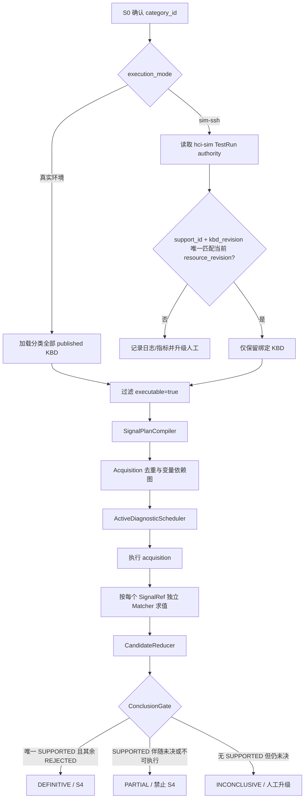
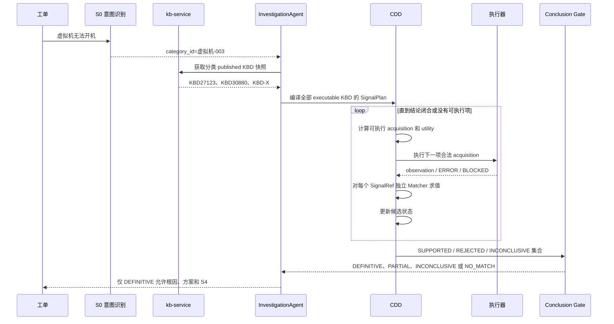

# 仿真 KBD 权威候选绑定与 CDD 调度方案

## 0. CDD 是什么

`CDD` 的英文全称是 **Case Differential Diagnosis**，中文为**案例差异诊断**。

它不是一次向量搜索，也不是“选出最相似的一篇 KBD”。它解决的是下面这个问题：

> S0 只能确认故障分类；同一分类下可能有多篇 KBD。CDD 要为每篇 KBD 执行和评价自己的关键信号，再根据证据把候选标记为 `SUPPORTED`、`REJECTED` 或未决，最后判断是否存在唯一可证明的命中案例。

三个容易混淆的对象必须分开：

| 对象 | 含义 | 例子 |
|---|---|---|
| 分类 | S0 确认的故障范围 | `虚拟机-003：虚拟机无法开机` |
| KBD 候选 | 分类内的一条待验证案例假设 | KBD27123、KBD30880 |
| Signal | 验证某篇 KBD 的原子证据契约 | `27123/rev25/sig_002` |

因此，“加入候选集”只表示“允许这篇 KBD 接受证据验证”，不表示已经命中；只有信号执行和 Conclusion Gate 完成后才有命中结论。

## 1. 结论

当前 main 的 KBD 诊断不是向量 top_k 截断、候选早停到 2 篇，也不是按最高频采集器选信号。S0 确认分类后，kb-service 返回该分类全部已发布 KBD；Agent 过滤 `executable=true` 后编译一个 `SignalPlan`，CDD 调度器只优化 acquisition 顺序，归并器和结论门禁决定候选状态。

仿真 `sim-ssh` 是例外边界：hci-sim TestRun 已经权威绑定 `support_id`、`kbd_revision` 和 Bundle。Agent 必须把这两个身份与当前 KBD 动态资源快照唯一匹配；未匹配、缺失或重复时 fail-closed，不能回退分类全集。

## 2. 当前执行算法



## 2.0 从工单到结论的完整流程

以“虚拟机无法开机”分类下有 3 篇 KBD 为例：



### 2.0.1 三篇 KBD 如何竞争

假设分类快照中有三篇 KBD：

```text
KBD27123: MUST=[A,B]，SHOULD=[C]，minimum_should=1
KBD30880: MUST=[D,E,F]
KBD-X:    MUST=[G,H]
```

CDD 不会先决定“27123 看起来最像，所以只执行 27123”。它会建立三篇 KBD 的 SignalRef，并按 acquisition 复用规则合并真实采集动作：

```text
一个 acquisition = 一次真实采集
一个 SignalRef  = 某篇 KBD 对该采集结果的一种解释
```

同一命令输出可能同时供多篇 KBD 使用，但每篇 KBD 的 Matcher 独立评价。结果可能是：

```text
27123: A=SATISFIED, B=SATISFIED, C=SATISFIED -> SUPPORTED
30880: D=CONTRADICTED                      -> REJECTED
KBD-X:  G=ERROR, H=NOT_RUN                  -> INCONCLUSIVE
```

此时总体结论仍是 `PARTIAL`，因为 KBD-X 没有被排除。`ERROR` 表示没有拿到可用证据，不表示该 KBD 不成立。

### 2.0.2 为什么不能把 ERROR 当成不命中

CDD 区分“事实反证”和“执行失败”：

```text
SATISFIED    = 证据满足信号条件
CONTRADICTED = 采集成功且证据明确违反信号条件
ERROR        = 采集通道或工具失败
UNKNOWN      = 有结果但无法确定匹配关系
BLOCKED      = 依赖、权限或策略阻止执行
```

只有 `CONTRADICTED` 才能把 MUST 候选推向 `REJECTED`。这样即使某个命令不存在、网络超时或权限不足，也不会产生“错误排除”，避免误报唯一根因。

### 2.1 候选集合

`GET /categories/{category_id}/playbooks` 不接受 query、`top_k` 或相似度门禁；排序只按数据库 ID。真实环境候选全集是该快照中 `published` 且 `executable=true` 的 KBD。仿真环境以 TestRun 的 `support_id` 和 `kbd_revision` 限制为恰好一篇；任何不一致都不能静默忽略。

### 2.2 信号执行顺序

每篇信号身份为 `kbd_id/revision/signal_id`。相同 acquisition 按 `tool + args（排除 instruction）+ policy_version` 去重；`qfk_log` 的 Matcher 参与 acquisition 身份，普通 `qfk_system` 的不同 Matcher 可以共用一次命令输出并独立判定。

调度器只从 active `CANDIDATE` 且变量依赖已满足的 acquisition 中选择下一项，评分为：

```text
4 * discrimination + 2 * required_coverage + 3 * unlock + 1 * reuse
- 0.25 * cost - 0.15 * latency - 1 * risk
```

同分按 `risk/cost/latency/template_key` 升序。调度器不按工具名称频次选取，也不改变候选成员资格。

### 2.3 命中判定

`MUST=CONTRADICTED` 或 `EXCLUDE=SATISFIED` 时 KBD 为 `REJECTED`；所有 MUST 满足、`minimum_should` 满足且 EXCLUDE 均被反证时为 `SUPPORTED`；`ERROR/UNKNOWN/BLOCKED/NOT_RUN` 不能被当成反证，最终为 `INCONCLUSIVE` 或 `NOT_EXECUTABLE`。

只有“恰好一篇 `SUPPORTED` 且其他候选全为 `REJECTED`”才是 `DEFINITIVE`。`SUPPORTED + INCONCLUSIVE/NOT_EXECUTABLE` 必须是 `PARTIAL`，禁止根因、解决方案和 S4。

## 3. 对抗性审查

| 失效尝试 | 防护 |
|---|---|
| 让仿真 KBD 缺 fixture 的命令制造 ERROR，再把 ERROR 当成排除 | ERROR 只能产生未决状态，不能 REJECT |
| 只执行 27123 并看到全部通过就早停 | Gate 仍检查候选全集；仿真绑定修复后候选全集本来就只有 TestRun KBD |
| 伪造 `support_id` 但 revision 不一致 | 双字段唯一匹配，失配升级人工 |
| 使用 SOP 恢复上下文绕过仿真 KBD 绑定 | `sim-ssh` 强制清空 SOP 恢复路由，重新走权威 KBD |

## 4. 可观测性

绑定成功/拒绝使用低基数指标 `agent_sim_kbd_authority_binding_total{result}`；日志包含 `trace_id`（由共享 logger 注入）、session/case、category、support_id、revision、snapshot_id 和拒绝原因。具体工单不进入 Prometheus label。

## 5. 本次代码是否还需要修改

当前提交实现的是**仿真 TestRun 单 KBD 回放契约**：TestRun 已绑定 `support_id=27123`、`kbd_revision=25` 和对应 Bundle，因此该 TestRun 的问题是“验证 KBD27123 的正向场景是否能完整执行”，不是“重新在虚拟机-003 分类的全部 KBD 中做一次未知案例竞争”。在这个契约下：

```text
TestRun authority -> 唯一 KBD27123 -> CDD 执行 27123 信号 -> DEFINITIVE
```

因此，按当前 hci-sim TestRun 设计，刚提交的代码不需要继续优化；它修复的是执行范围边界，不是修改 CDD 的分类全量算法。

但两种产品语义不能混用：

| hci-sim 目标 | KBD 候选范围 | 对代码的要求 |
|---|---|---|
| 单 KBD 回放（当前提交采用） | TestRun 绑定的一篇 KBD | 当前代码正确；必须提供该 KBD 的完整 fixture |
| 分类级全量仿真 | 分类下全部 KBD | 不能按单 KBD 过滤；必须为所有 KBD 提供完整 fixture，代码需另行设计 category-scope TestRun |

如果未来把 hci-sim 定义为第二种“分类级全量仿真”，则不能仅删除筛选逻辑；还需要增加 TestRun 的分类作用域、每篇 KBD 的 fixture manifest、fixture 缺失门禁和分类级验收用例。否则 `ERROR` 会继续使结论保持 `PARTIAL`，这是 CDD 的正确 fail-closed 行为。
