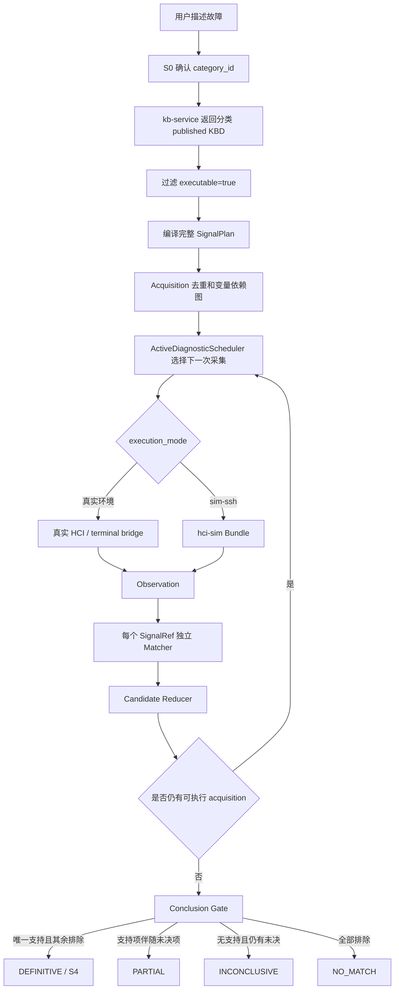
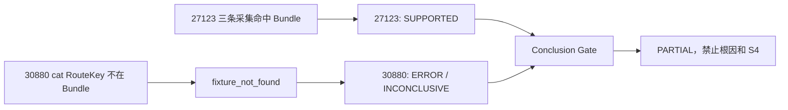
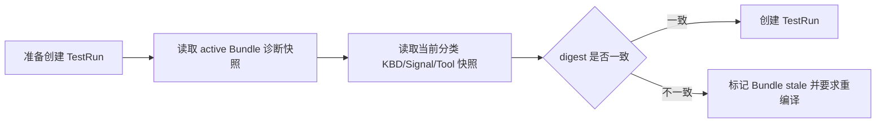

# 仿真诊断等价性与 CDD 全候选修正方案

## 0. 结论与强制不变量

`CDD` 的英文全称是 **Case Differential Diagnosis**，中文为**案例差异诊断**。

仿真测试的目的，是在可重复的模拟现场中验证 Agent 能否完成真实排障。它只能替换现场数据采集提供方，不能改变诊断输入、算法或结论门禁：

```text
真实环境：S0 分类 -> 分类完整 KBD -> CDD -> 真实环境采集 -> Conclusion Gate
仿真环境：S0 分类 -> 分类完整 KBD -> CDD -> hci-sim Bundle 采集 -> Conclusion Gate
```

以下规则是代码、测试、Bundle 和文档共同遵守的强制不变量：

1. S0 确认的 `category_id` 是 KBD 候选集合唯一边界。
2. `execution_mode` 只选择 acquisition provider，不参与候选筛选。
3. TestRun 的 `support_id/kbd_revision/bundle_digest` 标识模拟场景及数据版本，不是诊断答案。
4. `fixture_not_found/ERROR/BLOCKED` 表示没有可用证据，不等于反证。
5. 只有唯一 `SUPPORTED` 且其余候选全部 `REJECTED`，Conclusion Gate 才允许 `DEFINITIVE/S4`。

## 1. 第一性原理解构

同一次仿真中存在三类不同对象，必须保持独立：

| 对象 | 权威来源 | 回答的问题 | 不允许做什么 |
|---|---|---|---|
| 诊断范围 | S0 `category_id` + 分类 KnowledgeSnapshot | 需要验证哪些 KBD 假设 | 不能由 TestRun 目标 KBD改写 |
| 仿真场景 | TestRun `support_id/revision/bundle_digest` | hci-sim 模拟什么现场、使用哪份数据 | 不能直接告诉 Agent 命中哪篇 KBD |
| 证据结论 | Signal Matcher + Candidate Reducer + Conclusion Gate | 现场证据支持或排除哪些 KBD | 不能由 fixture 标签或运行模式预设 |

如果 TestRun 选择 KBD27123 后，Agent 只加载 KBD27123，那么测试已经把标准答案写入被测算法，属于 **test oracle contamination（测试预言污染）**。此时即使所有用例通过，也只能证明“27123 能自证”，不能证明 Agent 能从 27123、30880 等同分类案例中识别 27123。

## 2. 正确端到端流程



真实与仿真的分叉只发生在 H 节点。H 之前的候选生成和调度、H 之后的 Matcher、归约与门禁完全相同。

## 3. 当前 KBD 检索、执行顺序与命中算法

### 3.1 候选加载

`GET /categories/{category_id}/playbooks` 不接受用户 query、`top_k`、向量阈值或 FTS 门禁。接口按数据库 ID 返回分类全部 `published` KBD；Agent 仅排除 `executable=false` 的发布契约异常项。

因此当前运行时不存在以下旧算法：

- 向量检索 top-K 后只诊断前几篇；
- 候选剩余两篇就早停；
- 按采集器在 KBD 中出现频次选择下一步。

### 3.2 Acquisition 身份与复用

每条 Signal 的稳定身份为：

```text
kbd_id / resource_revision / signal_id
```

执行计划将相同采集按 `tool + execution args + policy_version` 去重，`instruction` 不参与身份。`qfk_log` 因 Matcher 会下推改变命令，Matcher 参与采集身份；普通 `qfk_system` 的不同 Matcher 可以共享一次命令输出，但仍分别评价。

### 3.3 调度评分

调度器只从仍处于 `CANDIDATE`、变量依赖已经满足且尚未执行的 acquisition 中选择：

```text
utility = 4 * discrimination
        + 2 * required_coverage
        + 3 * unlock
        + 1 * reuse
        - 0.25 * cost
        - 0.15 * latency
        - 1 * risk
```

同分依次按 `risk`、`cost`、`latency`、`template_key` 升序。评分只改变执行顺序，不改变候选成员，也不改变证据状态。

### 3.4 候选归约

| Signal 结果 | 含义 | 对 MUST 的作用 |
|---|---|---|
| `SATISFIED` | 采集成功且满足 Matcher | 支持该必要证据 |
| `CONTRADICTED` | 采集成功且明确不满足 Matcher | 将候选置为 `REJECTED` |
| `ERROR` | 工具、Bridge 或 fixture 执行失败 | 保持未决 |
| `BLOCKED` | 变量、权限或策略阻断 | 保持未决 |
| `UNKNOWN/NOT_RUN` | 无法判断或尚未执行 | 保持未决 |

所有 MUST 为 `SATISFIED`、SHOULD 数量达到 `minimum_should`、EXCLUDE 全被反证时，候选为 `SUPPORTED`。任一 MUST 为 `CONTRADICTED` 或任一 EXCLUDE 为 `SATISFIED` 时，候选为 `REJECTED`。

## 4. Q2026082002685 的真实故障链

Agent 当前分类快照 `虚拟机-003` 有两篇可执行 KBD；TestRun/Bundle 冻结的 27123 数据版本则仍是 rev25：

```text
Agent 当前 KBD27123 rev26（TestRun/Bundle 数据版本 rev25）：
  qkv_task -> HOST/VM/END
  qfk_system lsof -> PID
  qfk_system ps -> Matcher

Agent 当前 KBD30880 rev8：
  qkv_task -> HOST/VM/END
  qfk_system cat /sf/cfg/gpu_info.ini -> gpu_type Matcher
  qfk_system cat /sf/cfg/gpu_info.ini -> driver_version Matcher
```

TestRun 使用的 27123 Bundle 只包含 `task/lsof/ps` 三类 RouteKey，没有 `cat /sf/cfg/gpu_info.ini`。因此真实状态链是：



Conclusion Gate 没有错误；它正确阻止了在 30880 尚未排除时输出唯一根因。真实缺口是 **Bundle 的诊断采集覆盖范围小于分类 CDD 的可能执行范围**。

## 5. PR #857 为什么错误

PR #857 在 `InvestigationAgent` 中读取 TestRun `support_id + kbd_revision`，只保留唯一匹配 KBD，并在 revision 失配时输出 `SIM_KBD_AUTHORITY_CANDIDATE_MISMATCH`。它还清空仿真 SOP 路由、增加错误绑定指标，并把错误结论写入多份文档。

该方案没有修改 Bundle，也没有为 30880 提供任何模拟现场数据。它只是从 CDD 输入中删除了暴露缺口的候选，因此属于绕过问题而不是修复问题。

对抗性验证如下：

| 攻击问题 | PR #857 的表现 | 结论 |
|---|---|---|
| Agent 是否在不知道答案时区分 27123/30880 | TestRun 先删除 30880 | 无法验证 |
| Bundle 是否覆盖分类完整采集面 | 没有修改 Bundle | 未解决 |
| KBD revision 更新后旧 Bundle 如何处理 | 在 Agent S1 报候选失配 | 层次错误 |
| 仿真与真实是否运行同一诊断算法 | 候选和 SOP 路由不同 | 不等价 |
| 恶意选择任意 support_id 能否得到该答案 | 只要唯一匹配就只诊断该篇 | 存在答案注入 |

## 6. 修正后的职责边界

### 6.1 Agent

- 永远按 S0 分类快照加载全部可执行 KBD；
- real/sim 生成完全相同的 candidate IDs 和 SignalPlan；
- `execution_mode=sim-ssh` 仅通过现有执行链把命令发送到 hci-sim；
- 不读取 TestRun 目标 KBD来筛选候选；
- 保持 `ERROR != CONTRADICTED` 和 Conclusion Gate 规则不变。

### 6.2 hci-sim Bundle Compiler

目标 KBD 仍用于定义“要模拟哪种故障现场”，但 Bundle 编译输入必须同时冻结：

```text
target_support_id
target_revision
category_id
category_snapshot_digest
candidate_support_id + revision + signals_digest（逐篇）
完整 acquisition/RouteKey 集合
tool/policy revisions
```

Bundle 输出必须满足：

- 目标 KBD 的证据由场景数据自然满足；
- 同分类其他 KBD 的采集都有确定性响应；
- 非目标 KBD 通过自己的 Matcher 得到 `CONTRADICTED`，不能由 Runtime 直接返回“未命中 KBD”；
- 若两篇 KBD 在现有信号上不可区分，正确结果就是 `PARTIAL`，借此暴露知识设计缺口；
- 未声明 RouteKey 继续返回 `fixture_not_found`，不能用通配空输出兜底。

### 6.3 Bundle freshness

Revision 有合法用途，但检查位置必须在 TestRun 创建前：



旧 Bundle 可以用于基础设施回放，但不能宣称验证了当前生产 KBD。该门禁属于 hci-sim 控制面，不得进入 Agent 候选生成阶段。

## 7. 可观测性

Agent 记录 `kbd_candidate_scope_resolved`：`trace_id/case_id/session_id/category_id/snapshot_id/execution_mode/candidate_count`。`knowledge_snapshot` 事件输出：

```json
{
  "candidate_scope": {
    "mode": "category_complete",
    "source": "s0_confirmed_category",
    "acquisition_provider": "hci-sim"
  }
}
```

Bundle 侧应记录 `category_snapshot_digest`、候选数、RouteKey 覆盖率、目标/非目标证据覆盖和 stale 原因。工单与命令继续通过统一 `trace_id -> exec_id -> fixture_id -> evaluation_id` 链路追踪。

## 8. 验收标准

1. 同一分类快照在 real/sim 下产生完全相同的 candidate support IDs。
2. TestRun revision 与 Agent 当前 KBD revision 不一致时，不得改变 Agent 候选集。
3. KBD27123 场景执行时，27123 由真实 Matcher 归约为 `SUPPORTED`。
4. KBD30880 必须取得 Bundle 内的 `cat` observation，并由自身 Matcher 归约为 `REJECTED`。
5. 删除任一非目标 acquisition fixture 后，测试必须以 `fixture_not_found/PARTIAL` 失败，不能静默通过。
6. 修改 TestRun target 为任意同分类 KBD，不得直接改变 Agent 候选列表。
7. `SIM_KBD_AUTHORITY_CANDIDATE_MISMATCH` 和单 KBD候选过滤代码、指标、文档均不存在。

## 9. 本次 hotfix 与后续边界

本次 hotfix 负责纠正 PR #857：恢复真实/仿真诊断等价性，删除答案绑定、错误 SOP 特判、错误指标和错误文档，并增加回归测试。

原工单的 Bundle 仍需按本方案重新编译和发布分类完整场景。在新 Bundle 生效前，恢复全候选后再次得到 `PARTIAL` 是对当前不完整仿真数据的正确暴露，不应通过放宽 Conclusion Gate 或缩窄候选掩盖。
