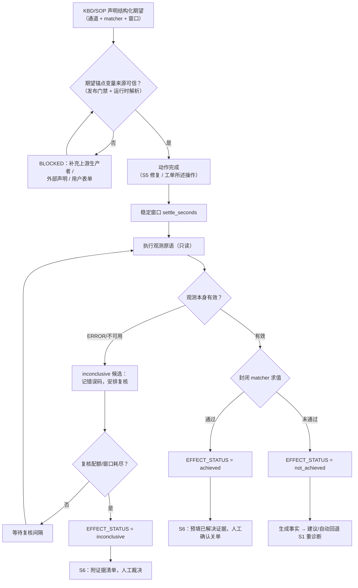

# 效果验证生产者信号设计与需求

> **状态：P0（契约层）+ P1（在线执行与 S6 闭环）已实现（2026-08-20）。执行层默认
> 关闭（策略开关 `EFFECT_VERIFICATION_ENABLED=false`），待第十二章平台确认项闭环后启用。**
>
> 已落地范围：
> - 契约层：`acquirer_args.py` 注册表 + `CONDITIONAL_PRODUCERS` 扩展与发布门禁
>   （期望来源可达 + 唯一生产者禁令）、`qkv_effect.schema.json`（timeout 1-60 独立声明）、
>   `EffectVerificationResolver` 不可变 Verification Intent、
>   `effect_verification` / `effect_verification_check` 表与迁移 032、Tool Registry 种子（risk_level=1）；
> - 在线：agent-service `app/tools/effect/` 专用适配器（settle/recheck 编排、观测委派、
>   三态合成、负证据确定性补齐）与 KBD 差异诊断路由（`_signal_to_qkv` 显式拒绝）；
>   conversation-service 结果卡端点、S6 证据化（`effect_evidence`）、lifespan 孤儿回收；
> - 离线：`compile_effect_verification_intent` 期望声明项编译（无客户侧执行）；
>   `extract_requirements` 跳过 qkv_effect；验包后追溯判定为 P2；
> - UI：Admin 审核页第 13 种信号（结构化期望表单）、Customer 效果复核结果卡；
> - 策略门禁：`EFFECT_VERIFICATION_ENABLED`（默认 false，agent 执行/capabilities 读取）。
>
> 原始提案内容如下。
>
> 本文定义 `qkv_effect`（效果验证）的完整设计。它用于补齐 HCI 平台告警、任务、弹框和
> 控制台画面都无法表达的第五类现象：**动作执行成功、平台无任何报错，但没有达到预期效果**
> （修复后告警未消除、状态未翻转、性能未恢复、操作未生效）。这类现象不是事件，而是
> “期望状态 × 实际观测”的关系判定，现有所有事件流中结构性缺席。
>
> 本文是对 [QKV/QFK 信号模型 v2 参考](./02-架构设计/QKV_QFK信号模型v2参考.md)、
> [虚拟机控制台视觉生产者信号设计与需求](./虚拟机控制台视觉生产者信号设计与需求.md)
> 与 [KBD证据诊断与CDD闭环设计](../knowledge-base/KBD证据诊断与CDD闭环设计.md)
> 的增量设计；沿用视觉生产者确立的“条件型生产者”范式（契约分层 + 路径隔离 + 不可变意图 +
> 策略门禁），并将其从“采集一种新证据”扩展为“判定一种新关系”。

---

## 一、结论与边界

### 1.1 一句话结论

新增 `qkv_effect`，将其定义为**条件型效果验证生产者信号**：在 KBD/SOP 显式声明了
结构化期望（观测通道 + 封闭判定规则 + 时序窗口）且动作上下文可信可用后，平台在正确的
时机执行只读观测，并产出三态判定变量 `EFFECT_STATUS`（`achieved` / `not_achieved` /
`inconclusive`）。它不是又一条查询通道，而是把“预期效果”从 Prompt 中的隐性语义升级为
契约数据的生产者；判定永远不允许静默通过——观察不足只能产出 `inconclusive`，绝不能
冒充 `achieved`。

### 1.2 为什么需要它

当前生产者信号覆盖的都是平台主动记录或可直接观察的“事件型/画面型症状”：

| 已有生产者信号 | 可观察的信息 | 盲区 |
|---|---|---|
| `qkv_alert`（告警查询） | 平台告警及关联对象 | 没有告警，但状态就是没恢复 |
| `qkv_task`（任务查询） | 平台任务及失败详情 | 任务成功完成，但操作没有实际生效 |
| `qkv_dialog`（弹框查询） | 管理界面弹框日志 | 没有任何提示，现象静默存在 |
| `qkv_vm_console`（控制台截图） | Guest 控制台画面 | 画面正常，但业务指标未达预期 |

“未达预期效果”是**关系型症状**：它是 `⟨动作, 期望状态, 实际观测⟩` 三元组的比较结果，
不存在于任何单一数据源，平台没有任何组件记录这个关系。因此无论怎么调整现有生产者的查询
参数都接不住它——缺的不是观测通道，而是**期望这个参照物**，以及围绕期望的时序编排与
判定语义。

现状的三个结构性缺口：

1. **知识层没有期望的落点**：SOP 节点只有前置条件（`prerequisite_items`），没有成功条件/
   后置条件字段；KBD 的修复方案（solution）不声明“做到什么程度算生效”；
2. **验证层没有自动复核**：S6 验证闭环目前只有人工 A/B/C 三选项（已解决/未解决/升级人工），
   “是否达到预期效果”完全依赖用户主观判断，系统不重跑任何观测；
3. **哲学没有延伸**：CDD 设计已确立“工具成功不等于信号通过”（§2.4）与“失败显式可见”
   （不变量 14），但这些原则只作用于只读诊断阶段（S0–S4）；修复执行（S5）之后，“动作成功”
   与“效果达成”之间没有同等的层次区分。

本信号把“工具成功 ≠ 信号通过”延伸为 **“动作成功 ≠ 效果达成”**，覆盖修复后复核与
症状确认两个场景。

### 1.3 目标

1. 让“预期效果”成为 KBD/SOP 契约中的显式、结构化、可版本化声明，而不是运行时由 LLM 推断；
2. 在在线诊断中，于动作执行后的正确时机（稳定窗口 + 有限复核）执行只读观测并产出三态判定；
3. 把 `not_achieved` 变成一等信号事实：显式捕获“执行成功但未达预期”，自动驱动回退重诊断，
   替代现在依赖用户手选 S6-B 的链路；
4. 在 KBD 发布时保证期望锚点的变量来源可追溯、判定规则属于封闭集合，避免“能发布但不能判定”；
5. 与 S6 验证闭环、`verification_contract`、KBD 运行效果数据闭环（`dynamic_resource_usage_audit`）
   对接，让“执行都成功但效果总不达预期”的知识条目可统计、可浮出；
6. 不影响已有 `qkv_alert`、`qkv_task`、`qkv_dialog`、`qkv_vm_console`、QFK 和
   `terminal_bridge` 的语义。

### 1.4 非目标

- 不让 KBD、运营页面或 LLM 以自由文本描述判定规则（“看起来恢复了”“应该好了”不可判定）；
- 不在效果验证过程中执行任何写操作：本信号严格只读，观测全部复用已批准的只读采集原语；
- 不自动关闭工单：`achieved` 只作为 S6 的预填证据，关单确认权仍在人；
- 不取代 `verification_contract`：本信号是案例级证据契约的一个**变量供给方**，不是替代品；
- 不默认对每一次修复动作触发复核；是否复核由 KBD 期望声明与策略开关共同决定；
- 不在 P0/P1 支持离线实时复核（离线仅 P2 追溯判定，见第九章）；
- 不把 `inconclusive` 解释为“未恢复”或“已恢复”——观察不足就是观察不足。

---

## 二、术语与信号定位

| 名称 | 定义 |
|---|---|
| `qkv_effect` | 效果验证，新的 QKV 条目；以结构化三态判定产出变量。 |
| 条件型生产者 | 自身不能从全局事件发现目标，必须先具备上游声明的目标变量与期望锚点才可执行的生产者。 |
| 期望锚点 | 结构化的 `expectation` 声明：观测通道 + 封闭 matcher 判定规则 + 时序窗口。 |
| 观测原语 | 期望锚点引用的已批准只读采集（如 `qkv_alert` 再查询、`qkv_vm_console` 画面状态），其参数契约与独立使用时完全一致。 |
| 三态判定 | `achieved`（观测成功且规则通过）/ `not_achieved`（观测成功但规则未通过）/ `inconclusive`（观察不足以判断）。 |
| 稳定窗口 | 动作完成后、首次效果判定前的等待期（`settle_seconds`），用于避开效果潜伏期造成的假“未达预期”。 |
| 负证据 | “某事物已消失”类期望（如告警应清除）；必须以“观测域有效且查询确无结果”证明，不能以“查询返回空”直接证明。 |
| 复核 | 窗口内按 `max_recheck` 配额重复观测判定；每次复核写一条不可变记录。 |

`qkv_effect` 仍归入 QKV 命名空间，原因是它的主要工作是产出变量（`EFFECT_STATUS` 等）供
下游 QFK 与案例验证契约消费；但它与既有四个生产者的差异必须显式建模：

| 项目 | `qkv_alert/task/dialog` | `qkv_vm_console` | `qkv_effect` |
|---|---|---|---|
| 症状性质 | 事件型（平台记录） | 画面型（实时观察） | 关系型（期望 × 观测） |
| 数据源 | 告警、任务、日志 | 虚拟机控制台画面 | 对已批准观测原语的**再执行** + 期望声明 |
| 是否可作为无上下文入口 | 可以 | 不可以，须有 `HOST` + `VM_ID` | 不可以，须有期望锚点 + 动作/目标上下文 |
| 是否严格只读 | 是 | 截图近似只读；唤醒是受控交互 | 是，观测原语全部只读 |
| 时间语义 | 即时查询 | 即时采集 | 编排型：稳定窗口 + 复核窗口 |
| 可否作为 KBD 唯一生产者 | 可以 | 可以（Guest 内部现象） | **不可以**（见 4.3 规则 1） |
| 证据形态 | JSON/文本 | PPM/PNG + 视觉结果 | 判定记录 + 被引用观测的证据链 |

---

## 三、业务流程



> 图示语义：`not_achieved` 不是失败，而是本信号最有价值的产出——它第一次把“执行成功但
> 没效果”从不可见变成显式信号事实；`inconclusive` 则严格保持“观察不足”语义，禁止向任何
> 一侧坍缩（对齐 CDD 不变量 14）。

### 3.1 期望锚点：期望必须是契约数据，不是 Prompt 猜测

期望锚点是本设计的灵魂，其来源优先级为：

1. **KBD/SOP 编辑期显式声明**（权威来源）：修复方案节点声明 `success_criteria`，包含
   观测通道、判定规则、时序窗口；发布门禁强制结构化（见 4.3）；
2. **S0/S1 澄清对话的结构化产物**：工单本身描述“做了 X 但没效果”时，S1 澄清把模糊抱怨
   转为结构化期望（“您期望看到什么状态？”），写入变量池后经 `verification_contract.variables`
   外部声明供信号消费；
3. **不接受**：LLM 运行时自由推断“这个动作应该有什么效果”。

该约束来自 skill 调用失效的复盘教训：当前架构是 Trust-based（信任依赖型），任何只靠
Prompt/内容暗示建立的语义，都会在模型版本切换、上下文压缩、存在低阻力替代路径时失效。
期望若靠模型即兴推断，判定结果将不可复现、不可审计、不可回放。

### 3.2 观测通道：封闭集合，复用已批准原语

观测不引入新的命令面。期望锚点的 `observation` 子对象引用既有已批准采集原语，其参数
必须**原样通过**该原语自身的 `acquirer_args` 校验（keyword 单字符串、host 占位符规则等）：

| 通道 | 观测内容 | 典型期望 |
|---|---|---|
| `qkv_alert` 再查询 | 平台告警域 | 告警应消失（负证据）/ 应不再新增 |
| `qkv_task` 再查询 | 平台任务域 | 任务应完成 / 不应出现失败任务 |
| `qkv_dialog` 再查询 | 弹框日志域 | 弹框不应再出现 |
| `qkv_vm_console` 画面状态 | Guest 控制台（复用 `VM_CONSOLE_STATE` 词表） | 画面应从 `kernel_panic` 变为 `login_prompt` 等 |
| `metric_query`（P2，待第十二章确认） | 平台性能指标 | 指标应越过阈值 / 趋势应回落 |

判定规则复用 `backend/shared/signals/matcher.py` 的封闭 matcher 集合：
`keyword / regex / state / threshold / delta / trend / exists`，均支持 `expected` 翻转。
**不新增自由文本判定**。若现有 7 类确实无法表达某类期望，走正式提案扩展 matcher 集合并
补充测试，不允许在 KBD 层绕过。

### 3.3 时序：稳定窗口与有限复核

效果有潜伏期。验证过早必然产生假的“未达预期”，验证过晚则失去闭环意义：

1. **即时核对**（动作完成时）：只核对动作自身状态（任务是否完成），不做效果判定；
2. **稳定窗口**（`settle_seconds`）：首次判定前的等待期；取值按动作类型的效果潜伏期经验表
   （第十二章确认项 1），受限范围 0–3600 秒；
3. **复核窗口**（`window_seconds`，上限 24 小时）：窗口内最多 `max_recheck` 次复核
   （上限 5 次）；每次复核间隔不小于观测原语自身超时；
4. 每次观测判定写一条不可变记录（`case_id + diagnosis_run_id + signal_id + check_seq`
   唯一），形成可回放的判定时间线；不得循环重试，配额耗尽即出 `inconclusive`。

### 3.4 三态判定与负证据

判定合成规则（观测状态 × matcher 结果）：

| 观测原语状态 | matcher 结果 | 判定 |
|---|---|---|
| 观测有效（查询成功、观测域覆盖完整） | 通过 | `achieved` |
| 观测有效 | 未通过 | `not_achieved` |
| 观测失败 / 通道不可用 / 无权限 | — | `inconclusive`（记错误码，可复核） |
| 观测有效但观测域有效性不足（负证据场景） | — | `inconclusive`（`NEGATIVE_EVIDENCE_INSUFFICIENT`） |

**负证据**是最大的坑：“告警消失了”不能由“查询返回空”直接证明——必须区分“查了且确无
告警”与“查询失败/无权限/告警域没覆盖/时间窗不对”。因此 `exists(expected=false)` 类期望
要求观测通道先自证有效：查询成功返回、关键词与告警域匹配期望声明、观测时间晚于动作完成
时间。任一环节不满足，只能出 `inconclusive`。

三态判定的下游语义：

- `achieved`：写入变量池，供 `verification_contract` 消费；S6 预填“已解决”证据，**关单仍须
  人工确认**；
- `not_achieved`：写入变量池并生成 fact（进入 `diagnostic_item`，type 见 5.1）；在线诊断
  自动建议回退 S1 重诊断（等价于把用户手选 S6-B 的动作信号化），建议须附判定时间线与证据；
- `inconclusive`：附错误码与已尝试记录流入 S6，由人裁决；**不得**被案例级结论解释为
  正证据或反证（对齐 CDD §8.3 对 UNKNOWN 的约束）。

### 3.5 与 S6 验证闭环的衔接

现状：S5 修复完成后仅发 `AgentStageUpdate(stage="S6")`，由用户在三选项中主观选择。
本信号不取消三选项（人的确认权保留），而是把三选项**证据化**：

1. S6 发起时，会话内所有已声明期望的信号判定结果以证据卡形式展示（判定、时间线、观测摘要）；
2. 存在 `not_achieved`：界面主动提示“检测到操作未达预期，建议返回重新诊断”，用户确认后
   走既有 S6-B 归档与回退链路；
3. 全部 `achieved`：预填 A 选项并说明依据，但不代替点击；
4. 存在 `inconclusive` 或无任何期望声明：保持现状人工裁决，界面如实说明“未配置自动复核”。

---

## 四、KBD 信号契约

### 4.1 新增工具与参数

共享 Schema 新增 `qkv_effect`，并以单独的 `qkv_effect.schema.json` 校验参数。

| 参数 | 类型 | 必填 | 约束 |
|---|---|---:|---|
| `expectation` | object | 是 | 结构化期望锚点，见下；`additionalProperties: false`。 |
| `expectation.observation.tool` | enum | 是 | 封闭观测通道集合（见 3.2）；不允许自由命令。 |
| `expectation.observation.args` | object | 是 | 必须通过对应观测原语的 `acquirer_args` 校验。 |
| `expectation.matcher` | object | 是 | 7 类封闭 matcher 之一；`expected` 翻转取反。 |
| `expectation.settle_seconds` | integer | 否 | 0–3600，默认按动作类型经验表。 |
| `expectation.window_seconds` | integer | 否 | 60–86400，默认 900。 |
| `expectation.max_recheck` | integer | 否 | 0–5，默认 2。 |
| `usage` | enum | 否 | `remediation_verify`（默认，修复后复核）/ `symptom_confirm`（S1 症状确认）。 |
| `host` | string | 否 | 仅允许 `{{HOST}}` 或规范化节点变量；用于目标绑定与 Inventory 校验。 |
| `timeout` | integer | 否 | 1–60 秒，仅约束**单次观测**；整体编排预算由窗口参数约束。 |
| `instruction` | string | 否 | 人类可读说明，不参与判定构造。 |

> 超时口径说明：与 `qkv_vm_console` 同理，本工具 `timeout` 的 1–60 秒是对
> `common_args.timeout`（1–300 秒）的**有意偏离**——单次观测是快速失败型查询，而长周期
> 语义由 `settle/window/max_recheck` 显式承载，不允许一次调用长阻塞。
> `qkv_effect.schema.json` 独立声明自己的 `timeout`，不复用公共定义。

禁止的参数包括：`command`、`shell`、`path`、任意 URL、自由文本判定规则（`judge_text`、
`prompt` 等）、以及任何允许 LLM 在运行时改写期望的字段。

### 4.2 示例

```jsonc
{
  "id": "s_effect_mem_alert_cleared",
  "role": "should",
  "acquire": {
    "tool": "qkv_effect",
    "args": {
      "usage": "remediation_verify",
      "expectation": {
        "observation": {
          "tool": "qkv_alert",
          "args": { "keyword": "内存不足" }
        },
        "matcher": { "type": "exists", "expected": false },
        "settle_seconds": 120,
        "window_seconds": 900,
        "max_recheck": 3
      },
      "host": "{{HOST}}",
      "timeout": 60,
      "instruction": "复核内存清理动作完成后，宿主机内存告警是否在窗口内清除"
    }
  },
  "match": null,
  "orchestrate": {
    "phase": "remediation",
    "requires": ["HOST"],
    "produces": [
      {"name": "EFFECT_STATUS", "path": "verdict"},
      {"name": "EFFECT_CHECKED_AT", "path": "checked_at"},
      {"name": "EFFECT_EVIDENCE", "path": "evidence_ref"}
    ]
  },
  "provenance": {
    "category": "frontend",
    "method": "effect_verification",
    "confidence": 0.8,
    "risk": 0.1,
    "needs_review": true,
    "evidence": "修复动作后预期效果的结构化复核（只读观测 + 封闭判定）"
  },
  "review": {
    "require_human_confirm": false,
    "notes": "纯只读观测判定，不向环境写入任何变更。"
  }
}
```

`match` 为 `null` 是因为该信号负责产出变量（与其他 QKV 的产出契约一致：`produces` 必填、
仅支持 JSON path）。`orchestrate.phase` 使用既有 `phase` 字段声明为 `remediation`
（CDD 词汇中 remediation phase 的只读观察信号）；信号本身严格只读，不违反诊断只读不变量。

期望锚点的观测目标变量（如 `HOST`、告警关键词）必须由同一 KBD 的上游 `produces` 或
`verification_contract.variables` 外部声明供给；否则发布门禁以“期望锚点缺少可信变量来源”
拒绝。

### 4.3 发布门禁

现有“至少一个生产者信号”门禁扩展为：

1. `qkv_effect` **不得作为 KBD 的唯一生产者**。效果验证是对动作效果的复核，必须以至少一个
   直接生产者或条件型视觉生产者作为诊断观测入口；没有观测入口的 KBD 不存在诊断事实基础，
   系统不得为凑齐效果判定而发布空诊断 KBD；
2. `qkv_effect` 是条件生产者：期望锚点引用的全部目标变量（`HOST`/`VM_ID`/关键词等）必须
   可通过同一 KBD 的已声明变量来源（上游 `produces` 或 `verification_contract` 外部声明）
   取得，口径与 `qkv_vm_console` 的 HOST/VM_ID 门禁完全一致；
3. `expectation.observation.tool` 必须属于封闭观测通道集合，且 `args` 原样通过对应原语的
   `acquirer_args` 校验；`matcher` 必须属于 7 类封闭集合；任一自由文本判定字段直接 422；
4. `settle_seconds` / `window_seconds` / `max_recheck` 必须在受限范围内，防止发布
   “永远复核下去”或“零等待立即判定”的信号；
5. `usage=remediation_verify` 的信号，KBD 必须声明其复核的动作语义（solution 的
   `success_criteria` 或 `provenance.evidence` 引用原始 KBD 对预期效果的原文依据）；
6. KBD 必须声明 `not_achieved` 的下游处理（回退重诊断或人工裁决），不允许“判定未达预期但
   静默忽略”的发布；
7. `qkv_effect` 可以与 QFK、`verification_contract` 共同存在，判定变量与其他证据按案例契约
   组合；`EFFECT_STATUS` 单独不构成根因结论；
8. 原有四类生产者 KBD 不受影响，发布门禁保持向后兼容。

发布错误应明确指出缺失项，例如：“效果验证信号需要可信的期望来源；请在上游生产者产出、
`verification_contract.variables` 外部声明或受控用户表单中补齐 HOST 与告警关键词依据。”

### 4.4 变量与词表命名口径

本信号产出变量规范名为 `EFFECT_STATUS`、`EFFECT_CHECKED_AT`、`EFFECT_EVIDENCE`。

1. `EFFECT_STATUS` 取值受限词表：`achieved`、`not_achieved`、`inconclusive`；词表与
   `effect_verdict_vocabulary_revision` 一同版本化，增删成员必须提升修订号，历史判定按记录
   时词表回放对齐（与 `display_state` 词表机制一致）；
2. 不得创建 `EFFECT_RESULT`、`EFFECT_OK` 等同义变体（审核指南“同一含义不要定义多个变量名”）；
3. `symptom_confirm` 模式下产出同名变量，语义为“期望状态确实未达成（症状确认）/已达成
   （症状不成立）/观察不足”，下游按 `usage` 解释；
4. 期望锚点引用的观测原语变量（如 `qkv_alert` 的原始查询结果）不重复入变量池，仅以证据
   引用（`EFFECT_EVIDENCE`）关联，避免变量池污染。

---

## 五、架构与接口设计

### 5.1 组件职责

| 组件 | 新增/调整职责 |
|---|---|
| Shared Signal Schema（共享信号规范） | 注册工具、`qkv_effect.schema.json`、期望锚点校验、扩展条件生产者发布门禁。 |
| Shared Resolution Runtime（共享解析运行时） | 新增 `effect` Resolver，只编译不可变 Verification Intent（验证意图），不产出命令字符串。 |
| Shared Matcher（共享求值器） | **只复用不修改**；`evaluate_matcher` 的证据串（期望/命中/最终判定）原样进入判定记录。 |
| Tool Registry（工具注册表） | 展示能力、风险（只读，低风险）、版本、启停状态；不保存可编辑判定文本。 |
| agent-service（智能诊断服务） | 在线专用适配器 `app/tools/effect/`：期望解析、settle/recheck 编排（诊断运行内）、三态合成、变量回写、结果卡推送；`kbd_differential` 生产者分流路由与 S5 证据条目落库（`diagnostic_item` type=effect_verification）。 |
| conversation-service（对话服务） | 效果验证结果卡内部端点与判定时间线查询；S6 证据卡集成（`effect_evidence`）；lifespan 启动回收悬挂复核（fail-closed 降级 inconclusive）。 |
| diagnosis-service（诊断服务） | P2 离线追溯判定：验包后以同一 shared 判定内核回放期望。 |
| kb-service（知识库服务） | SOP 节点 `success_criteria` 可选字段；KBD 编辑/审查/发布时的期望结构校验。 |
| Admin UI（管理端） | 审核页第 13 种信号类型展示与结构化期望编辑；效果验证审计页；KBD 效果数据视图。 |
| Customer UI（客户端） | 效果复核结果卡、S6 三选项证据化展示。 |

### 5.2 专用 Verification Intent

Shared Resolution Runtime 不返回字符串命令，而返回不可变意图（与 Capture Intent 同理）：

```json
{
  "resolver_id": "effect",
  "operation": "verify_effect",
  "observation_tool": "qkv_alert",
  "observation_args_ref": "frozen:<expectation-snapshot-id>",
  "matcher_ref": "frozen:<expectation-snapshot-id>",
  "settle_seconds": 120,
  "window_seconds": 900,
  "max_recheck": 3,
  "target_refs": {"host_ref": "verified:HOST"},
  "catalog_revision": "..."
}
```

1. 期望快照（观测参数 + matcher + 窗口）在编译时冻结并入库，运行时逐字段回放；KBD 修订
   不影响进行中的复核（按触发时的 KBD Revision 审计）；
2. 观测执行委派给对应原语的**既有受控执行路径**（如 qkv 自由文本引擎的受控参数分支、
   vm_console 专用适配器），绝不新开命令面；
3. 任何不在 `verify_effect` 枚举中的 operation 直接 Fail Closed（安全失败）。

### 5.3 内部 API

以下为内部契约，不直接暴露给浏览器或客户：

| API | 作用 |
|---|---|
| `POST /internal/effect-verifications` | 创建效果验证；输入仅为 `case_id`、`conversation_id`、`signal_id`、期望 Intent、动作关联键（`exec_id`）。 |
| `POST /internal/effect-verifications/{id}/check` | 触发一次观测判定（调度器定时或人工复核）；写一条 check 记录。 |
| `GET /internal/effect-verifications/{id}` | 获取状态、判定、check 时间线与证据引用。 |

客户侧只通过既有会话/工具事件通道获得状态与结果卡，不直接取得上述内部权限。

### 5.4 状态机

```text
created
  → expectation_resolved          # 期望锚点变量全部解析（未解析 → BLOCKED）
  → settle_pending                # 稳定窗口内
  → observing
  → observed_valid   → verdict_achieved | verdict_not_achieved
  → observed_invalid → recheck_scheduled → settle_pending …（≤ max_recheck）
  → window_expired → verdict_inconclusive

任意阶段 → failed | cancelled
```

状态、原因码和当前有效 check 记录必须不可歧义。观测失败、负证据不足、窗口耗尽不能被压缩为
同一种“验证失败”；`verdict_not_achieved` 与 `verdict_inconclusive` 是两种完全不同的下游
语义（前者驱动重诊断，后者交人裁决），禁止互相降级。

---

## 六、安全、隐私与完整性

### 6.1 观测与权限边界

1. 本信号**零写操作**：观测全部委派已批准的只读原语；任何试图在期望锚点注入命令、路径、
   Shell 片段的字段在 Schema 层即 422；
2. 目标绑定校验：`host`/`vm_id` 逐字符、类型、长度校验，执行时 Inventory 归属验证，拒绝
   跨租户、跨工单和陈旧迁移映射（复用 `qkv_vm_console` 的 `verify_vm_target` 机制）；
3. 每次观测判定记录 KBD Revision、Tool Catalog Revision、期望快照 ID、操作者、Trace ID
   和执行 ID；
4. 所有失败默认拒绝，不回退到自由命令执行，也不允许 LLM 以“看起来恢复了”替代判定。

### 6.2 判定记录的完整性

| 环节 | 必须措施 |
|---|---|
| 期望快照 | 编译时冻结入库，运行时只读回放；KBD 事后修订不能篡改进行中的判定依据。 |
| check 记录 | append-only；`(case_id, diagnosis_run_id, signal_id, check_seq)` 唯一约束，防止重复判定覆盖。 |
| 证据关联 | `EFFECT_EVIDENCE` 引用观测原语的原始证据（告警查询原文、截图制品 ID），可互查、可回放。 |
| 词表版本 | 判定取值连同 `effect_verdict_vocabulary_revision` 落库，历史判定可回放对齐。 |

### 6.3 Langfuse 与日志

Langfuse Trace 至少记录验证 ID、期望快照 ID、每次 check 的观测结果摘要、matcher 证据串、
判定、耗时和错误分类。告警关键词、主机标识按既有脱敏口径处理；不新增敏感数据类别（本信号
不采集图片、不接触控制台画面原文，除非复用 `qkv_vm_console` 通道——此时沿用其脱敏策略）。

---

## 七、产品交互需求

### 7.1 客户端在线诊断

1. 修复动作完成后，若存在已声明期望，展示“正在复核操作效果（预计等待 N 秒）”，不得误称
   “正在执行命令”；
2. 复核完成后展示结果卡：判定（已达成/未达成/观察不足）、判定时间线（每次 check 的时间与
   摘要）、关键证据引用、失败时的可行动原因；
3. `not_achieved` 时主动提示：

   > 检测到操作已完成但未达到预期效果（内存告警在 15 分钟窗口内未清除）。
   > 建议返回重新诊断，定位效果未达成的原因。

4. S6 三选项界面展示全部判定证据；`achieved` 预填但不代选；`inconclusive` 如实说明观察
   不足的原因与已尝试次数；
5. 无期望声明的 KBD 保持现状，不展示复核相关 UI，不产生误导。

### 7.2 KBD 审核与发布

审核页必须展示：

- 信号类型为“效果验证（条件型生产者）”，并与直接生产者、条件型视觉生产者标签区分；
- 期望锚点的结构化视图：观测通道、判定规则、时序窗口——以表单渲染，**不提供自由文本判定
  字段**；
- 期望锚点引用变量的来源可达性（上游 produces / 外部声明 / 用户表单）；
- 该信号只可产生 `EFFECT_*` 三个变量；
- `not_achieved` 下游处理声明；
- Tool Registry 启用状态与策略开关状态；
- 包含达成/未达成/观察不足三类回放 Fixture 结果。

KBD 编辑器不能给该信号提供“命令”“脚本”“自由判断描述”等字段。

### 7.3 管理与审计

1. 管理端提供受权限控制的效果验证查询：工单、KBD 修订、信号、判定、时间范围、错误码、
   Trace ID；
2. KBD 效果数据视图：按 KBD revision 聚合 `achieved` / `not_achieved` / `inconclusive`
   比率，写入既有 `dynamic_resource_usage_audit` 审计通道（复用 `_audit_kbd_runtime_outcomes`
   模式）——“执行都成功但效果总不达预期”的知识条目据此浮出，驱动 KBD 修订；
3. 策略开关 `EFFECT_VERIFICATION_ENABLED` 的状态与变更纳入管理端可见。

---

## 八、失败语义与诊断表现

| 代码 | 含义 | 是否可重试 | 诊断语义 |
|---|---|---:|---|
| `EXPECTATION_SOURCE_MISSING` | 期望锚点变量无上游产出或外部声明 | 否，需补充来源 | `BLOCKED` |
| `EXPECTATION_CONTRACT_INVALID` | 通道/matcher/窗口不在封闭集合或受限范围 | 否 | `BLOCKED` |
| `TARGET_CONTEXT_MISSING` | 无可信 HOST/VM_ID 等目标变量 | 否，需补充/查询 | `BLOCKED` |
| `ACTION_REF_MISSING` | `remediation_verify` 模式无法关联动作实例 | 否 | `BLOCKED` |
| `SETTLE_PENDING` | 稳定窗口内，尚未开始判定 | 是（等待） | `PENDING` |
| `OBSERVATION_ERROR` | 观测原语执行失败或通道不可用 | 是，计入复核配额 | `ERROR`，不得判 `not_achieved` |
| `NEGATIVE_EVIDENCE_INSUFFICIENT` | 负证据观测域有效性不足，无法证明“确已消失” | 是，计入复核配额 | `UNKNOWN` |
| `WINDOW_EXPIRED_INCONCLUSIVE` | 复核配额/窗口耗尽仍两可 | 否 | `UNKNOWN` → S6 人工裁决 |
| `EFFECT_POLICY_DISABLED` | 策略开关未开启 | 否 | `BLOCKED` |

原则：`ERROR` 表示未获得可靠观测，`UNKNOWN` 表示观察不足以判断；二者都不能被案例级结论
解释为“已恢复”或“未恢复”。`not_achieved` 是判定结论而非错误码——它意味着观测可靠且规则
明确未通过，是唯一可驱动自动重诊断的取值。

---

## 九、在线与离线诊断支持

### 9.1 同一 KBD、两种支持深度

是否需要 `qkv_effect` 由原始 KBD 的修复动作是否有可声明的预期效果决定，而不是由在线/离线
模式决定。但两种模式的支持深度**不对称**——效果验证依赖动作后的时序编排，离线现场无法
保证：

| 项目 | 在线诊断（P1） | 离线诊断（P2，追溯判定） |
|---|---|---|
| 执行载体 | agent-service 专用适配器 + conversation-service 调度 | 平台侧验包后回放 |
| 观测时机 | settle/recheck 实时编排 | 不编排：仅就证据包内**已存在**的观测快照判定 |
| 判定内核 | shared matcher（同一版本） | shared matcher（同一版本） |
| 缺观测时 | 复核窗口内重查 | 直接 `inconclusive`（不要求客户补采） |
| 产出 | 实时变量池 + S6 证据卡 | 验包后写入离线变量池与报告 |

### 9.2 离线追溯判定流程（P2）

1. 离线资源同步把 `qkv_effect` 编译为**专用期望声明项**（`effect_expectation` Collection
   Item）：只携带冻结的期望快照（观测通道、matcher、窗口），**绝不携带 command_template**——
   它不是命令采集项，与 `compile_vm_console_capture_intent` 的“绝不产出命令字符串”同理；
2. 客户侧采集器照常执行既有的只读采集项（告警/任务快照等）；期望声明项本身不触发任何执行；
3. 证据包验包通过后，OfflineEvidenceProvider 检查包内是否已有所需观测快照：有则以同一
   matcher 回放判定并写入 `EFFECT_*` 变量；无则记 `inconclusive`；
4. 在线与离线对同一观测 Fixture 应得到相同判定语义（回放一致性纳入测试矩阵）。

### 9.3 离线安全契约

1. 期望声明项不进入通用只读命令白名单，也不由 Tool Registry 文本模板替换；
2. 离线判定不产生任何客户侧动作建议文本以外的副作用——不要求客户执行新命令；
3. 期望快照、KBD Revision、Signal ID 在签名制品原文内，验包时可审计。

---

## 十、数据、审计与可观测性

### 10.1 建议的不可变记录

新表 `effect_verification` 与 `effect_verification_check`（数据库迁移编号顺延，vm_console
截图与审计事件分别为迁移 030/031，本提案为迁移 032；同步更新 `desired_schema.sql` 与
`desired_extras.sql` 幂等补齐块）。

`effect_verification` 至少包含：

- `id`、`tenant_id`、`case_id`、`conversation_id`、`diagnosis_run_id`、`signal_id`；
- `source_kbd_id`、`source_kbd_revision`、`tool_catalog_revision`、`expectation_snapshot_id`；
- `usage`（`remediation_verify` / `symptom_confirm`）、动作关联键 `action_exec_id`；
- 目标变量解析快照（HOST/VM_ID 等）与验证版本；
- 最终判定、判定词表修订、`not_achieved` 下游处理记录；
- 状态、错误代码、Trace ID、创建/完成/过期时间。

`effect_verification_check` 至少包含：

- `verification_id`、`check_seq`（与 `verification_id` 联合唯一）、`checked_at`；
- 观测原语执行结果摘要、观测状态、matcher 证据串、本次判定；
- 复核触发来源（调度/人工）、Trace ID。

审计事件以 append-only 方式写入，至少记录“创建、期望解析、每次观测判定、复核调度、最终
判定、S6 消费、查看证据”。

`diagnostic_item` 新增 type=`effect_verification`（与 hypothesis/verification_step/
root_cause/solution 同构），供 Prompt 构建按 `conversation_id + stage` 查询，支撑 S6 证据卡
与重诊断上下文还原。

### 10.2 指标与告警

| 指标 | 用途 |
|---|---|
| `effect_verification_total{usage,channel,verdict}` | 判定分布：`not_achieved` 率是知识质量核心信号。 |
| `effect_verification_duration_seconds{stage}` | 观测耗时与编排时延。 |
| `effect_verification_recheck_total{reason}` | 复核触发原因（观测失败/负证据不足）。 |
| `effect_verification_inconclusive_total{reason}` | 观察不足原因分布，指导观测通道补齐。 |
| `effect_verification_security_rejection_total{reason}` | 期望契约非法/目标校验失败拒绝。 |

应对 `OBSERVATION_ERROR` 异常升高、`NEGATIVE_EVIDENCE_INSUFFICIENT` 集中在特定告警域、
`not_achieved` 率在特定 KBD revision 突增设置告警（最后一项是 KBD 知识退化的直接信号）。

---

## 十一、实施拆分与验收标准

### 11.1 P0：契约先行（执行层默认关闭）

> 与视觉生产者同款门禁哲学：先让“期望”可声明、可审查、可拦截，再谈执行。P0 结束时执行层
> 不启用（`EFFECT_VERIFICATION_ENABLED=false`），但契约、门禁、表结构、审核 UI 全部就位。

| 工作项 | 验收标准 |
|---|---|
| Schema、Catalog、Resolver | `qkv_effect` 可保存、可审查、可发布；自由文本判定/命令字段全部 422；旧 KBD 行为不变。 |
| 期望来源门禁 | 期望锚点变量缺来源时发布被阻断并显示准确原因；`qkv_effect` 作为唯一生产者被阻断。 |
| matcher 封闭性 | 7 类之外的 matcher 类型 422；观测通道之外的 tool 422；观测 args 按原语契约校验。 |
| SOP `success_criteria` | SOPNode 新增可选字段（向后兼容），三路合并不覆盖人工编辑。 |
| 表结构与迁移 | 迁移 032 幂等；`desired_extras.sql` 存量补齐块可重复执行。 |
| 审核 UI | 第 13 种信号类型展示、结构化期望表单、来源可达性标注。 |

### 11.2 P1：在线执行与 S6 闭环

| 工作项 | 验收标准 |
|---|---|
| 专用适配器 + 路由 | `kbd_differential._run_producers` 遇 `qkv_effect` 路由到专用适配器；`_signal_to_qkv` 显式拒绝其进入自由文本 qkv_exec（有回归测试）。 |
| 编排与判定 | settle/recheck 时序正确；三态合成符合 3.4 表；`not_achieved` 生成 fact 并建议回退 S1。 |
| S6 证据化 | 三选项展示判定证据；`achieved` 预填不代选；无人工确认不得关单。 |
| 审计与观测 | 从 KBD 修订到每次 check、判定、Trace ID 可完整追溯；§10.2 指标可查。 |

### 11.3 P2：离线追溯判定与效果数据闭环

- 离线 `effect_expectation` 声明项与验包后回放判定；在线/离线 Fixture 回放一致性；
- `metric_query` 观测通道（依赖第十二章确认项 4）；
- KBD 效果数据视图与 `dynamic_resource_usage_audit` 聚合；
- 不改变 P0/P1 的门禁、权限、审计语义。

### 11.4 自动化测试矩阵

| 类别 | 必测场景 |
|---|---|
| Schema | 合法信号、未知字段、自由文本判定、非法窗口取值、错误变量占位符。 |
| 发布 | 唯一生产者为 `qkv_effect` 被阻断；期望来源缺失被阻断；与直接生产者共存可发布。 |
| 负证据 | 查询失败 vs 确无告警的区分；告警域不覆盖 → `inconclusive`。 |
| 时序 | settle 内不判定；复核配额耗尽 → `inconclusive`；窗口边界。 |
| 判定 | 7 类 matcher × `expected` 翻转回放；三态合成表全覆盖；词表版本化回放。 |
| 安全 | 跨租户目标、迁移后归属改变、重复确认触发、期望快照篡改防御。 |
| S6 | `not_achieved` 建议回退；`achieved` 预填不代选；`inconclusive` 证据展示。 |
| 回归 | 既有 4 种 QKV、8 种 QFK、在线诊断、离线诊断与 S6 三选项现有回归全部通过。 |

---

## 十二、待平台确认项

以下事实必须在启用执行层前与 HCI 平台接口负责人确认，不能由 KBD 或 Agent 猜测：

1. 各类修复动作（内存清理、服务重启、磁盘修复、配置变更等）的效果潜伏期经验值，用于确定
   `settle_seconds` 默认表；
2. 告警观测通道的权威性：`acli alert get -k` 是否覆盖全部告警域；“告警清除”与“告警被确认/
   屏蔽”的区分方式；清除后的告警是否仍可查询到历史记录（影响负证据观测域有效性判定）；
3. 修复类操作是否存在平台级任务回执（决定 `task_query` 通道能观测到哪些“操作已生效”事实，
   以及 `ACTION_REF_MISSING` 的判定口径）；
4. 指标/性能类观测通道的可用性、权限与口径（`metric_query` 通道能否成立）；
5. 目标对象迁移、重启竞争窗口内的期望状态归属口径（复核窗口内 HOST 变更如何处理）；
6. `achieved` 自动预填关单建议的豁免口径：是否需要叠加其他证据（如持续 N 分钟无复发）才
   允许展示预填。

确认完成前，不得启用执行层，也不得将任何基于猜测的效果窗口写入已发布 KBD。

---

## 十三、与既有文档和代码的变更清单

落实本提案时，需要同步更新而非手工绕过以下位置：

1. `backend/shared/schemas/signals/signal.v2.schema.json`：工具枚举与 `qkv_effect` acquire
   参数引用；由 `backend/scripts/gen-schemas.py` 从 `acquirer_args.py` 导出
   `qkv_effect.schema.json`（timeout 独立声明，相等性判断不 $ref common_args）；
2. `backend/shared/schemas/acquirer_args.py`：注册 `qkv_effect` 参数契约；加入
   `CONDITIONAL_PRODUCERS` 集合。**不要**并入 `FRONTEND_TOOLS`——该集合同时被“至少一个
   生产者”发布门禁、qkv 校验分支与解析器分发引用，并入会让效果验证信号获得直接生产者语义
   （与 `qkv_vm_console` 同款约束）；
3. `backend/shared/schemas/signal_schema.py`：扩展 `validate_kbd_publishable_signals_json`
   的条件生产者分支——效果验证的准入条件是“期望锚点变量来源可达 + 唯一生产者禁令 + 封闭
   matcher/通道校验”；`humanize_signal_validation_error` 增加
   `EFFECT_EXPECTATION_SOURCE_MISSING` 等错误文案；
4. `backend/shared/resolution/`（新增 `effect.py`）：`EffectVerificationResolver` 与不可变
   Verification Intent、期望快照冻结；`review.py` 与 Catalog 注册；
5. `backend/shared/signals/matcher.py`：**只复用不修改**；确需新判定类型时走提案 + 测试，
   不在本提案范围内；
6. `database/seeds/03_qkv_qfk_tools.sql`：Tool Registry 能力记录（只读、低风险、离线状态
   说明）；
7. `database/desired_schema.sql` + 迁移 032：`effect_verification` /
   `effect_verification_check` 表与唯一约束；`desired_extras.sql` 幂等补齐块；
   `diagnostic_item` type 注释补充 `effect_verification`；
8. `backend/agent-service/`：`app/tools/effect/` 专用适配器；`app/tools/qkv/signal.py` 的
   `FrontendQueryType` StrEnum 扩展与分发；`app/adapters/agents/htp/kbd_differential.py` 的
   `_run_producers` 路由与 `_signal_to_qkv` 显式拒绝（回归测试必须覆盖）；
   `routes/capabilities.py` 能力发现对新工具的暴露（受策略开关控制）；
9. `backend/conversation-service/`：效果复核调度（settle/recheck）、
   `send_s6_resolution_options` 证据集成、`diagnostic_item` 落库；
10. `backend/kb-service/`：`app/schemas/sop_template.py` SOPNode `success_criteria` 可选
    字段（对齐三路合并保护人工编辑的既有口径）、审核与发布门禁；
11. Admin UI：KbdReviewView「新增信号」下拉（当前 12 个 tool）与审核详情条件型生产者标签、
    结构化期望编辑表单、效果验证审计页；信号导入（`frontend/admin/src/utils/signalImport.ts`）
    结构上兼容新工具，导入预览需展示“条件型生产者（效果验证）”类型；
12. Customer UI：效果复核结果卡与 S6 证据化展示；
13. `deploy/helm/`：`EFFECT_VERIFICATION_ENABLED` 开关（默认 false，agent 执行/capabilities/
    离线签发三处读取，对齐 `VM_CONSOLE_CAPTURE_ENABLED` 模式）；
14. 相关信号模型、在线/离线对比与 KBD 审核文档：从“3 种直接生产者 + 1 种条件型实时视觉
    生产者”更新为“+ 1 种条件型效果验证生产者（提案通过后）”。

本清单要求通过正式数据库迁移、契约测试和端到端回归落实；不得只修改前端枚举或种子数据来
制造“已支持”的假象。
