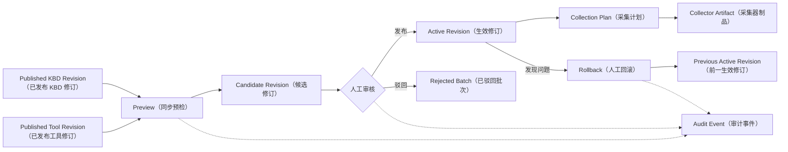

# 离线诊断模式 — 业务设计

> 文档版本：V3.6（文件名保留 V3.1，避免既有引用失效）
> 适用范围：HCI、VDI 售后离线诊断场景
> P0 定位：可面向受控客户试点的精简 HCI V1
> 核心目标：以“安全采集器 + 标准故障证据包 + 离线诊断 + 工程师审核”替代首发场景的大部分人工远程排查
> 当前代码基线（2026-08-10）：平台 V2.23.0，`diagnosis-service`（诊断服务）V0.4.0，
> 分支 `codex/offline-diagnosis-p0-foundation`。
> 当前已具备 Diagnosis Session（诊断会话）、Collection Plan（采集计划）、
> Collector Artifact（采集器制品）、签名与加密证据包、分片上传、隔离 Worker（工作进程）、
> Evidence Item（不可变证据项）和报告审核发布等采集上传主链路；Collector（采集器）与
> Collection Profile（采集画像）的实际数量由已发布 KBD（知识库文档）同步结果决定，
> 不再使用固定业务种子或固定数量描述。
> 2026-08-10 P0/P1 工程收敛已完成：生产只加载根目录 Shared Source（共享代码源）；
> 已提供 AcquisitionProvider（采集提供者接口）与共享依赖调度器；离线运行严格消费
> Collection Plan（采集计划）冻结的完整 KBD/Mapping（知识库/映射）快照，支持
> produces/requires（变量产出/依赖）流转、全候选持久化和统一 Conclusion Gate（结论门禁）。
> Shared Acquisition Compiler（共享采集编译器）仍由现有 Resolution Runtime（解析运行时）、
> Tool Registry（工具注册表）和 QFK Handler（QFK 处理器）共同提供语义契约；生产发布前仍需完成
> 真实黄金证据集、企业身份、密钥和容量安全演练，这些是环境/运营门禁，不再是本轮代码缺口。
> 当前在线 KBD/信号栈已演进至 v2 信号模式（7 种确定性 Matcher（匹配器）类型，
> `match.extract` 为求值前结构化取值规范），离线诊断必须复用同一套编译、提取、匹配、
> 候选归约和结论门禁实现。
> 生产 OIDC（开放身份连接）、
> KMS（密钥管理服务）和外部对象存储仍需按环境接入，缺失时默认拒绝。

> **状态标记约定**：`【当前已实现】`表示代码、数据库契约和自动化验证均已落地；
> `【部分实现】`表示已有数据结构或局部链路但尚不能形成完整语义闭环；
> `【目标设计】`表示最终架构；`【P0 阻断项】`表示真实客户试点前必须完成；
> `【P1 后移】`表示保留兼容代码或设计，但不进入精简 P0 默认入口和验收。

---

> **术语约定**：本文英文领域名首次出现时附中文备注。`Agent`（智能诊断代理）、`Collector`（安全采集器）、`Collection Profile`（采集画像）、`Collection Plan`（采集计划）、`Collector Registry`（采集器注册表）、`Collector Artifact`（采集器制品）、`Diagnostic Evidence Bundle`（诊断证据包）、`Evidence Item`（不可变证据项）、`Evidence Assessment`（证据评估）、`Diagnosis Run`（诊断运行）、`Diagnosis Report`（诊断报告）、`Supplement Plan`（补充采集计划）、`Run Manifest`（运行清单）、`Shared Source`（共享代码源）、`Shared Acquisition Compiler`（共享采集编译器）、`Execution Contract Revision`（执行契约修订）、`Shared CDD Runner`（共享差分诊断运行器）、`Runbook`（处置手册）、`Legal Hold`（法务保全）。为避免与现有代码中面向 Prompt（提示词）的内存对象 `EvidenceBundle` 混淆，新增文件领域模型统一使用 `DiagnosticEvidenceBundle`。

## 零、范围收敛决策

本节为当前业务决策，优先级高于后续历史设计明细。

| 维度 | 精简 P0 | P1/P2 |
|---|---|---|
| 正式场景 | 虚拟机启动失败、硬盘或 RAID（磁盘阵列）硬件告警 | 备份失败、迁移失败及更多场景 |
| 客户主链路 | 填写故障、下载工具、执行采集、上传初始包、等待诊断、查看已审核报告 | 自动补采、报告版本对比、客户自助删除 |
| 客户页面 | 只显示用户动作和结果；技术明细折叠 | 不新增更多内部对象名 |
| 证据不足 | 明确 Insufficient（证据不足）并转工程师人工补充 | Supplement Plan（补充采集计划）和 Run #2（第二次诊断运行） |
| 管理页面 | 任务、会话详情、审核、安全隔离、Collector（采集器）治理、Signal Mapping（信号映射）、Profile（采集画像）快照和采集器信任只读视图 | Profile 完整编排、自动灰度/回滚、留存、法务保全和质量运营 |

独立 Diagnosis Service（诊断服务）、隔离 Worker（工作进程）、签名、加密、安全解包、
不可变证据、UNKNOWN（未知）和对象级鉴权属于安全底座，不因产品收敛而删除或降级。

## 一、业务背景

当前售后排障主要采用两种方式：

1. 客户开放远程，工程师进入现场逐项检查；
2. 客户提供日志，工程师在本地解压、检索和分析。

现有 HCI 智能排障平台已经具备在线诊断能力：Agent（智能诊断代理）通过 `terminal_bridge`（在线终端桥接通道）连接故障主机，根据 `signals_json`（KBD 诊断信号定义）执行采集动作，再由 matcher（证据匹配器）和 KBD（知识库文档）完成判断。当前 CDD（差分诊断）内核已经支持 `PASS / FAIL / UNKNOWN / ERROR / BLOCKED` 内部结果及确定性结论门禁，P0 应复用该内核，而不是另建一套离线判断逻辑。

离线诊断的目标不是简单把 SSH 替换为文件搜索，而是建立一套可面向真实客户交付的异步诊断服务模式：

> 客户报障 → 下载并执行安全采集工具 → 上传标准故障证据包 → 平台完成安全和证据
> 完整性检查 → 离线诊断 → 输出分级结论或“证据不足” → 工程师审核 → 发布客户报告。

最终使人工远程桌面从默认排障方式，变为未知问题、复杂数据恢复、高风险操作和采集工具无法运行时的兜底方式。

---

## 二、版本决策

### 2.1 P0 的正式定义

P0 不是纯技术 PoC，而是可面向受控 HCI 客户试点的精简 MVP（最小可行产品）。

P0 必须具备：

- 安全 Collector（安全采集器）；
- 最小可用 Collection Profile（采集画像）；
- 标准故障证据包；
- 上传与解压安全校验；
- 证据完整性和充分性检查；
- `UNKNOWN` 证据状态；
- 分级诊断报告；
- 工程师审核后发布；
- 证据不足时转工程师人工补充；
- 全链路追溯和后台生命周期清理；
- 正式身份、租户、角色和对象级访问控制；
- 独立文件处理边界、对象存储和隔离异步任务。

### 2.2 当前编码交付边界（2026-08-10）

按照范围收敛决策，本期采用以下交付切分：

- 客户侧只展示六步业务主链路，采集范围、签名摘要放入折叠明细；不展示 Run（诊断运行）、
  Signal Evaluation（信号评估）、KBD（知识库文档）候选、自动补采、时间线和治理入口；
- 管理侧展示任务工作台、会话详情、报告审核、安全隔离和采集器核心运营；Collector
  草稿/审批/驳回/禁用、Offline Signal Mapping（离线信号映射）编辑、Collection Profile
  草稿/审批/驳回/禁用、Collection Plan（采集计划）查询/重生成、Collector Artifact
  （采集器制品）查询/撤销及 Trust Store（信任库）/Revocation List（吊销清单）只读视图属于当前交付；
  Signal/KBD 追溯仅在会话详情折叠展示；
- 后端 Run 明细、自动补采、Profile 完整编排、自动灰度/回滚、Legal Hold（法务保全）
  和删除 API（接口）保持兼容，不进入精简 P0 默认页面和验收；
- 生产前端通过宿主登录层的 `window.__HCI_AUTH__.getAccessToken()`（获取短期访问令牌）
  动态读取 OIDC Access Token（开放身份连接访问令牌），不在构建产物或浏览器持久存储中
  保存内部服务令牌；开发令牌仅在 `DEV`（开发）模式生效；
- 已有一次补采兼容实现：Supplement Plan 返回第二轮 Collection Plan 和初始
  Parent Bundle ID；增量制品只包含仍缺失且未成功采集的 Collector；补采包必须使用
  `bundle_type=supplement` 并绑定父包；Evidence Item（证据项）只追加不覆盖；生成
  Run #2 和报告 V2，旧报告进入 `superseded`（已替代）状态；该能力整体进入 P1；
- Quality Operations（质量运营）、Collection Profile 自动灰度/回滚和自动化质量指标
  属于 P1，不得在当前页面展示占位能力；
- 浏览器不能代替客户离线环境执行 Shell（命令行解释器）脚本。页面负责可信下载、签名和
  指纹展示以及执行说明，实际采集必须在客户授权的离线目标环境完成。

### 2.3 P0 首批正式验收场景

1. 虚拟机启动失败；
2. 磁盘、RAID（磁盘阵列）及明确硬件告警。

虚拟机备份或 CDP（持续数据保护）失败、虚拟机迁移失败作为 P1 候选场景，待每场景
黄金案例不少于 30 个且独立达到发布指标后逐个开放。

以下场景可以在 P0 中进行技术预研，但不纳入正式无远程解决率承诺：

- 偶发虚拟机卡慢或卡死；
- 瞬时网络丢包；
- 间歇性性能下降；
- 故障已经恢复且缺少历史性能窗口的场景。

这类问题在后续通过轻量故障黑匣子、历史性能指标和短时抓包能力补齐。

---

## 三、业务目标

### 3.1 主要目标

- 客户或现场工程师可以按故障场景一次性采集有效现场；
- 售后平台能够在不连接客户环境的情况下完成标准化分析；
- 离线数据不足时明确缺失证据并转工程师人工补充，不输出确定性根因；
- 在线与离线模式复用 KBD、matcher、规则和报告框架；
- 所有采集、分析、结论、审核和发布动作均可追溯；
- 专家解决的新问题可以持续沉淀为 Collection Profile（采集画像）、Collector（安全采集器）、诊断规则和 Runbook（处置手册）；
- 不同工程师面对同一份证据时，能够得到一致或接近的判断结果。

### 3.2 非目标

P0 不追求：

- 对所有未知问题自动给出最终根因；
- 在客户环境长期部署重型监控平台；
- 无审批自动执行高风险修复；
- 完全取消人工远程或现场支持；
- 使用大模型替代证据规则、KBD 和专家判断；
- 正式覆盖 VDI、Windows 客户端、外设和体验类故障；
- 对偶发性能问题承诺仅凭事后静态日志即可确认根因。

---

## 四、成功画像

精简 P0 试点阶段的工单处理结构目标为：

| 处理方式 | 目标占比 |
|---|---:|
| 一次标准故障证据包直接解决 | 65% |
| 工程师指导补充后解决 | 25% |
| 人工远程或现场处理 | 10% |

对于 TOP 高频已知问题，无远程解决率应达到 80% 以上。

成功不以“上传后一定输出根因”为标准，而以以下结果为标准：

- 证据充分时给出可验证的根因或高概率原因；
- 证据不足时明确缺失项、影响及人工补充方式；
- 不把“没有采集到证据”误判为“该问题不存在”；
- 诊断结论必须引用具体证据；
- Agent 报告经过工程师确认后再对客户发布；
- 诊断过程可复现、可审计、可使用新规则重新分析。

---

## 五、核心用户故事

### 5.1 HCI 备份失败【P1 场景】

> 我是现场工程师，接到“虚拟机备份创建失败”的工单。我在工单中选择故障对象、问题时间和“虚拟机备份失败”场景。平台生成采集计划和签名采集器。我在客户环境执行后上传故障证据包。平台确认快照创建成功、数据读取成功，但写入第三方存储阶段失败；由于缺少存储端权限和容量证据，报告为 Probable，并自动生成一次补采任务。补采完成后，平台合并两轮证据，生成新的诊断报告，由工程师审核后发布给客户。

### 5.2 HCI 迁移失败【P1 场景】

> 我是售后工程师，客户反馈某虚拟机迁移失败。我创建诊断会话并指定虚拟机、迁移任务和故障时间。平台采集源端环境、目标端资源、驱动、任务阶段和网络状态，确认迁移任务在目标虚拟机启动阶段失败，并通过 KBD 和规则匹配定位到虚拟磁盘控制器兼容问题。无需开放远程即可形成可验证的处置建议。

### 5.3 磁盘或 RAID 异常

> 我是现场工程师，客户反馈磁盘离线告警。我运行签名采集器后，平台获得节点、槽位、序列号、SMART、RAID 状态、重建状态和当前冗余信息。平台确认故障磁盘及影响范围，并在客户报告中明确换盘前置条件、风险和验证步骤。

### 5.4 证据不足时补采【P1 场景】

> 我是领域专家，首次诊断包只能定位到存储域，但无法区分 RAID 重建和性能退化磁盘。平台根据 `UNKNOWN` 的关键证据自动生成“RAID 控制器事件 + 指定磁盘 SMART + 故障窗口指标”的补采计划。客户运行增量采集器并上传，平台合并两轮证据继续分析，不要求重新上传全量数据。

---

## 六、核心设计原则

### 6.0 架构核心：离线 = 共享 CDD + AcquisitionProvider 适配【当前已实现】

离线诊断的本质不是“再建一个诊断引擎”，而是为共享 CDD（候选驱动诊断）内核提供不同的
数据获取通道。根目录 `backend/shared/cdd/acquisition_provider.py` 已提供统一 Provider（采集提供器）
边界和依赖调度器；在线仍保留流式 UI（用户界面）事件编排，离线适配器负责把冻结证据映射为同一
SignalOutcome（信号结果），两条路径共用计划编译、调度、候选归约和结论门禁语义。

```text
┌─────────────────────────────────────────────────────────────────┐
│                      Shared CDD（共享诊断内核）                     │
│                                                                 │
│  SignalPlanCompiler → ActiveDiagnosticScheduler                 │
│       → ConstrainedExecutor → DeterministicSignalEvaluator     │
│       → CandidateStateReducer → ConclusionGate                  │
│                                                                 │
│  所有确定性判定逻辑在此，离线不得独立实现等价逻辑。                    │
└─────────────────────────────────────────────────────────────────┘
                    ▲                          ▲
                    │                          │
          ┌─────────┴─────────┐    ┌──────────┴──────────┐
          │ AcquisitionProvider│    │  AcquisitionProvider  │
          │ (在线实现)          │    │  (离线实现)           │
          ├────────────────────┤    ├─────────────────────┤
          │ BridgeRelayProvider│    │ OfflineEvidenceProvider│
          │ → terminal_bridge  │    │ → evidence_item 表    │
          │ → SSH → 客户主机    │    │   预采集的 JSON/日志   │
          │ 实时 acli 命令执行   │    │ 隔离 Worker 解包入库   │
          └────────────────────┘    └──────────────────────┘
                    ▲                          ▲
                    │                          │
              ┌─────┴─────┐            ┌──────┴──────┐
              │ 客户主机    │            │ 证据包上传    │
              │ (网络可达)  │            │ (离线环境)    │
              └───────────┘            └─────────────┘
```

**P0 对齐后，离线模式只有 AcquisitionProvider 实现和交互事件编排不同**：

| 层 | 在线 | 离线 | 统一要求 |
|---|------|------|---------|
| 采集执行 | `BridgeRelayProvider` → `terminal_bridge` → SSH 实时执行 | `Go 采集器`本地执行 → 证据包 → `OfflineEvidenceProvider` | Provider 实现不同 |
| 采集编译 | KBD Signal → Shared Acquisition Compiler（共享采集编译器） | 同一编译器生成只读 Collector `argv` | 同一执行契约 |
| 结构化取值 | `backend/shared/signals/extractor.py` | 复用同一函数 | 同一输入产生同一取值 |
| Matcher 求值 | `backend/shared/signals/matcher.py` | 复用同一函数 | 7 种确定性 Matcher 全覆盖 |
| 变量池 | Shared Variable Pool（共享变量池） | 从 Incident Context（故障上下文）和证据产出初始化 | 同一 produces/requires 语义 |
| 候选归约 | `backend/shared/cdd` | 复用同一函数 | SignalRef（信号引用）格式一致 |
| 结论门禁 | Shared Conclusion Gate（共享结论门禁） | 复用同一函数 | UNKNOWN 不作为反向证据 |
| 报告生成 | 在线诊断报告 | 离线诊断报告（审核后发布） | 输出渠道不同 |

**当前实现边界**：

1. `backend/shared` 必须是 CDD、Matcher、Extractor 和采集编译器的唯一共享代码源；
   `agent-service` 与 `diagnosis-service` 内不得保留可被运行时导入的复制版本；
2. `diagnosis-service` 的证据读取与 Matcher 输入转换属于 OfflineEvidenceProvider
   （离线证据提供器）适配职责，不得自行实现另一套候选归约或结论策略；
3. `diagnosis-service` 继续负责会话、计划、签名制品、证据安全处理、不可变证据、审核和发布；
4. `agent-service` 继续负责在线执行适配，但不得把在线执行器私有实现当作跨服务共享库；
5. Shared CDD 或采集编译器变化必须产生新的 Execution Contract Revision（执行契约修订），
   并联动 KBD 发布校验、资源同步、Plan/Artifact/Run 快照和跨模式回放；
6. 新增 Matcher（匹配器）或归约规则必须先进入根目录共享实现并通过在线/离线契约回归。

### 6.1 诊断数据与诊断逻辑解耦

在线与离线诊断使用不同的数据获取通道，但复用：

- KBD（含 `signals_json` v2 信号定义和 `kbd_revision` 不可变修订）；
- **Matcher（`backend/shared/signals/matcher.py` 中的 `evaluate_matcher` 是唯一权威实现，离线不得独立维护等价逻辑）**；
- **extract 取值规范（`match.extract` 中的 textExtract/jsonExtract，离线证据查询必须产出相同结构的中间结果）**；
- 规则体系（CDD 候选归约器、结论门禁）；
- 根因与处置知识；
- 证据链；
- 报告框架。

**Matcher/Extract（匹配/提取）复用原则**：在线 QFK 引擎支持 7 种确定性 Matcher 类型
（`keyword`、`regex`、`state`、`threshold`、`delta`、`trend`、`exists`），
离线模式必须通过共享库或服务调用同一实现，保证相同证据 + 相同信号 → 相同判定。
离线不得因"matcher 类型不支持"或"extract 规范缺失"而将本该 `MATCHED`/`NOT_MATCHED`
的信号降级为 `UNKNOWN`。此约束是上线门槛"在线/离线 matcher 一致率 ≥99%"的前置条件。

### 6.2 Collection Profile（采集画像）与 KBD Signal（知识库诊断信号）分工明确

KBD Signal 负责描述：

> 哪些证据能够支持或排除某个问题。

Collection Profile 负责描述：

> 某个故障场景至少需要收集哪些证据。

P0 建设最小可用 Collection Profile（采集画像），支持：

- `Mandatory`：缺失后无法完成基础故障域判断；
- `Recommended`：明显提高诊断准确率；
- `Conditional`：满足版本、拓扑或现象时采集；
- `Deep-dive`：P1 预留，首轮不采集。

KBD Signal 可以为采集计划提供补充，但不能直接决定全部采集内容。

**信号定义（signals_json v2）与离线兼容性约束**：

当前在线 KBD 信号已演进至 v2 模式。信号按数据流向分为两类：

**一、生产者信号（QKV 前端信号）**——查询 HCI API/数据库，产出变量供下游使用：

| 信号类型 | acquire.tool | 关联 acli 命令 | 核心属性 | 离线数据来源 |
|---------|-------------|--------------|---------|------------|
| `qkv_alert` | 告警查询 | `acli --formatter json alert get -k {keyword} -l {limit}` | `instruction`、`keyword`、`limit`(1-200)、`alert_type`、`produces` | 证据包 `commands/` 中预采集的告警 JSON |
| `qkv_task` | 任务查询 | `acli --formatter json task get -k {keyword} [-s failed] -l {limit}` | `instruction`、`keyword`、`limit`、`is_failed`、`produces` | 证据包 `commands/` 中预采集的任务 JSON |
| `qkv_dialog` | 弹框日志 | `acli log get -k {keyword} -p {path} -c {context_lines}` | `instruction`、`keyword`、`paths`（`/sf/log/today`、`/sf/log/today/vt`）、`context_lines`(0-10)、`produces` | 证据包 `logs/` 目录中的日志文件 |

**二、消费者信号（QFK 后端信号）**——执行 acli 命令查询节点状态，通过 matcher 判定真伪：

| 信号类型 | acquire.tool | 关联 acli 命令 | 共有属性 | 特有属性 |
|---------|-------------|--------------|---------|---------|
| `qfk_log` | 日志检查 | `acli log get -k {keyword} [-f {file}] [-p {path}] [-t {time}]` | `instruction`、`host`(变量池)、`vm`(变量池,可选)、`keyword`、`timeout`(默认10s)、`expected`(默认true)、`match_mode`(默认or) | `file`(必填)、`end`(选填,默认变量池)、`source_family`、`parser`、`context_lines`、`include_archives`、`request_id` |
| `qfk_system` | 系统检查 | `acli system {command}` | 同上 | `command`(必填: lsof/ps/lsblk/iostat/smartctl/modinfo等)、`container`(选填,默认asv-con) |
| `qfk_service` | 服务检查 | `acli service {service} {action}` | 同上 | `service`(必填)、`action`(选填,默认status) |
| `qfk_vm` | 虚拟机检查 | `acli vm {command}` | 同上 | `command`(必填) |
| `qfk_network` | 网络检查 | `acli network {command}` | 同上 | `command`(必填) |
| `qfk_storage` | 存储检查 | `acli storage {command}` | 同上 | `command`(必填) |
| `qfk_hardware` | 硬件检查 | `acli hardware {command}` | 同上 | `command`(必填) |
| `qfk_platform` | 平台检查 | `acli platform {command}` | 同上 | `command`(必填) |

**关键设计约束**：
- 生产者信号（QKV）产出的变量是消费者信号（QFK）的前置依赖。例如 `qkv_alert`
  产出 `KVM_PID` → `qfk_system` 的 `command=lsof` 消费 `KVM_PID` 作为参数。
  离线模式下此依赖链必须维持——参见 §6.2.2 离线变量池；
- 共享属性中 `host`、`vm`、`end` 等标记为"变量池获取"的字段，其值不在 KBD
  中写死，而是由上游生产者信号或环境上下文在运行时注入；
- 每个信号包含 v2 结构：`acquire`（采集工具声明）、`match`（确定性 matcher
  契约，含 `type`/`extract`/`mode`/`expected`）、`orchestrate`（`produces`/
  `requires` 变量依赖图）、`provenance`/`review`（来源追溯与人工复核标记）。

离线资源同步 (`offline_resource_sync_service.extract_requirements`) 解析上述结构，
将 `acquire.tool` 映射为离线 Collector，将 `acquire.args` 绑定为 Collector 参数。
**所有 11 种 acquire tool 类型均需支持离线映射**：
- `qfk_log` 有专用参数归一化逻辑（`_qfk_log_parameters`）；
- `qkv_dialog` 归类为日志型 Collector（`is_log=True`），查询类型 `log`；
- 其余 QFK 命名空间及 QKV 信号通过通用参数绑定路径处理。

离线 matcher 评估 (`offline_analysis_service._evaluate_signal`) 必须通过共享的
`evaluate_matcher` 函数对离线证据执行与在线一致的确定性求值。离线
`OfflineEvidenceProvider` 产出的证据需经 `extract_output_values` 提取后再送入
matcher，而非对原始文本直接做扁平匹配。

#### 6.2.1 信号输出模式与取值配置分类

每个信号（无论生产者还是消费者）的输出统一为两种模式：

**一、匹配模式（match）**——判断证据是否符合条件，结果为 `True`/`False`：

在取值完成后，根据判定类型完成检测。当前支持 7 种判定类型：

| 判定类型 | 英文标识 | 检测逻辑 | 典型场景 |
|---------|---------|---------|---------|
| 关键字匹配 | `keyword` | 在取值文本中搜索关键字（支持 or/and/not 组合） | 日志中出现 "Connection reset" |
| 正则表达式 | `regex` | 用正则匹配取值文本 | 匹配 IP 地址或错误码格式 |
| 状态判定 | `state` | 匹配特定状态值（大小写不敏感） | 服务状态为 "running" |
| 数值阈值 | `threshold` | 数值比较（gt/gte/lt/lte/eq/neq） | 延迟 > 100ms |
| 首末差值 | `delta` | 周期日志计数器的首末差值 vs 目标值 | 错误计数增长 > 0 |
| 变化趋势 | `trend` | 连续采样的方向判定（increasing/decreasing/stable） | RX 丢包持续增长 |
| 存在性判定 | `exists` | 检查取值结果是否非空 | 进程列表中存在指定 PID |

**二、产出变量模式（produce）**——将取值结果写入变量池，供下游信号作为输入：

在取值完成后，根据以下属性完成变量注入：

| 属性 | 说明 | 示例 |
|------|------|------|
| 变量名 (`name`) | 变量池中的唯一标识（必填） | `KVM_PID`、`DISK_SN` |
| 变量类型 (`type`) | `string` / `integer` / `number` / `boolean` / `array` / `object` / `array<object>` | `integer` |
| 变量值 (`value`) | 从取值结果中提取的实际值 | `12345` |

**三、取值配置（extract）**——匹配模式和产出变量模式共用同一套取值规范：

| 取值方式 | 英文标识 | 行选择 | 列选择 | 结果数量 | 输出来源 | 适用场景 |
|---------|---------|--------|--------|---------|---------|---------|
| 完整输出 | `full` | 不筛选 | 不筛选 | `all` | stdout | 纯文本日志搜索 |
| 文本行列 | `textExtract` | `all`/`keywords`(include/exclude)/`indices`+`ranges` | `header`(name+aliases)/`index` | `all`/`first`/`last`/`exactly_one` | stdout | 表格式命令输出（ps、lsof、iostat） |
| JSON 路径 | `jsonExtract` | 不适用 | 点号分隔路径（禁止 jq/通配符） | `all`/`first`/`last`/`exactly_one` | stdout（JSON 输出） | acli --formatter json 命令 |

三种取值方式之后，均有一个**可选的 AI 提取后置步骤**：当确定性取值无法精确捕获目标值
（如从非结构化文本中提取数值），由 LLM 从已取值结果中二次提取。AI 提取仅作用于已筛选
的取值结果，不得绕过确定性取值直接处理原始输出。

**离线模式兼容性要求**：
- 离线 `OfflineEvidenceProvider` 产出的证据文本需经 `extract_output_values`
  （`backend/shared/signals/extractor.py`）按上述 3 类取值方式执行结构化取值；
- AI 提取后置步骤复用在线 `ai_extractor`（`agent-service/app/tools/qfk/ai_extractor.py`）；
- 当前实现：确定性 `extract_output_values` 已位于根目录共享实现，离线 Provider 使用同一
  Matcher/Extract（匹配/取值）契约。AI Extractor（AI 取值器）仍只用于非确定性后置增强，
  不参与 P0 确定性结论门禁。

#### 6.2.2 离线模式变量池与 produce 变量处理

在线模式下，KBD 诊断引擎维护一个**变量池（Variable Pool）**，生产者和消费者信号
通过该池传递依赖数据：

```text
qkv_alert（生产者）
  → 查询告警，产出 KVM_PID=12345 写入变量池
    → qfk_system（消费者）从变量池读取 KVM_PID
      → command=lsof -p 12345，执行并判定
        → 产出 DISK_SN=XYZ 写入变量池
          → qfk_storage（消费者）从变量池读取 DISK_SN
            → 执行并判定
```

离线模式下，此依赖链路必须维持：

1. **变量池初始化**：从 Diagnosis Session 的 `IncidentContext`（故障对象、时间窗、
   影响范围）和 `affected_objects`（受影响对象快照）中提取初始变量；
2. **生产者信号执行**：QKV 信号（alert/task/dialog）的查询结果来自证据包中
   预采集的数据，而非实时 HCI API 调用。`OfflineEvidenceProvider.query()`
   从 `evidence_item` 表读取对应 Collector 的结构化数据，经
   `extract_output_values` 取值后，按 `produces` 声明写入离线变量池；
3. **变量依赖解析**：消费者信号的 `requires` 声明了前置变量依赖。离线分析
   按依赖拓扑排序执行信号评估——先执行无依赖或依赖已就绪的信号，后执行
   有未就绪依赖的信号。缺失前置变量且无默认值的信号标记为 `BLOCKED`
   （`reason=dependency_blocked`），不得静默跳过；
4. **变量池生命周期**：同一 Diagnosis Run 内的变量池跨信号共享；Run 结束
   后变量池快照写入 Run Manifest 作为审计记录。

**当前实现**：离线运行器从 Collection Plan 的 Incident Context（故障上下文）初始化变量集合，
按共享调度器处理 `orchestrate.produces/requires`（变量产出/依赖）；依赖未就绪的信号显式记录
为 `BLOCKED → UNKNOWN`，并保存缺失变量原因，不再按 KBD 列表顺序静默跳过。

#### 6.2.3 QKV 前端信号离线数据来源适配

QKV 生产者信号在在线模式下直接查询 HCI API 或数据库，离线模式需从证据包获取：

| QKV 信号 | 在线数据来源 | 离线数据来源 | Collector 类型 | 证据包目录 |
|---------|------------|------------|--------------|----------|
| `qkv_alert` | `acli --formatter json alert get` | 证据包中预采集的告警 JSON | `qkv_alert`（JSON 查询型） | `commands/` |
| `qkv_task` | `acli --formatter json task get` | 证据包中预采集的任务 JSON | `qkv_task`（JSON 查询型） | `commands/` |
| `qkv_dialog` | `acli log get`（/sf/log/today + /sf/log/today/vt） | 证据包 `logs/` 目录中的日志文件 | `qkv_dialog`（日志查询型） | `logs/` |

**设计约束**：
- QKV 信号对应的 Collector 必须纳入 Collection Profile 的 `Mandatory` 项，
  因为它们是后续 QFK 消费者信号的前置数据来源；
- 离线资源同步为 QKV 信号生成的 Collector 必须是只读的（`risk_level=1`），
  查询类型标记为 `json`（alert/task）或 `log`（dialog）；
- QKV Collector 的输出需保留完整的结构化数据（JSON 原始输出），因为
  `produces` 变量的取值依赖 JSON 路径解析；
- `qkv_dialog` 的日志搜索路径（`/sf/log/today`、`/sf/log/today/vt`）需要
  在客户侧采集时覆盖——如果客户环境的日志路径不同，Collection Profile
  需提供条件采集规则。

客户填写故障时的 Scenario Selector（场景选择器）不得在前端维护静态场景清单。其选项必须
实时来自已批准、已启用且存在 Active Revision（生效修订）的 Collection Profile；客户接口
只返回场景名称、画像版本和支持的产品版本，不暴露 Collector 命令或内部治理字段。创建
Diagnosis Session（诊断会话）时，服务端必须再次校验画像仍然可用，避免页面加载后画像被
停用而继续创建不可执行的任务。所谓“首发两个场景”通过只发布对应 Profile 控制，而不是
通过前端硬编码控制。

### 6.3 所有执行项必须经共享编译并进入安全 Collector（安全采集器）

P0 建设最小可用 Collector Registry（采集器注册表）。任何交付客户执行的命令必须：

- 由 Shared Acquisition Compiler（共享采集编译器）编译并进入已审批 Collector Revision
  （采集器修订）；
- 固化 Resolved Acquisition（已解析采集定义）、Execution Contract Revision（执行契约修订）
  和只读 `argv`（参数数组）；
- 通过参数类型、枚举、长度、路径和控制字符校验；
- 标记风险等级；
- 设置超时和输出上限；
- 记录退出码、stdout 和 stderr；
- 记录适用产品及系统版本；
- 可禁用和版本回溯；
- 被打包到经过数字签名的采集器中。

禁止将 KBD 中的任意 `sub_command` 字符串直接拼接进 Shell 脚本。

平台必须维护显式映射：

```text
KBD Signal（知识库诊断信号）
    → Shared Acquisition Compiler（共享采集编译器）
    → Execution Contract Revision（执行契约修订）
    → Approved Collector（已审批采集器）
    → Collector Revision（采集器修订版本）
    → Output Contract（输出数据契约）
```

现有在线 Tool（工具）与 Collector（采集器）是两个独立领域对象，但不得维护两套相互漂移的
执行语义。结合当前 Agent 的 Resolution Runtime（解析运行时）、Catalog（能力目录）和
QKV/QFK Handler（处理器）实现，命令与采集行为的唯一事实源调整为
Shared Acquisition Compiler（共享采集编译器）及其 Execution Contract Revision（执行契约修订）：

- KBD（知识库文档）只声明采集意图、结构化参数、Matcher（匹配规则）和变量依赖；
- Shared Acquisition Compiler 将 KBD Signal（知识库诊断信号）编译为可审计的
  Resolved Acquisition（已解析采集定义）和只读 `argv`（参数数组）；
- Tool Registry（工具注册表）保存能力启停、风险等级、参数模式、编译器标识和修订信息；
- 存量 Tool Registry 参数投影必须通过版本化数据迁移与共享 Schema 对齐；对齐后由服务启动对账
  发布新的不可变 Tool Revision。不得通过忽略未知字段来掩盖契约漂移，也不得移除已有枚举和风险边界；
- `usage_template`（使用模板）保留给普通 ACLI 插件或确实能够静态表达的工具，不作为所有
  QKV/QFK 工具的强制命令来源；
- 在线 Agent 和离线资源同步必须调用同一编译器，Diagnosis Service（诊断服务）不得再维护
  独立命令目录、猜测命令或专用离线规范字段。

当前代码已实现 `collector_definition`（采集器定义）事实源和独立内部 API：

- 新建或更新定义后进入 `draft`（草稿）状态，更新必须携带 `If-Match`
  （条件更新头）；
- `platform_admin`（平台管理员）可批准、拒绝和禁用 Collector；
- 批准时发布不可变 dynamic resource revision（动态资源修订版本），制品生成严格读取
  该修订快照，事实表仅作为审批和启用门禁；
- 参数使用 JSON Schema（JSON 模式）校验，必须显式
  `additionalProperties=false`（禁止未声明参数）；
- 命令模板禁止管道、重定向、命令替换、多命令拼接和通用 Shell 间接执行；
- 参数占位符必须独占一个 `argv` token（命令参数）；对类型、枚举、长度、路径和控制字符执行
  Fail Closed（默认拒绝）校验，由 Go 运行时直接创建进程，不经过 Shell 转义或解释。

当前已落地的 KBD Signal（知识库诊断信号）到 Collector 运营映射通过
`offline_signal_collector_mapping`（离线信号采集器映射）事实表及
`/api/internal/offline-signal-mappings` 管理 API 落地，支持分类、命令范围、优先级、
字段映射、启停和 `If-Match`（条件更新头）乐观锁。同步生成的映射已精确绑定
`KBD Revision + Signal ID + Execution Contract Checksum + Collector`，Admin UI（管理界面）已提供
Collector 列表、筛选、草稿编辑、批准/驳回、禁用及 Signal Mapping（信号映射）
编辑入口。工具名/分类/命令范围仅保留为展示和历史兼容字段，新 Plan 不再消费缺少精确来源的
历史模糊映射。
Collector 和 Collection Profile 不再使用业务种子初始化，其初始版本与后续变更统一由
已发布 KBD 的结构化采集要求同步产生。

#### 6.3.1 Collector Lifecycle（采集器生命周期）与 KBD 变更治理【基础闭环已实现】

当前代码已经落地同步批次、候选审核、发布、回滚、审计、精确信号映射、共享采集编译和
完整运行快照。总体原则是：

> Collector Definition（采集器定义）和 Collection Profile（采集画像）提前审批发布，
> Collector Artifact（采集器制品）在诊断会话和采集计划确定后按工单即时组装、签名；
> KBD（知识库文档）不得直接改写已生成制品。

平台已建立 KBD 到采集资源的 Change Impact Analysis（变更影响分析）：

- KBD 标题、根因、解决方案等知识内容变化，只影响后续诊断内容，不影响采集器；
- Signal Matcher（信号匹配规则）变化时，重新校验规则回放和离线信号映射；
- Evidence Requirement（证据要求）变化时，识别受影响场景和 Collection Profile，
  完成 Collector/映射调整及版本升级后，仅对新计划生成新制品；
- Collector 存在安全缺陷时，禁止继续生成并撤销引用问题修订版本且尚未过期的制品；
- 普通 KBD 变更不修改、不覆盖、不自动撤销历史制品；管理员确认需要采用新证据范围时，
  通过 Regenerate（重生成）创建新的 Plan Revision（计划修订），旧计划进入
  `superseded`（已替代）且仍可下载的旧制品自动撤销；
- Diagnosis Run（诊断运行）必须冻结具体 KBD revision set（KBD 修订版本集合）及内容
  哈希，不能只记录规则数量和最后更新时间，确保历史报告能够按原快照复现。

已实现的控制面包括 Profile 草稿/审批/驳回/禁用、计划列表/重生成、制品列表/撤销、
KBD 增量同步、候选版本审批、人工回滚、有序审计和精确 Signal 映射。分析和 Run Manifest
均只消费 Plan 冻结快照。自动灰度、自动回滚和跨版本批量回放属于 P1。

#### 6.3.2 KBD 驱动的资源同步与历史追溯【当前已实现】

Collector Definition（采集器定义）和 Collection Profile（采集画像）以已发布 KBD 为
业务来源，不再维护与 KBD 割裂的默认业务种子。管理员在 Admin UI（管理界面）执行
Offline Resource Sync（离线资源同步），系统按以下流水线工作：



同步规则如下：

- 首次使用执行 Full Sync（全量同步）建立基线；以后分别按 KBD 和 Tool 的
  `dynamic_resource_revision.id`（动态资源修订序号）作为双 Watermark（同步游标）增量扫描，
  不以易受时钟和并发影响的更新时间作为游标；
- 在线诊断与离线诊断共用 KBD 审核发布时确认的最终 `category_id`（分类编码）作为问题场景标识；
  所有已发布 KBD 默认进入离线资源同步范围，不再设置 `metadata.offline_scenario`、
  `metadata.offline_enabled` 或 `offline_capable` 等离线专属准入开关；
- 只读取已发布 KBD 不可变修订中的 `category_id` 和 `signals_json`（结构化信号定义），不得从标题、
  正文或解决方案推断问题场景、拼接可执行命令；缺少有效最终分类属于 KBD 发布数据异常，必须显式报错，
  不能按标题关键词猜测或静默跳过；
- KBD 只声明所需采集能力、结构化参数、Matcher 和变量依赖。Collector 的最终命令/指引必须由
  Shared Acquisition Compiler 根据 KBD Revision（KBD 修订）、Tool Revision（工具修订）和
  Execution Contract Revision 共同编译；参数无法解析、能力未验证或非只读工具必须阻断发布，
  禁止静默回退到 Diagnosis Service 代码中的硬编码命令；
- `qfk_log`（后端日志信号）按 KBD 的匹配关键字、可选日志文件、固定路径和时间窗生成稳定
  Collector。命令统一为 `acli log get` 的 argv（参数数组）直执行形态；未指定文件时执行全局
  关键字检索，指定文件时增加 `-f`，不得替换为 `journalctl`。KBD 中仍待人工复核且无法生成
  命令的信号会跳过并产生 Warning（警告）；已确认信号契约不完整则阻断发布；
- KBD 派生参数写入 Collection Profile item（采集画像项），展开计划时固化到
  `collection_plan_item.collector_parameters`（采集计划项参数快照）。制品生成请求不能覆盖该
  快照，确保审核时看到的采集语义与最终签名 argv 一致；
- 修改 Tool 能力、参数模式、风险等级、启停状态或编译器绑定时会发布新 Tool Revision（工具修订）；
  Incremental Sync（增量同步）消费 Tool Watermark（工具游标），自动重算引用该 Tool 的所有场景，
  无需人工强制全量同步；
- Preview 只创建 Sync Batch（同步批次）、Candidate Revision 和差异记录，不修改当前
  Active Revision；发布时按 Collector → Signal Mapping → Profile 的依赖顺序在一个事务中生效；
- 已发布 KBD 退回草稿、归档或停用时，必须先追加 `status=disabled` 且
  `contract.lifecycle.tombstone=true` 的不可变 KBD Revision（KBD 修订），再删除运行时
  Active Revision（生效修订）指针；墓碑保留原场景元数据和来源身份，使下一次 Incremental Sync
  （增量同步）立即感知撤回。相同正文后续重新发布也必须携带新的 Expert Revision（专家修订）
  事件身份并产生新动态资源修订，不能复用
  撤回前的旧修订而漏过 Watermark（同步游标）。同步会关闭不再需要的映射，并将
  已无已发布 KBD 支撑的 Profile 形成禁用候选；`kbd_` 为同步生成 Collector 的保留命名空间，
  Full Sync 会把该命名空间内已无任何当前 KBD/Profile 引用的孤立 Collector 形成禁用候选。
  禁用只停止新计划引用，不删除不可变修订，
  也不自动改写历史 Artifact（制品）；
- Rollback 只允许回滚最近一次已发布同步批次，恢复同步前的生效指针、事实数据、
  `managed_by`（治理归属）、来源元数据和 KBD/Tool 双 Watermark（双游标）；
  不回滚上游 KBD 或 Tool 本身的修订。若问题修订仍是上游 Active Revision（生效修订），
  下一次增量预检会再次检出；管理员应先在 KBD/Tool 上发布修正修订，再重新同步；
  不删除任何不可变修订，也不改写已生成计划、制品、诊断运行或报告快照。

每次 Preview、Publish（发布）、Reject（驳回）和 Rollback 均写入动作开始与最终结果两个
Audit Event。事件至少保存批次内单调递增的序号、操作者、理由、起止游标、资源前后快照、
KBD 来源修订、校验结果、失败详情、时间和 `trace_id`（链路追踪标识）。失败、驳回和回滚
失败记录同样永久保留，从而回答“谁在什么时候基于哪些 KBD 做了什么、改了哪些资源、结果
为何成功或失败、当前状态能否由哪次回滚得到”这些审计问题。

#### 6.3.3 全流程版本冻结规则【当前已实现】

- Tool 首次部署数据只是 Platform Capability Bootstrap（平台能力引导），使用
  `ON CONFLICT DO NOTHING`（冲突时不覆盖），不会重写管理员修改。Conversation Service（对话服务）
  启动时幂等将事实表对账为 Tool Revision（工具修订），解决全新部署无修订可同步的问题。
- 同步生成资源标记 `managed_by=kbd_sync`（KBD 同步管理）。Admin UI（管理界面）可查看但不可
  绕过批次单独编辑、审批或禁用；人工资源仍可使用 CRUD（增删改查）。
- Collection Profile Revision（采集画像修订）冻结它所引用的 Collector Revision/Checksum
  （采集器修订/校验和）；Collection Plan Item（采集计划项）再冻结该精确修订。
- Collector Artifact（采集器制品）严格按 Plan 冻结修订组装。旧 Collector 因普通 Tool/KBD 同步退出
  Active Revision（生效修订）时不会让旧 Plan 漂移；显式安全禁用则作废相关 Plan 并撤销制品。
- Collection Plan 冻结并消费完整 KBD Revision（知识库修订）内容，包括根因、方案、影响、建议、
  `verification_contract`、`generation_metadata`、`publish_validation`、Signal ID（信号标识）和
  内容校验和；分析阶段禁止重新读取可变 `kbd_entry` 当前值。旧计划缺少完整快照时返回 409，
  要求重新生成计划和制品，不使用实时数据补洞。
- Offline Signal Mapping（离线信号映射）必须按精确 `KBD Revision + Signal ID` 冻结 Collector
  Revision，不得仅用 `tool/category/command` 模糊匹配；Run Manifest 必须保存映射内容及校验和，
  不能只保存数量和最后更新时间。

### 6.4 日志驱动，但不只采文本日志

标准故障证据包可包含：

- 事件日志；
- 基础性能指标；
- 配置快照；
- 对象和拓扑关系；
- 硬件状态；
- 任务阶段和状态；
- 最近变更；
- 命令输出；
- 人工导出信息；
- 必要时的短时抓包或 Dump。

### 6.5 缺失证据不等于未命中

P0 对外的 Signal Evaluation（信号评估）至少支持：

- `MATCHED`：证据存在且支持该 Signal；
- `NOT_MATCHED`：证据存在且明确不支持该 Signal；
- `UNKNOWN`：证据未采集、采集失败、不可读、变量未解析或时间范围不覆盖。

诊断报告支持 `Conflicted`，用于表达候选根因或正反证据存在冲突。P1 可进一步扩展为 Signal 级 `CONFLICTED`。

CDD 内部状态与离线接口状态统一映射：

| CDD 内部状态 | 离线接口状态 | 说明 |
|---|---|---|
| `PASS` | `MATCHED` | 有效证据支持该信号 |
| `FAIL` | `NOT_MATCHED` | 有效证据明确排除该信号 |
| `UNKNOWN` | `UNKNOWN` | 缺失、不可读或时间范围不覆盖 |
| `ERROR` | `UNKNOWN` | 保留 `reason=execution_error`，不得降级为反向证据 |
| `BLOCKED` | `UNKNOWN` | 保留 `reason=dependency_blocked`，不得降级为反向证据 |

**Matcher（匹配器）求值一致性约束【当前已实现】**：

在线与离线模式必须通过 Shared CDD Runner（共享 CDD 运行器）调用同一个
`evaluate_matcher`（`backend/shared/signals/matcher.py`）。该函数是确定性信号判定的
唯一权威实现，支持全部 7 种 Matcher 类型（`keyword`/`regex`/`state`/`threshold`/
`delta`/`trend`/`exists`）及 `match.extract`（匹配取值）结构化取值。离线适配层只负责
选择 Evidence Item（证据项）并组装标准输入，不维护第二套 Matcher 算法。

具体而言：
1. **离线证据提取**：`OfflineEvidenceProvider` 产出的证据文本需经
   `extract_output_values`（`backend/shared/signals/extractor.py`）
   按 `match.extract` 规范（行选择、列选择、JSON 路径、基数、类型转换）提取后，
   再送入 `evaluate_matcher`；
2. **matcher 结果处理**：`evaluate_matcher` 返回 `MatcherResult(matched: bool | None)`
   ——`True` → `MATCHED`，`False` → `NOT_MATCHED`，`None`（无法确定时，如
   非法正则、样本不足）→ 交由 LLM 兜底或标记为 `UNKNOWN`；
3. **禁止行为**：离线模式不得因 matcher 类型为 `regex`/`state`/`delta`/`trend`/
   `exists` 而直接返回 `UNKNOWN`（"matcher 无法解析证据内容"）；不得跳过
   `match.extract` 直接对原始文本做扁平匹配。

此约束是实现"在线/离线相同证据 matcher 一致率 ≥99%"上线门槛的必要条件，而非优化项。

### 6.6 分类是入口，不是边界

用户选择的故障分类只作为分析起点。平台可以根据已识别故障域扩大到相邻分类或全局 KBD 检索，并分别保存：

- `selected_scenario`：用户选择的产品化故障场景；
- `selected_category`；
- `resolved_category`。

P0 只允许进入生成计划时经过专家配置的相邻分类集合；全局跨分类检索进入 P1。
Collection Plan 生成阶段将范围内所有可执行、已发布 KBD 冻结为 ruleset snapshot
（规则集快照），分析阶段完整评估并持久化该候选集，不再查询实时分类、不设 LIMIT 100，
也不截断为 Top-10。列表展示可以分页，但不得以页面展示上限改变诊断候选全集。

### 6.7 所有结论必须可验证

Agent 输出必须包含：

- 诊断等级；
- 主要故障域；
- 支持证据；
- 反向证据；
- 已排除项；
- 缺失证据；
- 置信度；
- 验证方法；
- 推荐处置动作；
- 风险和回退要求。

### 6.8 Agent 结论必须经过工程师审核

报告状态包括：

- `draft`：Agent 生成，未审核；
- `review_pending`：已提交工程师审核；
- `engineer_confirmed`：工程师已确认；
- `customer_published`：已对客户发布；
- `rejected`：工程师认为结论不可用；
- `superseded`：已被新 Diagnosis Run 的报告替代。

P0 不允许 Agent 报告未经审核直接成为客户正式结论。

---

## 七、端到端业务流程

```text
创建工单并选择接入模式
    ├─ 有 SSH：进入在线 Agent（智能体）与环境采集流程
    └─ 无 SSH：不创建 Conversation（对话）、不发送暂存问题，
               跳转 /offline-diagnosis?case_id={case_id} 独立页面
                         ↓
                    创建诊断会话
    ↓
填写故障对象、时间、影响范围和用户选择场景
    ↓
加载最小 Collection Profile 并生成 Collection Plan
    ↓
从安全 Collector Registry（采集器注册表）生成签名采集器
    ↓
客户侧执行并生成初始 Diagnostic Evidence Bundle（诊断证据包）
    ↓
上传隔离区并完成安全校验
    ↓
证据完整性、充分性、对象覆盖和时间覆盖检查
    ↓
证据标准化和离线查询
    ↓
规则、KBD 和相似案例分析
    ↓
生成 Draft（草稿）分级报告
    ├─ 证据充分：工程师审核并发布
    └─ 证据不足：输出 Insufficient（证据不足）和缺失项，转工程师人工补充
    ↓
客户或工程师按建议处置
    ↓
记录结果、关闭工单并生成知识沉淀任务
```

证据不足无法形成有效判断时，进入工程师补充、专家分析、人工远程或现场兜底。

---

## 八、各环节业务设计

### 8.1 创建诊断会话

#### 操作角色

- 客户管理员；
- 现场工程师；
- 一线售后工程师；
- 领域专家。

#### 必填信息

- 工单号；
- 产品线；
- 用户选择场景；
- 故障对象；
- 故障开始时间和结束时间；
- 客户时区；
- 影响范围；
- 当前是否恢复；
- 故障前是否有变更。

#### P0 HCI 对象

- 集群；
- 节点；
- 虚拟机；
- 存储池；
- 磁盘；
- RAID；
- 迁移任务；
- 备份或 CDP 任务。

### 8.2 生成 Collection Plan（采集计划）

平台根据以下信息生成 Collection Plan：

1. 用户选择场景；
2. 故障对象；
3. 问题时间窗口；
4. 产品与系统版本；
5. Collection Profile；
6. 相关 KBD 引用的 Collector；
7. 条件采集规则；
8. 历史高频缺失证据。

安全处理必须由隔离 Worker（异步工作进程）执行，限制 CPU、内存、临时磁盘、文件数量、单文件大小、解压总量和处理时长。原始包、隔离区和解压目录使用不同生命周期，失败文件不得进入诊断工作区。

示例：

```yaml
collection_profile:
  code: hci_vm_backup_failed
  version: 1.0.0
  incident_window:
    before_minutes: 30
    after_minutes: 10
  mandatory:
    - backup_task_events
    - vm_snapshot_state
    - storage_pool_metrics
    - cluster_alerts
  recommended:
    - recent_changes
    - vm_runtime_state
  conditional:
    - when: backup_target_type == "nfs"
      collector_id: nfs_target_check
  deep_dive:
    - backup_target_permission_detail  # 首轮计划中标记为 deferred（待激活）
```

初始 Collection Plan（采集计划）会保留 Deep-dive（深度补采）候选，但其
`activation_state`（激活状态）为 `deferred`（待激活），不进入首轮采集器，
也不计入首轮预计耗时和大小；P1 自动补采启用后才可激活。

### 8.3 生成和执行安全采集器

精简 P0 执行器：

- Direct Command Collector Artifact（直接命令采集器制品）；

HCI API Collector（HCI 接口采集器）和 Manual Attachment Guide（人工附件采集指引）
已有底层实现，但作为 P1 能力保留，不进入首版客户入口和验收。

后续执行器：

- Windows PowerShell Collector（Windows PowerShell 采集器）；
- VDI Client Collector（VDI 客户端采集器）；
- Guest OS Collector（客户虚拟机操作系统采集器）。

业务约束：

- 默认只读；
- 采集器必须数字签名；
- 执行前显示采集内容、预计耗时、所需权限和敏感信息类型；
- 每个 Collector 有超时、输出大小和资源限制；
- 单项失败不影响其他采集项；
- 失败原因必须写入 manifest；
- 支持离线运行；
- 执行完成后可以清理临时文件；
- 客户可在执行前取消非 Mandatory 项；
- Mandatory 项被取消时，平台必须说明对诊断能力的影响；
- HCI API Collector 如需访问客户本地 HCI API，应使用由客户本地环境签发或在执行时输入的短时凭据；云端平台会话令牌不能作为完全离线环境的前提。凭据执行完成后立即清除，不得写入 manifest 或任何上传产物。

当前编码已完成 Direct Command（直接命令）、HCI API（HCI 接口）和
Manual Attachment Guide（人工附件采集指引）的统一 Linux 编排制品：

- 只打包 Collection Plan（采集计划）中的 `active`（当前激活）项，
  `deferred`（待激活）项不会进入首轮制品；
- 多节点计划必须显式指定目标节点，未知节点直接拒绝；
- 每项使用独立超时，stdout（标准输出）和 stderr（标准错误）共享总输出上限，
  并在 execution manifest（执行清单）记录退出码、输出字节和截断状态；
- 单项失败返回后继续执行下一项；
- 结构化执行清单使用 Ed25519 Detached Signature（Ed25519 分离式签名），保存 SHA-256、
  `key_id`、公钥、指纹、签名时间和有效期；未配置私钥时默认拒绝生成；
- 新制品使用 `schema_version=1.2` 和 `artifact_type=structured_collector`，对结构化执行
  清单原始字节和 Manifest（清单）分别签名，
  防止攻击者篡改有效期、`key_id`、计划或 Collector revision（采集器修订版本）；
- Verification Bundle（验证包）包含受信根、24 小时有效的签名吊销快照、签名的
  Runtime Manifest（运行时清单）、`hci-collect-linux-amd64`（Linux x86_64 静态 Go
  运行时）和操作说明；程序要求从可信第二通道输入公钥指纹，先校验自身与采集制品，
  再执行采集及加密打包，并拒绝未知密钥、篡改、过期、吊销和陈旧吊销清单；
- 平台撤销记录操作者、时间、机器可读原因码和 trace，已下载制品可使用最新签名
  吊销清单在离线环境拒绝执行。
- HCI API Collector（HCI 接口采集器）仅允许固定相对路径 `GET`，运行时从
  `HCI_API_BASE_URL`（HCI 接口基础地址）和 `HCI_API_TOKEN`（HCI 接口短期令牌）
  读取凭据，不把令牌写入脚本、Manifest（清单）或证据包；
- Manual Attachment Guide（人工附件采集指引）只生成说明和约定附件路径，不把
  指引内容当作 Shell 命令执行；
- Direct Command（直接命令）项以 `argv`（参数数组）保存，Go 运行时逐项直接创建进程，
  明确禁止 `/bin/sh`、Bash 等命令解释器及 `env/xargs/sudo` 等命令转发器；HTTP、超时、
  输出截断和执行清单均由 Go 标准库完成；
- Go 运行时以流式 tar.gz 作为逻辑明文，并使用 HCIEB2（第二版 HCI 加密证据包）1 MiB
  分块 AES-256-GCM Envelope Encryption
  （信封加密）和 RSA-OAEP-SHA256（RSA 最优非对称加密填充）密钥封装，隔离 Worker
  （工作进程）逐块认证解密，并在任务结束清理明文目录。新包最大 512 MiB，客户端、上传接口、
  Worker 解密和解压门禁使用同一容量契约；历史 HCIEB1（第一版 HCI 加密证据包）只读兼容。

P0 当前支持单活跃签名/加密密钥；多密钥轮换和供应商 KMS（密钥管理服务）由同一
适配器边界接入，未配置时正式制品生成或解密默认拒绝。历史
`schema_version=1.0/1.1` Shell 制品必须重新生成，不在客户侧降级执行。
证据包 RSA（非对称加密）私钥缺失时必须在 Artifact（制品）生成阶段提前拒绝；
Verification Bundle（验证包）下载和 Go 运行时验签阶段还需分别校验 `bundle_encryption`
（证据包加密配置），禁止到采集完成后的打包阶段才暴露配置错误。本地 Compose（容器编排）
通过 `make diagnosis-dev-keys` 生成持久化 RSA-3072 开发密钥，生产仍由 KMS/Secret 注入。

#### 8.3.1 运行时与任务制品生命周期

`hci-collect-linux-amd64`（Linux x86_64 静态 Go 运行时）不包含具体 KBD（知识库文档）、
Collection Profile（采集画像）、工单、节点或时间窗口内容。它是通用、受签名保护的执行与
加密引擎，应按平台版本提前编译、测试和发布，并缓存于 Diagnosis Service（诊断服务）镜像中。
只有执行协议、安全策略或加密实现变化时才需要重新构建运行时。

客户发起离线诊断时，平台读取已生效 Collection Profile 及其冻结的精确 KBD/Tool/Collector
（知识库/工具/采集器）依赖修订，生成 Collection Plan（采集计划），再按工单、目标节点、
故障时间窗和 Collector revision 实时生成并签名 Structured Collector Artifact（结构化采集器制品）。
因此 KBD 或 Profile 变化会影响后续新计划和新制品，但不会改写历史制品；已下载的历史制品保持
不可变，必要时通过过期或 Revocation List（吊销清单）停用。Verification Bundle（验证包）只是
把“提前发布的通用运行时”和“实时签发的任务制品”封装成一次可信下载。

#### P1 多节点采集约定

精简 P0 的两个首发场景只要求一个明确执行节点；多节点自动编排随迁移场景进入 P1。

- 涉及跨节点对象的场景（迁移失败涉及源端/目标端节点、集群告警涉及多节点等），Collection Plan 按目标节点分别生成 Collection Item；
- 现场工程师在每个相关节点分别执行签名采集器，各节点生成独立的 DiagnosticEvidenceBundle（诊断证据包），均关联同一 DiagnosisSession；
- 平台按会话合并，Evidence Assessment 依据 manifest `collection_items[].source` 字段按节点执行覆盖检查并分节点展示完整度；
- 自动多节点采集（一次下发、多节点执行）在 P1 提供。

### 8.4 标准 Diagnostic Evidence Bundle（诊断证据包）

客户最终上传的是 `.hci-eb` 格式的 HCIEB2 加密文件。以下目录树描述认证解密后的逻辑 tar.gz
内容，不表示浏览器或对象存储中存在未加密压缩包：

```text
{case_id}_{session_id}_{timestamp}.tar.gz
├── case.json
├── manifest.json
├── logs/
├── metrics/
├── configs/
├── topology/
├── hardware/
├── changes/
├── tasks/
├── states/
├── commands/
├── exports/
├── captures/
└── attachments/
```

`case.json`记录业务上下文；`manifest.json`记录采集技术信息。

manifest 至少包含：

- `schema_version`、`bundle_id`、`bundle_type` 和可选的 `parent_bundle_id`；
- Collection Profile 和 Collection Plan 版本；
- Collector 与采集器版本；
- Collector 制品摘要和签名标识；
- 每个采集项的状态；
- 实际路径和模板路径；
- 文件媒体类型、原始文件名、敏感等级和加密元数据；
- 命令退出码；
- 文件大小和文件 SHA-256；
- 数据时间覆盖范围；
- 采集目标和来源节点；
- 来源节点本地时间、时区和已知时钟偏差；
- 失败原因；
- 敏感数据类别。

整包 SHA-256 不写入包内 manifest，由上传请求、旁路校验文件或平台上传完成后计算。

### 8.5 上传与证据检查

上传采用“创建上传会话 → 客户端分片或直传对象存储 → 完成上传 → 异步安全处理”的独立数据通道，不通过 API Gateway 或 Web 进程转发整个大文件。上传后依次执行：

1. 文件类型和包结构检查；
2. SHA-256 完整性检查；
3. 压缩炸弹、路径穿越和符号链接检查；
4. 内容策略和 EICAR（反恶意软件测试字符串）哨兵检查；若部署方接入独立反恶意软件引擎，
   再追加引擎扫描结果；未配置真实引擎时必须显示 `malware_scan_engine=not_configured`
   （恶意软件扫描引擎未配置），不得误报为“病毒扫描干净”；
5. manifest 一致性校验；
6. Mandatory 证据完整性计算；
7. 故障时间窗口覆盖检查；
8. 对象与节点覆盖检查；
9. 数据可读性检查；
10. 可诊断范围评估。

示例：

```text
诊断资料完整度：87%

Mandatory 证据：
✓ 备份任务阶段日志
✓ 虚拟机快照状态
✓ 存储池性能
× 第三方存储端状态

当前可判断：
可以确认失败发生在第三方存储写入阶段。

当前不可判断：
无法区分权限、容量和协议异常。
```

### 8.6 证据标准化和查询

P0 建设最小 Offline Evidence Provider（离线证据查询器），支持：

- 日志文件和关键词查询；
- JSONPath 和字段查询；
- 命令输出查询；
- 基础指标阈值查询；
- 时间窗口过滤；
- EvidenceItem 状态查询。

P1 扩展：

- 指标趋势和 P95/P99；
- 配置差异；
- 拓扑关系；
- 多对象对比；
- 任务阶段；
- 硬件状态标准模型；
- 多节点时间线重建。

平台不建立全量日志的长期内存索引。原始证据进入对象存储，分析 Worker（分析工作进程）在隔离工作目录中流式读取，并只缓存文件元数据、命中片段和结构化结果。

### 8.7 Agent 离线诊断

【当前已实现】离线诊断的核心调度、候选归约和结论门禁委托给根目录 Shared CDD
（共享候选驱动诊断）组件；在线 `KBDDiagnostic` 保留 Bridge Relay（终端桥接）流式事件编排，
离线分析注入 FrozenEvidenceProvider（冻结证据提供器）。下图描述当前收敛后的职责边界。

```text
┌─────────────────────────────────────────────────────────────────┐
│                 离线诊断 = 在线 CDD + 适配层                       │
│                                                                 │
│  diagnosis-service/offline_analysis_service.py                  │
│                                                                 │
│  assess_and_diagnose(session_id):                               │
│    │                                                            │
│    │ 1. 加载离线数据                                              │
│    │    evidence = load_evidence_items(session_id)               │
│    │    plan = load_collection_plan(session_id)                  │
│    │    kbd_candidates = load_plan_kbd_revision_snapshot(plan)   │
│    │                                                            │
│    │ 2. 构造离线 AcquisitionProvider                             │
│    │    provider = OfflineEvidenceProvider(evidence)             │
│    │                                                            │
│    │ 3. ★ 委托 Shared CDD Runner                                  │
│    │    result = SharedCDDRunner.diagnose(                       │
│    │        candidates    = kbd_candidates,                     │
│    │        provider      = offline_provider,  ← 与在线唯一不同   │
│    │        variable_pool = from_incident_context(session),     │
│    │    )                                                       │
│    │    │                                                       │
│    │    │ 内部流程（全部复用在线代码）:                              │
│    │    │   compile_signal_plan(kbd_candidates)                 │
│    │    │   → 对每个信号: provider.execute(acquisition)          │
│    │    │     → extract_output_values(stdout, match.extract)    │
│    │    │     → evaluate_matcher(matcher, extracted)            │
│    │    │     → variable_pool.set/get                           │
│    │    │   → reduce_candidates(plan, assessments)              │
│    │    │   → ConclusionGate.evaluate(candidates)               │
│    │    ▼                                                       │
│    │    返回: { candidates, evaluations, conclusion_level }      │
│    │                                                            │
│    │ 4. 离线特有：持久化 + 审核                                    │
│    │    save_signal_evaluations(result.evaluations)             │
│    │    save_diagnosis_candidates(result.candidates)            │
│    │    save_run_manifest(result)                               │
│    │    create_report(conclusion_level → 离线五级)               │
│    │    → review_pending → engineer_confirmed → published       │
│    ▼                                                            │
│   客户报告                                                        │
└─────────────────────────────────────────────────────────────────┘
```

**AcquisitionProvider 接口抽象**：

```python
class AcquisitionProvider(Protocol):
    """在线 CDD 内核通过此接口获取采集数据，不关心底层是 SSH 还是文件查询。"""

    async def execute(
        self,
        acquisition: Acquisition,
        resolved_args: dict[str, str],
    ) -> AcquisitionResult:
        """执行一次采集，返回 stdout/stderr/exit_code。"""
        ...


class BridgeRelayProvider(AcquisitionProvider):
    """在线实现：WebSocket → terminal_bridge → SSH → 客户主机。"""
    # agent-service 内部

class OfflineEvidenceProvider(AcquisitionProvider):
    """离线实现：从 evidence_item 表读取预采集数据。"""
    # diagnosis-service/app/services/offline_analysis_service.py
```

**在线与离线模式映射**：

| 在线模式 | 离线模式 | 代码归属 |
|---|---|---|
| `AcquisitionProvider` → `BridgeRelayProvider` | `AcquisitionProvider` → `OfflineEvidenceProvider` | 各自实现同一接口 |
| `extract_output_values()` | **复用同一函数** | `backend/shared/signals/extractor.py` |
| `evaluate_matcher()` | **复用同一函数** | `backend/shared/signals/matcher.py` |
| Shared Variable Pool（共享变量池） | **复用同一组件** | `backend/shared/cdd` |
| `reduce_candidates()` | **复用同一函数** | `backend/shared/cdd` |
| `ConclusionGate` | **复用同一函数** | `backend/shared/cdd` |
| 结论等级映射 | CDD 四级 → 离线五级（版本化 `ConclusionPolicy`） | `diagnosis-service` |
| 报告生成 | 离线报告 + 审核发布流程 | `diagnosis-service` |

**Agent 必须遵守**：

- `UNKNOWN` 不得作为反向证据；
- 证据不足时不得输出 Confirmed；
- 每个结论必须引用 `evidence_ref`；
- KBD 候选不等同于最终根因；
- 大模型只用于摘要、相似案例和报告表达，不覆盖确定性规则结果。

**P0/P1 工程收敛结果**：

| 收敛项 | 实现结果 | 失败策略 |
|--------|----------|----------|
| Shared Source（共享代码源） | 根目录 `backend/shared` 为唯一生产实现，镜像导入测试覆盖 | 导入错误阻断 CI（持续集成） |
| AcquisitionProvider（采集提供者） | 根共享接口和依赖调度器已落地，离线使用冻结证据 Provider | 无 Provider 结果一律 UNKNOWN/BLOCKED（未知/阻断） |
| Matcher/Extract（匹配/提取） | 在线离线复用根目录确定性实现 | 不支持或无效规则不得静默判定为未命中 |
| 变量依赖 | Incident Context 初始化，produces/requires 拓扑调度 | 缺变量显式 BLOCKED 并记录原因 |
| 候选归约 + 结论门禁 | SignalRef（信号引用）统一，多个 supported 候选不得 Confirmed（已确认） | 降级为 Partial/Probable（部分成立/高概率） |
| KBD/Mapping 快照 | 完整内容、精确 Signal Mapping（信号映射）、修订和校验和冻结 | 旧计划快照不完整时返回 409 并要求重建 |
| 采集命令安全 | KBD 意图经 Tool Registry 和 QFK Handler 编译；Go 与服务端双层只读白名单 | 写命令、命令转发器和未批准子命令阻断发布/执行 |
| CDD 候选全集 | 冻结快照内全量执行、持久化，不设 Top-10 诊断截断 | 展示分页不得改变结论输入 |

### 8.8 诊断结论分级

| 等级 | 含义 |
|---|---|
| Confirmed（已确认） | 唯一候选受支持，关键 Mandatory 证据完整且无未解决冲突 |
| Probable（高概率） | 主要证据支持且候选显著领先，但仍缺少非阻断性确认信息 |
| Suspected（疑似） | 仅形成候选故障方向，或多个候选尚未充分排除 |
| Insufficient（证据不足） | 证据覆盖不足，无法形成有效判断 |
| Conflicted（证据冲突） | 同一判断存在相互矛盾且均可信的正反证据 |

诊断等级由版本化 `Conclusion Policy`（结论策略）计算。当前在线 CDD 的 `DEFINITIVE / PARTIAL / INCONCLUSIVE / NO_MATCH` 不做简单字符串替换，而由统一策略显式映射；策略版本写入 Diagnosis Run。

### 8.9 一次定向补采【P1】

本节为已有兼容实现和后续产品设计。精简 P0 不向客户开放自动补采，证据不足时输出
Insufficient（证据不足）并进入工程师人工补充流程。代码通过
`DIAGNOSIS_ENABLE_AUTOMATIC_SUPPLEMENT=false` 默认关闭自动补采；只有 P1 页面和 Run #2
验收完成后才允许按环境显式开启。

补采触发条件：

- Mandatory 证据缺失；
- 关键 Signal 为 `UNKNOWN`；
- 两个候选根因无法区分；
- 首次报告为 `Probable`、`Suspected` 或 `Insufficient`；
- 需要 Deep-dive Collector。

补采计划包含：

- 补采原因；
- 当前已确认和无法确认的内容；
- 具体 Collector；
- 目标对象；
- 时间范围；
- 预计大小和耗时；
- 是否只读；
- 失败时替代方式。

P1 业务规则：

- 自动补采最多一次；
- 补采包标记 `bundle_type=supplement`；
- 必须引用 `parent_bundle_id`；
- 初始证据不覆盖、不删除；
- 合并后创建新的 Diagnosis Run 和报告版本；
- 一次补采后仍不足，则转专家或远程兜底。

P0 的 Verification Bundle（验证证据包）只保留领域枚举和数据结构，不作为独立客户功能和验收项；标准修复后的自动验证流程进入 P2。

### 8.10 报告审核与发布

技术报告结构：

1. 故障摘要；
2. 资料完整度；
3. 主要故障域；
4. 诊断等级；
5. 主要判断；
6. 支持证据；
7. 反向证据；
8. 已排除项；
9. 缺失证据；
10. 推荐恢复方案；
11. 风险、回退和验证方法；
12. 补采计划；
13. 匹配 KBD 和相似案例。

客户报告仅展示经过审核的内容：

- 现象和影响；
- 故障发生阶段；
- 已确认原因或高概率方向；
- 建议操作；
- 风险和注意事项；
- 是否需要进一步处理。

### 8.11 知识闭环

工单结束后，平台生成知识沉淀任务，判断是否需要：

- 更新 KBD；
- 新增或调整 Collection Profile；
- 新增或修订 Collector；
- 更新 matcher 规则；
- 新增 Runbook；
- 形成兼容性记录；
- 将确认案例加入黄金回放数据集。


### 8.12 P0 系统与安全边界

P0 采用独立 Diagnosis Service（诊断服务）和 Diagnosis Worker（诊断工作进程）：

- Diagnosis Service 负责会话、计划、上传会话、诊断运行、报告、审核、权限和审计；
- Diagnosis Worker 负责内容策略/EICAR 哨兵检查、可选反恶意软件引擎接入、安全解压、
  标准化、证据评估和诊断任务；
- 对象存储负责原始包与派生产物，不使用 PostgreSQL 保存大文件正文；
- KBD、Prompt、Tool 动态版本能力继续由现有知识和 Agent 服务提供；
- Case Service（工单服务）提供工单和租户上下文；
- API Gateway（接口网关）只承载控制面请求，大文件通过预签名地址直传对象存储。

当前代码已提供 Diagnosis Service 8008 端口、独立 Diagnosis Worker（诊断工作进程）、
Compose（本地容器编排）、Helm（Kubernetes 包模板）、GitOps（声明式部署）和镜像
流水线接入。API Gateway（接口网关）代理全部诊断控制面白名单路径并限制请求体为
1 MiB；`/api/direct/diagnosis-uploads/...` 是绕过网关的分片数据面。身份支持
Internal Token（内部令牌）开发模式和 OIDC JWT（开放身份连接令牌）正式验签模式，
正式模式忽略浏览器伪造的租户/角色头。Compose 和单节点私有化使用 Local Object
Storage（本地对象存储）共享卷；该模式强制 Diagnosis Service/Worker（诊断服务/工作进程）
单副本同节点部署，明文工作目录使用有容量限制的临时卷，不落入持久化对象卷。配置多副本或
非本地存储模式但没有相应适配器时拒绝渲染/启动，不回退到网关或 Web 进程转发大文件。
Helm 默认关闭 Diagnosis Service，必须在身份、密钥、
存储和监控配置就绪后按环境启用。

该边界从 P0 建立，不把不可信大文件入口并入 KBD 管理服务，以降低安全影响面和资源竞争。

标准状态流为 `draft → review_pending → engineer_confirmed → customer_published`。审核可将 `review_pending` 驳回为 `rejected` 或退回 `draft`；新证据生成报告后，旧的未发布报告转为 `superseded`。
---

## 九、业务对象模型

```text
Case（工单）
└── DiagnosisSession（诊断会话）
    ├── IncidentContext（故障上下文）
    ├── CollectionProfileSnapshot（采集画像快照）
    ├── CollectionPlan（采集计划）
    │   └── CollectionItem（采集项）
    ├── CollectorArtifact（采集器制品）
    ├── DiagnosticEvidenceBundle（诊断证据包）
    │   └── EvidenceItem（不可变证据项）
    ├── EvidenceAssessment（证据评估）
    ├── DiagnosisRun（诊断运行）
    │   ├── SignalEvaluation（信号评估）
    │   ├── RuleEvaluation（规则评估）
    │   ├── KBDCandidate（知识库候选）
    │   └── DecisionEvidence（决策证据）
    ├── SupplementPlan（补充采集计划）
    ├── RemediationPlan（处置计划）
    ├── VerificationBundle（验证证据包，P0 仅预留）
    └── DiagnosisReport（诊断报告）
```

每次诊断必须记录：

- Collection Profile 版本；
- Collection Plan 快照；
- Collector 和采集器版本；
- **KBD revision 集合（`kbd_id` + `revision` + `checksum`），不得只记录数量与更新时间**；
- **Tool revision 集合（`tool_name` + `revision` + `checksum`）**；
- ruleset 版本；
- Matcher 版本（`backend/shared/signals/matcher.py` 的代码版本或哈希）；
- Agent 版本；
- 模型版本；
- 结论策略版本；
- 完整性评分算法版本；
- 报告 schema 版本。

历史诊断默认使用当时规则快照复现；使用新规则重新分析时生成新的 Diagnosis Run 和报告版本，不覆盖原结论。

**Run Manifest（运行清单）的 KBD 快照粒度**：`diagnosis_candidate.kbd_snapshot` 保存
完整诊断正文、`signals_json`、`resource_revision`（资源修订）、`resource_checksum`
（资源校验和）和更新时间；运行只读取 Collection Plan 的冻结 ruleset/mapping snapshot
（规则集/映射快照）。后续 KBD 或映射更新不会改变历史 Run；选择新规则重跑必须创建新 Plan、
Run 和报告修订，不覆盖原结论。

---

## 十、与在线模式的关系

| 维度 | 在线 Agent | 离线 Agent |
|---|---|---|
| 数据获取 | 通过 `terminal_bridge` 实时采集 | 通过故障证据包查询 |
| 采集主体 | Agent | 客户侧签名采集器 |
| 连接要求 | 网络可达、具备权限 | 无持续连接要求 |
| 数据时效 | 当前实时状态 | 故障时间窗口内的证据 |
| KBD / matcher | 复用 | 复用 |
| 缺失证据处理 | 可继续实时采集 | 精简 P0 输出 UNKNOWN（未知）并转工程师；P1 可生成一次补采计划 |
| 报告 | 分级诊断报告 | 分级诊断报告 |

离线模式不是在线模式的文件上传替代，而是完整的异步取证和诊断闭环；自动补采属于
规模化增强，不是首版成立的必要条件。

---

## 十一、角色与职责

| 角色 | 核心职责 |
|---|---|
| 客户管理员 | 创建会话、审阅采集内容、执行或授权采集、上传证据、查看已发布报告 |
| 现场工程师 | 执行采集器、确认故障对象和时间、上传初始包；按工程师指引人工补充 |
| 一线售后 | 创建和管理会话、查看完整性结果、审核普通报告、联系客户补充证据 |
| 领域专家 | 处理 Probable（高概率）、Insufficient（证据不足）、Conflicted（证据冲突）和未知问题，确认复杂结论 |
| 知识管理员 | 维护 KBD、Collection Profile、Collector 和规则 |
| 平台管理员 | 权限、安全、留存、密钥、签名和系统配置 |

---

## 十二、安全、合规与数据留存

### 12.1 客户侧

- 采集器数字签名和哈希校验；
- 离线信任链：采集器内嵌校验公钥与校验脚本，网络隔离环境下的客户可自主完成签名验证；下载页展示 SHA-256 与公钥指纹，支持第二通道（电话/工单）核对；支持公钥轮换与吊销；
- 采集内容可预览；
- 默认只读和最小权限；
- HCI API 凭据使用客户本地签发或执行时输入的短时凭据，执行后立即清除，不写入任何上传产物；
- 敏感字段脱敏；
- 输出包支持加密：平台在生成采集器时下发会话级公钥，客户侧加密后仅平台可解密；
- 执行日志留存；
- 支持执行后清理；
- 不开放互联网入站端口。
- 浏览器默认通过 Customer/Admin UI（客户/管理界面）的同源 `/api/direct/diagnosis-uploads/...` 地址上传，由 Nginx/Ingress（反向代理/入口）绕过 API Gateway（接口网关）流式转发到 Diagnosis Service（诊断服务）；只有独立上传域名或外部对象存储使用 CORS（跨来源资源共享）显式 Origin（来源）白名单，且禁止通配来源 `*`。

> 当前实现边界：Verification Bundle（验证包）已包含双签名 Manifest（清单）、
> 单活跃密钥 Trust Store（受信根）、24 小时 Revocation List（吊销清单）、签名的
> Runtime Manifest（运行时清单）、Linux x86_64 静态 Go 运行时和内嵌 `case.json`
> （会话→工单上下文映射，targets 仅含 type/id，受信根签名并与 Artifact 的
> `session_id` 绑定）。客户解压后直接执行
> `./hci-collect-linux-amd64 --expected-root-fingerprint <指纹>`；单程序依序完成自身及
> 信任链验证、采集范围人工确认（`--yes` 仅供自动化并打印留痕）、只读采集执行与
> AES-256-GCM 信封加密打包，退出码 0～7 语义化。Ed25519 受信根指纹仍必须由独立
> 第二通道输入，运行时不从包内自证。正式
> 证据包已强制 AES-256-GCM 信封加密，明文临时目录随 Worker 任务清理。多密钥轮换
> 和供应商 KMS 属于生产适配与演练门禁。验证器与制品来自同一下载包，因此第二通道
> 指纹核对仍是建立信任的必要条件。

> **真实性边界**：Artifact/Runtime 的 Ed25519（爱德华曲线数字签名）证明“采集程序和计划由平台
> 签发且未被修改”；HCIEB2 的 AES-GCM（高级加密标准伽罗瓦计数器模式）证明“包在生成后未被
> 位级篡改且只有平台私钥可解密”。它们不能单独证明客户主机、系统时钟、命令输出或人工附件本身
> 真实，也不能阻止拥有平台加密公钥的人构造新密文。报告必须把来源身份、执行节点、时间覆盖、
> Artifact 绑定和证据一致性作为独立可信度因素；需要更强现场真实性时应接入 TPM/TEE（可信平台
> 模块/可信执行环境）设备证明或受管终端身份，不得把“通过加密校验”等同于“现场事实已认证”。

> 兼容边界：当前交付 Linux x86_64 静态 ELF（可执行与可链接格式）文件，`CGO_ENABLED=0`
> 构建，不依赖客户机 glibc、Python、pip、cryptography、OpenSSL、`/bin/sh` 或 Bash 启动器。
> Artifact（制品）是签名的结构化命令清单，由 Go 执行器按 Registry（注册表）逐项直接执行；
> 客户环境只需具备 Linux x86_64 ELF（可执行与可链接格式）运行能力以及清单所列产品命令。

### 12.2 平台侧

- 上传隔离区；
- 路径穿越、符号链接和压缩炸弹防护；
- 内容策略/EICAR 哨兵检查；真实反恶意软件引擎未配置时必须如实标记；
- 加密传输和存储；
- 租户及工单级访问控制；
- 下载和查看审计；
- 解压临时目录自动清理；
- 支持客户主动删除和删除审计。

平台必须使用正式身份令牌，将 `tenant_id / customer_id / user_id / role` 绑定到 DiagnosisSession、DiagnosticEvidenceBundle 和 DiagnosisReport；客户提交的 `client_id` 或前端本地标识不得作为授权依据。

### 12.3 默认留存策略

| 数据 | 默认期限 |
|---|---|
| 原始诊断包 | 30～90 天，按合同和客户策略配置 |
| 解压临时目录 | 分析完成后立即清理 |
| 脱敏结构化证据 | 按工单或合同周期保存 |
| 诊断报告 | 随工单长期保存 |
| 操作审计 | 按合规要求保存 |
| 规则、KBD 和专家标注 | 长期保存 |
| 重大故障或法务保全数据 | 单独审批后延长 |

原始证据不默认永久保存。

---

## 十三、版本路线

### P0：精简 HCI V1

- 2 个首批正式 HCI 场景；
- Diagnosis Session；
- 最小 Collection Profile；
- 安全 Collector 白名单；
- 签名 Linux 采集器；
- 标准 DiagnosticEvidenceBundle（诊断证据包）；
- 上传和解压安全；
- 证据完整性和充分性检查；
- Shared Source（共享代码源）唯一性与生产镜像门禁；
- Shared Acquisition Compiler（共享采集编译器）与 Execution Contract Revision（执行契约修订）；
- AcquisitionProvider（采集提供者接口）双实现与 Shared CDD Runner（共享差分诊断运行器）；
- 共享 Variable Pool（变量池）和 QKV/QFK 依赖流转；
- 完整不可变 KBD/Signal/映射/执行契约快照和精确证据引用链；
- `MATCHED / NOT_MATCHED / UNKNOWN`；
- 分级报告；
- 工程师审核发布；
- 证据不足转工程师人工补充；
- 全链路追溯和后台生命周期清理。

### P1：HCI 规模化增强

- 备份失败、迁移失败场景；
- 一次自动补采、增量证据合并和报告版本对比；
- HCI API Collector（HCI 接口采集器）和人工附件产品化；
- Collection Profile 灰度、自动回滚和批量质量运营；
- Collector 灰度发布、自动回滚和高级信任运营；
- 类型化 Offline Evidence Provider；
- 自动多节点采集；
- 时间线重建；
- 跨分类 KBD 检索；
- Signal 级 `CONFLICTED`；
- 相似案例推荐；
- KBD-to-Collector Change Governance（KBD 到采集器变更治理）增强，包括自动灰度、
  跨版本批量回放和按单个修订版本选择性撤销；
- 更多 HCI 场景；
- 性能和并发优化。

### P2：VDI V1

- Windows PowerShell Collector；
- VDI 客户端采集器；
- 用户、客户端、会话、虚拟桌面关联；
- 登录、认证、资源获取场景；
- 客户自助诊断；
- 标准修复和验证包。

### P3：性能与体验诊断

- HCI 和 VDI 轻量故障黑匣子；
- 历史性能窗口；
- 卡慢和掉线分析；
- 网络短时抓包；
- 外设诊断；
- 低风险自动处置。

---

## 十四、核心业务指标

| 指标 | P0 上线门槛 / 稳定期目标 |
|---|---:|
| 首批场景 Mandatory 证据完整率 | ≥90% |
| 采集器执行成功率 | ≥95% |
| 已知问题 Top-1 命中率 | ≥80% |
| 已知问题 Top-3 召回率 | ≥95% |
| 证据不足时错误输出 Confirmed | 0 |
| 报告证据可追溯率 | 100% |
| 在线/离线相同证据 matcher 一致率 | ≥99% |
| 未经审核直接发布客户结论 | 0 |
| TOP 场景无远程解决率 | 试点期 ≥40%，稳定期 ≥60% |
| 客户重复上传全量数据次数 | 持续下降 |
| 人工远程使用率 | 持续下降 |

> 指标口径：两个首发场景分别考核，不得使用总体平均值掩盖单场景不达标；每个场景
> 上线评估至少包含 30 个经专家确认且证据可回放的案例。`not_applicable`（不适用）
> 不进入 Mandatory（必采）分母，`skipped_by_user`（用户跳过）和采集失败计入未完成。
> Top-1/Top-3 以专家确认根因为 Ground Truth（真值）。

---

## 十五、关键决策

1. P0 定义为可面向受控客户试点的精简 HCI V1；
2. P0 必须包含安全 Collector（采集器）、UNKNOWN（未知）、证据完整性、分级报告和工程师审核；
3. KBD Signal 不直接决定全部采集内容；
4. 任意 `sub_command` 不可直接进入采集器；
5. 用户分类只作为分析入口；
6. 缺失证据必须显式输出 UNKNOWN；
7. KBD 命中不等同于根因确认；
8. Agent 报告必须经工程师审核后发布；
9. 原始证据默认限期保存，不默认永久保存；
10. P0 聚焦两个持久证据充分的 HCI 场景；
11. 工程师人工补充和远程支持保留为证据不足、复杂未知问题和高风险处置的兜底能力；
12. P0 建立独立 Diagnosis Service、隔离 Worker 和对象存储边界；
13. 正式身份、租户和对象级权限是客户试点前置门禁；
14. 文件领域对象使用 `DiagnosticEvidenceBundle`，避免与现有 Prompt `EvidenceBundle` 重名；
15. Golden Evidence Set（黄金证据集）和威胁模型在开发启动时前置建立。
16. Collector 模板提前审批发布、制品按工单即时组装；KBD 普通变更不得直接改写历史制品，
    KBD 与采集资源通过发布门禁、影响分析、计划修订和安全撤销形成弱耦合生命周期闭环。

---

## 修订记录

> 修订记录保留各版本当时的设计判断，仅用于追溯；与正文冲突时以最新版本 V3.5 和正文
> 状态标记为准。例如 V3.3 的 `usage_template` 唯一来源方案已被 V3.5 明确替代。

| 日期 | 版本 | 修订内容 |
|---|---|---|
| 2026-08-12 | V3.7 | 建立五篇 KBD（知识库文档）诊断样例的双层启动门禁：迁移前静态验证 Shared Resolution Runtime（共享解析运行时）、在线 Agent（智能诊断代理）与离线编译/Matcher（匹配器）语义；迁移后、业务服务拉起前在 PostgreSQL（关系型数据库）外层事务中真实执行批量审核发布、不可变修订、Full Sync（全量同步）、Collector（采集器）/Signal Mapping（信号映射）/Collection Profile（采集画像）发布和逐篇 CDD（证据差异诊断），最后统一回滚测试副本。Catalog（命令目录）必须打入 kb-service/agent-service 生产镜像，防止源码测试通过但镜像发布审查失败。 |
| 2026-08-12 | V3.5 | KBD 退回草稿、归档或停用统一追加 disabled/tombstone（停用/墓碑）不可变修订并删除运行时 active 指针；增量同步据此清理 Collector、Signal Mapping 和 Collection Profile；相同正文重新发布仍产生新修订事件 |
| 2026-08-10 | V3.6 | 完成 P0/P1 工程收敛：冻结完整 KBD/Signal/Mapping 并禁止分析回读实时表；统一 SignalRef、Provider 依赖调度、全候选归约和唯一候选结论门禁；HCIEB2 分块认证加密、4 MiB/512 MiB 容量契约、Worker 短事务与生命周期清理、OIDC JWKS、工作区恢复、本地单节点门禁和证据真实性边界 |
| 2026-08-10 | V3.5 | 按当时 Agent/KBD/v2 Signal 代码重新校准：明确采集上传主链路已具备但诊断语义闭环未完成；新增 Shared Source 唯一性、Shared Acquisition Compiler、Execution Contract Revision、完整 KBD/Signal 快照和精确证据映射；在线/离线统一使用 AcquisitionProvider + Shared CDD Runner + 7 种 Matcher；`usage_template` 仅保留为静态普通插件工具的可选模板，不再作为通用命令唯一事实源 |
| 2026-08-07 | V3.4 | **架构重构：离线 = 在线 CDD + AcquisitionProvider 适配**：新增 §6.0 架构核心（ASCII 架构图 + 8 层复用对照表 + 4 条原则）；重写 §8.7 为"离线诊断 = 在线 CDD + 适配层"（委托流程图 + AcquisitionProvider 接口定义 + BridgeRelayProvider/OfflineEvidenceProvider 双实现 + 6 项差距与对齐路径表）；第二轮补充了信号分类表、取值配置 3 类分类、变量池、QKV 离线适配；第一轮补充了 matcher/extract 复用、CDD 内核边界、Run Manifest 快照 |
| 2026-08-04 | V3.3 | 取消 Offline Collection Spec（离线采集规范）双事实源，改为 Tool `usage_template` 唯一命令/指引模板；新增 KBD/Tool 双游标、Tool 启动对账、同步资源只读治理、完整回滚快照以及 Profile → Plan → Artifact 精确 Collector 修订冻结 |
| 2026-08-03 | V3.2 | 阶段性引入 Offline Collection Spec（离线采集规范）驱动 KBD 同步；该双事实源方案已被 2026-08-04 V3.3 的 Tool `usage_template` 唯一事实源方案替代 |
| 2026-08-03 | V3.2 | 收敛浏览器分片上传网络边界：默认由 Customer/Admin UI 同源 `/api/direct/...` 入口经 Nginx/Ingress 流式直达 Diagnosis Service，不再向前端返回 `localhost:18008` 内部端口；CORS 仅保留给独立上传域名或外部对象存储 |
| 2026-08-03 | V3.2 | 修复 Diagnostic Evidence Bundle（诊断证据包）浏览器分片直传 OPTIONS（预检）返回 405 的问题；Diagnosis Service（诊断服务）增加显式 Origin（来源）白名单和最小 PUT/上传请求头 CORS（跨来源资源共享）策略，Compose/Helm 补齐环境配置并禁止通配来源 |
| 2026-08-03 | V3.2 | 修复证据包加密公钥缺失直到客户侧打包才失败的问题：本地启动自动生成持久化 RSA-3072 开发密钥，服务端生成制品、下载验证包和 Go 运行时三层提前校验；历史缺公钥制品必须重生成计划和制品 |
| 2026-08-03 | V3.2 | Collector Artifact（采集器制品）升级为 schema 1.2 Structured Command Manifest（结构化命令清单）；Go 运行时按 `argv`（参数数组）直接创建进程并移除 `/bin/sh`，同时明确运行时按平台版本提前发布、任务制品按工单与最新生效 KBD/Profile 实时签发 |
| 2026-08-03 | V3.2 | Verification Bundle（验证包）运行时由 Python/wheels/兼容 Shell 启动器替换为 Linux x86_64 静态 Go 程序；客户直接执行二进制，Go 标准库完成运行时自校验、Ed25519 验签和 HCIEB1 加密打包，移除客户端 Python、OpenSSL、glibc、Bash 和联网安装依赖 |
| 2026-08-03 | V3.2 | 客户端 Scenario Selector（场景选择器）改为与已批准、已启用且已发布的 Collection Profile（采集画像）实时联动；后端创建会话时二次校验，首发范围由 Profile 发布状态控制，不再由前端写死 |
| 2026-08-03 | V3.2 | Collector（采集器）与 Collection Profile（采集画像）取消独立业务种子，改由已发布 KBD 结构化信号驱动 Full/Incremental Sync（全量/增量同步）；新增 Candidate Revision（候选修订）审批发布、最近批次人工 Rollback（回滚）和全过程 Audit Event（审计事件）追溯 |
| 2026-08-03 | V3.2 | 修正过度收敛：恢复 P0 管理端 Collector（采集器）治理、Offline Signal Mapping（离线信号映射）、Collection Profile（采集画像）生效快照和采集器信任只读视图；仅将完整画像编排、灰度/回滚和复杂治理后移 |
| 2026-08-03 | V3.2 | 登记 P1 Collector Lifecycle（采集器生命周期）与 KBD 变更治理：明确模板提前发布、制品按工单即时生成，普通 KBD 变更不改写历史制品；后续补充影响分析、映射校验、过时提示、安全撤销和完整 KBD 修订快照 |
| 2026-08-03 | V3.2 | 落地 Collector Lifecycle（采集器生命周期）基础闭环：新增 Collection Profile（采集画像）事实表与审批状态机、计划修订和精确 KBD 规则集快照、计划重生成与旧制品自动撤销、KBD 离线映射发布门禁、KBD 影响分析，以及 Profile/Plan/Artifact 管理页面 |
| 2026-08-03 | V3.2 | 初版收敛 P0 业务切片：首发 2 个场景，客户主链路隐藏内部对象；证据不足转工程师；自动补采、HCI API、多节点和高级治理后移；管理端曾收敛为 A1～A4，已由同日后续修订恢复采集器核心运营 |
| 2026-07-31 | V3.1 | Verification Bundle 曾以 Python 一键运行器实现验证、采集和加密打包；该阶段实现已在 2026-08-03 被静态 Go 运行时替换，第二通道指纹约束保持不变 |
| 2026-07-31 | V3.1 | 将客户侧 Offline Diagnosis（离线诊断）从原聊天页面拆分为独立 `/offline-diagnosis?case_id={case_id}` 页面；原 Customer UI（客户界面）根地址不挂载离线诊断组件，无 SSH 建单后直接跳转独立入口 |
| 2026-07-31 | V3.1 | 明确 Customer UI（客户界面）无 SSH 建单分流：建单成功后默认进入 Offline Diagnosis（离线诊断），不创建 Conversation（对话）或自动向 Agent（智能体）发送建单前暂存信息 |
| 2026-08-12 | V3.1 | 在线、离线诊断统一使用 KBD 最终 `category_id` 作为问题场景；所有已发布 KBD 默认进入离线资源同步，移除离线专属准入开关和标题关键词场景推断 |
| 2026-07-31 | V3.1 | 对齐最新版双端原型：完成客户侧一次补采增量制品、父包关联上传、不可变证据合并、Run #2（第二次诊断运行）和报告版本对比；完成管理端 A1～A6 的跨会话工作台、转派/重试/终止、报告审核队列、安全隔离区处置、Profile（采集画像）生效快照、信任链、留存和全局审计；A7 Quality Operations（质量运营）保留 P1 |
| 2026-07-31 | V3.1 | 阶段性完成非补采页面与 Run 明细 API（接口）；当时裁剪的补采执行范围已由同日后续修订完成 |
| 2026-07-31 | V3.1 | 补齐 Collector 列表筛选 API 和 Admin UI（管理界面）治理闭环，支持草稿编辑、批准/驳回、禁用与 Offline Signal Mapping（离线信号映射）编辑；`bundle_packager.py` 增加 `--cleanup-plaintext` 明文清理选项，仅删除清单声明与受控生成文件 |
| 2026-07-29 | V3.1 | 完成 P0 主链路编码并校准生产边界：新增 4 个正式 Profile（采集画像）、15 个审批 Collector（采集器）、Offline Signal Mapping（离线信号映射）、HCI API/人工附件执行器、AES-256-GCM 信封加密、分片上传、安全解压、不可变 Evidence Item（证据项）、Evidence Assessment（证据评估）、三态 Signal（信号）、相邻分类 KBD、Diagnosis Run/Report（诊断运行/报告）、Supplement Plan（补充采集计划）自动生成、OIDC 验签、客户/管理页面、时间线、双人 Legal Hold（法务保全）和删除；补采执行边界以后续修订为准 |
| 2026-07-29 | V3.1 | 结合 2.20.0 代码现状补充 CDD 复用与状态映射；统一英文术语中文备注；文件对象改称 DiagnosticEvidenceBundle；增加正式身份、独立 Diagnosis Service/Worker、对象存储、安全上传、不可变证据、结论策略、指标样本口径和 P0 Verification Bundle 范围 |
| 2026-07-28 | V3.1 | 新增 P0 多节点采集约定和 HCI API Collector 凭据约束（§8.3）；补充离线信任链、API 凭据生命周期与输出包加密密钥协商（§12.1）；核心业务指标增加按场景考核注记（§十四）。与需求说明 V3.1、里程碑 V2.1 同步修订 |
| 2026-07 | V3.0 | 首个正式版本：P0 定义为可面向真实客户的正式 HCI V1，确立安全采集、证据完整性、UNKNOWN、分级报告与一次定向补采闭环 |
