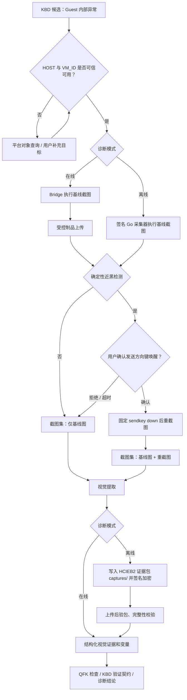

# 虚拟机控制台视觉生产者信号设计与需求

> **状态：P0 双线已实现（2026-08-20）。执行层默认关闭（`VM_CONSOLE_CAPTURE_ENABLED=false`），
> 待第十二章平台确认项闭环后启用。**
>
> 已落地范围：
> - 契约层：`acquirer_args.py` 注册表 + `CONDITIONAL_PRODUCERS` 条件生产者发布门禁、
>   `qkv_vm_console.schema.json`（timeout 1-60 独立声明）、`VmConsoleResolver` 不可变
>   Capture Intent、`vm_console_capture` / `vm_console_capture_artifact` 表与迁移 030、
>   Tool Registry 种子（risk_level=2）；
> - 在线：terminal_bridge `vm_console_op` 固定操作 + PPM HTTP 直传 + hci_sim 仿真；
>   agent-service `app/tools/vm_console/` 专用适配器（Inventory 校验 / 近黑检测 /
>   一次性唤醒令牌 / Vision 提取）与 §5.3 内部 API；conversation-service 制品接收、
>   唤醒确认卡中继；customer 前端转发与确认卡；
> - 离线：diagnosis-service `compile_vm_console_capture_intent` / `vm_console_capture`
>   Collector 候选与制品执行项（受控交互风险级别）、Go 采集器 `vm_console_capture`
>   执行器（本机身份校验、TTY 唤醒确认、nearblack 同源算法、captures/ 打包、
>   HCIEB2 链路不变）、验包后派生 PNG + Vision 观察 Evidence Item；
> - UI：Admin 审核页第 12 种信号（条件型生产者标签、目标参数受限编辑）、
>   Customer 唤醒确认卡与采集状态文案；
> - 策略门禁：`VM_CONSOLE_CAPTURE_ENABLED`（执行）、`VM_CONSOLE_VISION_ALLOWED`（视觉发图）。
> - 运营闭环（§7.3/§10.2）：Python 侧 Prometheus 指标全集（capture/duration/near_black/wake/vision/artifact_bytes/security_rejection，mode 区分在线/离线）；Admin「控制台截图审计」查询页（脱敏摘要、多条件过滤、原图访问单独记审计）；Customer 完成态结果卡（画面状态/摘要/置信度/唤醒重截标记/人工复核提示/授权缩略图/失败可行动原因）；Helm 部署开关与 Bridge 制品直传配置（默认关闭）。
> - 审计与回放（§10.1/§7.2）：`vm_console_audit_event` append-only 事件表（迁移 031，
>   覆盖请求/目标校验/截图/上传/质量判定/确认/唤醒/重截/识图/查看制品各节点），
>   Admin 审计页内置事件流抽屉；回放 Fixture 五态（正常/黑屏/Kernel Panic/蓝屏/不可用）
>   确定性回放（近黑判定 + PNG 隔离派生 + 观察 Schema 契约）；PNG 派生隔离进程执行
>   （spawn 子进程 + 像素/边长/超时上限）；在线编排进程内 E2E（基线路径/近黑唤醒路径/
>   归属不匹配 fail-closed）与离线编译-制品渲染契约测试；hci_sim 固定操作形态仿真测试。
>
> 原始提案内容如下。
>
> 本文定义 `qkv_vm_console`（虚拟机控制台截图）的完整设计。它用于补齐 HCI
> 平台告警、任务和弹框无法观察到的 Guest OS（客户虚拟机内部操作系统）问题，例如黑屏、
> 蓝屏、Kernel Panic（内核恐慌）、启动失败、安装卡住和登录界面错误。
>
> 本文是对 [QKV/QFK 信号模型 v2 参考](./02-架构设计/QKV_QFK信号模型v2参考.md)
> 与 [在线与离线诊断模式-KBD信号利用路径对比](./在线与离线诊断模式-KBD信号利用路径对比.md)
> 的增量设计；两篇既有文档描述的是当前已实现的 3 种 QKV 生产者信号，不能据此认为
> `qkv_vm_console` 已上线。该能力的在线与离线支持均以本提案实施完成为前提。

---

## 一、结论与边界

### 1.1 一句话结论

新增 `qkv_vm_console`，将其定义为**条件型实时视觉生产者信号**：在可信地获得宿主机和
VMID（虚拟机标识）后，平台以代码固定的 QEMU Monitor（虚拟机监控器）操作采集控制台截图。
在线模式通过受控桥接通道保存为视觉证据；离线模式由签名的 Go（Go 语言）采集器写入加密
Evidence Bundle（诊断证据包）的 `captures/` 目录。平台在验包后由 Vision Extractor（视觉提取器）
产生结构化、可追溯的视觉证据和变量。它不是可编辑的任意 Shell（命令行解释器）命令，也不是
离线采集器的普通文本采集项。

### 1.2 为什么需要它

当前生产者信号仅覆盖：

| 已有生产者信号 | 可观察的信息 | 盲区 |
|---|---|---|
| `qkv_alert`（告警查询） | 平台告警及关联对象 | Guest 内部未上报告警的问题 |
| `qkv_task`（任务查询） | 平台任务及失败详情 | 虚拟机已启动后才出现的系统问题 |
| `qkv_dialog`（弹框查询） | 管理界面弹框日志 | 客户操作系统控制台画面 |

虚拟机内部故障可能完全没有对应的 HCI 告警、任务或管理端弹框。控制台画面是这类问题的直接
观察证据，但它不能替代平台对象定位、事件查询或确定性的后端检查。

### 1.3 目标

1. 在在线和离线诊断中，以最小且可审计的权限获得虚拟机控制台的实时视觉证据；
2. 处理控制台因熄屏而导致首次截图近黑/黑屏的情况，支持受控的“方向键唤醒后重截”；
3. 把图片转换为结构化、可复核的信号变量，而不是让模型用图片直接给出根因；
4. 在 KBD（知识库文档）发布时保证宿主机、VMID 的来源可追溯，避免“能发布但不能执行”；
5. 全流程具备权限边界、人工确认、制品完整性、隐私保护、审计和可观测性；
6. 不影响已有 `qkv_alert`、`qkv_task`、`qkv_dialog`、QFK（消费者信号）和
   `terminal_bridge`（在线终端桥接通道）的语义。

### 1.4 非目标

- 不让 KBD、Tool Registry（工具注册表）运营页面或 LLM（大语言模型）写入任意 `vtpsh`、
  QEMU Monitor 命令、宿主机路径或 Shell 片段；
- 不把视觉模型的自然语言推断直接作为最终诊断结论；
- 不默认对每一个虚拟机问题截图、唤醒或发送按键；
- 不把 `sendkey down` 伪装为只读操作；
- 不把本能力降级为普通 Direct Command Collector（直接命令采集器），或允许离线制品携带
  自由 `vtpsh` 参数；
- 不保存无限期的控制台截图，也不把原图写入 Langfuse（可观测平台）输入/输出。

---

## 二、术语与信号定位

| 名称 | 定义 |
|---|---|
| `qkv_vm_console` | 虚拟机控制台截图，新的 QKV 条目；以结构化视觉观察产出变量。 |
| 条件型生产者 | 自身不能从全局事件发现目标，必须先具备 `HOST` 与 `VM_ID` 才可执行的生产者。 |
| 基线截图 | 未向 Guest 注入任何按键前采集的第一张截图。 |
| 唤醒重截 | 基线截图被判为近黑/无有效画面后，经人工确认向 Monitor 发送方向键，再采集的一张截图。 |
| 视觉证据 | 原始图片、完整性哈希、采集上下文、结构化识别结果和模型版本组成的证据整体。 |
| 视觉结论 | 视觉模型对画面可见现象的有限描述；不是根因结论。 |

`qkv_vm_console` 仍归入 QKV 命名空间，原因是它的主要工作是产出变量供下游信号消费；但它
与三个既有 QKV 的差异必须显式建模：

| 项目 | `qkv_alert/task/dialog` | `qkv_vm_console` |
|---|---|---|
| 数据源 | 告警、任务、日志 | 实时虚拟机控制台画面 |
| 是否可作为无上下文入口 | 可以 | 不可以，必须已有 `HOST` + `VM_ID` |
| 是否严格只读 | 是 | 截图阶段近似只读；唤醒阶段是受控 Guest 交互 |
| 证据形态 | JSON/文本 | PPM 原件 + 受控 PNG 派生件 + 结构化视觉结果 |
| 离线 P0 支持 | 是 | 是，采用专用二进制视觉采集执行器 |

---

## 三、业务流程



> 图示语义：近黑检测与唤醒确认在两种模式下都发生在采集侧（在线为制品上传后、离线为打包前）；
> 视觉提取的产物按模式分流——在线直接形成结构化证据，离线先入证据包、验包后再由平台侧提取。

### 3.1 前置对象定位

执行前必须同时满足：

1. `HOST` 来自平台 Inventory（资源清单）验证后的宿主机节点标识；不接受未经验证的用户
   主机名直接拼接到 `/nodes/...`；
2. `VM_ID` 是精确 VMID，不接受模糊 VM 名称；
3. Inventory 显示该 VMID 当前归属该宿主机；迁移竞争窗口内需要重新确认；
4. 当前会话、工单、租户和目标虚拟机之间具备授权关系；
5. KBD 通过 `orchestrate.requires` 声明对 `HOST`、`VM_ID` 的依赖，并在信号文档的
   `verification_contract.variables` 中将二者声明为**外部变量**，注明取值途径（平台上下文、
   受控对象查询或用户表单）。缺少外部声明时，现行发布门禁会以“输入变量没有上游产出或外部
   声明”拒绝该信号——对唯一生产者为 `qkv_vm_console` 的 KBD，这一步不可省略。

来源优先级为：平台上下文 / 已执行生产者变量 > 受控对象查询 > 用户显式填写并经 Inventory
校验。任一环节无法验证均不得执行截图。

### 3.2 基线截图

在线专用适配器与离线 Go 运行时仅能构造如下**等价的固定操作**，不得读取 KBD 中的路径或
Monitor 指令：

```text
vtpsh create /nodes/<verified-node-id>/qemu/<verified-vmid>/monitor \
  --command "screendump /sf/data/local/hci-diagnosis/<capture-id>.ppm"
```

其中 `<capture-id>` 为服务端生成的 UUID（全局唯一标识），不使用 VMID 作为文件名。

- **在线模式**：适配器通过专用二进制制品通道读取临时 PPM、上传、验证哈希，并无条件申请
  删除临时文件。
- **离线模式**：签名采集制品内的 `vm_console_capture` 执行器读取临时 PPM，将其写入
  `captures/<capture-id>/baseline.ppm`，为每个文件写入 SHA-256、媒体类型和敏感级别到
  `manifest.json`，然后按现有 HCIEB2（第二版 HCI 加密证据包）协议加密、签名并上传；
  临时文件在打包完成后删除。原始离线包保持不可变，平台不能在上传后修改其内容。

### 3.3 近黑检测与唤醒重截

不能把“黑屏”完全交给 Vision 判断。在线模式在基线截图上传后、离线模式在基线 PPM 写入
证据包前，均先运行同版本的确定性图像质量检查，至少计算：

- 像素总数、宽高与文件大小；
- 平均亮度、亮度标准差、非近黑像素比例；
- 单色比例和边缘密度；
- OCR（文字识别）是否发现少量控制台文本。

只有满足“近黑/无有效画面”阈值，才显示“尝试唤醒并重新截图”的建议。阈值、算法版本和判断
结果都必须入库；不能因模型猜测“黑屏”而自动发按键。

`sendkey down` 会向 Guest 输入一个方向键，可能改变焦点、菜单选择或应用状态。因此它属于
`controlled_interaction`（受控交互），不是 read-only（只读）操作，必须遵守：

1. 首次截图永远不发键；
2. 仅在近黑检测命中时可申请唤醒；
3. 每个 `case_id + vm_id + diagnosis_run_id` 最多一次唤醒尝试；
4. 默认需要当前用户明确确认，确认内容须说明“将向该虚拟机控制台发送一次向下方向键，可能
   改变当前界面选择”；在线模式使用确认卡，离线模式由 Go 运行时在 TTY（终端）中提示；
5. 只有平台未来新增经过审批的自动执行策略，才可将确认改为策略授权；KBD 自身不得绕过；
6. 适配器只支持固定动作 ID `wake_down_key`，不支持键名、组合键或任意 Monitor 文本；
7. 离线采集器未连接 TTY、使用 `--non-interactive`（非交互）参数、确认输入超时或用户拒绝时，
   均不得发键，而是保留基线图并在 Manifest（清单）中记为 `wake_declined`；
8. 唤醒后等待短暂、固定且有上限的稳定窗口，再采集第二张截图；不得循环重试。

固定唤醒操作等价于：

```text
vtpsh create /nodes/<verified-node-id>/qemu/<verified-vmid>/monitor \
  --command "sendkey down"
```

### 3.4 离线证据包契约

离线 `qkv_vm_console` 不是让客户手工附一张图片，而是由已签名的采集制品执行专用
`vm_console_capture`（虚拟机控制台采集）执行器。该执行器不能通过现有通用
`command_template/argv`（命令模板/参数数组）路径表达，因为通用路径明确只允许只读命令，
而 `vtpsh create ... monitor` 与可选 `sendkey down` 必须在更严格的固定意图策略下执行。

每个离线 Collection Item（采集项）在签名制品中至少冻结：

```jsonc
{
  "executor": "vm_console_capture",
  "operation_version": "v1",
  "host_node_id": "<已验证节点标识>",
  "vm_id": "<已验证 VMID>",
  "capture_mode": "baseline_then_prompt_if_near_black",
  "timeout_seconds": 60,
  "max_capture_bytes": 16777216,
  "source_signal_refs": [{"support_id": "<KBD>", "signal_id": "<signal>"}]
}
```

`host_node_id`、`vm_id`、`capture_mode` 和所有资源上限都在签名原文内，Go 运行时必须校验：

1. 制品、Runtime Manifest（运行时清单）和吊销清单的签名、有效期与受信指纹；
2. 本机节点身份与签发目标相符；不符时不执行 `vtpsh`；
3. VMID 是数值型受限标识，且截图目标属于本机已验证节点；
4. 唯一允许的 Monitor 操作是 `screendump` 和经确认的一次 `sendkey down`；
5. 截图文件不超过 `max_capture_bytes`，且仅能落在采集器私有临时目录；
6. 任何检查失败均记入 `collection_items[].failure_reason`，继续执行其他采集项。

认证解密后的证据包目录扩展为：

```text
captures/
└── <collection-item-id>/
    ├── baseline.ppm
    ├── recapture-after-wake.ppm       # 可选，仅确认唤醒后存在
    └── capture-result.json            # 质量统计、唤醒决定与固定操作结果
```

`manifest.json` 对每一个 `.ppm` 与 `capture-result.json` 逐项声明 `path`、`media_type`、
`sensitivity`、`size_bytes`、`sha256`；Collection Item 额外记录：

- `executor=vm_console_capture`、`operation_version`、`host_node_id` 和 `vm_id`；
- 基线/重截图时间、退出码、近黑质量指标与算法版本；
- `wake_decision`（`not_needed`、`confirmed`、`declined`、`non_interactive`、`timed_out`）、
  `wake_result` 与重截图是否生成；
- 签名采集制品 ID、Collector Revision（采集器修订）、KBD Revision（知识库修订）和 Signal ID。

上传后，Diagnosis Service（诊断服务）先按现有 HCIEB2 解密、路径安全、大小、EICAR（反恶意
软件测试字符串）、Manifest 文件集和 SHA-256 流程验包，再在隔离 Worker（工作进程）中把 PPM
派生为 PNG 并调用视觉模型。派生 PNG、OCR 与结构化观察是**平台侧 Evidence Item（证据项）**，
以原始证据包、文件路径和 SHA-256 建立不可变关联；不得回写或篡改客户上传的证据包。

### 3.5 视觉提取与后续判断

视觉提取器只描述可观察事实，返回固定 Schema（结构定义），例如：

```json
{
  "observation_status": "observed",
  "display_state": "kernel_panic",
  "summary": "控制台显示 Kernel panic - not syncing",
  "ocr_text": ["Kernel panic - not syncing"],
  "visible_indicators": ["kernel_panic", "boot_failure"],
  "confidence": 0.91,
  "needs_human_review": false,
  "artifact_id": "<视觉证据制品 ID，与制品库 SHA-256 记录一一对应>",
  "model_revision": "vision-runtime-v1",
  "prompt_revision": "vm-console-observation-v1",
  "display_state_vocabulary_revision": "vm-console-display-state-v1"
}
```

`artifact_id` 必须包含在提取结果中：KBD 信号的 `produces` 通过 JSON path 引用它
（见 4.2 的 `VM_CONSOLE_ARTIFACT_ID`），缺失会导致该变量取值为空。

`display_state` 仅允许受限词表：

`booting`、`login_prompt`、`desktop`、`black_screen`、`kernel_panic`、`bsod`、
`installer_error`、`application_error`、`no_signal`、`unknown`。

词表与 `display_state_vocabulary_revision` 一同版本化：词表增删成员时必须提升修订号，
历史识别结果按采集时记录的词表修订回放对齐（P1 的 Golden Set 回放依赖该机制）。

低置信度、图片质量不足、OCR 与分类冲突或模型调用失败时，必须降级为 `unknown` 或
`unavailable`，不能声称“没有故障”。视觉变量供 QFK 和案例级 Verification Contract（验证
契约）组合使用，例如“出现 Kernel Panic 文本”可以支持某案例，但不能单独证明根因。

---

## 四、KBD 信号契约

### 4.1 新增工具与参数

共享 Schema 应新增 `qkv_vm_console`，并以单独的 `qkv_vm_console.schema.json` 校验参数。

| 参数 | 类型 | 必填 | 约束 |
|---|---|---:|---|
| `host` | string | 是 | 仅允许 `{{HOST}}` 或由系统规范化后的节点变量；执行时必须 Inventory 校验。 |
| `vm_id` | string | 是 | 仅允许 `{{VM_ID}}` 或受控 VMID 变量；执行时必须精确匹配、不可含 Shell 控制字符。 |
| `capture_mode` | enum | 否 | 仅 `baseline_then_optional_wake`，默认值；不提供任意 Monitor 指令。 |
| `timeout` | integer | 否 | 1–60 秒；截图、上传、视觉提取分别使用独立内部超时。 |
| `instruction` | string | 否 | 人类可读说明，不参与命令构造。 |

> 超时口径说明：本工具 `timeout` 的 1–60 秒范围是对 `common_args.timeout`（1–300 秒）的
> **有意偏离**。控制台截图是快速失败型采集，截图、上传、视觉提取各阶段另有独立内部超时，
> 不允许长阻塞；`qkv_vm_console.schema.json` 独立声明自己的 `timeout`，不复用公共定义。

禁止的参数包括：`command`、`monitor_command`、`path`、`key`、`sleep`、`shell`、任意 URL
和任意文件名。

### 4.2 示例

```jsonc
{
  "id": "s_vm_console_kernel_panic",
  "role": "should",
  "acquire": {
    "tool": "qkv_vm_console",
    "args": {
      "host": "{{HOST}}",
      "vm_id": "{{VM_ID}}",
      "capture_mode": "baseline_then_optional_wake",
      "timeout": 60,
      "instruction": "采集虚拟机控制台画面，确认是否存在内核恐慌或启动失败现象"
    }
  },
  "match": null,
  "orchestrate": {
    "requires": ["HOST", "VM_ID"],
    "produces": [
      {"name": "VM_CONSOLE_STATE", "path": "display_state"},
      {"name": "VM_CONSOLE_SUMMARY", "path": "summary"},
      {"name": "VM_CONSOLE_CONFIDENCE", "path": "confidence"},
      {"name": "VM_CONSOLE_ARTIFACT_ID", "path": "artifact_id"}
    ]
  },
  "provenance": {
    "category": "frontend",
    "method": "controlled_vm_console_capture",
    "confidence": 0.8,
    "risk": 0.4,
    "needs_review": true,
    "evidence": "受控虚拟机控制台截图与结构化视觉观察"
  },
  "review": {
    "require_human_confirm": false,
    "notes": "仅截图本身不需确认；近黑后的 sendkey down 必须在运行时单独确认。"
  }
}
```

`match` 为 `null` 是因为该信号负责产出变量。下游 QFK 或案例验证契约使用
`VM_CONSOLE_STATE`、`VM_CONSOLE_SUMMARY` 与其他平台证据完成确定性/组合判定。

以 `qkv_vm_console` 为唯一生产者的 KBD，必须在 `verification_contract.variables` 中将
`HOST`、`VM_ID` 声明为外部变量（取值途径为平台上下文、受控对象查询或用户表单）；
否则发布门禁会以“输入变量没有上游产出或外部声明”拒绝。

### 4.3 发布门禁

现有“至少一个生产者信号”门禁需从静态三选一扩展为：

1. `qkv_alert`、`qkv_task`、`qkv_dialog` 是**直接生产者**；
2. `qkv_vm_console` 是**条件生产者**；只有 `HOST`、`VM_ID` 均可通过同一 KBD 的已声明变量
   来源、受控平台查询或用户表单取得时，才可参与生产者门禁；
3. 当原始 KBD 明确描述的是“虚拟机内部 / Guest OS 内部”现象，且没有可用的 HCI 告警、任务或
   弹框事实时，`qkv_vm_console` 可以且应当是**唯一生产者信号**。系统不得为凑齐生产者而凭空
   生成 `qkv_alert`、`qkv_task` 或 `qkv_dialog`；
4. 这类 KBD 的 Verification Contract 必须声明适用范围为“已定位具体虚拟机的 Guest 内部问题”，
   并在 `provenance.evidence`/审核记录中引用原始 KBD 对“虚拟机内部现象”的原文依据；
5. “唯一生产者”不等于“无对象前置条件”：若没有可信 VMID，则案例不能执行控制台截图，应当
   通过受控对象查询或用户补充定位后标记为 `BLOCKED`；虚拟机尚未创建成功的场景不应错误使用
   本信号，而应由原始 KBD 的任务/平台证据决定其生产者；
6. `qkv_vm_console` 可以与 QFK（消费者信号）共同存在，视觉证据与状态、日志、网络等确定性
   证据按案例契约组合判定；
7. 未声明变量来源、变量未校验、将自由文本直接传入 `host/vm_id`、或将唤醒配置为自动执行时，
   发布审查必须阻断；
8. 原有三类 QKV KBD 不受影响，发布门禁保持向后兼容。

发布错误应明确指出缺失项，例如：“控制台截图信号需要可信的 HOST 与 VM_ID 来源；请增加
上游生产者、平台对象查询或受控用户输入。”

### 4.4 变量命名口径

本信号的目标变量规范名为 `HOST` 与 `VM_ID`。存量 KBD（如 27123 黄金案例）产出的是
`VM`，与 `VM_ID` 同义。按审核指南“同一含义不要定义多个变量名”的规则：

1. 新增 KBD 一律使用 `VM_ID`；
2. 新旧 KBD 可能在同一诊断会话中同时命中（变量池按会话共享），存量 KBD 进入维护时应把
   `produces` 的 `VM` 归一为 `VM_ID`，或在 `verification_contract.variables` 中声明二者
   等价；
3. 归一完成前，Agent 侧不得假设 `VM` 与 `VM_ID` 自动互通。

---

## 五、架构与接口设计

### 5.1 组件职责

| 组件 | 新增/调整职责 |
|---|---|
| Shared Signal Schema（共享信号规范） | 注册工具、参数 Schema、变量来源和发布门禁。 |
| Shared Resolution Runtime（共享解析运行时） | 增加 `vm_console` Resolver（解析器），只编译受控 Capture Intent（采集意图），标明在线/离线均可执行。 |
| Tool Registry（工具注册表） | 展示能力、风险、版本、启停状态和说明；不保存可编辑 Monitor 命令。 |
| agent-service（智能诊断服务） | 在线专用适配器、Inventory 校验、运行时确认、截图/上传/清理编排、视觉调用和变量回写。 |
| terminal_bridge（在线终端桥接） | 在线时仅执行经适配器签名的固定操作，并回传执行审计关联键；不得开放通用文件下载。 |
| offline-collector（离线 Go 采集器） | 新增签名制品专用 `vm_console_capture` 执行器、本机目标校验、TTY 确认、PPM 打包、哈希和临时文件清理。 |
| diagnosis-service（诊断服务） | 签发专用离线采集项、验收 HCIEB2 图片、派生 PNG、视觉调用、Evidence Item 入库及离线变量回写。 |
| Artifact Service（证据制品服务） | 在线接收二进制 PPM；离线上传后接收已验签证据包的派生 PNG，执行病毒/格式/大小检查、哈希、加密存储、授权下载和 TTL 清理。 |
| kb-service（知识库服务） | KBD 编辑、审查、发布时的 Schema/变量来源/工具启用校验。 |
| Admin UI（管理端） | 让审核人看到条件、唤醒风险、变量来源、视觉词表、制品留存与测试结果。 |
| Customer UI（客户端） | 在需要唤醒时显示明确确认卡片；展示截图、识别结果、置信度与失败原因。 |

### 5.2 专用 Capture Intent

Shared Resolution Runtime 不返回字符串命令，而返回不可变意图：

```json
{
  "resolver_id": "vm_console",
  "operation": "capture_baseline",
  "host_ref": "verified:HOST",
  "vm_ref": "verified:VM_ID",
  "artifact_policy": "vm_console_v1",
  "timeout_seconds": 60,
  "catalog_revision": "..."
}
```

`wake_down_key` 必须是另一个显式 operation，且只有服务端已记录用户确认后才可调度。任何
未在此枚举中的 operation 直接 Fail Closed（安全失败）。

### 5.3 内部 API

以下为内部契约，不直接暴露给浏览器或客户：

| API | 作用 |
|---|---|
| `POST /internal/vm-console/captures` | 创建并执行基线截图；输入仅为 `case_id`、`host_ref`、`vm_ref`、`signal_id`。 |
| `POST /internal/vm-console/captures/{id}/wake-and-recapture` | 校验一次性确认令牌后执行固定 `wake_down_key` 与重截图。 |
| `GET /internal/vm-console/captures/{id}` | 获取结构化状态、制品引用、视觉结果和审计摘要。 |
| `POST /internal/vm-console/captures/{id}/analyze` | 仅在已验证的制品上启动/重试视觉提取。 |

客户侧只通过既有会话/工具事件通道获得状态和一次性确认请求，不直接取得上述内部权限。

### 5.4 状态机

```text
created
  → inventory_verified
  → baseline_capturing
  → baseline_captured
  → quality_checked
  → [online] baseline_uploaded → vision_analyzing → completed
  → [offline] bundle_packaged → bundle_uploaded → bundle_verified → vision_analyzing → completed

quality_checked(near_black)
  → wake_confirmation_pending
  → wake_declined → [按当前模式继续]
  → wake_confirmed → waking → recapturing → [按当前模式继续]

任意阶段 → failed | expired | cancelled
```

状态、原因码和当前有效制品必须不可歧义。截图失败、上传失败、识图失败不能被压缩为同一种
“采集失败”。

---

## 六、安全、隐私与完整性

### 6.1 命令和权限边界

1. `vtpsh` 的可执行路径、URI 模板、`screendump`、临时目录和 `sendkey down` 都固定在后端
   代码/已签名 Catalog（命令目录）中；
2. 适配器必须验证 Node 与 VM 当前归属，拒绝跨租户、跨工单和陈旧迁移映射；
3. Host、VMID、Capture ID 逐项进行严格字符、类型与长度校验；
4. 截图和唤醒分别最小权限授权，唤醒不能随截图授权自动获得；
5. 每次截图和唤醒都记录 KBD Revision（知识库修订）、Tool Catalog Revision（工具目录修订）、
   操作版本、操作者、确认人、Trace ID（链路标识）和执行 ID；
6. 所有失败均默认拒绝，不回退到自由命令执行。

### 6.2 制品完整性与留存

| 环节 | 必须措施 |
|---|---|
| 宿主机临时文件 | 私有随机目录、最小权限、单次 Capture ID、上传确认后删除、TTL（过期时间）兜底清理。 |
| 上传 | mTLS（双向传输层认证）或等价服务身份、长度限制、分段校验、原始 PPM SHA-256。 |
| 派生 | 在隔离进程转换 PNG，限制像素、尺寸、解码时间和内存；记录派生链与 PNG SHA-256。 |
| 存储 | 租户隔离、静态加密、短时签名访问、按工单/角色鉴权；默认保留期可配置。 |
| 展示 | 不在诊断消息中嵌入 Base64，不通过公网固定 URL 暴露，不向无权限角色返回原图。 |
| 删除 | 工单删除、保留期结束或人工撤销时产生可审计删除事件；法务保全策略优先。 |

控制台可能包含账号、业务数据、密钥片段或个人信息。视觉模型调用前须经过数据分类策略：
默认仅向配置为合规区域、具备数据处理授权的模型端点发送派生 PNG；不满足条件时保留图片、
返回 `vision_unavailable_by_policy`，不得绕过策略。

### 6.3 Langfuse 与日志

Langfuse Trace（链路追踪）至少记录 Capture ID、制品 ID、哈希、尺寸、质量统计、模型/Prompt
版本、状态、耗时和错误分类。默认不得上传原始图片、OCR 全文或包含客户敏感信息的视觉摘要；
需要受控排障时由具备权限的审计系统以制品 ID 关联查看。

---

## 七、产品交互需求

### 7.1 客户端在线诊断

1. 当 KBD 需要该信号但目标未定位时，展示结构化表单，要求填写或确认宿主机、VMID；提交后
   必须显示平台校验后的对象名称与归属。
2. 截图中显示“正在采集控制台画面”，不得误称“正在执行只读命令”。
3. 基线图近黑时显示确认卡片：

   > 首张控制台截图接近黑屏。是否向虚拟机发送一次“向下方向键”尝试唤醒后重新截图？
   > 此操作可能改变虚拟机当前界面的焦点或选择，但不会发送任意命令。

4. 用户可确认、拒绝或取消；超时默认拒绝唤醒但继续分析基线图。
5. 完成后展示缩略图、采集时间、是否唤醒重截、可见现象、置信度、人工复核提示和制品授权入口。
6. 失败时展示可行动的原因，不泄露宿主机路径、内部 URI、令牌或原始命令细节。

### 7.2 KBD 审核与发布

审核页必须展示：

- 信号类型为“虚拟机控制台截图（条件型实时视觉生产者）”；
- `HOST`、`VM_ID` 的变量来源与验证方式；
- 信号只可产生哪些变量；
- 基线截图、近黑判定和运行时确认的行为说明；
- Tool Registry 是否启用、Catalog Revision 是否可用；
- 离线模式状态为“不支持（P0）”；
- 包含正常画面、黑屏、Kernel Panic、蓝屏和不可用的回放 Fixture（回放样本）结果。

KBD 编辑器不能给该信号提供“执行命令”“路径”“按键”等自由字段。

### 7.3 管理与审计

管理端需提供受权限控制的 Capture 查询：工单、VM、用户、时间范围、状态、是否唤醒、视觉状态、
制品状态、模型版本、KBD 修订和 Trace ID。管理员只能读取自己授权租户的脱敏摘要；查看原图
必须单独记审计。

---

## 八、失败语义与诊断表现

| 代码 | 含义 | 是否可重试 | 诊断语义 |
|---|---|---:|---|
| `TARGET_CONTEXT_MISSING` | 无可信 HOST 或 VMID | 否，需补充/查询 | `BLOCKED` |
| `TARGET_OWNERSHIP_MISMATCH` | VM 不属于目标宿主机或租户 | 否，需重新定位 | `BLOCKED` |
| `VM_NOT_RUNNING` | VM 未运行 | 视状态变化重试 | `UNKNOWN`，不是“Guest 黑屏” |
| `MONITOR_UNAVAILABLE` | Monitor 不可用 | 是 | `ERROR` |
| `BASELINE_CAPTURE_FAILED` | 基线截图命令失败 | 是，有限次数 | `ERROR` |
| `ARTIFACT_UPLOAD_FAILED` | 图片未安全入库 | 是 | `ERROR` |
| `IMAGE_INVALID` | 图片格式、尺寸或哈希不合规 | 否 | `ERROR` + 安全事件 |
| `WAKE_CONFIRMATION_REQUIRED` | 命中近黑，等待用户确认 | 否 | `PENDING` |
| `WAKE_DECLINED` | 用户拒绝或超时 | 否 | 继续基线识图，附上下文 |
| `WAKE_FAILED` | 固定唤醒操作失败 | 否，继续基线识图 | `ERROR` 子事件 |
| `VISION_UNAVAILABLE_BY_POLICY` | 合规策略不允许发图到视觉模型 | 否 | `UNKNOWN` |
| `VISION_UNCERTAIN` | 模型低置信度或结果冲突 | 可人工/受控重试 | `UNKNOWN` |

原则：`ERROR` 表示未获得可靠观察，`UNKNOWN` 表示观察不足以判断；二者都不能被案例级结论
解释为反证。

---

## 九、在线与离线诊断支持

### 9.1 同一 KBD、两种受控执行路径

是否需要 `qkv_vm_console` 必须由原始 KBD 的故障对象和证据事实决定，而不是由在线/离线模式
决定。原始 KBD 明确描述 Guest 内部问题时，该信号是唯一生产者；同一份已发布 KBD 在在线与离线
模式均应可执行，产出相同的 `VM_CONSOLE_*` 变量语义，供同一套 CDD（证据差异诊断）与
Verification Contract（验证契约）判断。

| 项目 | 在线诊断 | 离线诊断 |
|---|---|---|
| 执行载体 | `agent-service → terminal_bridge → HCI Host` | 经过验签的 `hci-collect-linux-amd64`（Go 采集器）在目标宿主机执行 |
| 截图内容 | 受控 PPM 制品上传 | PPM 写入 HCIEB2 证据包 `captures/` |
| 近黑质量检测 | 服务端受控制品后执行 | Go 运行时在打包前执行，确保可请求唤醒 |
| 唤醒确认 | 客户端确认卡 | 本地 TTY 明确确认；非交互模式默认拒绝 |
| 视觉识别 | 平台侧 Vision Worker（视觉工作进程） | 上传、验包后由同一 Vision Worker 执行 |
| 原图完整性 | 制品 SHA-256、审计关联 | HCIEB2 加密、签名制品、Manifest SHA-256、上传验包 |
| 离线判定 | 实时变量池 | 证据包入库后由 OfflineEvidenceProvider（离线证据提供器）写入变量池 |

离线资源同步必须把 `qkv_vm_console` 编译为**专用** `vm_console_capture` Collection Item；它不是
`online_only`，也不是 `command` Executor（命令执行器）。若目标节点未明确、签名密钥不可用、
采集制品已过期/吊销，系统必须拒绝生成或执行制品，而不是降级成一段可复制的 `vtpsh` 文本。

### 9.2 离线流程与诊断语义

1. 管理端/客户侧创建离线诊断会话时，从工单上下文、受控用户输入或平台对象查询确定
   `HOST`、`VM_ID`，并将目标节点写入 Collection Plan；
2. Diagnosis Service 依据 KBD Revision（知识库修订）、Signal Mapping（信号映射）、目标节点和
   时间窗实时签发专用 Collector Artifact（采集器制品）；
3. 客户在**目标宿主机**运行 Go 采集器。采集器先验证自身、制品、吊销清单和本机身份，再执行
   基线截图、近黑检测、可选 TTY 唤醒与重截；
4. 原始 PPM、质量/唤醒结果和其他采集项一起写入 `DiagnosticEvidenceBundle`（诊断证据包），
   并按 HCIEB2 加密；
5. 平台上传处理器先验证整包、Manifest 与每个文件的哈希；验证通过后，把 PPM 作为
   `evidence_item`，派生 PNG 并调用视觉模型；
6. OfflineEvidenceProvider 从已验证的视觉观察写入 `VM_CONSOLE_*` 变量，再执行下游 QFK 和
   案例级判定；在线与离线对同一图片 Fixture（样本）应得到相同视觉状态和匹配语义。

离线包只保存采集现场得到的原始证据和确定性质量结果。视觉模型结果属于上传后产生的派生
Evidence Item，不修改原始证据包；这样可以重放不同模型/提示词版本，又不破坏客户侧采集证据。

### 9.3 离线采集器安全契约

1. `vm_console_capture` 是 Go 运行时内置的单独执行器，不能透过 `validate_collector_contract()`
   的通用只读命令白名单，也不能由 Tool Registry 的文本模板替换；
2. 该执行器只接受签名制品内的结构化 Capture Intent，内部按固定参数数组调用 `vtpsh`；不启动
   `/bin/sh`，不解析 Shell，不支持环境变量展开、命令拼接、重定向或任意 Monitor 指令；
3. `sendkey down` 即使在离线包中也需本地人工确认。该确认和拒绝结果在 Manifest 中可验证地
   记录，不能由命令行参数、KBD 或环境变量预先设为“自动同意”；
4. 离线运行时使用与平台签发时相同的最大截图大小、总包大小、收集超时和单 VM 一次唤醒配额；
5. Collector Artifact（采集器制品）撤销、过期或目标校验失败时，Go 运行时 Fail Closed（安全
   失败），不尝试执行截图或唤醒。

---

## 十、数据、审计与可观测性

### 10.1 建议的不可变记录

`vm_console_capture`（虚拟机控制台截图记录）至少包含：

- `id`、`tenant_id`、`case_id`、`diagnosis_run_id`、`conversation_id`、`signal_id`；
- `host_node_id`、`vm_id`、目标验证快照与版本；
- `source_kbd_id`、`source_kbd_revision`、`tool_catalog_revision`、`adapter_version`；
- `baseline_artifact_id`、`recapture_artifact_id`、最终有效制品、PPM/PNG 哈希和尺寸；
- 质量检测指标和算法版本；
- 唤醒状态、确认人、确认时间、固定 operation、执行结果；
- 视觉结构化结果、模型版本、Prompt Revision（提示词修订）、置信度和复核状态；
- 状态、错误代码、错误摘要、Trace ID、执行 ID、创建/完成/过期时间。

审计事件以 append-only（只追加）方式写入，至少记录“请求、目标校验、基线截图、上传、质量判断、
确认请求、确认/拒绝、唤醒、重截、识图、查看制品、删除/过期”。

### 10.2 指标与告警

| 指标 | 用途 |
|---|---|
| `vm_console_capture_total{stage,status}` | 各阶段成功/失败率。 |
| `vm_console_capture_duration_seconds` | 截图、上传、识图时延。 |
| `vm_console_near_black_total` | 熄屏/黑屏发生比例。 |
| `vm_console_wake_total{decision,result}` | 唤醒确认、拒绝和结果。 |
| `vm_console_vision_total{state,confidence_band}` | 识别状态与置信度分布。 |
| `vm_console_artifact_bytes` | 制品大小和成本控制。 |
| `vm_console_security_rejection_total{reason}` | 权属/参数/哈希安全拒绝。 |

应对 `MONITOR_UNAVAILABLE` 异常升高、上传失败率升高、近黑率突增、唤醒动作异常频繁、视觉
低置信度激增和临时文件清理失败设置告警。

---

## 十一、实施拆分与验收标准

### 11.1 P0：安全的在线与离线基线

> 验收拆分：**「在线专用适配器」与「离线专用执行器」是两条独立验收线**。在线路径经
> Terminal Bridge 可以更早试跑；离线路径依赖第十二章平台确认项（`sendkey` 语义、Monitor
> RBAC、screendump 文件行为等）全部闭环。两条线并行推进、独立验收，互不阻塞；Schema、
> 变量来源门禁、视觉提取和审计等公共项是两条线的共同前置。

| 工作项 | 验收标准 |
|---|---|
| Schema、Catalog、Resolver | `qkv_vm_console` 可保存、可审查、可发布；自由 command/path/key 全部 422；旧 KBD 行为不变。 |
| 变量来源门禁 | 缺失或未验证 HOST/VM_ID 时发布或执行被阻断，并显示准确原因。 |
| 在线专用适配器 | 仅可执行固定 `screendump`，Node/VM 归属校验失败时绝不调用 Bridge。 |
| 离线专用执行器 | 签名制品仅能生成 `vm_console_capture`；本机目标校验、TTY 唤醒确认、PPM 入 `captures/`、HCIEB2 签名加密、临时文件清理均通过。 |
| 二进制制品链 | 在线 PPM 和离线包内 PPM 均可验证 SHA-256；上传后 PNG 派生件可追溯；超限/异常图片安全失败。 |
| 视觉提取 | 对受控 Fixture 返回 Schema 合法结果；低置信度不输出根因；原图不进入 Langfuse。 |
| 客户确认 | 在线确认卡/离线 TTY 都仅在近黑时显示；拒绝、超时、非交互模式均不发键；同一 Run 最多一次 `sendkey down`。 |
| 审计与观测 | 从 KBD 修订到在线制品或离线证据包、模型、确认和 Trace ID 可完整追溯。 |

### 11.2 P1：质量与运营闭环

- 建立经过人工标注的控制台图片 Golden Set（黄金样本集），覆盖中文/英文 Linux 启动、
  Kernel Panic、Windows 蓝屏、登录页、黑屏、无信号、安装错误和正常桌面；
- 支持管理员在合规权限内复核视觉结果并标注误判；
- 基于真实数据校准近黑阈值和视觉置信度，不通过修改 KBD 文案规避；
- 增加图片脱敏、保留策略和模型端点策略的租户级配置。

### 11.3 P2：质量与运营增强

P2 只在 P0 的在线/离线语义稳定后，增加多模型回放、人工标注闭环、租户级保留策略和更细的
视觉质量阈值；不得改变 P0 的在线/离线权限、签名、审计和发布语义。

### 11.4 自动化测试矩阵

| 类别 | 必测场景 |
|---|---|
| Schema | 合法信号、未知字段、自由命令、非法 VMID、错误变量占位符。 |
| 发布 | Guest 内部 KBD 仅含 `qkv_vm_console` 可发布；条件生产者缺变量来源被阻断；变量来自上游/受控表单均可审计。 |
| 安全 | 跨租户、Host/VM 不匹配、迁移后归属改变、超时、重复确认、重放确认令牌。 |
| 适配器 | 只产生固定两种 operation；任意参数不能改变 Monitor 指令或临时路径。 |
| 制品 | 在线传输中断、离线 HCIEB2 验签失败、哈希不一致、超大 PPM、畸形图片、清理失败重试。 |
| 视觉 | 正常/黑屏/Kernel Panic/蓝屏/低置信度/政策拒绝；结果 Schema 与变量回写。 |
| UI | 确认卡片、拒绝后继续、失败码展示、权限隔离、原图查看审计。 |
| 回归 | 既有 3 种 QKV、8 种 QFK、在线诊断和离线诊断现有回归全部通过。 |

---

## 十二、待平台确认项

以下事实必须在编码前与 HCI 平台接口负责人确认，不能由 KBD 或 Agent 猜测：

1. `/nodes/<...>` 实际要求的是宿主机 hostname、节点 ID 还是其他稳定 Inventory 标识；
2. `vtpsh create ... monitor` 的最小 RBAC（基于角色的访问控制）权限、支持版本、速率限制和
   审计能力；
3. `screendump` 文件在宿主机的实际格式、权限、文件大小上限和安全读取/删除方式；
4. VM 关机、暂停、迁移、无图形设备、Monitor 断开时的权威错误码；
5. `sendkey down` 的精确语义、对不同 Guest/控制台的实际效果，以及是否存在比方向键更安全的
   官方唤醒接口；
6. 截图中可能包含的敏感数据分级、允许的模型供应商/区域、默认留存期和删除流程。

确认完成前，不能将用户给出的命令字符串直接发往生产环境。

---

## 十三、与既有文档和代码的变更清单

落实本提案时，需要同步更新而非手工绕过以下位置：

1. `backend/shared/schemas/signals/signal.v2.schema.json`：工具枚举和新 acquire 参数引用；
2. `backend/shared/schemas/acquirer_args.py` 及对应 JSON Schema：参数与变量占位符校验；
3. `backend/shared/schemas/signal_schema.py`：条件生产者发布门禁和用户错误文案。**不要**把
   `qkv_vm_console` 直接加入 `FRONTEND_TOOLS` frozenset——该集合同时被“至少一个生产者”
   发布门禁、qkv 校验分支（produces/match 约束）和解析器分发引用，直接加入会让条件生产者
   在这些分支获得直接生产者语义。应新增独立的 `CONDITIONAL_PRODUCERS` 集合，把
   `validate_kbd_publishable_signals_json` 扩展为“直接生产者，或变量来源满足条件的条件
   生产者”，qkv 结构校验分支保持不变；
4. `backend/shared/resolution/review.py` 与 Catalog：`vm_console` Resolver 和不可变 Capture Intent；
5. `database/seeds/03_qkv_qfk_tools.sql`：Tool Registry 能力记录、风险/权限/离线状态说明；
6. `backend/agent-service/app/tools/qkv/`：专用控制台适配器，不能复用自由文本 qkv 执行路径；
   包括 `qkv/signal.py` 的 `FrontendQueryType` StrEnum 扩展、`parse_frontend_value` 分发
   分支，以及 `routes/capabilities.py` 能力发现对新工具的暴露；
7. `terminal_bridge/`、`backend/diagnosis-service/offline-collector/` 与受控制品服务：在线签名
   operation、离线 `vm_console_capture` 执行器、HCIEB2 图片 Manifest、二进制制品上传与清理协议；
8. `backend/kb-service/`、Admin UI、Customer UI：审核门禁、确认卡、状态/制品展示与审计。
   Admin UI 具体触点：KbdReviewView「新增信号」下拉菜单（当前 11 个 tool）、
   `capabilityStatus` 的“能力未声明”标签与命令预览需识别新工具；信号 JSON 导入
   （`frontend/admin/src/utils/signalImport.ts`）对 `acquire.tool` 不做白名单校验，结构上
   天然兼容新工具，但导入预览摘要与审核详情页需展示“条件型生产者”类型及其变量来源声明；
9. 离线资源同步、Collector Artifact 与 Evidence Bundle：为该信号生成签名的
   `vm_console_capture` 采集项，支持 `captures/` 图片、质量/唤醒结果和离线视觉 Evidence Item，
   禁止生成自由命令模板；
10. 相关信号模型、在线/离线对比和 KBD 审核操作文档：从“3 种生产者”更新为“3 种直接生产者
    + 1 种条件型实时视觉生产者（在线和离线均支持，提案/上线后）”。

本清单要求通过正式数据库迁移、契约测试和端到端回归落实；不得只修改前端枚举或种子数据来
制造“已支持”的假象。
