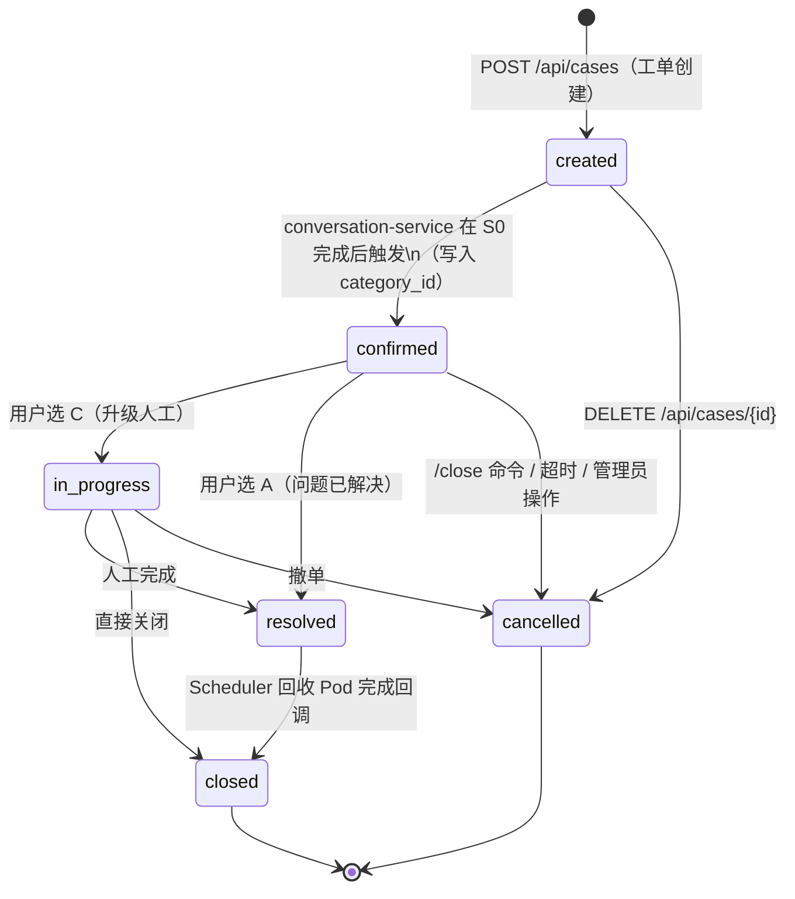
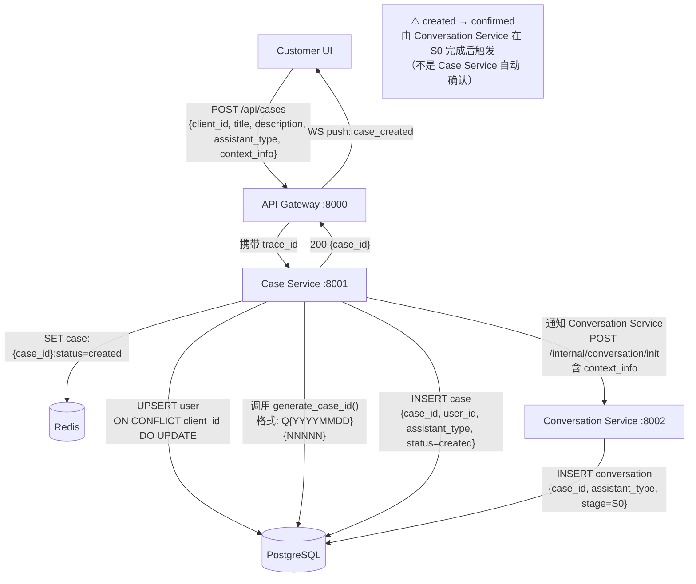
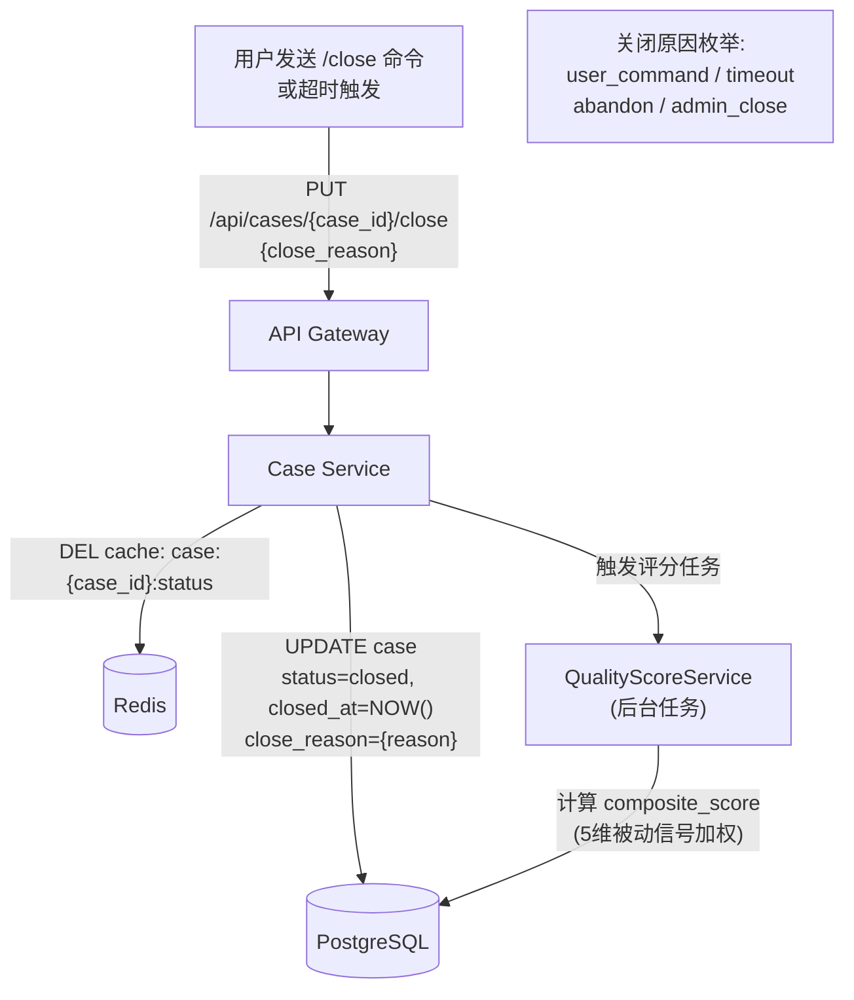

# Case Service — 设计文档

---
status: active
category: solution
audience: developer
last_updated: 2026-04-20
owner: team
---

## 变更历史

| 日期 | 版本 | 变更内容 | 关联事件文档 |
|------|------|---------|------------|
| 2026-05-15 | v1.7 | 修正 acli 实际输出字段映射：告警字段 `urgent_type`(int 1/0→CRITICAL/WARNING)、`end`(Unix 时间戳→时间)、`target`→告警对象、`type`→事件、`host`→主机、`vm`(可选)；任务字段 `status`(int 3→失败/2→完成)、`end`(时间戳)、`type`→行为、`host`/`vm`/`target`/`errcode_tracing`/`request_id`→trace_id；prompt_builder 对应更新；前端 EnvironmentSummary 展示逻辑与 TypeScript 类型同步修正；单测全量更新(11/11 pass) | — |
| 2026-04-25 | v1.6 | 修复 `_extract_alert_logs`/`_extract_task_logs`/`_extract_env_info` 三处字段映射错误：告警字段改读 `urgent_type→level(CRITICAL/WARNING)`、`description→content`、`start→time`、`target→source`；任务字段改读 `process→status`（中文透传）、`type→name`、`start→time`、`description→error`；集群字段改读 `name→cluster_name`、`mcastaddr→network_config` | [events/2026-04-25-环境数据展示与映射修复方案.md](../events/2026-04-25-环境数据展示与映射修复方案.md) |
| 2026-04-20 | v1.5 | Environment Repository 排序修复：ORDER BY 添加 nullslast() 处理 PostgreSQL DESC 默认 NULL FIRST 问题 | — |
| 2026-04-20 | v1.4 | Environment 类型修复：ORM 添加 TimestampMixin + DateTime collected_at；Repository 排序改用 collected_at；Schema 类型对齐；新增单测覆盖 | — |
| 2026-04-20 | v1.3 | Environment API 实现：新增 Environment ORM/Repository/Service/Routes；支持 alert/task/cluster 等 6 类环境数据存库；提供 S0 Prompt context_info 构建 | — |
| 2026-04-07 | v1.2 | 补充 S0 失败特殊转换路径、close_reason 枚举、诊断阶段常量定义 | — |
| 2026-03-28 | v1.1 | 补充工单状态机与诊断阶段同步点设计 | — |
| 2026-03-19 | v1.0 | 初版 | — |

---

## 文档信息
- **对应服务**: `backend/case-service/` · Port 8001
- **对应任务**: [`../../task/case/工单任务.md`](../../task/case/工单任务.md)
- **上级文档**: [`../架构设计.md`](../架构设计.md)

---

## 1. 职责边界

| 职责 | 说明 |
|------|------|
| 工单 CRUD | 创建、查询、更新、关闭工单 |
| 客户身份管理 | 临时用户 UPSERT（以 `client_id` 为幂等键）|
| 状态机驱动 | 维护 `case.status` 6 态流转 |
| 环境信息写入 | 接收 aClient 采集数据写入 `environment` 表 |
| 评估触发 | 工单关闭时触发 `QualityScoreService` 计算综合评分 |
| 助手类型记录 | 工单创建时锁定 `assistant_type`，不可变更 |

**不负责**：对话管理（Conversation Service）、Pod 分配（Scheduler Service）、知识库（KB Service）。

---

## 2. 工单状态设计



**状态语义**：

| 状态 | 含义 | 对应 diagnostic_stage |
|------|------|----------------------|
| `created` | 工单创建，S0 意图识别进行中 | S0 |
| `confirmed` | 故障分类已确认，AI 推理进行中 | S1-S6 |
| `resolved` | 用户确认问题已解决，等待 Pod 回收 | S6（用户选 A 后）|
| `closed` | 终态，所有资源已释放 | 无 |
| `in_progress` | AI 退出，转人工处理 | S6（用户选 C 后）或 S0 失败 |
| `cancelled` | 用户放弃 / 超时 / 管理员关闭 | 任意 |

### 2.1 特殊转换路径

#### S0 意图识别失败（跳过 confirmed）

当 S0 阶段无法成功识别故障类型时（如用户描述模糊、反复分类失败），采用**特殊转换路径**：

```
created → in_progress (跳过 confirmed)
```

- **触发条件**：conversation-service 连续 S0 分类失败超过阈值
- **close_reason**：`s0_classification_failed`
- **目的**：跳过 AI 推理流程，直接移交人工处理

#### close_reason 枚举值

| 值 | 含义 | 适用场景 |
|---|------|---------|
| `user_command` | 用户主动关闭 | 用户发送 `/close` 命令 |
| `timeout` | 超时关闭 | 工单长时间无响应 |
| `abandon` | 用户放弃 | 用户断开连接或退出 |
| `admin_close` | 管理员关闭 | Admin UI 手动关闭 |
| `escalated` | 升级人工 | S6 用户选 C，转人工 |
| `s0_classification_failed` | S0 分类失败 | S0 意图识别失败直接转人工 |

---

## 3. 与对话诊断阶段的对应关系

> `case.status` 是业务合同层，面向用户/客服；`conversation.diagnostic_stage` 是 AI 推理内核层，面向 AI 过程。二者**正交独立**运行，仅在 5 个同步点发生状态联动。

### 3.0 诊断阶段常量定义

为避免代码中硬编码字符串，conversation-service 在 `app/models/diagnostic_state.py` 中集中定义：

```python
class DiagnosticStage:
    """诊断阶段常量"""
    S0_INTENT = "S0"        # 意图识别
    S1_LOCATION = "S1"      # 故障定位
    S2_HYPOTHESIS = "S2"    # 假设生成
    S3_VERIFICATION = "S3"  # 验证执行
    S4_ROOT_CAUSE = "S4"    # 根因确认
    S5_SOLUTION = "S5"      # 解决方案
    S6_CLOSURE = "S6"       # 验证闭环
    S0_FAILED = "S0_FAILED" # S0 意图识别失败（内部标记）

# 阶段标签映射（用于 UI 展示）
STAGE_LABELS = {
    DiagnosticStage.S0_INTENT: "S0-意图识别",
    DiagnosticStage.S1_LOCATION: "S1-故障定位",
    # ... 其他阶段
}
```

**使用规范**：
- 所有代码引用诊断阶段时必须使用常量，如 `DiagnosticStage.S0_INTENT`
- UI 展示时使用 `STAGE_LABELS[stage]` 获取中文标签
- `S0_FAILED` 仅用于内部状态标记，不写入 `conversation.diagnostic_stage` 字段

### 3.1 两层状态对照

```
business layer ──── case.status ────────────────────────────────────────────────
                 created     │    confirmed       │  resolved/in_progress │ closed
                             │                   │                       │
AI layer ──── conversation.diagnostic_stage ────────────────────────────────────
                  S0         │ S1 → S2 → S3/S4/S5 → S6                  │
                             │                   │                       │
                sync point 1 │              sync point 2/3          sync point 4
                (S0完成)      │           (S6 用户选 A or C)         (Pod 回收完成)
```

### 3.2 同步点明细

| 同步点 | 触发事件 | case.status 变化 | diagnostic_stage 变化 | 触发服务 |
|--------|---------|----------------|----------------------|---------|
| **SP-1** | S0 分类确认完成，`category_id` 写入 | `created → confirmed` | `S0 → S1` | conversation-service |
| **SP-1a** | S0 分类失败，直接转人工 | `created → in_progress`（跳过 confirmed）| 不变 | conversation-service |
| **SP-2** | S6 用户选 **A**（已解决） | `confirmed → resolved` | 保持 S6 | conversation-service |
| **SP-3** | S6 用户选 **C**（升级人工） | `confirmed → in_progress` | 保持 S6 | conversation-service |
| **SP-4** | Scheduler Pod 回收完成 | `resolved → closed` | 不变 | scheduler-service |
| **SP-5** | 用户 `/close` / 超时 / 管理员 | 任意 → `cancelled` | 不变 | case-service |

> **SP-1a 说明**：当 S0 连续失败时，采用特殊路径直接转入 `in_progress`，此时 `close_reason = s0_classification_failed`。

### 3.3 设计原则

1. **case-service 不直接感知 diagnostic_stage**：case-service 只暴露 `PUT /internal/cases/{id}/status` 接口，由 conversation-service 在适当时机调用，不主动轮询对话层。
2. **created 阶段不等于"未开始"**：工单创建后 AI 立即启动 S0（意图识别），`created` 代表"AI 正在识别故障类型"，而不是"等待处理"。
3. **S6 之后 case.status 不可再回 confirmed**：用户选 B（新报错）时只回退 `diagnostic_stage` 到 S1，`case.status` 保持 `confirmed` 不变，保证工单级别的连续性。
4. **cancelled 可从任意状态转入**：case-service 维护此规则，conversation-service 收到 cancelled 事件后停止推理。

---

## 4. 数据流图

### 4.1 工单创建流程



### 4.2 工单关闭流程



---

## 5. 核心接口

```
POST   /api/cases                         创建工单
GET    /api/cases                         查询当前用户工单列表
GET    /api/cases/{case_id}               工单详情
PUT    /api/cases/{case_id}/close         关闭工单
PUT    /api/cases/{case_id}/status        更新工单状态（内部接口）
POST   /api/cases/{case_id}/environment   写入环境采集数据（旧，已废弃）
PUT    /api/environments/case/{case_id}/type/{env_type}  环境数据 upsert（幂等，小写替换 create）

GET    /api/cases/all                     Admin: 分页查询全部工单
GET    /api/cases/clients                 Admin: 客户端列表及工单数
```

---

## 6. 关键表

| 表 | 读写场景 |
|----|---------|
| `user` | UPSERT（每次工单创建时） |
| `case` | 全生命周期读写 |
| `environment` | 写入环境数据 |
| `customer` | 查询企业客户信息（可选，B2B 场景） |
| `assistant_evaluation` | 关闭时触发写入（통过 QualityScoreService） |

---

## 7. 可观测性

| 指标 | 来源 |
|------|------|
| `case_created_total` | Counter，每次工单创建 |
| `case_closed_total{reason}` | Counter，按关闭原因分维度 |
| `case_lifecycle_seconds{status}` | Histogram，各阶段停留时长 |
| `active_cases_gauge` | Gauge，当前活跃工单数 |
| 所有请求日志含 `trace_id` + `case_id` | 结构化 JSON → Loki |


---

## 变更历史

| 版本 | 日期 | 说明 |
|------|------|------|
| v1.7 | 2026-04-25 | SP-1 同步点实现修正：`confirmed` 状态不再由前端在工单创建后立即触发，而是由 conversation-service 在 S0 `category_id` 写入成功后调用 `PUT /api/cases/{id}/confirm` 实现；前端 `confirmCreateCase()` 删除 `caseApi.confirm()` 调用，系统消息改为「AI 正在识别故障类型，请稍候…」；修复前工单状态在 AI 对话开始前已变为 confirmed 的设计偏差 | [2026-04-25-工单状态与AI诊断流程缺陷修复方案](../events/2026-04-25-工单状态与AI诊断流程缺陷修复方案.md) |
| v1.3 | 2026-04-23 | 环境数据 upsert 端点：新增 `PUT /environments/case/{case_id}/type/{env_type}`。Repository 新增 `upsert_by_case_and_type()`（check-then-write），返回 `(Environment, created: bool)`；Service 层新增 `upsert_environment()`，打 `trace_id` info 日志。展开解决重复采集产生重复记录的问题 |
| v1.2 | 2026-04-16 | requirements.txt 补充 prometheus-client>=0.19.0（修复 #151）：main.py 直接导入 prometheus_client 但依赖未声明，导致新镜像 ModuleNotFoundError |
| v1.1 | 2026-04-16 | 注入 HTTPMetricsMiddleware，上报 http_request_duration_seconds / http_requests_total；添加 /metrics 端点（可观测性修复 #2） |
