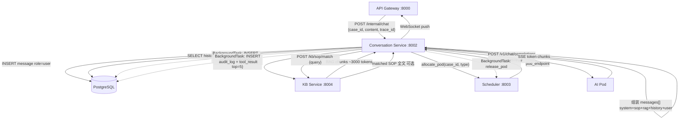
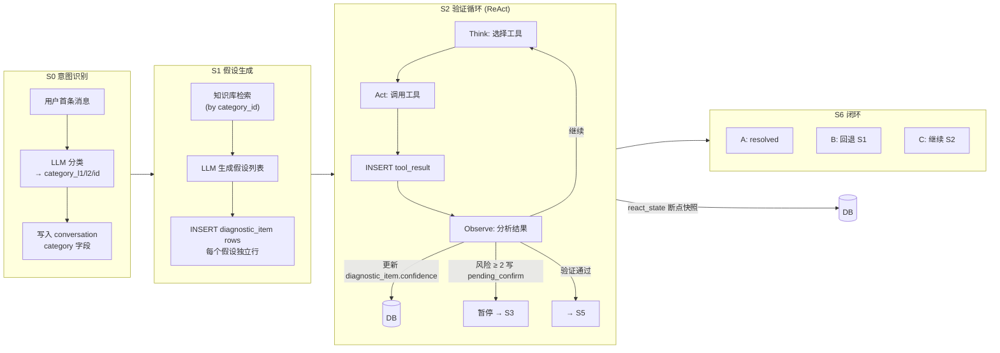
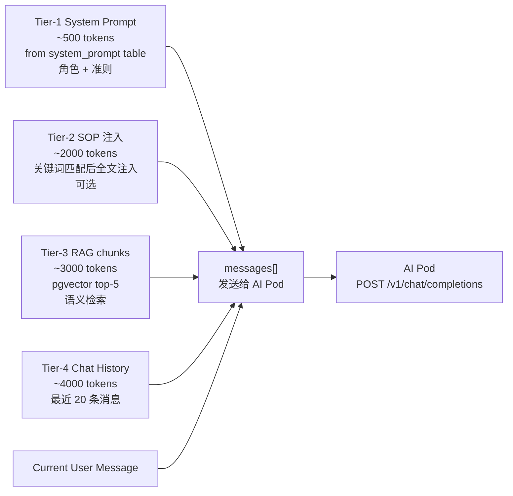

# Conversation Service — 设计文档

## 文档信息
- **版本**: 1.0
- **更新日期**: 2026-04-06
- **对应服务**: `backend/conversation-service/` · Port 8002
- **对应任务**: [`../../task/conversation/对话任务.md`](../../task/conversation/对话任务.md)
- **上级文档**: [`../架构设计.md`](../架构设计.md)

---

## 1. 职责边界

| 职责 | 说明 |
|------|------|
| 消息存储 | 四种角色消息（user/assistant/system/command）的落库 |
| 上下文组装 | 3-Tier Prompt Assembly（system + sop + rag + history + user） |
| AI 客户端抽象 | `AIAssistantClient` 协议 + 工厂，屏蔽多助手差异 |
| P4 ReAct 引擎 | S0-S6 诊断状态机，断点续接 |
| 流式响应 | SSE → WebSocket 透传，打字机效果 |
| 审计写入 | 每次 AI 调用写 `audit_log` + `tool_result` |

**不负责**：工单生命周期（Case Service）、Pod 调度（Scheduler Service）、知识库摄入（KB Service）。

---

## 2. 诊断阶段（diagnostic_stage）完整设计

> `conversation.diagnostic_stage` 是 AI 推理内核层的状态，与 `case.status` 正交独立，仅在特定节点同步。
> 详细状态机双图及服务层约束见 [`../架构设计.md §9`](../架构设计.md)。

### 2.1 各阶段职责

| 阶段 | 名称 | 职责 | 出口条件 |
|------|------|------|---------|
| **S0** | 意图识别 | 注入 198 分类列表，引导 LLM 确认 `category_id` | LLM 输出「已确认故障分类：{code}」|
| **S1** | 故障定位 | 以 `category_id` 路由 SOP/KBD，追问关键参数 | 故障上下文清晰，AI 宣告进入假设生成 |
| **S2** | 假设生成 | 生成 2-4 个根因假设 + 置信概率，写 `diagnostic_item` | 假设列表写入 DB |
| **S3** | 验证执行 | ReAct 循环：工具调用 + 结果观察；高危操作写 `pending_confirm` | 证据充分 |
| **S4** | 根因确认 | 输出「根因确认：」标记，写 `diagnostic_item(type=root_cause)` | 根因写入 DB |
| **S5** | 方案输出 | 制定解决方案；高危操作写 `pending_confirm` | 方案输出完成 |
| **S6** | 验证闭环 | 推送 A/B/C 三选项，写 `pending_resolution`，等待用户确认 | 用户明确选择 A/B/C |

### 2.2 状态流转图

```
[会话创建] → S0
S0 → S1  （LLM 输出「已确认故障分类：」，category_id 写入）
S1 → S2  （故障类型清晰，AI 内部判断）
S2 → S3  （假设列表下游写入 DB）
S3 → S4  （证据充分，AI 内部判断）
S3 ↔ S3  （pending_confirm 激活 → 用户确认后继续）
S4 → S5  （根因写入 DB）
S5 → S6  （方案输出完成）
S5 ↔ S5  （pending_confirm 激活 → 用户确认后继续）
S6 → [A] case=resolved，工单进终态
S6 → [B] stage=S1，旧 diagnostic_item 归档，重新诊断
S6 → [C] case=in_progress，AI 退出，转人工
```

### 2.3 与 case.status 的同步点

> 两个状态机**平时完全独立**，仅在以下 5 个节点进行状态同步。

| 同步点 | diagnostic_stage 变化 | case.status 变化 | 触发方 |
|--------|----------------------|----------------|--------|
| S0 分类确认完成 | S0 → S1 | created → confirmed | conversation-service |
| S6 用户选 A（已解决）| 保持 S6 | confirmed → resolved | conversation-service |
| S6 用户选 C（升级人工）| 保持 S6 | confirmed → in_progress | conversation-service |
| Pod 回收完成 | 不变 | resolved → closed | scheduler-service |
| 用户 /close 或超时 | 不变 | 任意 → cancelled | case-service |

---

## 3. S0 意图识别设计

> **背景**：`category_baseline.yaml` 包含 198 个 HCI 故障分类，是整个诊断链的枢纽。S0 的核心任务是让 LLM 在有约束的情况下将用户描述映射到唯一的 `category_id`，从而驱动后续 SOP 路由和 KB 检索。

### 3.1 Prompt 结构（4 段）

```
[Segment 1] 角色定义
你是 HCI 云平台故障诊断专家，负责识别并确认故障分类。

[Segment 2] 环境上下文（来自 conversation.metadata["context_info"]）
## 当前环境信息
{env_info}           ← aClient 采集的集群版本、节点配置等
## 最新告警
{alert_logs}         ← Prometheus/告警平台最新告警条目
## 近期任务日志
{task_logs}          ← 操作日志（最近 10 条）

[Segment 3] 198 分类列表（从 kb_category 表读取，按 domain 分组，约 3000 tokens）
## 故障分类（共 198 个，请从中选择最匹配的 1 个）
### 虚拟机域（54个）
- 虚拟机-001 虚拟机创建失败
- 虚拟机-003 虚拟机开机失败
...
### 网络域（23个） / 存储域（46个） / 硬件域（45个） / 平台域（30个）

[Segment 4] 输出格式约束
1. 先用自然语言解释判断依据（1-2 句）
2. 如需澄清，最多提 1 个问题
3. 有足够信息时，**必须**在末尾输出：
   「已确认故障分类：{code} {name}」
4. 确认分类之前，不做诊断推理，不引用 SOP
```

> **关键约束**：S0 阶段**不注入 SOP、不触发 KB 检索**。SOP 在类型未知时无法选择正确条目；KB 在 query 最模糊时召回质量最差。两者均在 S1+ 阶段由 `category_id` 驱动精准检索。

### 3.2 category_id 提取与阶段推进

```python
CATEGORY_PATTERN = re.compile(r'已确认故障分类：([\u4e00-\u9fa5]+-\d+)')

def extract_category_id(full_reply: str) -> str | None:
    """从 LLM 回复中提取故障分类 code（对应 kb_category.code）"""
    match = CATEGORY_PATTERN.search(full_reply)
    return match.group(1) if match else None

# conversation_manager.py：S0 退出处理
if category_id := extract_category_id(reply):
    conversation.category_id = category_id          # 写入分类 code
    conversation.category_l1 = get_domain(category_id)  # 写入一级域
    conversation.diagnostic_stage = "S1"            # 阶段推进
    await kb_client.post_hit_increment(category_id) # hit_count +1（热度统计）
    await case_service.confirm_case(case_id)         # case.status: created → confirmed
```

### 3.3 S1+ 三轨串行路由

S0 完成后，`category_id` 驱动 S1+ 的内容路由：

| 轨道 | 触发条件 | 检索方式 | 处理 |
|------|---------|---------|------|
| **第1轨 SOP 优先** | `sop_document.category_id = X` 且 `status=published` | 外键直接查询 | SOP 步骤引导 → 返回 |
| **第2轨 KBD 覆盖** | SOP 未命中 | BM25(tsv) + 向量 → RRF，带 `category_id` 过滤 | RAG context 注入 → 返回 |
| **第3轨 人工兜底** | KB 也未命中 | — | 生成升级工单，记录 `category_id` |

### 3.4 context_info 存储方案

用户环境信息需要在 S0 prompt 中注入，采用**双存储**：

```python
# 工单创建时同时写入两处
Case.metadata["context_info"]         # 长期归档（工单维度）
Conversation.metadata["context_info"] # Prompt 构建时直接读取（高频，避免跨服务调用）

class ContextInfo(TypedDict):
    env_info: str    # 集群版本、节点数量等环境描述
    alert_logs: str  # 告警日志文本
    task_logs: str   # 操作日志文本
```

### 3.5 异常处理

| 异常场景 | 处理方式 |
|---------|---------|
| LLM 不遵守格式约束，`category_id` 提取失败 | 保持 S0，下一轮追问时重新检测；超 3 轮未提取则前端提示用户手动选择分类 |
| `category_id` 在 `kb_category` 中不存在 | 记录告警日志，回退到关键字匹配兜底，不阻断流程 |
| context_info 为空（用户直接输入） | S0 prompt 省略 Segment 2，仅凭用户文字描述分类 |

---

## 4. S6 验证闭环设计

> S6 是诊断流程的收尾节点。AI 完成方案输出后**必须等待用户明确确认**，不能自行关闭工单。

### 4.1 S6 触发与 pending_resolution

```python
# S5 方案输出完成后，进入 S6
conversation.diagnostic_stage = "S6"
conversation.pending_resolution = {
    "stage": "S6",
    "sent_at": utcnow().isoformat(),
    "options": ["A", "B", "C"]
}
# 同时推送 SSE 消息到前端：
# "问题是否已解决？请选择：
#  A. 是，问题已解决
#  B. 否，还有新报错
#  C. 需要人工支持"
```

`pending_resolution` 的作用：用户断线重连时，conversation-service 读取此字段，**恢复等待状态**，重新向前端推送三选项提示。

### 4.2 三选项处理逻辑

**选 A（已解决）**：

```python
# 1. 清除等待状态
conversation.pending_resolution = None
# 2. 更新工单状态（并记录 SLA 指标）
case.status = "resolved"
case.resolved_at = utcnow()  # SLA: resolved_at - confirmed_at
# 3. Scheduler 异步回收 Pod → 回调 case.status = "closed"
```

**选 B（未解决 + 新报错）**：

```python
# 1. 清除等待状态
conversation.pending_resolution = None
# 2. 归档当前轮次所有诊断条目
await session.execute(
    update(DiagnosticItem)
    .where(DiagnosticItem.conversation_id == conversation_id,
           DiagnosticItem.status != "archived")
    .values(status="archived")
)
# 3. 阶段回退，重新诊断（case.status 不变，仍是 confirmed）
conversation.diagnostic_stage = "S1"
# 4. 推送 SSE：请描述新出现的错误信息
```

**选 C（升级人工）**：

```python
# 1. 清除等待状态
conversation.pending_resolution = None
# 2. 工单进入人工接管态
case.status = "in_progress"
case.close_reason = "escalated"
conversation.ended_at = utcnow()
# 3. AI 停止推理，Pod 释放
# 4. 推送 SSE：已记录转人工请求
```

### 4.3 约束

- **互斥**：`pending_confirm`（S3/S5 高危操作）和 `pending_resolution`（S6）不能同时非 NULL
- **幂等**：用户重复发送相同选项，服务层校验 `pending_resolution` 已为 NULL 时直接返回 200，不重复执行
- **超时**：S6 等待超过 `POD_IDLE_TIMEOUT` 未响应，触发 cancelled 流程

---

## 5. 数据流图

### 5.1 消息处理主流程



### 5.2 P4 ReAct 诊断引擎数据流



### 5.3 3-Tier Prompt 组装



---

## 6. 核心接口

```
# 内部接口（被 API Gateway 调用）
POST   /internal/chat                     处理对话消息（主接口）
POST   /internal/conversation/init        初始化 conversation（被 Case Service 调用）

# 外部接口（通过 Gateway 暴露）
GET    /api/conversations/{id}/messages   获取消息历史
POST   /api/conversations/{id}/evaluate   提交用户评分
```

---

## 7. 关键表

| 表 | 读写场景 |
|----|---------|
| `conversation` | 创建会话、更新 diagnostic_stage / react_state / pending_confirm |
| `message` | 高频读写（每轮对话 2~4 次）|
| `audit_log` | 每次 AI 调用后异步写入 |
| `tool_result` | ReAct 每次工具调用后写入 |
| `diagnostic_item` | S1 创建、S2 更新 confidence/status |
| `system_prompt` | 读取激活的 Prompt 模板（低频，可缓存）|

---

## 8. Session 规范

```python
# ✅ 正确：每次写操作使用独立 session
async with session_factory() as s:
    s.add(Message(**data))
    await s.commit()

# ❌ 禁止：在 SSE generator 内持有请求 session（导致长事务持锁）
```

---

## 9. 可观测性

| 指标 | 来源 |
|------|------|
| `chat_request_total{assistant_type}` | Counter，按助手类型统计 |
| `chat_latency_seconds{p50,p95,p99}` | Histogram，首 token 延迟 + 完整响应延迟 |
| `rag_hit_total{tier}` | Counter，RAG/SOP 各层命中次数 |
| `react_tool_call_total{tool_name,status}` | Counter，工具调用统计 |
| `diagnostic_stage_transitions_total{from,to}` | Counter，状态机转换统计 |
| 所有请求日志含 `trace_id` + `conversation_id` | 结构化 JSON → Loki |
