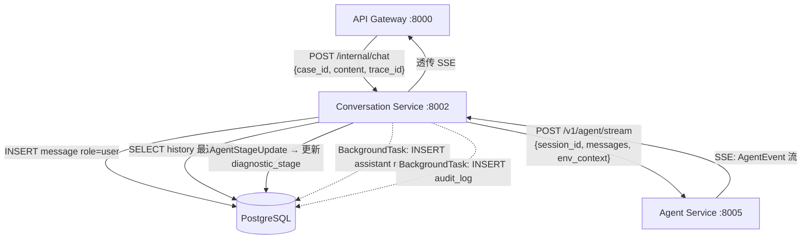
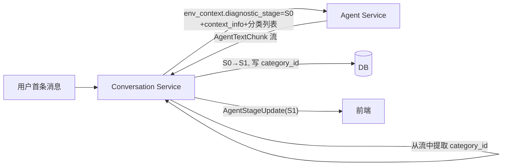
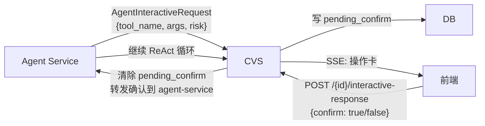
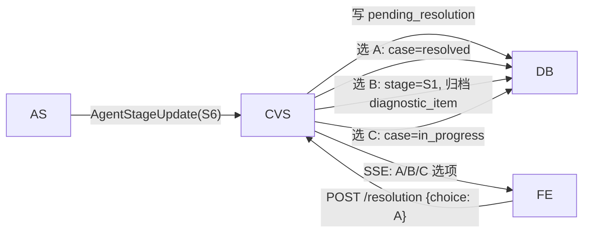
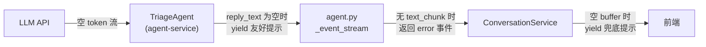

# Conversation Service — 设计文档

> **文档目的**：描述 conversation-service 的职责、诊断状态机、S0 意图识别、S6 闭环及与 agent-service 的交互协议。
> **关联文档**：[agent设计.md](../agent/agent设计.md) | [架构设计.md](../架构设计.md)

---

## 变更历史

| 日期 | 版本 | 变更摘要 |
|------|------|---------|
| 2026-07-27 | v3.30 | **HTP 人工升级确认本地闭环**：`human_escalation` 是 HTP `AgentEscalation` 生成的本地告知卡，`ack` 只记录会话确认，不再误转发为 ops-agent ACP response；真实 ops-agent `AgentInteractiveRequest` 保持原 ACP 回传路径 | [2026-07-27-KBD自动执行门禁与人工升级确认修复方案](../events/2026-07-27-KBD自动执行门禁与人工升级确认修复方案.md) |
| 2026-07-27 | v3.29 | **QFK 执行 timeout 透传（PR #622）**：`/internal/conversations/{id}/agent-exec` 增加 1–300 秒 timeout 契约，pending 生命周期按实际 timeout 加回传余量计算，并通过 SSE 传递给客户端执行链路。 |
| 2026-07-18 | v3.28 | **工具管理页 qkv/qfk 展示顺序固定（PR #573）**：`tool_definition.py` 列表接口 `GET /api/v1/tools` 的排序由 `(category, tool_name)` 改为 `CASE` 表达式——`qkv`/`qfk` 两类按指定业务顺序**置顶**：`qkv_alert`→`qkv_task`→`qkv_dialog`→`qfk_log`→`qfk_service`→`qfk_system`→`qfk_vm`→`qfk_network`→`qfk_storage`→`qfk_hardware`→`qfk_platform`；其余分类保持原 `(category, tool_name)` 顺序不变。不改表结构、不改种子内容；按 `category` 过滤时同样遵循该顺序 | — |
| 2026-06-17 | v3.27 | **ReAct 工具调用历史跨轮次持久化（PR #472）**：① 新增 `POST /api/conversations/{id}/tool-turn` 内部接口接收 agent-service 工具调用持久化请求；② `Message` ORM 增加 `tool_call_id` 列，`MessageRole` 增加 `tool_call`/`tool_result` 角色；③ `history_messages` 构建逻辑重写：加载工具消息并还原为 OpenAI messages 格式 + 滑动窗口压缩（最近 10 步完整 + 更早摘要化）；④ 用户点击「继续」后大模型收到完整 ReAct 历史上下文，不再重复已完成工具 | [../agent/events/2026-06-17-ReAct工具调用历史跨轮次持久化.md](../agent/events/2026-06-17-ReAct工具调用历史跨轮次持久化.md) |
| 2026-06-15 | v3.26 | **S0 拦截对话历史补齐（PR #471）**：在 `_intercept_s0_intent_selection` 中将产生的 Assistant 分类确认文案同步追加到 `history_messages`，让大模型知晓该阶段已被确认，避免重复寒暄输出触发 ReAct 引擎终止规则导致诊断流程停顿 |
| 2026-06-15 | v3.25 | **就绪探针优化与健康检查修复（PR #468）**：从就绪探针中剔除外部 AI 依赖健康检查，防止 DNS/网络超时导致 503 报错；修复 `/health` 诊断端点中对 `ai_status` 布尔值判断的比较逻辑 Bug |
| 2026-06-12 | v3.24 | **bash_exec host 契约同步（PR #450）**：工具定义保存/校验逻辑同步接受 `host/asv-con/vn-con/vn-agent/vs-cp-manager` 枚举；`host` 明确表示 HCI 物理机直接执行，保持 conversation-service 管理端工具契约与 agent-service 执行语义一致 |
| 2026-06-12 | v3.23 | **工具定义契约校验（PR-A）**：`tool_definition.py` 新增 `POST /api/v1/tools/validate` 与 `POST /api/v1/tools/{tool_id}/validate`，保存工具定义前强制调用统一校验逻辑，阻断 `bash_exec` 缺少必填 `container`、container enum 不完整、`usage_template` 占位符未声明等 error 级问题 |
| 2026-06-10 | v3.21 | **诊断阶段环境上下文获取扩展（PR #430）**：`conversation_service.py` 环境上下文获取阶段从仅 S0 扩展到 S0-S4 全诊断阶段，日志事件名改为通用 `env_context_info_loaded`；配合 `evidence_builder.py` FactStore 历史事实检查，解决诊断分析阶段（S1-S4）环境数据丢失问题 |
| 2026-06-11 | v3.22 | **命令执行结果 stdout/stderr 分离回传（PR #443）**：`agent_exec.py` 扩展 `ExecResultRequest` 支持 `stdout`/`stderr` 字段分离回传，在 Redis 通道中透传物理隔离的标准流输出，配合前端 `chat.ts` 流式缓冲区与 `terminal_bridge` 双通道执行机制 |
| 2026-06-06 | v3.19 | **SOP 布尔变量选项冲突修复（PR #406）**：`ConversationService.create_execution_variable_confirm` 回滚 Coercion 归一化逻辑，变量确认优先读取 `optionId` 键值，修正布尔选择场景下推荐值与实际提交值的映射问题 |
| 2026-06-06 | v3.20 | **工具定义路由日志规范化（PR #408）**：`tool_definition.py` 使用 `get_logger(__name__)` 替换 `logging.getLogger(__name__)`，与项目统一可观测性日志规范对齐，修复结构化日志调用导致 TypeError 的问题 |
| 2026-06-05 | v3.18 | **诊断链路 Trace 继承与传播修复（PR #400）**：`AgentClient` 请求注入 `traceparent` header 防止 Starlette 流式异步迭代器中 ContextVars trace 分叉；`ConversationService.create_conversation` 继承 Case 级别 trace_id，实现一案一链追踪 | — |
| 2026-06-05 | v3.17 | **Prompt 路由日志规范化（PR #399）**：`system_prompt.py` 改用 `get_logger("prompts-routes")` 替换 `logging.getLogger(__name__)`，与项目统一可观测性日志规范对齐 | — |
| 2026-06-05 | v3.16 | **ReactEngine execute 签名冲突与工具过滤修复（PR #396）**：在 `ReactEngine.execute()` 与 `_get_tools_for_llm` 中引入 `sop_mode: bool = False` 参数支持。解决 SOP 推理流拉起时抛出 `got an unexpected keyword argument 'sop_mode'` 的 Python 运行时异常，并实现在非 SOP 模式下过滤 SOP 导航工具以减少 token 消耗。 | — |
| 2026-06-05 | v3.15 | **审计日志落库静默丢弃修复（PR #395）**：conversation-service 启动 lifespan 首行注入 `configure_mappers()` 静态编译门禁，确保 `agent-service` 与 `conversation-service` 共享 ORM 模型元数据在启动时被完整注册，防止 AuditLog 写入时因外键引用未解析导致的静默丢弃问题（详见 [架构设计.md v9.3](../架构设计.md)） | — |
| 2026-06-05 | v3.14 | **SOP 环境变量自动注入（PR #394）**：`sop_create_execution` 响应新增 `context_variables` 字段，返回运行时变量池状态；`SopCreateResponse` 接口契约更新（前端 SOP 执行实例创建可获取已注入变量） | — |
| 2026-06-05 | v3.13 | **Skill 重构（PR #390）**：skill_definition 路由按 Agent Skills 开放标准重新设计：① 删除 `parameters_schema`/`output_schema`（Tool 概念，不属于 Skill）；② 新增 `instructions_md`（Markdown 正文知识包）；③ 列表接口不含正文（`_serialize_skill_list`），详情接口含正文（`_serialize_skill_detail`）；④ 新增发现接口 `GET /{id}/discovery`（仅返回 name+description，供 Agent 启动时 ~100 tokens 判断是否激活）；⑤ 新增 `category` 查询参数（按 metadata_json.category 过滤）；⑥ conversation-service 本地 ORM 与 shared 共享模型同步更新 | — |
| 2026-06-04 | v3.12 | SOP 环境注入变量语义过滤路由（PR #386）：① 新增语义关键字提取（基于分类 category_l1/category_l2 + SOP 标题派生中英文关键字）；② 告警/任务日志按关键字词频得分降序排序，过滤无关噪点，保留变量关联完整性；③ 完善 variable_schema 查询（sop_create_execution 获取完整 SopDocument）；④ 保留 fallback 降级策略（无匹配时回退首项）；⑤ 单元测试覆盖语义匹配、中文分词、词频排序及回退路径 |
| 2026-06-03 | v3.11 | SystemPrompt ORM 下沉（PR #385）：将 `SystemPrompt` 模型迁移到 `backend/shared/models/`，修改 `app/models/__init__.py` 导入路径重定向至 shared，配合 `audit.py` 显式依赖导入解决 SQLAlchemy 外键元数据编译异常，修复审计日志静默丢弃问题 |
| 2026-06-02 | v3.10 | S0 候选提取新增 options 反向解析：重构 `_extract_s0_candidates`，支持从落库的 `metadata.options` 列表中通过正则反向提取 code 与 name，过滤兜底项（以上都不是），解决单一候选分类因无圆圈数字导致正则失效从而陷入死循环的根本性 Bug（PR #384）|
| 2026-06-02 | v3.9 | 修复 `_get_last_assistant_message` 中 SQLAlchemy 保留字冲突：将 `MessageModel.metadata` 修正为 `MessageModel.metadata_`，解决 S0 候选确认阶段陷入意图分类死循环的根本性 Bug（PR #382）|
| 2026-06-01 | v3.8 | S0 候选提取机制升级：① 正则扩容支持多级分类前缀和括号等特殊字符；② 优先从 metadata 结构化提取候选列表，彻底根除正则依赖死循环（PR #381）|
| 2026-06-01 | v3.7 | 审计日志修复：补充 `_write_prompt_audit()` 调用，修复 prompt 级审计追踪失效问题（agent-service HTTP 调用路径遗漏审计写入）| [../agent/events/2026-06-01-HTP-Agent审计日志失效根因与修复方案.md](../agent/events/2026-06-01-HTP-Agent审计日志失效根因与修复方案.md) |
| 2026-05-31 | v3.6 | 结构化元数据渲染引擎（PR #372）：① 拦截 `intent_selection` 交互事件转换为消息 metadata（`kind: choice_options`）；② 新增 `\x00event:metadata:<json>\x00` SSE 事件块；③ 升级 `save_assistant_message` 支持 metadata 持久化；④ 前端废除正则解析，改为纯 metadata 驅动渲染；⑤ 解决多智能体交互机制撕裂问题 |
| 2026-05-31 | v3.5 | S0 意图识别升级为「4+1」交互模式：① Prompt 输出 4 个高置信度候选 + 1 个「以上都不是」虚拟选项；② 选项正则扩容支持①②③④⑤；③ 拦截 intent_selection 卡片落库/SSE 推送，由前端正则生成点击按钮，彻底消灭双气泡重复和刷新乱序 Bug（PR #370）|
| 2026-05-30 | v3.4 | 补全 user 消息的 metadata 持久化契约，重构前端分类卡片选项的交互方式（意图卡片确认点击 Bug 彻底消灭） |
| 2026-05-30 | v3.3 | 重构 `conversations.py` 流式消费：引入并发合并队列 `merge_queue` 彻底替换 `asyncio.wait_for` 0.1s 秒杀机制，消灭 AI 空白气泡根本性 Bug |
| 2026-05-29 | v3.2 | 修复 `get_conversation_service` 依赖注入 + 新增三层空响应兜底机制（PR #355）|
| 2026-05-26 | v3.1 | 新增 sop_execution 表、SopExecutionRepository、SopExecution API 端点（PR #333）|
| 2026-05-26 | v3.1 | 补全 diagnostic_item INSERT 路径（S2/S3/S4/S5）、JSONB 合并运算符修复 |
| 2026-05-23 | v3.0 | 全量重写：与 agent-service 架构对齐，移除旧 Brain/Pod 池引用，更新数据流图，补充语义阶段命名 |
| 2026-05-21 | v2.5 | 三项运行时路由修复：conversations.py `set_dependencies()` global 声明失效 / PAI agent key 不匹配 / 前端助手切换无效 |
| 2026-05-21 | v2.4 | 配置迁移至 dashscope网关，移除本地 Pod 池 |
| 2026-05-07 | v1.7 | P0-P3 质量修复（bigram 中文相似度、env_context 传递、diagnostic_stage 注入 Prompt 等）|

---

## 文档信息

- **对应服务**：`backend/conversation-service/` · Port 8002
- **上级文档**：[架构设计.md](../架构设计.md)

---

## 1. 职责边界

| 职责 | 说明 |
|------|------|
| 消息存储 | 四种角色消息（user/assistant/system/command）的落库 |
| 上下文组装 | 消息历史 + context_info 组装，传递给 agent-service |
| agent-service 调用 | 通过 AgentPort 协议发起 SSE 流请求，消费 AgentEvent |
| 状态机维护 | 维护 `diagnostic_stage`（S0-S6）状态转换，写 DB |
| 流式响应 | SSE 事件透传给前端，打字机效果 |
| 审计写入 | 每次 AI 调用写 `audit_log`，工具调用写 `tool_result` |

**不负责**：工单生命周期（Case Service）、Pod 调度（Scheduler Service）、知识库摄入（KB Service）、LLM 调用、工具执行（均在 agent-service 内）。

---

## 2. 诊断阶段（diagnostic_stage）

> `conversation.diagnostic_stage` 是 AI 推理的状态机，与 `case.status` 正交独立，仅在特定节点同步。

### 2.1 阶段划分

conversation-service 维护 S0-S6 常量；从行为角度看，S0-S6 对应 4 个语义阶段：

| 代码 | 语义阶段 | 中文名 | 本质行为 |
|------|---------|-------|---------|
| S0 | Triage（分诊）| 意图识别 | 将自然语言映射到 category_id（单轮 LLM）|
| S1-S4 | Investigation（调查）| 故障调查 | 多轮追问 + 工具执行 + 根因确认（ReAct）|
| S5 | Remediation（修复）| 方案输出 | 制定并执行修复步骤（ReAct + 强制确认）|
| S6 | Closure（闭环）| 验证闭环 | 等待用户确认结果（三选项）|

> **为什么 S1-S4 属于同一阶段**：agent-service 中所有阶段使用同一代码路径，`diagnostic_stage` 仅影响 Prompt 描述文字，没有代码分支差异。从行为上，S1-S4 都是"带工具的多轮推理"。

### 2.2 各阶段常量定义

```python
# backend/conversation-service/app/models/diagnostic_state.py

class DiagnosticStage:
    """诊断阶段常量（S0-S6）"""
    S0_INTENT       = "S0"        # Triage：意图识别
    S1_LOCATION     = "S1"        # Investigation：故障定位
    S2_HYPOTHESIS   = "S2"        # Investigation：假设生成
    S3_VERIFICATION = "S3"        # Investigation：验证执行
    S4_ROOT_CAUSE   = "S4"        # Investigation：根因确认
    S5_SOLUTION     = "S5"        # Remediation：解决方案
    S6_CLOSURE      = "S6"        # Closure：验证闭环
    S0_FAILED       = "S0_FAILED" # 内部标记，意图识别失败，不写入 DB

# UI 展示标签
STAGE_LABELS: dict[str, str] = {
    "S0": "S0-意图识别",
    "S1": "S1-故障定位",
    "S2": "S2-假设生成",
    "S3": "S3-验证执行",
    "S4": "S4-根因确认",
    "S5": "S5-解决方案",
    "S6": "S6-验证闭环",
    "S0_FAILED": "S0-意图识别失败",
}
```

**使用规范**：所有代码引用诊断阶段必须使用常量（`DiagnosticStage.S0_INTENT`），禁止硬编码字符串。

### 2.3 各阶段职责

| 阶段 | 职责 | 出口条件 |
|------|------|---------|
| **S0** | 注入 198 分类列表，引导 LLM 确认 `category_id` | LLM 输出「已确认故障分类：{code}」|
| **S1** | 以 `category_id` 路由 SOP/KBD，追问关键参数 | 故障上下文清晰，AI 宣告进入假设生成 |
| **S2** | 生成 2-4 个根因假设 + 置信概率，写 `diagnostic_item` | 假设列表写入 DB |
| **S3** | ReAct 循环：工具调用 + 结果观察；高危操作写 `pending_confirm` | 证据充分 |
| **S4** | 输出「根因确认：」标记，写 `diagnostic_item(type=root_cause)` | 根因写入 DB |
| **S5** | 制定解决方案；高危操作写 `pending_confirm` | 方案输出完成 |
| **S6** | 推送 A/B/C 三选项，写 `pending_resolution`，等待用户确认 | 用户明确选择 A/B/C |

### 2.4 状态流转

```
[会话创建] → S0
S0  → S1    （category_id 写入，case: created → confirmed）
S1  → S2    （故障类型清晰）
S2  → S3    （假设列表写 DB）
S3  → S4    （证据充分）
S3  ↔ S3    （pending_confirm 激活 → 用户确认后继续）
S4  → S5    （根因写 DB）
S5  → S6    （方案输出完成）
S5  ↔ S5    （pending_confirm 激活 → 用户确认后继续）
S6  → [A]   （case=resolved，工单进终态）
S6  → [B]   （stage=S1，旧 diagnostic_item 归档，重新诊断）
S6  → [C]   （case=in_progress，AI 退出，转人工）
```

### 2.5 与 case.status 的同步点

两个状态机**平时完全独立**，仅在以下 5 个节点同步：

| 同步点 | diagnostic_stage 变化 | case.status 变化 | 触发方 |
|--------|----------------------|----------------|--------|
| S0 分类确认完成 | S0 → S1 | created → confirmed | conversation-service |
| S6 用户选 A（已解决）| 保持 S6 | confirmed → resolved | conversation-service |
| S6 用户选 C（升级人工）| 保持 S6 | confirmed → in_progress | conversation-service |
| Pod 回收完成 | 不变 | resolved → closed | scheduler-service |
| 用户 /close 或超时 | 不变 | 任意 → cancelled | case-service |

---

## 3. S0 意图识别设计（Triage）

> **背景**：`category_baseline.yaml` 包含 198 个 HCI 故障分类，是整个诊断链的枢纽。S0 的核心任务是让 LLM 将用户描述映射到唯一的 `category_id`，驱动后续 SOP 路由和 KB 检索。

### 3.1 Prompt 结构（4 段）

```
[Segment 1] 角色定义
你是 HCI 云平台故障诊断专家，负责识别并确认故障分类。

[Segment 2] 环境上下文（来自 conversation.metadata["context_info"]）
## 当前环境信息
{env_info}           ← aClient 采集的集群版本、节点配置等
## 最新告警
{alert_logs}         ← Prometheus/告警平台最新告警条目
## 近期任务日志
{task_logs}          ← 操作日志（最近 10 条）

[Segment 3] 198 分类列表（从 kb_category 表读取，按 domain 分组，约 3000 tokens）
## 故障分类（共 198 个，请从中选择最匹配的 1 个）
### 虚拟机域（54个）
- 虚拟机-001 虚拟机创建失败
- 虚拟机-003 虚拟机开机失败
...
### 网络域（23个） / 存储域（46个） / 硬件域（45个） / 平台域（30个）

[Segment 4] 输出格式约束
1. 先用自然语言解释判断依据（1-2 句）
2. 如需澄清，最多提 1 个问题
3. 有足够信息时，**必须**在末尾输出：
   「已确认故障分类：{code} {name}」
4. 确认分类之前，不做诊断推理，不引用 SOP
```

> **关键约束**：S0 阶段**不注入 SOP、不触发 KB 检索**。  
> SOP 在类型未知时无法选择正确条目；KB 在 query 最模糊时召回质量最差。  
> 两者均在 S1+ 阶段由 `category_id` 驱动精准检索。

### 3.2 category_id 提取与阶段推进

```python
CATEGORY_PATTERN = re.compile(r'已确认故障分类：([\u4e00-\u9fa5]+-\d+)')

def extract_category_id(full_reply: str) -> str | None:
    match = CATEGORY_PATTERN.search(full_reply)
    return match.group(1) if match else None

# S0 退出处理（conversation_manager.py）
if category_id := extract_category_id(reply):
    conversation.category_id = category_id
    conversation.category_l1 = get_domain(category_id)
    conversation.diagnostic_stage = DiagnosticStage.S1_LOCATION
    await kb_client.post_hit_increment(category_id)   # hit_count +1 热度统计
    await case_service.confirm_case(case_id)           # case.status: created → confirmed
```

### 3.3 S1+ 三轨串行路由

S0 完成后，`category_id` 驱动 S1+ 的知识路由（由 agent-service 内部执行）：

| 轨道 | 触发条件 | 处理方式 |
|------|---------|---------|
| **第 1 轨 SOP 优先** | `sop_document.category_id = X` 且 `status=published` | SOP 步骤全文注入 Prompt |
| **第 2 轨 KBD 覆盖** | SOP 未命中 | BM25(tsv) + 向量 → RRF，带 category_id 过滤 |
| **第 3 轨 机制推理** | KB 也未命中 | 依赖模型训练知识，输出标注【机制推理】|

### 3.4 context_info 双存储

用户环境信息在 S0 Prompt 中注入，采用**双写**：

```python
# 工单创建时同时写入两处
Case.metadata["context_info"]          # 长期归档（工单维度）
Conversation.metadata["context_info"]  # S0 Prompt 构建时直接读取（高频）

class ContextInfo(TypedDict):
    env_info: str    # 集群版本、节点数量等环境描述
    alert_logs: str  # 告警日志文本
    task_logs: str   # 操作日志文本
```

### 3.5 异常处理

| 异常场景 | 处理方式 |
|---------|---------|
| `category_id` 提取失败（LLM 不遵守格式）| 保持 S0，下一轮重新检测；超 3 轮前端提示用户手动选择 |
| `category_id` 在 `kb_category` 中不存在 | 记录告警日志，回退关键字匹配兜底，不阻断流程 |
| context_info 为空（用户直接输入）| S0 Prompt 省略 Segment 2，仅凭用户文字描述分类 |

---

## 4. S6 验证闭环设计（Closure）

> S6 是诊断流程的收尾节点。AI 完成方案输出后**必须等待用户明确确认**，不能自行关闭工单。

### 4.1 pending_resolution

```python
# S5 方案输出完成后，进入 S6
conversation.diagnostic_stage = DiagnosticStage.S6_CLOSURE
conversation.pending_resolution = {
    "stage": "S6",
    "sent_at": utcnow().isoformat(),
    "options": ["A", "B", "C"],
}
# SSE 推送给前端：
# "问题是否已解决？请选择：
#  A. 是，问题已解决
#  B. 否，还有新报错
#  C. 需要人工支持"
```

`pending_resolution` 的作用：用户断线重连时，conversation-service 读取此字段，**恢复等待状态**，重新向前端推送三选项提示。

### 4.2 三选项处理逻辑

**选 A（已解决）**：
```python
conversation.pending_resolution = None
case.status = "resolved"
case.resolved_at = utcnow()    # SLA: resolved_at - confirmed_at
# Scheduler 异步回收资源 → case.status = "closed"
```

**选 B（未解决 + 新报错）**：
```python
conversation.pending_resolution = None
# 归档本轮所有诊断条目
await session.execute(
    update(DiagnosticItem)
    .where(DiagnosticItem.conversation_id == conversation_id,
           DiagnosticItem.status != "archived")
    .values(status="archived")
)
conversation.diagnostic_stage = DiagnosticStage.S1_LOCATION  # 重新诊断
# case.status 不变，仍是 confirmed
```

**选 C（升级人工）**：
```python
conversation.pending_resolution = None
case.status = "in_progress"
case.close_reason = "escalated"
conversation.ended_at = utcnow()
# AI 停止推理
```

### 4.3 约束

- **互斥**：`pending_confirm`（S3/S5 高危操作）和 `pending_resolution`（S6）不能同时非 NULL
- **幂等**：用户重复发送相同选项，校验 `pending_resolution` 已为 NULL 时直接返回 200
- **超时**：S6 等待超过 `POD_IDLE_TIMEOUT` 未响应，触发 cancelled 流程

---

## 5. 与 agent-service 的交互

### 5.1 调用协议

conversation-service 通过 HTTP POST + SSE 流调用 agent-service：

```
POST /v1/agent/stream
Content-Type: application/json

{
  "session_id": "conv-uuid",
  "assistant_type": "htp-agent",          ← AgentRouter 路由依据
  "messages": [...],                       ← 消息历史（最近 20 条）
  "env_context": {                         ← 环境上下文（S0 阶段重要）
    "diagnostic_stage": "S0",
    "category_id": null,
    "context_info": { ... }
  }
}

→ SSE 流响应（每行 data: {AgentEvent JSON}）
```

### 5.2 AgentEvent 处理

conversation-service 消费 agent-service 的 SSE 流，并透传给前端：

| 事件类型 | conversation-service 处理 | 前端处理 |
|---------|--------------------------|---------|
| `AgentTextChunk` | 拼接 buffer，透传给前端 | 打字机效果 |
| `AgentStageUpdate` | 更新 `conversation.diagnostic_stage`，写 DB | 进度指示器 |
| `AgentEscalation` | 创建升级工单，设 case.close_reason | 弹出升级提示 |
| `AgentInteractiveRequest` | 写 `pending_confirm` 或透传 | 渲染操作卡，等待输入 |

### 5.3 助手路由

`assistant_type` 决定 agent-service 内部路由到哪个 Agent 实现：

| assistant_type | 路由目标 | 说明 |
|---------------|---------|------|
| `htp-agent` | HTPAgentAdapter | 手写 ReAct，GLM-5 |
| `ops-agent` | OpsAgentAdapter | ACP 协议，外部 ops-agent 服务 |
| `pai-agent` | PaiAgentAdapter | pydantic-ai，实验性 |

`_resolve_assistant_type()` 优先使用用户当前选择（`selectedAssistant`），兜底使用注册表默认值（`htp-agent`）。

---

## 6. 数据流图

### 6.1 消息处理主流程


```mermaid
flowchart TD
    GW["API Gateway :8000"] -->|"POST /internal/chat\n{case_id, content, trace_id}"| CVS["Conversation Service :8002"]

    CVS -->|"INSERT message role=user"| DB[(PostgreSQL)]
    CVS -->|"SELECT history 最近20条"| DB

    CVS -->|"POST /v1/agent/stream\n{session_id, messages, env_context}"| AS["Agent Service :8005"]

    AS -->|"SSE: AgentEvent 流"| CVS

    CVS -->|"AgentStageUpdate → 更新 diagnostic_stage"| DB
    CVS -->|"透传 SSE"| GW

    CVS -.->|"BackgroundTask: INSERT assistant message"| DB
    CVS -.->|"BackgroundTask: INSERT audit_log"| DB
```

> **注意**：Prompt 组装（三轨路由、SOP/KBD 检索）现在在 agent-service 内部完成，不再由 conversation-service 执行。conversation-service 只组装消息历史 + env_context。

### 6.2 S0 意图识别流程


```mermaid
flowchart LR
    U[用户首条消息] --> CVS[Conversation Service]
    CVS -->|"env_context.diagnostic_stage=S0\n+context_info+分类列表"| AS[Agent Service]
    AS -->|"AgentTextChunk 流"| CVS
    CVS -->|"从流中提取 category_id"| CVS
    CVS -->|"S0→S1, 写 category_id"| DB[(DB)]
    CVS -->|"AgentStageUpdate(S1)"| FE[前端]
```

### 6.3 S3/S5 高危确认流程


```mermaid
flowchart LR
    AS[Agent Service] -->|"AgentInteractiveRequest\n{tool_name, args, risk}"| CVS
    CVS -->|"写 pending_confirm"| DB
    CVS -->|"SSE: 操作卡"| FE[前端]
    FE -->|"POST /{id}/interactive-response\n{confirm: true/false}"| CVS
    CVS -->|"清除 pending_confirm\n转发确认到 agent-service"| AS
    AS -->|"继续 ReAct 循环"| CVS
```

### 6.4 S6 闭环流程


```mermaid
flowchart LR
    AS -->|"AgentStageUpdate(S6)"| CVS
    CVS -->|"写 pending_resolution"| DB
    CVS -->|"SSE: A/B/C 选项"| FE
    FE -->|"POST /resolution {choice: A}"| CVS
    CVS -->|"选 A: case=resolved"| DB
    CVS -->|"选 B: stage=S1, 归档 diagnostic_item"| DB
    CVS -->|"选 C: case=in_progress"| DB
```

---

## 7. 核心接口

```
# 内部接口（被 API Gateway 调用）
POST   /internal/chat                       处理对话消息（主接口）
POST   /internal/conversation/init          初始化 conversation（被 Case Service 调用）
POST   /{id}/interactive-response           提交交互响应（SOP 操作卡确认）
POST   /api/v1/tools/validate               校验工具定义草案（含 bash_exec container enum）
POST   /api/v1/tools/{tool_id}/validate     校验已存在工具定义

# 外部接口（通过 Gateway 暴露）
GET    /api/conversations/{id}/messages     获取消息历史
POST   /api/conversations/{id}/evaluate     提交用户评分
```

---

## 8. 关键表

| 表 | 读写场景 |
|----|---------|
| `conversation` | 创建会话、更新 diagnostic_stage / pending_confirm / pending_resolution |
| `message` | 高频读写（每轮对话 2-4 次）|
| `audit_log` | 每次 AI 调用后异步写入（100% 采样）|
| `tool_result` | ReAct 每次工具调用后写入 |
| `diagnostic_item` | S2 创建、S3 更新 confidence/status、S6-B 归档 |

**工具定义契约约束**：

`bash_exec` 的 `parameters_schema.properties.container.enum` 必须精确等于 `host/asv-con/vn-con/vn-agent/vs-cp-manager`。其中 `host` 表示在 HCI 物理机直接执行；其他值表示由 agent-service 在远端生成容器执行 wrapper。conversation-service 只负责管理端保存前契约校验，不负责拼装或执行命令。

---

## 9. Session 规范

```python
# ✅ 正确：每次写操作使用独立 session
async with session_factory() as s:
    s.add(Message(**data))
    await s.commit()

# ❌ 禁止：在 SSE generator 内持有请求 session（导致长事务持锁）
```

---

## 10. 可观测性

| 指标 | 类型 | 说明 |
|------|------|------|
| `chat_request_total{assistant_type}` | Counter | 按助手类型统计请求量 |
| `chat_latency_seconds{p50,p95,p99}` | Histogram | 首 token 延迟 + 完整响应延迟 |
| `rag_hit_total{tier}` | Counter | 三轨知识路由命中次数 |
| `react_tool_call_total{tool_name,status}` | Counter | 工具调用统计 |
| `diagnostic_stage_transitions_total{from,to}` | Counter | 状态机转换统计 |

所有请求日志包含 `trace_id` + `conversation_id`（结构化 JSON → Loki）。

### 10.1 Prompt 审计机制

每次 AI 调用前，conversation-service 写入 `audit_log` 表：

| 字段 | 内容 |
|------|------|
| `audit_type` | `"prompt"` |
| `payload.messages` | 完整 messages 数组（含 system prompt）|
| `payload.has_sop` | SOP 命中标记 |
| `payload.kb_chunks_count` | KB 注入 chunk 数 |
| `payload.total_chars` | Prompt 总字符数 |

**采样策略**：100% 采集（便于 Grafana Dashboard 审计 Agent 收到的完整上下文）。

**关键区别**：
- `message` 表：仅存用户和 AI 对话（展示到 UI）
- `audit_log.payload.messages`：Agent 收到的完整上下文（含 system prompt 等）

详见 [Prompt审计机制.md](../observability/Prompt审计机制.md)。

---

## 11. 空响应兜底机制

> **背景**：当 LLM API 返回空响应时（如网络超时、模型内部错误、空 token 流），前端会渲染完全空白的消息气泡，严重影响用户体验。需要在三层调用链增加兜底检测。

### 11.1 三层兜底架构


```mermaid
flowchart LR
    LLM["LLM API"] -->|"空 token 流"| TA["TriageAgent\n(agent-service)"]
    TA -->|"reply_text 为空时\nyield 友好提示"| AS["agent.py\n_event_stream"]
    AS -->|"无 text_chunk 时\n返回 error 事件"| CS["ConversationService"]
    CS -->|"空 buffer 时\nyield 兜底提示"| FE["前端"]
```

### 11.2 各层职责

| 层级 | 文件 | 检测逻辑 | 兜底行为 |
|------|------|---------|---------|
| **L1：Agent 层** | `triage_agent.py` | LLM 流结束后 `reply_text.strip() == ""` | yield "抱歉，我暂时无法生成回复，请稍后重试或手动描述问题。" |
| **L2：路由层** | `agent.py` `_event_stream` | `_has_text_chunk == False` | 在 `done` 前返回 `AgentEvent(type="error", message="推理无输出")` |
| **L3：Service 层** | `conversation_service.py` | `_full_reply_buffer == ""` 且 `_agent_had_error == False` | yield "AI 助手未返回有效内容，请重新提问或联系技术支持。" |

### 11.3 去重机制

- `_agent_had_error` 标记：L2 已返回 error 事件时，L3 不再重复兜底
- 确保用户只会看到一条提示，避免多个气泡重复显示

### 11.4 设计原则

1. **上游优先**：尽量在 Agent 层（L1）生成友好提示，避免触发下层兜底
2. **防御冗余**：三层检测形成冗余，即使某一层漏检，下层也能捕获
3. **用户友好**：兜底提示明确告知用户问题原因和建议操作，而非空白气泡

---

## 12. 路由流式并发合并队列重构（v3.3）

> **背景**：在 `conversations.py` 的路由中，为支持同时从 `ai_stream` 读取文本 Token 和从 `external_event_queue` 读取高危工具确认等外部事件，旧逻辑采用了在 `while True` 中利用 `asyncio.wait_for(..., timeout=0.1)` 轮询迭代器的方法。由于 100ms 远小于 LLM 首字延迟，每次轮询都会强行 Cancel 掉 AI 的网络调用，直接导致异步生成器损坏终止，返回干净的空 DONE 并渲染出空白气泡。

### 12.1 生产者-消费者合并队列架构

为了消除 Busy-loop 轮询和超时 Cancel 风险，v3.3 重构为经典的**生产者-消费者模型**：

```
[ai_stream] -----------> (ai_producer) ---------> [ merge_queue ] <--- (await merge_queue.get()) <--- [主消费循环]
[external_queue] ------> (external_producer) ---> [ asyncio.Queue ]
```

### 12.2 并发执行与回收机制

1. **ai_producer 任务**：通过 `asyncio.create_task` 独立运行于后台，不受任何外层 timeout 干扰，从首 token 到 DONE 全量写入合并队列。
2. **external_producer 任务**：监听 `external_event_queue`，将外部事件透传给合并队列。
3. **主消费循环**：调用 `await merge_queue.get()` 非阻塞挂起，零 CPU 占用，且首个 token 只要吐出就会瞬间在微秒级传达给前端。
4. **Task 回收安全保障**：在 `finally` 阶段，主动对两个后台任务调用 `cancel()`，并通过 `await asyncio.gather(..., return_exceptions=True)` 等待其完全回收，确保 100% 杜绝悬空协程和内存泄露。

---

## 13. KBD 证据不足的人工升级可见契约（2026-07-26）

conversation-service 必须把 Agent 的 `AgentEscalation` 转换为可持久化、可由前端交互的 `human_escalation` 事件，不得过滤或仅记录日志。分类无知识、KBD 不可执行、结论为 `PARTIAL/INCONCLUSIVE/NO_MATCH` 时均使用该契约；只有 Conclusion Gate 为 `DEFINITIVE` 时诊断流程才进入 S4。

### 13.1 事件来源决定确认路由（2026-07-27）

`human_escalation` 与 ops-agent ACP 交互的 UI 外观都可以是“确认卡”，但协议来源不同，不能按卡片外观走同一回传接口：

| 事件 | 来源 | request/session 的语义 | 提交处理 |
|---|---|---|---|
| `human_escalation` | HTP `AgentEscalation` | 会话服务为前端生成的本地关联 ID | 只接受 `ack`，记录会话消息和确认日志；不调用 AgentClient/ops-agent |
| `sop_step` / `info_request` 等 ACP 交互 | ops-agent `AgentInteractiveRequest` | ops-agent 实际创建的 ACP request/session | 转发 `submit_response`，随后可恢复 ops-agent 事件流 |
| `tool_confirm` | HTP ReAct 授权链路 | `request_id` 是工具执行 ID | 审计、hash 校验后调用 react-confirm |

任何本地事件均不得伪造为 ACP 请求；否则 ops-agent 对不存在的 request 返回 404 是正确的协议行为，但用户会被错误表现为 503。
