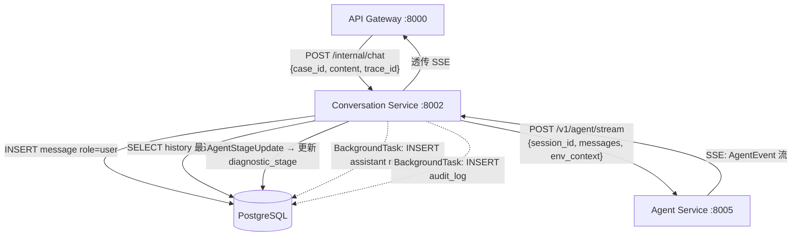
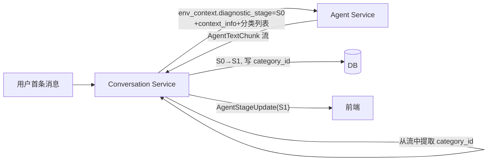
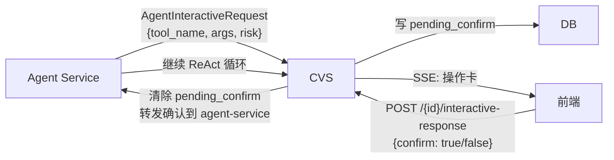
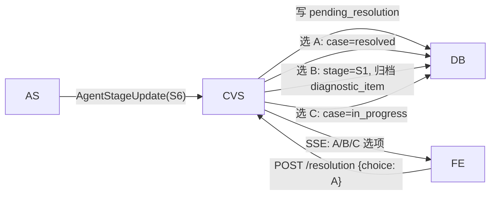

# Conversation Service — 设计文档

> **文档目的**：描述 conversation-service 的职责、诊断状态机、S0 意图识别、S6 闭环及与 agent-service 的交互协议。  
> **关联文档**：[agent设计.md](../agent/agent设计.md) | [架构设计.md](../架构设计.md)

---

## 变更历史

| 日期 | 版本 | 变更摘要 |
|------|------|---------|
| 2026-05-26 | v3.1 | 新增 sop_execution 表、SopExecutionRepository、SopExecution API 端点（PR #333）|
| 2026-05-26 | v3.1 | 补全 diagnostic_item INSERT 路径（S2/S3/S4/S5）、JSONB 合并运算符修复 |
| 2026-05-23 | v3.0 | 全量重写：与 agent-service 架构对齐，移除旧 Brain/Pod 池引用，更新数据流图，补充语义阶段命名 |
| 2026-05-21 | v2.5 | 三项运行时路由修复：conversations.py `set_dependencies()` global 声明失效 / PAI agent key 不匹配 / 前端助手切换无效 |
| 2026-05-21 | v2.4 | 配置迁移至 dashscope 网关，移除本地 Pod 池 |
| 2026-05-07 | v1.7 | P0-P3 质量修复（bigram 中文相似度、env_context 传递、diagnostic_stage 注入 Prompt 等）|

---

## 文档信息

- **对应服务**：`backend/conversation-service/` · Port 8002
- **上级文档**：[架构设计.md](../架构设计.md)

---

## 1. 职责边界

| 职责 | 说明 |
|------|------|
| 消息存储 | 四种角色消息（user/assistant/system/command）的落库 |
| 上下文组装 | 消息历史 + context_info 组装，传递给 agent-service |
| agent-service 调用 | 通过 AgentPort 协议发起 SSE 流请求，消费 AgentEvent |
| 状态机维护 | 维护 `diagnostic_stage`（S0-S6）状态转换，写 DB |
| 流式响应 | SSE 事件透传给前端，打字机效果 |
| 审计写入 | 每次 AI 调用写 `audit_log`，工具调用写 `tool_result` |

**不负责**：工单生命周期（Case Service）、Pod 调度（Scheduler Service）、知识库摄入（KB Service）、LLM 调用、工具执行（均在 agent-service 内）。

---

## 2. 诊断阶段（diagnostic_stage）

> `conversation.diagnostic_stage` 是 AI 推理的状态机，与 `case.status` 正交独立，仅在特定节点同步。

### 2.1 阶段划分

conversation-service 维护 S0-S6 常量；从行为角度看，S0-S6 对应 4 个语义阶段：

| 代码 | 语义阶段 | 中文名 | 本质行为 |
|------|---------|-------|---------|
| S0 | Triage（分诊）| 意图识别 | 将自然语言映射到 category_id（单轮 LLM）|
| S1-S4 | Investigation（调查）| 故障调查 | 多轮追问 + 工具执行 + 根因确认（ReAct）|
| S5 | Remediation（修复）| 方案输出 | 制定并执行修复步骤（ReAct + 强制确认）|
| S6 | Closure（闭环）| 验证闭环 | 等待用户确认结果（三选项）|

> **为什么 S1-S4 属于同一阶段**：agent-service 中所有阶段使用同一代码路径，`diagnostic_stage` 仅影响 Prompt 描述文字，没有代码分支差异。从行为上，S1-S4 都是"带工具的多轮推理"。

### 2.2 各阶段常量定义

```python
# backend/conversation-service/app/models/diagnostic_state.py

class DiagnosticStage:
    """诊断阶段常量（S0-S6）"""
    S0_INTENT       = "S0"        # Triage：意图识别
    S1_LOCATION     = "S1"        # Investigation：故障定位
    S2_HYPOTHESIS   = "S2"        # Investigation：假设生成
    S3_VERIFICATION = "S3"        # Investigation：验证执行
    S4_ROOT_CAUSE   = "S4"        # Investigation：根因确认
    S5_SOLUTION     = "S5"        # Remediation：解决方案
    S6_CLOSURE      = "S6"        # Closure：验证闭环
    S0_FAILED       = "S0_FAILED" # 内部标记，意图识别失败，不写入 DB

# UI 展示标签
STAGE_LABELS: dict[str, str] = {
    "S0": "S0-意图识别",
    "S1": "S1-故障定位",
    "S2": "S2-假设生成",
    "S3": "S3-验证执行",
    "S4": "S4-根因确认",
    "S5": "S5-解决方案",
    "S6": "S6-验证闭环",
    "S0_FAILED": "S0-意图识别失败",
}
```

**使用规范**：所有代码引用诊断阶段必须使用常量（`DiagnosticStage.S0_INTENT`），禁止硬编码字符串。

### 2.3 各阶段职责

| 阶段 | 职责 | 出口条件 |
|------|------|---------|
| **S0** | 注入 198 分类列表，引导 LLM 确认 `category_id` | LLM 输出「已确认故障分类：{code}」|
| **S1** | 以 `category_id` 路由 SOP/KBD，追问关键参数 | 故障上下文清晰，AI 宣告进入假设生成 |
| **S2** | 生成 2-4 个根因假设 + 置信概率，写 `diagnostic_item` | 假设列表写入 DB |
| **S3** | ReAct 循环：工具调用 + 结果观察；高危操作写 `pending_confirm` | 证据充分 |
| **S4** | 输出「根因确认：」标记，写 `diagnostic_item(type=root_cause)` | 根因写入 DB |
| **S5** | 制定解决方案；高危操作写 `pending_confirm` | 方案输出完成 |
| **S6** | 推送 A/B/C 三选项，写 `pending_resolution`，等待用户确认 | 用户明确选择 A/B/C |

### 2.4 状态流转

```
[会话创建] → S0
S0  → S1    （category_id 写入，case: created → confirmed）
S1  → S2    （故障类型清晰）
S2  → S3    （假设列表写 DB）
S3  → S4    （证据充分）
S3  ↔ S3    （pending_confirm 激活 → 用户确认后继续）
S4  → S5    （根因写 DB）
S5  → S6    （方案输出完成）
S5  ↔ S5    （pending_confirm 激活 → 用户确认后继续）
S6  → [A]   （case=resolved，工单进终态）
S6  → [B]   （stage=S1，旧 diagnostic_item 归档，重新诊断）
S6  → [C]   （case=in_progress，AI 退出，转人工）
```

### 2.5 与 case.status 的同步点

两个状态机**平时完全独立**，仅在以下 5 个节点同步：

| 同步点 | diagnostic_stage 变化 | case.status 变化 | 触发方 |
|--------|----------------------|----------------|--------|
| S0 分类确认完成 | S0 → S1 | created → confirmed | conversation-service |
| S6 用户选 A（已解决）| 保持 S6 | confirmed → resolved | conversation-service |
| S6 用户选 C（升级人工）| 保持 S6 | confirmed → in_progress | conversation-service |
| Pod 回收完成 | 不变 | resolved → closed | scheduler-service |
| 用户 /close 或超时 | 不变 | 任意 → cancelled | case-service |

---

## 3. S0 意图识别设计（Triage）

> **背景**：`category_baseline.yaml` 包含 198 个 HCI 故障分类，是整个诊断链的枢纽。S0 的核心任务是让 LLM 将用户描述映射到唯一的 `category_id`，驱动后续 SOP 路由和 KB 检索。

### 3.1 Prompt 结构（4 段）

```
[Segment 1] 角色定义
你是 HCI 云平台故障诊断专家，负责识别并确认故障分类。

[Segment 2] 环境上下文（来自 conversation.metadata["context_info"]）
## 当前环境信息
{env_info}           ← aClient 采集的集群版本、节点配置等
## 最新告警
{alert_logs}         ← Prometheus/告警平台最新告警条目
## 近期任务日志
{task_logs}          ← 操作日志（最近 10 条）

[Segment 3] 198 分类列表（从 kb_category 表读取，按 domain 分组，约 3000 tokens）
## 故障分类（共 198 个，请从中选择最匹配的 1 个）
### 虚拟机域（54个）
- 虚拟机-001 虚拟机创建失败
- 虚拟机-003 虚拟机开机失败
...
### 网络域（23个） / 存储域（46个） / 硬件域（45个） / 平台域（30个）

[Segment 4] 输出格式约束
1. 先用自然语言解释判断依据（1-2 句）
2. 如需澄清，最多提 1 个问题
3. 有足够信息时，**必须**在末尾输出：
   「已确认故障分类：{code} {name}」
4. 确认分类之前，不做诊断推理，不引用 SOP
```

> **关键约束**：S0 阶段**不注入 SOP、不触发 KB 检索**。  
> SOP 在类型未知时无法选择正确条目；KB 在 query 最模糊时召回质量最差。  
> 两者均在 S1+ 阶段由 `category_id` 驱动精准检索。

### 3.2 category_id 提取与阶段推进

```python
CATEGORY_PATTERN = re.compile(r'已确认故障分类：([\u4e00-\u9fa5]+-\d+)')

def extract_category_id(full_reply: str) -> str | None:
    match = CATEGORY_PATTERN.search(full_reply)
    return match.group(1) if match else None

# S0 退出处理（conversation_manager.py）
if category_id := extract_category_id(reply):
    conversation.category_id = category_id
    conversation.category_l1 = get_domain(category_id)
    conversation.diagnostic_stage = DiagnosticStage.S1_LOCATION
    await kb_client.post_hit_increment(category_id)   # hit_count +1 热度统计
    await case_service.confirm_case(case_id)           # case.status: created → confirmed
```

### 3.3 S1+ 三轨串行路由

S0 完成后，`category_id` 驱动 S1+ 的知识路由（由 agent-service 内部执行）：

| 轨道 | 触发条件 | 处理方式 |
|------|---------|---------|
| **第 1 轨 SOP 优先** | `sop_document.category_id = X` 且 `status=published` | SOP 步骤全文注入 Prompt |
| **第 2 轨 KBD 覆盖** | SOP 未命中 | BM25(tsv) + 向量 → RRF，带 category_id 过滤 |
| **第 3 轨 机制推理** | KB 也未命中 | 依赖模型训练知识，输出标注【机制推理】|

### 3.4 context_info 双存储

用户环境信息在 S0 Prompt 中注入，采用**双写**：

```python
# 工单创建时同时写入两处
Case.metadata["context_info"]          # 长期归档（工单维度）
Conversation.metadata["context_info"]  # S0 Prompt 构建时直接读取（高频）

class ContextInfo(TypedDict):
    env_info: str    # 集群版本、节点数量等环境描述
    alert_logs: str  # 告警日志文本
    task_logs: str   # 操作日志文本
```

### 3.5 异常处理

| 异常场景 | 处理方式 |
|---------|---------|
| `category_id` 提取失败（LLM 不遵守格式）| 保持 S0，下一轮重新检测；超 3 轮前端提示用户手动选择 |
| `category_id` 在 `kb_category` 中不存在 | 记录告警日志，回退关键字匹配兜底，不阻断流程 |
| context_info 为空（用户直接输入）| S0 Prompt 省略 Segment 2，仅凭用户文字描述分类 |

---

## 4. S6 验证闭环设计（Closure）

> S6 是诊断流程的收尾节点。AI 完成方案输出后**必须等待用户明确确认**，不能自行关闭工单。

### 4.1 pending_resolution

```python
# S5 方案输出完成后，进入 S6
conversation.diagnostic_stage = DiagnosticStage.S6_CLOSURE
conversation.pending_resolution = {
    "stage": "S6",
    "sent_at": utcnow().isoformat(),
    "options": ["A", "B", "C"],
}
# SSE 推送给前端：
# "问题是否已解决？请选择：
#  A. 是，问题已解决
#  B. 否，还有新报错
#  C. 需要人工支持"
```

`pending_resolution` 的作用：用户断线重连时，conversation-service 读取此字段，**恢复等待状态**，重新向前端推送三选项提示。

### 4.2 三选项处理逻辑

**选 A（已解决）**：
```python
conversation.pending_resolution = None
case.status = "resolved"
case.resolved_at = utcnow()    # SLA: resolved_at - confirmed_at
# Scheduler 异步回收资源 → case.status = "closed"
```

**选 B（未解决 + 新报错）**：
```python
conversation.pending_resolution = None
# 归档本轮所有诊断条目
await session.execute(
    update(DiagnosticItem)
    .where(DiagnosticItem.conversation_id == conversation_id,
           DiagnosticItem.status != "archived")
    .values(status="archived")
)
conversation.diagnostic_stage = DiagnosticStage.S1_LOCATION  # 重新诊断
# case.status 不变，仍是 confirmed
```

**选 C（升级人工）**：
```python
conversation.pending_resolution = None
case.status = "in_progress"
case.close_reason = "escalated"
conversation.ended_at = utcnow()
# AI 停止推理
```

### 4.3 约束

- **互斥**：`pending_confirm`（S3/S5 高危操作）和 `pending_resolution`（S6）不能同时非 NULL
- **幂等**：用户重复发送相同选项，校验 `pending_resolution` 已为 NULL 时直接返回 200
- **超时**：S6 等待超过 `POD_IDLE_TIMEOUT` 未响应，触发 cancelled 流程

---

## 5. 与 agent-service 的交互

### 5.1 调用协议

conversation-service 通过 HTTP POST + SSE 流调用 agent-service：

```
POST /v1/agent/stream
Content-Type: application/json

{
  "session_id": "conv-uuid",
  "assistant_type": "htp-agent",          ← AgentRouter 路由依据
  "messages": [...],                       ← 消息历史（最近 20 条）
  "env_context": {                         ← 环境上下文（S0 阶段重要）
    "diagnostic_stage": "S0",
    "category_id": null,
    "context_info": { ... }
  }
}

→ SSE 流响应（每行 data: {AgentEvent JSON}）
```

### 5.2 AgentEvent 处理

conversation-service 消费 agent-service 的 SSE 流，并透传给前端：

| 事件类型 | conversation-service 处理 | 前端处理 |
|---------|--------------------------|---------|
| `AgentTextChunk` | 拼接 buffer，透传给前端 | 打字机效果 |
| `AgentStageUpdate` | 更新 `conversation.diagnostic_stage`，写 DB | 进度指示器 |
| `AgentEscalation` | 创建升级工单，设 case.close_reason | 弹出升级提示 |
| `AgentInteractiveRequest` | 写 `pending_confirm` 或透传 | 渲染操作卡，等待输入 |

### 5.3 助手路由

`assistant_type` 决定 agent-service 内部路由到哪个 Agent 实现：

| assistant_type | 路由目标 | 说明 |
|---------------|---------|------|
| `htp-agent` | HTPAgentAdapter | 手写 ReAct，GLM-5 |
| `ops-agent` | OpsAgentAdapter | ACP 协议，外部 ops-agent 服务 |
| `pai-agent` | PaiAgentAdapter | pydantic-ai，实验性 |

`_resolve_assistant_type()` 优先使用用户当前选择（`selectedAssistant`），兜底使用注册表默认值（`htp-agent`）。

---

## 6. 数据流图

### 6.1 消息处理主流程


```mermaid
flowchart TD
    GW["API Gateway :8000"] -->|"POST /internal/chat\n{case_id, content, trace_id}"| CVS["Conversation Service :8002"]

    CVS -->|"INSERT message role=user"| DB[(PostgreSQL)]
    CVS -->|"SELECT history 最近20条"| DB

    CVS -->|"POST /v1/agent/stream\n{session_id, messages, env_context}"| AS["Agent Service :8005"]

    AS -->|"SSE: AgentEvent 流"| CVS

    CVS -->|"AgentStageUpdate → 更新 diagnostic_stage"| DB
    CVS -->|"透传 SSE"| GW

    CVS -.->|"BackgroundTask: INSERT assistant message"| DB
    CVS -.->|"BackgroundTask: INSERT audit_log"| DB
```

> **注意**：Prompt 组装（三轨路由、SOP/KBD 检索）现在在 agent-service 内部完成，不再由 conversation-service 执行。conversation-service 只组装消息历史 + env_context。

### 6.2 S0 意图识别流程


```mermaid
flowchart LR
    U[用户首条消息] --> CVS[Conversation Service]
    CVS -->|"env_context.diagnostic_stage=S0\n+context_info+分类列表"| AS[Agent Service]
    AS -->|"AgentTextChunk 流"| CVS
    CVS -->|"从流中提取 category_id"| CVS
    CVS -->|"S0→S1, 写 category_id"| DB[(DB)]
    CVS -->|"AgentStageUpdate(S1)"| FE[前端]
```

### 6.3 S3/S5 高危确认流程


```mermaid
flowchart LR
    AS[Agent Service] -->|"AgentInteractiveRequest\n{tool_name, args, risk}"| CVS
    CVS -->|"写 pending_confirm"| DB
    CVS -->|"SSE: 操作卡"| FE[前端]
    FE -->|"POST /{id}/interactive-response\n{confirm: true/false}"| CVS
    CVS -->|"清除 pending_confirm\n转发确认到 agent-service"| AS
    AS -->|"继续 ReAct 循环"| CVS
```

### 6.4 S6 闭环流程


```mermaid
flowchart LR
    AS -->|"AgentStageUpdate(S6)"| CVS
    CVS -->|"写 pending_resolution"| DB
    CVS -->|"SSE: A/B/C 选项"| FE
    FE -->|"POST /resolution {choice: A}"| CVS
    CVS -->|"选 A: case=resolved"| DB
    CVS -->|"选 B: stage=S1, 归档 diagnostic_item"| DB
    CVS -->|"选 C: case=in_progress"| DB
```

---

## 7. 核心接口

```
# 内部接口（被 API Gateway 调用）
POST   /internal/chat                       处理对话消息（主接口）
POST   /internal/conversation/init          初始化 conversation（被 Case Service 调用）
POST   /{id}/interactive-response           提交交互响应（SOP 操作卡确认）

# 外部接口（通过 Gateway 暴露）
GET    /api/conversations/{id}/messages     获取消息历史
POST   /api/conversations/{id}/evaluate     提交用户评分
```

---

## 8. 关键表

| 表 | 读写场景 |
|----|---------|
| `conversation` | 创建会话、更新 diagnostic_stage / pending_confirm / pending_resolution |
| `message` | 高频读写（每轮对话 2-4 次）|
| `audit_log` | 每次 AI 调用后异步写入（100% 采样）|
| `tool_result` | ReAct 每次工具调用后写入 |
| `diagnostic_item` | S2 创建、S3 更新 confidence/status、S6-B 归档 |

---

## 9. Session 规范

```python
# ✅ 正确：每次写操作使用独立 session
async with session_factory() as s:
    s.add(Message(**data))
    await s.commit()

# ❌ 禁止：在 SSE generator 内持有请求 session（导致长事务持锁）
```

---

## 10. 可观测性

| 指标 | 类型 | 说明 |
|------|------|------|
| `chat_request_total{assistant_type}` | Counter | 按助手类型统计请求量 |
| `chat_latency_seconds{p50,p95,p99}` | Histogram | 首 token 延迟 + 完整响应延迟 |
| `rag_hit_total{tier}` | Counter | 三轨知识路由命中次数 |
| `react_tool_call_total{tool_name,status}` | Counter | 工具调用统计 |
| `diagnostic_stage_transitions_total{from,to}` | Counter | 状态机转换统计 |

所有请求日志包含 `trace_id` + `conversation_id`（结构化 JSON → Loki）。

### 10.1 Prompt 审计机制

每次 AI 调用前，conversation-service 写入 `audit_log` 表：

| 字段 | 内容 |
|------|------|
| `audit_type` | `"prompt"` |
| `payload.messages` | 完整 messages 数组（含 system prompt）|
| `payload.has_sop` | SOP 命中标记 |
| `payload.kb_chunks_count` | KB 注入 chunk 数 |
| `payload.total_chars` | Prompt 总字符数 |

**采样策略**：100% 采集（便于 Grafana Dashboard 审计 Agent 收到的完整上下文）。

**关键区别**：
- `message` 表：仅存用户和 AI 对话（展示到 UI）
- `audit_log.payload.messages`：Agent 收到的完整上下文（含 system prompt 等）

详见 [Prompt审计机制.md](../observability/Prompt审计机制.md)。
