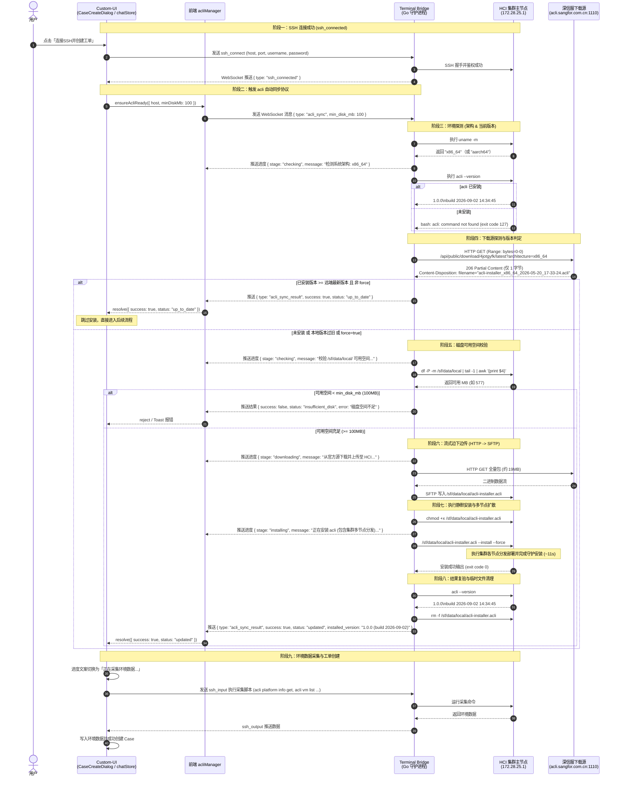

# acli 自动检测与安装更新方案

## 文档信息

- **版本**: v1.0
- **创建日期**: 2026-09-20
- **状态**: 已实现并通过真实环境验证
- **关联需求**: HCI 生产环境缺少 acli 工具或版本过旧，需在 SSH 连接后自动化检测并静默安装升级
- **关联文档**: [客户端设计.md](../客户端设计.md)、[SSH终端交互.md](../SSH终端交互.md)
- **关联任务**: [2026-09-20-acli自动检测与安装更新任务.md](../../../task/custom-ui/events/2026-09-20-acli自动检测与安装更新任务.md)

---

## 变更历史

| 日期 | 版本 | 变更内容 | 关联事件文档 |
|------|------|---------|------------|
| 2026-09-20 | v1.0 | 初版：实现 SSH 连接成功后自动检测 acli 版本、架构自适应下载、磁盘容量校验、静默多节点安装与状态同步 | 本文档 |

---

## 背景与需求

### 业务背景
在合入 PR #1056 后进行环境实测发现：部分真实 HCI 客户环境中未安装 `acli` 排障工具，或安装的 `acli` 工具版本滞后，导致后续基于 `acli` 的平台信息获取、告警采集及环境诊断流程直接报错中断（返回 `127: command not found`）。

### 功能需求
Custom-UI（前端）在与 HCI 建立 SSH 连接后，第一优先级任务应为**自动校验并确保 `acli` 可用**。若环境未安装或版本滞后，需自动通过 `terminal_bridge` 完成架构识别、下载、校验、上传并执行跨节点静默安装。

核心要求：
1. **磁盘容量前置校验**：上传并安装前，必须校验 HCI 节点 `/sf/data/local/` 目录剩余可用空间，防止打满分区。
2. **架构自适应**：需准确识别 HCI 架构（`x86_64` vs `aarch64`），匹配对应官方下载源。
3. **版本提取与比对**：通过 `acli --version` 提取当前 HCI 安装的版本与构建时间，与下载服务器最新版本智能比对。
4. **全自动静默安装**：支持规避安装包过期确认交互提示（`> 14 天` 的过期阻断询问），实现全自动非交互式部署。
5. **多节点覆盖**：安装执行须确保在 HCI 集群多节点内生效。
6. **全链路可观测**：安装更新各阶段（检测、下载、上传、安装、验证）需具备实时进度反馈机制。

---

## 详细时序图（从 ssh_connected 开始）

以下时序图完整展示了从 SSH 会话成功建立（`ssh_connected`）开始，系统自动执行架构判定、版本探测、磁盘校验、下载上传、静默安装、多节点生效至环境数据采集的闭环流程：



---

## 方案设计 (WHAT)

### 1. 架构职责划分

| 组件 | 职责 |
|------|------|
| **Custom-UI (Vue3 / Pinia)** | 监听 SSH 连接建立；调度 `acliManager.ensureAcliReady()`；展示用户友好的步骤进度条与错误提醒；安装完成后继续环境采集与工单创建。 |
| **Terminal Bridge (Go 守护进程)** | 处于真实网络与 HCI 网络的代理边界。承接 `acli_sync` 协议；执行 `uname -m` 与 `acli --version` 探测；通过 HTTP `Range: bytes=0-0` 秒级元数据预检；检查 HCI 磁盘；负责 HTTP 下载流与 SFTP 写入流的桥接；注入 `--install --force` 静默执行；清理临时安装包。 |
| **HCI 目标节点 (Linux)** | 承载安装包的临时落盘目录 `/sf/data/local/`；运行跨节点自动分发脚本；提供最新 `acli` CLI 调用接口。 |

### 2. 通信协议定义

#### 2.1 同步请求（前端 -> Terminal Bridge）
```json
{
  "type": "acli_sync",
  "min_disk_mb": 100,
  "force": false
}
```

#### 2.2 实时进度事件（Terminal Bridge -> 前端）
```json
{
  "type": "acli_sync_progress",
  "stage": "checking" | "downloading" | "uploading" | "installing" | "verifying",
  "message": "正在安装 acli (包含集群多节点分发)...",
  "percent": 80
}
```

#### 2.3 同步完成结果（Terminal Bridge -> 前端）
```json
{
  "type": "acli_sync_result",
  "success": true,
  "status": "up_to_date" | "updated" | "failed" | "insufficient_disk",
  "installed_version": "1.0.0 (build 2026-09-02 14:34:45)",
  "remote_version": "1.0.0 (build 2026-05-20 17-33-24)",
  "error": ""
}
```

---

## 决策依据与实测结论 (WHY)

### 1. 为什么由 Terminal Bridge 执行下载与上传，而非浏览器前端？
- **浏览器 Mixed Content（混合内容）安全阻断**：
  在生产部署中，Custom-UI 前端通过 HTTPS 提供服务。而深信服官方 acli 下载服务器端口为 `http://acli.sangfor.com.cn:1110/`（经现场 curl 验证，该端口不支持 TLS/HTTPS 协议）。若前端直接通过浏览器 `fetch()` 下载安装包，将直接被现代浏览器的混合内容拦截策略（Blocked Mixed Active Content）阻断。
- **避免大文件内存挤压与 WebSocket 协议开销**：
  `acli` 安装包体积约为 19MB。若前端先下载再转 Base64 经由 WebSocket 传输给 Bridge，会导致浏览器端 30MB+ 内存膨胀及严重的 JSON 序列化开销；由 Terminal Bridge 在本地/内网建立 HTTP 直连流并同时以 SFTP 写入 HCI，网络效率最高且资源开销最小。

### 2. 为什么探测远端版本使用 `Range: bytes=0-0` 而非 `HEAD` 请求？
- 现场对 `http://acli.sangfor.com.cn:1110` 进行测试：
  - 发送标准 `HEAD` 请求时，服务端返回 `HTTP 405 Method Not Allowed`，不支持 HEAD 请求。
  - 若直接发起全量 `GET`，每次连接均需完整下载 19MB 文件，耗时 1~3 秒且浪费外网带宽。
  - 采用 `GET` 配合请求头 `Range: bytes=0-0`，服务器返回 `HTTP 206 Partial Content`，实际仅传输 1 字节数据，耗时小于 100ms；同时响应头 `Content-Disposition: attachment; filename="acli-installer_x86_64_2026-05-20_17-33-24.acli"` 完整携带了最新构建时间戳，实现了亚秒级的版本比对。

### 3. 为什么必须附加 `--force` 参数执行安装？
- **现场实测阻断现象**：
  深信服 `acli-installer` 内部内置了安全校验机制：如果安装包的构建时间戳距当前系统时间超过 14 天，安装脚本会在终端交互式输出：
  ```text
  检测到安装包已超过14天，是否仍要继续使用过期版本？[y/N]:
  ```
  在无交互的 SSH 执行管道中，脚本会永远阻塞在 `stdin` 等待输入，导致前端与 Bridge 最终因 300 秒超时而挂死。
- **解决方案**：
  执行命令固定为 `/sf/data/local/acli-installer.acli --install --force`。`--force` 参数显式抑制过期交互确认，保证 100% 静默自动执行。

### 4. 磁盘容量阈值设定与多节点安装表现
- 现场环境验证数据（`172.28.25.1`）：
  - 挂载点：`/sf/data/local/` 属于 `/dev/sdb6` 分区，空闲空间约 577MB。
  - 峰值消耗：安装包本身 19MB，解包运行峰值占用约 45MB，安装完成后删除临时文件。
  - 阈值保护：设置 `min_disk_mb` 默认阈值为 100MB。空间低于 100MB 时主动拦截并报错，保护 HCI 底层分区安全。
  - 安装耗时：`./acli-installer.acli --install --force` 会自动向集群其他节点（如 `172.28.25.3`、`172.28.25.4`）并行下发部署，全集群同步完成耗时约 11 秒。

---

## 影响范围

根据文档规范，以下现有文档需要同步更新变更历史与引用：
1. **现行全量文档**：`docs/solution/custom-ui/客户端设计.md`（追加 v0.39 变更记录）。
2. **任务事件文档**：`docs/task/custom-ui/events/2026-09-20-acli自动检测与安装更新任务.md`。

---

## 验收标准

1. **架构与版本获取**：
   - 能够准确识别 `x86_64` 与 `aarch64`。
   - 正确执行 `acli --version` 提取版本号和 build 日期；若未安装，能准确识别退出码 127。
2. **版本对比与跳过**：
   - 当 HCI 上的版本已是最新时，`acli_sync` 在 1 秒内返回 `status: "up_to_date"`，跳过下载与安装。
3. **空间安全门禁**：
   - 当 `/sf/data/local/` 可用容量小于阈值时，安全阻断并返回 `insufficient_disk` 错误，禁止上传。
4. **全自动静默安装**：
   - 触发安装时无任何交互挂起，在 15 秒内完成全集群多节点部署并校验通过。
5. **异常与兜底**：
   - 无论同步成功与否，均清理 `/sf/data/local/` 下的临时安装包。
   - 前端具备清晰的步骤状态展示与超时重试机制。
