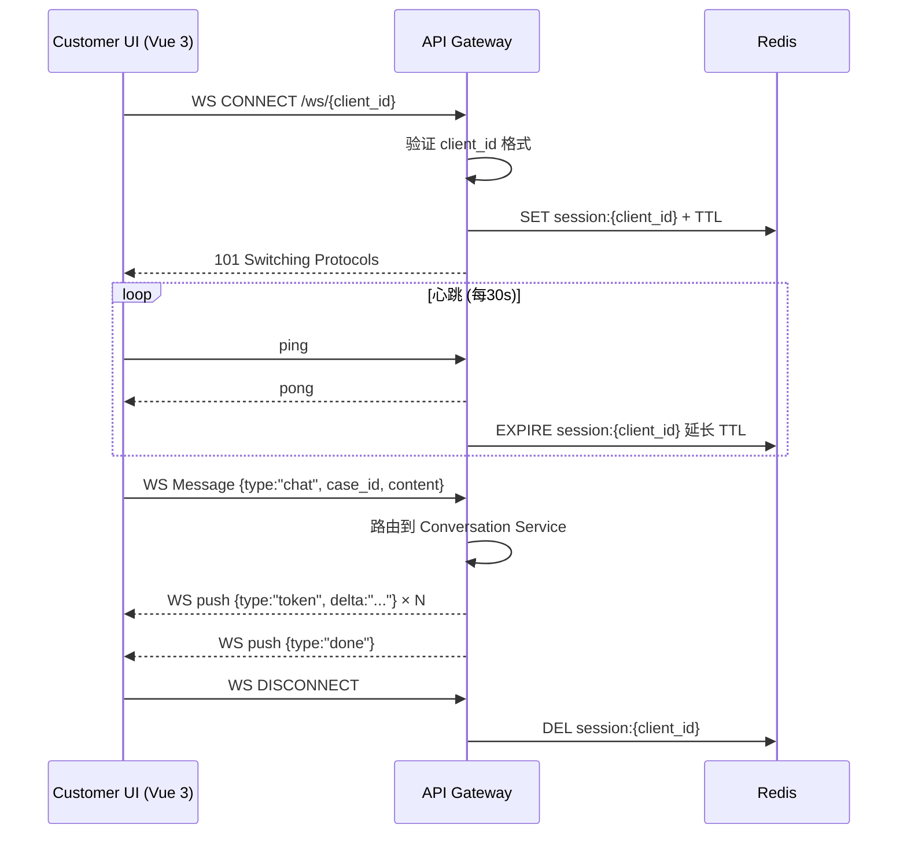
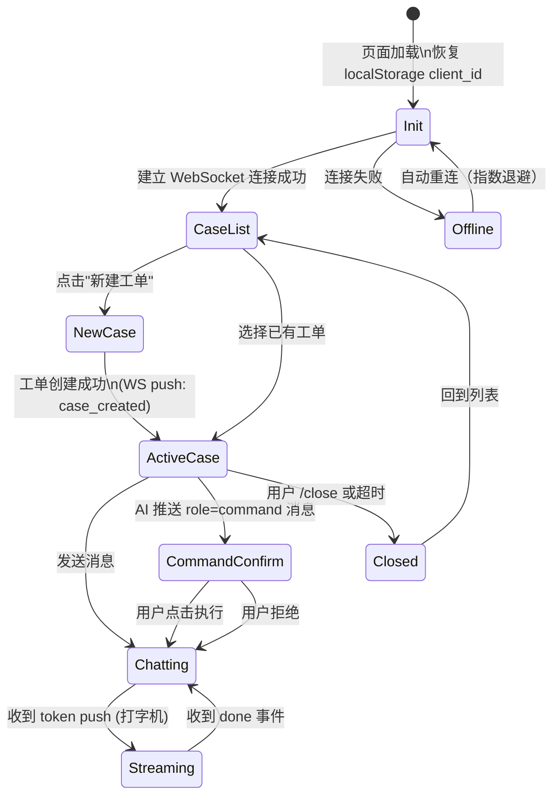
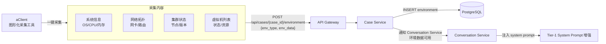

# HCI 智能排障平台 - 客户端设计文档

## 文档信息

- **版本**: 0.20（环境数据展示字段映射修复）
- **创建日期**: 2026-03-11
- **状态**: 开发中
- **关联文档**: [../ai-assistant/AI助手设计.md §10](../ai-assistant/AI助手设计.md)、[../接口设计.md](../接口设计.md)、[events/2026-04-23-SSH-UX全场景重构方案.md](events/2026-04-23-SSH-UX全场景重构方案.md)

---

## 变更历史

| 日期 | 版本 | 变更内容 | 关联事件文档 |
|------|------|---------|------------|
| 2026-04-25 | v0.20 | 环境数据展示字段映射修复：① `EnvironmentSummary.vue` 任务状态统计使用中文值（'失败'/'执行中'）匹配后端返回；② 集群信息字段名对齐（`hci_version`/`cluster_name`/`host_count`）修复统计显示"未知"；③ 任务状态 tag 颜色判断使用中文值 | [PR #214](https://github.com/tomturing/hci-troubleshoot-platform/pull/214) |
| 2026-04-25 | v0.19 | 终端操作录制功能：① 新增 `terminal-recording.ts` 录制工具模块（序号管理/ANSI剔除/批量上传）；② `TerminalPanel.vue` 集成录制逻辑（连接时开始录制/断开时停止录制）；③ 新增 `TerminalReplay.vue` 回放组件（时间轴控制/xterm.js渲染/搜索过滤/复制引用）；④ App.vue 新增当前工单终端历史入口按钮；⑤ ChatWindow.vue 历史工单详情新增终端历史查看入口 | [events/2026-04-25-终端操作录制方案.md](../../../docs/solution/events/2026-04-25-终端操作录制方案.md) |
| 2026-04-25 | v0.18 | 修复 `parseClusterOutput` 解析逻辑：`acli platform info get` 输出为 ini 格式（`key=value`），原实现错误按 `:` 分割导致集群信息全空；新实现剥离 DONE marker/Shell 提示符/update 历史行，按等号解析 kv；额外提取版本号行（`hci_version`）、内核行（`kernel`）、build 行（`build_time`）。修复 `TerminalPanel`：断开时调用 `disposeTerminal()` 避免重连黑屏；`terminal-stage` 改为 flex 容器 + `min-height:0`，`onMounted`/`watch` 改用 double rAF 修复半屏黑 | [events/2026-04-25-环境数据展示与映射修复方案.md](../events/2026-04-25-环境数据展示与映射修复方案.md) |
| 2026-04-24 | v0.17 | 前端 UX 五问题修复：① runCommand() case_id 由 createdCaseId 改为 'ssh-create-temp' 与 Bridge 对齐，修复 SSH 采集命令被静默丢弃；② 采集超时 10s→30s；③ 采集失败不入库错误占位符；④ SSH 确认工单后同步写入 chatStore.currentCase 使 badge 即刻显示；⑤ createConversation() catch 块 throw e，修复 AI 无响应；⑥ resumePendingCase/confirmCreateCase/switchToCase 补调 collectEnvironmentData，修复有数据时显示"未采集环境数据" | [events/2026-04-24-前端UX问题修复方案.md](../../../docs/solution/events/2026-04-24-前端UX问题修复方案.md) |
| 2026-04-24 | v0.16 | SSH 采集超时和 AI 对话无响应修复：① COLLECT_COMMANDS 超时从 30s/60s 改为统一 10s；② createConversation 失败时抛出错误而非静默返回；③ streamAIResponse conversationId 为空时抛出错误；④ completeCaseCreationFlow 正确处理错误 | [PR #207](https://github.com/tomturing/hci-troubleshoot-platform/pull/207) |
| 2026-04-24 | v0.15 | SSH UX 代码质量修复（Copilot Review 15 问题）：① SshFormSection 使用本地副本模式避免 props 直接修改；② CaseCreateDialog 进度条步骤顺序调整为 SSH认证→创建工单→采集环境；③ alert/task JSON 解析兼容包装对象格式 `{alerts:[...]}`；④ console.log 替换为 devLog（生产环境自动禁用）；⑤ 弹框打开时根据 bridgeStatus 重置 viewState；⑥ environmentApi.upsert 移除冗余字段（case_id/env_type 已在 URL path 中）；⑦ runSshAndCreateCase 添加表单验证；⑧ checkBridgeBeforeOpen onerror 处理中调用 probe.close()；⑨ SshConnectDialog 添加密钥认证验证 | [PR #206](https://github.com/tomturing/hci-troubleshoot-platform/pull/206) |
| 2026-04-23 | v0.14 | SSH UX 全场景重构：① Bridge 检测前置（弹框弹出前完成，检测结果决定弹框初始视图）；② `CaseCreateDialog` 重构为含 6 视图的内部状态机（bridge-guide / form / progress / error-auth / error-collect / success），不再跳出第二弹框；③ `TerminalPanel` 实现真实三态按钮（无工单+无SSH → 「连接SSH并创建工单」；有工单+无SSH → 「连接SSH」；已连接 → xterm终端）；④ 两个触发入口（顶部SSH终端按钮 / 底部输入框）；⑤ 弹框关闭后调用 `fetchEnvironments(caseId)` 修复状态不刷新问题；⑥ Bridge 仅支持 Windows 下载 | [events/2026-04-23-SSH-UX全场景重构方案.md](events/2026-04-23-SSH-UX全场景重构方案.md) |
| 2026-04-23 | v0.13 | SSH 集成体验全面重构：① 新建 `SshFlowPanel.vue`（统一 `create-case` / `terminal-only` 两种模式的 SSH 连接流程，含 Bridge 检测→SSH 连接→acli 检查→环境采集→完成）；② 新建 `SshConnectDialog.vue`（薄包装层，通过 `mode` prop 区分两种入口）；③ `CaseCreateDialog.vue` 从 795 行精简至 195 行（移除内嵌 SSH 状态和表单，保留标题/描述/助手选择，两个操作按钮：连接SSH创建 / 无SSH创建）；④ `TerminalPanel.vue` 移除内嵌 SSH 登录表单，改为"连接 SSH"按钮，点击触发 `chatStore.checkAndOpenTerminal()` 三态决策；⑤ 前后端统一改用 upsert（`PUT /environments/case/{case_id}/type/{env_type}`）替代 create，避免重复采集时重复插入；⑥ protocol helpers（`buildBridgeMarker`/`parseBridgeCommandResult`/`stripAnsi` 等）从 store 迁移至 `frontend/customer/src/api/terminal.ts`，供组件直接 import；⑦ 日志面板默认折叠；⑧「无 SSH 创建」按钮仅在 `create-case` 模式显示 | [PR #203](https://github.com/tomturing/hci-troubleshoot-platform/pull/203) |
| 2026-04-22 | v0.12 | 增强 SSH 集成创建工单链路可观测性：新增结构化控制台日志、流程 Flow ID、弹框内排查日志面板，便于直接定位卡在 Bridge 连接、SSH 认证、acli 检查还是环境采集阶段 | 本次修复 |
| 2026-04-22 | v0.11 | 修复 SSH 集成创建工单卡住问题：创建弹框直接复用 Store 的 SSH 阶段状态；`acli` 检查与环境采集改为“命令完成哨兵 + 单步超时”模型，避免因提示符或输出格式差异导致 Promise 长时间挂起；采集完成后显式建立终端侧全局 SSH 会话，避免抽屉显示已连接但无法执行命令 | 本次修复 |
| 2026-04-22 | v0.10 | SSH 连接调试日志增强：添加 WebSocket 全链路日志用于排查连接卡住问题；日志仅在开发环境生效，生产环境自动禁用；敏感信息（host/password）做脱敏处理 | PR #194 |
| 2026-04-21 | v0.9 | 修复全局SSH连接方法丢失：修复合并冲突导致的全局connectSSH/disconnectSSH/sendSSHCommand方法丢失；TerminalPanel重构使用全局SSH连接 | PR #191 |
| 2026-04-21 | v0.8 | SSH 连接架构重构：全局统一 WebSocket 管理（chatStore）；Bridge 刷新按钮；连接日志增强；UX 分层显示；EnvironmentSummary 刷新按钮禁用逻辑；详见 [SSH连接架构重构方案](events/2026-04-21-SSH连接架构重构方案.md) | PR #189 |
| 2026-04-21 | v0.7 | SSH 集成创建工单：弹框弹出时 Bridge 检测；SSH 信息自动填充；一键连接创建（连接 → acli 检查 → 采集 → 终端打开）；无 SSH 创建支持（灰色按钮 + 告警提示）；环境数据折叠卡片展示；详见 [SSH集成创建工单方案](events/2026-04-21-SSH集成创建工单方案.md) | 本 PR |
| 2026-04-20 | v0.6 | Environment API 类型修复：ORM 添加 TimestampMixin；collected_at 改为 DateTime；Repository 排序改用 collected_at；Schema env_type 改为 EnvType；前端采集状态新增 'empty' | PR #182 |
| 2026-04-20 | v0.5 | Environment API 实现：新增 `POST /api/environments/` 等接口；前端状态管理新增采集状态和方法；S0 Prompt 上下文注入打通 | 本 PR |
| 2026-04-17 | v0.4 | AI 助手选择器交互优化：选择器移至对话界面顶部（支持随时切换）；打通后端 `assistant_type` 参数传递链路；移除工单创建时的助手选择；详见 [助手切换优化方案](../events/2026-04-17-助手切换优化方案.md) | 本 PR |
| 2026-04-17 | v0.3 | AI 助手选择器智能显示：删除前端环境变量硬开关，改为后端 API 响应驱动（`show_selector` 字段）；新增 `capabilities` 能力标签显示；关联配置详见 [AI助手设计.md §10](../ai-assistant/AI助手设计.md) | PR #171 |
| 2026-04-16 | v0.2 | nginx.conf 添加动态 DNS 解析（`resolver 10.43.0.10 valid=30s` + `set $upstream`），解决 Pod 启动时 upstream DNS 未就绪导致 CrashLoopBackOff，同时更新 `/api/` 和 `/ws/` 两个 location | [PIT-045](../../deploy/pitfalls/k8s.md#pit-045) |

---

## 1. 背景与定位

### 1.1 核心场景

HCI 排障助手的使用场景是：**工程师通过 SSH 连接到客户的 HCI 后台环境**，此时工程师拥有对客户环境的直接访问权限。客户端设计的核心目标是：

1. 让 AI **尽可能在第一轮就拥有足够背景**，减少工程师反复描述的成本
2. 让 AI **能够安全地"动手"**——给出诊断命令，工程师确认后执行，结果反馈回来

> **数据依据**：在所有 case 中，**任务失败类（Job Failure）和告警类（Alert）问题合计占 80% 以上**。因此，优先获取任务状态和告警信息，是提升首轮诊断准确率最直接的手段。

### 1.2 与 VS Code Copilot 的类比

VS Code Copilot 工作时，会在用户输入问题之前**自动收集**工作区上下文（文件内容、LSP 诊断错误、终端输出），AI 在"第一轮"就能看到诊断结果，不需要用户手动复制报错。

HCI 客户端做的是同样的事，只是上下文从"代码工作区"换成了"HCI 后台环境状态"：

| 对比维度 | VS Code Copilot | HCI 客户端 |
|---------|----------------|-----------|
| 自动收集的上下文 | 当前文件、LSP 错误、终端输出 | 环境基本信息、告警列表、任务状态 |
| 命令执行授权 | 用户点击确认执行 shell 命令 | 用户选择是否执行 acli 命令 |
| 执行结果回填 | stdout/stderr 自动注入下一轮 | acli 输出自动追加到对话上下文 |
| 操作范围 | 本地文件系统 + 本地终端 | 客户 HCI 后台（通过 SSH 通道）|

---

## 2. 主动式上下文采集（Active Collection）

### 2.1 触发时机

**工程师通过 SSH 建立连接后，case 创建时自动触发**，无需工程师任何操作。

### 2.2 三个核心接口

连接建立后，客户端自动调用以下 3 个接口，并将结果注入 case 的 system_prompt Tier4：

| # | 接口 | 获取内容 | 注入位置 |
|---|------|---------|---------|
| a | 环境基本信息接口 | 集群版本、节点数量、存储池状态、网络拓扑等基础信息 | Tier4 `环境基本信息` 区块 |
| b | 告警信息接口 | 当前活跃告警列表（级别/类型/触发时间/受影响组件）| Tier4 `当前告警` 区块 |
| c | 任务信息接口 | 最近 N 条任务记录（任务类型/状态/失败原因/开始时间）| Tier4 `任务状态` 区块 |

### 2.3 注入后的 Tier4 示例

```
【Tier4 工单上下文】
工单ID: Q20260311001
工程师: engineer@sangfor.com

【环境基本信息】（自动采集，2026-03-11 09:15:00）
  集群版本: HCI 6.8.1
  节点数量: 3（2 Active / 1 Warning）
  存储池: SSD-Pool-01 容量 78%（阈值 80%）

【当前告警】（活跃 3 条）
  [CRITICAL] Node-02 磁盘 I/O 延迟持续 > 300ms，触发于 09:02
  [WARNING]  存储池 SSD-Pool-01 使用率 78%，触发于 08:45
  [INFO]     Node-03 心跳延迟偶发，触发于 06:30

【任务状态】（最近 10 条）
  [FAILED]  VM-Migration-Job-4412  09:01  虚拟机 vm-web-01 迁移失败：目标节点存储不足
  [RUNNING] Snapshot-Job-4411      08:50  执行中
  [SUCCESS] Backup-Job-4410        08:00  成功
```

这样 AI 在工程师第一句话发出之前，**已经看到了这 3 类关键信息**，能立即给出有针对性的诊断方向。

### 2.4 接口设计要点

- **超时容忍**：3 个接口并发调用，单个超时不阻塞 case 创建，超时的字段标注 `（采集超时）`
- **增量刷新**：工单进行中可按需重新采集（工程师输入 `/refresh` 或 AI 判断需要最新状态时触发）
- **数据存储**：采集结果写入 `environment` 表的 `context_snapshot` JSONB 字段，作为工单快照留存

---

## 3. 被动式命令执行（Passive / acli）

### 3.1 acli 是什么

**acli**（HCI Admin CLI）是 HCI 平台提供的完整后台命令操作体系，涵盖：

- 查询环境信息（集群、节点、网络、存储）
- 查询任务状态与失败详情
- 查询告警历史与当前激活告警
- 执行各类运维操作（迁移、重启、扩容、修复等）

所有操作都已封装为标准化的 CLI 命令，输出格式统一，便于程序解析和 AI 理解。

### 3.2 交互模式：人机协同授权执行

类似 Copilot Agent 模式中 AI 提出"运行命令"后需要用户点击确认，acli 命令执行遵循**人工授权**原则：

```
AI 诊断分析
    │
    ▼
AI 建议执行：
  "建议运行以下命令获取 Node-02 的磁盘详细状态：
   $ acli storage disk list --node Node-02 --format json"
    │
    ▼
[工程师选择]
  ├─ [✅ 执行] → 客户端执行 acli 命令 → 捕获输出 → 追加到对话上下文
  ├─ [❌ 跳过] → AI 不等待结果，基于现有信息继续
  └─ [✏️ 修改] → 工程师调整命令参数后执行
    │
    ▼
执行结果自动注入下一轮 AI 上下文：
  role: "tool_result"
  content: "$ acli storage disk list --node Node-02 --format json\n
            [OUTPUT]:\n  disk-01: 健康, I/O 延迟 280ms\n  disk-02: 警告, 坏扇区 12..."
    │
    ▼
AI 基于实际输出继续分析
```

### 3.3 acli 命令分类（待补充）

> 本节随 acli 功能持续迭代补充

| 分类 | 命令前缀 | 示例 | 说明 |
|------|---------|------|------|
| 环境查询 | `acli info` | `acli info cluster` | 查询集群概览 |
| 告警管理 | `acli alert` | `acli alert list --active` | 列出活跃告警 |
| 任务管理 | `acli job` | `acli job show <job_id>` | 查询任务详情 |
| 存储操作 | `acli storage` | `acli storage disk list --node <node>` | 磁盘详细状态 |
| 虚拟机操作 | `acli vm` | `acli vm status <vm_name>` | VM 状态查询 |
| 节点操作 | `acli node` | `acli node health --all` | 全节点健康检查 |
| 网络诊断 | `acli network` | `acli network ping <src> <dst>` | 网络连通性测试 |

### 3.4 执行结果捕获

- **stdout/stderr 全量捕获**：命令输出追加到 conversation 的下一条消息（`role: user`，前缀 `[命令执行结果]`）
- **输出裁剪**：超过 N 行的输出自动截断并附注 `（输出已截断，完整内容见附件）`，避免 token 浪费
- **失败标注**：非零退出码的命令结果添加 `[执行失败 exit_code=N]` 前缀，AI 可感知

---

## 4. 与 VS Code Copilot 工具调用的完整对比

| 对比维度 | VS Code Copilot Agent | HCI 客户端（主动 + acli）|
|---------|----------------------|------------------------|
| **上下文自动收集** | 工作区文件、LSP 诊断错误、最近终端输出 | 环境基本信息、告警列表、任务状态（SSH 连接时自动触发）|
| **命令执行能力** | `run_in_terminal`：本地 shell 任意命令 | acli：封装好的 HCI 后台运维命令集 |
| **执行授权模式** | AI 提出 → 用户点击确认 → 本地执行 | AI 建议 → 工程师选择 → 通过 SSH 通道执行 |
| **结果回填** | stdout/stderr 自动追加为 `tool_result` | acli 输出自动注入下一轮上下文 |
| **操作安全边界** | 本地文件系统（受 VS Code 权限管控）| 客户 HCI 后台（受 acli 命令白名单管控）|
| **知识检索工具** | `semantic_search` 工作区代码 | `POST /api/kb/search` HCI 领域知识库 |
| **环境感知粒度** | 代码级（文件/函数/变量）| 基础设施级（节点/存储/任务/告警）|
| **持久化** | 会话结束即丢失 | 全部写入 DB，工单生命周期内可追溯 |

> **关键差异**：Copilot 的工具是通用文件系统工具，HCI 的工具是**领域专用运维工具**——acli 提供的是经过封装、标准化输出、安全权限管控的 HCI 专属命令。这是 HCI 的护城河之一。

---

## 5. SSH 集成体验架构（v0.14 全场景重构）

> 详细设计见 [events/2026-04-23-SSH-UX全场景重构方案.md](events/2026-04-23-SSH-UX全场景重构方案.md)

### 5.1 两个触发入口

```
触发入口 A：
  顶部 [SSH终端] 按钮 → 右侧终端抽屉打开
  → 抽屉内点击 [连接SSH并创建工单]（状态A）或 [连接SSH]（状态B）
  → 前置 Bridge 检测（按钮 loading，~3s）
  → 根据检测结果弹出对应弹框

触发入口 B：
  底部输入框输入问题并发送
  → 检测到无当前工单
  → 前置 Bridge 检测
  → 弹出 CaseCreateDialog
```

### 5.2 前置 Bridge 检测（弹框弹出前）

```
用户触发动作（任意入口）
       │
  loading（~3s 超时）
       │
  尝试连接 ws://localhost:9999
       │
  ┌────┴────┐
未运行      运行正常
  │             │
弹框初始化    弹框初始化
视图A         视图B
```

**关键约束**：Bridge 检测在弹框弹出前完成，弹框展示内容确定，无内容跳变。Bridge 目前仅有 Windows 版本，下载入口仅显示 Windows 链接。

### 5.3 CaseCreateDialog 内部视图状态机（v0.14 新增）

弹框内共 6 个视图，`viewState` 控制切换，所有 SSH 流程在弹框1内完成，不跳出新弹框：

```
bridgeStatus='not-running'
    └──→ 视图A（bridge-guide）
              │ 点击「已运行刷新」→ 重检测
              │    检测成功 ──→ 视图B
              │    检测失败 ──→ 视图A + Toast
              │
              └─ 点击「无SSH创建」──→ 视图E

bridgeStatus='running'
    └──→ 视图B（form，SSH表单）
              │ 点击「连接SSH并创建工单」
              └──→ 视图B'（progress，进度面板）
                        │
                  ①SSH认证 ──失败──→ 视图C（error-auth）
                        │ 成功         │ 重试→视图B / 无SSH→视图E
                  ②采集环境 ──失败──→ 视图D（error-collect）
                        │ 成功         │ 重试采集→保留SSH重走② / 无SSH→视图E
                  ③创建工单 + upsert
                        │ 成功
                   视图F（success）
                        │ 2s后自动关闭
                   关闭弹框 → 进入AI对话 → fetchEnvironments(caseId)
```

**步骤条（弹框内）**：`① SSH认证` → `② 采集环境` → `③ 创建工单`

**业务强约束**：SSH 认证成功后必须执行环境采集（两步强绑定）；采集成功才创建工单；弹框关闭后必须调用 `fetchEnvironments(caseId)` 刷新环境摘要显示。

### 5.4 视图效果图

#### 视图A — Bridge 未运行
```
─── 🖥 SSH 连接 ─────────────────────────────
⚠️  检测到 Bridge 工具未运行
    需要先在本机启动 Bridge 工具才能进行 SSH 连接

┌─ 📥 下载 Bridge 工具（Windows） ─────────┐
│   [⬇ 下载 Windows 版]                    │
└──────────────────────────────────────────┘

已下载并启动？  [🔄 已运行 Bridge 工具，点击刷新]
─────────────────────────────────────────────
底部按钮：[⚠ 无SSH直接创建]  [取消]
```

#### 视图B — SSH 表单
```
─── 🖥 SSH连接（认证后自动采集环境数据）────
主机地址          端口
[ 192.168.1.100 ]  [ 22 ]
用户名
[ root          ]
认证方式  ● 密码  ○ 密钥
密码
[ ••••••••     ] [👁]
─────────────────────────────────────────────
底部按钮：[🖥 连接SSH并创建工单]  [⚠ 无SSH直接创建]  [取消]
```

#### 视图B' — 进度中
```
步骤  ① SSH认证  ② 采集环境  ③ 创建工单
         🔄           ○           ○
┌─ 日志 ▶（折叠）─────────────────────────┐
└──────────────────────────────────────────┘
正在进行 SSH 认证... root@192.168.1.100
─────────────────────────────────────────────
底部按钮：[取消]
```

#### 视图C / D — 认证失败 / 采集失败
```
步骤  ① SSH认证  ② 采集环境  ③ 创建工单
         ❌           ○           ○         ← 视图C（认证失败）
         ✅           ❌           ○         ← 视图D（采集失败）

┌─ ❌ SSH认证失败 / 环境采集失败 ──────────┐
│  原因：Authentication failed / acli超时  │
└──────────────────────────────────────────┘
─────────────────────────────────────────────
底部按钮（视图C）：[🔄 重试]  [⚠ 无SSH直接创建]
底部按钮（视图D）：[🔄 重试采集]  [⚠ 无SSH直接创建]
```

- **视图C "重试"**：返回视图B，可修改 SSH 信息，重走全部 3 步
- **视图D "重试采集"**：保留已有 SSH 连接，仅重走步骤②（跳过认证）

#### 视图F — 成功，2s 自动关闭
```
步骤  ① SSH认证  ② 采集环境  ③ 创建工单
         ✅           ✅           ✅

    ✅ 工单创建成功，环境数据已入库
       工单号：Q2026042300001
       即将进入AI对话... (2s)
```

### 5.5 TerminalPanel 三态按钮

```typescript
const terminalState = computed(() => {
  if (sshConnectionState.value === 'connected') return 'C'  // 已连接
  if (currentCaseId.value) return 'B'                       // 有工单，未连接
  return 'A'                                                  // 无工单，无连接
})
```

| 状态 | 按钮文字 | 点击行为 |
|------|---------|--------|
| A（无工单+无SSH）| 🖥 连接SSH并创建工单 | 前置检测 → 打开 CaseCreateDialog |
| B（有工单+无SSH）| 🖥 连接SSH | 前置检测 → 打开 SshConnectDialog |
| C（已连接）| 无按钮，显示 xterm 终端 | 直接操作 |

### 5.6 环境数据 upsert 机制

**问题**：早期使用 `POST /environments/`（create），用户重复执行采集时产生重复记录。

**方案**：改用幂等 upsert 端点（`PUT /environments/case/{case_id}/type/{env_type}`）：

- 相同 `(case_id, env_type)` 首次写入 → `INSERT`（`created=True`）
- 再次写入 → `UPDATE env_data + collected_at`（`created=False`）
- 前端 `environmentApi.upsert()` 统一调用，`submitCollectedData` 全部从 create 切换至 upsert

### 5.6 protocol helpers 集中管理

Bridge 命令协议工具函数集中在 `frontend/customer/src/api/terminal.ts`，组件直接 import：

| 函数 | 用途 |
|------|------|
| `buildBridgeMarker(id)` | 生成命令完成哨兵标记 |
| `buildBridgeCommandPayload(cmd, id)` | 构建发送到 Bridge 的 JSON |
| `parseBridgeCommandResult(output, marker)` | 解析命令执行结果 |
| `stripAnsi(str)` | 去除 ANSI 转义码 |
| `parseJsonOutput(str)` | 贪婪提取 JSON（兼容多种输出格式）|
| `escapeRegExp(str)` | 正则转义 |

---

## 6. 系统集成设计（待迭代）

> 本节随实现推进持续补充

### 6.1 SSH 连接建立与 case 关联（基础架构）

- 客户端建立 SSH 连接时，传递 `case_id` 参数与工单绑定
- 主动采集的 3 个接口调用通过该 SSH 通道转发至客户 HCI 后台
- `environment` 表的 `context_snapshot` 字段记录快照

### 6.2 acli 命令管道

- 前端发送 `POST /cases/{case_id}/execute` 携带 acli 命令
- case-service 通过 SSH 通道下发到客户环境执行
- 执行结果通过 SSE 流式返回，同时写入 conversation message

### 6.3 安全考虑

- acli 白名单：仅允许查询类 + 受控操作类命令（写操作需二次确认）
- 命令注入防护：参数严格校验，不拼接 shell 字符串
- 操作审计：所有执行的 acli 命令记录到 `message` 表，带 `trace_id`，可追溯

---

## 7. AI 助手选择器（v0.4 更新）

> **设计原则**：单一真实来源 + 后端驱动 + 随时可见随时切换。
> 详细配置说明见 [AI助手设计.md §10](../ai-assistant/AI助手设计.md)。

### 7.1 智能显示逻辑

助手选择器的显示由后端 API 响应决定，无需前端环境变量硬开关：

| 条件 | 显示行为 |
|------|---------|
| 可用助手数量 > 1 | 自动显示选择器 |
| 可用助手数量 = 1 | 自动隐藏选择器 |
| 后端 `ASSISTANT_SHOW_SELECTOR=true` | 强制显示 |
| 后端 `ASSISTANT_SHOW_SELECTOR=false` | 强制隐藏 |

### 7.2 UI 位置（v0.4 变更）

助手选择器位于**对话界面顶部**（消息区域上方），而非工单创建对话框：

```
┌─────────────────────────────────┐
│ 当前助手：[OpenClaw ▼]          │ ← 助手选择器（始终可见）
├─────────────────────────────────┤
│ [诊断阶段进度条]                 │
├─────────────────────────────────┤
│ 消息历史...                     │
│ 用户: ...                       │
│ AI: ...                         │
├─────────────────────────────────┤
│ 输入框 [发送]                   │
└─────────────────────────────────┘
```

**设计依据**：
- 符合业界最佳实践「模型状态始终可见」（OrangeLoops 2025）
- 支持用户在任意对话轮次切换助手，无需关闭工单重新创建

### 7.3 对话中动态切换（v0.4 新增）

用户可在对话过程中切换助手，切换后保留对话历史，新助手继承上下文继续分析：

```
数据流：
前端 streamAIResponse → POST /api/conversations/{id}/message
  body: { case_id, role, content, assistant_type: selectedAssistant }

后端 send_message_stream_only → _resolve_assistant_type
  → ai_registry.get_client(assistant_type)
  → SSE 流式响应
```

**关键参数传递链路**：

| 层级 | 字段 | 说明 |
|------|------|------|
| 前端 Schema | `MessageCreate.assistant_type` | 可选，发送时携带 |
| 后端 Schema | `MessageCreate.assistant_type` | 可选，默认 None |
| 后端路由 | `send_message → service` | 透传参数 |
| 后端服务 | `_resolve_assistant_type` | 优先使用显式参数 |

### 7.4 UI 增强

助手选择器下拉选项显示：
- **display_name**：助手名称
- **is_default**：默认标记（绿色 Tag）
- **available**：暂不可用标记（黄色 Tag）

---

## 8. 待迭代内容

- [ ] acli 完整命令列表与分类（由 acli 模块文档同步）
- [ ] SSH 通道建立的认证与安全方案
- [ ] 主动采集 3 个接口的具体 API 协议和响应格式
- [ ] 命令执行授权的前端 UX 交互设计（参考 Copilot 的确认对话框）
- [ ] 超大输出（> 1000 行）的处理策略（存 MinIO + 摘要注入）

---

*文档版本: 0.1 | 创建: 2026-03-11 | 状态: 骨架，持续迭代*

---

## 数据流图（v6.4 补充）

### WebSocket 生命周期



### 前端 UI 状态机



### aClient 主动数据采集流



*数据流图版本: 1.0 | 补充日期: 2026-04-06*


## 变更历史

| 版本 | 日期 | 改动说明 |
|------|------|----------|
| v1.1 | 2026-04-25 | T1 修复：`confirmCreateCase()` 移除前端主动调用 `caseApi.confirm()`，工单状态确认职责归还给 conversation-service S0 阶段完成后触发（SP-1 同步点）。影响文件：`frontend/customer/src/stores/chat.ts` |
| v1.2 | 2026-04-25 | PR#216：① `EnvironmentSummary.vue` 集群字段"未知"过滤（`v-if` 增加 `!== '未知'` 判断）；② `SshFormSection.vue` SSH 配置恢复移除 `!port` 保护条件；③ `MessageBubble.vue` S0/S6 圆圈数字选项渲染为可点击按钮；④ `chat.ts` 全量删除 `caseApi.confirm()` 前端调用（4 处），工单状态流转完全由后端 SP-1 负责 || v1.3 | 2026-04-25 | Issue A 修复：新增 `frontend/customer/src/utils/parseCluster.ts` 共享工具函数；`CaseCreateDialog.vue` 采集集群数据时改用 `parseClusterOutput()` 替换旧的冒号分割正则（修复存储键名错误导致 UI 显示"集群数据暂未采集"的问题）。Issue B 修复：`conversation_service.py` `_update_conversation_category()` 新增 `trigger_confirm` 参数，仅用户明确选择 ①②③ 时（line 297 路径）才触发 SP-1 confirm，防止 AI 生成候选选项时误触发工单状态确认 |
| v1.4 | 2026-04-25 | Issue 1 根治：从 `CaseCreateDialog.vue` 彻底移除两处 `caseApi.confirm()` 调用（handleSSHConnect L388、handleNoSSHCreate L511）——工单在创建后应保持 `created` 状态，直至用户完成 S0 分类选择触发 SP-1；历次修复均错误聚焦于 chat.ts 和后端，忽略了本文件。Issue 3 根治：`TerminalPanel.vue` `onMounted` 新增录制启动逻辑——当组件 mount 时 SSH 已处于连接状态（无 transition），`watch(isConnected)` 不触发，`startRecording` 从未被调用；历次修复均在基础设施层（DATABASE_URL/db_manager），忽略了前端生命周期 bug。Issue 2 修复：`conversation_service.py` 行内懒导入路径错误（`models.conversation` → `models.message`）。 |