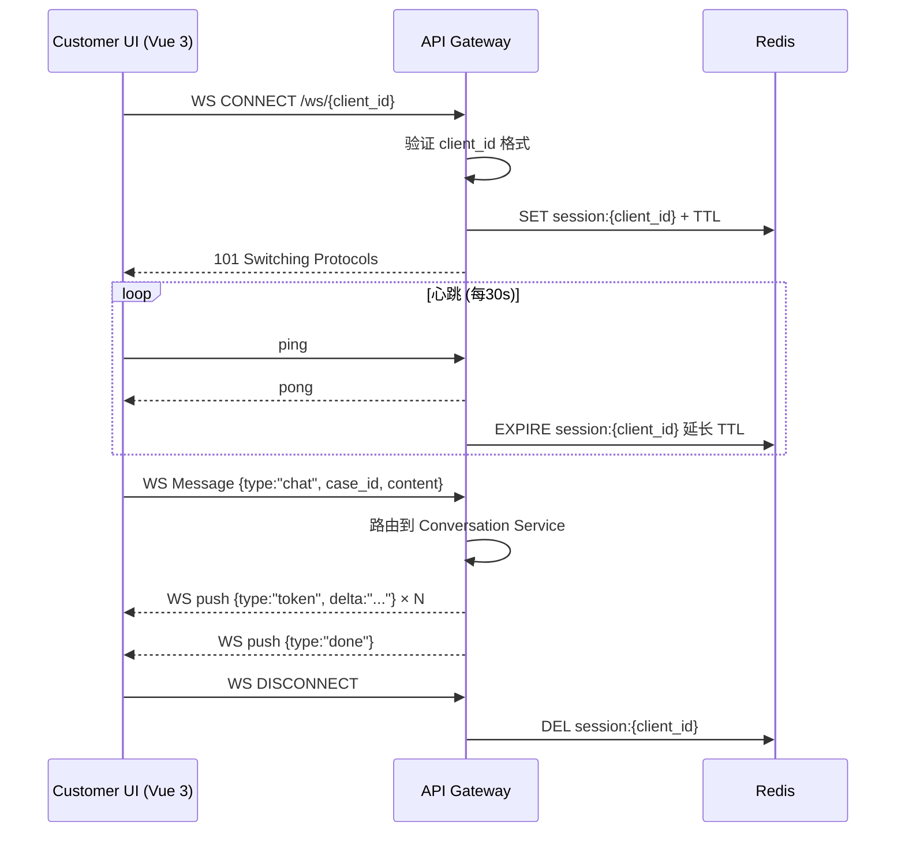
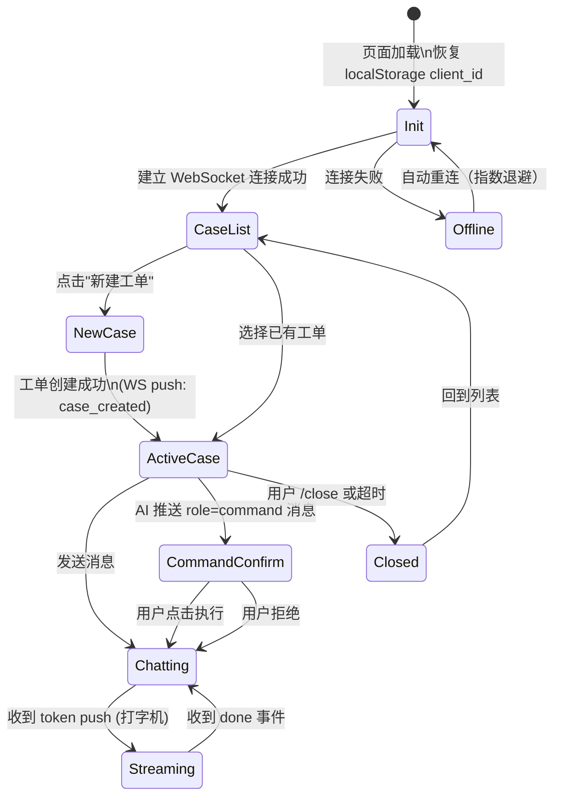
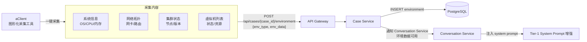

# HCI 智能排障平台 - 客户端设计文档

## 文档信息

- **版本**: 0.3（骨架，持续迭代）
- **创建日期**: 2026-03-11
- **状态**: 设计中
- **关联文档**: [../ai-assistant/AI助手设计.md §10](../ai-assistant/AI助手设计.md)、[../接口设计.md](../接口设计.md)

---

## 变更历史

| 日期 | 版本 | 变更内容 | 关联事件文档 |
|------|------|---------|------------|
| 2026-04-17 | v0.4 | AI 助手选择器交互优化：选择器移至对话界面顶部（支持随时切换）；打通后端 `assistant_type` 参数传递链路；移除工单创建时的助手选择；详见 [助手切换优化方案](../events/2026-04-17-助手切换优化方案.md) | 本 PR |
| 2026-04-17 | v0.3 | AI 助手选择器智能显示：删除前端环境变量硬开关，改为后端 API 响应驱动（`show_selector` 字段）；新增 `capabilities` 能力标签显示；关联配置详见 [AI助手设计.md §10](../ai-assistant/AI助手设计.md) | PR #171 |
| 2026-04-16 | v0.2 | nginx.conf 添加动态 DNS 解析（`resolver 10.43.0.10 valid=30s` + `set $upstream`），解决 Pod 启动时 upstream DNS 未就绪导致 CrashLoopBackOff，同时更新 `/api/` 和 `/ws/` 两个 location | [PIT-045](../../deploy/pitfalls/k8s.md#pit-045) |

---

## 1. 背景与定位

### 1.1 核心场景

HCI 排障助手的使用场景是：**工程师通过 SSH 连接到客户的 HCI 后台环境**，此时工程师拥有对客户环境的直接访问权限。客户端设计的核心目标是：

1. 让 AI **尽可能在第一轮就拥有足够背景**，减少工程师反复描述的成本
2. 让 AI **能够安全地"动手"**——给出诊断命令，工程师确认后执行，结果反馈回来

> **数据依据**：在所有 case 中，**任务失败类（Job Failure）和告警类（Alert）问题合计占 80% 以上**。因此，优先获取任务状态和告警信息，是提升首轮诊断准确率最直接的手段。

### 1.2 与 VS Code Copilot 的类比

VS Code Copilot 工作时，会在用户输入问题之前**自动收集**工作区上下文（文件内容、LSP 诊断错误、终端输出），AI 在"第一轮"就能看到诊断结果，不需要用户手动复制报错。

HCI 客户端做的是同样的事，只是上下文从"代码工作区"换成了"HCI 后台环境状态"：

| 对比维度 | VS Code Copilot | HCI 客户端 |
|---------|----------------|-----------|
| 自动收集的上下文 | 当前文件、LSP 错误、终端输出 | 环境基本信息、告警列表、任务状态 |
| 命令执行授权 | 用户点击确认执行 shell 命令 | 用户选择是否执行 acli 命令 |
| 执行结果回填 | stdout/stderr 自动注入下一轮 | acli 输出自动追加到对话上下文 |
| 操作范围 | 本地文件系统 + 本地终端 | 客户 HCI 后台（通过 SSH 通道）|

---

## 2. 主动式上下文采集（Active Collection）

### 2.1 触发时机

**工程师通过 SSH 建立连接后，case 创建时自动触发**，无需工程师任何操作。

### 2.2 三个核心接口

连接建立后，客户端自动调用以下 3 个接口，并将结果注入 case 的 system_prompt Tier4：

| # | 接口 | 获取内容 | 注入位置 |
|---|------|---------|---------|
| a | 环境基本信息接口 | 集群版本、节点数量、存储池状态、网络拓扑等基础信息 | Tier4 `环境基本信息` 区块 |
| b | 告警信息接口 | 当前活跃告警列表（级别/类型/触发时间/受影响组件）| Tier4 `当前告警` 区块 |
| c | 任务信息接口 | 最近 N 条任务记录（任务类型/状态/失败原因/开始时间）| Tier4 `任务状态` 区块 |

### 2.3 注入后的 Tier4 示例

```
【Tier4 工单上下文】
工单ID: Q20260311001
工程师: engineer@sangfor.com

【环境基本信息】（自动采集，2026-03-11 09:15:00）
  集群版本: HCI 6.8.1
  节点数量: 3（2 Active / 1 Warning）
  存储池: SSD-Pool-01 容量 78%（阈值 80%）

【当前告警】（活跃 3 条）
  [CRITICAL] Node-02 磁盘 I/O 延迟持续 > 300ms，触发于 09:02
  [WARNING]  存储池 SSD-Pool-01 使用率 78%，触发于 08:45
  [INFO]     Node-03 心跳延迟偶发，触发于 06:30

【任务状态】（最近 10 条）
  [FAILED]  VM-Migration-Job-4412  09:01  虚拟机 vm-web-01 迁移失败：目标节点存储不足
  [RUNNING] Snapshot-Job-4411      08:50  执行中
  [SUCCESS] Backup-Job-4410        08:00  成功
```

这样 AI 在工程师第一句话发出之前，**已经看到了这 3 类关键信息**，能立即给出有针对性的诊断方向。

### 2.4 接口设计要点

- **超时容忍**：3 个接口并发调用，单个超时不阻塞 case 创建，超时的字段标注 `（采集超时）`
- **增量刷新**：工单进行中可按需重新采集（工程师输入 `/refresh` 或 AI 判断需要最新状态时触发）
- **数据存储**：采集结果写入 `environment` 表的 `context_snapshot` JSONB 字段，作为工单快照留存

---

## 3. 被动式命令执行（Passive / acli）

### 3.1 acli 是什么

**acli**（HCI Admin CLI）是 HCI 平台提供的完整后台命令操作体系，涵盖：

- 查询环境信息（集群、节点、网络、存储）
- 查询任务状态与失败详情
- 查询告警历史与当前激活告警
- 执行各类运维操作（迁移、重启、扩容、修复等）

所有操作都已封装为标准化的 CLI 命令，输出格式统一，便于程序解析和 AI 理解。

### 3.2 交互模式：人机协同授权执行

类似 Copilot Agent 模式中 AI 提出"运行命令"后需要用户点击确认，acli 命令执行遵循**人工授权**原则：

```
AI 诊断分析
    │
    ▼
AI 建议执行：
  "建议运行以下命令获取 Node-02 的磁盘详细状态：
   $ acli storage disk list --node Node-02 --format json"
    │
    ▼
[工程师选择]
  ├─ [✅ 执行] → 客户端执行 acli 命令 → 捕获输出 → 追加到对话上下文
  ├─ [❌ 跳过] → AI 不等待结果，基于现有信息继续
  └─ [✏️ 修改] → 工程师调整命令参数后执行
    │
    ▼
执行结果自动注入下一轮 AI 上下文：
  role: "tool_result"
  content: "$ acli storage disk list --node Node-02 --format json\n
            [OUTPUT]:\n  disk-01: 健康, I/O 延迟 280ms\n  disk-02: 警告, 坏扇区 12..."
    │
    ▼
AI 基于实际输出继续分析
```

### 3.3 acli 命令分类（待补充）

> 本节随 acli 功能持续迭代补充

| 分类 | 命令前缀 | 示例 | 说明 |
|------|---------|------|------|
| 环境查询 | `acli info` | `acli info cluster` | 查询集群概览 |
| 告警管理 | `acli alert` | `acli alert list --active` | 列出活跃告警 |
| 任务管理 | `acli job` | `acli job show <job_id>` | 查询任务详情 |
| 存储操作 | `acli storage` | `acli storage disk list --node <node>` | 磁盘详细状态 |
| 虚拟机操作 | `acli vm` | `acli vm status <vm_name>` | VM 状态查询 |
| 节点操作 | `acli node` | `acli node health --all` | 全节点健康检查 |
| 网络诊断 | `acli network` | `acli network ping <src> <dst>` | 网络连通性测试 |

### 3.4 执行结果捕获

- **stdout/stderr 全量捕获**：命令输出追加到 conversation 的下一条消息（`role: user`，前缀 `[命令执行结果]`）
- **输出裁剪**：超过 N 行的输出自动截断并附注 `（输出已截断，完整内容见附件）`，避免 token 浪费
- **失败标注**：非零退出码的命令结果添加 `[执行失败 exit_code=N]` 前缀，AI 可感知

---

## 4. 与 VS Code Copilot 工具调用的完整对比

| 对比维度 | VS Code Copilot Agent | HCI 客户端（主动 + acli）|
|---------|----------------------|------------------------|
| **上下文自动收集** | 工作区文件、LSP 诊断错误、最近终端输出 | 环境基本信息、告警列表、任务状态（SSH 连接时自动触发）|
| **命令执行能力** | `run_in_terminal`：本地 shell 任意命令 | acli：封装好的 HCI 后台运维命令集 |
| **执行授权模式** | AI 提出 → 用户点击确认 → 本地执行 | AI 建议 → 工程师选择 → 通过 SSH 通道执行 |
| **结果回填** | stdout/stderr 自动追加为 `tool_result` | acli 输出自动注入下一轮上下文 |
| **操作安全边界** | 本地文件系统（受 VS Code 权限管控）| 客户 HCI 后台（受 acli 命令白名单管控）|
| **知识检索工具** | `semantic_search` 工作区代码 | `POST /api/kb/search` HCI 领域知识库 |
| **环境感知粒度** | 代码级（文件/函数/变量）| 基础设施级（节点/存储/任务/告警）|
| **持久化** | 会话结束即丢失 | 全部写入 DB，工单生命周期内可追溯 |

> **关键差异**：Copilot 的工具是通用文件系统工具，HCI 的工具是**领域专用运维工具**——acli 提供的是经过封装、标准化输出、安全权限管控的 HCI 专属命令。这是 HCI 的护城河之一。

---

## 5. 系统集成设计（待迭代）

> 本节随实现推进持续补充

### 5.1 SSH 连接建立与 case 关联

- 客户端建立 SSH 连接时，传递 `case_id` 参数与工单绑定
- 主动采集的 3 个接口调用通过该 SSH 通道转发至客户 HCI 后台
- `environment` 表的 `context_snapshot` 字段记录快照

### 5.2 acli 命令管道

- 前端发送 `POST /cases/{case_id}/execute` 携带 acli 命令
- case-service 通过 SSH 通道下发到客户环境执行
- 执行结果通过 SSE 流式返回，同时写入 conversation message

### 5.3 安全考虑

- acli 白名单：仅允许查询类 + 受控操作类命令（写操作需二次确认）
- 命令注入防护：参数严格校验，不拼接 shell 字符串
- 操作审计：所有执行的 acli 命令记录到 `message` 表，带 `trace_id`，可追溯

---

## 7. AI 助手选择器（v0.4 更新）

> **设计原则**：单一真实来源 + 后端驱动 + 随时可见随时切换。
> 详细配置说明见 [AI助手设计.md §10](../ai-assistant/AI助手设计.md)。

### 7.1 智能显示逻辑

助手选择器的显示由后端 API 响应决定，无需前端环境变量硬开关：

| 条件 | 显示行为 |
|------|---------|
| 可用助手数量 > 1 | 自动显示选择器 |
| 可用助手数量 = 1 | 自动隐藏选择器 |
| 后端 `ASSISTANT_SHOW_SELECTOR=true` | 强制显示 |
| 后端 `ASSISTANT_SHOW_SELECTOR=false` | 强制隐藏 |

### 7.2 UI 位置（v0.4 变更）

助手选择器位于**对话界面顶部**（消息区域上方），而非工单创建对话框：

```
┌─────────────────────────────────┐
│ 当前助手：[OpenClaw ▼]          │ ← 助手选择器（始终可见）
├─────────────────────────────────┤
│ [诊断阶段进度条]                 │
├─────────────────────────────────┤
│ 消息历史...                     │
│ 用户: ...                       │
│ AI: ...                         │
├─────────────────────────────────┤
│ 输入框 [发送]                   │
└─────────────────────────────────┘
```

**设计依据**：
- 符合业界最佳实践「模型状态始终可见」（OrangeLoops 2025）
- 支持用户在任意对话轮次切换助手，无需关闭工单重新创建

### 7.3 对话中动态切换（v0.4 新增）

用户可在对话过程中切换助手，切换后保留对话历史，新助手继承上下文继续分析：

```
数据流：
前端 streamAIResponse → POST /api/conversations/{id}/message
  body: { case_id, role, content, assistant_type: selectedAssistant }

后端 send_message_stream_only → _resolve_assistant_type
  → ai_registry.get_client(assistant_type)
  → SSE 流式响应
```

**关键参数传递链路**：

| 层级 | 字段 | 说明 |
|------|------|------|
| 前端 Schema | `MessageCreate.assistant_type` | 可选，发送时携带 |
| 后端 Schema | `MessageCreate.assistant_type` | 可选，默认 None |
| 后端路由 | `send_message → service` | 透传参数 |
| 后端服务 | `_resolve_assistant_type` | 优先使用显式参数 |

### 7.4 UI 增强

助手选择器下拉选项显示：
- **display_name**：助手名称
- **is_default**：默认标记（绿色 Tag）
- **available**：暂不可用标记（黄色 Tag）

---

## 8. 待迭代内容

- [ ] acli 完整命令列表与分类（由 acli 模块文档同步）
- [ ] SSH 通道建立的认证与安全方案
- [ ] 主动采集 3 个接口的具体 API 协议和响应格式
- [ ] 命令执行授权的前端 UX 交互设计（参考 Copilot 的确认对话框）
- [ ] 超大输出（> 1000 行）的处理策略（存 MinIO + 摘要注入）

---

*文档版本: 0.1 | 创建: 2026-03-11 | 状态: 骨架，持续迭代*

---

## 数据流图（v6.4 补充）

### WebSocket 生命周期



### 前端 UI 状态机



### aClient 主动数据采集流



*数据流图版本: 1.0 | 补充日期: 2026-04-06*
