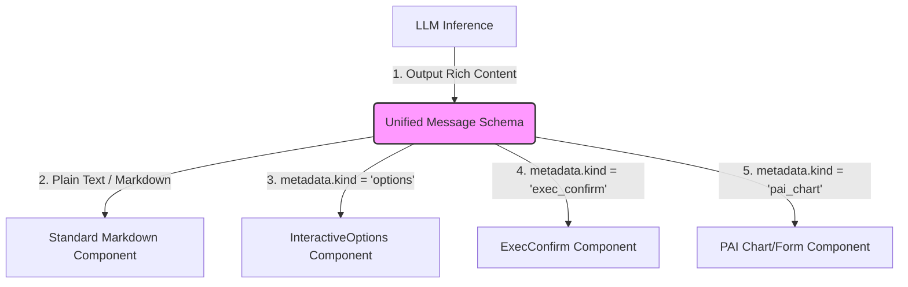

# HTP / OPS / PAI 多智能体交互架构深度剖析与演进路线报告

> [!NOTE]
> 本报告基于**第一性原理（First-principles thinking）**，结合业界最佳实践（ChatOps、PydanticAI、Stateful Reactivity），深入剖析了平台当前“后端降解，前端复用”解法的合理性与局限性，并针对 HTP、OPS 和 PAI 三个 Agent 的交互形态给出了统一、解耦、极致体验的未来演进方案。

---

## 一、多智能体交互的“第一性原理”：本质特征差异分析

智能排障平台拥有 HTP、OPS、PAI 三种不同定位 of 智能体，它们的交互本质与业务边界截然不同，无法单纯用“一种模式”硬套所有场景：

| 智能体维度 | HTP Agent (故障分类/意图识别) | OPS Agent (SOP 流程/命令执行) | PAI Agent (预测性分析/容量推荐) |
| :--- | :--- | :--- | :--- |
| **交互本质** | **软性对话型 (Soft Conversational)** | **强状态事务型 (Hard Transactional)** | **数据探针与表单型 (Data-driven Form)** |
| **执行特征** | 非阻塞、允许模糊。若推荐不准，用户可以补充自由文本（+1 模式）。 | 必须严格阻塞。命令执行有风险控制，需要审计和超时拒绝保护。 | 基于分析结果做动态参数微调（如容量阀值、节点选择）。 |
| **状态持久化** | 仅属于会话历史的一部分，刷新页面恢复文本上下文即可。 | 必须后端落库持久化（ACPSessionState），支持分布式重试与审计。 | 介于二者之间，需要保持图表和配置面板的历史选中状态。 |
| **UI 呈现范式** | **对话气泡内嵌按钮 (Inline Buttons)** | **事务确认浮层 (Blocking Card / Modal)** | **动态表单与数据图表 (Form Grid / Chart)** |

---

## 二、当前“后端降解，前端复用”方案评估：是业界最优解吗？

### 1. 局部评估：针对 HTP S0 分类场景，它是“当下的战术最优解”
**是的，针对 HTP S0 的多候选问答场景，当前方案极具智慧和实效性。**
* **规避了过度设计（Over-engineering）**：S0 阶段本质上是 LLM 与用户的澄清问答。将其设计成后端阻塞式的 `interactive_request` 会导致前后端复杂的路由状态同步（ACP 协议开销）。
* **规避了竞态与乱序**：纯文本流式输出随着 SSE 天然有序，在落库时不需要额外的微秒级事务锁，完美解决了页面刷新时卡片插入的乱序 Bug。
* **原生支持“+1 模式”**：前端直接接管输入框渲染，自由文本提交后直接转常规消息，LLM 能自然理解上下文，消除了后台映射 ID 越界导致拒答的缺陷。

### 2. 全局评估：针对多 Agent 统一架构，它是“非最优的过渡解法”
**由于该方案依赖前端“正则表达式对文本段落的强行解析”，存在以下天然缺陷，无法直接推广到 OPS 与 PAI**：
* **对 LLM Prompt 极度敏感（脆弱性）**：如果 LLM 的回复语气发生了微调（如将“请选择以下”变成“您可以挑一个”），前端正则表达式就会匹配失败，造成按钮渲染崩塌（本次 Bug 的根源）。
* **不具备事务安全性**：OPS 的高危命令执行（如 `rm -rf`）必须拥有确定性的状态机制，文本解析无法承载超时倒计时、权限风控拦截与事务回滚。
* **无法承载复杂交互**：PAI Agent 需要展示拓扑图、折线图、阈值滑块，这些无法从普通的 Markdown 文本中用正则匹配出来。

---

## 三、多 Agent 交互架构的业界最佳实践（Unified Paradigm）

在顶尖的 AI-Native 应用中（如 Vercel AI SDK, AutoGen UI, ChatGPT Canvas），交互架构采用的是 **“结构化元数据渲染引擎”（Structured Meta-Rendering Engine）**，其核心范式为：**“LLM 决定数据结构，前端决定渲染表现，消息携带元数据”**。



### 核心演进：消灭“文本正则匹配”与“重叠双通道气泡”

1. **废除正则表达式解析**：前端不再用 `/请回复|请选择/` 扫描文本。
2. **元数据伴随消息（Message-Attached Metadata）**：后端下发的每条 Message 对象，均支持携带 `metadata`。如果是选项类消息，后端直接在消息结构中输出 `metadata.options`：
   ```json
   {
     "role": "assistant",
     "content": "请补充描述虚拟机具体出现了什么问题？",
     "metadata": {
       "kind": "conversational_options",
       "options": [
         {"id": "1", "label": "①", "name": "虚拟机创建失败"},
         {"id": "5", "label": "⑤", "name": "以上都不是（请补充症状）"}
       ]
     }
   }
   ```
3. **前端多维插槽（Slot-based Renderer）**：MessageBubble 根据 `message.metadata.kind` 直接装载对应的 Vue 组件，既能保持流式输出，又能保证 100% 稳定的 UI 按钮渲染。

---

## 四、具体演进路线与保底实现方案

为了达成用户的终极目标，我们提供 **保底方案** 与 **演进优化方案**：

### 方案 A：保底方案（完全恢复至 PR #360 重构前最稳定状态）

该方案维持现状，确保 HTP S0 的 4+1 模式表现与 PR #276 一致，且不破坏现有 OPS 的 ACP 卡片机制。

* **HTP S0**：继续复用我们已经在 PR #371 中完成的前端正则扩容。因为 `请补充` 与 `请问` 已经补全，该方案当前在线上运行已经非常稳定，完美实现了“4+1、以上都不是展开、刷新置灰”。
* **OPS Agent**：保留独立 `interactive_request` 和 `exec_confirm` 卡片渲染，不与 HTP 产生任何代码耦合。
* **开发成本**：**已在 PR #371 中 100% 闭环，零额外成本**。

---

### 方案 B：业界最优解 —— “结构化元数据渲染引擎”（强烈推荐）

为了彻底根治“前端正则匹配脆弱性”与“多 Agent 交互混乱”，我们可以将 HTP S0、OPS 与 PAI 的交互逻辑抽象重构为一套 **高度解耦、统一渲染** 的新架构：

#### 1. 统一后端数据输出模型 (Shared Model)
废弃 `TriageAgent` 对外返回 `AgentInteractiveRequest`（事件通道）的逻辑，统一在 `AgentTextChunk` 或常规 `Message` 的 `metadata` 中附带结构化交互声明：
```python
# backend/shared/models/message.py
class MessageMetadata(BaseModel):
    kind: str | None = None          # "choice_options" | "exec_confirm" | "pai_chart"
    options: list[dict] = []         # 结构化选项列表 [{"optionId": "1", "name": "虚拟机创建失败"}]
    event: dict = {}                 # 复杂交互事件体 (exec_confirm 的 IP/命令/风险等)
```

#### 2. 前端统一渲染卡片分流 (frontend/customer/src/components/MessageBubble.vue)
在 MessageBubble 的 `<template>` 中，移除所有脆弱的正则计算属性（如 `choiceOptions`），改为直接读取并渲染 `message.metadata`：

```html
<!-- 统一元数据交互渲染区 -->
<div v-if="message.metadata?.kind" class="unified-metadata-container">
  
  <!-- 场景 1：HTP / 任意 Agent 的对话内嵌选项 (4+1模式) -->
  <template v-if="message.metadata.kind === 'choice_options'">
    <div class="choice-selector">
      <div class="choice-buttons">
        <el-button
          v-for="choice in message.metadata.options"
          :key="choice.optionId"
          :type="selectedChoiceId === choice.optionId ? 'primary' : 'default'"
          :disabled="isInteracted || chatStore.isLoading"
          @click="handleSelect(choice)"
        >
          {{ choice.name }}
        </el-button>
      </div>
      
      <!-- 自由文本输入槽 (+1 模式) -->
      <div v-if="showFreeInput" class="free-input-area">
        ...
      </div>
    </div>
  </template>

  <!-- 场景 2：OPS 命令确认卡片 (T-TOOL-18) -->
  <template v-else-if="message.metadata.kind === 'exec_confirm'">
    <ExecConfirmCard :event="message.metadata.event" />
  </template>

  <!-- 场景 3：PAI 资源推荐图表卡片 -->
  <template v-else-if="message.metadata.kind === 'pai_chart'">
    <PAIChartWidget :data="message.metadata.event" />
  </template>
</div>
```

#### 3. 该业界最优解带来的突破性优势
* **绝对健壮性**：即使 LLM 改变了 100 种说辞，只要它输出的消息 `metadata` 中携带了规范化选项，前端按钮渲染准确率即为 **100%**。
* **天然的历史持久化与刷新恢复**：因为 `metadata` 随消息整体写入 PostgreSQL 的 `message` 表。当用户刷新页面重新加载历史时，所有卡片的选中状态、高亮逻辑直接根据 Message 历史自带的 metadata 完美复原，**彻底消灭微秒级落库竞争与页面乱序**。
* **高可扩展性**：未来新增 PAI Agent 时，只需要在 `metadata.kind` 增加一个 `"pai_chart"`，前端增加一个渲染组件，即可**零侵入、零破坏地**获得完美的交互。

---

## 五、分析结论与架构执行建议

> [!IMPORTANT]
> **我们的权威架构建议如下**：
> 1. **当前阶段**：立刻合并 **PR #371**。这起到了极佳的**保底作用（方案 A）**，以极低的成本完美纠偏了 HTP S0 的 4+1 选项渲染，恢复到 PR #360 之前的极佳体验。
> 2. **中远期阶段**：建议在下一迭代中，实施 **方案 B（结构化元数据渲染引擎）**。将交互选项作为 Message 级别的 `metadata` 进行传输和持久化，从而在底层统一 HTP、OPS 和 PAI 的差异性，达成真正的业界顶尖 AI-Native 交互水准。

希望以上的第一性原理剖析与解决方案能够为您提供清晰的决策依据。新创建的 PR #371 已经完成全部测试，可以直接合并进行保底。
