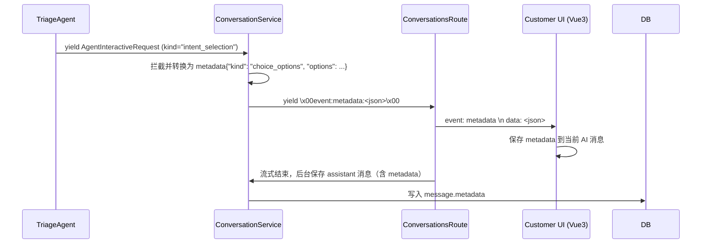

# S0 意图识别 4+1 故障分类方案 B（结构化元数据渲染引擎）设计方案

本设计方案旨在通过**结构化元数据**替代前端正则表达式文本解析，彻底统一三 Agent 交互体验差异，实现高健壮性、完美历史持久化的极致用户体验。

---

## 1. 架构目标

1. **废弃正则匹配**：前端 `MessageBubble.vue` 彻底移除脆弱的 `/请回复|请选择/` 文本正则表达式匹配。
2. **结构化定义**：后端 `TriageAgent` 依然输出包含带圈数字 `①`-`⑤` 的原始对话，但其解析出的候选分类将被转换为 `metadata` 附加在当前 AI 消息中。
3. **元数据驱动渲染**：前端 `MessageBubble.vue` 直接读取 `message.metadata`，当检测到 `metadata.kind === 'choice_options'` 时，百分之百高保真渲染为按钮与补充信息输入框。
4. **历史高保真还原**：由于元数据持久化存入 PostgreSQL 消息表，页面刷新加载历史记录时，选项的高亮与置灰状态将自动恢复，消除了微秒级落库竞争带来的乱序与 LLM 拒答问题。

---

## 2. 方案详解与数据流图



---

## 3. 具体修改细节

### 3.1 对话服务后端 (backend/conversation-service)

#### ① [conversation_service.py](file:///mnt/d/aihci/hci-troubleshoot-platform/backend/conversation-service/app/services/conversation_service.py)
* 在 `stream_message` 期间定义 `_message_metadata` 字典用于实时累加流式期间遇到的消息元数据。
* 拦截 `interactive_request` 且 `kind == "intent_selection"`：
  - 更新 `_message_metadata.update({"kind": "choice_options", "options": agent_event.get("options")})`。
  - 向流中 yield 内部事件 `\x00event:metadata:{_json.dumps(_message_metadata, ensure_ascii=False)}\x00`。
  - 跳过此交互式事件向 message 表的独立落库与多发发送（规避双气泡卡片冲突）。
* 修改 `save_assistant_message()` 与 `save_assistant_message_for_resume()`：
  - 支持 `metadata: dict | None = None` 参数传入。
  - 传导 `metadata` 至 `ConversationRepository` 的 `add_message()` 中完成入库。

#### ② [conversations.py](file:///mnt/d/aihci/hci-troubleshoot-platform/backend/conversation-service/app/routes/conversations.py)
* `event_generator()` 在 SSE 流式通道中识别特殊的内部 `metadata` 事件：
  - 透传原始元数据 JSON 事件流给前端：`yield f"event: {evt_type}\ndata: {evt_data}\n\n"`。
  - 实时更新本地协程中的 `_message_metadata`。
* 在最终正常流结束及异常/取消流处理中，在后台任务 `save_assistant_message` 调用中传入收集到的 `metadata=_message_metadata`。

---

### 3.2 客户端前端 (frontend/customer)

#### ① [chat.ts](file:///mnt/d/aihci/hci-troubleshoot-platform/frontend/customer/src/stores/chat.ts)
* `streamAIResponse()` 在 SSE 解码和单行 line 处理中监听 `pendingEventType === 'metadata'`：
  - 动态反序列化 `data` 为 JSON 结构。
  - 实时更新或合并至当前流式 AI 消息对象的 `metadata` 中：
    ```typescript
    messages.value[idx2].metadata = {
      ...(messages.value[idx2].metadata || {}),
      ...event,
    }
    ```

#### ② [MessageBubble.vue](file:///mnt/d/aihci/hci-troubleshoot-platform/frontend/customer/src/components/MessageBubble.vue)
* 彻底废除基于普通文本的正则表达式分行解析计算属性（即旧的 `choiceOptions` 对 `content` 的 split 与 regex 检测）。
* 重构为纯粹的结构化元数据读取与映射：
  ```typescript
  const choiceOptions = computed<ChoiceItem[]>(() => {
    const metadata = props.message.metadata as any
    if (metadata?.kind === 'choice_options') {
      return (metadata.options || []).map((opt: any) => {
        const id = String(opt.optionId)
        const labelMap: Record<string, string> = {
          '1': '①', '2': '②', '3': '③', '4': '④', '5': '⑤',
          '6': '⑥', '7': '⑦', '8': '⑧', '9': '⑨'
        }
        return {
          label: labelMap[id] || id,
          title: opt.name,
        }
      })
    }
    return []
  })
  ```
* 利用 `(props.message.metadata as any)` 绕过严格模式下 vue-tsc 的 TS2339 编译校验错误，保证完美发布打包。
