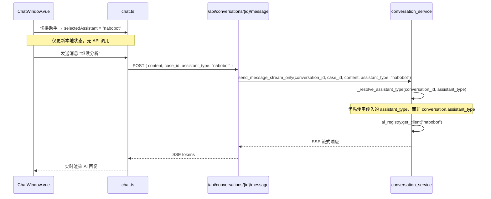

# AI 助手选择器交互优化方案 — 支持对话中动态切换

## 背景与需求

[引用需求文档](../../requirement/events/2026-04-17-助手切换优化.md)

**核心问题**：当前助手选择器只在「创建工单」时显示，用户无法在对话过程中切换助手。

**用户需求**：支持随时切换，无缝衔接，保留对话历史。

## 方案概述 (WHAT)

将助手选择器从「工单创建对话框」移至「对话界面顶部」，打通后端已有的动态切换参数传递链路，实现用户在任意对话轮次切换助手。

```
当前设计                          优化后设计
┌─────────────────┐               ┌─────────────────┐
│ 工单创建对话框   │               │ 对话界面顶部    │ ← 助手选择器
│ ┌─────────────┐ │               │ [OpenClaw ▼]    │ ← 当前助手状态
│ │ AI助手选择  │ │               │ ┌─────────────┐ │
│ └─────────────┘ │               │ │ 消息历史    │ │
│ ┌─────────────┐ │               │ │ ...         │ │
│ │ 标题/描述   │ │               │ │ 用户: ...   │ │
│ └─────────────┘ │               │ │ AI: ...     │ │
└─────────────────┘               │ └─────────────┘ │
                                  │ ┌─────────────┐ │
                                  │ │ 输入框      │ │
                                  │ └─────────────┘ │
                                  └─────────────────┘
```

## 详细设计

### 3.1 UI 位置选择方案对比

| 方案 | 优点 | 缺点 | 适用性 |
|------|------|------|--------|
| **A：对话界面顶部**（推荐） | 最醒目、始终可见、符合「模型状态可见」原则 | 占用顶部空间 | ★★★★★ |
| B：输入区域左侧 | 靠近发送动作、切换方便 | 与输入框空间冲突、不够醒目 | ★★★☆☆ |
| C：消息区域悬浮按钮 | 不占用固定空间 | 需要点击展开、不够直观 | ★★☆☆☆ |
| D：保留工单创建对话框 | 不改动 UI | 只能在创建时选择、不满足需求 | ★☆☆☆☆ |

**选择方案 A**：助手选择器放置在对话界面顶部，消息区域上方。

### 3.2 数据流设计



### 3.3 后端参数传递链路

**当前状态**（已支持，无需新增 API）：

```python
# conversation_service.py 第 225 行
async def send_message_stream_only(
    self, conversation_id: uuid.UUID, case_id: str, content: str,
    assistant_type: str | None = None  # ← 参数已存在
)

# 第 444-454 行
async def _resolve_assistant_type(...):
    """优先使用显式参数，否则回退到 conversation.assistant_type"""
    if assistant_type:       # ← 如果传入则优先使用
        return assistant_type
    ...
```

**需要打通的链路**：

| 层级 | 当前状态 | 需要修改 |
|------|----------|---------|
| Schema (`MessageCreate`) | 无 `assistant_type` 字段 | **新增** `assistant_type: str | None = None` |
| Route (`send_message`) | 不传递该参数 | 从 request body 提取并传递 |
| Frontend (`chat.ts`) | 不传递该参数 | 发送消息时携带 `selectedAssistant` |

### 3.4 前端组件改造

**ChatWindow.vue 改造**：

```vue
<!-- 助手选择器（移至对话界面顶部）-->
<div class="assistant-selector-bar" v-if="chatStore.showAssistantSelector">
  <span class="current-assistant-label">当前助手：</span>
  <el-select v-model="chatStore.selectedAssistant" size="small" style="width: 200px">
    <el-option v-for="a in chatStore.assistants" :key="a.type" :label="a.display_name" :value="a.type" :disabled="!a.available">
      <!-- 保留 PR #171 的 capabilities 标签设计 -->
    </el-option>
  </el-select>
  <!-- 切换提示（可选）-->
  <transition name="fade">
    <span class="switch-hint" v-if="showSwitchHint">已切换到 {{ currentAssistantName }}</span>
  </transition>
</div>

<!-- 消息区域 -->
<div class="messages-area">...</div>
```

**chat.ts 改造**：

```typescript
async function sendMessage(content: string) {
  ...
  // 发送消息时携带当前选中的助手类型
  const response = await fetch(`/api/conversations/${conversationId}/message`, {
    method: 'POST',
    body: JSON.stringify({
      case_id: currentCase.case_id,
      role: 'user',
      content,
      assistant_type: selectedAssistant.value,  // ← 新增参数
    }),
  })
  ...
}
```

### 3.5 工单创建对话框简化

移除助手选择器（避免重复选择）：

```vue
<!-- 工单创建模板对话框 -->
<el-dialog v-model="chatStore.showCaseTemplate" title="创建工单">
  <el-form>
    <el-form-item label="工单标题">...</el-form-item>
    <el-form-item label="问题描述">...</el-form-item>
    <!-- 移除 AI 助手选择器 -->
  </el-form>
</el-dialog>
```

**逻辑说明**：工单创建时不再选择助手，默认使用对话界面中用户选择的助手。

## 决策依据 (WHY)

### 4.1 为什么选择方案 A（对话界面顶部）？

**第一性原理分析**：

| 原始需求 | 设计响应 |
|---------|---------|
| 用户需要随时知道当前助手 | 顶部位置最醒目，符合「模型状态可见」原则（OrangeLoops 2025） |
| 用户需要随时切换 | 始终可见的选择器，一键切换无需展开 |
| 切换要简单直观 | 下拉选择，与 VS Code Copilot 模型切换一致 |

**业界最佳实践参考**：

- **Cursor**：模型选择器在输入区域右上角，始终可见
- **VS Code Copilot**：模型切换在对话界面顶部
- **JetBrains AI**：建议「提供实时模型可用性参考」

### 4.2 为什么选择「无缝切换（保留历史）」而非「新建对话分支」？

| 方案 | 优点 | 缺点 | 为什么不适合 HCI 场景 |
|------|------|------|---------------------|
| **无缝切换**（选中） | 流畅体验、符合排障场景 | 不同模型上下文理解能力不同 | HCI 排障是连续问题分析，上下文连贯性更重要 |
| 新建对话分支 | 上下文清晰隔离 | 需确认、打断流程、增加复杂度 | 排障场景不希望「重新开始」，而是「继续分析」 |
| 切换后清空历史 | 简单 | 丢失上下文、用户体验差 | 不适合排障场景 |

**核心判断**：HCI 排障是**连续诊断过程**，用户切换助手是想「换个视角继续分析」，而非「重新开始」。

### 4.3 为什么不需要新增 API？

**后端能力审计**：

```python
# 已存在：send_message_stream_only 接受 assistant_type 参数
# 已存在：_resolve_assistant_type 优先使用传入参数
# 已存在：ai_registry.get_client 支持动态切换
```

**结论**：后端已具备动态切换能力，只需打通前端→后端的参数传递链路。这是**最小改动方案**，符合第一性原理。

### 4.4 为什么移除工单创建时的助手选择？

| 原因 | 说明 |
|------|------|
| 避免重复 | 对话界面已可随时切换，创建时选择意义减弱 |
| 降低认知负担 | 用户创建工单时只需关注问题描述，减少决策点 |
| 灵活性更好 | 用户可在对话中根据实际情况选择，而非预先猜测 |

## 影响范围

### 受影响的模块

| 模块 | 影响 |
|------|------|
| `backend/shared/models/schemas.py` | 新增 `assistant_type` 字段到 `MessageCreate` |
| `backend/conversation-service/app/routes/conversations.py` | 传递 `assistant_type` 参数 |
| `frontend/shared/src/types.ts` | 新增 `assistant_type` 字段到 `MessageCreate` 类型 |
| `frontend/customer/src/stores/chat.ts` | 发送消息时携带 `assistant_type` |
| `frontend/customer/src/components/ChatWindow.vue` | 助手选择器移至对话界面顶部 |

### 需要更新的文档

- [ ] `docs/solution/custom-ui/客户端设计.md` — 更新助手选择器章节
- [ ] `docs/solution/ai-assistant/AI助手设计.md` — 更新交互流程说明
- [ ] `docs/solution/接口设计.md` — 更新 `MessageCreate` schema
- [ ] `README.md` 第一屏 — 更新功能说明

### API兼容性

| 方面 | 说明 |
|------|------|
| **向后兼容** | `assistant_type` 为可选字段，默认 `None`，旧客户端无影响 |
| **无破坏性变更** | 不新增/删除端点，只扩展请求体 |
| **前端兼容** | 新字段可选，旧版本前端不发送该字段时行为不变 |

## 实施计划

详细任务在 task 阶段展开，概述关键步骤：

1. **后端改造**：扩展 Schema + 路由传递参数
2. **前端改造**：助手选择器移位 + 发送消息携带参数
3. **文档同步**：更新设计文档和接口文档

## 风险与缓解

| 风险 | 影响 | 概率 | 缓解措施 |
|------|------|------|---------|
| 不同模型上下文理解能力不同 | 中 | 高 | 切换后显示提示「已切换到 XXX，基于历史继续分析」 |
| 用户频繁切换导致混乱 | 低 | 低 | 记录切换事件，后续分析优化 |
| API 参数遗漏导致切换失效 | 中 | 中 | 单元测试覆盖参数传递链路 |

## 测试策略

### 单元测试
- `MessageCreate` schema 验证：`assistant_type` 可选
- `send_message` 路由：正确提取并传递 `assistant_type`
- `_resolve_assistant_type`：优先使用显式参数

### 集成测试
- 前端发送消息携带 `assistant_type`
- 后端正确切换到指定助手
- SSE 流式响应正常

### 人工测试
- 切换助手后对话历史保留
- 新助手响应正确
- UI 显示当前助手状态

## 验收标准

- [ ] 助手选择器在对话界面顶部显示（有多个可用助手时）
- [ ] 用户可在任意对话轮次切换助手
- [ ] 切换助手后发送新消息，新助手响应
- [ ] 对话历史完整保留
- [ ] 工单创建对话框中不再有助手选择器
- [ ] API 向后兼容（旧客户端行为不变）

---

*文档版本: v1.0 | 创建: 2026-04-17 | 状态: 待确认*