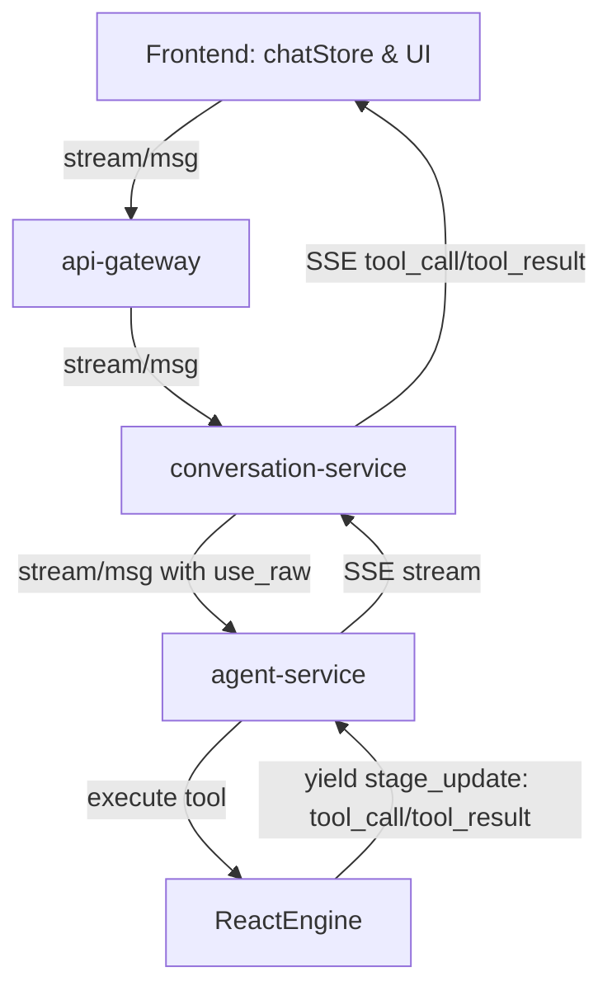

# 工具调用可视化、交互卡片重构与原始环境注入设计方案

本方案基于**第一性原理**和**现代 AI 智能体设计范式**，对 HCI 智能排障平台进行深度重构，以解决排障工具调用黑盒、交互体验差和环境数据加工损耗等问题。

---

## 1. 深度分析与第一性原理 (First-Principles Analysis)

### 1.1 工具调用黑盒与自动执行 (Tool Visibility & Auto-Execution)
- **现状与痛点**：当前 Agent 在后台执行工具调用时，对用户是一个黑盒。一旦工具发生超时、权限不足或内部异常，用户无法及时感知，只看到“分析中...”的载入动画。
- **第一性原理**：工具调用是 Agent 与客观现实发生实质交互的唯一窗口（Act-Observe 阶段）。其执行过程必须被还原为第一等公民（First-class citizen），在对话流中展示完整生命周期：
  1. **初始化**：宣布工具名称、LLM 提供的入参以及推理依据。
  2. **确认挂起**（若未设置自动执行）：提供交互开关控制权，由用户进行安全性把关。
  3. **执行中**：展示流式的进度指示和时间计数。
  4. **执行完成**：展示执行时间、退出码以及原始的标准输出/标准错误。
- **自动执行范式**：结合业界主流 Agent（如 AutoGen、Claude Code）的设计，我们在前端引入一个全局的“自动执行（Auto-Run）”开关：
  - **启用**时，安全只读工具（risk=1）和已获授权的中度风险工具（risk=2）在页面呈现卡片并以进度条展示其运行，系统在后台自愈/自动流转，提升排障速度。
  - **禁用**时，所有工具调用均在页面产生暂停确认组件（Approved/Rejected），最大化确保运维安全。

### 1.2 变量交互重新设计 (User Variable Redesign)
- **`user_input` 痛点**：当前采用通用的自由文本多行输入区，没有任何类型约束、必填说明和正则（validation_pattern）的验证，导致输入值非法后 Agent 在下一步报错中断，极大地增加了认知负担。
- **`user_confirm` 痛点**：对于系统能自动检测/推断变量值但需要用户确认（user_confirm 策略）的场景，仍展示为一个全尺寸空白文本输入框。用户的正确交互链路应为“推荐值无误一键确认”或“微调后提交”，现有的高成本输入设计严重阻碍了操作心流。
- **交互重设计范式**：
  - **`user_input`**：升级为**行内交互式表单卡片**。实时检查变量的 required 属性与 validation_pattern，输入框失焦后以红框及警告文字提示格式错误，不符合正则时禁用提交按钮，把错误拦截在第一线。
  - **`user_confirm`**：升级为**双栏推荐验证卡片**。左侧大字号加粗高亮展示系统检测的**推荐值**（附带“一键确认”绿色大按钮），右侧为文本修改区（附带“提交修改”蓝色按钮），将 90% 以上的一致性校验耗时缩减至一次点击。

### 1.3 原始环境数据注入 (Raw Environment Injection)
- **现状与痛点**：当前 `env_injection` 在后端经过了字段清洗和映射提取（仅提取 top 10，进行了文本截断，改写了时间格式），这抹杀了一些包含微弱但关键故障特征的日志（例如被 truncate 丢掉的报错堆栈、发生过滤被丢掉的关联硬件告警）。
- **第一性原理**：LLM 具备极强的非结构化/复杂结构数据提取与推理能力。预加工的数据极易丢失背景语境，应该直接传递原始的（DB JSONB 中存储的）告警列表与任务列表。
- **设计范式**：
  - 默认开启原始数据传递。直接拉取 `environment` 数据库表的 raw 数据，在 S0 推理时以 JSON Block（`json.dumps`）形式喂给模型，提供 100% 原始全量上下文。
  - 对原有映射提取模块进行保留作为兼容备用，通过配置开关 `USE_RAW_ENVIRONMENT_CONTEXT` 自由切换，在 `_resolve_env_variable` 中以“向下兼容层”映射 raw 字段。

---

## 2. 拟修改的组件与文件 (Proposed Changes)



### 2.1 共享模型定义与后端服务

#### [MODIFY] [schemas.py](file:///aihci/hci-troubleshoot-platform/backend/shared/models/schemas.py)
- 在 `MessageCreate` schema 中新增可选字段 `auto_execute: bool | None = None`，用于前端传递当前会话的自动执行状态。

#### [MODIFY] [agent_port.py](file:///aihci/hci-troubleshoot-platform/backend/agent-service/app/domain/agent_port.py)
- 在 `ToolResultEvent` 的注释中更新，不再仅仅作为 ReactEngine 内部事件，而是允许作为流程事件通过 stage_update 结构向外 yield。

#### [MODIFY] [react_engine.py](file:///aihci/hci-troubleshoot-platform/backend/agent-service/app/adapters/agents/htp/react_engine.py)
- 在 `_execute_tool_call` 方法中：
  - **工具执行前**：生成统一的 `exec_id = str(uuid.uuid4())`，并 `yield AgentStageUpdate(stage="tool_call", metadata={"exec_id": exec_id, "tool_name": tool_name, "args": tool_args, "risk_level": tool_def.risk_level, "status": "running" or "pending"})`。
  - 如果是需要确认的工具，先 yield `status="pending"`，再触发 `request_confirm`，确认通过后更新状态为 `status="running"` 并 yield，确认取消则更新为 `status="cancelled"`。
  - 将生成的 `exec_id` 显式作为参数传入 `active_executor.execute(..., exec_id=exec_id)`。
  - **工具执行后**：捕获执行结果，`yield AgentStageUpdate(stage="tool_result", metadata={"exec_id": exec_id, "tool_name": tool_name, "status": "success" or "failed", "result": str(result), "error": error, "duration_ms": duration_ms})`。

#### [MODIFY] [executor.py](file:///aihci/hci-troubleshoot-platform/backend/agent-service/app/tools/acli/executor.py)
- 修改 `BridgeRelayExecutor.execute` 的方法签名，支持传入 `exec_id: str | None = None` 参数。如果传入，则优先使用传入的 `exec_id` 作为当前执行流水号，以确保 `react_engine` 的 tool_call 事件 ID 与 SSH 终端调用的事件 ID 完美绑定一致。

#### [MODIFY] [sop_tools.py](file:///aihci/hci-troubleshoot-platform/backend/agent-service/app/adapters/agents/htp/sop_tools.py)
- 修改 `SopToolExecutor.execute` 的方法签名，添加 `**kwargs: Any` 以容纳并安全透传 `exec_id` 参数给默认执行器。

#### [MODIFY] [main.py](file:///aihci/hci-troubleshoot-platform/backend/agent-service/app/main.py)
- 修改 `CompositeToolExecutor.execute` 的方法签名，添加 `**kwargs: Any` 收集 `exec_id`，并透传给 `_bridge_executor.execute(..., exec_id=exec_id)`。

#### [MODIFY] [triage_agent.py](file:///aihci/hci-troubleshoot-platform/backend/agent-service/app/adapters/agents/htp/triage_agent.py)
- 修改 `_build_s0_prompt` 方法：
  - 检查 `env_context` 中是否存在 `is_raw: True` 标志。
  - 若为原始环境数据，则使用 `json.dumps(..., ensure_ascii=False, indent=2)` 对 `env_info`、`alert_logs`、`task_logs` 进行格式化输出，以 JSON 块格式注入 S0 rules 模板中。

---

### 2.2 conversation-service 路由与业务层

#### [MODIFY] [agent_client.py](file:///aihci/hci-troubleshoot-platform/backend/conversation-service/app/services/agent_client.py)
- 在 `AgentClient` 中，新增 `get_raw_environments(self, case_id: str) -> dict[str, Any] | None` 方法，调用 case-service 的 `GET /api/environments/case/{case_id}` API。
- 接收 `items` 数据并转化为以 `env_type` 为 Key、`env_data` 为 Value 的原始环境数据字典。

#### [MODIFY] [conversation_service.py](file:///aihci/hci-troubleshoot-platform/backend/conversation-service/app/services/conversation_service.py)
- 在 `send_message_stream_only` 及 `resume_ops_agent_stream` 的 SSE 推送循环中：
  - 当拦截到 `event_type == "stage_update"` 且 `_stage` 为 `"tool_call"` 或 `"tool_result"` 时，将 `_metadata` 序列化为 JSON 字符串，以 `yield f"\x00event:{_stage}:{_payload}\x00"` 格式直接推送给前端。
- 在构建 `env_context` 逻辑中（约 317 行）：
  - 检查 `settings.USE_RAW_ENVIRONMENT_CONTEXT`。
  - 若为 `True`，调用 `get_raw_environments` 获取集群、告警、任务日志的原始数据，构造 `context_info`（设置 `is_raw=True`），直接透传给 `agent_client`；否则 fallback 回原有的提取模式。

#### [MODIFY] [sop_execution.py](file:///aihci/hci-troubleshoot-platform/backend/conversation-service/app/routes/sop_execution.py)
- 修改 `_resolve_env_variable` 方法以兼容原始环境数据集：
  - 自适应处理 `env_context` 是 `EnvironmentContextResponse` 对象还是字典结构。
  - 若 `is_raw` 为 `True`：
    - 针对 `env_info`：将原始 cluster info 的 `name`/`mcastaddr` 对应映射注入至 `cluster_name` 和 `network_config` 中。
    - 针对告警日志：对于提取到的原始告警，在字段中动态映射并补充 `level` 和 `time`（由 `urgent_type` 和 `end` 转换而来）。
    - 针对任务日志：对于提取到的原始任务，在字段中动态映射并补充 `status` 和 `time`（由 `status` 整数和 `end` 转换而来）。
  - 这保证了在原始数据流转下，所有的 `env_injection` 变量提取策略无需修改 SOP 即可保持 100% 正确运行。

---

### 2.3 前端 UI 及交互设计

#### [MODIFY] [chat.ts](file:///aihci/hci-troubleshoot-platform/frontend/customer/src/stores/chat.ts)
- 在 `streamAIResponse` 方法中增加对 `tool_call` 和 `tool_result` 事件的处理：
  - **`tool_call`**：当收到 `tool_call` 事件时，在当前消息列表中追加（或更新）一个 metadata kind 为 `"tool_call"` 的助手消息卡片，用于页面渲染。如果 status 为 `"pending"`，根据全局的自动执行模式进行校验：若符合自动执行等级要求（如 `aggressive` 下且风险等级 <= 2，或 `safe-only` 下 risk_level <= 1），则前端立即发起静默 POST 交互响应自动确认，无需用户点击。
  - **`tool_result`**：当收到 `tool_result` 事件时，在消息列表中找到对应 `exec_id` 的卡片，更新其 status 状态为成功/失败、注入输出/错误日志及耗时。

#### [MODIFY] [MessageBubble.vue](file:///aihci/hci-troubleshoot-platform/frontend/customer/src/components/MessageBubble.vue)
- **增加 Tool Call Card 渲染区**：
  - 当消息 metadata 的 `kind === 'tool_call'` 时，渲染为高级工具执行卡片：
    - **Header**：展示工具名称（如 `acli_exec`）及当前状态图标（Pending 橙色、Running 蓝色闪烁旋转、Success 绿色、Failed 红色）。
    - **Body**：
      - 显示命令原因。
      - 折叠面板渲染 LLM 入参 JSON。
      - 对于 SSH 类工具，如果有实际标准输出/标准错误，渲染为黑底 Collapsible Terminal Console 样式，展示命令执行回显。
      - 如果 status 为 `"pending"` 且需要人工介入，展示“确认执行”和“取消”操作按钮。
- **重构 `variable_input` 交互卡片**：
  - Renders inline in the chat bubble.
  - 基于 HSL 配色方案的美观表单：展示变量描述及“格式要求（如 regex 校验说明）”。
  - 输入框绑定失焦/实时格式校验。根据 `validation_pattern` 正则对输入进行匹配校验，如果不符合正则或未填必选项，输入框展示红色边框并浮现错误提示信息，同时禁用“提交变量值”按钮。
- **重构 `variable_confirm` 交互卡片**：
  - 展示为双栏对比验证框。
  - 左侧渲染系统推荐值（绿色大圆角背景），下方包含“一键确认并提交推荐值”大按钮，方便用户快速确认，避免任何键盘输入。
  - 右侧提供文本微调修改输入框，绑定格式校验，下方包含“提交修改值”大按钮。

---

## 3. 验证方案 (Verification Plan)

### 3.1 自动化测试 (Automated Tests)
1. 格式化和质量检查：
   ```bash
   make lint
   ```
2. 运行 backend/conversation-service 的单元测试，验证 `_resolve_env_variable` 在 is_raw 模式下的变量映射及还原正确性：
   ```bash
   uv run pytest backend/conversation-service/tests/unit/test_sop_execution_env_injection.py
   ```
3. 运行整个平台的测试套件：
   ```bash
   make test
   ```

### 3.2 手动验证 (Manual Verification)
1. 在聊天框上方观察新引入的“自动执行命令”开关（可配置模式：Off / Safe-only / Aggressive）。
2. 在工单诊断时，故意关闭自动执行：
   - 确认当 AI 执行查询工具（如 `get_active_alerts`）时，聊天区域流式呈现“工具调用：get_active_alerts（等待执行）”卡片。
   - 点击“确认执行”，观察卡片状态在 1 秒内变为“执行中（Spinner）”，随后返回结果，卡片状态更新为“执行成功”且可展开查看输出日志。
3. 当命中 SOP 需要变量输入时：
   - 故意输入不符合 `validation_pattern` 正则规则的值，检查表单是否能够实时报错并禁用提交按钮。
   - 遇到 `variable_confirm` 节点时，验证是否能够点击“一键确认推荐值”一秒无感提交，流程恢复运行。
4. 开启 aggressive 自动执行：
   - 诊断同样的问题，检查所有工具执行卡片是否自动滑过，在 1 秒内自动触发 confirm 提交并自动运行，全流程流畅无卡顿，且聊天卡片实时记录每一项工具的输入输出以供追溯。
