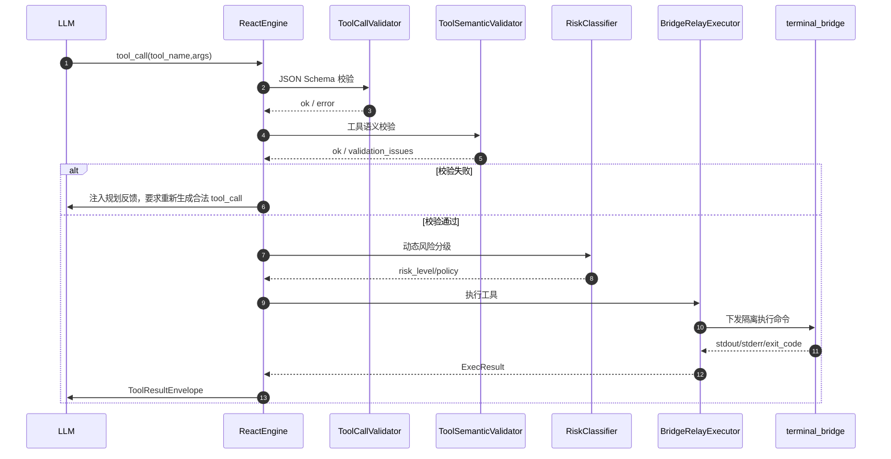

# bash_exec 容器化契约与工具调用前置校验方案

## 背景与需求

关联需求：[工具执行契约与前置校验增强需求](../../requirement/events/2026-06-11-工具执行契约与前置校验增强需求.md)。

当前工具链路已经具备 Bridge Relay 和 terminal_bridge 双通道隔离执行能力，但工具契约仍偏向“自由字符串命令”。从第一性原理看，Agent 工具不是聊天文本的附属品，而是系统对外部世界施加动作的唯一通道。工具契约必须表达清楚三件事：

1. **动作是什么**：执行哪个工具、什么命令、为了什么诊断目的。
2. **动作在哪里发生**：目标节点、目标容器、执行边界。
3. **动作是否允许发生**：结构校验、语义校验、风险策略、授权状态。

如果容器边界藏在 `command` 字符串里，系统无法可靠审计和控制执行范围；如果 aCLI 命令只靠真实执行报错纠正，Agent 会把低级拼写错误、缺容器错误暴露给用户；如果 stderr 被解析异常覆盖，用户和 LLM 都会失去最关键的失败证据。

## 方案（WHAT）

### 总体架构

新增“执行前语义校验层”，位于 LLM tool_call 规划结果和真实执行器之间。



### `bash_exec` v2 工具契约

`bash_exec` 从自由命令工具升级为“容器边界明确的 Bash 执行工具”。面向 LLM 的 schema：

```json
{
  "type": "object",
  "properties": {
    "container": {
      "type": "string",
      "enum": ["asv-con", "vn-con", "vn-agent", "vs-cp-manager"],
      "description": "目标容器，必须显式指定"
    },
    "command": {
      "type": "string",
      "description": "容器内执行的只读 Bash 命令，不允许包含 docker exec/kubectl exec/nsenter/acli 前缀",
      "minLength": 1,
      "maxLength": 2000
    },
    "node_ip": {
      "type": "string",
      "description": "目标节点 IP 或主机名（可选），不填时从上下文读取"
    },
    "reason": {
      "type": "string",
      "description": "执行该命令的诊断原因（审计必填）",
      "minLength": 1
    }
  },
  "required": ["container", "command", "reason"],
  "additionalProperties": false
}
```

底层执行不允许复用 LLM 的容器进入文本。服务端新增 `ContainerCommandBuilder`：

```text
bash_exec args
  -> 校验 container enum
  -> 校验 command 不包含容器进入前缀
  -> 根据 HCI 运行时适配器拼装实际命令
  -> CommandSanitizer / RiskClassifier
  -> BridgeRelayExecutor
```

实际执行命令的构造策略：

1. **首选 aCLI system 容器参数**：对能映射为 `acli system ...` 的命令，使用 aCLI 官方 `--container` 全局参数。aCLI 首页 `--help` 说明该参数仅对 `system` 下命令生效，枚举值为 `asv-con/vn-con/vn-agent/vs-cp-manager`。
2. **受控运行时适配器**：对无法映射为 aCLI system 的 Bash 片段，由服务端 `ContainerExecAdapter` 生成远端 shell wrapper。wrapper 在 terminal_bridge 的 SSH 目标节点上先探测 `docker`、`crictl`、`ctr`，确认目标容器可访问后再执行用户命令。LLM 不感知也不能控制该细节。
3. **无法确定运行时**：fail-closed。wrapper 输出 `[container_exec] unsupported container runtime or inaccessible container: <container>` 到 stderr 并 `exit 127`，不会执行用户命令。

PR-D 落地后，`ContainerCommandBuilder.build(container, command, node_context)` 返回 `BuiltCommand`：

- `container`：结构化目标容器。
- `original_command`：LLM 提供、经净化后的容器内命令。
- `built_command`：服务端拼装后下发给 terminal_bridge 的实际远端 wrapper。
- `runtime`：显式运行时或 `auto`。
- `probe_command`：远端运行时探测片段。

`BridgeRelayExecutor` 下发 `agent_exec_command` 时同步携带 `tool_name/container/original_command/built_command`；conversation-service SSE 事件透传这些字段；FactStore 工具执行事实写入 `stdout/stderr/exit_code/container/original_command/built_command`，保证审计链路可追踪。

### `ToolSemanticValidator`

新增 `ToolSemanticValidator`，输入为 `tool_name`、`args`、`tool_def`、会话上下文，输出统一结构：

```json
{
  "ok": false,
  "issues": [
    {
      "level": "error",
      "code": "BASH_CONTAINER_REQUIRED",
      "field": "container",
      "message": "bash_exec 必须指定目标容器",
      "suggested_fix": "选择 asv-con/vn-con/vn-agent/vs-cp-manager 之一"
    }
  ]
}
```

规则分层：

| 层级 | 职责 | 示例 |
|------|------|------|
| 通用 schema 层 | 必填、类型、enum、pattern | `container` 是否存在 |
| 工具语义层 | 工具特有边界 | `bash_exec.command` 禁止 `docker exec` |
| catalog 层 | 外部命令是否受支持 | `acli storage disk list` 不在 catalog |
| 风险层 | 是否 auto/confirm/block | `rm -rf` block |

### aCLI catalog 快照

新增 aCLI 命令 catalog 的离线快照机制：

```text
scripts/tools/sync_acli_catalog.py
  -> 拉取 http://acli.sangfor.com.cn:6888/commandList
  -> 解析表格中的 acli 命令和概述
  -> 生成 backend/agent-service/app/tools/acli/catalog/acli_command_catalog.json
  -> 记录 source_url、source_updated_at、generated_at、hash
```

运行时只读本地快照：

- catalog 文件存在：按快照校验。
- catalog 版本过旧：记录 warning 指标，但不阻断服务启动。
- catalog 缺失：服务启动 fail-fast 或进入显式降级模式，禁止放行未知 aCLI 命令。
- `acli ... --help`、`acli acli command list` 可作为探索命令特例放行。

### ReAct 自修正流程

校验失败时，不下发 `agent_exec_command`，不触发 terminal_bridge。ReactEngine 将校验失败作为工具规划反馈追加到 `work_messages`，继续下一轮 LLM 调用：

```text
【工具调用未通过执行前校验】
工具：bash_exec
错误：缺少必填 container。
要求：bash_exec 必须指定 asv-con/vn-con/vn-agent/vs-cp-manager 之一。
请重新思考并生成合法 tool_call；不要向用户报告为真实命令执行失败。
```

前端展示策略：

- 默认不创建“执行中”工具卡片。
- 可选创建“规划已拦截”折叠卡片，状态为 `validation_failed`，用于调试和审计。
- 真实执行卡片只在校验通过并进入执行阶段后创建。

### stderr 修复

`BridgeRelayExecutor` 在解析双通道结果时，应始终使用已归一化后的 `stdout/stderr` 判断退出码语义：

```python
check_text = f"{stdout}\n{stderr}".lower()
```

禁止在双通道分支引用旧单通道变量 `output`。当 `exit_code != 0` 时：

- `stderr` 保留远端真实错误。
- `ToolResultEnvelope.to_llm_message()` 包含 `[Stderr]`。
- 前端按现有能力渲染 `terminal-stderr`。
- 审计与 FactStore 写入结构化字段。

### 工具管理发布校验

工具管理不再只做 JSON 格式检查，后端新增校验接口：

```http
POST /api/v1/tools/validate
POST /api/v1/tools/{tool_id}/validate
```

校验结果复用 SOP 管理的 `validation_issues` 结构：

```json
{
  "status": "error",
  "validation_issues": [
    {
      "level": "error",
      "location": "parameters_schema.required",
      "message": "bash_exec 必须要求 container 为必填字段"
    }
  ]
}
```

UI 行为：

- 保存前自动校验。
- `error` 阻断保存。
- `warning` 允许保存但必须展示。
- 提供“校验工具定义”按钮，便于管理员编辑 schema 时即时反馈。

### SOP 发布联动校验

SOP 发布时复用同一校验器：

- 从 `Diagnosis.acli_methods`、`bash_methods` 或解析出的命令片段生成工具调用草案。
- 能映射为 `acli_exec` 的，按 catalog 校验。
- 能映射为 `bash_exec` 的，必须有 `container`，否则 warning 或 error。
- 校验结果写入 SOP 的 `validation_issues`，前端沿用现有告警弹窗展示。

落地实现（PR-C）采用 `kb-service` 内的轻量静态校验器，避免 `kb-service` 镜像运行时依赖 `agent-service` 代码目录：

- `backend/kb-service/app/services/sop_tool_contract_validator.py` 遍历已解析的 `SOPNode` 决策树。
- `diagnosis.acli_methods` 中以 `acli` 开头的命令基于本地 aCLI catalog 快照校验。
- `prerequisite_items.content_type == "command"` 的命令型前置检查按 bash 命令草案校验容器边界。
- 本阶段 fail-soft：生成 `warning` 并写入 `tree_validation_issues`，不阻断存量 SOP 发布；结构解析 error 仍按原逻辑阻断。
- `scripts/tools/sync_acli_catalog.py` 只更新 `backend/shared/resolution/catalogs/acli_command_catalog.json` 唯一权威快照，agent-service、kb-service 和 diagnosis-service 均随 shared 目录携带同一份数据。

## 决策依据（WHY）

### 方案对比

| 方案 | 优点 | 缺点 | 结论 |
|------|------|------|------|
| A. 只改 Prompt，要求 LLM 自觉写容器 | 成本低 | 不可审计，不可强制，遇到模型漂移会失效 | 不采用 |
| B. 在 `command` 字符串里要求写 `docker exec <container>` | 实现快 | 容器边界与命令混合，注入面大，运行时不可移植 | 不采用 |
| C. `bash_exec(container, command, reason)` + 服务端拼装 + 语义校验 | 边界清晰，可审计，可测试，可兼容多运行时 | 需要改 schema、执行器、测试和管理页 | 采用 |
| D. 删除 `bash_exec`，全部改用 `acli_exec system --container` | 安全面最小 | 覆盖不了所有底层日志和进程排障场景 | 暂不采用，可作为降级建议 |

### 为什么选择 C

容器是执行边界，不是命令文本。业界工具范式中，执行边界通常以结构化参数表达，例如 Kubernetes `kubectl exec` 使用 `-c/--container` 显式指定容器，而不是把容器名藏在用户命令片段里。对 Agent 系统来说，这一点更重要：只有结构化边界才能被 schema 校验、审计日志、风险策略和 UI 一致消费。

### 为什么 catalog 使用本地快照

aCLI 官方站是权威来源，但运行时诊断不能依赖外部站点实时可访问。把 catalog 快照提交到仓库，可以做到：

- 离线可用
- 版本可追溯
- CI 可校验
- 运行时稳定

同步脚本负责更新快照，人工 review catalog diff，避免外部文档变更直接影响生产执行。

### 为什么校验失败要让 LLM 重新规划

校验失败不是远端系统事实，而是 Agent 规划不合法。把它展示为真实工具执行失败会污染用户认知，也会污染 LLM 对现场状态的推理。正确做法是把校验失败作为 planner feedback 注入 ReAct 循环，让模型修正工具调用。

## 影响范围

### 后端

- `backend/agent-service/app/adapters/agents/htp/react_engine.py`
- `backend/agent-service/app/tools/acli/executor.py`
- `backend/agent-service/app/tools/acli/classifier.py`
- 新增 `backend/agent-service/app/tools/acli/semantic_validator.py`
- 新增 `backend/agent-service/app/tools/acli/catalog/`
- `backend/conversation-service/app/routes/tool_definition.py`

### 前端

- `frontend/admin/src/views/ToolManageView.vue`
- `frontend/customer/src/components/MessageBubble.vue`
- `frontend/customer/src/stores/chat.ts`

### 数据与文档

- `database/seeds/01_tool_definitions.sql`
- `docs/solution/agent/agent工具设计.md`
- `docs/task/agent/agent工具任务清单.md`
- `docs/verify/测试指南.md`

## 验收标准

- [x] `bash_exec` schema 中 `container` 为 required 且 enum 完整。
- [x] 校验失败不会产生 `agent_exec_command` SSE，也不会调用 terminal_bridge。
- [x] 校验失败能触发 LLM 至少一次重新规划。
- [x] 不支持的 aCLI 命令被 catalog 拦截。
- [x] 支持的 aCLI 命令保持现有执行链路。
- [x] 双通道 stderr 在 `exit_code != 0` 时被保留并传递给工具结果。
- [ ] 工具管理页可显示工具契约校验问题。
- [ ] SOP 发布可显示命令可执行性校验问题。

## 风险与缓解

| 风险 | 影响 | 缓解措施 |
|------|------|----------|
| 现场 HCI 容器运行时差异 | `bash_exec` 拼装命令不可移植 | 通过 `ContainerExecAdapter` 分版本封装，LLM 不感知 |
| catalog 过期 | 新命令误拦截 | 提供同步脚本、catalog 版本提示、允许 `--help` 探索命令 |
| 校验过严导致诊断受阻 | Agent 无法探索 | 对探索命令设白名单，对不确定规则先 warning 后逐步收紧 |
| 工具管理保存阻断过多 | 运维体验下降 | 保存前即时校验，error/warning 分级 |

## 实施顺序

1. 修复 stderr 解析缺陷。
2. 更新 `bash_exec` schema 与 seed。
3. 引入 `ToolSemanticValidator` 的 `bash_exec` 基础规则。
4. 引入 aCLI catalog 快照与 `acli_exec` 命令路径校验。
5. 改造 ReactEngine 校验失败自修正流程。
6. 工具管理校验 API 与 UI。
7. SOP 发布联动校验。
