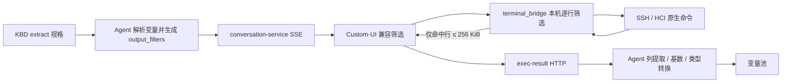

# KBD 27123 三信号执行闭环方案

## 背景与需求

关联工单：`Q2026072747493`；会话：`ca2d3c22-99fc-4bcf-8bd1-4636edce3164`；KBD：`support_id=27123`、`kbd_entry.id=1`。

表面现象像“Agent 卡住”，但日志、数据库和运行代码证明这是 KBD 数据瑕疵、Agent acquisition 语义、输出传输边界和 UI 事件契约四类问题叠加，不能用延长超时或修改一处文案解决。

## 事实证据

### 1. QKV 被预取上下文替代

`kbd_differential._execute_acquirer()` 优先读取工单创建时采集的 `task_logs`。因此 `sig_001` 没有执行 `qkv_exec()` 和 `task get`，只为把 `SVR_aCloud_670` 转成 IP 而执行了 `platform node list`。

本工单预取数据中的最新失败记录确实是：

```json
{
  "vm": "4359974862144",
  "host": "SVR_aCloud_670",
  "hostid": "host-70e284243e19",
  "status": 3,
  "end": "2026-07-27 21:19:37"
}
```

所以 `HOST=172.28.24.4` 对本工单是正确转换；错误在于它不是由 KBD 声明的可审计 acquisition 产生。

### 2. `lsof` 已执行，不是节点路由丢失

exec_id `a1e76e67-dc5c-5fac-9478-317c73726445` 的完整证据：

| 时间（UTC） | 事件 | 事实 |
|---|---|---|
| 15:16:20.950 | `agent_exec_push` | `node_ip=172.28.24.4` |
| 15:16:20.955 | `agent_exec_sse_pushed` | 命令已推送到浏览器 |
| 15:16:21.430 | `exec.request` | terminal_bridge 收到 `acli system lsof` |
| 15:16:42.098 | `exec.done` | exit=0，耗时 20.5 秒，stdout=39,377,898 字节，stderr=6,006 字节 |

之后没有任何 `/exec-result` 请求到达 API Gateway 或 conversation-service。

### 3. 浏览器在错误边界处理大输出

旧链路先把完整输出分成约 4 KiB WebSocket 帧，Custom-UI 使用 `buf.stdout += chunk` 反复拼接，形成 O(n²) 字符串复制；terminal_bridge 最后又发送一份完整 39 MB `exec_result`，浏览器随后尝试用 JSON/HTTP 回传。后端的 4 KiB 展示截断和 Redis 完整输出缓存发生在 HTTP 回传之后，已经无法保护前面的链路。

### 4. 工具卡片协议不一致

| Agent 发出 | UI 原读取 | 用户现象 |
|---|---|---|
| `tool_args` | `args` | 参数列表 `{}` |
| `tool_result` | `result` | 一直显示等待输出 |
| `completed` | `success` | 成功状态无法渲染 |
| `error` | `failed` | 失败状态无法渲染 |

### 5. KBD 数据自身不干净

- `sig_001` 同时存在空关键字 matcher 和 `VM/HOST/END` produces，违反生产者契约。
- `sig_003` 使用全量 `ps auxf` 加 PID 子串筛选，输出过宽且可能误命中。
- `sig_002` 的 `lsof` 可能多行包含同一 VM ID；选择 `first` 是本 KBD 的显式策略，避免把多文件描述符误判成多个不同故障。

## 归责结论

| 责任域 | 问题 | 是否本次根因 |
|---|---|---|
| KBD 27123 | QKV 残留空 matcher | 是，数据契约问题 |
| KBD 27123 | 第三步全量 `ps auxf` | 是，配置效率/歧义问题 |
| Agent | 预取 task_logs 静默替代 QKV | 是，缺少 acquisition 可审计性 |
| Agent/terminal_bridge/UI | 39 MB 输出在后端才提取 | 是，主要卡顿根因 |
| Agent/UI | `tool_args/tool_result` 与 `args/result` 不一致 | 是，参数空和等待文案根因 |
| terminal_bridge 节点路由 | 未执行 `lsof` | 否；日志证明已在目标节点成功执行 |
| 发布环境代码 | 旧 ConfigMap 覆盖 | 否；PR #629 后运行镜像与源码一致 |

## 方案（WHAT）

### 1. QKV acquisition 语义收紧

KBD 确定性诊断始终调用 `qkv_exec()`。环境预取事实仅服务 S0 分类或显式缓存，不再静默替代 KBD acquisition。QKV 关键词统一规范化：`启动虚拟机失败` → `keyword=启动虚拟机` + `is_failed=true`。

### 2. 安全行筛选前移到执行边界

新增 `output_filters` 协议，只包含：

```json
{
  "source": "stdout",
  "include": ["4359974862144"],
  "exclude": [],
  "include_mode": "all",
  "case_sensitive": true
}
```

terminal_bridge 逐行读取远端 stdout/stderr，原始字节只做本机扫描；只有命中行进入 WebSocket。协议不支持正则、命令、shell、grep、awk 或管道。筛选后仍超过 256 KiB 时返回 `QFK_EDGE_OUTPUT_LIMIT` 并 Fail Closed。

stdout、stderr 共用同一个 256 KiB 总预算，而不是每个流各 256 KiB；terminal_bridge 对规格再次执行白名单校验，非法规格返回 `QFK_EDGE_FILTER_INVALID`。stdout、stderr 与 bridge_log 的 WebSocket 写入统一串行，避免多 goroutine 在高输出场景下写帧交错。

Custom-UI 同时实现兼容筛选：旧 terminal_bridge 会忽略新字段并继续回传全量输出，UI 使用分块数组 O(n) 累积并按相同规则过滤，确保滚动升级期间不会再次冻结或提交 39 MB HTTP 请求。新 bridge 与新 UI 同时生效时，二次字面量筛选是幂等的。



### 3. 工具生命周期统一

- 标准字段：`args`、`result`、`status=running|success|failed|blocked|cancelled`。
- 滚动发布期间保留 `tool_args/tool_result` 别名；UI 也做一次兼容归一化。
- conversation-service 按稳定 `exec_id` upsert `tool_result`，不再只持久化 pydantic-ai。
- 主消息流与 resume 流都执行相同的 upsert 和前端归一化，避免交互恢复后再次出现空参数/永久 running。
- SSE 结束时仍为 `running` 的卡片立即收敛为 `failed`，提示重新执行，不留下无限等待状态。

### 4. KBD 保存与运行时双门禁

- QKV：必须有有效 produces 且 `match=null`。
- QFK：match 与 produces 必须且只能选一个。
- 保存时 JSON Schema 语义校验返回 422；分类快照运行门禁再次校验，防止旧脏数据自动执行。

### 5. KBD 27123 最终配置

| 信号 | 命令/查询 | 产出 | 关键配置 |
|---|---|---|---|
| sig_001 | `task get -k 启动虚拟机 -s failed -l 1` | VM/HOST/END | `match=null` |
| sig_002 | `acli system lsof`，host 容器 | PID | include VM、column 2、cardinality=first |
| sig_003 | `acli system ps -p {{PID}} -o pid=,args=` | PNAME | 定向查询 PID，exactly_one |

当前环境已通过 KBD 管理 API 发布 revision 17，没有直接 SQL 修改业务数据。

## 决策依据（WHY）

### 为什么不只延长超时

命令 20.5 秒已正常完成，120 秒超时真实生效；失败发生在 39 MB 输出传输和浏览器处理阶段。延长超时会让错误等待更久。

### 为什么不在后端继续做完整输出缓存

后端只有收到 HTTP 回传后才能缓存，而本次数据在到达 HTTP 前已经冻结浏览器。必须把缩减操作前移到数据产生边界。

### 为什么不开放 grep/awk

用户意图只有“选行、取列”。开放 shell 组合会扩大注入面、转义复杂度和审核成本。结构化字面量筛选能覆盖同一意图，并可在每层验证和审计。

### 为什么保留 UI 兼容筛选

terminal_bridge 是客户机本地程序，不能和服务 Pod 原子升级。双层相同协议使旧 bridge + 新 UI 也能工作；等用户下载新 bridge 后，原始大输出不再离开本机。

### 为什么第三步改为 `ps -p`

原生命令参数能够在数据源直接缩小结果集，优先级高于事后筛选。只有 lsof 无法按未知完整路径直接参数化时，才使用安全行筛选。

## 影响范围

- agent-service：KBD acquisition、QFK edge filter、工具事件字段。
- conversation-service：agent-exec 协议、工具审计持久化。
- customer-ui：事件归一化、大输出 O(n) 缓冲、旧 bridge 兼容筛选、流中断收敛。
- terminal_bridge：逐行安全筛选和 256 KiB 上限。
- kb-service/shared schema：QKV/QFK 双门禁。
- KBD 27123：revision 17。

## 验收标准

见需求文档和对应验证报告；必须使用新工单/新会话验证，不能复用被旧流取消的 `Q2026072747493` 会话作为成功依据。
