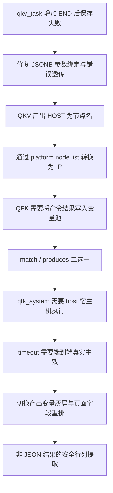
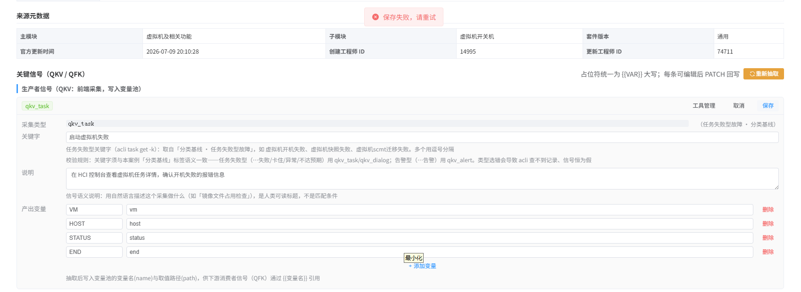
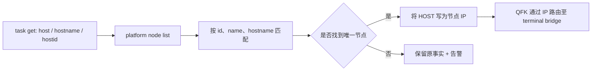

# KBD 关键信号编辑问题复盘与方案演进

## 背景与需求

本事件记录从 KBD 27123 保存失败、HOST 路由错误，到 QFK 产出变量、宿主机执行、超时、管理台灰屏和命令参数语义澄清的完整问题链。这些问题共同暴露了一个核心要求：管理台中人工看到和保存的契约，必须与 Agent 真实执行的语义一致，不能只是“页面上有这个字段”。

本文记录基础编辑与执行链路问题；非 JSON 输出的原始 grep/awk 用例、完整方案一、方案一的问题、最终方案二、页面填写效果和运行时流程见 [QFK非JSON结果行列提取方案](2026-07-27-QFK非JSON结果行列提取方案.md)。

## 问题链全景



## 问题与根因

### 保存失败

`signals_json` PATCH 曾用 `:signals_json::jsonb`。SQLAlchemy `text()` 对紧邻 `::` 的命名参数解析存在歧义，PostgreSQL 最终收到未绑定的冒号语法并返回 500。修复为 `CAST(:signals_json AS jsonb)`，同时管理端透传后端 detail。该问题由 PR #610 完成。

现场实际操作是在 KBD 27123 的 `qkv_task` 中，在已有 `VM`、`HOST`、`STATUS` 后新增 `END` / `end`，页面顶部只显示统一提示“保存失败，请重试”，无法看到数据库实际错误。



> 图 1：现场保存失败证据。修复不仅是改 SQL，还包括将后端的 422/500 detail 透传给页面，避免后续所有保存问题都被压缩成同一条文案。

### HOST 不是节点 IP

`acli task get` 的 `host`/`hostname` 是 `SVR_aCloud_668` 这类展示名，而 terminal bridge 需要 IP。QKV 产出写变量池前，通过同一 HCI 会话执行 `acli --formatter json platform node list`，按 `name`、`hostname`、`id` 匹配并缓存 `name → ip`；KBD 27123 的 `SVR_aCloud_668` 因而转换为 `172.28.24.2`。解析失败保留事实原值并告警，不伪造地址。该能力由 PR #622 完成。

真实工单 `Q2026072630367` 的执行记录为：

```text
sig_001 / qkv_task
exec_id = 608a39f8-cae5-5e34-b96a-c1466b4e688f
status = PASS
instruction = 在 HCI 控制台查看虚拟机任务详情，确认开机失败的报错信息
keyword = 启动虚拟机失败
result = {"vm":"4359974862144","host":"SVR_aCloud_668","status":3}
```

`acli task get` 同时返回 `hostid=host-047bcb4bc820`、`host=SVR_aCloud_668`；`platform node list` 中同一节点的记录是：

```json
{
  "id": "host-047bcb4bc820",
  "ip": "172.28.24.2",
  "name": "SVR_aCloud_668",
  "master": 1,
  "status": 1
}
```

转换优先使用可验证的节点列表事实，而不是根据主机名规则猜测 IP。



### QFK 输出变量、host 与 timeout

- `match` 与 `orchestrate.produces` 必须严格二选一。
- 产出变量模式中，命令成功且变量写入后信号 PASS；提取失败则 ERROR。
- `qfk_system.container=host` 由容器命令构建器识别为宿主机直执行。
- timeout 范围为 1–300 秒，从 Signal → QFK engine → BridgeRelayExecutor → conversation-service → customer-ui → terminal bridge 透传；terminal bridge 使用独立 SSH session，超时会关闭 session。

`host` 不是一个名为 host 的容器，而是一个明确执行地点枚举：

```text
container = host      → acli system <command>             （宿主机）
container = asv-con   → acli system container asv-con ... （容器）
```

timeout 的验收也不能只看页面能否输入数字，而要验证每一层都没有丢失、覆盖或回退为固定值，并且超时后真正关闭独立 SSH session，避免前端已报超时但远程命令仍在后台运行。

### 管理台灰屏

切到产出变量时，草稿先变为：

```ts
draft.match = null
draft.orchestrate.produces = [{ name: '', path: '' }]
```

旧 `qfkOutputMode()` 以“是否存在非空变量名”判断模式，空草稿又被判回 keyword，模板随即访问 `null.pattern`，Vue 异常后遮罩残留成灰屏。PR #625 改为以结构状态 `match === null || produces.length > 0` 判断，并给模板增加空值防御。

根因不是单纯“遮罩没有关闭”，而是编辑态判断把“刚刚创建但尚未填名的合法产出变量草稿”误判为关键字模式。修复后模式判断依赖结构状态，而不依赖尚未完成的字段值。

## 管理台最终交互决策

- 生产者：“说明”置于第一行。
- 消费者：“需求变量”改为“输入变量”。
- 消费者顺序：说明 → 主机 → 容器 → 执行命令 → 输入变量 → 超时时间 → 执行模式 → 其他字段。
- 关键字模式显示关键字、期望、匹配模式；产出变量模式只显示产出变量，二者不同时出现。
- qfk_system 的 `resource_keyword` 显示为“命令参数”。它被 `shlex.quote()` 后作为一个位置参数追加到 command，不参与匹配，也不适合承载多个参数或输出处理。

产出变量不是一个与命令无关的元数据字段，它的语义是“将这条命令的确定性提取结果写入变量池”。关键字的语义则是“检查这条命令的结果与某个值之间的关系”。两者都与命令强关联，但产出的运行时目标不同，所以必须二选一。

字段展示规则为：

| 执行模式 | 保留的共有字段 | 模式专有字段 |
|----------|------------------|------------------|
| 关键字判定 | 说明、主机、容器、执行命令、输入变量、超时时间、执行模式 | 关键字、期望、匹配模式 |
| 产出变量 | 同左 | 变量名、变量类型、JSON path 或非 JSON 行列提取 |

非 JSON 方式的具体页面填写表和线框效果见 [QFK 非 JSON 结果行列提取方案·7.2/7.3](2026-07-27-QFK非JSON结果行列提取方案.md#72-真实-pid-命令在-web-页面上如何填写)。

## 决策依据

这些决策把“命令在哪里执行、执行什么、读什么变量、产生什么结果”按人工审核顺序展开，并让数据结构的互斥约束直接映射为 UI 互斥状态。没有把 `resource_keyword` 重命名为数据库新字段，是因为 qfk_service 仍复用它表示服务名；当前只修正文案和工具可见性，避免无必要的数据迁移。

不将“命令参数”用作 grep/awk 的替代，是因为它仅能安全追加一个参数，既无法表达“行与列”，也不应被扩展为隐蔽的 Shell 入口。

## 影响范围

- `frontend/admin/src/views/KbdReviewView.vue`
- `backend/kb-service/app/routes/admin.py`
- `backend/agent-service/app/adapters/agents/htp/kbd_differential.py`
- `backend/agent-service/app/tools/qfk/`
- `terminal_bridge/main.go`
- 管理台与 Agent 现行设计/任务文档

## 验收标准

- KBD 27123 可保存 END 等合法产出变量。
- `SVR_aCloud_668` 在变量池与 QFK 路由时为 `172.28.24.2`。
- QFK 两种模式切换不灰屏且保存契约严格互斥。
- host 与 timeout 在真实执行链路有效。
