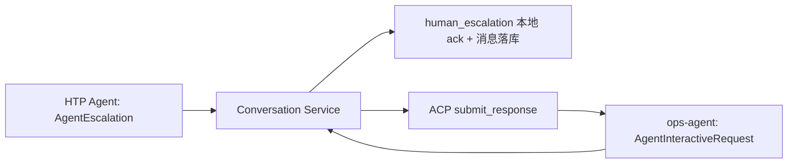

# KBD 自动执行门禁与人工升级确认修复方案

## 背景与需求

QFK v2 规定后端信号必须严格二选一：

```text
关键字判定：match 为对象，orchestrate.produces 为空
产出变量：match 为 null，orchestrate.produces 至少有一个有效 name
```

该规则已被 KBD 保存 Schema 和 QFK 执行器实现。后者在命令成功、提取值写入变量池时，把产出变量信号判为 PASS。

但 KB 分类快照接口仍保留旧门禁：任何 `qfk_*` 信号的 `match is None` 都被判为“缺少确定性 matcher”。这使合法产出变量链在 S1 之前被过滤，造成 KBD 27123 在工单 `Q2026072769668` 中无法进入自动诊断。

同次人工升级又暴露交互分流错误：HTP 的 `AgentEscalation` 被 Conversation Service 映射为 `human_escalation` 卡片。该卡片的 `requestId=escalation-{conversation_id}` 和 `acpSessionId=conversation_id` 是本地 UI 关联 ID，不是 ops-agent 创建的 ACP request；通用“其余 kind 都走 ACP”的分支却把它转发给 ops-agent，得到符合预期的 404，再被页面表现为 503。

## 方案（WHAT）

### 1. KBD 自动执行资格与 v2 契约对齐

在 `GET /api/kb/v2/categories/{category_id}/playbooks` 的 `_execution_issues()` 中，对每条 `qfk_*` 信号计算：

```text
has_match    = match 是对象
has_produces = produces 中存在非空变量名
```

只有 `has_match == has_produces` 时标记不可执行：

| matcher | produces | 资格 | 原因 |
|---:|---:|---|---|
| 否 | 否 | 不可执行 | 没有确定性结果语义 |
| 是 | 否 | 可执行 | 关键字判定模式 |
| 否 | 是 | 可执行 | 产出变量模式 |
| 是 | 是 | 不可执行 | 语义二义，违反 v2 二选一契约 |

此修改只修正分类清单的预过滤；保存 Schema、命令白名单、变量提取及 CDD 的运行时 fail-closed 行为均保持不变。

### 2. human_escalation 的本地确认闭环

`ConversationService.submit_interactive_response()` 新增显式 `kind == "human_escalation"` 分支：

1. 只接受 `outcome=selected` 且 `optionId=ack`；其他输入拒绝。
2. 记录结构化日志 `human_escalation_acknowledged`。
3. 继续沿用公共消息持久化逻辑，把确认动作写入会话历史。
4. 直接返回成功，不要求 AgentClient 存在，也不请求 agent-service 或 ops-agent。

真实 ACP 卡片（ops-agent 产生的 `AgentInteractiveRequest`）仍走原有转发链路：



## 决策依据（WHY：为什么选此方案，为什么不选其他方案）

### 为什么不把产出变量强行补成 matcher

`PID`、`PNAME` 是后续信号的输入变量，不是根因判断关键字。为绕过门禁而伪造 matcher 会破坏变量依赖图，把数据采集误写成结论判断，并可能错误支持或排除 KBD。

### 为什么不放宽全部 QFK 的门禁

只允许 `match` 或有效 `produces` 恰好存在一个。既无 matcher 又无产出的 QFK 没有确定性语义；同时存在两者又有二义性。保留该门禁与保存 Schema 一致，避免从一个误判变成开放执行。

### 为什么不让 ops-agent 接受 404 的伪请求

HTP 人工升级从未创建 ACP session/request。让 ops-agent “容忍”任意伪 ID 会把服务间协议边界变成猜测逻辑，并掩盖调用方类型路由错误。正确责任边界是 Conversation Service 在产生该本地卡片的同一层完成确认。

### 为什么确认动作只落会话历史

“我知道了”是告知确认，不是工具授权、SOP 变量输入或诊断继续指令。它需可追溯，但不应改变工具执行状态、调用外部 Agent 或伪造人工工单状态。后续若引入正式人工支持工单，应由独立的升级实体/状态机承载。

## 影响范围

- `backend/kb-service/app/routes/playbooks.py`：KBD 分类快照自动执行资格。
- `backend/conversation-service/app/services/conversation_service.py`：交互卡片类型路由。
- `backend/kb-service/tests/test_playbooks.py`：QFK 两种模式与二义拒绝的回归测试。
- `backend/conversation-service/tests/unit/test_human_escalation.py`：本地 ack、无 AgentClient、非法选项回归测试。
- 现行文档：知识库设计、对话设计及对应任务文档、README。

## 验收标准

- [x] `match=null + produces=[{name: PID}]` 的 QFK 在分类清单中 `executable=true`。
- [x] 无 matcher 且无有效 produces 的 QFK 仍为 `executable=false`。
- [x] 同时存在 matcher 与 produces 的 QFK 仍为 `executable=false`。
- [x] HTP `human_escalation` 的 `ack` 在 AgentClient 为 `None` 时仍成功并写入会话历史。
- [x] 非 `ack` 的人工升级响应被拒绝，且不写入消息。
- [x] 真实 ACP/ops-agent 路径未被改动。
