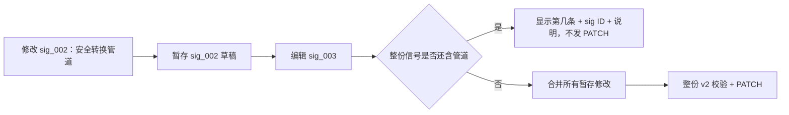

# QFK 历史管道分步修复保存死锁修复方案

## 背景与需求

安全管道转换上线后，保存端对整份 `signals_json` 执行 v2 校验。这是正确的安全不变量，但旧数据中同时存在多条管道时，单卡片编辑模式会产生修复死锁。

KBD 27123 的真实环境数据证明：当 `sig_002` 被安全转换后，前端仍只将当前卡片草稿与未修改的 `sig_003` 组合回传，所以后端报 `signals[2]` 而不是 `signals[1]`。这不是转换器失效，而是多信号修复的交互缺口。

## 方案（WHAT）

在 `KbdReviewView` 引入仅存在于当前审核对话的 `stagedSignalEdits`：

具体交互：

1. 当人工从正在编辑的信号切到另一张卡片时，页面自动暂存当前草稿。
2. 未进入编辑态的暂存卡片显示“已暂存”；面板顶部显示暂存数量和放弃全部暂存修改的入口。
3. 点击保存时，前端先将当前草稿纳入暂存集，再对合并后的完整信号集进行管道预检。
4. 如果还有管道，消息格式为“第 N 条 `sig_xxx`（说明）”，并保留已安全转换的暂存。
5. 仅当所有管道都被清理后，才发送整份文档的原 PATCH。

## 决策依据（WHY）

| 候选方案 | 结论 | 原因 |
|----------|------|------|
| 后端允许历史管道继续保存 | 拒绝 | 破坏“不保存 Shell 管道”的安全不变量，也会引入遗留语义后门 |
| 后端自动删除无法转换的管道 | 拒绝 | 会静默改变命令语义或丢失人工需要确认的证据 |
| 直接修改当前环境数据库 | 不作为通用修复 | 只能解决单个 KBD，无法修复交互模型缺口，且不应在未经人工确认时改写发布数据 |
| 前端多信号暂存 + 全量原子保存 | 采用 | 保留严格后端校验、不丢审核修改、无法无损转换时仍由人工决定 |

本方案的关键是：暂存不是保存绕过。任何更改都不会写入数据库，直到整份信号都不含管道且通过现有 v2 Schema。

## 影响范围

- `frontend/admin/src/views/KbdReviewView.vue`：暂存状态、多信号管道预检、阻断前可定位提示与视觉标记。
- 后端的 `validate_signals_json`、保存 API和数据库契约：不修改。
- KBD 27123：通过新交互按安全约束正常修复，不需直接改库。

## 验收标准

1. 同一个审核会话中能够暂存并编辑多个信号。
2. 测试样例中只留 `sig_003` 管道时，保存前提示精确定位到 `第 3 条 sig_003`。
3. 全部修复后发送的仍是完整 v2 文档，后端严格校验通过。
4. 前端生产构建通过，现有管道转换、产出变量和关键字判定交互无回归。
