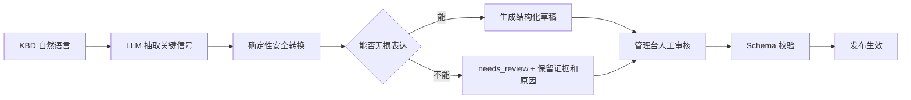
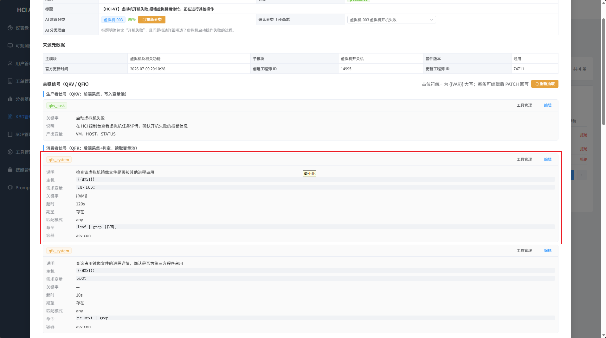
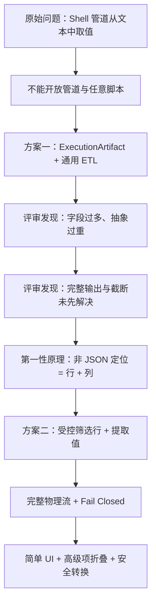
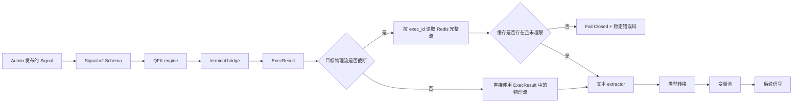
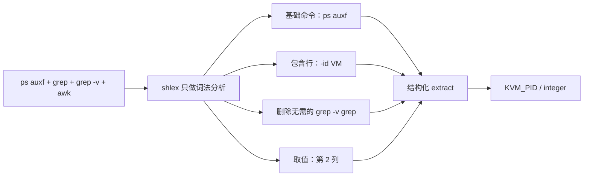

# QFK 非 JSON 结果行列提取方案

## 文档目的与阅读结论

本文档完整记录本次会话中的原始问题、第一版通用输出解析方案（以下称“方案一”）、方案一的问题、从第一性原理得出的最终行列提取方案（以下称“方案二”）、管理台页面效果和运行时安全边界。

先给出结论：

- JSON 输出继续使用 `path` 取值。
- 非 JSON 输出使用受控的“筛选行 + 提取值”，不开放 Shell 管道、grep 脚本或 awk 语言。
- 管理台可将 grep/awk/cut 的常见安全子集一键转换为结构化配置；无法无损转换时必须人工复核。
- 产出变量必须从完整物理 stdout/stderr 中提取，不能从展示用的截断摘要中猜值。
- 复杂汇总、排序、分组、跨行计算不继续扩展 `extract`，而是建立专用 acquirer。

## 一、原始问题与真实上下文

### 1.1 业务流程决定了“易用性”的优先级

关键信号不是由开发人员从零编写，而是先由 AI 从 KBD 自然语言中抽取，再由人工审核、修改、发布生效。现阶段大部分 AI 初次抽取的关键信号不能直接使用，审核人员必须快速看懂并校正。



因此，本次设计的首要指标不是“是否能表达任意数据处理”，而是：

1. 人工在不学习一套新 DSL 的前提下能看懂。
2. AI 初抽取后只需少量修改就能发布。
3. 保存的结构可以做 Schema 校验、审计和稳定回放。
4. 页面显示的配置和真实运行时语义完全一致。

### 1.2 `acli --formatter json` 不保证 system 子命令返回 JSON

`acli system` 下大量能力只是对原生 Shell 命令的封装，使用方式与原命令一致。例如：

```bash
acli --formatter json system ps auxf
```

它仍然返回 `ps auxf` 的行列文本，而不是 JSON：

```text
USER       PID %CPU %MEM    VSZ   RSS TTY      STAT START   TIME COMMAND
root         2  0.0  0.0      0     0 ?        S    Jun09   0:05 [kthreadd]
root         3  0.0  0.0      0     0 ?        I<   Jun09   0:00  \_ [rcu_gp]
...
```

所以“已传 `--formatter json`”不能用来判断输出格式；管理台和运行时必须明确区分 JSON 与文本。

### 1.3 真实的 grep/awk 需求

本次需要转换的原始命令是：

```bash
acli system ps auxf \
  | grep -e '-id 8243094091404' \
  | grep -v grep \
  | awk '{print $2}'
```

原始输出行开头为：

```text
root  31315  26.1  10.8  ...  /usr/bin/kvm -id 8243094091404 ...
```

最终需要的结果是：

```text
31315
```

这个用例的真实意图可拆成两步：

1. 行：在 `ps auxf` 结果中找到包含 `-id {{VM}}` 的虚拟机进程行。
2. 列：从该行中取连续空白分隔的第 2 列 PID，并转成整数。

`grep -v grep` 只是传统 Shell 管道中用来排除 grep 进程自身的惯用写法。平台不会真正启动 grep，所以转换后这一段应当删除，而不是保留一个无意义的 exclude 条件。

### 1.4 改造前页面的问题证据

改造前的 qfk_system 页面直接保存 `lsof | grep {{VM}}` 和 `ps auxf | grep` 这类不完整管道；页面同时展示“需求变量”、“关键字”、“命令”等字段，但没有一个受控的产出值配置。



> 图 1：改造前的真实页面。红框中的管道命令既不符合平台安全边界，也无法稳定表达“将第 2 列写入变量池”。

### 1.5 大输出截断是与解析配置同等重要的原始问题

`ps auxf` 的结果可以很大，真实 KVM 进程单行也可包含数千字符。执行链路为了 UI 展示和传输成本，会将 `ExecResult.stdout` 限制为约 4000 字符、`stderr` 限制为约 1000 字符。如果只设计解析表单，却仍对截断摘要进行提取，会出现三类错误：

- 目标行在截断位置之后，误报零匹配。
- 目标行只保留了前半段，列被截断或内容不完整。
- 摘要中恰好只剩一个候选，而完整输出有多个候选，“必须唯一”被错误通过。

因此，“先获得完整物理流”是方案成立的前置条件，不是后续性能优化。

## 二、约束、非目标与设计原则

### 2.1 硬约束

1. 不向 KBD 审核人员开放 `|`、`;`、重定向、命令替换等 Shell 组合能力。
2. 不在 Agent 中执行 grep/awk/cut；它们只是安全转换器能识别的用户心智模型。
3. 不将命令输出回传给 LLM 来决定最终产出值。
4. 结构必须可被 JSON Schema 静态校验，运行时必须是确定性纯数据处理。
5. 历史 JSON `path` 配置必须向后兼容。
6. 获取不到完整输出时必须 Fail Closed，不能回退到截断摘要。

### 2.2 非目标

下列能力不纳入通用 `extract`：

- 任意 grep 正则、sed 替换、完整 awk 程序。
- sort/uniq/head/tail/xargs 等管道语言的继续扩展。
- 多行 join、分组、聚合、计数、累加、排序和跨行状态计算。
- 一个配置中表达通用 ETL 流水线或完整 Shell 程序。

遇到这些需求时，由专用 acquirer 在受测试的代码中缩小数据集并返回明确契约。

### 2.3 评价标准

| 维度 | 关键问题 |
|------|----------|
| 审核效率 | 运营人员是否可以根据原 grep/awk 在几分钟内完成填写？ |
| AI 可修正性 | AI 生成不准时，人工是否只需改“行”或“列”？ |
| 运行正确性 | 页面配置的结果是否一定来自完整输出？ |
| 安全边界 | 是否只表达数据选择，而不是可执行程序？ |
| 可观测性 | 零匹配、多匹配、列越界等是否有稳定错误码？ |
| 演进成本 | 是否可以保持小而稳定的 Schema，不变成 DSL？ |

## 三、方案一：通用输出解析 / ExecutionArtifact + ETL

### 3.1 设计目标

方案一希望将所有命令输出统一建模为 `ExecutionArtifact`，先解析成中间结构，再经过通用 `where → select → cardinality → type cast` 流水线得到变量。其实质是一个小型、受限的数据处理引擎。


### 3.2 `ExecutionArtifact` 概念模型

`ExecutionArtifact` 是命令执行的不可变事实层，与具体变量提取规则分离。会话中提出的概念形态如下：

```yaml
ExecutionArtifact:
  exec_id: 608a39f8-cae5-5e34-b96a-c1466b4e688f
  exit_code: 0
  started_at: 2026-07-26T10:55:15+08:00
  ended_at: 2026-07-26T10:55:26+08:00
  stdout:
    raw: "USER PID %CPU ..."
    truncated: false
  stderr:
    raw: ""
    truncated: false
  metadata:
    host: 172.28.24.2
    container: host
```

这一层本身不关心“用户要取哪个值”，只记录可追溯的完整执行结果。

### 3.3 通用 parser 家族

方案一为不同输出形态设计了多类 parser：

| parser / format | 输入示例 | 中间结构 | 典型取值方式 |
|-----------------|----------|------------|--------------|
| `raw` | 任意原文 | 单个字符串 | 整体返回 |
| `json` | `{"data":[...]}` | object / array | JSON path |
| `lines` | 多行文本 | 字符串数组 | 行号或行条件 |
| `whitespace_table` | `ps auxf` | 行 × 列 | 表头或列号 |
| `delimited_table` | `/etc/passwd` | 指定分隔符的行 × 列 | 列号 |
| `key_value` | `state: running` | key-value map | key |
| `regex_capture` | 完全非结构文本 | capture groups | 命名组或组号 |

表格 parser 还需要处理表头是否存在、空白合并、列名重复、空列、引号、转义、不齐行等问题。`regex_capture` 表达力最强，但对 AI 抽取、人工审核和安全审计的要求也最高。

### 3.4 通用处理链

在 parser 之后，方案一通过下列通用操作完成取值：

| 阶段 | 职责 | 例子 |
|------|------|------|
| `source` | 选择 stdout 或 stderr | `stdout` |
| `format/parser` | 将原始文本转为中间结构 | `whitespace_table` |
| `parser options` | 设置表头、分隔符、trim 等 | `header: true` |
| `where` | 按字段、行文本、比较运算筛选 | `row contains "-id {{VM}}"` |
| `select` | 选择 path、列名、列号或 capture group | `column: 2` |
| `cardinality` | 声明期望唯一、首个、末个或集合 | `exactly_one` |
| `type cast` | 将结果转为声明类型 | `integer` |
| `error policy` | 定义零匹配、多匹配和转换失败语义 | `fail` |

对真实 PID 命令，通用配置可以类似下列概念形态：

```yaml
produces:
  - name: KVM_PID
    type: integer
    source: stdout
    format: whitespace_table
    parser:
      header: true
      delimiter: whitespace
      trim: true
    where:
      - field: row
        operator: contains
        value: "-id {{VM}}"
      - field: row
        operator: not_contains
        value: grep
    select:
      kind: column
      index: 2
    cardinality: exactly_one
    on_error: fail
```

JSON 则可以走同一条抽象链：

```yaml
produces:
  - name: HOST_IP
    type: string
    source: stdout
    format: json
    parser:
      strict: true
    select:
      kind: path
      expression: data.0.ip
    cardinality: exactly_one
    on_error: fail
```

### 3.5 Parse Preview 管理台

为了让人工确认通用配置，方案一还需要一个解析预览器，至少分层显示：

1. 原始 stdout/stderr，以及是否截断。
2. parser 产生的中间结构和表头识别结果。
3. `where` 前后的行数变化。
4. `select` 命中的列/path/capture group。
5. cardinality 检查和类型转换结果。
6. 错误定位，例如“第 3 条 where 导致零匹配”。

如果没有这个预览器，人工很难直接判断十余个字段组合后的真实效果；但实现预览器又进一步将管理台推向低代码 ETL 编辑器。

### 3.6 方案一的优点

1. 通用性强：JSON、原文、行、表格、KV、正则捕获可用同一抽象表达。
2. 扩展性强：可以逐步增加 parser、operator、selector 和 cardinality。
3. 复杂查询表达力强：适合多条件、表头定位、正则组和多值输出。
4. 理论模型完整：从不可变 artifact 到解析、查询、类型系统和变量池的责任边界清晰。
5. 适合长期建设通用数据处理平台，也方便进行系统化 parse preview。

## 四、方案一存在的问题

方案一不是错误设计，它是一个能力完整的长期通用 ETL 方案。但它与当前“AI 初抽取 + 人工快速校正”的产品阶段不匹配，具体原因如下。

### 4.1 一个简单 PID 用例需要约十个配置概念

用户真实意图只是“找到包含 VM ID 的行，取第 2 列”，却需要理解并确认 source、format、parser、header、delimiter、where、operator、select、cardinality、type cast、error policy 等概念。配置密度与任务复杂度不成比例。

### 4.2 AI 初抽取准确率不足时，结构越复杂越容易错

AI 不仅要理解原 Shell 意图，还要在多种 parser、operator 和 cardinality 中做决策。任意一层选错都可能产生“Schema 合法但语义错误”的草稿，这比格式校验失败更难发现。

### 4.3 人工需要学习 parser/where/select/cardinality 这套 DSL

审核人员本来熟悉 grep 找行、awk 取列。通用方案要求他们改用数据工程概念思考，将现有使用门槛转化为学习和培训成本。

### 4.4 管理台会演变为低代码 ETL 编辑器

当 where 需要组合 AND/OR、select 需要切换 path/column/group、parser 需要不同选项时，页面必然引入动态表单、嵌套条件组和多阶段预览。这与当前 KBD 审核页“少量直观字段”的定位冲突。

### 4.5 能力边界会逐步逼近受限 Shell / 解释器

一旦开始支持正则、多操作符、排序、分组、计算列和跨行状态，通用配置就开始具备编程语言特征。虽然不是 Shell，但仍需要按解释器级别进行资源限制、复杂度限制、拒绝服务防护和安全审计。

### 4.6 第一版没有优先解决大输出截断

这是最关键的正确性问题。即使十个配置字段全部正确，如果 parser 的输入只是 4000 字符展示摘要，产出变量仍然可能错。第一版将应当作为前置的“完整输出可得性”放在了解析交互之后。

### 4.7 与当前高频问题不成比例

已知高频需求并不是任意 ETL，而是非 JSON 文本中的两个操作：按内容找行、按分隔取列。用通用引擎解决这个问题，属于用更大的抽象面积换取尚未被证明需要的表达力。

### 4.8 Schema 和历史配置演进成本高

parser 和 operator 一旦发布就成为持久化契约。修正表头算法、正则语义或 cardinality 默认值时，必须考虑旧 KBD 的重放一致性和迁移。通用性越强，版本兼容面越大。

### 4.9 错误提示不容易对运营人员直观

“parser 无法识别表头”、“where AST 的第二分支类型不匹配”、“select 的 capture group 不存在”虽然对开发者精确，但不如“没有找到包含 XXX 的行”或“匹配到 3 行，期望唯一”容易处理。

### 4.10 阶段性结论

方案一适合“用户主动构建通用数据处理流”的产品，不适合当前“AI 从 KBD 生成草稿，人工快速审核”的环节。

因此，决策是“当前阶段不采用”，而不是“永久否定”。如果未来真实数据证明复杂 parser/where/select 用例占比显著上升，可在专用 acquirer 或明确标识的高级能力中重新评估，但不应直接扩展当前简单模式。

## 五、从方案一到方案二的决策过程



第一性原理的归约是：

> 对当前非 JSON 输出的高频用例，定位用户想要的数据本质上只有两个维度：先找到哪一行，再从这一行取哪个值。

这个归约保留了 grep/awk 最被用户熟悉的心智模型，但去掉了程序执行能力。

| 候选方案 | 结论 | 决策依据 |
|----------|------|----------|
| 直接开放 Shell 管道 | 拒绝 | 命令注入、能力扩张、环境差异和审计边界不可控 |
| 只允许 grep/awk 两个命令 | 不采用 | 仍需要脚本 parser/解释器，且会持续要求增加更多选项 |
| 方案一：十字段通用 ETL | 当前暂缓 | 能力完整，但审核 UX 过重，且未先解决截断 |
| 方案二：行筛选 + 值提取 | 采用 | 覆盖高频用例，可静态校验，人工心智模型简单 |
| 专用 acquirer | 作为复杂用例补充 | 复杂计算在受测试代码中实现，不扩展通用 DSL |

## 六、方案二：受控的“筛选行 + 提取值”

### 6.1 整体处理链


步骤是固定的，用户不能任意插入操作，也不能改变执行顺序。这是它与脚本或通用 ETL 管道的根本区别。

### 6.2 JSON 与文本的契约分工

JSON 保持现有 `path`：

```json
{
  "name": "HOST_IP",
  "type": "string",
  "path": "data.0.ip|ip"
}
```

非 JSON 使用 `extract`：

```json
{
  "name": "KVM_PID",
  "type": "integer",
  "extract": {
    "type": "text",
    "include": ["-id {{VM}}"],
    "column_mode": "index",
    "column": 2
  }
}
```

契约规则：

- `path` 与 `extract` 互斥，同一个产出变量不能同时配置。
- QKV 继续只支持 JSON path，文本 `extract` 仅用于 QFK 命令输出。
- QFK 的 `match` 与 `orchestrate.produces` 严格二选一。
- 产出变量模式下，命令失败或任一提取失败都是 ERROR，不写入空值。

### 6.3 `extract` 字段完整语义

| 字段 | 可选值 / 类型 | 默认值 | 语义 |
|------|-----------------|--------|------|
| `type` | `text` | 必填 | 当前只允许受控文本提取 |
| `include` | 非空字符串数组 | `[]` | 行必须包含的字面量条件 |
| `exclude` | 非空字符串数组 | `[]` | 命中任一条件的行被排除 |
| `include_mode` | `all` / `any` | `all` | 多个 include 之间为 AND 或 OR |
| `case_sensitive` | boolean | `true` | 是否区分大小写 |
| `column_mode` | `whole` / `index` / `from_index` | 无 column 时为 `whole` | 取整行、第 N 列或从 N 列到末尾 |
| `column` | 1 开始的整数 | 按模式必填 | 列号，符合 awk 的用户习惯 |
| `delimiter` | `whitespace` 或单字符 | `whitespace` | 连续空白合并，或按指定单字符分列 |
| `cardinality` | `exactly_one` / `first` / `last` / `all` | `exactly_one` | 匹配行数约束与多值语义 |
| `source` | `stdout` / `stderr` | `stdout` | stdout 与 stderr 物理分离，不拼接 |

产出变量的 `type` 支持 `string`、`integer`、`number`、`boolean`、`array`。对整数使用严格十进制校验，布尔值仅接受明确白名单；转换失败不会保留原字符串冒充目标类型。

### 6.4 简单模式与高级模式

简单模式只要求审核人员回答四个问题：

1. 变量叫什么？
2. 它是什么类型？
3. 哪一行包含什么？
4. 取整行还是第几列？

高级设置默认折叠，仅在必要时调整：不包含行、AND/OR、大小写、首行/末行/全部行、stderr 和单字符分隔。

这个分层使高频用例不被低频能力干扰，同时保留必要的确定性选项。

### 6.5 完整 stdout/stderr 处理

运行时必须明确区分“展示摘要”和“提取数据源”：



具体策略：

- 未截断：直接读取 `ExecResult.stdout` 或 `ExecResult.stderr`。
- stdout 已截断：读取 `cmd_cache:{exec_id}`。
- stderr 已截断：读取独立的 `cmd_stderr_cache:{exec_id}`。
- 缓存无连接、读取异常、键不存在或已过期：返回 `QFK_OUTPUT_TRUNCATED_SOURCE_UNAVAILABLE`，不使用摘要继续。
- 默认提取上限为 1 MiB，程序级硬上限为 4 MiB。超限返回 `QFK_OUTPUT_TOO_LARGE`，应使用专用 acquirer 在源头缩小数据集。
- stdout 和 stderr 不拼接，避免行顺序和来源语义丢失。

### 6.6 稳定错误码与 Fail Closed

| 错误码 | 条件 | 处理 |
|--------|------|------|
| `QFK_COMMAND_FAILED` | 命令退出码非 0 | 当前信号 ERROR，不提取 |
| `QFK_OUTPUT_TRUNCATED_SOURCE_UNAVAILABLE` | 截断但无完整缓存 | 不从摘要降级提取 |
| `QFK_OUTPUT_TOO_LARGE` | 完整流超出允许上限 | 要求专用 acquirer |
| `QFK_OUTPUT_EMPTY` | 目标输出为空 | 不写变量 |
| `QFK_NO_MATCH` | 没有行通过筛选 | 显示筛选失败原因 |
| `QFK_MULTIPLE_MATCHES` | 要求唯一但匹配多行 | 不暗自选第一行 |
| `QFK_COLUMN_OUT_OF_RANGE` | 目标列不存在 | 不返回空字符串 |
| `QFK_TYPE_CAST_FAILED` | 不能转为声明类型 | 不使用原字符串冒充 |
| `QFK_EXTRACT_INVALID_SPEC` | 运行时规格非法 | 拒绝执行不确定语义 |

所有这些错误都不会写入空变量，当前信号进入 ERROR，依赖该变量的后续信号不得继续使用伪结果。

### 6.7 为什么保留 grep/awk 心智模型，却不执行它们

grep 和 awk 本身不是问题，问题在于将用户输入作为可执行程序交给 Shell。方案二复用它们的用户认知，但将其转为 Schema 可校验的数据：



转换器只做 tokenizer 和白名单语法识别，从不执行输入。

| 识别的安全子集 | 结构化结果 |
|----------------|------------|
| `grep PATTERN`、`grep -e PATTERN`、`grep -F PATTERN` | `include` |
| `grep -v PATTERN` | `exclude` |
| `grep -i PATTERN` | `case_sensitive=false` |
| 多个普通 grep 段 | 多个 include，默认 AND |
| `awk '{print $N}'` | `column_mode=index` + `column=N` |
| `cut -dX -fN` | `delimiter=X` + `column=N` |
| `grep -v grep` | 删除，因为运行时没有 grep 进程 |

下列输入不做“尽量转换”，而是明确拒绝：

- 包含不能无损表达的 grep 正则元字符。
- `awk` 多列输出、条件、计算、变量或多语句。
- sed、sort、uniq、xargs 等未知管道段。
- `||`、重定向、命令替换或基础命令的禁止字符。
- 一个管道中多次并且含义冲突的列提取。

拒绝时保留原 evidence、稳定错误原因并设置 `needs_review`，由人工决定改写为行列配置还是增加专用 acquirer。

### 6.8 Prompt 不是安全边界

AI Prompt 会明确要求：

- 识别 JSON 与非 JSON。
- 将常见 grep/awk/cut 改为 `extract`。
- `match` 和 `produces` 二选一。
- 不生成无法无损表达的脚本。

但 LLM 输出始终被视为不可信草稿。Prompt 之后还必须经过确定性转换器和 Signal Schema；管理台保存时再做一次校验。安全边界是“确定性代码 + Schema + 运行时不启动 Shell”，而不是“Prompt 要求 AI 不要这样做”。

### 6.9 输入变量自动推导

`orchestrate.requires` 不再让人工与占位符重复维护。系统从下列位置统一扫描 `{{VAR}}`：

- 主机、命令和命令参数。
- 其他 acquire args。
- `extract.include` 与 `extract.exclude`。

推导结果在页面上以“输入变量”只读标签展示，保存前同步至 `requires`。这消除了“占位符已改但 requires 忘记改”的双写不一致。

## 七、管理台页面效果与填写方式

### 7.1 字段顺序与模式互斥

QFK 共有字段按人工审核的思考顺序排列：

```text
说明 → 主机 → 容器 → 执行命令 → 输入变量
     → 超时时间 → 执行模式 → 模式专有字段 → 其他工具字段
```

执行模式的字段变化：

| 分类 | 关键字判定 | 产出变量 |
|------|------------|----------|
| 保留 | 说明、主机、容器、执行命令、输入变量、超时时间、执行模式 | 同左 |
| 专有 | 关键字、期望、匹配模式 | 变量名、变量类型、输出格式、筛选行、提取值、高级设置 |
| 不展示 | 产出变量相关字段 | 关键字、期望、匹配模式 |

切换模式不是只隐藏控件，还要将保存契约转换为严格互斥：关键字模式保留 `match` 并清空 `produces`；产出变量模式使 `match=null` 并保留非空 `produces`。

### 7.2 真实 PID 命令在 Web 页面上如何填写

| 字段 | 填写值 | 是否必填 | 说明 |
|------|--------|----------|------|
| 说明 | `检查虚拟机进程并提取 PID` | 是 | 人类可读的采集目的 |
| 主机 | `{{HOST}}` | 是 | 上游 QKV 已将节点名转换为 IP |
| 容器 | `host` | 是 | 宿主机直接执行，不进入任何容器 |
| 执行命令 | `ps auxf` | 是 | 不填 `acli system` 前缀，不含 `| grep | awk` |
| 输入变量 | `HOST`、`VM` | 自动 | 从主机与筛选条件的占位符自动推导，只读 |
| 超时时间 | `10` 秒 | 是 | 范围 1–300 秒，真实透传至 terminal bridge |
| 执行模式 | `产出变量` | 是 | 与关键字判定二选一 |
| 变量名 | `KVM_PID` | 是 | 写入统一变量池 |
| 变量类型 | `整数` | 是 | 转换失败则 ERROR |
| 输出格式 | `文本` | 是 | JSON 才选 path |
| 筛选行（包含） | `-id {{VM}}` | 是 | 字面量包含，不是 grep 正则 |
| 筛选行（不包含） | 留空 | 否 | `grep -v grep` 在安全转换时被删除 |
| 提取值 | `第 2 列` | 是 | 列号从 1 开始 |
| 分隔符 | `连续空白` | 默认 | 位于高级设置 |
| 匹配数量 | `必须唯一` | 默认 | 多行时不暗自取第一行 |
| 输出来源 | `stdout` | 默认 | 可在高级设置中改为 stderr |

命令参数 `resource_keyword` 不参与结果处理。它只是经安全引用后追加到 command 末尾的一个位置参数；本用例的 `ps auxf` 参数已经在“执行命令”中，所以“命令参数”留空。

### 7.3 目标页面线框效果

```text
┌─ qfk_system 编辑 ────────────────────────────────┐
│ 说明       [检查虚拟机进程并提取 PID                  ] │
│ 主机       [{{HOST}}                                  ] │
│ 容器       [host（宿主机，不进入容器）        ▼] │
│ 执行命令   [ps auxf                                   ] │
│ 输入变量   [HOST] [VM]                  （自动、只读） │
│ 超时时间   [10] 秒                                     │
│ 执行模式   (关键字判定)  (● 产出变量)              │
│                                                    │
│ 产出变量                                             │
│   变量名     [KVM_PID       ]  类型 [整数       ▼] │
│   输出格式   (JSON) (● 文本)                         │
│   包含行     [-id {{VM}}                            ] │
│   不包含行   [                                       ] │
│   提取值     [第 N 列 ▼] [2]                          │
│   ▸ 高级设置（连续空白 / 区分大小写 / 必须唯一 / stdout） │
│                                                    │
│ 命令参数   [留空                                     ] │
└──────────────────────────────────────────────────────┘
```

高级设置折叠时，用户在主界面只看到原命令中最核心的“包含行”和“第 N 列”。

### 7.4 检测到管道时的交互

1. 执行命令中出现 `|` 时，页面显示“检测到 Shell 管道，不能直接保存”。
2. 用户点击“安全转换管道”，管理台调用预览 API；后端只解析，不执行命令。
3. 转换成功后显示基础命令、include/exclude、列号和被删除段；用户应用后再保存。
4. 转换失败时显示明确原因，例如“grep 包含正则元字符”或“仅支持 awk `{print $N}`”，不自动删减语义。
5. 如果用户不转换，保存校验仍会拒绝含管道的 QFK command，防止绕过 UI。

## 八、真实用例的端到端转换

### 8.1 原始人工命令

```bash
acli system ps auxf | grep -e '-id {{VM}}' | grep -v grep | awk '{print $2}'
```

### 8.2 安全转换结果

```yaml
acquire:
  tool: qfk_system
  args:
    instruction: 检查虚拟机进程并提取 PID
    host: "{{HOST}}"
    container: host
    command: ps auxf
    timeout: 10
match: null
orchestrate:
  requires:
    - HOST
    - VM
  produces:
    - name: KVM_PID
      type: integer
      extract:
        type: text
        include:
          - "-id {{VM}}"
        column_mode: index
        column: 2
```

### 8.3 运行时实际动作

| 阶段 | 实际行为 |
|------|----------|
| 占位符渲染 | `HOST=172.28.24.2`，`VM=8243094091404` |
| 远程执行 | 宿主机执行 `acli system ps auxf`，命令中无管道 |
| 完整输出 | 从 ExecResult 或 Redis 取得完整 stdout |
| 行筛选 | 只保留包含 `-id 8243094091404` 的行 |
| 数量校验 | 默认要求恰好一行 |
| 列提取 | 按连续空白分隔，取第 2 列 `31315` |
| 类型转换 | 转为整数 `31315` |
| 变量池 | 写入 `KVM_PID=31315` |
| 后续使用 | 下游信号通过 `{{KVM_PID}}` 引用 |

## 九、安全边界与业界范式对齐

| 范式 | 本方案的落地 |
|------|--------------|
| 命令与数据处理分离 | 远程端只执行白名单语义下的基础命令；筛选/取列在 Agent 内存中完成 |
| 将代码转为数据 | grep/awk 仅用于输入识别，持久化结果是 Schema 可校验的 `extract` |
| 默认拒绝 | 未知管道段、正则歧义、复杂 awk 一律 needs_review |
| 最小权限 | `container=host` 是明确的执行地点，不因输出处理而额外获得 Shell 能力 |
| 完整性优先 | 提取使用完整物理流，缓存丢失时不降级到摘要 |
| 显式 cardinality | 默认必须唯一，不通过“默默取第一条”隐藏数据歧义 |
| 稳定错误分类 | 将执行、数据可得性、筛选、列、类型错误分开，支持审计和精确修正 |
| 可回放的确定性语义 | 同一完整输出 + 同一 extract 必须得到同一结果，运行时不调用 LLM |

### 安全性负面用例

| 输入 | 结果 | 原因 |
|------|------|------|
| `ps auxf | awk '{print $2, $11}'` | 拒绝 | 多列 awk 不在无损子集 |
| `ps auxf | grep 'kvm.*-id'` | 拒绝/人工改写 | 正则不等价于字面包含 |
| `ps auxf | sed ...` | 拒绝 | 不扩展成文本编程语言 |
| `ps auxf; rm -rf ...` | 拒绝 | 基础命令禁止 Shell 控制字符 |
| 截断 stdout 且 Redis 键已过期 | ERROR | 不从 4000 字符摘要猜值 |
| 匹配到两个同 VM ID 进程 | ERROR | 默认唯一约束暴露环境歧义 |

## 十、影响范围

- Signal v2 Schema：`produces[].extract`、`path/extract` 互斥、QKV/QFK 工具约束。
- Agent QFK executor：完整 stdout/stderr 恢复、文本 extractor、类型转换、稳定错误码和变量池写入。
- terminal bridge 结果契约：stderr 截断标识与独立完整缓存。
- KB Service：Prompt 后确定性转换、管道预览 API、保存前 requires 同步。
- API Gateway：安全管道转换预览代理。
- Admin UI：JSON/文本切换、简单/高级字段、管道检测和安全转换。
- Prompt seed 与 data/Atlas migration：将新抽取约束同步到存量环境。
- 现行需求、Agent、Admin UI、接口、数据库和任务文档。

## 十一、验收标准

1. 真实 `ps auxf | grep -e '-id {{VM}}' | grep -v grep | awk '{print $2}'` 可无损转换，宿主机只执行 `acli system ps auxf`。
2. Web 页面的高频必填项仅体现“变量 + 行 + 列”，低频项默认折叠。
3. `path` 与 `extract` 互斥，QKV 禁止文本 extract，历史 JSON path 继续有效。
4. QFK 不能保存含 `|` 的 command，且无法无损转换时不会自动猜测。
5. 产出值使用完整物理 stdout/stderr，截断缓存丢失时 Fail Closed。
6. 零匹配、多匹配、列越界、类型转换、输出超限均有稳定错误码，不写空变量。
7. Prompt 、确定性转换器、Schema 与管理台保存校验组成多层保障，不将 Prompt 当作安全控制。
8. 输入变量从占位符自动推导，管理台只读展示，保存后与 `requires` 一致。
9. 复杂管道和跨行计算有明确边界，转交专用 acquirer，不持续扩展通用 DSL。

验证命令、测试覆盖和结果见 [QFK非JSON结果行列提取验证](../../verify/events/2026-07-27-QFK非JSON结果行列提取验证.md)。

## 十二、后续重新评估方案一的触发条件

仅当下列事实由真实工单数据证明时，才重新评估通用 `ExecutionArtifact + ETL`：

1. 行包含/排除 + 单列提取无法覆盖的场景已成为高频，而不是个别特例。
2. 专用 acquirer 的数量和维护成本已高于通用 parser 平台。
3. AI 抽取对复杂结构的准确率、可解释性和回放测试已达到可接受水平。
4. 有明确的产品定位、权限模型、资源限制和版本化计划来承载 DSL。
5. Parse Preview 不会增加当前 KBD 审核人员的主流操作成本。

在此之前，保持方案二的 Schema 小而稳定，是对当前平台使用情况更严谨的选择。
