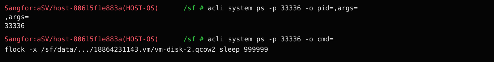
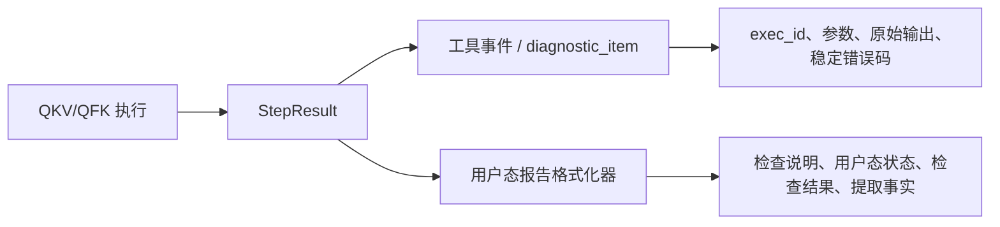

# KBD 关键信号结果展示与 ps 输出提取方案

## 背景与需求

本方案解决两个关联但职责不同的问题：

1. KBD 27123 第三步从 `pid=,args=` 改成正确的 `cmd=` 后反而失败；
2. KBD 诊断报告把内部执行记录直接倾倒给用户，关键信号结果缺少结论层次和结构化事实。

关联需求：[KBD关键信号结果展示与ps输出提取需求](../../requirement/events/2026-07-28-KBD关键信号结果展示与ps输出提取需求.md)。

## 现场证据与分析过程

### 两次工单对比

| 证据项 | `Q2026072804914` | `Q2026072803376` |
|---|---|---|
| conversation_id | `7e1f6c9a-f4b0-4ed5-a973-a2eeb2564c79` | `1e9f7f4b-a817-4206-9ffd-a7727d1579cf` |
| trace_id | `01c6021195ffa2373b76870a96bf1552` | `931e835debf639f7f8c981db9caff5d2` |
| 第三步 exec_id | `ac6dfaa5-c9e0-5183-9557-64c71583eb15` | `11d482a2-4965-5b91-a1bd-824c7b05e34e` |
| 命令 | `ps -p 10134 -o pid=,args=` | `ps -p 10134 -o cmd=` |
| exit code | 0 | 0 |
| bridge 原始 stdout | 15 字节 | 133 字节 |
| 筛选后 stdout | 7 字节：`10134` | 0 字节 |
| Agent 结果 | PASS | `QFK_OUTPUT_EMPTY` |

第二次并非命令没有输出。terminal_bridge 已收到 133 字节真实 stdout，内容是：

```text
flock -x /sf/data/.../18864231143.vm/vm-disk-2.qcow2 sleep 999999
```

但第三个信号仍保留旧产出配置：

```json
{
  "source": "stdout",
  "include": ["{{PID}}"],
  "cardinality": "exactly_one",
  "column_mode": "whole"
}
```

运行时 `{{PID}}` 被解析为 `10134`。`cmd=` 只输出命令行，不输出 PID，因此边缘逐行筛选找不到 `10134`，把唯一一行安全地丢弃，Agent 最终收到空 stdout。

### 为什么第一次 PASS 也不是正确实现

当前 HCI 环境中，`acli system ps -p PID -o pid=,args=` 与原生 GNU `ps` 的行为并不完全一致。现场截图等价复现如下：



```text
acli system ps -p 33336 -o pid=,args=
,args=
33336

acli system ps -p 33336 -o cmd=
flock -x /sf/data/.../18864231143.vm/vm-disk-2.qcow2 sleep 999999
```

第一次的 `include=["10134"]` 只命中了 PID 行，所以信号 PASS；它没有取得 args。这是“旧筛选条件与残缺输出碰巧相容”，不是对进程命令的成功采集。

### 根因链


结论：命令正确，失败发生在命令之后的提取契约；错误文案中的“标准输出为空”描述的是 Agent 可见的筛选后 stdout，不是 HCI 命令的物理 stdout。

## 方案（WHAT）

### 1. KBD 27123 第三步最终契约

```json
{
  "acquire": {
    "tool": "qfk_system",
    "args": {
      "instruction": "查询占用镜像文件的进程详情，确认进程仍然关联目标虚拟机镜像",
      "host": "{{HOST}}",
      "container": "host",
      "command": "ps -p {{PID}} -o cmd=",
      "timeout": 10
    }
  },
  "match": null,
  "orchestrate": {
    "requires": ["HOST", "PID", "VM"],
    "produces": [
      {
        "name": "CMD",
        "type": "string",
        "extract": {
          "type": "text",
          "source": "stdout",
          "include": ["{{VM}}"],
          "exclude": [],
          "cardinality": "exactly_one",
          "column_mode": "whole",
          "delimiter": "whitespace",
          "include_mode": "all",
          "case_sensitive": true
        }
      }
    ]
  }
}
```

`ps -p {{PID}}` 已在数据源精确限定进程；`cmd=` 的非空唯一行配合 `include=["{{VM}}"]`，可以确认该 PID 仍存在且命令行仍关联目标镜像。业务不需要也不应维护特定进程名关键字。

### 2. 用户态报告与审计数据分层



`StepResult` 增加 `produced_variables`，每条 signal 只记录自身声明并成功写入变量池的产出。原始输出仍保留在工具事件和审计记录；报告格式化器不再消费 raw output 作为用户展示内容。

状态映射：

| 内部状态 | 用户态状态 | 含义 |
|---|---|---|
| PASS | ✅ 已完成 | 已提取结构化事实，或关键字条件满足 |
| FAIL | ❌ 未满足预期 | 命令成功，但确定性判定不满足 |
| ERROR | ⚠️ 执行失败 | 执行、传输或提取失败 |
| BLOCKED | ⏸️ 未执行 | 前置变量缺失或无可执行路径 |
| UNKNOWN | ⚠️ 无法判断 | 有输出但规则不能定值 |
| NOT_RUN | ⏸️ 未执行 | 未进入执行 |

稳定错误码转换成用户文案；内部错误仍保存在审计数据。例如：

| 内部错误 | 用户文案 |
|---|---|
| `QFK_OUTPUT_EMPTY` | 命令没有返回可用于提取变量的内容 |
| `QFK_NO_MATCH` | 命令输出中没有内容满足已配置的筛选条件 |
| `QFK_MULTIPLE_MATCHES` | 命中多条内容，无法唯一确定结果 |
| `QFK_COLUMN_OUT_OF_RANGE` | 输出列结构与产出变量配置不一致 |
| 依赖变量缺失 | 缺少前置步骤产出的变量，本项未执行 |

### 3. 建议的用户界面结构

成功示例：

```markdown
#### 1. ✅ 查看虚拟机任务详情，确认开机失败信息

- **状态**：已完成
- **检查结果**：已成功取得并提取所需信息。
- **提取信息**：
  - **虚拟机 ID（VM）**：`18864231143`
  - **目标主机（HOST）**：`172.28.25.4`
  - **发生时间（END）**：`2026-07-28 11:12:10`

#### 2. ✅ 检查虚拟机镜像文件是否被进程占用

- **状态**：已完成
- **检查结果**：已成功取得并提取所需信息。
- **提取信息**：
  - **进程 PID（PID）**：`10134`

#### 3. ✅ 查询占用镜像文件的进程详情，确认进程仍然存在

- **状态**：已完成
- **检查结果**：已成功取得并提取所需信息。
- **提取信息**：
  - **进程命令（CMD）**：`flock -x /sf/data/... sleep 999999`
```

失败示例：

```markdown
#### 3. ⚠️ 查询占用镜像文件的进程详情，确认进程仍然存在

- **状态**：执行失败
- **检查结果**：命令没有返回可用于提取变量的内容。
```

【诊断结论】、【已评估参考案例】、KBD 原始根因和解决方案文本均不在本次变更范围。

## 决策依据（WHY）

### 为什么选择 `cmd=` 而不是回退到 `pid=,args=`

现场物理输出已经证明前者能得到完整命令，后者只得到 PID 和异常表头。正确性必须基于实际 CLI 契约，不能以一次 PASS 代替结果内容验证。

### 为什么不能继续使用 PID 输出筛选、而应使用 VM 输出筛选

PID 已是命令输入过滤条件，而 `cmd=` 不输出 PID；要求输出包含 PID 会把正确命令行过滤掉。VM 来自第一步，并由第二步 lsof 用同一 VM 筛选出 PID；第三步再次要求命令行包含 VM，可以降低 PID 复用或步骤串线造成的假阳性。`exactly_one + whole` 负责唯一性和非空性 Fail Closed。

需要明确边界：第二步 `lsof` 才是“进程打开目标镜像”的直接证据；第三步 `ps + include VM` 证明的是 PID 仍存在且命令行仍关联目标镜像。若未来必须确认文件描述符此刻仍打开，应再次执行 lsof，而不能把 ps 命令行当作文件句柄事实。

### 为什么不自动在运行时忽略“看起来多余”的 include

`include` 是人工审核并发布的显式数据契约。运行时根据命令文本猜测并静默忽略它，会掩盖其他真实配置错误，破坏“所见配置即实际执行”。正确方式是修正 KBD，并用测试和文档阻止旧配置复用。

### 为什么主报告不展示原始输出

报告的目标是支持用户判断和行动，不是替代日志系统。原始 `lsof` 可能几十 MB，且 stdout/stderr 中含大量与结论无关的系统噪音。主视图展示结构化事实，审计层保留完整技术证据，符合 progressive disclosure 和 observability 分层范式。

### 为什么不在本次重做 Redis/大输出架构

完整输出缓存、边缘逐行筛选和 Fail Closed 已由 QFK 大输出方案负责。本次问题不是缓存缺失，而是已发布筛选条件与新输出形态不相容；报告优化也不应重新引入 raw output。

## 影响范围

- `agent-service/kbd_differential.py`：记录 signal 产出并生成用户态报告。
- Agent 单元测试：验证成功、ERROR、BLOCKED 和主报告隐去技术字段。
- QFK extractor 单元测试：固定 `cmd=` 正确配置与旧 PID include 冲突。
- KBD 27123 人工审核数据：需将第三步变量改为 `CMD`、将 include 改为 `{{VM}}` 并补齐 requires；本次代码变更不静默篡改已发布 KBD revision。
- 现行 KBD/CDD 设计、Agent 任务清单、测试指南和避坑指南。

## 验收标准

1. 两类报告都使用同一个用户态 evidence formatter。
2. 报告明确显示结构化产出，不出现内部 ID、参数 JSON和 raw output 噪音。
3. `cmd=` 正确提取与错误 PID include 的反例均有自动测试。
4. 既有 CDD 结论门禁、KBD 根因/方案原文和参考案例文本不变。
5. 相关 Agent/QFK 单元测试、diff check 和文档门禁通过。
